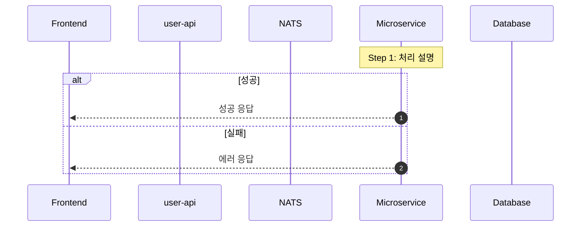
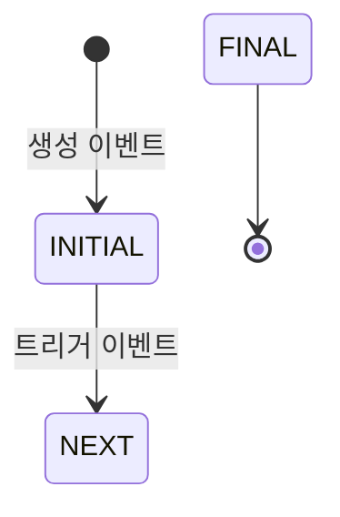

# 문서 작성 스킬 (Documentation Writing Skill)

Park Golf Platform 프로젝트의 문서 작성 시 일관성과 품질을 보장하기 위한 가이드입니다.

---

## 1. 문서 작성 원칙

### 1.1 언어 규칙

| 규칙 | 설명 | 예시 |
|------|------|------|
| **본문** | 한국어 작성 | "예약 시스템은 Saga 패턴을 사용합니다" |
| **기술 용어** | 영문 원어 유지 | Saga, NATS, JWT, Socket.IO, Outbox |
| **코드 블록** | 영문 (코드 그대로) | `booking.create`, `slot.reserve` |
| **주석/설명** | 한국어 허용 | `// 멱등성 키 확인` |
| **제목** | 한국어 + 영문 혼용 | "예약 데이터 플로우 (Booking Data Flow)" |

### 1.2 파일명 규칙

| 유형 | 규칙 | 예시 |
|------|------|------|
| 아키텍처/워크플로우 | `UPPER_SNAKE_CASE.md` | `DATA_FLOW.md`, `BOOKING-WORKFLOW.md` |
| 정책/가이드 | `kebab-case.md` | `account-deletion-policy.md` |
| 스킬 파일 | `SKILL.md` (고정) | `.claude/skills/*/SKILL.md` |

### 1.3 문서 구조

모든 문서는 다음 구조를 따릅니다:

```markdown
# 문서 제목

> 버전: X.Y
> 최종 수정: YYYY-MM-DD

## 목차

1. [섹션 1](#1-섹션-1)
2. [섹션 2](#2-섹션-2)
...

---

## 1. 섹션 1

내용...

---

## 변경 이력

| 버전 | 날짜 | 변경 내용 |
|------|------|----------|
| 1.0 | YYYY-MM-DD | 초안 작성 |
```

**필수 요소:**
- 번호 매긴 목차(TOC) + 앵커 링크
- 섹션 간 `---` 구분선
- 버전 및 최종 수정일
- 변경 이력 테이블

---

## 2. 문서 유형별 템플릿

### 2.1 Architecture 문서

시스템 구조와 기술적 결정을 설명하는 문서.

```markdown
# {시스템명} Architecture

## 1. 개요
- 시스템 목적 및 설계 원칙
- 주요 구성 요소 테이블

## 2. 시스템 아키텍처 다이어그램
- graph TB: 전체 시스템 구조
- 레이어별 분류 (Client, BFF, Service, Infra)

## 3. 서비스 상세
- 서비스별 역할, 기술 스택, DB, API 패턴

## 4. 통신 패턴
- 동기(REST) vs 비동기(NATS) 구분
- 메시지 패턴 카탈로그

## 5. 데이터베이스 아키텍처
- erDiagram: 테이블 관계도
- 서비스별 DB 분리 전략

## 6. 배포 아키텍처
- 인프라 구조 (GKE, Firebase)
- CI/CD 파이프라인
```

### 2.2 Workflow 문서

비즈니스 프로세스와 데이터 흐름을 설명하는 문서.

```markdown
# {도메인} Workflow

## 1. 개요
- 주요 구성 요소 및 역할 테이블
- 사용 기술

## 2. 시스템 아키텍처
- flowchart TB: 서비스 간 관계

## 3. 상태 정의
- stateDiagram-v2: 상태 전이
- 상태별 설명 테이블

## 4. 주요 흐름
- sequenceDiagram: 단계별 시퀀스
- 단계별 코드 예시 (TypeScript)

## 5. 예외 처리
- 실패 시나리오 및 보상 트랜잭션
- 재시도/타임아웃 설정

## 6. 모니터링
- 로그 태그 및 예시
- 성능 메트릭
```

### 2.3 Standards 문서

디자인 시스템, 코딩 규칙 등 표준을 정의하는 문서.

```markdown
# {영역} Standards

## 1. 원칙
- 핵심 디자인/설계 원칙

## 2. 플랫폼 개요
- mindmap: 플랫폼별 구성 요소 분류

## 3. 토큰/규칙 정의
- 비교 테이블: 플랫폼별 매핑
- 소스 파일 경로 참조

## 4. 컴포넌트 목록
- 매트릭스 테이블: 플랫폼별 구현체 매핑
- 코드 예시 (플랫폼별)

## 5. 구현 가이드
- 파일 위치 참조 테이블
```

### 2.4 Policy 문서

규정 및 정책을 정의하는 문서.

```markdown
# {정책명}

## 1. 목적
- 법적 근거 (GDPR, 개인정보보호법 등)

## 2. 적용 범위
- 대상 서비스/데이터

## 3. 데이터 처리 규칙
- 수집/저장/삭제 규칙 테이블

## 4. 프로세스
- flowchart: 처리 흐름
- 예외 상황 대응
```

---

## 3. Mermaid 다이어그램 가이드

### 3.1 다이어그램 타입 선택

| 용도 | 다이어그램 타입 | 사용 예시 |
|------|---------------|----------|
| 시스템 구조 | `graph TB` / `graph LR` | 전체 아키텍처, 서비스 간 관계 |
| 요청/응답 흐름 | `sequenceDiagram` | API 호출, Saga 흐름, 인증 |
| 상태 전이 | `stateDiagram-v2` | 예약 상태, 이벤트 상태 |
| DB 관계 | `erDiagram` | 테이블 관계도 |
| 분류/계층 | `mindmap` | 플랫폼 구성, 기능 분류 |
| 일정 | `gantt` | 로드맵, 마일스톤 |
| 조건 분기 | `flowchart TB` | 알림 채널 선택, 권한 체크 |

### 3.2 스타일 규칙

```mermaid
%% 컬러 팔레트 (프로젝트 표준)
%% Frontend:  fill:#4fc3f7 (하늘색)
%% BFF:       fill:#ffb74d (주황색)
%% Service:   fill:#ba68c8 (보라색)
%% Data:      fill:#81c784 (초록색)
%% Message:   fill:#f06292 (분홍색)
%% Ingress:   fill:#42a5f5 (파란색)
```

**규칙:**
- subgraph로 레이어/도메인 그룹화
- 동기 통신: 실선 화살표 (`-->`, `->>`)
- 비동기 통신: 점선 화살표 (`-.->`, `-->>`)
- 노드 레이블에 서비스명 + 기술 표기 (예: `IAM[IAM Service<br/>NestJS]`)
- classDef로 레이어별 색상 통일

### 3.3 sequenceDiagram 규칙



### 3.4 stateDiagram 규칙



---

## 4. 테이블 작성 규칙

### 4.1 비교 테이블

플랫폼/서비스 간 비교 시 사용:

```markdown
| 항목 | Admin Web | User Web | iOS | Android |
|------|-----------|----------|-----|---------|
| Primary | #2563EB | #10B981 | .parkPrimary | ParkPrimary |
```

### 4.2 설정값 테이블

```markdown
| 설정 | 값 | 서비스 | 용도 |
|------|-----|--------|------|
| `POLL_INTERVAL_MS` | 1,000ms | booking | Outbox 폴링 주기 |
```

### 4.3 API 패턴 테이블

```markdown
| 패턴 | 타입 | 서비스 | 설명 |
|------|------|--------|------|
| `booking.create` | Request-Reply | booking-service | 예약 생성 |
```

---

## 5. 코드 예시 규칙

### 5.1 TypeScript (Backend)

```typescript
// 파일 경로 주석 포함
// services/booking-service/src/booking.service.ts

// 핵심 로직만 발췌 (전체 코드 X)
async createBooking(dto: CreateBookingDto): Promise<Booking> {
  // 1. 멱등성 키 확인
  const existing = await this.checkIdempotency(dto.idempotencyKey);
  if (existing) return existing;

  // 2. 트랜잭션으로 예약 + Outbox 이벤트 생성
  return this.prisma.$transaction(async (tx) => {
    // ...
  });
}
```

### 5.2 Swift (iOS)

```swift
// Sources/Features/Booking/BookingViewModel.swift

@MainActor
class BookingViewModel: ObservableObject {
    func createBooking() async {
        // ViewModel에서 API 호출
    }
}
```

### 5.3 Kotlin (Android)

```kotlin
// presentation/booking/BookingViewModel.kt

@HiltViewModel
class BookingViewModel @Inject constructor(
    private val repository: BookingRepository
) : ViewModel() {
    // ...
}
```

---

## 6. 상호 참조 규칙

### 6.1 문서 간 링크

```markdown
<!-- 같은 docs/ 내 문서 -->
자세한 내용은 [예약 워크플로우](./BOOKING-WORKFLOW.md)를 참조하세요.

<!-- 루트 기준 링크 -->
프로젝트 규칙은 [CLAUDE.md](/CLAUDE.md)를 참조하세요.

<!-- 특정 섹션 링크 -->
[Saga 패턴](./BOOKING-WORKFLOW.md#4-saga-트랜잭션-흐름)을 참조하세요.
```

### 6.2 소스 코드 참조

```markdown
<!-- 파일 경로 참조 -->
- **소스**: `services/booking-service/src/outbox-processor.service.ts`
- **설정**: `services/booking-service/src/booking.constants.ts`
```

---

## 7. 품질 체크리스트

문서 작성 완료 후 다음 항목을 확인합니다:

| # | 항목 | 확인 |
|---|------|------|
| 1 | 목차(TOC)의 앵커 링크가 모두 동작하는가? | |
| 2 | Mermaid 다이어그램이 GitHub에서 렌더링되는가? | |
| 3 | 코드 블록에 언어 태그가 지정되어 있는가? (```typescript, ```swift 등) | |
| 4 | 테이블이 깨지지 않고 정렬되는가? | |
| 5 | 한국어 본문 + 영문 기술 용어 규칙을 따르는가? | |
| 6 | 버전 번호와 최종 수정일이 업데이트되었는가? | |
| 7 | 변경 이력 테이블에 현재 변경사항이 기록되었는가? | |
| 8 | 소스 코드 참조 경로가 실제 파일과 일치하는가? | |
| 9 | 다른 문서로의 상호 참조 링크가 유효한가? | |
| 10 | 다이어그램 컬러 팔레트가 프로젝트 표준을 따르는가? | |

---

## 8. 기존 문서 목록

현재 프로젝트의 문서 체계:

| 문서 | 경로 | 내용 |
|------|------|------|
| 시스템 아키텍처 | `docs/ARCHITECTURE.md` | 전체 시스템 구조, 서비스 상세 |
| 예약 워크플로우 | `docs/BOOKING-WORKFLOW.md` | Saga 패턴, 분산 트랜잭션 |
| 채팅 워크플로우 | `docs/CHAT_WORKFLOW.md` | Socket.IO 이벤트, 실시간 메시징 |
| 알림 워크플로우 | `docs/NOTIFICATION-WORKFLOW.md` | 다채널 알림 시스템 |
| 보안 워크플로우 | `docs/SECURITY_WORKFLOW.md` | 인증, 인가, RBAC |
| 데이터 플로우 | `docs/DATA_FLOW.md` | 크로스 서비스 데이터 흐름 |
| UI 표준 | `docs/UI_STANDARDS.md` | 4개 플랫폼 디자인 시스템 |
| GCP 인프라 | `docs/GCP_INFRASTRUCTURE.md` | GKE Autopilot 구성 |
| CI/CD 가이드 | `docs/CICD_GUIDE.md` | GitHub Actions 워크플로우 |
| 멤버십 전략 | `docs/MEMBERSHIP_TIER_STRATEGY.md` | 회원 등급 설계 |
| 계정 삭제 정책 | `docs/account-deletion-policy.md` | GDPR, 데이터 삭제 |
| 로드맵 | `docs/ROADMAP.md` | 제품 로드맵 |
| 개발 규칙 | `CLAUDE.md` | 코드 컨벤션, 프로젝트 규칙 |
