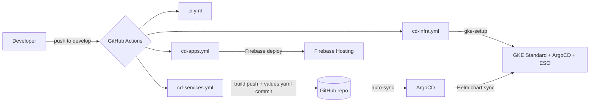

# GitHub Actions Workflows

Park Golf Platform CI/CD 파이프라인 — **GitOps (ArgoCD + Helm + External Secrets)**

## Workflows

| 파일 | 용도 | 트리거 |
|------|------|--------|
| `ci.yml` | CI (lint, type-check, test, build, security-scan) | Manual |
| `cd-infra.yml` | 인프라 — Network(Terraform) + GKE Standard + ArgoCD/ESO | Manual |
| `cd-services.yml` | 백엔드 image build → values.yaml commit (ArgoCD가 sync) | Manual |
| `cd-apps.yml` | 프론트엔드 → Firebase Hosting | Manual |

---

## 0. 전체 흐름



---

## 1. CI Pipeline (`ci.yml`)

```bash
Actions > CI Pipeline > Run workflow
  - target: all / apps / services
```

| 단계 | 설명 |
|------|------|
| Lint | ESLint |
| Type check | tsc --noEmit (apps + services) |
| Test | Jest (--passWithNoTests) |
| Build | Vite / Nest build |
| Security | Trivy scan (CRITICAL/HIGH) |

`concurrency`: 같은 ref의 동시 실행 시 이전 cancel.

---

## 2. Infrastructure (`cd-infra.yml`)

```bash
Actions > CD Infrastructure > Run workflow
  - environment: dev / prod
  - action: status / network-apply / gke-setup / gke-update / gke-destroy / network-destroy
  - confirm: "destroy" (삭제 시 필수)
```

### Actions

| Action | 설명 |
|--------|------|
| `status` | VPC + GKE 클러스터 + 네임스페이스 워크로드 상태 |
| `network-apply` | VPC/Subnet 생성 (Terraform, `infra/environments/{env}/`) |
| `gke-setup` | **GKE Standard 클러스터 + ArgoCD/ESO 설치 + GCP Secret Manager 시드 + ArgoCD Application 적용** |
| `gke-update` | GCP Secret Manager 키 갱신 + ESO 재시작 + ArgoCD hard-refresh |
| `gke-destroy` | GKE 클러스터 + Static IP + 고아 PVC 디스크 삭제 (VPC/Artifact Registry/GCP SM 보존) |
| `network-destroy` | VPC/Subnet 삭제 (Terraform destroy) |

### gke-setup이 만드는 것

```
GCP:
  - Artifact Registry (parkgolf)
  - GKE Standard cluster (zonal asia-northeast3-a, e2-standard-2, autoscale 1-3)
  - Workload Identity SA (parkgolf-eso)
  - GCP Secret Manager 키 10개 (parkgolf-{env}-*)

K8s (자동 sync):
  - argocd 네임스페이스 + ArgoCD 컴포넌트
  - external-secrets 네임스페이스 + ESO controller (KSA → GCP SA)
  - parkgolf-{env} 네임스페이스 (ArgoCD Application이 생성)
  - 그 외 모든 워크로드: ArgoCD가 Helm chart(k8s/charts/parkgolf/)로 동기화
```

`concurrency`: `cd-infra-{env}` (cancel-in-progress: false)

---

## 3. Backend Services (`cd-services.yml`)

```bash
Actions > CD Services > Run workflow
  - environment: dev / prod
  - services:    all / iam-service,admin-api (쉼표 구분)
```

### 동작

```
1. Build & Push (matrix per service)
   - docker build → Artifact Registry push
   - tags: ${github.sha}, ${env}-latest

2. Update Manifest
   - yq -i '.global.image.tag = "${sha}"' k8s/charts/parkgolf/values.yaml
   - git commit -m "chore(cd): bump image tag ..." [skip ci]
   - git push

3. ArgoCD가 새 commit 감지 → 자동 sync (5분 이내) → pod rolling update
```

| 변수 | 값 |
|------|------|
| Registry | `asia-northeast3-docker.pkg.dev/parkgolf-uniyous/parkgolf` |
| Helm values | `k8s/charts/parkgolf/values.yaml` |
| permissions | `contents: write` (manifest auto-commit) |

`concurrency`: `cd-services-{env}` (cancel-in-progress: false)

---

## 4. Frontend Apps (`cd-apps.yml`)

```bash
Actions > CD Apps > Run workflow
  - environment: dev / prod
  - apps:        all / admin-dashboard,user-app-web
```

| App | Firebase Site |
|------|---------------|
| admin-dashboard | `parkgolf-admin{-dev}` |
| platform-dashboard | `parkgolf-platform{-dev}` |
| user-app-web | `parkgolf-user{-dev}` |

빌드 환경변수: `VITE_API_URL`, `VITE_CHAT_SOCKET_URL`, `VITE_TOSS_CLIENT_KEY`, `VITE_KAKAO_JS_KEY`.

`concurrency`: `cd-apps-{env}` (cancel-in-progress: true)

---

## 5. Required GitHub Secrets

| 키 | 설명 |
|----|------|
| `GCP_SA_KEY` | GitHub Actions용 GCP 서비스 계정 JSON |
| `DB_PASSWORD` | PostgreSQL 비밀번호 |
| `JWT_SECRET` / `JWT_REFRESH_SECRET` | JWT 서명 키 |
| `TOSS_SECRET_KEY` / `TOSS_SECURITY_KEY` / `TOSS_CLIENT_KEY` | 토스페이먼츠 |
| `KMA_API_KEY` | 기상청 API |
| `KAKAO_API_KEY` / `KAKAO_JS_KEY` | 카카오 |
| `DEEPSEEK_API_KEY` | DeepSeek |
| `PARTNER_ENCRYPTION_KEY` | 파트너 암호화 |

GHA SA 필요 권한:
`container.admin`, `artifactregistry.admin`, `compute.admin`, `iam.serviceAccountAdmin`, `iam.serviceAccountUser`, `resourcemanager.projectIamAdmin`, `secretmanager.admin`, `storage.admin`, `servicenetworking.networksAdmin`, `vpcaccess.admin`, `firebasehosting.admin`

---

## 6. 실행 순서 (최초 환경 구축)

```
1. cd-infra > network-apply           # VPC + Subnet
2. cd-infra > gke-setup               # GKE + ArgoCD + ESO + Application
3. cd-services > all                  # 이미지 빌드 + tag commit
   ↳ ArgoCD가 자동 sync
4. (선택) DB 백업 복원                 # docs/guides 참조
5. cd-apps > all                      # 프론트엔드
```

## 7. 운영 시나리오

| 작업 | 워크플로우 |
|------|------|
| 코드 변경 → 배포 | `cd-services` 또는 `cd-apps` |
| 시크릿 회전 | GitHub Secrets 갱신 → `cd-infra > gke-update` |
| 인프라 점검 | `cd-infra > status` |
| 클러스터 재생성 | `cd-infra > gke-destroy` → `gke-setup` |
| 전체 환경 폐기 | `gke-destroy` → `network-destroy` |

## 8. 참고 문서

- ArgoCD 접속: `docs/guides/argocd-access-guide.md`
- Helm chart: `k8s/charts/parkgolf/`
- ArgoCD Application: `k8s/argocd/application.yaml`
- 인프라 Terraform: `infra/environments/{env}/`
