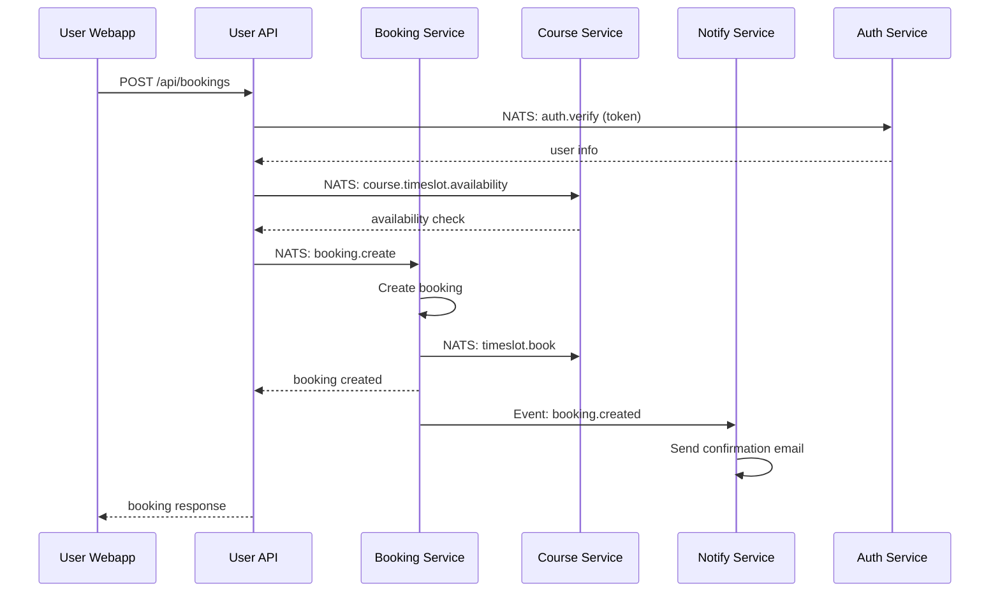
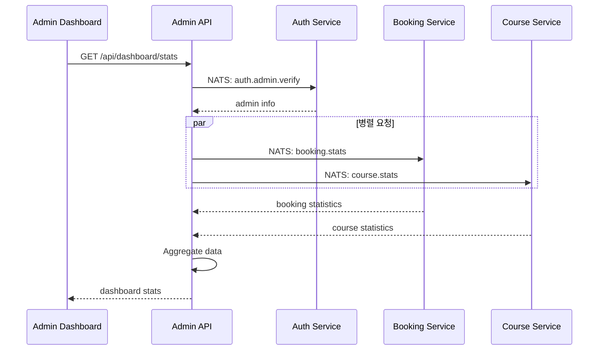
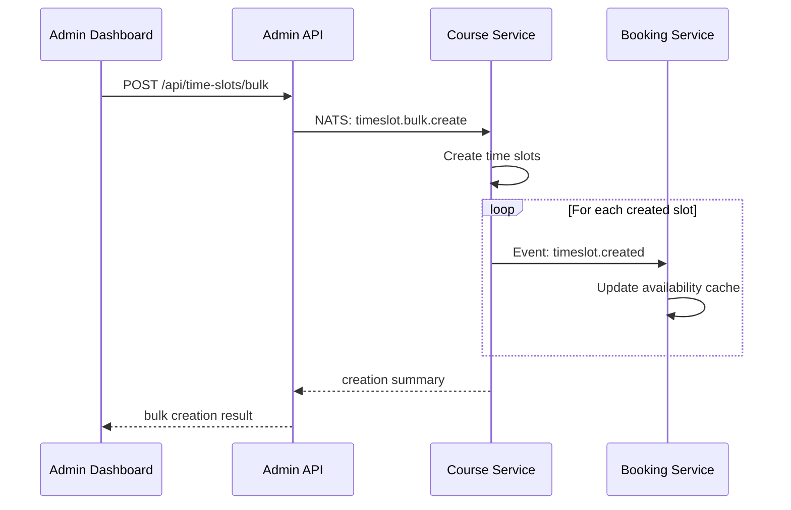

# Park Golf Platform - Service Communication Documentation

## 🔄 통신 아키텍처 개요

### 통신 패턴
1. **Synchronous Communication**: HTTP/REST API
2. **Asynchronous Communication**: NATS Messaging
3. **Client Communication**: WebSocket (향후 계획)

### 통신 원칙
- **Service Isolation**: 서비스 간 직접 DB 접근 금지
- **Event-Driven**: 비동기 이벤트 기반 데이터 동기화
- **Circuit Breaker**: 장애 전파 방지
- **Timeout Management**: 응답 시간 제한

## 📡 NATS 메시징 시스템

### 연결 설정
```typescript
// NATS 클라이언트 설정
const natsOptions = {
  servers: ['nats://localhost:4222'],
  reconnect: true,
  maxReconnectAttempts: 10,
  reconnectTimeWait: 1000,
};

const natsClient = await connect(natsOptions);
```

### 메시지 패턴

#### 1. Request-Reply Pattern
```typescript
// 서비스 A (요청자)
const response = await natsClient.request(
  'course.get',
  JSON.stringify({ courseId: 1 }),
  { timeout: 5000 }
);

// 서비스 B (응답자)
natsClient.subscribe('course.get', (msg) => {
  const { courseId } = JSON.parse(msg.data);
  const course = await courseService.findById(courseId);
  msg.respond(JSON.stringify(course));
});
```

#### 2. Publish-Subscribe Pattern
```typescript
// 이벤트 발행
natsClient.publish('booking.created', JSON.stringify({
  bookingId: 123,
  userId: 456,
  courseId: 789,
  bookingDate: '2024-07-13'
}));

// 이벤트 구독
natsClient.subscribe('booking.created', (msg) => {
  const booking = JSON.parse(msg.data);
  await notificationService.sendBookingConfirmation(booking);
});
```

## 🏗️ 서비스별 통신 인터페이스

### Auth Service

#### 제공하는 엔드포인트 (NATS)
```typescript
// 사용자 인증 검증
'auth.verify' -> { token: string } -> { valid: boolean, user?: User }

// 사용자 정보 조회
'auth.user.get' -> { userId: number } -> User | null

// 관리자 정보 조회
'auth.admin.get' -> { adminId: number } -> Admin | null

// 권한 검증
'auth.permission.check' -> { 
  adminId: number, 
  permission: string 
} -> { hasPermission: boolean }
```

#### 발행하는 이벤트
```typescript
// 사용자 생성
'user.created' -> {
  userId: number,
  email: string,
  name: string,
  roles: string[]
}

// 사용자 정보 업데이트
'user.updated' -> {
  userId: number,
  email?: string,
  name?: string,
  phone?: string
}

// 관리자 활동 로그
'admin.activity' -> {
  adminId: number,
  action: string,
  resource: string,
  details: any
}
```

### Course Service

#### 제공하는 엔드포인트 (NATS)
```typescript
// 코스 정보 조회
'course.get' -> { courseId: number } -> Course | null

// 타임슬롯 가용성 조회
'course.timeslot.availability' -> {
  courseId: number,
  date: string,
  timeSlot: string
} -> { available: boolean, remaining: number }

// 회사 정보 조회
'company.get' -> { companyId: number } -> Company | null
```

#### 발행하는 이벤트
```typescript
// 코스 생성
'course.created' -> {
  courseId: number,
  name: string,
  companyId: number,
  location: string
}

// 코스 정보 업데이트
'course.updated' -> {
  courseId: number,
  name?: string,
  location?: string,
  status?: string
}

// 타임슬롯 생성
'timeslot.created' -> {
  timeslotId: number,
  courseId: number,
  date: string,
  startTime: string,
  endTime: string,
  price: number
}

// 타임슬롯 예약됨
'timeslot.booked' -> {
  timeslotId: number,
  courseId: number,
  remainingSlots: number
}
```

### Booking Service

#### 제공하는 엔드포인트 (NATS)
```typescript
// 예약 정보 조회
'booking.get' -> { bookingId: number } -> Booking | null

// 사용자 예약 목록
'booking.user.list' -> { 
  userId: number, 
  limit?: number 
} -> Booking[]

// 예약 통계
'booking.stats' -> { 
  courseId?: number, 
  dateFrom: string, 
  dateTo: string 
} -> BookingStats
```

#### 발행하는 이벤트
```typescript
// 예약 생성
'booking.created' -> {
  bookingId: number,
  bookingNumber: string,
  userId: number,
  courseId: number,
  bookingDate: string,
  timeSlot: string,
  playerCount: number,
  totalPrice: number
}

// 예약 취소
'booking.cancelled' -> {
  bookingId: number,
  bookingNumber: string,
  reason: string,
  refundAmount: number
}

// 결제 완료
'payment.completed' -> {
  bookingId: number,
  paymentId: number,
  amount: number,
  paymentMethod: string
}
```

### Notify Service

#### 제공하는 엔드포인트 (NATS)
```typescript
// 알림 전송
'notification.send' -> {
  type: 'EMAIL' | 'SMS' | 'PUSH',
  recipient: string,
  templateId: string,
  data: any
} -> { sent: boolean, messageId?: string }

// 템플릿 조회
'notification.template.get' -> { 
  templateId: string 
} -> Template | null
```

#### 구독하는 이벤트
```typescript
// 예약 생성 시 확인 알림
'booking.created' -> 예약 확인 이메일/SMS 발송

// 예약 취소 시 알림
'booking.cancelled' -> 예약 취소 알림 발송

// 결제 완료 시 영수증
'payment.completed' -> 결제 영수증 발송

// 관리자 활동 알림
'admin.activity' -> 중요 활동에 대한 알림
```

## 🔄 통신 흐름 예시

### 1. 예약 생성 플로우


### 2. 관리자 대시보드 통계 조회


### 3. 타임슬롯 대량 생성


## 🛡️ 에러 처리 및 복구

### 1. Circuit Breaker 패턴
```typescript
class CircuitBreaker {
  private failures = 0;
  private lastFailTime = 0;
  private state: 'CLOSED' | 'OPEN' | 'HALF_OPEN' = 'CLOSED';

  async call<T>(operation: () => Promise<T>): Promise<T> {
    if (this.state === 'OPEN') {
      if (Date.now() - this.lastFailTime > this.timeout) {
        this.state = 'HALF_OPEN';
      } else {
        throw new Error('Circuit breaker is OPEN');
      }
    }

    try {
      const result = await operation();
      this.onSuccess();
      return result;
    } catch (error) {
      this.onFailure();
      throw error;
    }
  }
}
```

### 2. 재시도 메커니즘
```typescript
async function withRetry<T>(
  operation: () => Promise<T>,
  maxRetries = 3,
  delay = 1000
): Promise<T> {
  for (let attempt = 1; attempt <= maxRetries; attempt++) {
    try {
      return await operation();
    } catch (error) {
      if (attempt === maxRetries) throw error;
      await new Promise(resolve => setTimeout(resolve, delay * attempt));
    }
  }
}
```

### 3. 데드레터 큐
```typescript
// 실패한 메시지 처리
natsClient.subscribe('booking.created.failed', async (msg) => {
  const { originalMessage, error, retryCount } = JSON.parse(msg.data);
  
  if (retryCount < 3) {
    // 재시도
    setTimeout(() => {
      natsClient.publish('booking.created', originalMessage);
    }, Math.pow(2, retryCount) * 1000);
  } else {
    // 수동 처리를 위해 로그
    logger.error('Max retries exceeded', { originalMessage, error });
  }
});
```

## 📊 모니터링 및 추적

### 1. 요청 추적
```typescript
interface RequestContext {
  requestId: string;
  userId?: number;
  adminId?: number;
  timestamp: Date;
  service: string;
}

// 모든 NATS 요청에 컨텍스트 추가
const messageWithContext = {
  ...originalMessage,
  context: {
    requestId: generateRequestId(),
    timestamp: new Date(),
    service: 'booking-service'
  }
};
```

### 2. 성능 메트릭
```typescript
class PerformanceTracker {
  trackNatsRequest(subject: string, duration: number) {
    prometheus.histogram('nats_request_duration', {
      labels: { subject, service: process.env.SERVICE_NAME }
    }).observe(duration);
  }

  trackNatsError(subject: string, error: string) {
    prometheus.counter('nats_request_errors', {
      labels: { subject, error, service: process.env.SERVICE_NAME }
    }).inc();
  }
}
```

## 🔧 개발 및 테스트

### 1. NATS 테스트
```typescript
describe('Course Service NATS', () => {
  let natsClient: NatsConnection;

  beforeAll(async () => {
    natsClient = await connect({ servers: ['nats://localhost:4222'] });
  });

  it('should respond to course.get request', async () => {
    const response = await natsClient.request(
      'course.get',
      JSON.stringify({ courseId: 1 }),
      { timeout: 1000 }
    );

    const course = JSON.parse(response.data);
    expect(course).toHaveProperty('id', 1);
  });
});
```

### 2. 통합 테스트
```typescript
describe('Booking Creation Flow', () => {
  it('should create booking and send notification', async () => {
    // Mock NATS responses
    mockNatsResponse('course.timeslot.availability', { available: true });
    mockNatsResponse('auth.verify', { valid: true, user: mockUser });

    // Create booking
    const response = await request(app)
      .post('/api/bookings')
      .send(mockBookingData);

    expect(response.status).toBe(201);
    
    // Verify events were published
    expect(natsPublishSpy).toHaveBeenCalledWith(
      'booking.created',
      expect.any(String)
    );
  });
});
```

## 📈 성능 최적화

### 1. 메시지 배치 처리
```typescript
class BatchProcessor {
  private batch: any[] = [];
  private timer: NodeJS.Timeout;

  add(message: any) {
    this.batch.push(message);
    
    if (this.batch.length >= 100) {
      this.process();
    } else {
      this.resetTimer();
    }
  }

  private resetTimer() {
    clearTimeout(this.timer);
    this.timer = setTimeout(() => this.process(), 1000);
  }

  private async process() {
    const messages = this.batch.splice(0);
    await this.processBatch(messages);
  }
}
```

### 2. 연결 풀링
```typescript
class NatsConnectionPool {
  private connections: NatsConnection[] = [];
  private currentIndex = 0;

  async getConnection(): Promise<NatsConnection> {
    const connection = this.connections[this.currentIndex];
    this.currentIndex = (this.currentIndex + 1) % this.connections.length;
    return connection;
  }
}
```

---

*마지막 업데이트: 2025-07-13*