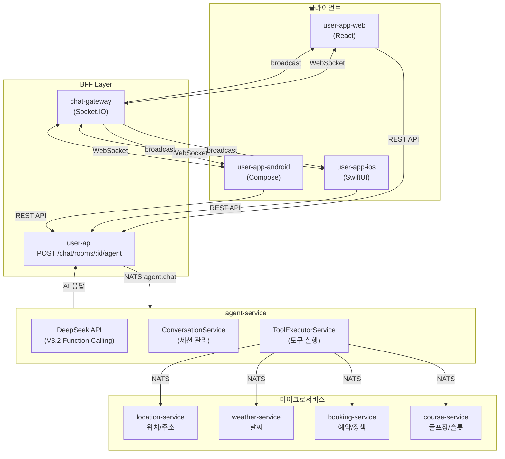
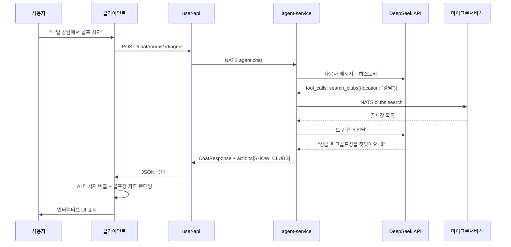
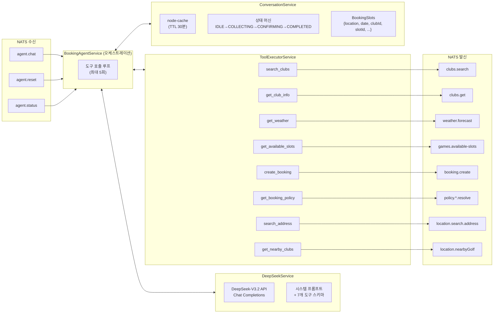
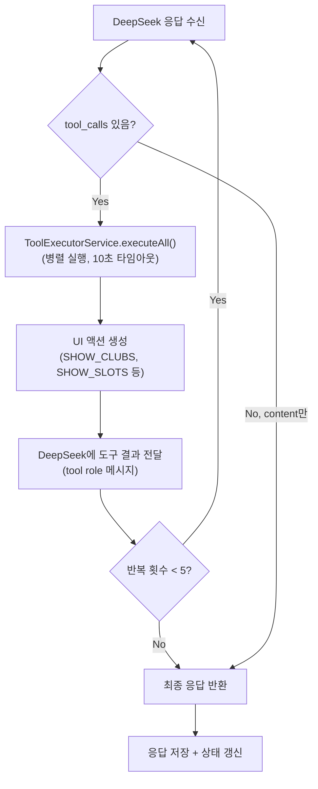
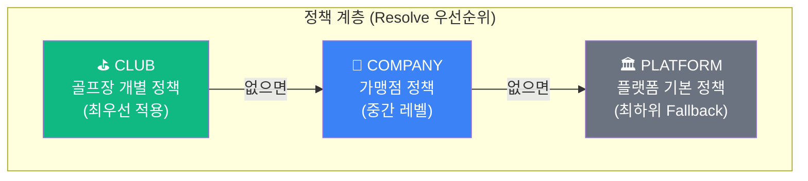
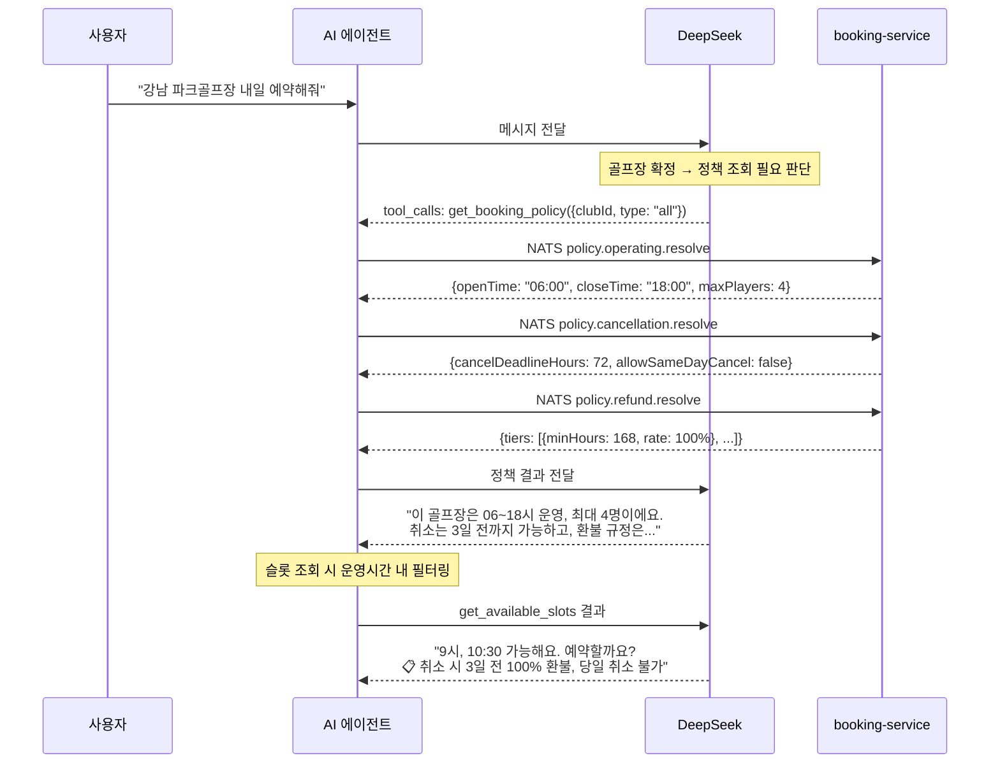
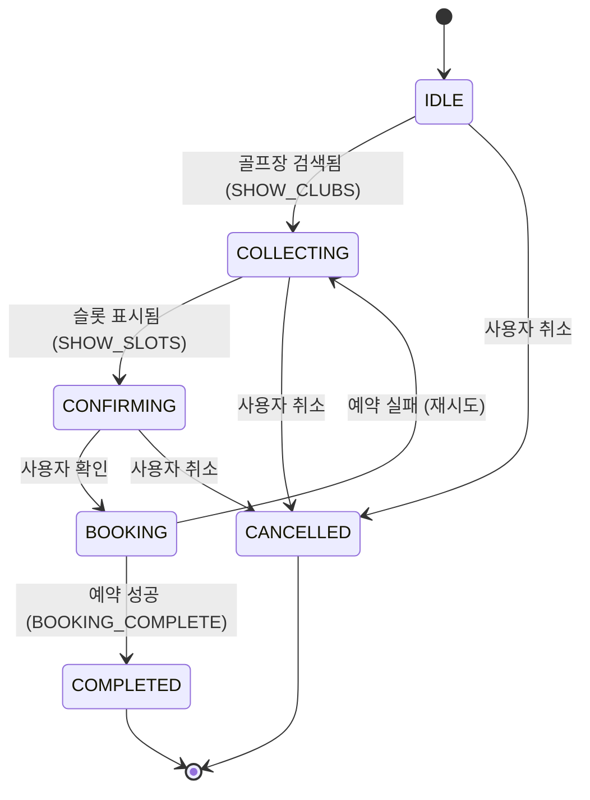

# AI 예약 에이전트 워크플로우

> 버전: 1.1
> 최종 수정: 2026-02-21
> 관련 문서: BOOKING_WORKFLOW.md, CHAT_WORKFLOW.md

## 목차

1. [개요](#1-개요)
2. [시스템 아키텍처](#2-시스템-아키텍처)
3. [agent-service 구조](#3-agent-service-구조)
4. [소스 레벨 처리 워크플로우](#4-소스-레벨-처리-워크플로우)
5. [DeepSeek Function Calling](#5-deepseek-function-calling)
6. [골프장별 부킹 정책](#6-골프장별-부킹-정책)
7. [대화 상태 머신](#7-대화-상태-머신)
8. [채팅방 통합 설계](#8-채팅방-통합-설계)
9. [클라이언트 UI 명세](#9-클라이언트-ui-명세)
10. [NATS 메시지 패턴](#10-nats-메시지-패턴)
11. [구현 범위](#11-구현-범위)
12. [향후 확장 (음성 입력)](#12-향후-확장-음성-입력)

---

## 1. 개요

### 1.1 목적

채팅방에서 친구들과 대화 중 **AI 예약 도우미 버튼**을 클릭하면, DeepSeek 기반 AI가 자연어로 예약을 도와주는 시스템입니다.

- 사용자가 "내일 강남 근처에서 골프 치고 싶어"라고 입력하면
- AI가 골프장 검색 → 날씨 확인 → 시간대 추천 → 예약 생성까지 자동 처리
- 채팅방 참여자 전원이 AI 대화를 볼 수 있어 예약 진행 상황 공유

### 1.2 핵심 구성 요소

| 서비스 | 역할 |
|--------|------|
| **agent-service** | DeepSeek-V3.2 + Function Calling, 대화 관리 |
| **user-api (BFF)** | REST → NATS 브릿지, AI 채팅 엔드포인트 |
| **chat-gateway** | WebSocket, AI 메시지 실시간 전달 |
| **chat-service** | 메시지 영속화 (BOOKING_INVITE 타입) |
| **course-service** | 골프장 검색, 타임슬롯 조회 |
| **booking-service** | 예약 생성 (Saga 패턴) |
| **weather-service** | 날씨 조회 |
| **location-service** | 주소 검색, 좌표 변환 |

### 1.3 사용 기술

| 영역 | 기술 |
|------|------|
| AI/LLM | DeepSeek-V3.2 + Function Calling (OpenAI 호환 API) |
| 세션 관리 | node-cache (메모리 기반, TTL 30분) |
| 메시징 | NATS (Request-Reply) |
| 실시간 | Socket.IO (채팅 메시지 브로드캐스트) |

---

## 2. 시스템 아키텍처

### 2.1 전체 흐름



### 2.2 메시지 처리 시퀀스



---

## 3. agent-service 구조

### 3.1 내부 아키텍처



### 3.3 모듈 구성

```
agent-service/
├── src/
│   ├── main.ts                     # HTTP :8088 + NATS 마이크로서비스
│   ├── app.module.ts
│   ├── booking-agent/
│   │   ├── booking-agent.module.ts
│   │   ├── controller/
│   │   │   └── booking-agent-nats.controller.ts   # 4 NATS 패턴
│   │   ├── dto/
│   │   │   └── chat.dto.ts                        # DTO 및 타입 정의
│   │   └── service/
│   │       ├── booking-agent.service.ts            # 오케스트레이션
│   │       ├── deepseek.service.ts                 # DeepSeek API 통합
│   │       ├── tool-executor.service.ts            # NATS 도구 실행
│   │       └── conversation.service.ts             # 세션 관리
│   └── common/                                     # 공통 인프라
│       ├── exceptions/
│       ├── nats/
│       ├── types/
│       └── controllers/health.controller.ts
├── Dockerfile
└── .env.example
```

### 3.4 서비스 역할

| 서비스 | 역할 | 상세 |
|--------|------|------|
| **BookingAgentService** | 오케스트레이션 | DeepSeek 호출 → 도구 실행 → 상태 갱신 루프 (최대 5회) |
| **DeepSeekService** | LLM 통합 | DeepSeek-V3.2, 시스템 프롬프트, Function Calling (OpenAI 호환) |
| **ToolExecutorService** | 도구 브릿지 | DeepSeek tool_calls → NATS 요청 변환, 병렬 실행 |
| **ConversationService** | 세션 관리 | node-cache 기반, 30분 TTL, 상태 머신 |

### 3.5 환경 변수

GitHub Environment (`dev` / `prod`)에 등록 후 CD 워크플로우에서 주입합니다.

#### Backend (K8s Secret / ConfigMap)

| 변수 | 저장소 | 설명 | 서비스 |
|------|--------|------|--------|
| `DEEPSEEK_API_KEY` | **Secret** `parkgolf-secrets` | DeepSeek API 키 | agent-service |
| `DEEPSEEK_API_URL` | ConfigMap `parkgolf-config` | `https://api.deepseek.com` | agent-service |
| `DEEPSEEK_MODEL` | ConfigMap `parkgolf-config` | `deepseek-chat` (V3.2) | agent-service |
| `CONVERSATION_TTL` | ConfigMap `parkgolf-config` | `1800` (30분, 세션 TTL) | agent-service |
| `NATS_URL` | ConfigMap `parkgolf-config` | NATS 서버 주소 (기존 공통) | 전 서비스 공통 |
| `PORT` | 하드코딩 | `8080` (K8s 배포 시 고정) | 전 서비스 공통 |

> `cd-services.yml`에 agent-service 배포 설정 추가 필요:
> - 서비스 목록에 `agent-service` 추가
> - `EXTRA_ENV` 섹션에 `DEEPSEEK_API_KEY` Secret 마운트 추가

#### Frontend (Vite 빌드 타임)

| 변수 | GitHub Secret/Var | 설명 | 앱 |
|------|-------------------|------|-----|
| `VITE_API_URL` | Environment Variable | BFF API URL | user-app-web |
| `VITE_CHAT_SOCKET_URL` | Environment Variable | WebSocket URL | user-app-web |

> iOS / Android는 빌드 시 `Configuration.swift` / `BuildConfig`로 주입되며,
> AI 채팅은 기존 API/Socket URL을 통해 동작하므로 추가 환경 변수 불필요.

#### 로컬 개발 (.env)

```env
# agent-service/.env
DEEPSEEK_API_KEY=sk-xxxxx
DEEPSEEK_API_URL=https://api.deepseek.com
DEEPSEEK_MODEL=deepseek-chat
NATS_URL=nats://localhost:4222
CONVERSATION_TTL=1800
PORT=8088
```

---

## 4. 소스 레벨 처리 워크플로우

agent-service는 **NestJS + Node.js** 환경에서 실행되는 마이크로서비스입니다. 사용자 메시지가 NATS를 통해 도착하면, 4개의 서비스 클래스를 거쳐 DeepSeek LLM 호출 → 도구 실행 → 상태 갱신 → 응답 반환까지 처리됩니다.

### 4.1 요청 수신 — BookingAgentNatsController

사용자가 AI 메시지를 보내면 user-api BFF가 `agent.chat` NATS 패턴으로 요청을 전달합니다.

```
클라이언트 → user-api (POST /chat/rooms/:roomId/agent)
           → NATS 'agent.chat' 발행
           → agent-service 수신
```

```typescript
// booking-agent-nats.controller.ts
@Controller()
export class BookingAgentNatsController {
  @MessagePattern('agent.chat')
  async chat(@Payload() data: ChatRequestDto) {
    //  data = { userId: 123, message: "내일 강남에서 골프 치자", conversationId?: "uuid" }
    const response = await this.agentService.chat(data);
    return NatsResponse.success(response);
  }
}
```

`ChatRequestDto`는 ValidationPipe(`whitelist`, `transform`, `forbidNonWhitelisted`)를 거쳐 자동 검증됩니다. 검증 실패 시 UnifiedExceptionFilter가 에러를 NATS RPC 형식으로 변환하여 반환합니다.

### 4.2 오케스트레이션 — BookingAgentService.chat()

메인 진입점입니다. 대화 컨텍스트 관리와 LLM 호출 루프를 조율합니다.

```typescript
// booking-agent.service.ts
async chat(request: ChatRequestDto): Promise<ChatResponseDto> {
  const { userId, message, conversationId } = request;

  // ① 대화 컨텍스트 가져오기 (없으면 새로 생성)
  const context = this.conversationService.getOrCreate(userId, conversationId);

  // ② 사용자 메시지를 대화 히스토리에 추가
  this.conversationService.addUserMessage(context, message);

  // ③ DeepSeek LLM 처리 (도구 호출 루프 포함)
  const response = await this.processWithGemini(context);

  // ④ 최종 응답 구성
  return {
    conversationId: context.conversationId,
    message: response.text || '',
    state: context.state,       // IDLE | COLLECTING | CONFIRMING | ...
    actions: response.actions,  // UI 카드 액션 배열
  };
}
```

**에러 발생 시:**

```typescript
catch (error) {
  const errorMessage = '죄송해요, 잠시 문제가 발생했어요. 다시 시도해 주세요.';
  this.conversationService.addAssistantMessage(context, errorMessage);
  return { conversationId, message: errorMessage, state: context.state };
}
```

LLM API 장애, 네트워크 오류 등 어떤 예외가 발생해도 사용자에게는 친절한 한국어 에러 메시지가 반환되며, 대화 세션은 유지됩니다.

### 4.3 LLM 처리 루프 — processWithGemini()

DeepSeek API 호출과 도구 실행을 반복하는 핵심 루프입니다. "processWithGemini"라는 이름은 Gemini에서 DeepSeek으로 마이그레이션한 흔적이며, 내부적으로는 DeepSeekService를 호출합니다.

```typescript
// booking-agent.service.ts
private async processWithGemini(context: ConversationContext) {
  // 최근 20개 메시지만 LLM에 전달 (컨텍스트 윈도우 절약)
  const messages = this.conversationService.getRecentMessages(context);
  let llmResponse: DeepSeekResponse;
  let iterations = 0;
  let allActions: ChatAction[] = [];

  // ──────── 1단계: 초기 LLM 호출 ────────
  llmResponse = await this.deepseekService.chat(messages);

  // ──────── 2단계: 도구 호출 루프 (최대 5회) ────────
  while (llmResponse.toolCalls && llmResponse.toolCalls.length > 0) {
    if (iterations >= 5) break;   // MAX_TOOL_ITERATIONS = 5

    // 2-a. 모든 도구를 병렬 실행
    const toolResults = await this.executeTools(llmResponse.toolCalls);

    // 2-b. 도구 결과 → UI 액션 생성
    const actions = this.createActionsFromToolResults(llmResponse.toolCalls, toolResults);
    allActions = [...allActions, ...actions];

    // 2-c. 대화 슬롯 업데이트 (수집된 예약 정보)
    this.updateSlotsFromToolResults(context, llmResponse.toolCalls, toolResults);

    // 2-d. 도구 결과를 포함하여 LLM 재호출
    llmResponse = await this.deepseekService.continueWithToolResults(
      messages,
      llmResponse.toolCalls,
      toolResults.map((tr) => ({ name: tr.name, result: tr.result }))
    );

    iterations++;
  }

  // ──────── 3단계: 최종 응답 처리 ────────
  if (llmResponse.text) {
    this.conversationService.addAssistantMessage(context, llmResponse.text);
  }

  // 대화 상태 전이 (액션 기반)
  this.updateStateFromResponse(context, llmResponse, allActions);

  return { text: llmResponse.text || '', actions: allActions.length > 0 ? allActions : undefined };
}
```

#### 루프 실행 예시: "내일 강남 골프장 예약해줘"

```
[Iteration 0 - 초기 호출]
  → DeepSeekService.chat(messages)
  ← toolCalls: [search_clubs({location: "강남"})]

[Iteration 1 - 골프장 검색]
  → ToolExecutor.executeAll([search_clubs])
    → NATS 'clubs.search' → course-service
    ← { found: 3, clubs: [{id, name, address}...] }
  → createActions → SHOW_CLUBS 액션 생성
  → DeepSeekService.continueWithToolResults(messages, toolCalls, results)
  ← toolCalls: [get_weather({clubId, date}), get_available_slots({clubId, date})]

[Iteration 2 - 날씨 + 슬롯 조회 (병렬)]
  → ToolExecutor.executeAll([get_weather, get_available_slots])
    → NATS 'clubs.get' → course-service (좌표 획득)
    → NATS 'weather.forecast' → weather-service
    → NATS 'games.available-slots' → course-service
  → createActions → SHOW_WEATHER, SHOW_SLOTS 액션 생성
  → DeepSeekService.continueWithToolResults(...)
  ← text: "강남 파크골프장 내일 예약 가능한 시간이에요! 🏌️"
     toolCalls: undefined (도구 호출 없음 → 루프 종료)

[루프 종료]
  → addAssistantMessage("강남 파크골프장 내일 예약 가능한 시간이에요!")
  → updateStateFromResponse → CONFIRMING (SHOW_SLOTS 존재)
  → return { text, actions: [SHOW_CLUBS, SHOW_WEATHER, SHOW_SLOTS] }
```

### 4.4 DeepSeek API 호출 — DeepSeekService

OpenAI 호환 API를 사용하여 DeepSeek-V3.2를 호출합니다.

#### 4.4.1 초기화 (`onModuleInit`)

```typescript
// deepseek.service.ts
onModuleInit() {
  const apiKey = this.configService.get<string>('DEEPSEEK_API_KEY');
  const baseURL = this.configService.get<string>('DEEPSEEK_API_URL')
    || 'https://api.deepseek.com';
  this.model = this.configService.get<string>('DEEPSEEK_MODEL') || 'deepseek-chat';

  this.client = new OpenAI({ apiKey, baseURL });
}
```

- `openai` npm 패키지를 사용하되, `baseURL`을 DeepSeek으로 오버라이드
- NestJS `OnModuleInit` 라이프사이클 훅에서 클라이언트를 초기화

#### 4.4.2 초기 대화 호출 (`chat`)

```typescript
// deepseek.service.ts
async chat(
  messages: Array<{ role: 'user' | 'assistant'; content: string }>
): Promise<DeepSeekResponse> {
  const chatMessages: ChatCompletionMessageParam[] = [
    { role: 'system', content: this.systemPrompt },  // 시스템 프롬프트 (항상 첫 번째)
    ...messages,                                      // 최근 20개 대화 히스토리
  ];

  const response = await this.client.chat.completions.create({
    model: this.model,          // 'deepseek-chat'
    messages: chatMessages,
    tools: this.tools,          // 8개 도구 스키마 (OpenAI ChatCompletionTool 형식)
    tool_choice: 'auto',        // LLM이 도구 호출 여부를 자동 판단
  });

  return this.parseChoice(response.choices[0]);
}
```

#### 4.4.3 도구 결과 포함 재호출 (`continueWithToolResults`)

```typescript
// deepseek.service.ts
async continueWithToolResults(
  messages: Array<{ role: 'user' | 'assistant'; content: string }>,
  toolCalls: ToolCall[],
  toolResults: Array<{ name: string; result: unknown }>
): Promise<DeepSeekResponse> {
  const chatMessages: ChatCompletionMessageParam[] = [
    { role: 'system', content: this.systemPrompt },
    ...messages,
  ];

  // ① assistant 메시지에 tool_calls 첨부 (LLM이 호출한 도구 기록)
  chatMessages.push({
    role: 'assistant',
    content: null,
    tool_calls: toolCalls.map((tc, i) => ({
      id: `call_${i}`,
      type: 'function',
      function: { name: tc.name, arguments: JSON.stringify(tc.args) },
    })),
  });

  // ② 각 도구의 실행 결과를 tool role 메시지로 추가
  toolResults.forEach((tr, i) => {
    chatMessages.push({
      role: 'tool',
      tool_call_id: `call_${i}`,
      content: JSON.stringify(tr.result),
    });
  });

  // ③ 도구 결과를 포함하여 LLM 재호출
  const response = await this.client.chat.completions.create({
    model: this.model,
    messages: chatMessages,
    tools: this.tools,
    tool_choice: 'auto',
  });

  return this.parseChoice(response.choices[0]);
}
```

**메시지 구조 예시 (2번째 LLM 호출 시):**

```json
[
  { "role": "system", "content": "당신은 파크골프장 예약을 도와주는..." },
  { "role": "user", "content": "내일 강남에서 골프 치자" },
  {
    "role": "assistant",
    "content": null,
    "tool_calls": [{ "id": "call_0", "function": { "name": "search_clubs", "arguments": "{\"location\":\"강남\"}" }}]
  },
  {
    "role": "tool",
    "tool_call_id": "call_0",
    "content": "{\"found\":3,\"clubs\":[{\"id\":\"club-1\",\"name\":\"강남 파크골프장\",...}]}"
  }
]
```

#### 4.4.4 응답 파싱 (`parseChoice`)

```typescript
// deepseek.service.ts
private parseChoice(choice: ChatCompletion.Choice): DeepSeekResponse {
  const message = choice.message;

  // tool_calls 배열을 ToolCall 형태로 변환
  const parsedToolCalls: ToolCall[] | undefined = message.tool_calls?.map((tc) => ({
    name: tc.function.name,
    args: JSON.parse(tc.function.arguments),
  }));

  return {
    text: message.content || undefined,          // AI 텍스트 응답 (없을 수 있음)
    toolCalls: parsedToolCalls?.length ? parsedToolCalls : undefined,  // 도구 호출 배열
    finishReason: choice.finish_reason || 'stop', // 'stop' | 'tool_calls'
  };
}
```

**DeepSeek 응답의 두 가지 패턴:**

| `finish_reason` | `content` | `tool_calls` | 의미 |
|---|---|---|---|
| `stop` | `"강남 골프장을 찾아볼게요!"` | `undefined` | 텍스트만 응답 (루프 종료) |
| `tool_calls` | `null` 또는 일부 텍스트 | `[{name, args}]` | 도구 호출 필요 (루프 계속) |

### 4.5 도구 실행 — ToolExecutorService

DeepSeek이 반환한 `tool_calls`를 실제 마이크로서비스 NATS 호출로 변환합니다.

#### 4.5.1 병렬 실행

```typescript
// tool-executor.service.ts
async executeAll(toolCalls: ToolCall[]): Promise<ToolResult[]> {
  return Promise.all(toolCalls.map((tc) => this.execute(tc)));
}
```

- `Promise.all`로 모든 도구를 **동시 병렬 실행** (예: `get_weather` + `get_available_slots`)
- 각 도구의 NATS 호출에 **10초 타임아웃** 적용

#### 4.5.2 도구 라우팅 (switch 분기)

```typescript
// tool-executor.service.ts
private async executeToolCall(toolCall: ToolCall): Promise<unknown> {
  switch (toolCall.name) {
    case 'search_clubs':         return this.searchClubs(toolCall.args);
    case 'get_club_info':        return this.getClubInfo(toolCall.args);
    case 'get_weather':          return this.getWeather(toolCall.args);
    case 'get_available_slots':  return this.getAvailableSlots(toolCall.args);
    case 'create_booking':       return this.createBooking(toolCall.args);
    case 'get_booking_policy':   return this.getBookingPolicy(toolCall.args);
    case 'search_address':       return this.searchAddress(toolCall.args);
    case 'get_nearby_clubs':     return this.getNearbyClubs(toolCall.args);
    default: throw new Error(`Unknown tool: ${toolCall.name}`);
  }
}
```

#### 4.5.3 NATS 호출 패턴

모든 도구는 동일한 패턴으로 NATS 마이크로서비스를 호출합니다:

```typescript
// 공통 패턴: firstValueFrom + send + timeout + catchError
const response = await firstValueFrom(
  this.courseClient.send('clubs.search', { location, name }).pipe(
    timeout(10000),          // 10초 타임아웃
    catchError((err) => {
      throw new Error(`Failed to search clubs: ${err.message}`);
    }),
  ),
);
```

| NATS Client | 주입 토큰 | 대상 서비스 |
|---|---|---|
| `this.courseClient` | `COURSE_SERVICE` | course-service |
| `this.bookingClient` | `BOOKING_SERVICE` | booking-service |
| `this.weatherClient` | `WEATHER_SERVICE` | weather-service |
| `this.locationClient` | `LOCATION_SERVICE` | location-service |

#### 4.5.4 도구별 NATS 호출 및 응답 변환

**`search_clubs`** — 골프장 검색

```
NATS: clubs.search → course-service
Args: { location: "강남", name?: "파크골프장" }
Response 변환:
  response.data (Club[]) → { found: number, clubs: [{id, name, address, region}] }
  최대 5개로 슬라이스
```

**`get_weather`** — 날씨 조회 (2단계 호출)

```
1단계: NATS clubs.get → course-service (골프장 좌표 획득)
2단계: NATS weather.forecast → weather-service (좌표 기반 날씨)
Response 변환:
  { date, clubName, temperature, humidity, sky, precipitation, windSpeed, recommendation }

recommendation 생성 로직:
  - precipitation > 0  → "비가 예보되어 있어요. 우산을 챙기시거나 다른 날을 추천드려요."
  - temperature < 5    → "추운 날씨예요. 따뜻하게 입고 오시면 좋겠어요."
  - temperature > 30   → "더운 날씨예요. 이른 아침이나 저녁 시간대를 추천드려요."
  - 그 외              → "골프 치기 좋은 날씨예요!"
```

**`get_available_slots`** — 시간대 조회

```
NATS: games.available-slots → course-service
Args: { clubId, date, timePreference?: 'morning'|'afternoon'|'evening' }

timePreference 필터:
  morning   → hour >= 6 && hour < 12
  afternoon → hour >= 12 && hour < 17
  evening   → hour >= 17 && hour < 21

Response 변환:
  { date, availableCount, slots: [{id, time, endTime, availableSpots, price, courseName}] }
  최대 10개로 슬라이스
```

**`create_booking`** — 예약 생성

```
NATS: booking.create → booking-service
Args: { userId, clubId, slotId, playerCount, source: 'AI_AGENT' }

성공 시: { success: true, bookingId, confirmationNumber, message, details: {date, time, playerCount, totalPrice} }
실패 시: { success: false, message: "이미 예약된 슬롯입니다" }
```

**`get_booking_policy`** — 정책 조회 (병렬 4개 호출)

```
1단계: NATS clubs.get → course-service (companyId 획득)
2단계: 정책 resolve 호출 (병렬):
  - policy.operating.resolve    → booking-service
  - policy.cancellation.resolve → booking-service
  - policy.refund.resolve       → booking-service
  - policy.noshow.resolve       → booking-service

Resolve Payload: { scopeLevel: 'CLUB', companyId, clubId }
→ 3단계 Fallback: CLUB → COMPANY → PLATFORM
```

#### 4.5.5 실행 결과 래핑

```typescript
// tool-executor.service.ts
async execute(toolCall: ToolCall): Promise<ToolResult> {
  try {
    const result = await this.executeToolCall(toolCall);
    return { name: toolCall.name, result, success: true };
  } catch (error) {
    // 도구 실패 시에도 에러를 전파하지 않고 ToolResult로 래핑
    return { name: toolCall.name, result: null, success: false, error: error.message };
  }
}
```

도구 실행 실패 시 `success: false`로 래핑하여 반환합니다. LLM은 실패 결과를 받아도 대화를 계속 이어갈 수 있습니다 (예: "죄송해요, 날씨 정보를 가져올 수 없었어요").

### 4.6 UI 액션 생성 — createActionsFromToolResults()

도구 실행 결과를 클라이언트가 렌더링할 UI 액션으로 변환합니다.

```typescript
// booking-agent.service.ts
private createActionsFromToolResults(toolCalls, results): ChatAction[] {
  const actions: ChatAction[] = [];
  for (let i = 0; i < toolCalls.length; i++) {
    if (!results[i].success) continue;  // 실패한 도구는 건너뜀

    switch (toolCalls[i].name) {
      case 'search_clubs':
        if (result.found > 0) actions.push({ type: 'SHOW_CLUBS', data: result });
        break;
      case 'get_available_slots':
        if (result.availableCount > 0) actions.push({ type: 'SHOW_SLOTS', data: result });
        break;
      case 'get_weather':
        actions.push({ type: 'SHOW_WEATHER', data: result });
        break;
      case 'create_booking':
        if (result.success) actions.push({ type: 'BOOKING_COMPLETE', data: result });
        break;
    }
  }
  return actions;
}
```

- `get_club_info`, `search_address`, `get_nearby_clubs`, `get_booking_policy`는 UI 액션을 생성하지 않음
- 이 도구들의 결과는 LLM이 텍스트 응답에 자연어로 포함하여 안내

### 4.7 상태 전이 — updateStateFromResponse()

AI 응답에 포함된 액션을 기반으로 대화 상태를 자동 전이합니다.

```typescript
// booking-agent.service.ts
private updateStateFromResponse(context, response, actions): void {
  // 우선순위: BOOKING_COMPLETE > SHOW_SLOTS > SHOW_CLUBS > 기본

  if (actions.some((a) => a.type === 'BOOKING_COMPLETE')) {
    this.conversationService.setState(context, 'COMPLETED');
    return;
  }

  if (actions.some((a) => a.type === 'SHOW_SLOTS')) {
    this.conversationService.setState(context, 'CONFIRMING');
    return;
  }

  if (actions.some((a) => a.type === 'SHOW_CLUBS')) {
    this.conversationService.setState(context, 'COLLECTING');
    return;
  }

  // 첫 대화에서 아무 액션이 없으면 COLLECTING으로 전이
  if (context.state === 'IDLE') {
    this.conversationService.setState(context, 'COLLECTING');
  }
}
```

### 4.8 대화 세션 관리 — ConversationService

`node-cache` 기반 인메모리 세션 스토어입니다.

```typescript
// conversation.service.ts
private readonly cache: NodeCache;
private readonly TTL_SECONDS = 30 * 60;   // 30분 TTL
private readonly CHECK_PERIOD = 60;        // 60초마다 만료 체크
```

#### 4.8.1 세션 생명주기

```
create(userId)                    → 새 UUID conversationId, state: 'IDLE'
getOrCreate(userId, conversationId?)  → 기존 세션 반환 또는 새로 생성
addUserMessage(context, content)  → messages 배열에 user 메시지 추가
addAssistantMessage(context, content) → messages 배열에 assistant 메시지 추가
setState(context, newState)       → 상태 전이
updateSlots(context, slots)       → 예약 정보 업데이트 (location, clubId, date, ...)
getRecentMessages(context, limit=20)  → 최근 20개 메시지만 반환 (LLM 컨텍스트용)
```

#### 4.8.2 캐시 키 구조

```
conv:{userId}:{conversationId}
```

- **TTL 30분**: 마지막 업데이트 후 30분 경과 시 자동 삭제
- **CHECK_PERIOD 60초**: 매 60초마다 만료된 세션을 정리
- 서비스 재시작 시 모든 세션이 소멸됨 (인메모리)

#### 4.8.3 ConversationContext 구조

```typescript
interface ConversationContext {
  conversationId: string;           // UUID
  userId: number;                   // 사용자 ID
  state: ConversationState;         // 'IDLE' | 'COLLECTING' | ...
  messages: ConversationMessage[];  // 전체 대화 히스토리
  slots: BookingSlots;             // 수집된 예약 정보
  createdAt: Date;
  updatedAt: Date;                 // TTL 갱신 기준
}

interface BookingSlots {
  location?: string;    // "강남"
  clubName?: string;    // "강남 파크골프장"
  clubId?: string;      // "club-uuid"
  date?: string;        // "2026-02-22"
  time?: string;        // "09:00"
  slotId?: string;      // "slot-uuid"
  playerCount?: number; // 4
  confirmed?: boolean;  // true (예약 완료 시)
}
```

### 4.9 전체 요청-응답 플로우 다이어그램

```
┌──────────────────────────────────────────────────────────────────────────┐
│  1. NATS 메시지 도착                                                      │
│     agent.chat: { userId: 123, message: "내일 강남 골프", conversationId? } │
└─────────────────────────────┬────────────────────────────────────────────┘
                              │
                              ▼
┌──────────────────────────────────────────────────────────────────────────┐
│  2. BookingAgentNatsController.chat()                                    │
│     @MessagePattern('agent.chat')                                        │
│     - ValidationPipe 자동 검증 (whitelist, transform)                     │
│     - this.agentService.chat(data) 호출                                  │
└─────────────────────────────┬────────────────────────────────────────────┘
                              │
                              ▼
┌──────────────────────────────────────────────────────────────────────────┐
│  3. BookingAgentService.chat()                                           │
│     ┌─────────────────────────────────────────────────────────────────┐  │
│     │ 3a. conversationService.getOrCreate(userId, conversationId)     │  │
│     │     → node-cache에서 세션 조회, 없으면 새 UUID 생성               │  │
│     │     → ConversationContext { state: 'IDLE', messages: [] }       │  │
│     └─────────────────────────────────────────────────────────────────┘  │
│     ┌─────────────────────────────────────────────────────────────────┐  │
│     │ 3b. conversationService.addUserMessage(context, message)       │  │
│     │     → messages.push({ role: 'user', content, timestamp })      │  │
│     └─────────────────────────────────────────────────────────────────┘  │
│     ┌─────────────────────────────────────────────────────────────────┐  │
│     │ 3c. processWithGemini(context) → 아래 루프 실행                  │  │
│     └─────────────────────────────────────────────────────────────────┘  │
└─────────────────────────────┬────────────────────────────────────────────┘
                              │
                              ▼
┌──────────────────────────────────────────────────────────────────────────┐
│  4. LLM 호출 루프 (processWithGemini)                                    │
│                                                                          │
│     ┌────────────────────────────────────────────────────────────────┐   │
│     │ 4a. deepseekService.chat(recentMessages)                      │   │
│     │     → OpenAI SDK: client.chat.completions.create({            │   │
│     │         model: 'deepseek-chat',                               │   │
│     │         messages: [system_prompt, ...history],                 │   │
│     │         tools: [8개 도구 스키마],                                │   │
│     │         tool_choice: 'auto'                                   │   │
│     │       })                                                      │   │
│     │     → 응답 파싱: { text?, toolCalls?, finishReason }           │   │
│     └───────────────────────┬────────────────────────────────────────┘   │
│                             │                                            │
│                             ▼                                            │
│     ┌───────────────────────────────────────────┐                       │
│     │ toolCalls 존재하고 iterations < 5 ?        │                       │
│     └──────┬─────────────────────┬──────────────┘                       │
│            │ Yes                 │ No                                    │
│            ▼                     ▼                                       │
│     ┌────────────────────┐   ┌────────────────────────────────────┐     │
│     │ 4b. 도구 실행       │   │ 루프 종료 → 최종 응답               │     │
│     │  executeTools()    │   │  - addAssistantMessage(text)       │     │
│     │  (Promise.all)     │   │  - updateStateFromResponse()      │     │
│     │                    │   │  - return { text, actions }        │     │
│     │ 4c. 액션 생성       │   └────────────────────────────────────┘     │
│     │  createActions()   │                                              │
│     │                    │                                              │
│     │ 4d. 슬롯 업데이트    │                                              │
│     │  updateSlots()     │                                              │
│     │                    │                                              │
│     │ 4e. LLM 재호출      │                                              │
│     │  continueWith      │                                              │
│     │  ToolResults()     │─── → 루프 처음으로 돌아감                      │
│     └────────────────────┘                                              │
└─────────────────────────────┬────────────────────────────────────────────┘
                              │
                              ▼
┌──────────────────────────────────────────────────────────────────────────┐
│  5. 응답 반환                                                             │
│     NatsResponse.success({                                               │
│       conversationId: "uuid-xxxx",                                       │
│       message: "강남 파크골프장 내일 예약 가능한 시간이에요! 🏌️",           │
│       state: "CONFIRMING",                                               │
│       actions: [                                                         │
│         { type: "SHOW_CLUBS",   data: { found: 3, clubs: [...] } },     │
│         { type: "SHOW_WEATHER", data: { temperature: 18, sky: "맑음" } },│
│         { type: "SHOW_SLOTS",   data: { slots: [...], availableCount } } │
│       ]                                                                  │
│     })                                                                   │
│     → NATS → user-api BFF → HTTP 응답 → 클라이언트                        │
└──────────────────────────────────────────────────────────────────────────┘
```

### 4.10 에러 처리 계층

```
┌─────────────────────────────────────────────────────────────┐
│  Layer 1: DeepSeek API 에러                                  │
│  → AppException(Errors.Agent.DEEPSEEK_ERROR) throw          │
│  → BookingAgentService.chat() catch에서 사용자 친화 메시지 반환  │
├─────────────────────────────────────────────────────────────┤
│  Layer 2: 도구 실행 에러 (NATS 타임아웃 등)                    │
│  → ToolResult { success: false, error: "..." } 반환         │
│  → LLM이 실패를 인지하고 텍스트로 안내                          │
│  → 대화 중단 없이 계속 진행                                    │
├─────────────────────────────────────────────────────────────┤
│  Layer 3: ValidationPipe 에러 (잘못된 DTO)                   │
│  → UnifiedExceptionFilter → RpcException → BFF에 에러 전달   │
├─────────────────────────────────────────────────────────────┤
│  Layer 4: 세션 만료 (30분 TTL 초과)                           │
│  → getOrCreate()가 새 세션 자동 생성                          │
│  → 사용자에게는 투명하게 처리 (첫 대화로 인식)                   │
└─────────────────────────────────────────────────────────────┘
```

### 4.11 성능 특성

| 항목 | 값 | 설명 |
|---|---|---|
| NATS 도구 타임아웃 | **10초** | 각 마이크로서비스 호출 제한 |
| 최대 도구 루프 | **5회** | DeepSeek ↔ 도구 왕복 최대 횟수 |
| 병렬 도구 실행 | **Yes** | Promise.all로 동시 실행 |
| LLM 컨텍스트 제한 | **최근 20개** 메시지 | 컨텍스트 윈도우 절약 |
| 세션 TTL | **30분** | 마지막 업데이트 기준 |
| 세션 정리 주기 | **60초** | node-cache CHECK_PERIOD |
| user-api BFF 타임아웃 | **60초** | PAYMENT 타임아웃 사용 |
| DeepSeek API 캐싱 | **자동** | 동일 접두사 90% 비용 절감 |

---

## 5. DeepSeek Function Calling

### 4.1 DeepSeek API 통합

DeepSeek은 **OpenAI 호환 API**를 제공하므로, `openai` npm 패키지로 연동합니다.

```typescript
// deepseek.service.ts
import OpenAI from 'openai';

const client = new OpenAI({
  apiKey: process.env.DEEPSEEK_API_KEY,
  baseURL: process.env.DEEPSEEK_API_URL || 'https://api.deepseek.com',
});

const response = await client.chat.completions.create({
  model: 'deepseek-chat',          // DeepSeek-V3.2 (Non-thinking)
  messages: [...history],
  tools: [...toolDefinitions],     // OpenAI function calling 형식
  tool_choice: 'auto',
});
```

**DeepSeek-V3.2 모델 (2026년 최신):**

| 모델 ID | 모드 | 컨텍스트 | Function Calling | 최대 출력 |
|---------|------|---------|-----------------|----------|
| `deepseek-chat` | Non-thinking (일반 대화) | 128K | ✅ 지원 | 8K |
| `deepseek-reasoner` | Thinking (추론/CoT) | 128K | ✅ 지원 | 64K |

**비용 (1M 토큰당):**

| 구분 | Cache Hit (자동) | Cache Miss | Output |
|------|-----------------|------------|--------|
| `deepseek-chat` | **$0.028** | $0.28 | $0.42 |
| `deepseek-reasoner` | **$0.028** | $0.28 | $0.42 |

> 예약 도우미는 빠른 응답이 중요하므로 **`deepseek-chat` (Non-thinking)** 를 사용합니다.
> Thinking 모드는 불필요한 CoT 추론으로 응답 지연 및 토큰 소비가 증가합니다.

### 4.1.1 Context Caching — 비용 90% 절감

DeepSeek API는 **자동 디스크 캐싱**을 제공합니다. 코드 변경 없이 자동 적용됩니다.

```
시스템 프롬프트 + 반복되는 대화 접두사
    → 첫 호출: Cache Miss ($0.28/1M)
    → 이후 호출: Cache Hit ($0.028/1M) ← 90% 절감!
```

**캐시 최적화 전략:**

| 전략 | 설명 | 절감 효과 |
|------|------|----------|
| 시스템 프롬프트 고정 | 모든 대화에서 동일한 시스템 프롬프트 사용 | ~90% (프롬프트 부분) |
| 도구 정의 고정 | 7개 도구 스키마가 항상 동일 | ~90% (도구 정의 부분) |
| 64토큰 단위 캐싱 | 64토큰 이상의 접두사가 자동 캐싱 | 자동 |

**예상 비용 시뮬레이션 (월간):**

| 시나리오 | 일일 대화 | 대화당 턴 | 월간 입력 토큰 | 월간 출력 토큰 | 월간 비용 |
|---------|---------|----------|--------------|--------------|----------|
| 소규모 | 50회 | 5턴 | ~7.5M (80% 캐시) | ~3.75M | ~$2.0 |
| 중규모 | 200회 | 5턴 | ~30M (80% 캐시) | ~15M | ~$8.0 |
| 대규모 | 1,000회 | 5턴 | ~150M (80% 캐시) | ~75M | ~$36.0 |

> 참고: DeepSeek API 응답의 `usage.prompt_cache_hit_tokens`로 실제 캐시 적중률 모니터링 가능

### 4.2 시스템 프롬프트

```
당신은 파크골프장 예약을 도와주는 친절한 AI 어시스턴트입니다.

역할:
- 사용자의 자연어 요청을 이해하고 예약을 도와줍니다
- 필요한 정보(날짜, 장소, 시간, 인원)를 자연스럽게 수집합니다
- 날씨 정보를 확인하여 적절한 시간대를 추천합니다
- 예약 전 항상 사용자에게 확인을 받습니다

응답 규칙:
- 항상 친근하고 자연스러운 한국어로 응답하세요
- 이모지를 적절히 사용하여 친근감을 더하세요
- 한 번에 너무 많은 정보를 요청하지 마세요

날짜 해석:
- "내일" → 오늘 날짜 + 1일
- "모레" → 오늘 날짜 + 2일
- "이번 주말" → 가장 가까운 토요일/일요일
```

### 4.3 도구 정의 (8개)

| 도구 | 설명 | NATS 패턴 | 대상 서비스 |
|------|------|-----------|------------|
| `search_clubs` | 지역/이름으로 골프장 검색 | `clubs.search` | course-service |
| `get_club_info` | 골프장 상세 정보 조회 | `clubs.get` | course-service |
| `get_weather` | 날씨 정보 조회 | `weather.forecast` | weather-service |
| `get_available_slots` | 예약 가능 시간대 조회 | `games.available-slots` | course-service |
| `get_booking_policy` | 골프장 부킹 정책 조회 | `policy.*.resolve` | booking-service |
| `create_booking` | 예약 생성 | `booking.create` | booking-service |
| `search_address` | 주소 → 좌표 변환 | `location.search.address` | location-service |
| `get_nearby_clubs` | 좌표 기반 근처 골프장 검색 | `location.nearbyGolf` | location-service |

### 4.4 도구 실행 흐름



### 4.5 도구 → UI 액션 매핑

| 도구 호출 | 생성되는 UI 액션 | 데이터 |
|-----------|-----------------|--------|
| `search_clubs` | `SHOW_CLUBS` | `{ found, clubs: [{id, name, address}] }` |
| `get_available_slots` | `SHOW_SLOTS` | `{ date, slots: [{id, time, price, courseName}] }` |
| `get_weather` | `SHOW_WEATHER` | `{ date, temperature, sky, recommendation }` |
| `create_booking` | `BOOKING_COMPLETE` | `{ bookingId, confirmationNumber, details }` |

---

## 6. 골프장별 부킹 정책

### 6.1 정책 계층 구조

골프장마다 부킹 정책이 다를 수 있으며, **3단계 계층 상속**으로 관리됩니다.



**Resolve 패턴**: 골프장(CLUB)에 정책이 설정되어 있으면 해당 정책 사용, 없으면 가맹점(COMPANY) → 플랫폼(PLATFORM) 순으로 상위 정책을 상속합니다.

### 6.2 정책 종류

| 정책 | NATS 패턴 | 주요 필드 | AI 활용 |
|------|-----------|----------|---------|
| **운영 정책** | `policy.operating.resolve` | 운영시간, 최대인원, 시즌가격 | 슬롯 조회 전 운영시간 확인 |
| **취소 정책** | `policy.cancellation.resolve` | 취소 가능 시간, 당일취소 허용 | 예약 확인 시 취소 규정 안내 |
| **환불 정책** | `policy.refund.resolve` | 시간대별 환불율, 수수료 | 취소 시 환불 금액 안내 |
| **노쇼 정책** | `policy.noshow.resolve` | 경고/제한/과금 단계별 패널티 | 예약 완료 시 노쇼 주의 안내 |

### 6.3 운영 정책 (OperatingPolicy)

골프장 예약 시 AI가 가장 먼저 확인해야 하는 정책입니다.

```typescript
interface OperatingPolicy {
  // 운영 시간
  openTime: string;           // "06:00" (HH:MM)
  closeTime: string;          // "18:00"
  lastTeeTime?: string;       // "16:00" (마지막 티오프)

  // 게임 기본 설정
  defaultMaxPlayers: number;  // 4 (최대 인원)
  defaultDuration: number;    // 180 (분, 게임 시간)
  defaultSlotInterval: number; // 10 (분, 슬롯 간격)

  // 시즌 가격
  peakSeasonStart?: string;   // "0601" (MMDD)
  peakSeasonEnd?: string;     // "0831"
  peakPriceRate: number;      // 120 (%, 성수기 가격 배율)
  weekendPriceRate: number;   // 110 (%, 주말 가격 배율)

  // 상속 정보
  inherited: boolean;
  inheritedFrom?: 'COMPANY' | 'PLATFORM';
}
```

### 6.4 취소/환불 정책

```typescript
interface CancellationPolicy {
  allowUserCancel: boolean;       // 사용자 취소 허용
  userCancelDeadlineHours: number; // 72 (시간 전까지 취소 가능)
  allowSameDayCancel: boolean;    // 당일 취소 허용
}

interface RefundPolicy {
  tiers: RefundTier[];        // 시간대별 환불율
  refundFee: number;          // 환불 수수료 (원)
  minRefundAmount: number;    // 최소 환불 금액 (원)
}

interface RefundTier {
  minHoursBefore: number;  // 최소 시간 전
  maxHoursBefore?: number; // 최대 시간 전
  refundRate: number;      // 환불율 (%)
  label: string;           // "7일 이상 전"
}
```

**환불 단계 예시:**

| 구간 | 환불율 | 설명 |
|------|--------|------|
| 7일 이상 전 | 100% | 전액 환불 |
| 3~7일 전 | 70% | 30% 차감 |
| 1~3일 전 | 50% | 50% 차감 |
| 24시간 이내 | 0% | 환불 불가 |

### 6.5 AI 에이전트 정책 통합 — 새 도구 추가

기존 7개 도구에 **정책 조회 도구 1개**를 추가하여 총 8개로 확장합니다.

```typescript
// 새 도구: get_booking_policy
{
  name: 'get_booking_policy',
  description: '골프장의 예약 정책(운영시간, 취소/환불 규정, 노쇼 패널티)을 조회합니다.',
  parameters: {
    type: 'object',
    properties: {
      clubId: { type: 'string', description: '골프장 ID' },
      policyType: {
        type: 'string',
        enum: ['operating', 'cancellation', 'refund', 'noshow', 'all'],
        description: '조회할 정책 유형 (all: 전체)',
      },
    },
    required: ['clubId'],
  },
}
```

**ToolExecutor 매핑:**

```typescript
// tool-executor.service.ts
case 'get_booking_policy':
  return this.getBookingPolicy(toolCall.args);

private async getBookingPolicy(args) {
  const { clubId, policyType = 'all' } = args;
  const results: Record<string, unknown> = {};

  // 각 정책 타입별 resolve 호출 (booking-service)
  if (policyType === 'all' || policyType === 'operating') {
    results.operating = await this.natsCall('policy.operating.resolve', { clubId });
  }
  if (policyType === 'all' || policyType === 'cancellation') {
    results.cancellation = await this.natsCall('policy.cancellation.resolve', { clubId });
  }
  if (policyType === 'all' || policyType === 'refund') {
    results.refund = await this.natsCall('policy.refund.resolve', { clubId });
  }
  if (policyType === 'all' || policyType === 'noshow') {
    results.noshow = await this.natsCall('policy.noshow.resolve', { clubId });
  }

  return results;
}
```

### 6.6 AI 대화에서 정책 활용 흐름



### 6.7 AI 정책 안내 예시

```
사용자: 강남 파크골프장 내일 예약해줘

AI: 강남 파크골프장 예약 정보를 확인했어요! 📋

    ⏰ 운영시간: 06:00 ~ 18:00 (마지막 티오프 16:00)
    👥 최대 인원: 4명
    💰 주말 요금: 기본가의 110%

    📌 취소/환불 규정:
    • 7일 전: 전액 환불
    • 3~7일 전: 70% 환불
    • 1~3일 전: 50% 환불
    • 24시간 이내: 환불 불가

    내일 가능한 시간을 찾아볼게요! 🔍
    [SHOW_SLOTS: 09:00, 10:30, 14:00]
```

---

## 7. 대화 상태 머신

### 7.1 상태 정의

```typescript
type ConversationState =
  | 'IDLE'           // 초기 상태 (인사, 첫 질문)
  | 'COLLECTING'     // 정보 수집 중 (장소, 날짜, 인원)
  | 'CONFIRMING'     // 예약 확인 대기 (슬롯 선택 완료)
  | 'BOOKING'        // 예약 진행 중
  | 'COMPLETED'      // 예약 완료
  | 'CANCELLED';     // 취소됨
```

### 7.2 상태 전이



### 7.3 수집 정보 (BookingSlots)

| 필드 | 타입 | 수집 시점 |
|------|------|----------|
| `location` | string | `search_clubs` 호출 시 |
| `clubName` | string | 사용자 골프장 선택 시 |
| `clubId` | string | `get_club_info` 호출 시 |
| `date` | string (YYYY-MM-DD) | `get_available_slots` 호출 시 |
| `time` | string | 사용자 슬롯 선택 시 |
| `slotId` | string | 사용자 슬롯 선택 시 |
| `playerCount` | number | 사용자 입력 시 |
| `confirmed` | boolean | `create_booking` 성공 시 |

---

## 8. 채팅방 통합 설계

### 8.1 접근 방식: 텍스트 기반 AI 채팅 + 인터랙티브 카드 UI

채팅방 입력창에 **AI 버튼**을 추가하고, AI 응답을 **인터랙티브 카드**로 렌더링합니다.

**선택 이유 (음성 대비 장점):**

| 비교 항목 | 텍스트 + 카드 UI | 음성 입력 |
|-----------|-----------------|-----------|
| 구현 복잡도 | 낮음 | 높음 (STT API 필요) |
| 정보 정확도 | 높음 (골프장 이름, 날짜 등) | 낮음 (인식 오류 가능) |
| 비용 | DeepSeek API만 | DeepSeek + STT API |
| 맥락 공유 | 채팅방 참여자 전원 확인 | 음성은 공유 불가 |
| UX | 카드 터치로 빠른 선택 | 추가 확인 필요 |

### 8.2 메시지 타입 확장

현재 채팅 시스템의 MessageType에 `AI_ASSISTANT` 타입을 추가합니다.

```typescript
// 기존
enum MessageType {
  TEXT = 'TEXT',
  IMAGE = 'IMAGE',
  SYSTEM = 'SYSTEM',
}

// 확장
enum MessageType {
  TEXT = 'TEXT',
  IMAGE = 'IMAGE',
  SYSTEM = 'SYSTEM',
  AI_ASSISTANT = 'AI_ASSISTANT',    // AI 응답 (인터랙티브 카드 포함)
}
```

### 8.3 AI 메시지 구조

```typescript
interface AiMessage {
  // 기본 채팅 메시지 필드
  id: string;
  roomId: string;
  senderId: number;          // AI 요청한 사용자 ID
  senderName: string;        // "AI 예약 도우미"
  content: string;           // AI 텍스트 응답
  type: 'AI_ASSISTANT';

  // AI 전용 메타데이터 (JSON 문자열로 저장)
  metadata: {
    conversationId: string;
    state: ConversationState;
    actions?: ChatAction[];   // UI 액션 (카드 렌더링용)
  };
}
```

### 8.4 채팅방 UI 구성

```
┌──────────────────────────────────────┐
│  골프 모임 채팅방              👥  ⋮  │
├──────────────────────────────────────┤
│                                      │
│  친구A               오후 2:30       │
│  ┌────────────────────────┐         │
│  │ 내일 골프 치러 갈까?     │         │
│  └────────────────────────┘         │
│                                      │
│                    오후 2:31    나    │
│         ┌────────────────────────┐   │
│         │ 좋아! 어디로 갈까?      │   │
│         └────────────────────────┘   │
│                                      │
│  ── 🤖 AI 예약 도우미 활성화 ──       │
│                                      │
│  🤖 AI 예약 도우미         오후 2:32  │
│  ┌────────────────────────────────┐  │
│  │ 강남 근처 골프장을 찾았어요! 🏌️ │  │
│  │                                │  │
│  │ ┌──────────────────────────┐  │  │
│  │ │ 🏌️ 강남 파크골프장        │  │  │
│  │ │ ⭐ 4.5  |  코스 3개       │  │  │  ← SHOW_CLUBS 카드
│  │ │ 📍 서울시 강남구 역삼동    │  │  │
│  │ │         [선택하기]        │  │  │
│  │ └──────────────────────────┘  │  │
│  └────────────────────────────────┘  │
│                                      │
│  🤖 AI 예약 도우미         오후 2:33  │
│  ┌────────────────────────────────┐  │
│  │ 내일 예약 가능한 시간이에요 ⏰  │  │
│  │                                │  │
│  │  🕐 09:00  A코스  ₩15,000     │  │
│  │  🕐 10:30  B코스  ₩15,000     │  │  ← SHOW_SLOTS 카드
│  │  🕐 14:00  A코스  ₩18,000     │  │
│  │                                │  │
│  │ ☀️ 맑음 18°C - 골프 치기 좋아요 │  │  ← SHOW_WEATHER 인라인
│  └────────────────────────────────┘  │
│                                      │
│  🤖 AI 예약 도우미         오후 2:35  │
│  ┌────────────────────────────────┐  │
│  │ ✅ 예약이 완료되었습니다!       │  │
│  │                                │  │
│  │  📋 예약번호: BK-20260222-A1   │  │
│  │  🏌️ 강남 파크골프장 A코스      │  │  ← BOOKING_COMPLETE 카드
│  │  📅 2026-02-22 (토) 09:00     │  │
│  │  👥 4명  |  💰 ₩60,000        │  │
│  └────────────────────────────────┘  │
│                                      │
├──────────────────────────────────────┤
│  [메시지 입력...]       [🤖]  [전송]  │
└──────────────────────────────────────┘
```

---

## 9. 클라이언트 UI 명세

### 9.1 AI 버튼

| 플랫폼 | 위치 | 동작 |
|--------|------|------|
| **Web** | 입력창 우측, 전송 버튼 좌측 | 클릭 시 AI 모드 토글 |
| **iOS** | 입력창 좌측 (기존 + 버튼 위치) | 탭 시 AI 모드 토글 |
| **Android** | 입력창 우측, 전송 버튼 좌측 | 클릭 시 AI 모드 토글 |

**AI 모드 활성화 시:**
- 입력창 placeholder: "AI에게 예약 요청하기..."
- 입력창 테두리 색상 변경 (accent color)
- 전송 시 일반 채팅이 아닌 AI 엔드포인트로 요청

### 9.2 인터랙티브 카드 컴포넌트

#### SHOW_CLUBS 카드

```typescript
interface ClubCardData {
  found: number;
  clubs: Array<{
    id: string;
    name: string;
    address: string;
    region: string;
  }>;
}
```

- 골프장 목록 (최대 5개)
- 각 항목에 "선택하기" 버튼
- 클릭 시 AI에게 선택 결과 전송

#### SHOW_SLOTS 카드

```typescript
interface SlotCardData {
  date: string;
  availableCount: number;
  slots: Array<{
    id: string;
    time: string;
    endTime: string;
    availableSpots: number;
    price: number;
    courseName: string;
  }>;
}
```

- 시간대 그리드 (최대 10개)
- 가격, 코스명 표시
- 클릭 시 AI에게 슬롯 선택 전송

#### SHOW_WEATHER 카드

```typescript
interface WeatherCardData {
  date: string;
  clubName: string;
  temperature: number;
  humidity: number;
  sky: string;
  precipitation: number;
  recommendation: string;
}
```

- 날씨 아이콘 + 온도
- 골프 추천 메시지 (비, 추위, 더위 경고)

#### BOOKING_COMPLETE 카드

```typescript
interface BookingCompleteData {
  success: boolean;
  bookingId: string;
  confirmationNumber: string;
  details: {
    date: string;
    time: string;
    playerCount: number;
    totalPrice: number;
  };
}
```

- 예약 확인 정보 요약
- 예약 상세 페이지 링크

### 9.3 플랫폼별 구현

#### Web (React)

```
src/components/features/chat/
├── AiButton.tsx              # AI 모드 토글 버튼
├── AiMessageBubble.tsx       # AI 메시지 버블 (카드 렌더링)
├── cards/
│   ├── ClubCard.tsx          # 골프장 선택 카드
│   ├── SlotCard.tsx          # 시간대 선택 카드
│   ├── WeatherCard.tsx       # 날씨 정보 카드
│   └── BookingCompleteCard.tsx  # 예약 완료 카드
└── hooks/
    └── useAiChat.ts          # AI 채팅 React Query 훅
```

#### iOS (SwiftUI)

```
Sources/Features/Chat/
├── Components/
│   ├── AiButton.swift           # AI 모드 토글 버튼
│   ├── AiMessageBubble.swift    # AI 메시지 버블
│   └── Cards/
│       ├── ClubCardView.swift
│       ├── SlotCardView.swift
│       ├── WeatherCardView.swift
│       └── BookingCompleteCardView.swift
└── ViewModels/
    └── AiChatViewModel.swift    # AI 채팅 ViewModel
```

#### Android (Jetpack Compose)

```
presentation/feature/chat/
├── components/
│   ├── AiButton.kt              # AI 모드 토글 버튼
│   ├── AiMessageBubble.kt       # AI 메시지 버블
│   └── cards/
│       ├── ClubCard.kt
│       ├── SlotCard.kt
│       ├── WeatherCard.kt
│       └── BookingCompleteCard.kt
└── viewmodel/
    └── AiChatViewModel.kt       # AI 채팅 ViewModel
```

---

## 10. NATS 메시지 패턴

### 10.1 agent-service 수신 패턴

| 패턴 | 입력 | 출력 | 설명 |
|------|------|------|------|
| `agent.chat` | `ChatRequestDto` | `ChatResponseDto` | 사용자 메시지 처리, AI 응답 + 액션 반환 |
| `agent.reset` | `ResetRequestDto` | `ChatResponseDto` | 대화 초기화, 환영 메시지 반환 |
| `agent.status` | `{ userId, conversationId }` | 상태 정보 | 대화 상태 및 수집된 슬롯 조회 |
| `agent.stats` | - | 캐시 통계 | 서비스 모니터링용 |

### 10.2 agent-service 발신 패턴 (도구 실행)

| 패턴 | 대상 서비스 | 도구 | 설명 |
|------|-----------|------|------|
| `clubs.search` | course-service | `search_clubs` | 골프장 검색 |
| `clubs.get` | course-service | `get_club_info` | 골프장 상세 |
| `games.available-slots` | course-service | `get_available_slots` | 예약 가능 슬롯 |
| `booking.create` | booking-service | `create_booking` | 예약 생성 |
| `policy.*.resolve` | booking-service | `get_booking_policy` | 정책 조회 (운영/취소/환불/노쇼) |
| `weather.forecast` | weather-service | `get_weather` | 날씨 조회 |
| `location.search.address` | location-service | `search_address` | 주소 검색 |
| `location.nearbyGolf` | location-service | `get_nearby_clubs` | 근처 골프장 |

### 10.3 요청/응답 DTO

```typescript
// 요청
class ChatRequestDto {
  userId: number;           // 사용자 ID
  message: string;          // 사용자 메시지
  conversationId?: string;  // 기존 대화 ID (없으면 새 대화)
}

// 응답
class ChatResponseDto {
  conversationId: string;       // 대화 ID
  message: string;              // AI 텍스트 응답
  state: ConversationState;     // 대화 상태
  actions?: ChatAction[];       // UI 액션 목록
}

// UI 액션
interface ChatAction {
  type: 'SHOW_CLUBS' | 'SHOW_SLOTS' | 'SHOW_WEATHER'
      | 'CONFIRM_BOOKING' | 'BOOKING_COMPLETE';
  data: unknown;
}
```

---

## 11. 구현 범위

### 11.1 Phase 1 — 백엔드 연동

| 작업 | 서비스 | 파일 | 설명 |
|------|--------|------|------|
| Gemini → DeepSeek 전환 | agent-service | `src/booking-agent/service/deepseek.service.ts` | `openai` SDK로 DeepSeek API 연동 |
| 의존성 변경 | agent-service | `package.json` | `@google/generative-ai` → `openai` |
| AI 엔드포인트 추가 | user-api | `src/chat/chat.controller.ts` | `POST /chat/rooms/:roomId/agent` |
| AI 서비스 추가 | user-api | `src/agent/agent.service.ts` | NATS `agent.chat` 호출 |
| MessageType 확장 | chat-service | `prisma/schema.prisma` | `AI_ASSISTANT` 추가 |
| AI 메시지 저장 | chat-service | `src/chat/chat.service.ts` | AI 응답 메시지 영속화 |

### 11.2 Phase 2 — 클라이언트 UI

| 작업 | 플랫폼 | 설명 |
|------|--------|------|
| AI 버튼 추가 | Web / iOS / Android | 채팅 입력창에 AI 토글 버튼 |
| AI 메시지 버블 | Web / iOS / Android | AI 응답 전용 버블 렌더러 |
| 인터랙티브 카드 | Web / iOS / Android | 골프장/슬롯/날씨/예약완료 카드 |
| AI 채팅 훅/VM | Web / iOS / Android | API 호출 + 상태 관리 |

### 11.3 Phase 3 — 고도화

| 작업 | 설명 |
|------|------|
| 대화 영속화 | node-cache → DB 저장 (Redis 또는 PostgreSQL) |
| 채팅방 컨텍스트 | 채팅 참여자 정보를 AI에게 전달 (인원 자동 설정) |
| 카드 인터랙션 | 카드 버튼 클릭 시 자동으로 AI에게 선택 결과 전송 |
| 예약 알림 | 예약 완료 시 채팅방 참여자 전원에게 푸시 알림 |

---

## 12. 향후 확장 (음성 입력)

### 12.1 Phase 4 — 음성 입력 추가

텍스트 기반 AI 채팅이 안정화된 후, 음성 입력을 선택적 옵션으로 추가합니다.

```
┌──────────────────────────────────────┐
│  [메시지 입력...]  [🎤] [🤖] [전송]   │
└──────────────────────────────────────┘
                     ↑
                마이크 버튼 (길게 누르기)
```

### 12.2 음성 처리 흐름

```
사용자 음성 녹음
    │
    ▼
STT API (Google Speech-to-Text / Whisper)
    │
    ▼
텍스트 변환
    │
    ▼
기존 agent.chat 파이프라인 (동일)
```

### 12.3 STT 옵션 비교

| 옵션 | 장점 | 단점 | 비용 |
|------|------|------|------|
| **Google STT** | GCP 통합, 한국어 우수 | 서버 사이드 처리 필요 | $0.006/15초 |
| **Whisper API** | 높은 정확도, 다국어 | OpenAI 의존 | $0.006/분 |
| **Web Speech API** | 무료, 브라우저 내장 | 웹 전용, 브라우저 호환성 | 무료 |
| **iOS Speech** | 무료, 기기 내장 | iOS 전용 | 무료 |
| **Android Speech** | 무료, 기기 내장 | Android 전용 | 무료 |

### 12.4 권장 방식

- **Web**: Web Speech API (무료, 추가 의존성 없음)
- **iOS**: iOS Speech Framework (기기 내장 STT)
- **Android**: Android SpeechRecognizer (기기 내장 STT)
- **공통 Fallback**: Google Cloud STT (서버 사이드, 높은 정확도)

각 플랫폼의 기기 내장 STT를 먼저 활용하고, 인식률이 낮은 경우에만 서버 사이드 STT로 전환합니다. 음성은 클라이언트에서 텍스트로 변환 후 기존 `agent.chat` 파이프라인을 그대로 사용하므로, agent-service 변경은 불필요합니다.

---

## 대화 예시

### 예시 1: 기본 예약 흐름

```
사용자: 내일 강남 근처에서 골프 치고 싶어
AI:     강남 근처 파크골프장을 검색할게요! 🔍
        [SHOW_CLUBS: 강남 파크골프장, 서초 파크골프장]

사용자: 강남 파크골프장으로 해줘
AI:     강남 파크골프장 좋은 선택이에요! 🏌️
        내일 날씨도 확인해 볼게요.
        [SHOW_WEATHER: 맑음 18°C, 골프 치기 좋아요!]
        예약 가능한 시간을 찾아볼게요.
        [SHOW_SLOTS: 09:00, 10:30, 14:00, 15:30]

사용자: 9시로 4명 예약해줘
AI:     예약 정보를 확인해 주세요! ✅
        📍 강남 파크골프장 A코스
        📅 2026-02-22 (토) 09:00
        👥 4명 | 💰 ₩60,000
        예약을 진행할까요?

사용자: 네 예약해줘
AI:     예약이 완료되었습니다! 🎉
        [BOOKING_COMPLETE: BK-20260222-A1, ₩60,000]
```

### 예시 2: 내 근처 검색

```
사용자: 내 근처 골프장 알려줘
AI:     현재 위치 근처 골프장을 찾아볼게요! 📍
        (클라이언트에서 위치 정보 전달)
        [SHOW_CLUBS: 역삼 파크골프장 (1.2km), 삼성 파크골프장 (2.5km)]
```

### 예시 3: 날씨 기반 추천

```
사용자: 이번 주말 골프 치기 좋은 곳 추천해줘
AI:     이번 주말 날씨를 확인해 볼게요! 🌤️
        토요일(22일)은 맑고 18°C로 골프 치기 딱 좋아요!
        일요일(23일)은 오후에 비가 올 수 있어요. ☔
        토요일을 추천드려요! 어느 지역에서 치실 건가요?
```
