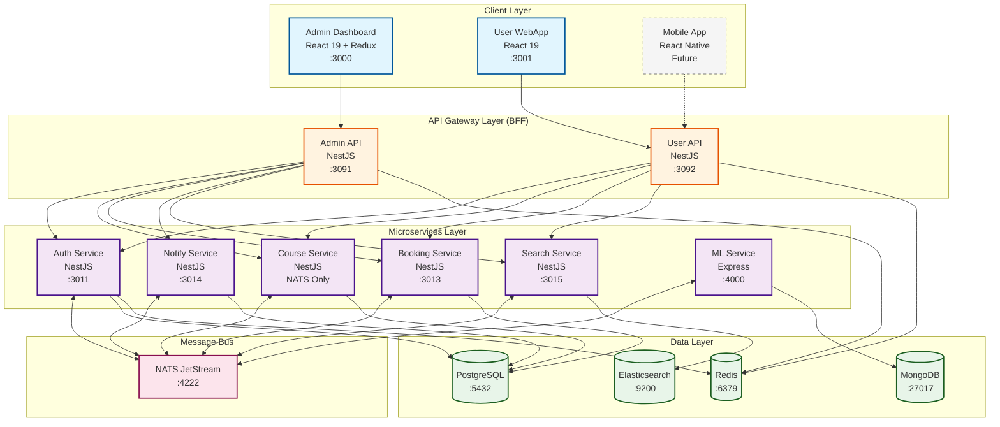
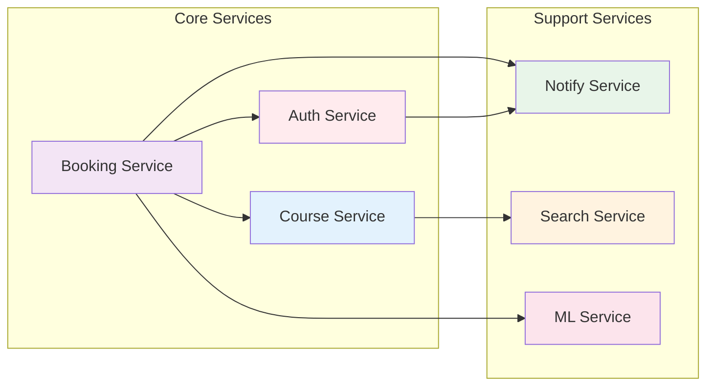
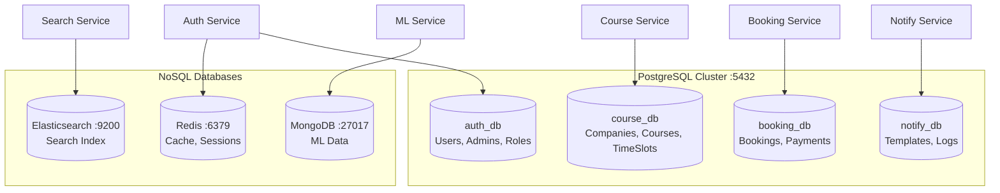
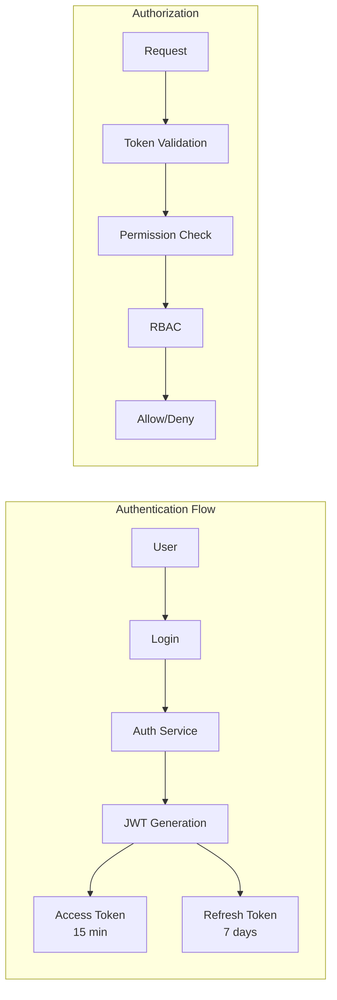
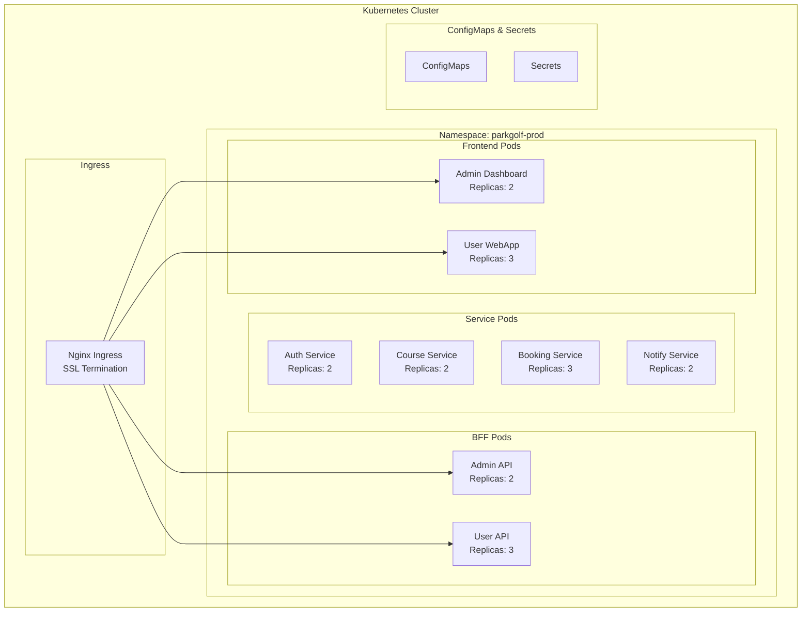
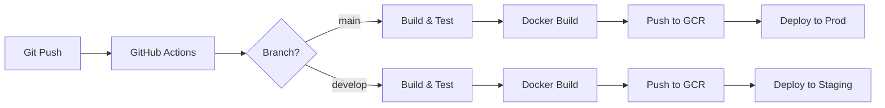
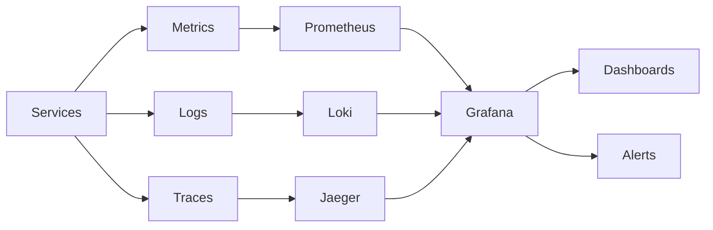

# Park Golf Platform - System Architecture

## 📋 Table of Contents
1. [Overview](#overview)
2. [System Architecture Diagram](#system-architecture-diagram)
3. [Service Architecture](#service-architecture)
4. [Technology Stack](#technology-stack)
5. [Service Details](#service-details)
6. [Communication Patterns](#communication-patterns)
7. [Database Architecture](#database-architecture)
8. [Security Architecture](#security-architecture)
9. [Deployment Architecture](#deployment-architecture)
10. [Development Guidelines](#development-guidelines)

## Overview

Park Golf Platform은 골프장 예약 및 관리를 위한 통합 플랫폼으로, 마이크로서비스 아키텍처(MSA)를 기반으로 구축되었습니다. 본 시스템은 사용자 친화적인 예약 시스템과 강력한 관리자 도구를 제공하며, 확장 가능하고 유지보수가 용이한 구조로 설계되었습니다.

### 🎯 Core Design Principles
- **Microservices Architecture**: 도메인별 독립적인 서비스 분리
- **Backend for Frontend (BFF)**: 프론트엔드별 최적화된 API 게이트웨이
- **Event-Driven Architecture**: NATS 기반 비동기 메시징
- **Domain-Driven Design**: 비즈니스 도메인 중심 설계
- **Cloud-Native**: 컨테이너 기반 배포 및 확장

### 📊 Project Status
- **Current Phase**: MVP Development
- **Completion**: 75% (as of 2025-10-09)
- **Target Release**: 2025-02-15

## System Architecture Diagram

### High-Level Architecture


### Service Communication Flow


## Service Architecture

### 🏗️ Architecture Layers

| Layer | Purpose | Technologies | Services |
|-------|---------|--------------|----------|
| **Presentation** | User Interface | React 19, Redux, Vite | Admin Dashboard, User WebApp |
| **API Gateway** | Backend for Frontend | NestJS, GraphQL (planned) | Admin API, User API |
| **Business Logic** | Core Services | NestJS, Express | Auth, Course, Booking, Notify |
| **Data Processing** | Search & Analytics | NestJS, Python | Search, ML Service |
| **Data Storage** | Persistence | PostgreSQL, Redis, Elasticsearch | Multiple DBs |
| **Infrastructure** | Messaging & Orchestration | NATS, Docker, Kubernetes | Message Bus, Container |

### 🔄 Service Dependencies



## Technology Stack

### Frontend Technologies
| Component | Technology | Version | Purpose |
|-----------|------------|---------|---------|
| **Framework** | React | 19.1 | UI Library |
| **State Management** | Redux Toolkit | 2.8 | State Management |
| **Build Tool** | Vite | 6.3 | Fast HMR & Building |
| **Language** | TypeScript | 5.8 | Type Safety |
| **Styling** | Tailwind CSS | 4.1.8 | Utility-first CSS |
| **UI Components** | Headless UI, Lucide React | latest | Component Library |
| **HTTP Client** | Axios | 1.10 | API Communication |
| **Routing** | React Router | 7.6 | Client-side Routing |

### Backend Technologies
| Component | Technology | Version | Purpose |
|-----------|------------|---------|---------|
| **Framework** | NestJS | 11.0 | Main Backend Framework |
| **Runtime** | Node.js | 20.x | JavaScript Runtime |
| **Language** | TypeScript | 5.7 | Type Safety |
| **ORM** | Prisma | 6.8-6.10 | Database ORM |
| **Validation** | class-validator | 0.14.2 | DTO Validation |
| **Authentication** | Passport.js | 0.7 | Auth Strategies |
| **Documentation** | Swagger | 11.2 | API Documentation |
| **Password Hash** | bcrypt | 5.1-6.0 | Password Encryption |

### Infrastructure Technologies
| Component | Technology | Version | Purpose |
|-----------|------------|---------|---------|
| **Database** | PostgreSQL | 15+ | Primary Database |
| **Cache** | Redis | 7.x | Session & Cache |
| **Message Broker** | NATS | 2.29 | Event Streaming |
| **Search Engine** | Elasticsearch | 8.x | Full-text Search (planned) |
| **NoSQL** | MongoDB | 5.x | ML Service Data (planned) |
| **Container** | Docker | 24.x | Containerization |
| **Orchestration** | Kubernetes | 1.28+ | Container Orchestration |
| **Cloud** | Google Cloud Platform | - | Cloud Run, GCR |

## Service Details

### 1. Frontend Services

#### Admin Dashboard (:3000) ✅
```typescript
// Tech Stack
- Framework: React 19.1 + TypeScript 5.8
- State: Redux Toolkit 2.8
- Routing: React Router 7.6
- UI: Tailwind CSS 4.1.8 + Headless UI + Lucide React
- Build: Vite 6.3 + SWC

// Features
- 관리자 인증 및 권한 관리
- 골프장/코스 관리 (Company, Club, Course)
- 예약 관리 및 모니터링
- 사용자 관리
- 통계 대시보드
- 타임슬롯 관리
```

#### User WebApp (:3001) 🚧
```typescript
// Tech Stack
- Framework: React 19.1 + TypeScript 5.8
- State: Redux Toolkit 2.8
- Routing: React Router 7.6
- UI: Tailwind CSS 4.1.8 + Custom Components
- Build: Vite 6.3 + SWC
- HTTP: Axios 1.10

// Features (Planned)
- 사용자 회원가입/로그인
- 골프장 검색 및 조회
- 예약 생성/수정/취소
- 결제 시스템 연동
- 예약 히스토리
- 프로필 관리

// Status: Basic structure only, blocked by User API NATS integration
```

### 2. BFF Services (Backend for Frontend)

#### Admin API (:3091) ✅
```typescript
// Purpose: 관리자 대시보드 전용 API Gateway

// Responsibilities
- 다중 마이크로서비스 통합
- 관리자 권한 검증 (RBAC)
- 데이터 aggregation
- Response formatting
- Error handling

// Connected Services
- Auth Service (인증/인가)
- Course Service (골프장 데이터)
- Booking Service (예약 관리)
- Notify Service (알림 발송)
- Search Service (검색)
- ML Service (분석)
```

#### User API (:3092) ⚠️
```typescript
// Purpose: 사용자 웹앱 전용 API Gateway

// Responsibilities
- 사용자 중심 API 제공
- 토큰 관리
- 캐싱 전략
- Rate limiting
- Response optimization

// Connected Services (via NATS)
- Auth Service (인증)
- Course Service (골프장 조회)
- Booking Service (예약)
- Notify Service (알림)

// Current Status
- ✅ Basic structure and modules created
- ✅ NATS client registration configured
- ⚠️ NATS integration needs verification
- 🚧 Actual API endpoints implementation pending
- 🚧 Blocking User WebApp development
```

### 3. Core Microservices

#### Auth Service (:3011 / :8080) ✅
```typescript
// Database: PostgreSQL (auth_db)
// Communication: NATS + HTTP (Cloud Run)

// Core Features
- JWT 토큰 발급/검증 (Access 15min + Refresh 7days)
- 사용자 인증 (일반/관리자 분리)
- RBAC 권한 시스템 (40+ permissions)
- 계층적 역할 관리 (RoleMaster)
- 비밀번호 암호화 (bcrypt)
- 로그인 히스토리
- Admin activity logging
- Refresh token 관리

// Message Patterns (NATS)
- auth.login
- auth.validate
- auth.refresh
- users.create/list/findById/update/delete
- auth.admin.*
- auth.permission.*

// Cloud Run Optimization
- Health check endpoint at /health
- HTTP server first (port 8080)
- NATS connects asynchronously
- Graceful degradation if NATS unavailable
```

#### Course Service (NATS only / :8080) ✅
```typescript
// Database: PostgreSQL (course_db)
// Communication: NATS only (HTTP for health check)

// Domain Structure
- Company: 골프장 운영 회사
- Club: 골프장 (실제 장소)
- Course: 코스 (9홀/18홀)
- Hole: 홀 상세 정보
- TeeBox: 티박스 (난이도별)
- CourseTimeSlot: 타임슬롯
- CourseWeeklySchedule: 주간 스케줄

// Core Features
- 골프장 회사/클럽 관리
- 9홀/18홀 코스 설정
- 홀별 상세 (par, distance, handicap, tips)
- 타임슬롯 자동 생성 (09:00-18:00)
- 주간 스케줄 관리
- 시설 정보 관리 (facilities array)
- 시즌/운영시간 정보

// Message Patterns
- companies.*
- clubs.*
- courses.*
- holes.*
- timeSlots.*

// Cloud Run Optimization
- Health check at /health (port 8080)
- NATS asynchronous connection
- Domain-based module structure
```

#### Booking Service (:3013 / :8080) ⚠️
```typescript
// Database: PostgreSQL (booking_db)
// Communication: NATS + HTTP

// Data Models
- Booking: 예약 (9홀/18홀 통합)
- Payment: 결제
- BookingHistory: 예약 히스토리
- TimeSlotAvailability: 타임슬롯 가용성 캐시
- CourseCache: 코스 정보 캐시

// Core Features
- ✅ 9홀/18홀 복합 예약 로직
- ✅ 회원/비회원 예약 지원
- ✅ 타임슬롯 가용성 체크
- ✅ 예약 상태 관리 (PENDING → CONFIRMED → COMPLETED)
- ✅ 예약 히스토리 추적
- ✅ 성능 최적화 (캐싱)
- ⚠️ 결제 게이트웨이 미완성 (TossPayments/KakaoPay 선택 필요)

// Event Publishing
- booking.created
- booking.updated
- booking.cancelled
- payment.processed

// Cloud Run Optimization
- Health check at /health
- Swagger documentation
```

#### Notify Service (:3014 / :8080) ✅
```typescript
// Database: PostgreSQL (notify_db)
// Communication: NATS + HTTP

// Core Features
- ✅ Multi-channel 알림 (Email, SMS, Push)
- ✅ 이메일 발송 (SendGrid 준비)
- ✅ SMS 발송 (Twilio 준비)
- ✅ 푸시 알림 (FCM 준비)
- ✅ 템플릿 관리 시스템
- ✅ 발송 스케줄링 (@nestjs/schedule)
- ✅ 발송 히스토리 로깅
- ✅ 다국어 지원 구조
- ✅ 재시도 메커니즘

// Event Subscriptions
- booking.created → 예약 확인 알림
- booking.cancelled → 취소 알림
- user.registered → 환영 이메일
- payment.processed → 결제 확인

// Note: External service configurations needed (SendGrid, Twilio, FCM)
```

### 4. Advanced Services

#### Search Service (:3015 / :8080) 🚧
```typescript
// Database: Elasticsearch
// Communication: NATS + HTTP

// Planned Features
- 골프장 전문 검색
- 위치 기반 검색
- 가용 타임슬롯 검색
- 자동완성
- 필터링 및 정렬
- 검색 히스토리
- 인기 검색어

// Current Status
- ✅ NestJS basic structure created
- 🚧 Elasticsearch integration not implemented
- 🚧 Search logic pending
- 📋 Low priority for MVP

// Priority: P2 (Nice to Have)
```

#### ML Service (:4000) 🚧
```typescript
// Database: MongoDB
// Communication: NATS + HTTP
// Stack: Express.js (different from others)

// Structure
- Wrapper package for ML/MCP services
- Separate ml-services/ subdirectory
- Separate mcp-services/ subdirectory

// Planned Features
- 수요 예측
- 가격 최적화
- 사용자 추천
- 이상 탐지
- 예약 패턴 분석
- 시즌별 트렌드

// Current Status
- ✅ Package structure created
- 🚧 ML logic not implemented
- 🚧 MongoDB integration pending
- 📋 Low priority for MVP

// Priority: P2 (Future Enhancement)
// Note: Uses Express.js instead of NestJS
```

## Communication Patterns

### 1. Synchronous Communication (HTTP/REST)
```yaml
Pattern: Request-Response
Use Cases:
  - Frontend → BFF communication
  - Direct service queries
  - Real-time data retrieval
  
Example Flow:
  User WebApp → User API → Microservice → Response
```

### 2. Asynchronous Communication (NATS)
```yaml
Pattern: Publish-Subscribe / Request-Reply
Use Cases:
  - Service-to-service communication
  - Event broadcasting
  - Background processing
  
Event Examples:
  - booking.created
  - user.registered
  - payment.processed
  - timeslot.updated
```

### 3. Communication Matrix

| From ↓ To → | Auth | Course | Booking | Notify | Search | ML |
|-------------|------|--------|---------|--------|--------|-----|
| **Auth** | - | - | - | Pub | - | - |
| **Course** | - | - | - | - | Pub | - |
| **Booking** | Req | Req | - | Pub | - | Pub |
| **Notify** | Sub | Sub | Sub | - | - | - |
| **Search** | - | Sub | Sub | - | - | - |
| **ML** | - | Sub | Sub | - | - | - |

*Req: Request, Pub: Publish, Sub: Subscribe*

## Database Architecture

### 1. Database Distribution


### 2. Data Synchronization Strategy
- **Event Sourcing**: All state changes emit events
- **CQRS Pattern**: Separate read and write models
- **Cache Strategy**: Redis for frequently accessed data
- **Data Consistency**: Eventual consistency via events

## Security Architecture

### 1. Authentication & Authorization


### 2. Security Layers
| Layer | Security Measures |
|-------|------------------|
| **Network** | HTTPS, TLS 1.3, Firewall rules |
| **Application** | JWT tokens, CORS, Rate limiting |
| **API** | API keys, OAuth 2.0 (planned) |
| **Database** | Encrypted connections, Row-level security |
| **Infrastructure** | Secrets management, Network isolation |

### 3. RBAC Permission System
```typescript
// Role Hierarchy
PLATFORM_ADMIN
  └── COMPANY_ADMIN
      └── COURSE_MANAGER
          └── STAFF
              └── USER

// Permission Categories (40+ permissions)
- User Management (users.*)
- Course Management (courses.*)
- Booking Management (bookings.*)
- Payment Processing (payments.*)
- System Administration (system.*)
```

## Deployment Architecture

### 1. Container Strategy
```yaml
Build Strategy:
  - Multi-stage Docker builds
  - Alpine Linux base images
  - Layer caching optimization
  - Security scanning

Image Registry:
  - Google Container Registry
  - Versioned tags
  - Automated builds
```

### 2. Kubernetes Deployment


### 3. CI/CD Pipeline


### 4. Environment Configuration
| Environment | Purpose | Infrastructure | Features |
|------------|---------|---------------|----------|
| **Local** | Development | Docker Compose | Hot reload, Debug mode |
| **Development** | Integration testing | GKE Dev Cluster | Full services, Test data |
| **Staging** | Pre-production | GKE Staging | Production-like, Testing |
| **Production** | Live system | GKE Prod Cluster | HA, Auto-scaling, Monitoring |

## Development Guidelines

### 1. Code Organization
```
services/
├── [service-name]/
│   ├── src/
│   │   ├── modules/       # Feature modules
│   │   ├── common/        # Shared utilities
│   │   ├── config/        # Configuration
│   │   └── main.ts        # Entry point
│   ├── prisma/           # Database schema
│   ├── test/             # Tests
│   └── package.json
```

### 2. Development Workflow
```bash
# 1. Start infrastructure
docker-compose -f .claude/docker/docker-compose.yml up -d

# 2. Start services
.claude/scripts/start-all-services.sh

# 3. Development
npm run start:dev  # Hot reload enabled

# 4. Testing
npm test          # Unit tests
npm run test:e2e  # Integration tests

# 5. Build
npm run build     # Production build
```

### 3. Best Practices
- **Code Style**: ESLint + Prettier configured
- **Type Safety**: TypeScript strict mode
- **Testing**: Minimum 80% coverage
- **Documentation**: Swagger for all APIs
- **Version Control**: Conventional commits
- **Error Handling**: Centralized error handling
- **Logging**: Structured logging with context
- **Monitoring**: Health checks for all services

### 4. Performance Optimization
- **Database**: Indexed queries, connection pooling
- **Caching**: Redis for hot data
- **API**: Pagination, field filtering
- **Frontend**: Code splitting, lazy loading
- **Build**: Tree shaking, minification

## Monitoring & Observability

### 1. Monitoring Stack (Planned)


### 2. Key Metrics
- **Application**: Request rate, error rate, latency
- **Business**: Bookings/day, conversion rate, revenue
- **Infrastructure**: CPU, memory, disk, network
- **Database**: Query performance, connection pool

## Future Roadmap

### Phase 1: MVP Completion (Q1 2025)
- [ ] Complete User API NATS integration
- [ ] Implement booking flow in User WebApp
- [ ] Integrate payment gateway
- [ ] Basic search functionality

### Phase 2: Enhancement (Q2 2025)
- [ ] Mobile app development
- [ ] Advanced search with Elasticsearch
- [ ] ML-based recommendations
- [ ] Multi-language support

### Phase 3: Scale (Q3 2025)
- [ ] GraphQL API layer
- [ ] Real-time features (WebSocket)
- [ ] Advanced analytics dashboard
- [ ] B2B partnership APIs

### Phase 4: Innovation (Q4 2025)
- [ ] AI-powered customer service
- [ ] Blockchain for loyalty program
- [ ] IoT integration for smart golf courses
- [ ] Virtual reality course preview

## Technical Decisions Log

| ID | Decision | Date | Rationale | Status |
|----|----------|------|-----------|--------|
| TD-001 | Microservices over Monolith | 2024-05 | Scalability, team independence | ✅ Implemented |
| TD-002 | NestJS for all services | 2024-05 | Consistency, TypeScript support | ✅ Implemented |
| TD-003 | NATS over RabbitMQ | 2024-06 | Lightweight, cloud-native | ✅ Implemented |
| TD-004 | PostgreSQL over MySQL | 2024-06 | Advanced features, performance | ✅ Implemented |
| TD-005 | React 19 over Next.js | 2024-07 | Flexibility, latest features | ✅ Implemented |
| TD-006 | Monorepo structure | 2024-06 | Code sharing, single source of truth | ✅ Implemented |
| TD-007 | Prisma over TypeORM | 2024-07 | Better DX, type safety | ✅ Implemented |
| TD-008 | GCP over AWS | 2024-08 | Regional presence, pricing | ✅ Decided |

---

**Document Version**: 2.1.0
**Last Updated**: 2025-10-09
**Next Review**: 2025-11-01
**Maintained By**: Platform Team

*This document is the single source of truth for Park Golf Platform architecture.*

## 📋 Recent Updates (2025-10-09)
- Updated all technology stack versions to actual implementation
- Updated service completion status (75% overall)
- Added Cloud Run optimization details for all microservices
- Updated Frontend stack (React 19.1, Tailwind CSS 4.1.8)
- Added detailed status for User API (⚠️ NATS integration needs verification)
- Added detailed status for Booking Service (⚠️ Payment gateway pending)
- Updated database schema information based on actual Prisma schemas
- Added priority labels for Search and ML services