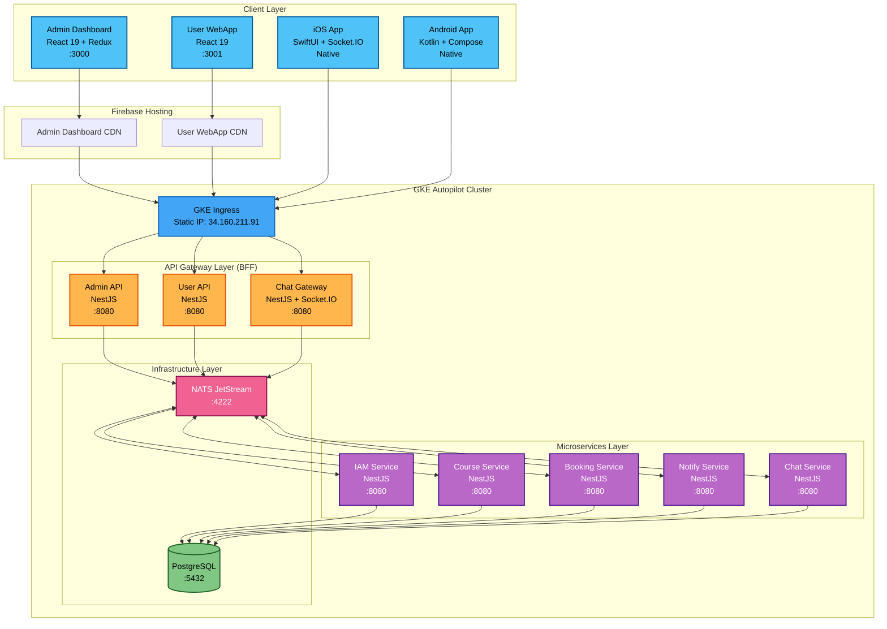
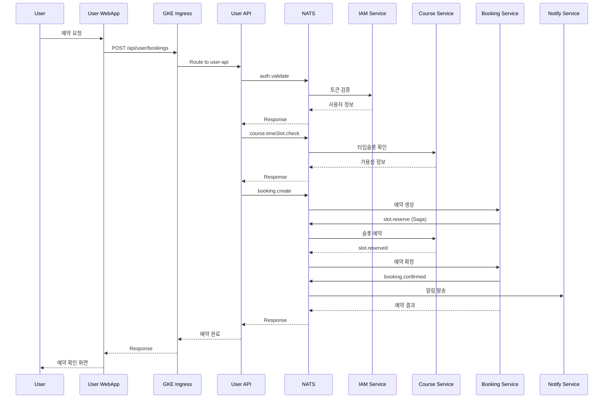
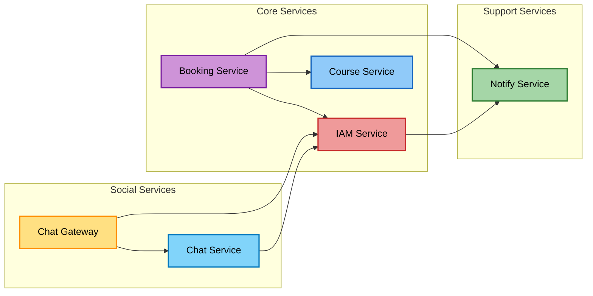
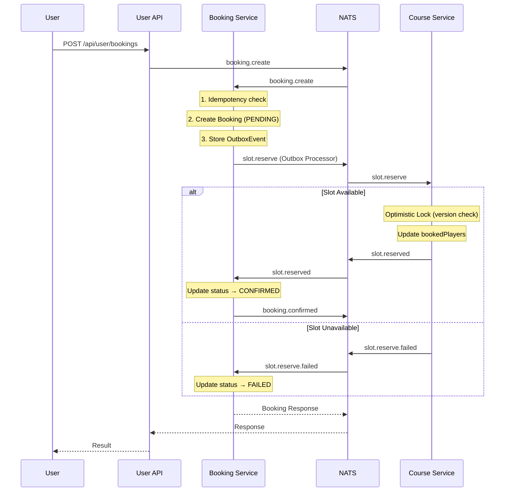
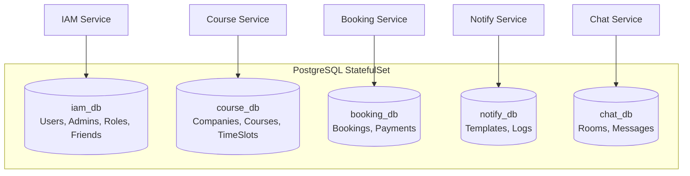
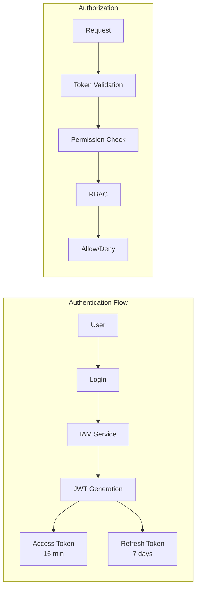
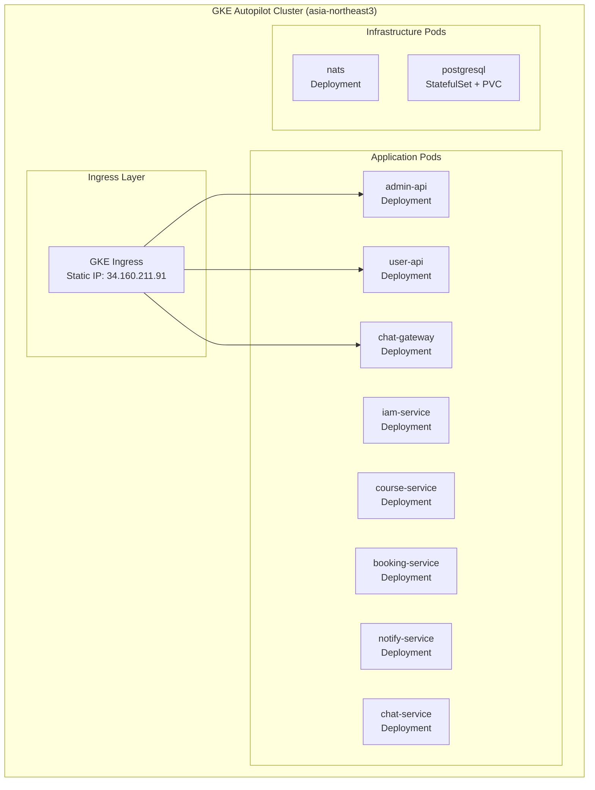
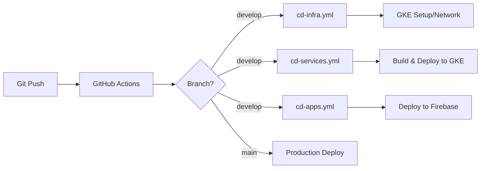

# Park Golf Platform - System Architecture

## Table of Contents
1. [Overview](#overview)
2. [System Architecture Diagram](#system-architecture-diagram)
3. [Service Architecture](#service-architecture)
4. [Technology Stack](#technology-stack)
5. [Service Details](#service-details)
6. [Communication Patterns](#communication-patterns)
7. [Database Architecture](#database-architecture)
8. [Security Architecture](#security-architecture)
9. [Deployment Architecture](#deployment-architecture)
10. [Development Guidelines](#development-guidelines)

## Overview

Park Golf Platform은 골프장 예약 및 관리를 위한 통합 플랫폼으로, 마이크로서비스 아키텍처(MSA)를 기반으로 구축되었습니다. 본 시스템은 사용자 친화적인 예약 시스템과 강력한 관리자 도구를 제공하며, 확장 가능하고 유지보수가 용이한 구조로 설계되었습니다.

### Core Design Principles
- **Microservices Architecture**: 도메인별 독립적인 서비스 분리
- **Backend for Frontend (BFF)**: 프론트엔드별 최적화된 API 게이트웨이
- **Event-Driven Architecture**: NATS 기반 비동기 메시징
- **Domain-Driven Design**: 비즈니스 도메인 중심 설계
- **Cloud-Native**: GKE Autopilot 기반 컨테이너 오케스트레이션

### Project Status
- **Current Phase**: MVP Development
- **Completion**: 85% (as of 2026-01-28)
- **Target Release**: 2026-Q1
- **Recent Milestone**: GKE Autopilot Migration Complete

## System Architecture Diagram

### High-Level Architecture


### Service Communication Flow


## Service Architecture

### Architecture Layers

| Layer | Purpose | Technologies | Services |
|-------|---------|--------------|----------|
| **Presentation** | User Interface | React 19, SwiftUI, Kotlin Compose | Admin Dashboard, User WebApp, iOS App, Android App |
| **API Gateway** | Backend for Frontend | NestJS, Socket.IO | Admin API, User API, Chat Gateway |
| **Business Logic** | Core Services | NestJS, Prisma | IAM, Course, Booking, Notify, Chat |
| **Data Storage** | Persistence | PostgreSQL | PostgreSQL StatefulSet |
| **Infrastructure** | Messaging & Orchestration | NATS, GKE Autopilot | Message Bus, Container Orchestration |

### Service Dependencies



## Technology Stack

### Frontend Technologies

#### Web (React)
| Component | Technology | Version | Purpose |
|-----------|------------|---------|---------|
| **Framework** | React | 19.1 | UI Library |
| **State Management** | Redux Toolkit | 2.8 | State Management |
| **Build Tool** | Vite | 6.3 | Fast HMR & Building |
| **Language** | TypeScript | 5.8 | Type Safety |
| **Styling** | Tailwind CSS | 4.1.8 | Utility-first CSS |
| **UI Components** | Headless UI, Lucide React | latest | Component Library |
| **HTTP Client** | Axios | 1.10 | API Communication |
| **Routing** | React Router | 7.6 | Client-side Routing |

#### iOS (Swift)
| Component | Technology | Version | Purpose |
|-----------|------------|---------|---------|
| **UI Framework** | SwiftUI | 5.0+ | Declarative UI |
| **Language** | Swift | 6.0 | Native iOS Development |
| **Build System** | Tuist | 4.x | Project Generation |
| **Networking** | Alamofire | 5.x | HTTP Client |
| **WebSocket** | Socket.IO-Client-Swift | 16.x | Real-time Communication |
| **Async/Await** | Swift Concurrency | Native | Async Operations |
| **State** | Combine + @Observable | Native | Reactive Programming |

#### Android (Kotlin)
| Component | Technology | Version | Purpose |
|-----------|------------|---------|---------|
| **UI Framework** | Jetpack Compose | 1.x | Declarative UI |
| **Language** | Kotlin | 2.x | Native Android Development |
| **DI** | Hilt | 2.x | Dependency Injection |
| **Networking** | Retrofit + OkHttp | 2.x | HTTP Client |
| **WebSocket** | Socket.IO-Client-Java | 2.x | Real-time Communication |
| **State** | StateFlow + ViewModel | Native | Reactive Programming |

### Backend Technologies
| Component | Technology | Version | Purpose |
|-----------|------------|---------|---------|
| **Framework** | NestJS | 11.0 | Main Backend Framework |
| **Runtime** | Node.js | 20.x | JavaScript Runtime |
| **Language** | TypeScript | 5.7 | Type Safety |
| **ORM** | Prisma | 6.8-6.10 | Database ORM |
| **Validation** | class-validator | 0.14.2 | DTO Validation |
| **Authentication** | Passport.js | 0.7 | Auth Strategies |
| **Documentation** | Swagger | 11.2 | API Documentation |
| **Password Hash** | bcrypt | 5.1-6.0 | Password Encryption |

### Infrastructure Technologies
| Component | Technology | Version | Purpose |
|-----------|------------|---------|---------|
| **Container Orchestration** | GKE Autopilot | 1.31+ | Kubernetes Managed Service |
| **Database** | PostgreSQL | 15+ | Primary Database (StatefulSet) |
| **Message Broker** | NATS | 2.10 | Event Streaming (Deployment) |
| **Container Registry** | Artifact Registry | - | Docker Image Storage |
| **Static Hosting** | Firebase Hosting | - | Frontend CDN |
| **Cloud** | Google Cloud Platform | - | Cloud Provider |

## Service Details

### 1. Frontend Services

#### Admin Dashboard
```typescript
// Tech Stack
- Framework: React 19.1 + TypeScript 5.8
- State: Redux Toolkit 2.8
- Routing: React Router 7.6
- UI: Tailwind CSS 4.1.8 + Headless UI + Lucide React
- Build: Vite 6.3 + SWC

// Features
- 관리자 인증 및 권한 관리
- 골프장/코스 관리 (Company, Club, Course)
- 예약 관리 및 모니터링
- 사용자 관리
- 통계 대시보드
- 타임슬롯 관리

// API Endpoint
- Development: http://34.160.211.91/api/admin
- Production: https://admin-api.parkgolf.app
```

#### User WebApp
```typescript
// Tech Stack
- Framework: React 19.1 + TypeScript 5.8
- State: Zustand (auth only) + React Query (server state)
- Routing: React Router 7.6
- UI: Tailwind CSS 4.1.8 + Custom Glass Components
- Build: Vite 6.3 + SWC
- HTTP: Axios 1.10

// Features
- 사용자 회원가입/로그인
- 골프장 검색 및 조회
- 예약 생성/수정/취소
- 친구 관리 (추가/삭제/검색)
- 채팅 (REST + WebSocket)
- 프로필 관리

// API Endpoint
- Development: http://34.160.211.91/api/user
- Production: https://user-api.parkgolf.app
```

#### iOS App (user-app-ios)
```swift
// Tech Stack
- UI: SwiftUI 5.0+
- Language: Swift 6.0
- Build: Tuist 4.x (Project Generation)
- Network: Alamofire 5.x (REST), Socket.IO-Client-Swift 16.x (WebSocket)
- Concurrency: Swift Concurrency (async/await)
- State: Combine + @Observable macro

// Architecture
- MVVM Pattern
- Feature-based folder structure
- Centralized APIClient for REST calls
- ChatSocketManager for real-time messaging

// Features
- 사용자 인증 (로그인/회원가입/토큰 갱신)
- 골프장 검색 및 상세 조회
- 예약 생성/조회/취소
- 친구 관리 (추가/삭제/검색/주소록 연동)
- 실시간 채팅 (Socket.IO)
- 라운드 기록 및 통계
- 프로필 관리

// API Endpoints
- Development:
  - REST: http://34.160.211.91/api/user
  - WebSocket: http://34.160.211.91 (Socket.IO)
- Production:
  - REST: https://user-api.parkgolf.app
  - WebSocket: https://chat-gateway.parkgolf.app
```

#### Android App (user-app-android)
```kotlin
// Tech Stack
- UI: Jetpack Compose
- Language: Kotlin 2.x
- DI: Hilt
- Network: Retrofit + OkHttp (REST), Socket.IO (WebSocket)
- State: StateFlow + ViewModel

// Architecture
- MVVM Pattern
- Feature-based package structure
- Repository pattern for data layer

// API Endpoints
- Development:
  - REST: http://34.160.211.91/api/user/
  - WebSocket: http://34.160.211.91
- Production:
  - REST: https://user-api.parkgolf.app/
  - WebSocket: https://chat-gateway.parkgolf.app
```

### 2. BFF Services (Backend for Frontend)

#### Admin API (:8080)
```typescript
// Purpose: 관리자 대시보드 전용 API Gateway

// Responsibilities
- 다중 마이크로서비스 통합
- 관리자 권한 검증 (RBAC)
- 데이터 aggregation
- Response formatting
- Error handling

// Connected Services
- IAM Service (인증/인가)
- Course Service (골프장 데이터)
- Booking Service (예약 관리)
- Notify Service (알림 발송)

// GKE Endpoint
- Internal: http://admin-api:8080
- External: http://34.160.211.91/api/admin
```

#### User API (:8080)
```typescript
// Purpose: 사용자 웹앱/모바일앱 전용 API Gateway

// Responsibilities
- 사용자 중심 API 제공
- 토큰 관리
- 캐싱 전략
- Rate limiting
- Response optimization

// Connected Services (via NATS)
- IAM Service (인증)
- Course Service (골프장 조회)
- Booking Service (예약 - Saga 패턴)
- Notify Service (알림)

// GKE Endpoint
- Internal: http://user-api:8080
- External: http://34.160.211.91/api/user
```

### 3. Core Microservices

#### IAM Service (:8080)
```typescript
// Database: PostgreSQL (iam_db)
// Communication: NATS

// Core Features - Authentication
- JWT 토큰 발급/검증 (Access 15min + Refresh 7days)
- 사용자 인증 (일반/관리자 분리)
- RBAC 권한 시스템 (40+ permissions)
- 계층적 역할 관리 (RoleMaster)
- 비밀번호 암호화 (bcrypt)
- 로그인 히스토리
- Admin activity logging
- Refresh token 관리

// Core Features - Friends
- 친구 목록 관리
- 친구 요청 (보내기/수락/거절)
- 사용자 검색 (이름/이메일)
- 연락처 기반 친구 찾기 (phone number matching)
- 친구 관계 상태 관리

// Message Patterns (NATS)
- auth.login / auth.validate / auth.refresh
- users.create/list/findById/update/delete
- auth.admin.* / auth.permission.*
- friends.* (친구 관련)
```

#### Course Service (:8080)
```typescript
// Database: PostgreSQL (course_db)
// Communication: NATS

// Domain Structure
- Company: 골프장 운영 회사
- Club: 골프장 (실제 장소)
- Course: 코스 (9홀/18홀)
- Hole: 홀 상세 정보
- TeeBox: 티박스 (난이도별)
- CourseTimeSlot: 타임슬롯
- CourseWeeklySchedule: 주간 스케줄

// Message Patterns
- companies.*
- clubs.*
- courses.*
- holes.*
- timeSlots.*
- slot.reserve / slot.release (Saga)
```

#### Booking Service (:8080)
```typescript
// Database: PostgreSQL (booking_db)
// Communication: NATS

// Data Models
- Booking: 예약 (9홀/18홀 통합, Saga 상태 관리)
- Payment: 결제
- BookingHistory: 예약 히스토리
- GameCache: 게임 정보 캐시
- GameTimeSlotCache: 타임슬롯 가용성 캐시
- OutboxEvent: Transactional Outbox Pattern
- IdempotencyKey: 중복 요청 방지

// Core Features
- 9홀/18홀 복합 예약 로직
- 회원/비회원 예약 지원
- 타임슬롯 가용성 체크
- Saga 패턴 (Choreography) 구현
- 예약 상태 관리 (PENDING → SLOT_RESERVED → CONFIRMED / FAILED)
- Transactional Outbox Pattern
- Idempotency Key 기반 중복 방지
- 예약 히스토리 추적
```

#### Notify Service (:8080)
```typescript
// Database: PostgreSQL (notify_db)
// Communication: NATS

// Core Features
- Multi-channel 알림 (Email, SMS, Push)
- 이메일 발송 (SendGrid 준비)
- SMS 발송 (Twilio 준비)
- 푸시 알림 (FCM 준비)
- 템플릿 관리 시스템
- 발송 스케줄링 (@nestjs/schedule)
- 발송 히스토리 로깅
- 다국어 지원 구조
- 재시도 메커니즘
```

### 4. Social Services

#### Chat Service (:8080)
```typescript
// Database: PostgreSQL (chat_db)
// Communication: NATS only

// Data Models
- ChatRoom: 채팅방 (DIRECT, GROUP, BOOKING 타입)
- ChatMessage: 메시지 (TEXT, IMAGE, SYSTEM, BOOKING_INVITE)
- ChatRoomMember: 채팅방 멤버

// Message Patterns (NATS)
- chat.rooms.create / get / list
- chat.rooms.addMember / removeMember
- chat.rooms.booking
- chat.messages.save / list / markRead / unreadCount / delete
```

#### Chat Gateway (:8080)
```typescript
// Communication: Socket.IO (WebSocket) + NATS
// Namespace: /chat

// Socket.IO Events (Client → Server)
- join_room: 채팅방 입장
- leave_room: 채팅방 퇴장
- send_message: 메시지 전송
- typing: 타이핑 표시

// Socket.IO Events (Server → Client)
- connected: 연결 성공
- new_message: 새 메시지 수신
- user_joined / user_left: 입퇴장 알림
- typing: 타이핑 상태 알림
- error: 에러 알림
```

## Communication Patterns

### 1. Synchronous Communication (HTTP/REST)
```yaml
Pattern: Request-Response via GKE Ingress
Use Cases:
  - Frontend → BFF communication
  - Direct API queries via Ingress

Example Flow:
  User App → GKE Ingress → User API → NATS → Microservice → Response
```

### 2. Asynchronous Communication (NATS)
```yaml
Pattern: Publish-Subscribe / Request-Reply
Use Cases:
  - Service-to-service communication
  - Event broadcasting
  - Background processing

Event Examples:
  - booking.created
  - booking.confirmed
  - slot.reserve / slot.reserved
  - notification.*
```

### 3. Internal Service Communication (Kubernetes DNS)
```yaml
Pattern: Kubernetes Service Discovery
Use Cases:
  - Inter-service HTTP calls within cluster

Example URLs:
  - http://iam-service:8080
  - http://course-service:8080
  - http://booking-service:8080
  - http://chat-service:8080
  - http://notify-service:8080
  - nats://nats:4222
```

## Saga Pattern (Distributed Transactions)

### Booking Saga Flow


### Booking States

```
PENDING → SLOT_RESERVED → CONFIRMED
    ↓           ↓             ↓
  FAILED      FAILED      CANCELLED
              (timeout)
```

## Database Architecture

### Database Distribution


### Storage Configuration
| Environment | Storage Class | Type | Purpose |
|-------------|--------------|------|---------|
| Development | standard-rwo | Balanced PD | Cost optimization |
| Production | premium-rwo | SSD PD | Performance |

## Security Architecture

### Authentication & Authorization


### Security Layers
| Layer | Security Measures |
|-------|------------------|
| **Network** | GKE Ingress, TLS 1.3, Internal ClusterIP |
| **Application** | JWT tokens, CORS, Rate limiting |
| **API** | API Gateway authentication |
| **Database** | Internal PostgreSQL (ClusterIP), No external access |
| **Infrastructure** | GKE Autopilot managed security, Secret Manager |

## Deployment Architecture

### GKE Autopilot Cluster


### Resource Specifications

| Resource Type | CPU Request | CPU Limit | Memory Request | Memory Limit |
|---------------|-------------|-----------|----------------|--------------|
| **Services** | 100m | 300m | 128Mi | 256Mi |
| **PostgreSQL** | 500m | 1000m | 512Mi | 1Gi |
| **NATS** | 100m | 500m | 128Mi | 512Mi |

### CI/CD Pipeline


### Workflow Files
| Workflow | File | Purpose |
|----------|------|---------|
| **CI Pipeline** | `ci.yml` | Lint, Test, Build, Security Scan |
| **CD Infrastructure** | `cd-infra.yml` | GKE Cluster & Network Management |
| **CD Services** | `cd-services.yml` | Backend Service Deployment |
| **CD Apps** | `cd-apps.yml` | Frontend App Deployment (Firebase) |

## Development Guidelines

### Code Organization
```
services/
├── [service-name]/
│   ├── src/
│   │   ├── modules/       # Feature modules
│   │   ├── common/        # Shared utilities
│   │   ├── config/        # Configuration
│   │   └── main.ts        # Entry point
│   ├── prisma/           # Database schema
│   ├── test/             # Tests
│   └── package.json
```

### Development Workflow
```bash
# 1. Start local infrastructure
docker-compose -f .claude/docker/docker-compose.yml up -d

# 2. Start services
.claude/scripts/start-all-services.sh

# 3. Development
npm run start:dev  # Hot reload enabled

# 4. Testing
npm test          # Unit tests
npm run test:e2e  # Integration tests

# 5. Build
npm run build     # Production build
```

### Best Practices
- **Code Style**: ESLint + Prettier configured
- **Type Safety**: TypeScript strict mode
- **Testing**: Minimum 80% coverage
- **Documentation**: Swagger for all APIs
- **Version Control**: Conventional commits
- **Error Handling**: Centralized error handling
- **Logging**: Structured logging with context
- **Monitoring**: Health checks for all services

---

**Document Version**: 3.0.0
**Last Updated**: 2026-01-28
**Maintained By**: Platform Team

## Recent Updates (2026-01-28)
- Migrated from Cloud Run to GKE Autopilot
- Updated all diagrams to reflect GKE architecture
- Added Static IP information (34.160.211.91)
- Updated resource specifications for GKE pods
- Added Android App documentation
- Updated CI/CD workflow descriptions
- Added Kubernetes DNS internal communication patterns
- Updated storage class configuration (standard-rwo/premium-rwo)
