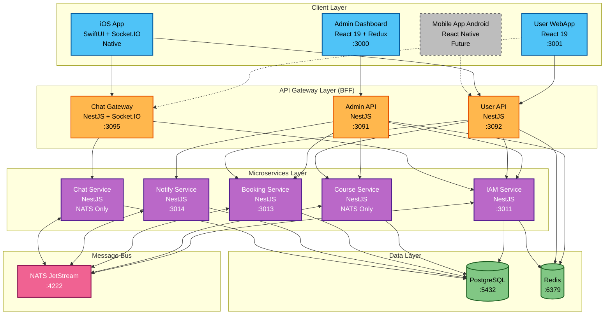
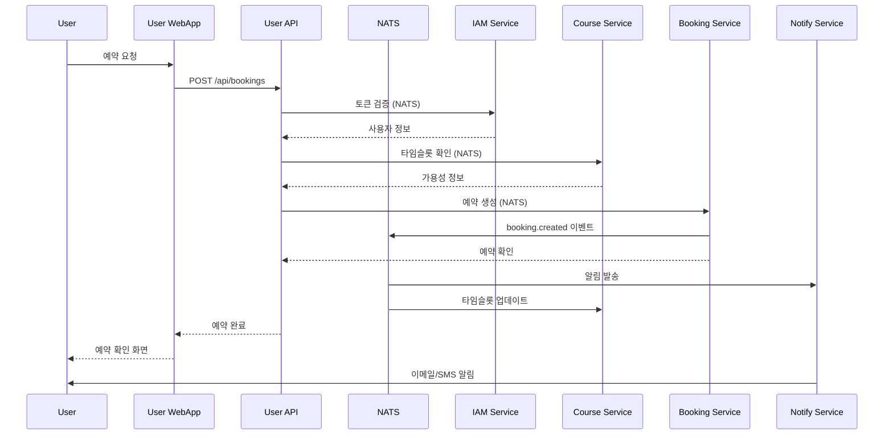
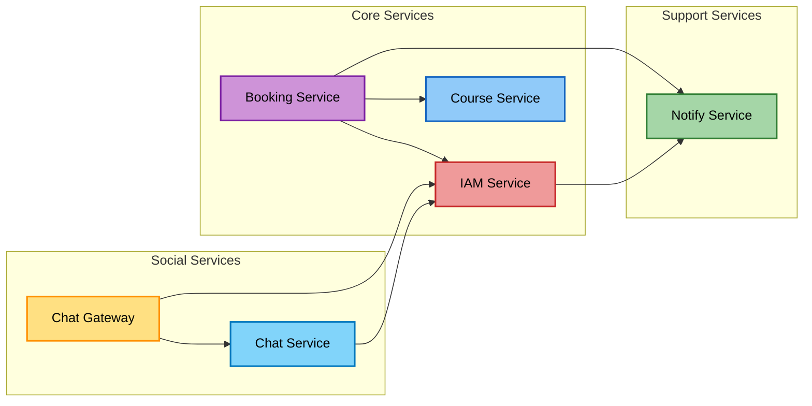
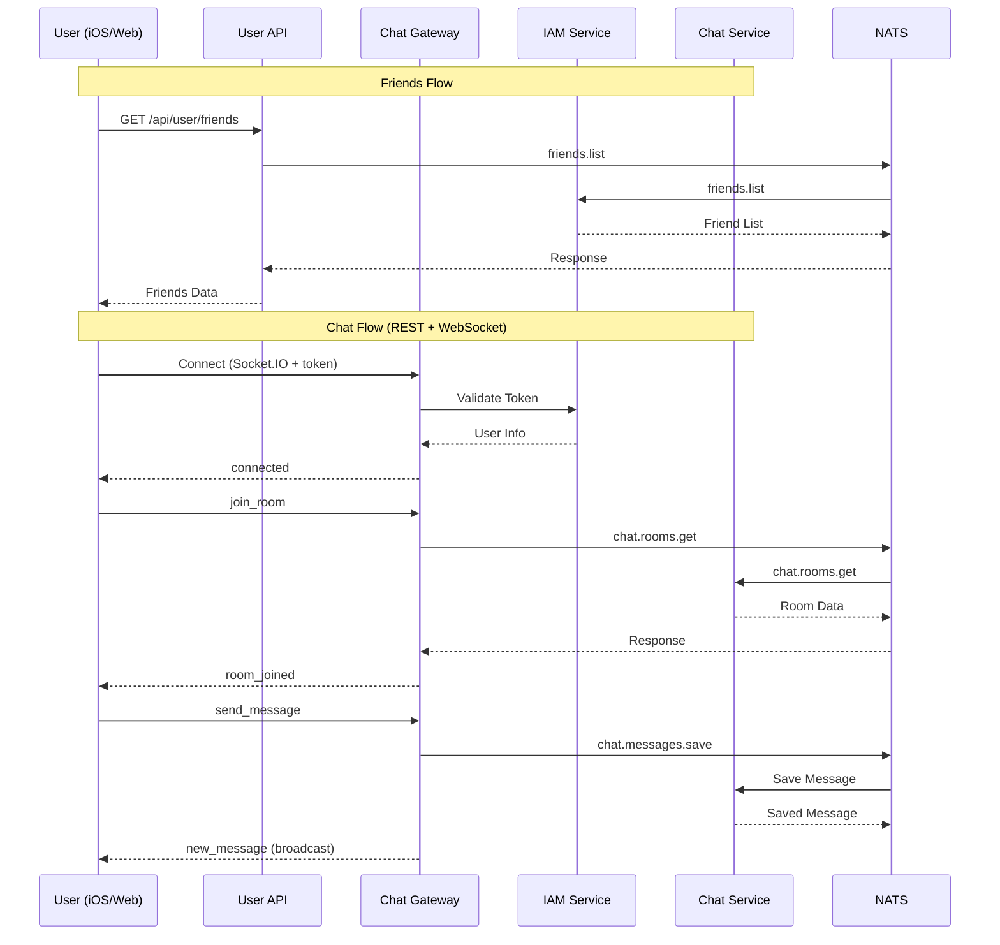
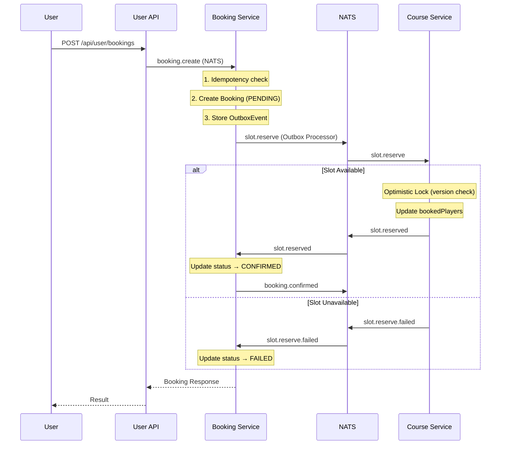
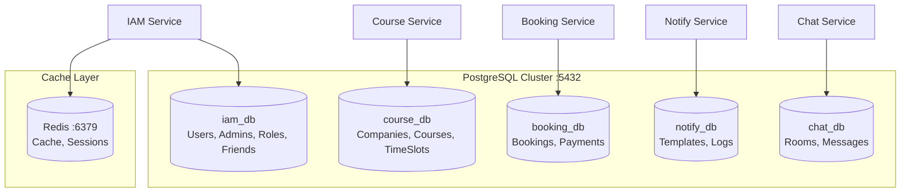
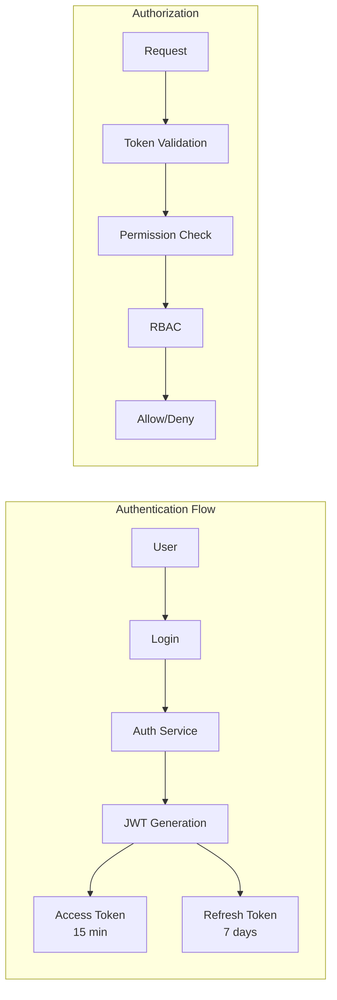
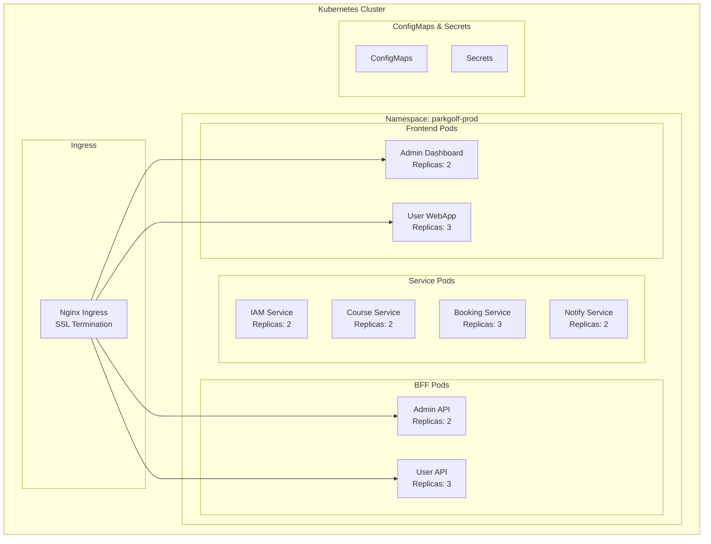
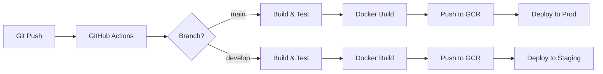
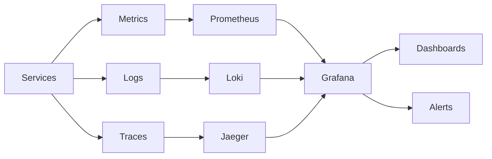

# Park Golf Platform - System Architecture

## 📋 Table of Contents
1. [Overview](#overview)
2. [System Architecture Diagram](#system-architecture-diagram)
3. [Service Architecture](#service-architecture)
4. [Technology Stack](#technology-stack)
5. [Service Details](#service-details)
6. [Communication Patterns](#communication-patterns)
7. [Database Architecture](#database-architecture)
8. [Security Architecture](#security-architecture)
9. [Deployment Architecture](#deployment-architecture)
10. [Development Guidelines](#development-guidelines)

## Overview

Park Golf Platform은 골프장 예약 및 관리를 위한 통합 플랫폼으로, 마이크로서비스 아키텍처(MSA)를 기반으로 구축되었습니다. 본 시스템은 사용자 친화적인 예약 시스템과 강력한 관리자 도구를 제공하며, 확장 가능하고 유지보수가 용이한 구조로 설계되었습니다.

### 🎯 Core Design Principles
- **Microservices Architecture**: 도메인별 독립적인 서비스 분리
- **Backend for Frontend (BFF)**: 프론트엔드별 최적화된 API 게이트웨이
- **Event-Driven Architecture**: NATS 기반 비동기 메시징
- **Domain-Driven Design**: 비즈니스 도메인 중심 설계
- **Cloud-Native**: 컨테이너 기반 배포 및 확장

### 📊 Project Status
- **Current Phase**: MVP Development
- **Completion**: 85% (as of 2025-12-29)
- **Target Release**: 2025-02-15
- **Recent Milestone**: Saga Pattern Implementation Complete

## System Architecture Diagram

### High-Level Architecture


### Service Communication Flow


## Service Architecture

### 🏗️ Architecture Layers

| Layer | Purpose | Technologies | Services |
|-------|---------|--------------|----------|
| **Presentation** | User Interface | React 19, SwiftUI, Redux, Vite | Admin Dashboard, User WebApp, iOS App |
| **API Gateway** | Backend for Frontend | NestJS, Socket.IO | Admin API, User API, Chat Gateway |
| **Business Logic** | Core Services | NestJS | IAM, Course, Booking, Notify, Chat |
| **Data Storage** | Persistence | PostgreSQL, Redis | PostgreSQL (Primary), Redis (Cache) |
| **Infrastructure** | Messaging & Orchestration | NATS, Docker, Kubernetes | Message Bus, Container |

### 🔄 Service Dependencies



## Technology Stack

### Frontend Technologies

#### Web (React)
| Component | Technology | Version | Purpose |
|-----------|------------|---------|---------|
| **Framework** | React | 19.1 | UI Library |
| **State Management** | Redux Toolkit | 2.8 | State Management |
| **Build Tool** | Vite | 6.3 | Fast HMR & Building |
| **Language** | TypeScript | 5.8 | Type Safety |
| **Styling** | Tailwind CSS | 4.1.8 | Utility-first CSS |
| **UI Components** | Headless UI, Lucide React | latest | Component Library |
| **HTTP Client** | Axios | 1.10 | API Communication |
| **Routing** | React Router | 7.6 | Client-side Routing |

#### iOS (Swift)
| Component | Technology | Version | Purpose |
|-----------|------------|---------|---------|
| **UI Framework** | SwiftUI | 5.0+ | Declarative UI |
| **Language** | Swift | 5.9+ | Native iOS Development |
| **Build System** | Tuist | 4.x | Project Generation |
| **Networking** | Alamofire | 5.x | HTTP Client |
| **WebSocket** | Socket.IO-Client-Swift | 16.x | Real-time Communication |
| **Async/Await** | Swift Concurrency | Native | Async Operations |
| **State** | Combine + @Observable | Native | Reactive Programming |

### Backend Technologies
| Component | Technology | Version | Purpose |
|-----------|------------|---------|---------|
| **Framework** | NestJS | 11.0 | Main Backend Framework |
| **Runtime** | Node.js | 20.x | JavaScript Runtime |
| **Language** | TypeScript | 5.7 | Type Safety |
| **ORM** | Prisma | 6.8-6.10 | Database ORM |
| **Validation** | class-validator | 0.14.2 | DTO Validation |
| **Authentication** | Passport.js | 0.7 | Auth Strategies |
| **Documentation** | Swagger | 11.2 | API Documentation |
| **Password Hash** | bcrypt | 5.1-6.0 | Password Encryption |

### Infrastructure Technologies
| Component | Technology | Version | Purpose |
|-----------|------------|---------|---------|
| **Database** | PostgreSQL | 15+ | Primary Database |
| **Cache** | Redis | 7.x | Session & Cache |
| **Message Broker** | NATS | 2.29 | Event Streaming |
| **Container** | Docker | 24.x | Containerization |
| **Orchestration** | Kubernetes | 1.28+ | Container Orchestration |
| **Cloud** | Google Cloud Platform | - | Cloud Run, GCR |

## Service Details

### 1. Frontend Services

#### Admin Dashboard (:3000) ✅
```typescript
// Tech Stack
- Framework: React 19.1 + TypeScript 5.8
- State: Redux Toolkit 2.8
- Routing: React Router 7.6
- UI: Tailwind CSS 4.1.8 + Headless UI + Lucide React
- Build: Vite 6.3 + SWC

// Features
- 관리자 인증 및 권한 관리
- 골프장/코스 관리 (Company, Club, Course)
- 예약 관리 및 모니터링
- 사용자 관리
- 통계 대시보드
- 타임슬롯 관리
```

#### User WebApp (:3001) ✅
```typescript
// Tech Stack
- Framework: React 19.1 + TypeScript 5.8
- State: Zustand (auth only) + React Query (server state)
- Routing: React Router 7.6
- UI: Tailwind CSS 4.1.8 + Custom Glass Components
- Build: Vite 6.3 + SWC
- HTTP: Axios 1.10

// Features
- ✅ 사용자 회원가입/로그인
- ✅ 골프장 검색 및 조회
- ✅ 예약 생성/수정/취소
- ✅ 친구 관리 (추가/삭제/검색)
- ✅ 채팅 (REST + WebSocket)
- 🚧 결제 시스템 연동
- ✅ 프로필 관리

// Status: Most features implemented
```

#### iOS App (user-app-ios) ✅
```swift
// Tech Stack
- UI: SwiftUI 5.0+
- Language: Swift 5.9+
- Build: Tuist 4.x (Project Generation)
- Network: Alamofire 5.x (REST), Socket.IO-Client-Swift 16.x (WebSocket)
- Concurrency: Swift Concurrency (async/await)
- State: Combine + @Observable macro

// Architecture
- MVVM Pattern
- Feature-based folder structure
- Centralized APIClient for REST calls
- ChatSocketManager for real-time messaging

// Features
- ✅ 사용자 인증 (로그인/회원가입/토큰 갱신)
- ✅ 골프장 검색 및 상세 조회
- ✅ 예약 생성/조회/취소
- ✅ 친구 관리 (추가/삭제/검색/주소록 연동)
- ✅ 실시간 채팅 (Socket.IO)
- ✅ 라운드 기록 및 통계
- ✅ 프로필 관리

// API Endpoints
- REST: user-api (https://user-api-xxx.run.app)
- WebSocket: chat-gateway (https://chat-gateway-xxx.run.app)

// Folder Structure
Sources/
├── Core/
│   ├── Network/       # APIClient, Endpoints, ChatSocketManager
│   ├── Models/        # Data models (User, ChatRoom, Friend, etc.)
│   └── Utils/         # Configuration, Helpers
├── Features/
│   ├── Auth/          # Login, SignUp
│   ├── Home/          # Dashboard
│   ├── Booking/       # 예약 관련
│   ├── Chat/          # 채팅 (ChatListView, ChatRoomView)
│   ├── Friends/       # 친구 관리
│   ├── Round/         # 라운드 기록
│   └── Profile/       # 프로필
└── App/               # App entry point
```

### 2. BFF Services (Backend for Frontend)

#### Admin API (:3091) ✅
```typescript
// Purpose: 관리자 대시보드 전용 API Gateway

// Responsibilities
- 다중 마이크로서비스 통합
- 관리자 권한 검증 (RBAC)
- 데이터 aggregation
- Response formatting
- Error handling

// Connected Services
- IAM Service (인증/인가)
- Course Service (골프장 데이터)
- Booking Service (예약 관리)
- Notify Service (알림 발송)
```

#### User API (:3092) ✅
```typescript
// Purpose: 사용자 웹앱 전용 API Gateway

// Responsibilities
- 사용자 중심 API 제공
- 토큰 관리
- 캐싱 전략
- Rate limiting
- Response optimization

// Connected Services (via NATS)
- IAM Service (인증)
- Course Service (골프장 조회)
- Booking Service (예약 - Saga 패턴)
- Notify Service (알림)

// Current Status
- ✅ Basic structure and modules created
- ✅ NATS client registration configured
- ✅ NATS integration verified and working
- ✅ API endpoints implemented (auth, booking, games, clubs)
- ✅ Saga-based booking with idempotency key support
- ✅ No longer blocking User WebApp development
```

### 3. Core Microservices

#### IAM Service (:3011 / :8080) ✅
```typescript
// Database: PostgreSQL (iam_db)
// Communication: NATS + HTTP (Cloud Run)

// Core Features - Authentication
- JWT 토큰 발급/검증 (Access 15min + Refresh 7days)
- 사용자 인증 (일반/관리자 분리)
- RBAC 권한 시스템 (40+ permissions)
- 계층적 역할 관리 (RoleMaster)
- 비밀번호 암호화 (bcrypt)
- 로그인 히스토리
- Admin activity logging
- Refresh token 관리

// Core Features - Friends ✅
- 친구 목록 관리
- 친구 요청 (보내기/수락/거절)
- 사용자 검색 (이름/이메일)
- 연락처 기반 친구 찾기 (phone number matching)
- 친구 관계 상태 관리

// Message Patterns (NATS)
- auth.login / auth.validate / auth.refresh
- users.create/list/findById/update/delete
- auth.admin.* / auth.permission.*
- friends.list              # 친구 목록 조회
- friends.requests          # 받은 친구 요청
- friends.requests.sent     # 보낸 친구 요청
- friends.search            # 사용자 검색
- friends.contacts.search   # 연락처 기반 검색
- friends.request.send      # 친구 요청 보내기
- friends.request.accept    # 친구 요청 수락
- friends.request.reject    # 친구 요청 거절
- friends.remove            # 친구 삭제
- friends.check             # 친구 여부 확인

// Cloud Run Optimization
- Health check endpoint at /health
- HTTP server first (port 8080)
- NATS connects asynchronously
- Graceful degradation if NATS unavailable
```

#### Course Service (NATS only / :8080) ✅
```typescript
// Database: PostgreSQL (course_db)
// Communication: NATS only (HTTP for health check)

// Domain Structure
- Company: 골프장 운영 회사
- Club: 골프장 (실제 장소)
- Course: 코스 (9홀/18홀)
- Hole: 홀 상세 정보
- TeeBox: 티박스 (난이도별)
- CourseTimeSlot: 타임슬롯
- CourseWeeklySchedule: 주간 스케줄

// Core Features
- 골프장 회사/클럽 관리
- 9홀/18홀 코스 설정
- 홀별 상세 (par, distance, handicap, tips)
- 타임슬롯 자동 생성 (09:00-18:00)
- 주간 스케줄 관리
- 시설 정보 관리 (facilities array)
- 시즌/운영시간 정보

// Message Patterns
- companies.*
- clubs.*
- courses.*
- holes.*
- timeSlots.*

// Cloud Run Optimization
- Health check at /health (port 8080)
- NATS asynchronous connection
- Domain-based module structure
```

#### Booking Service (:3013 / :8080) ✅
```typescript
// Database: PostgreSQL (booking_db)
// Communication: NATS + HTTP

// Data Models
- Booking: 예약 (9홀/18홀 통합, Saga 상태 관리)
- Payment: 결제
- BookingHistory: 예약 히스토리
- GameCache: 게임 정보 캐시
- GameTimeSlotCache: 타임슬롯 가용성 캐시
- OutboxEvent: Transactional Outbox Pattern
- IdempotencyKey: 중복 요청 방지

// Core Features
- ✅ 9홀/18홀 복합 예약 로직
- ✅ 회원/비회원 예약 지원
- ✅ 타임슬롯 가용성 체크
- ✅ Saga 패턴 (Choreography) 구현
- ✅ 예약 상태 관리 (PENDING → SLOT_RESERVED → CONFIRMED / FAILED)
- ✅ Transactional Outbox Pattern
- ✅ Idempotency Key 기반 중복 방지
- ✅ 예약 히스토리 추적
- ✅ 성능 최적화 (캐싱)
- ⚠️ 결제 게이트웨이 미완성 (TossPayments/KakaoPay 선택 필요)

// Saga Events
- slot.reserve (booking → course): 슬롯 예약 요청
- slot.reserved (course → booking): 슬롯 예약 성공
- slot.reserve.failed (course → booking): 슬롯 예약 실패
- slot.release (booking → course): 슬롯 해제 요청
- booking.confirmed (booking → notification): 예약 확정 알림
- booking.cancelled (booking → notification): 예약 취소 알림

// Cloud Run Optimization
- Health check at /health
- Swagger documentation
- Saga timeout cleanup scheduler
```

#### Notify Service (:3014 / :8080) ✅
```typescript
// Database: PostgreSQL (notify_db)
// Communication: NATS + HTTP

// Core Features
- ✅ Multi-channel 알림 (Email, SMS, Push)
- ✅ 이메일 발송 (SendGrid 준비)
- ✅ SMS 발송 (Twilio 준비)
- ✅ 푸시 알림 (FCM 준비)
- ✅ 템플릿 관리 시스템
- ✅ 발송 스케줄링 (@nestjs/schedule)
- ✅ 발송 히스토리 로깅
- ✅ 다국어 지원 구조
- ✅ 재시도 메커니즘

// Event Subscriptions
- booking.created → 예약 확인 알림
- booking.cancelled → 취소 알림
- user.registered → 환영 이메일
- payment.processed → 결제 확인

// Note: External service configurations needed (SendGrid, Twilio, FCM)
```

### 4. Social Services

#### Chat Service (NATS only / :8080) ✅
```typescript
// Database: PostgreSQL (chat_db)
// Communication: NATS only (no HTTP endpoints)

// Data Models
- ChatRoom: 채팅방 (DIRECT, GROUP, BOOKING 타입)
- ChatMessage: 메시지 (TEXT, IMAGE, SYSTEM, BOOKING_INVITE)
- ChatRoomMember: 채팅방 멤버

// Core Features
- ✅ 채팅방 생성/조회/삭제
- ✅ 1:1 채팅 (DIRECT)
- ✅ 그룹 채팅 (GROUP)
- ✅ 예약 기반 채팅방 (BOOKING)
- ✅ 메시지 저장/조회
- ✅ 읽음 처리
- ✅ 읽지 않은 메시지 카운트

// Message Patterns (NATS)
- chat.rooms.create       # 채팅방 생성
- chat.rooms.get          # 채팅방 조회
- chat.rooms.list         # 사용자 채팅방 목록
- chat.rooms.addMember    # 멤버 추가
- chat.rooms.removeMember # 멤버 제거
- chat.rooms.booking      # 예약 기반 채팅방 생성/조회
- chat.messages.save      # 메시지 저장
- chat.messages.list      # 메시지 목록 조회
- chat.messages.markRead  # 읽음 처리
- chat.messages.unreadCount # 읽지 않은 메시지 수
- chat.messages.delete    # 메시지 삭제
```

#### Chat Gateway (:3095 / :8080) ✅
```typescript
// Communication: Socket.IO (WebSocket) + NATS
// Namespace: /chat

// Purpose
- 실시간 채팅 WebSocket 서버
- 클라이언트와 chat-service 중개
- 토큰 기반 인증 (WsAuthGuard)

// Socket.IO Events (Client → Server)
- join_room: 채팅방 입장
- leave_room: 채팅방 퇴장
- send_message: 메시지 전송
- typing: 타이핑 표시

// Socket.IO Events (Server → Client)
- connected: 연결 성공
- new_message: 새 메시지 수신
- user_joined: 사용자 입장 알림
- user_left: 사용자 퇴장 알림
- typing: 타이핑 상태 알림
- error: 에러 알림

// Connection Flow
1. Client connects with token in query params
2. WsAuthGuard validates JWT token
3. Client joins specific chat rooms
4. Real-time messaging via Socket.IO
5. Messages persisted via NATS → chat-service
```

## Communication Patterns

### 1. Synchronous Communication (HTTP/REST)
```yaml
Pattern: Request-Response
Use Cases:
  - Frontend → BFF communication
  - Direct service queries
  - Real-time data retrieval
  
Example Flow:
  User WebApp → User API → Microservice → Response
```

### 2. Asynchronous Communication (NATS)
```yaml
Pattern: Publish-Subscribe / Request-Reply
Use Cases:
  - Service-to-service communication
  - Event broadcasting
  - Background processing
  
Event Examples:
  - booking.created
  - user.registered
  - payment.processed
  - timeslot.updated
```

### 3. Communication Matrix

| From ↓ To → | IAM | Course | Booking | Notify | Chat |
|-------------|-----|--------|---------|--------|------|
| **IAM** | - | - | - | Pub | - |
| **Course** | - | - | - | - | - |
| **Booking** | Req | Req | - | Pub | Pub |
| **Notify** | Sub | Sub | Sub | - | - |
| **Chat** | Req | - | - | - | - |
| **Chat GW** | Req | - | - | - | Req |

*Req: Request, Pub: Publish, Sub: Subscribe*

### 4. Friends & Chat Communication Flow



## Saga Pattern (Distributed Transactions)

### Overview
예약 시스템은 Choreography 기반 Saga 패턴을 사용하여 booking-service와 course-service 간의 분산 트랜잭션을 관리합니다.

### Booking Saga Flow


### Key Components

| Component | Service | Purpose |
|-----------|---------|---------|
| **OutboxEvent** | booking-service | Transactional Outbox Pattern - 이벤트 발행 보장 |
| **IdempotencyKey** | booking-service | UUID 기반 중복 요청 방지 |
| **SagaHandlerService** | booking-service | Saga 이벤트 처리 (slot.reserved, slot.reserve.failed) |
| **OutboxProcessorService** | booking-service | Outbox 이벤트 폴링 및 NATS 발행 |
| **SagaSchedulerService** | booking-service | 타임아웃 예약 정리 (1분 주기) |
| **GameSagaController** | course-service | slot.reserve/release 요청 처리 |

### Booking States

```
PENDING → SLOT_RESERVED → CONFIRMED
    ↓           ↓             ↓
  FAILED      FAILED      CANCELLED
              (timeout)
```

| Status | Description |
|--------|-------------|
| `PENDING` | 예약 생성됨, 슬롯 예약 대기 중 |
| `SLOT_RESERVED` | 슬롯 예약 성공, 결제 대기 (미래 확장용) |
| `CONFIRMED` | 예약 확정 완료 |
| `FAILED` | Saga 실패 (슬롯 부족, 타임아웃 등) |
| `CANCELLED` | 사용자 취소 |
| `COMPLETED` | 라운드 완료 |

### Optimistic Locking
course-service의 GameTimeSlot에 `version` 필드를 사용하여 동시성 제어:

```typescript
// course-service: reserveSlotForSaga
const updatedSlot = await tx.gameTimeSlot.updateMany({
  where: {
    id: timeSlotId,
    version: currentVersion  // Optimistic lock
  },
  data: {
    bookedPlayers: newBookedPlayers,
    version: currentVersion + 1
  }
});

if (updatedSlot.count === 0) {
  throw new ConflictException('Concurrent modification detected');
}
```

### Transactional Outbox Pattern
예약 생성과 이벤트 발행을 동일 트랜잭션에서 처리:

```typescript
// booking-service: createBooking
await this.prisma.$transaction(async (tx) => {
  // 1. Create booking
  const booking = await tx.booking.create({ ... });

  // 2. Store outbox event (same transaction)
  await tx.outboxEvent.create({
    data: {
      eventType: 'slot.reserve',
      aggregateId: booking.id.toString(),
      payload: slotReserveRequest,
      status: 'PENDING',
    }
  });

  return booking;
});

// OutboxProcessor polls and publishes
```

## Database Architecture

### 1. Database Distribution


### 2. Data Synchronization Strategy
- **Event Sourcing**: All state changes emit events
- **CQRS Pattern**: Separate read and write models
- **Cache Strategy**: Redis for frequently accessed data
- **Data Consistency**: Eventual consistency via events

## Security Architecture

### 1. Authentication & Authorization


### 2. Security Layers
| Layer | Security Measures |
|-------|------------------|
| **Network** | HTTPS, TLS 1.3, Firewall rules |
| **Application** | JWT tokens, CORS, Rate limiting |
| **API** | API keys, OAuth 2.0 (planned) |
| **Database** | Encrypted connections, Row-level security |
| **Infrastructure** | Secrets management, Network isolation |

### 3. RBAC Permission System
```typescript
// Role Hierarchy
PLATFORM_ADMIN
  └── COMPANY_ADMIN
      └── COURSE_MANAGER
          └── STAFF
              └── USER

// Permission Categories (40+ permissions)
- User Management (users.*)
- Course Management (courses.*)
- Booking Management (bookings.*)
- Payment Processing (payments.*)
- System Administration (system.*)
```

## Deployment Architecture

### 1. Container Strategy
```yaml
Build Strategy:
  - Multi-stage Docker builds
  - Alpine Linux base images
  - Layer caching optimization
  - Security scanning

Image Registry:
  - Google Container Registry
  - Versioned tags
  - Automated builds
```

### 2. Kubernetes Deployment


### 3. CI/CD Pipeline


### 4. Environment Configuration
| Environment | Purpose | Infrastructure | Features |
|------------|---------|---------------|----------|
| **Local** | Development | Docker Compose | Hot reload, Debug mode |
| **Development** | Integration testing | GKE Dev Cluster | Full services, Test data |
| **Staging** | Pre-production | GKE Staging | Production-like, Testing |
| **Production** | Live system | GKE Prod Cluster | HA, Auto-scaling, Monitoring |

## Development Guidelines

### 1. Code Organization
```
services/
├── [service-name]/
│   ├── src/
│   │   ├── modules/       # Feature modules
│   │   ├── common/        # Shared utilities
│   │   ├── config/        # Configuration
│   │   └── main.ts        # Entry point
│   ├── prisma/           # Database schema
│   ├── test/             # Tests
│   └── package.json
```

### 2. Development Workflow
```bash
# 1. Start infrastructure
docker-compose -f .claude/docker/docker-compose.yml up -d

# 2. Start services
.claude/scripts/start-all-services.sh

# 3. Development
npm run start:dev  # Hot reload enabled

# 4. Testing
npm test          # Unit tests
npm run test:e2e  # Integration tests

# 5. Build
npm run build     # Production build
```

### 3. Best Practices
- **Code Style**: ESLint + Prettier configured
- **Type Safety**: TypeScript strict mode
- **Testing**: Minimum 80% coverage
- **Documentation**: Swagger for all APIs
- **Version Control**: Conventional commits
- **Error Handling**: Centralized error handling
- **Logging**: Structured logging with context
- **Monitoring**: Health checks for all services

### 4. Performance Optimization
- **Database**: Indexed queries, connection pooling
- **Caching**: Redis for hot data
- **API**: Pagination, field filtering
- **Frontend**: Code splitting, lazy loading
- **Build**: Tree shaking, minification

## Monitoring & Observability

### 1. Monitoring Stack (Planned)


### 2. Key Metrics
- **Application**: Request rate, error rate, latency
- **Business**: Bookings/day, conversion rate, revenue
- **Infrastructure**: CPU, memory, disk, network
- **Database**: Query performance, connection pool

## Future Roadmap

### Phase 1: MVP Completion (Q1 2025)
- [x] Complete User API NATS integration
- [x] Implement Saga pattern for booking data integrity
- [ ] Implement booking flow in User WebApp
- [ ] Integrate payment gateway
- [ ] Basic search functionality

### Phase 2: Enhancement (Q2 2025)
- [ ] Android app development
- [ ] Advanced search functionality
- [ ] Multi-language support
- [ ] Push notification integration

### Phase 3: Scale (Q3 2025)
- [ ] GraphQL API layer
- [ ] Real-time features (WebSocket)
- [ ] Advanced analytics dashboard
- [ ] B2B partnership APIs

### Phase 4: Innovation (Q4 2025)
- [ ] AI-powered customer service
- [ ] Blockchain for loyalty program
- [ ] IoT integration for smart golf courses
- [ ] Virtual reality course preview

## Technical Decisions Log

| ID | Decision | Date | Rationale | Status |
|----|----------|------|-----------|--------|
| TD-001 | Microservices over Monolith | 2024-05 | Scalability, team independence | ✅ Implemented |
| TD-002 | NestJS for all services | 2024-05 | Consistency, TypeScript support | ✅ Implemented |
| TD-003 | NATS over RabbitMQ | 2024-06 | Lightweight, cloud-native | ✅ Implemented |
| TD-004 | PostgreSQL over MySQL | 2024-06 | Advanced features, performance | ✅ Implemented |
| TD-005 | React 19 over Next.js | 2024-07 | Flexibility, latest features | ✅ Implemented |
| TD-006 | Monorepo structure | 2024-06 | Code sharing, single source of truth | ✅ Implemented |
| TD-007 | Prisma over TypeORM | 2024-07 | Better DX, type safety | ✅ Implemented |
| TD-008 | GCP over AWS | 2024-08 | Regional presence, pricing | ✅ Decided |
| TD-009 | Saga Pattern (Choreography) | 2025-12 | Distributed transaction for booking integrity | ✅ Implemented |
| TD-010 | Transactional Outbox | 2025-12 | Reliable event publishing with atomicity | ✅ Implemented |
| TD-011 | Optimistic Locking | 2025-12 | Concurrency control for slot reservations | ✅ Implemented |

---

**Document Version**: 2.3.0
**Last Updated**: 2026-01-21
**Next Review**: 2026-02-15
**Maintained By**: Platform Team

*This document is the single source of truth for Park Golf Platform architecture.*

## 📋 Recent Updates (2026-01-21)
- Added iOS App (user-app-ios) documentation with SwiftUI + Socket.IO stack
- Added Chat Service and Chat Gateway documentation
- Added Friends feature to IAM Service (previously Auth Service)
- Renamed Auth Service → IAM Service
- Updated Architecture Diagram to include iOS, Chat Gateway, Chat Service
- Added Friends & Chat Communication Flow diagram
- Updated Communication Matrix with Chat and Chat GW
- Added iOS Technologies table (Swift, SwiftUI, Tuist, Alamofire, Socket.IO)
- User WebApp status updated to ✅ (most features implemented)
- Removed Search Service, ML Service, Elasticsearch, MongoDB (not in current scope)

## 📋 Previous Updates (2025-12-29)
- Overall completion updated to 85%
- Added Saga Pattern (Distributed Transactions) section with detailed documentation
- User API status updated to ✅ (NATS integration complete, no longer blocking)
- Booking Service status updated to ✅ with Saga pattern details
- Added Transactional Outbox Pattern documentation
- Added Optimistic Locking documentation for course-service
- Added booking state machine documentation (PENDING → CONFIRMED flow)
- Updated key components table with Saga-related services
- Payment gateway still pending (TossPayments/KakaoPay)