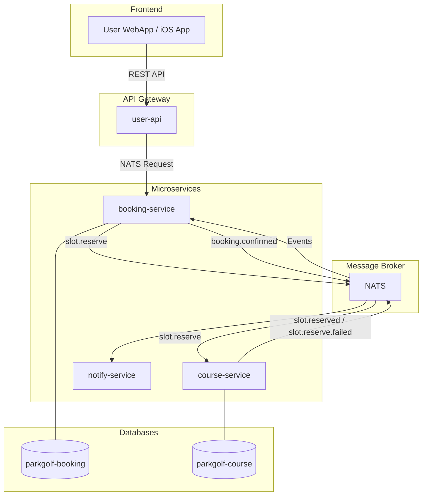
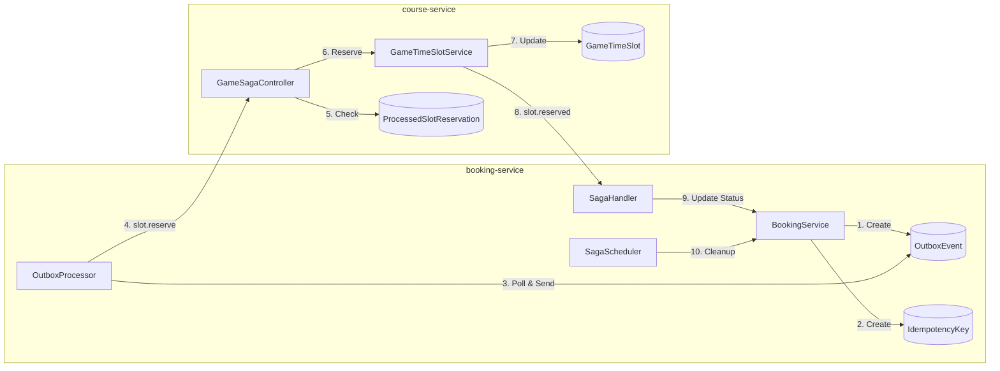
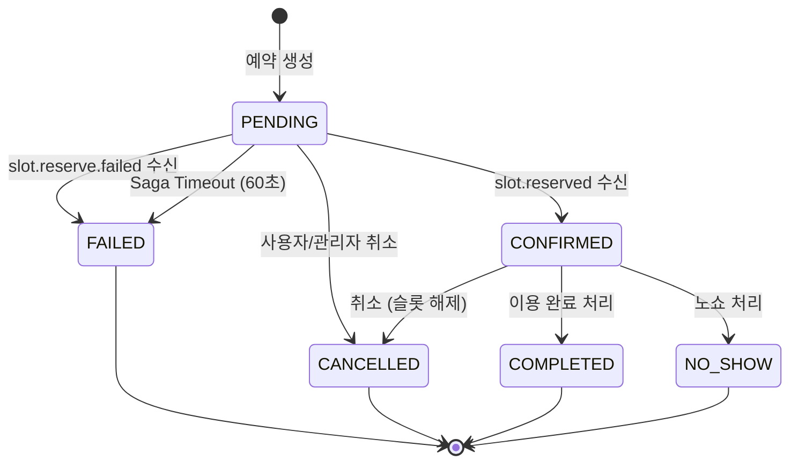
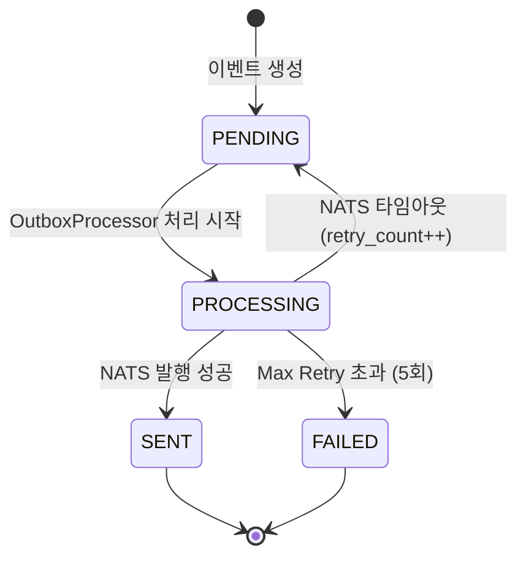
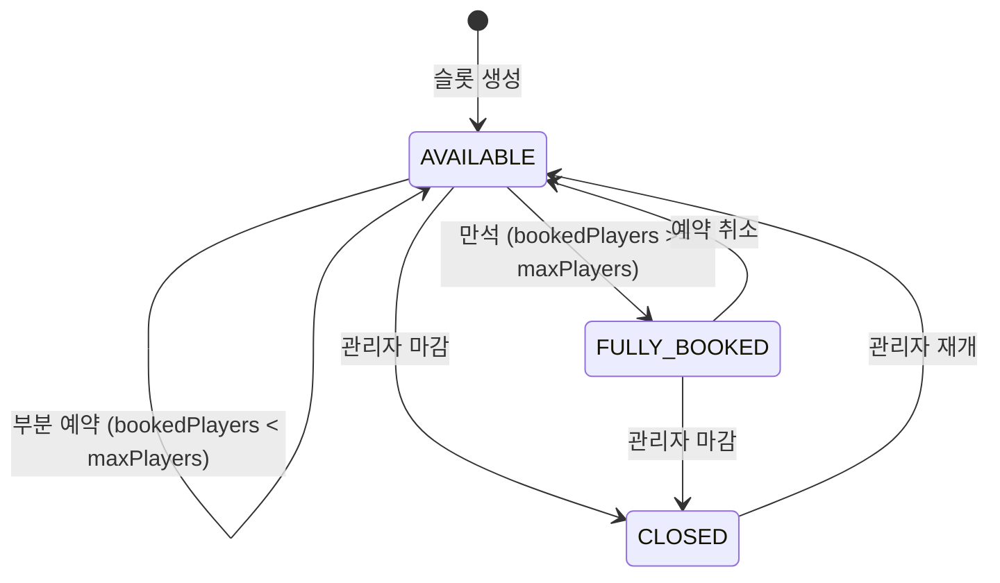
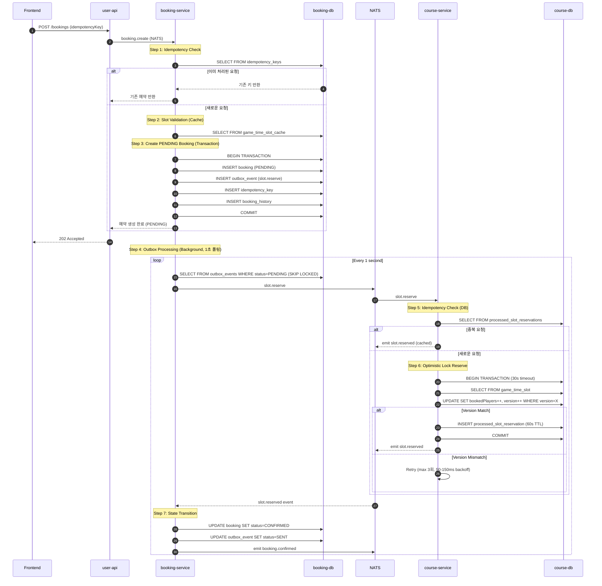
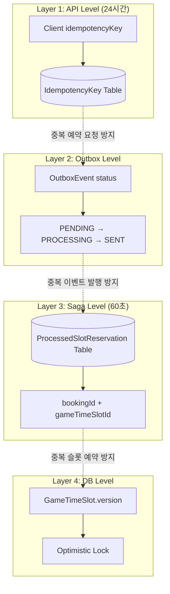
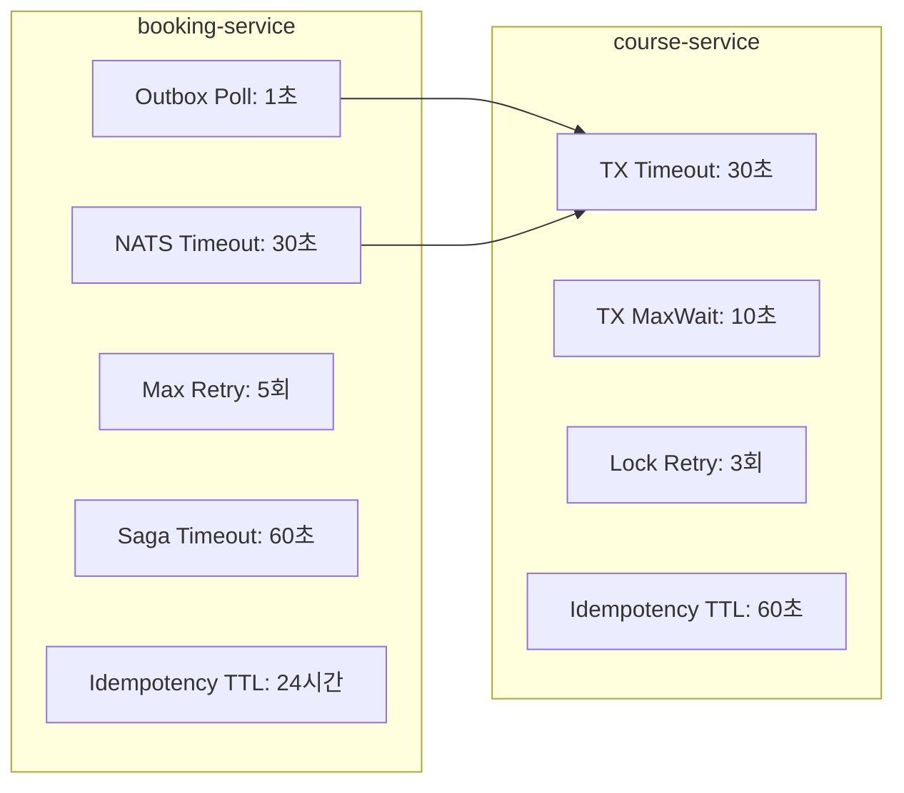
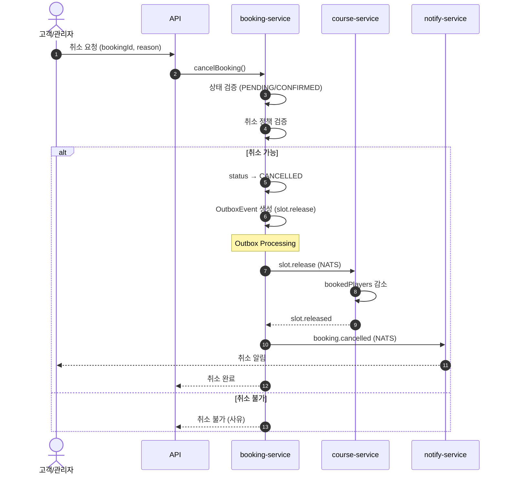

# 예약 워크플로우 및 Saga 아키텍처

> 버전: 2.0
> 최종 수정: 2026-01-21
> 이전 문서: BOOKING_SAGA_ARCHITECTURE.md, booking-workflow-design.md (통합됨)

## 목차

1. [개요](#1-개요)
2. [시스템 아키텍처](#2-시스템-아키텍처)
3. [예약 상태 정의](#3-예약-상태-정의)
4. [Saga 트랜잭션 흐름](#4-saga-트랜잭션-흐름)
5. [멱등성 처리](#5-멱등성-처리)
6. [동시성 제어](#6-동시성-제어)
7. [타임아웃 및 재시도 설정](#7-타임아웃-및-재시도-설정)
8. [취소 및 환불 프로세스](#8-취소-및-환불-프로세스)
9. [모니터링 및 디버깅](#9-모니터링-및-디버깅)

---

## 1. 개요

파크골프 예약 시스템은 **Choreography 기반 Saga 패턴**으로 분산 트랜잭션을 처리합니다.

### 1.1 주요 구성 요소

| 서비스 | 역할 | 데이터베이스 |
|--------|------|-------------|
| **booking-service** | 예약 생성, Saga 오케스트레이션, Outbox 처리 | parkgolf-booking |
| **course-service** | 타임슬롯 관리, 슬롯 예약/해제 | parkgolf-course |
| **user-api** | BFF, 클라이언트 요청 처리 | - |
| **notify-service** | 알림 발송 | parkgolf-notify |

### 1.2 사용 기술

- **메시징**: NATS (Request-Reply + Event 패턴)
- **패턴**: Transactional Outbox, Saga, Optimistic Locking
- **ORM**: Prisma
- **인프라**: GCP Cloud Run, Cloud SQL

### 1.3 주요 액터

- **고객(User)**: 예약 생성, 취소 요청
- **관리자(Admin)**: 예약 확정, 취소 처리, 노쇼 처리
- **시스템(System)**: Saga 오케스트레이션, 자동 상태 전이

---

## 2. 시스템 아키텍처

### 2.1 전체 시스템 구조



### 2.2 Saga 컴포넌트 구조



---

## 3. 예약 상태 정의

### 3.1 BookingStatus (예약 상태)

```
┌──────────────┬──────────────────────────────────────────────────────────┐
│ PENDING      │ 예약 생성됨, Saga 진행 중 (슬롯 예약 대기)                 │
│ CONFIRMED    │ 예약 확정 (슬롯 예약 완료)                                 │
│ COMPLETED    │ 이용 완료                                                  │
│ CANCELLED    │ 취소됨                                                     │
│ NO_SHOW      │ 노쇼 (미방문)                                              │
│ FAILED       │ Saga 실패 (슬롯 예약 실패, 타임아웃 등)                    │
└──────────────┴──────────────────────────────────────────────────────────┘
```

> **참고**: 현재 결제 프로세스가 없으므로 `SLOT_RESERVED` 상태는 건너뛰고 `PENDING → CONFIRMED`로 직접 전이됩니다.

### 3.2 상태 전이 다이어그램



### 3.3 OutboxEvent 상태



### 3.4 TimeSlotStatus (타임슬롯 상태)



---

## 4. Saga 트랜잭션 흐름

### 4.1 예약 생성 시퀀스



### 4.2 단계별 상세 코드

#### Step 1: 멱등성 키 확인 (booking-service)

```typescript
// booking.service.ts
const existingIdempotencyKey = await this.prisma.idempotencyKey.findUnique({
  where: { key: dto.idempotencyKey },
});

if (existingIdempotencyKey?.aggregateId) {
  // 이미 처리된 요청 → 기존 예약 반환
  return await this.getBookingById(Number(existingIdempotencyKey.aggregateId));
}
```

#### Step 3: Transactional Outbox Pattern

```typescript
// booking.service.ts
const booking = await this.prisma.$transaction(async (tx) => {
  // 1. 예약 생성 (PENDING 상태)
  const newBooking = await tx.booking.create({
    data: {
      status: BookingStatus.PENDING,
      // ... other fields
    },
  });

  // 2. OutboxEvent 생성 (같은 트랜잭션)
  await tx.outboxEvent.create({
    data: {
      eventType: 'slot.reserve',
      payload: { bookingId: newBooking.id, ... },
      status: OutboxStatus.PENDING,
    },
  });

  // 3. 멱등성 키 저장
  await tx.idempotencyKey.create({
    data: {
      key: dto.idempotencyKey,
      aggregateId: String(newBooking.id),
      expiresAt: new Date(Date.now() + 24 * 60 * 60 * 1000), // 24시간
    },
  });

  // 4. 히스토리 기록
  await tx.bookingHistory.create({
    data: { bookingId: newBooking.id, action: 'CREATED', ... },
  });

  return newBooking;
});
```

#### Step 4: Outbox Processor

```typescript
// outbox-processor.service.ts
const POLL_INTERVAL_MS = 1000;    // 1초마다 폴링
const BATCH_SIZE = 10;            // 한 번에 처리할 이벤트 수
const MAX_RETRY_COUNT = 5;        // 최대 재시도 횟수

// FOR UPDATE SKIP LOCKED로 동시 처리 방지
const events = await this.prisma.$queryRaw`
  SELECT * FROM outbox_events
  WHERE status = 'PENDING'
  ORDER BY created_at ASC
  LIMIT ${BATCH_SIZE}
  FOR UPDATE SKIP LOCKED
`;
```

#### Step 6: Optimistic Locking (course-service)

```typescript
// game-time-slot.service.ts
const currentVersion = slot.version;

const updatedSlot = await tx.gameTimeSlot.updateMany({
  where: {
    id: timeSlotId,
    version: currentVersion,  // Optimistic Lock
  },
  data: {
    bookedPlayers: slot.bookedPlayers + playerCount,
    status: newStatus,
    version: currentVersion + 1,
  },
});

if (updatedSlot.count === 0) {
  throw new ConflictException('Concurrent modification detected');
}
```

---

## 5. 멱등성 처리

### 5.1 계층별 멱등성 보장



### 5.2 각 계층별 역할

| 계층 | 위치 | 저장소 | TTL | 목적 |
|------|------|--------|-----|------|
| **API Level** | booking-service | PostgreSQL (idempotency_keys) | 24시간 | 클라이언트 중복 요청 방지 |
| **Outbox Level** | booking-service | PostgreSQL (outbox_events) | - | 이벤트 중복 발행 방지 |
| **Saga Level** | course-service | PostgreSQL (processed_slot_reservations) | 60초 | 슬롯 중복 예약 방지 |
| **DB Level** | course-service | PostgreSQL (game_time_slots.version) | - | 동시성 제어 (Optimistic Lock) |

### 5.3 Saga 레벨 멱등성 (course-service)

```typescript
// game-time-slot.service.ts
const IDEMPOTENCY_TTL_MS = 60000; // 60초 TTL

// 1. 중복 요청 확인
const existingReservation = await this.prisma.processedSlotReservation.findUnique({
  where: {
    bookingId_gameTimeSlotId: { bookingId, gameTimeSlotId: timeSlotId },
  },
});

if (existingReservation) {
  return { success: true }; // 즉시 성공 반환 (슬롯 수정 안 함)
}

// 2. 슬롯 예약 처리 후 레코드 저장
await this.prisma.processedSlotReservation.create({
  data: {
    bookingId,
    gameTimeSlotId: timeSlotId,
    expiresAt: new Date(Date.now() + IDEMPOTENCY_TTL_MS),
  },
});

// 3. 5분마다 만료된 레코드 정리 (Cleanup Job)
```

---

## 6. 동시성 제어

### 6.1 Optimistic Locking

GameTimeSlot 테이블의 `version` 필드를 사용하여 동시성 제어:

```sql
-- 슬롯 예약 시
UPDATE game_time_slots
SET booked_players = booked_players + :playerCount,
    version = version + 1,
    status = CASE WHEN booked_players + :playerCount >= max_players
             THEN 'FULLY_BOOKED' ELSE 'AVAILABLE' END
WHERE id = :slotId AND version = :currentVersion;

-- affected rows = 0 이면 버전 충돌 → 재시도
```

### 6.2 재시도 로직

```typescript
// course-service: 최대 3회 재시도, 지수 백오프
const MAX_RETRIES = 3;
const BASE_DELAY_MS = 50;

for (let attempt = 1; attempt <= MAX_RETRIES; attempt++) {
  try {
    return await this.reserveSlotWithLock(timeSlotId, playerCount);
  } catch (error) {
    if (error instanceof ConflictException && attempt < MAX_RETRIES) {
      await sleep(BASE_DELAY_MS * attempt); // 50ms, 100ms, 150ms
      continue;
    }
    throw error;
  }
}
```

### 6.3 Outbox 동시 처리 방지

```sql
-- FOR UPDATE SKIP LOCKED: 이미 처리 중인 이벤트 건너뛰기
SELECT * FROM outbox_events
WHERE status = 'PENDING'
ORDER BY created_at ASC
LIMIT 10
FOR UPDATE SKIP LOCKED;
```

---

## 7. 타임아웃 및 재시도 설정

### 7.1 현재 설정값



### 7.2 설정 상세

| 설정 | 값 | 서비스 | 용도 |
|------|-----|--------|------|
| `POLL_INTERVAL_MS` | 1,000ms | booking | Outbox 폴링 주기 |
| `BATCH_SIZE` | 10 | booking | 한 번에 처리할 이벤트 수 |
| `MAX_RETRY_COUNT` | 5 | booking | Outbox 최대 재시도 |
| `NATS_TIMEOUT` | 30,000ms | booking | NATS 요청 타임아웃 |
| `SAGA_TIMEOUT_MS` | 60,000ms | booking | PENDING 상태 타임아웃 |
| `IDEMPOTENCY_KEY_TTL` | 24시간 | booking | 멱등성 키 보관 기간 |
| `TX_TIMEOUT` | 30,000ms | course | Prisma 트랜잭션 타임아웃 |
| `TX_MAX_WAIT` | 10,000ms | course | 트랜잭션 대기 최대 시간 |
| `LOCK_RETRY_COUNT` | 3 | course | Optimistic Lock 재시도 |
| `SLOT_IDEMPOTENCY_TTL` | 60,000ms | course | 슬롯 예약 멱등성 TTL |

### 7.3 정리 작업 스케줄

| 작업 | 주기 | 대상 | 서비스 |
|------|------|------|--------|
| PENDING 예약 타임아웃 | 1분마다 | 60초 이상 PENDING 예약 | booking |
| 오래된 Outbox 이벤트 삭제 | 매일 자정 | 7일 이상 된 SENT 이벤트 | booking |
| 만료된 슬롯 예약 레코드 삭제 | 5분마다 | TTL 만료된 레코드 | course |

---

## 8. 취소 및 환불 프로세스

### 8.1 취소 유형

| 취소 유형 | 요청자 | 시점 제한 | 환불 | 슬롯 해제 |
|----------|--------|----------|------|----------|
| **고객 취소** | 고객 | 정책에 따름 | 정책에 따름 | O |
| **관리자 취소** | 관리자 | 제한 없음 | 전액 | O |
| **시스템 취소** | 시스템 | 자동 | 전액 | O |
| **Saga 실패** | 시스템 | PENDING 상태 | - | X (미예약) |

### 8.2 취소 프로세스



### 8.3 슬롯 해제 (Compensation)

```typescript
// course-service: releaseSlotForSaga
async releaseSlotForSaga(timeSlotId: number, playerCount: number) {
  return await this.prisma.$transaction(async (tx) => {
    const slot = await tx.gameTimeSlot.findUnique({
      where: { id: timeSlotId },
    });

    const newBookedPlayers = Math.max(0, slot.bookedPlayers - playerCount);
    const newStatus = newBookedPlayers < slot.maxPlayers
      ? TimeSlotStatus.AVAILABLE
      : TimeSlotStatus.FULLY_BOOKED;

    await tx.gameTimeSlot.update({
      where: { id: timeSlotId },
      data: {
        bookedPlayers: newBookedPlayers,
        status: newStatus,
        version: { increment: 1 },
      },
    });
  }, {
    timeout: 30000,
    maxWait: 10000,
  });
}
```

### 8.4 환불 정책 (기본)

```
┌──────────────────────┬──────────────────────────────────────────────────┐
│ 예약일 7일 전 취소   │ 100% 환불                                        │
│ 예약일 3~7일 전 취소 │ 80% 환불 (20% 수수료)                            │
│ 예약일 1~3일 전 취소 │ 50% 환불 (50% 수수료)                            │
│ 예약일 24시간 이내   │ 환불 불가 (또는 30%)                             │
│ 노쇼                 │ 환불 불가                                        │
│ 관리자/시스템 취소   │ 100% 환불                                        │
└──────────────────────┴──────────────────────────────────────────────────┘
```

> **참고**: 현재 결제 시스템 미구현으로 환불 프로세스는 향후 구현 예정

---

## 9. 모니터링 및 디버깅

### 9.1 로그 태그

| 태그 | 서비스 | 용도 |
|------|--------|------|
| `[REQ-xxx]` | booking-service | 요청 추적 ID |
| `[Outbox]` | booking-service | Outbox 이벤트 처리 |
| `[SagaHandler]` | booking-service | Saga 상태 전이 |
| `[Saga]` | course-service | 슬롯 예약 처리 |

### 9.2 로그 예시

```
# 정상 흐름
[REQ-123] ========== BOOKING CREATE START ==========
[REQ-123] Step 1: Idempotency key check passed
[REQ-123] Step 2: Slot validation passed
[REQ-123] Step 3: COMPLETED - Booking BK-ABC123 created with PENDING status
[Outbox] Processing event 42 (slot.reserve) for bookingId=15
[Saga] ========== SLOT_RESERVE REQUEST RECEIVED ==========
[Saga] Idempotency check completed in 2ms
[Saga] Slot query completed in 5ms
[Saga] Current slot state: status=AVAILABLE, bookedPlayers=2, maxPlayers=4, version=5
[Saga] Slot update completed in 8ms
[Saga] SLOT_RESERVE SUCCESS in 18ms - bookingId=15, emitting slot.reserved
[SagaHandler] Booking 15 CONFIRMED successfully

# 중복 요청 감지
[Saga] DUPLICATE REQUEST DETECTED: bookingId=15, slotId=848 - returning cached success

# 동시성 충돌
[Saga] Attempt 1/3 for slot 123
[Saga] ConflictException: Concurrent modification detected
[Saga] Retrying after 50ms...
[Saga] Attempt 2/3 for slot 123
[Saga] Slot update completed successfully
```

### 9.3 GCP Cloud Logging 쿼리

```
# Saga 관련 로그 조회
resource.type="cloud_run_revision"
resource.labels.service_name="course-service-dev"
textPayload:("[Saga]")

# 특정 예약 추적
resource.type="cloud_run_revision"
textPayload:("bookingId=15")

# Outbox 이벤트 처리 추적
resource.type="cloud_run_revision"
resource.labels.service_name="booking-service-dev"
textPayload:("[Outbox]")
```

### 9.4 성능 메트릭

| 단계 | 예상 소요 시간 |
|------|---------------|
| Idempotency Check | 1-5ms |
| Slot Query | 3-10ms |
| Slot Update (with lock) | 5-15ms |
| Total Saga (booking → confirmed) | 50-200ms |

---

## 변경 이력

| 버전 | 날짜 | 변경 내용 |
|------|------|----------|
| 2.0 | 2026-01-21 | BOOKING_SAGA_ARCHITECTURE.md, booking-workflow-design.md 통합 및 소스 코드 반영 |
| 1.0 | 2026-01-12 | booking-workflow-design.md 초안 작성 |
| 1.0 | 2026-01-06 | BOOKING_SAGA_ARCHITECTURE.md 작성 |

---

## 참고 자료

- [Microservices Patterns - Saga Pattern](https://microservices.io/patterns/data/saga.html)
- [Transactional Outbox Pattern](https://microservices.io/patterns/data/transactional-outbox.html)
- [Optimistic Locking - Prisma](https://www.prisma.io/docs/concepts/components/prisma-client/transactions#optimistic-concurrency-control)
