# Booking Saga Architecture

파크골프 예약 시스템의 분산 트랜잭션 처리를 위한 Saga 패턴 아키텍처 문서입니다.

## 목차

1. [개요](#개요)
2. [아키텍처 다이어그램](#아키텍처-다이어그램)
3. [Saga 트랜잭션 흐름](#saga-트랜잭션-흐름)
4. [멱등성(Idempotency) 처리](#멱등성idempotency-처리)
5. [중복 방지 메커니즘](#중복-방지-메커니즘)
6. [타임아웃 및 재시도 설정](#타임아웃-및-재시도-설정)
7. [상태 전이 다이어그램](#상태-전이-다이어그램)
8. [에러 처리 및 보상 트랜잭션](#에러-처리-및-보상-트랜잭션)

---

## 개요

예약 시스템은 **booking-service**와 **course-service** 두 개의 마이크로서비스로 구성되며,
NATS 메시징을 통해 Saga 패턴으로 분산 트랜잭션을 처리합니다.

### 주요 구성 요소

| 서비스 | 역할 | 데이터베이스 |
|--------|------|-------------|
| booking-service | 예약 생성, 상태 관리, Outbox 처리 | parkgolf-booking |
| course-service | 슬롯 예약, 가용성 관리 | parkgolf-course |

### 사용 기술

- **메시징**: NATS (Request-Reply + Event 패턴)
- **패턴**: Transactional Outbox, Saga, Optimistic Locking
- **ORM**: Prisma
- **인프라**: GCP Cloud Run, Cloud SQL

---

## 아키텍처 다이어그램

### 전체 시스템 구조

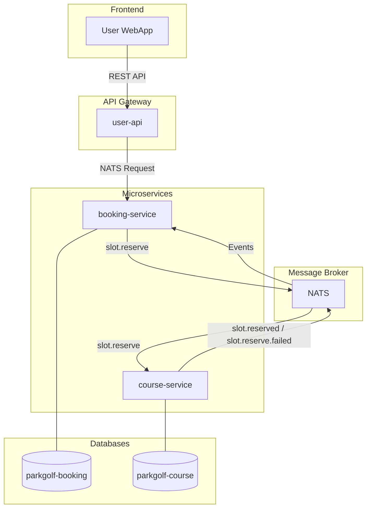

### Saga 컴포넌트 구조

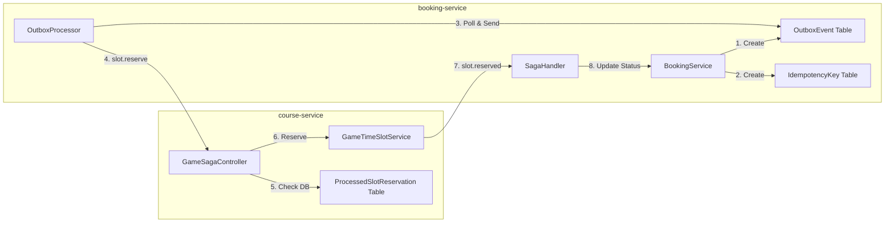

---

## Saga 트랜잭션 흐름

### 예약 생성 시퀀스

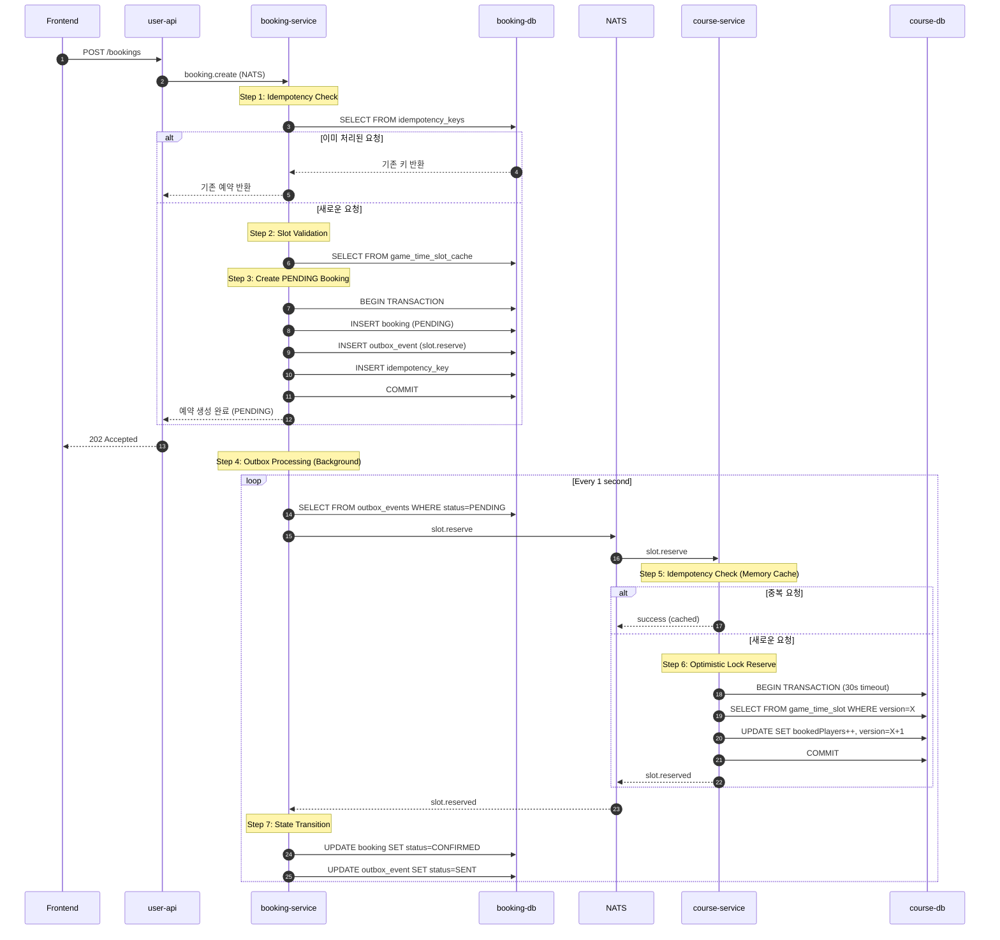

### 단계별 상세 설명

#### Step 1: 멱등성 키 확인 (booking-service)

```typescript
// booking.service.ts
const existingIdempotencyKey = await this.prisma.idempotencyKey.findUnique({
  where: { key: dto.idempotencyKey },
});

if (existingIdempotencyKey?.aggregateId) {
  // 이미 처리된 요청 → 기존 예약 반환
  return await this.getBookingById(Number(existingIdempotencyKey.aggregateId));
}
```

#### Step 2-3: PENDING 예약 생성 + Outbox Event

```typescript
// booking.service.ts - Transactional Outbox Pattern
const booking = await this.prisma.$transaction(async (prisma) => {
  // 예약 생성 (PENDING 상태)
  const newBooking = await prisma.booking.create({
    data: {
      status: BookingStatus.PENDING,  // Saga 시작
      // ... other fields
    },
  });

  // OutboxEvent 생성 (같은 트랜잭션)
  await prisma.outboxEvent.create({
    data: {
      eventType: 'slot.reserve',
      payload: { bookingId: newBooking.id, ... },
      status: OutboxStatus.PENDING,
    },
  });

  // 멱등성 키 저장
  await prisma.idempotencyKey.create({
    data: { key: dto.idempotencyKey, aggregateId: String(newBooking.id) },
  });

  return newBooking;
});
```

#### Step 4: Outbox Processor (Background)

```typescript
// outbox-processor.service.ts
const POLL_INTERVAL_MS = 1000;    // 1초마다 폴링
const NATS_TIMEOUT_MS = 15000;    // 15초 타임아웃

// 1초마다 PENDING 이벤트 조회 및 발행
setInterval(async () => {
  const events = await this.prisma.$queryRaw`
    SELECT * FROM outbox_events
    WHERE status = 'PENDING'
    LIMIT 10
    FOR UPDATE SKIP LOCKED
  `;

  for (const event of events) {
    await this.processEvent(event);
  }
}, POLL_INTERVAL_MS);
```

#### Step 5: 중복 요청 방지 (course-service DB Table)

```typescript
// game-time-slot.service.ts
const IDEMPOTENCY_TTL_MS = 60000; // 1분 TTL

async reserveSlotForSaga(timeSlotId, playerCount, bookingId) {
  // DB에서 이미 처리된 요청인지 확인
  const existingReservation = await this.prisma.processedSlotReservation.findUnique({
    where: {
      bookingId_gameTimeSlotId: { bookingId, gameTimeSlotId: timeSlotId },
    },
  });

  if (existingReservation) {
    return { success: true }; // 즉시 성공 반환
  }

  // 슬롯 예약 처리...

  // 성공 시 DB에 저장 (1분 TTL)
  await this.prisma.processedSlotReservation.create({
    data: {
      bookingId,
      gameTimeSlotId: timeSlotId,
      expiresAt: new Date(Date.now() + IDEMPOTENCY_TTL_MS),
    },
  });
}
```

#### Step 6: Optimistic Locking (course-service)

```typescript
// game-time-slot.service.ts
const result = await this.prisma.$transaction(async (tx) => {
  const slot = await tx.gameTimeSlot.findUnique({
    where: { id: timeSlotId },
  });

  // Version 체크로 동시성 제어
  const updatedSlot = await tx.gameTimeSlot.updateMany({
    where: {
      id: timeSlotId,
      version: slot.version,  // Optimistic Lock
    },
    data: {
      bookedPlayers: slot.bookedPlayers + playerCount,
      version: slot.version + 1,
    },
  });

  if (updatedSlot.count === 0) {
    throw new ConflictException('Concurrent modification');
  }
}, {
  timeout: 30000,  // 30초 타임아웃
  maxWait: 10000,  // 10초 대기
});
```

---

## 멱등성(Idempotency) 처리

### 계층별 멱등성 보장

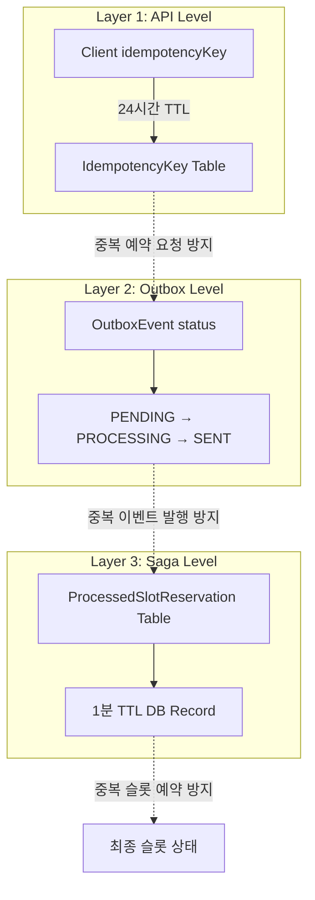

### 1. API 레벨 멱등성 (booking-service)

**목적**: 클라이언트의 중복 예약 요청 방지

```
┌─────────────────────────────────────────────────────┐
│                 IdempotencyKey Table                │
├─────────────────────────────────────────────────────┤
│ key: "client-uuid-12345"                            │
│ aggregateType: "Booking"                            │
│ aggregateId: "42"                                   │
│ expiresAt: 2026-01-07T06:00:00Z (24시간 후)         │
└─────────────────────────────────────────────────────┘
```

**흐름**:
1. 클라이언트가 `idempotencyKey`를 포함하여 예약 요청
2. booking-service가 `idempotency_keys` 테이블에서 키 조회
3. 키가 존재하면 기존 예약 반환 (DB 조회)
4. 키가 없으면 새 예약 생성 + 키 저장

### 2. Outbox 레벨 중복 방지 (booking-service)

**목적**: 동일 이벤트 중복 발행 방지

```
OutboxEvent Status Flow:
PENDING → PROCESSING → SENT
                    ↘ FAILED (재시도)
```

**흐름**:
1. OutboxProcessor가 `PENDING` 상태 이벤트 조회 (`FOR UPDATE SKIP LOCKED`)
2. 처리 시작 시 `PROCESSING`으로 상태 변경
3. NATS 발행 성공 시 `SENT`로 변경
4. 실패 시 `retry_count` 증가 후 `PENDING`으로 복귀

### 3. Saga 레벨 멱등성 (course-service)

**목적**: 동일 예약에 대한 중복 슬롯 예약 방지

```sql
-- processed_slot_reservations 테이블
CREATE TABLE processed_slot_reservations (
  id              SERIAL PRIMARY KEY,
  booking_id      INT NOT NULL,
  game_time_slot_id INT NOT NULL,
  processed_at    TIMESTAMP DEFAULT NOW(),
  expires_at      TIMESTAMP NOT NULL,
  UNIQUE(booking_id, game_time_slot_id)
);
CREATE INDEX idx_expires_at ON processed_slot_reservations(expires_at);
```

**흐름**:
1. slot.reserve 요청 수신
2. `(bookingId, gameTimeSlotId)` 복합키로 DB 조회
3. 레코드 존재 → 즉시 success 반환 (슬롯 수정 안 함)
4. 레코드 없음 → 슬롯 예약 처리 → DB에 레코드 저장 (1분 TTL)

---

## 중복 방지 메커니즘

### 전체 중복 방지 흐름

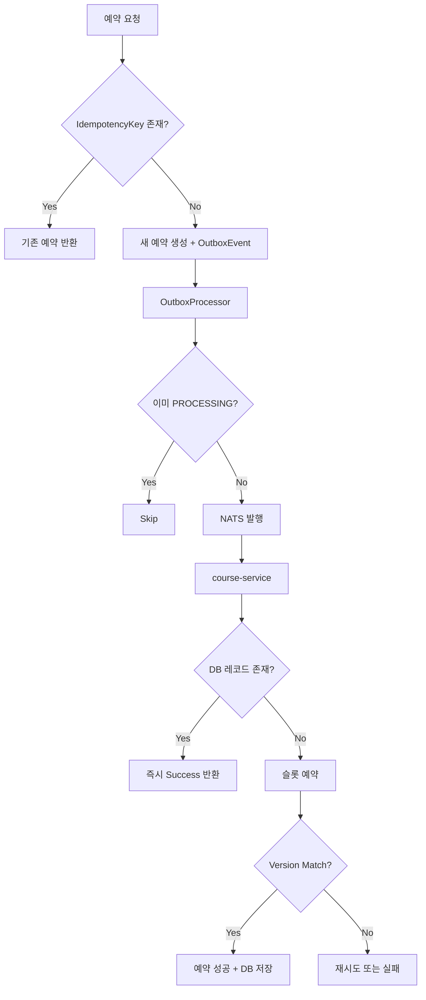

### 각 계층별 역할

| 계층 | 위치 | 저장소 | TTL | 목적 |
|------|------|--------|-----|------|
| API Level | booking-service | PostgreSQL (idempotency_keys) | 24시간 | 클라이언트 중복 요청 |
| Outbox Level | booking-service | PostgreSQL (outbox_events) | - | 이벤트 중복 발행 |
| Saga Level | course-service | PostgreSQL (processed_slot_reservations) | 1분 | 슬롯 중복 예약 |
| DB Level | course-service | PostgreSQL (game_time_slots.version) | - | 동시성 (Optimistic Lock) |

---

## 타임아웃 및 재시도 설정

### 현재 설정값

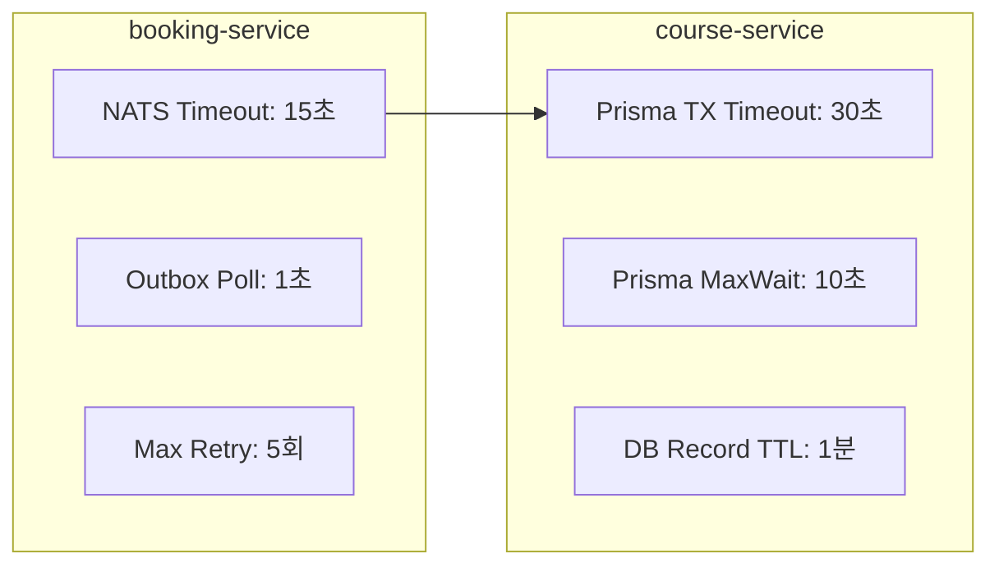

### 설정 파일 위치

```typescript
// booking-service/src/booking/service/outbox-processor.service.ts
const POLL_INTERVAL_MS = 1000;       // 1초마다 폴링
const BATCH_SIZE = 10;               // 한 번에 처리할 이벤트 수
const MAX_RETRY_COUNT = 5;           // 최대 재시도 횟수
const NATS_TIMEOUT_MS = 15000;       // NATS 호출 타임아웃 (15초)

// course-service/src/game/service/game-time-slot.service.ts
const IDEMPOTENCY_TTL_MS = 60000;    // DB Record TTL (1분)

// Prisma Transaction Options
{
  timeout: 30000,  // 30초 (Cloud Run cold start 대응)
  maxWait: 10000,  // 최대 10초 대기
}
```

### 타임아웃 발생 시 동작

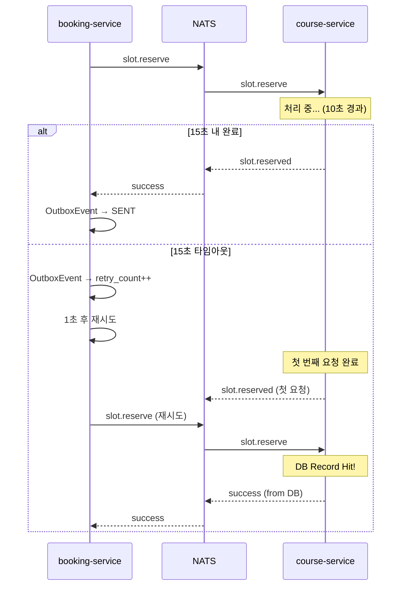

---

## 상태 전이 다이어그램

### Booking 상태 전이

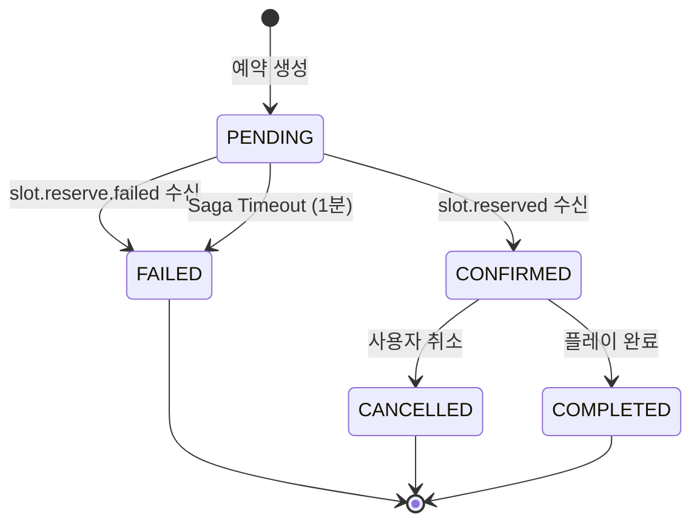

### OutboxEvent 상태 전이

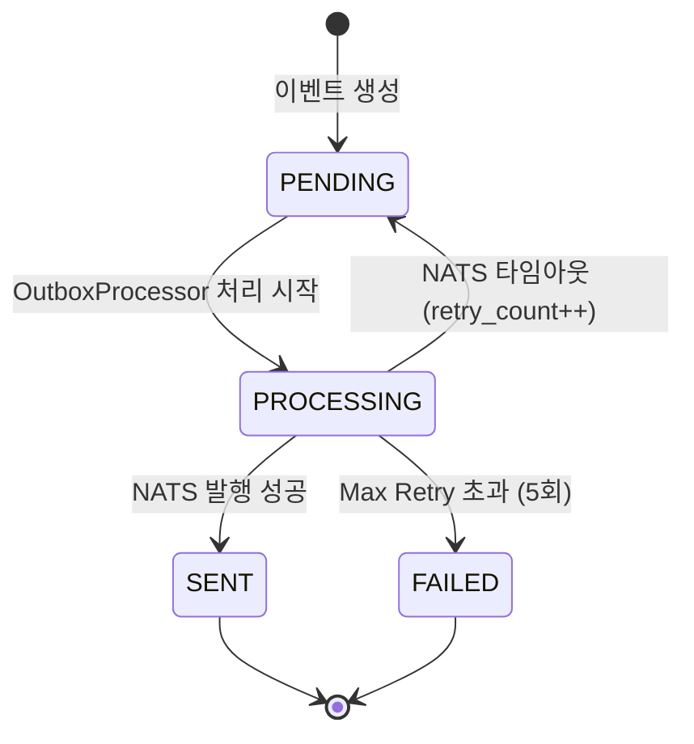

### GameTimeSlot 상태 전이

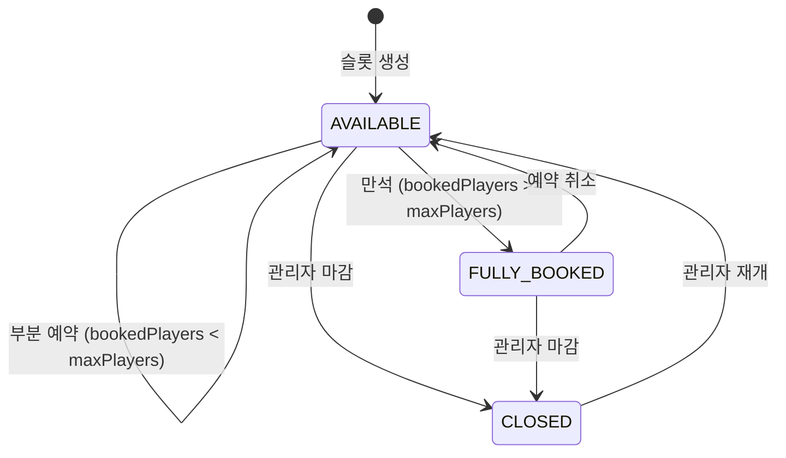

---

## 에러 처리 및 보상 트랜잭션

### 실패 시나리오별 처리

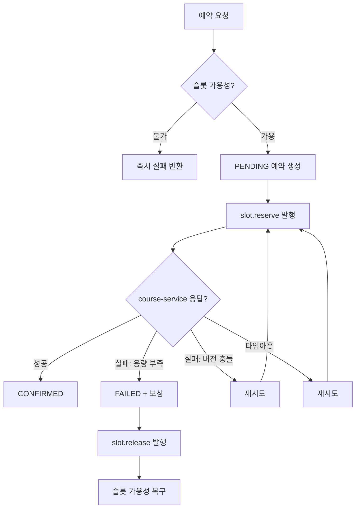

### 보상 트랜잭션 (Compensation)

```typescript
// saga-handler.service.ts
async handleSlotReserveFailed(data: {
  bookingId: number;
  gameTimeSlotId: number;
  reason: string;
}) {
  // PENDING → FAILED 상태 전이
  await this.prisma.$transaction(async (prisma) => {
    await prisma.booking.update({
      where: { id: data.bookingId },
      data: {
        status: BookingStatus.FAILED,
        sagaFailReason: data.reason,
      },
    });

    await prisma.bookingHistory.create({
      data: {
        bookingId: data.bookingId,
        action: 'SAGA_FAILED',
        details: { reason: data.reason },
      },
    });
  });
}
```

### Saga 타임아웃 처리

```typescript
// saga-handler.service.ts
const SAGA_TIMEOUT_MS = 60000; // 1분

async cleanupTimedOutBookings() {
  const timeoutThreshold = new Date(Date.now() - SAGA_TIMEOUT_MS);

  const timedOutBookings = await this.prisma.booking.findMany({
    where: {
      status: BookingStatus.PENDING,
      createdAt: { lt: timeoutThreshold },
    },
  });

  for (const booking of timedOutBookings) {
    await this.prisma.booking.update({
      where: { id: booking.id },
      data: {
        status: BookingStatus.FAILED,
        sagaFailReason: 'Saga timeout',
      },
    });
  }
}
```

---

## 모니터링 및 디버깅

### 로그 태그

| 태그 | 서비스 | 용도 |
|------|--------|------|
| `[REQ-xxx]` | booking-service | 요청 추적 ID |
| `[Outbox]` | booking-service | Outbox 이벤트 처리 |
| `[SagaHandler]` | booking-service | Saga 상태 전이 |
| `[Saga]` | course-service | 슬롯 예약 처리 |

### 로그 예시

```
# 정상 흐름
[REQ-123] ========== BOOKING CREATE START ==========
[REQ-123] Step 1: Idempotency key check passed
[REQ-123] Step 2: Slot validation passed
[REQ-123] Step 3: COMPLETED - Booking BK-ABC123 created with PENDING status
[Outbox] Processing event 42 (slot.reserve) for bookingId=15
[Saga] ========== reserveSlotForSaga START ==========
[Saga] Slot 848 reserved successfully (version: 1 -> 2)
[SagaHandler] Booking 15 CONFIRMED successfully

# 중복 요청 감지
[Saga] DUPLICATE REQUEST DETECTED: bookingId=15, slotId=848 - returning cached success
```

### GCP Cloud Logging 쿼리

```
# Saga 관련 로그 조회
resource.type="cloud_run_revision"
resource.labels.service_name="course-service-dev"
textPayload:("[Saga]")

# 특정 예약 추적
resource.type="cloud_run_revision"
textPayload:("bookingId=15")
```

---

## 참고 자료

- [Microservices Patterns - Saga Pattern](https://microservices.io/patterns/data/saga.html)
- [Transactional Outbox Pattern](https://microservices.io/patterns/data/transactional-outbox.html)
- [Optimistic Locking](https://www.prisma.io/docs/concepts/components/prisma-client/transactions#optimistic-concurrency-control)
