# 예약 워크플로우 및 Saga 아키텍처

> 버전: 3.4
> 최종 수정: 2026-02-24
> 이전 문서: BOOKING_SAGA_ARCHITECTURE.md, booking-workflow-design.md (통합됨)

## 목차

1. [개요](#1-개요)
2. [시스템 아키텍처](#2-시스템-아키텍처)
3. [예약 상태 정의](#3-예약-상태-정의)
4. [Saga 트랜잭션 흐름](#4-saga-트랜잭션-흐름)
5. [멱등성 처리](#5-멱등성-처리)
6. [동시성 제어](#6-동시성-제어)
7. [타임아웃 및 재시도 설정](#7-타임아웃-및-재시도-설정)
8. [취소 및 환불 프로세스](#8-취소-및-환불-프로세스)
9. [모니터링 및 디버깅](#9-모니터링-및-디버깅)

---

## 1. 개요

파크골프 예약 시스템은 **Choreography 기반 Saga 패턴**으로 분산 트랜잭션을 처리합니다.

### 1.1 주요 구성 요소

| 서비스 | 역할 | 데이터베이스 |
|--------|------|-------------|
| **booking-service** | 예약 생성, Saga 오케스트레이션, Outbox 처리 | booking_db |
| **course-service** | 타임슬롯 관리, 슬롯 예약/해제 | course_db |
| **payment-service** | 결제 준비/승인/취소 (토스페이먼츠) | payment_db |
| **iam-service** | 인증/사용자/CompanyMember 관리 | iam_db |
| **user-api** | BFF, 클라이언트 요청 처리 | - |
| **notify-service** | 알림 발송 | notify_db |
| **agent-service** | AI 예약 에이전트 (booking.create 호출) | - (in-memory) |

> AI 에이전트 예약 워크플로우 상세는 [AGENT_BOOKING_WORKFLOW.md](./AGENT_BOOKING_WORKFLOW.md) 섹션 11 참조

### 1.2 사용 기술

- **메시징**: NATS (Request-Reply + Event 패턴)
- **패턴**: Transactional Outbox, Saga, Optimistic Locking
- **결제**: 토스페이먼츠 SDK (위젯 결제)
- **ORM**: Prisma
- **인프라**: GKE Autopilot, PostgreSQL (in-cluster)

### 1.3 주요 액터

- **고객(User)**: 예약 생성, 결제, 취소 요청
- **관리자(Admin)**: 예약 확정, 취소 처리, 노쇼 처리
- **시스템(System)**: Saga 오케스트레이션, 자동 상태 전이

---

## 2. 시스템 아키텍처

### 2.1 전체 시스템 구조

```mermaid
flowchart TB
    subgraph "Frontend"
        A[User WebApp / iOS / Android]
    end

    subgraph "API Gateway"
        B[user-api]
    end

    subgraph "Microservices"
        C[booking-service]
        D[course-service]
        P[payment-service]
        IAM[iam-service]
        E[notify-service]
        AG[agent-service]
    end

    subgraph "Message Broker"
        NATS[NATS]
    end

    subgraph "Databases"
        F[(booking_db)]
        G[(course_db)]
        H[(payment_db)]
        I[(iam_db)]
    end

    subgraph "External"
        TOSS[토스페이먼츠 API]
    end

    A -->|REST API| B
    B -->|NATS Request| C
    B -->|NATS Request| P
    B -->|NATS Request| AG
    AG -->|booking.create| NATS
    C -->|slot.reserve| NATS
    NATS -->|slot.reserve| D
    D -->|slot.reserved / slot.reserve.failed| NATS
    NATS -->|Events| C
    P -->|booking.paymentConfirmed| NATS
    NATS -->|booking.paymentConfirmed| C
    C -->|booking.confirmed| NATS
    C -->|iam.companyMembers.addByBooking| NATS
    NATS --> E
    NATS -->|addByBooking| IAM
    P -->|결제 승인| TOSS
    C --- F
    D --- G
    P --- H
    IAM --- I
```

### 2.2 Saga 컴포넌트 구조

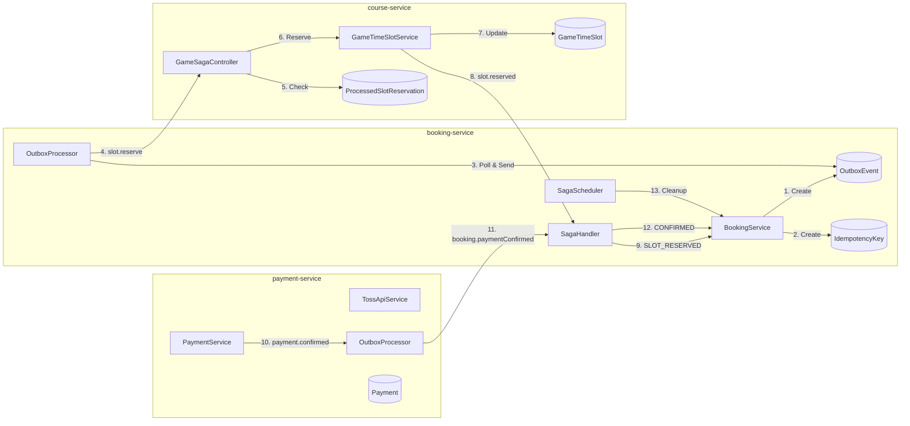

---

## 3. 예약 상태 정의

### 3.1 BookingStatus (예약 상태)

```
┌───────────────┬──────────────────────────────────────────────────────────┐
│ PENDING       │ 예약 생성됨, Saga 진행 중 (슬롯 예약 대기)                 │
│ SLOT_RESERVED │ 슬롯 예약 완료, 결제 대기 (카드결제 시)                    │
│ CONFIRMED     │ 예약 확정 (현장결제: 슬롯 완료 즉시 / 카드결제: 결제 완료) │
│ COMPLETED     │ 이용 완료                                                  │
│ CANCELLED     │ 취소됨                                                     │
│ NO_SHOW       │ 노쇼 (미방문)                                              │
│ FAILED        │ Saga 실패 (슬롯 예약 실패, 결제 실패, 타임아웃 등)        │
└───────────────┴──────────────────────────────────────────────────────────┘
```

### 3.2 상태 전이 다이어그램

결제 방법에 따라 Saga 경로가 분기됩니다.

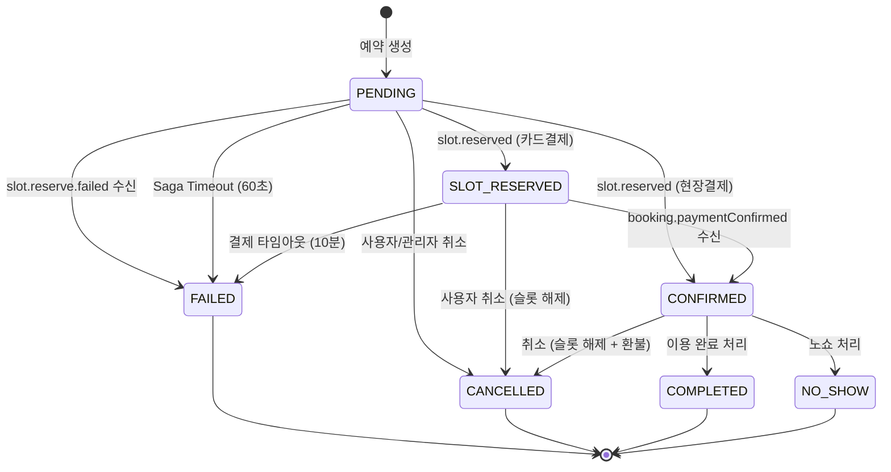

### 3.3 결제 방법별 Saga 경로

| 결제 방법 | Saga 경로 | 설명 |
|----------|-----------|------|
| **현장결제 (onsite)** | `PENDING → CONFIRMED` | 슬롯 예약 완료 시 즉시 확정 (v2.0 동일) |
| **카드결제 (card)** | `PENDING → SLOT_RESERVED → CONFIRMED` | 슬롯 예약 후 결제 완료 시 확정 |

### 3.4 OutboxEvent 상태

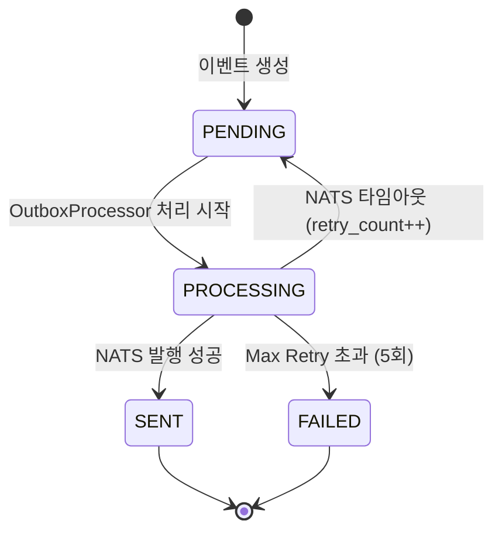

### 3.5 PaymentStatus (결제 상태)

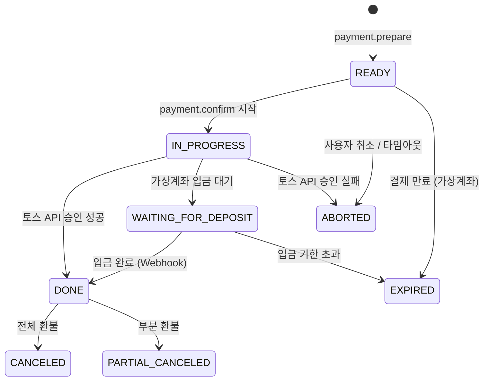

### 3.6 TimeSlotStatus (타임슬롯 상태)

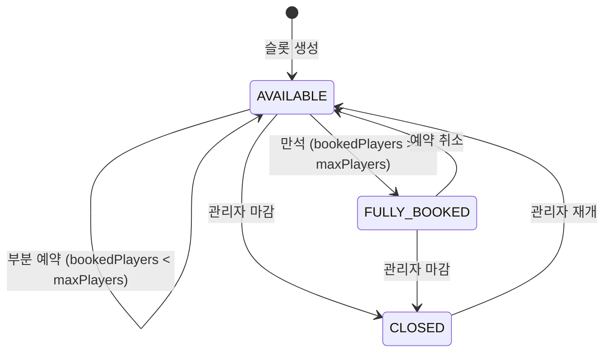

---

## 4. Saga 트랜잭션 흐름

### 4.1 현장결제 시퀀스 (기존 동일)

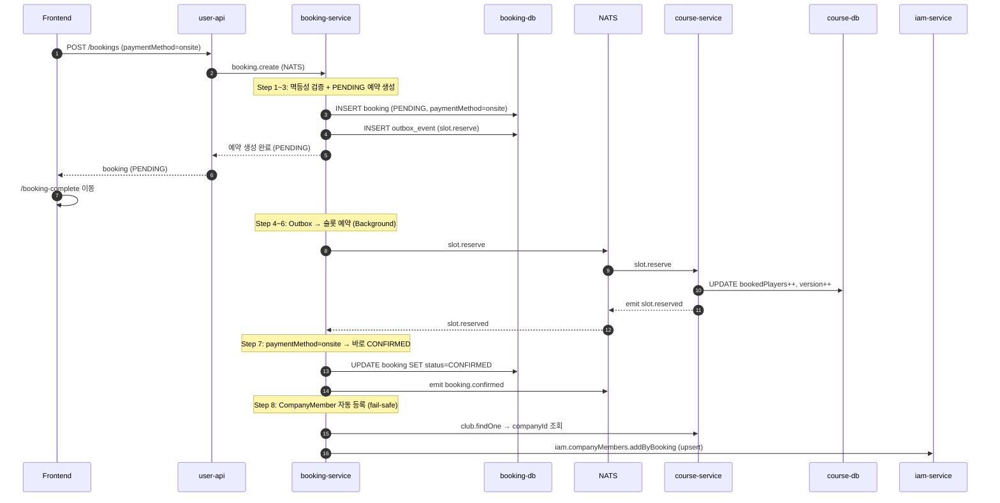

> **AI 에이전트 경유 예약**: agent-service의 `tool-executor`에서 `booking.create` 후 `waitForSagaCompletion()`으로 폴링(300ms × 최대 20회)하여 Saga 완료를 확인합니다. 현장결제는 CONFIRMED, 카드결제는 SLOT_RESERVED까지 대기 후 프론트엔드에 응답합니다. 상세는 [AGENT_BOOKING_WORKFLOW.md](./AGENT_BOOKING_WORKFLOW.md) 섹션 11.4 참조.

### 4.2 카드결제 시퀀스 (신규)

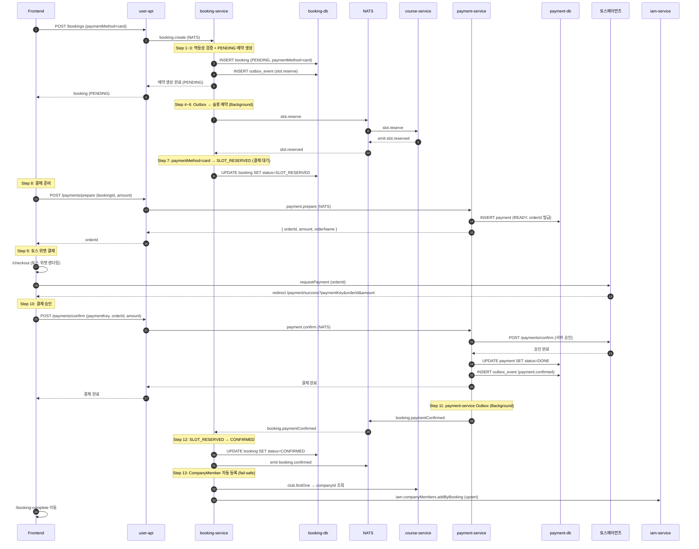

### 4.3 단계별 상세 코드

#### Step 1: 멱등성 키 확인 (booking-service)

```typescript
// booking.service.ts
const existingIdempotencyKey = await this.prisma.idempotencyKey.findUnique({
  where: { key: dto.idempotencyKey },
});

if (existingIdempotencyKey?.aggregateId) {
  // 이미 처리된 요청 → 기존 예약 반환
  return await this.getBookingById(Number(existingIdempotencyKey.aggregateId));
}
```

#### Step 3: Transactional Outbox Pattern

```typescript
// booking.service.ts

// 가격 계산 (슬롯 조회 후)
const pricePerPerson = slot.price;
const totalAmount = pricePerPerson * dto.playerCount;
const serviceFee = Math.floor(totalAmount * 0.03); // 3% 서비스 수수료
const totalPrice = totalAmount + serviceFee;

const booking = await this.prisma.$transaction(async (tx) => {
  // 1. 예약 생성 (PENDING 상태)
  const newBooking = await tx.booking.create({
    data: {
      status: BookingStatus.PENDING,
      paymentMethod: dto.paymentMethod, // 'onsite' | 'card'
      pricePerPerson,
      serviceFee,
      totalPrice,
      // ... other fields
    },
  });

  // 2. OutboxEvent 생성 (같은 트랜잭션)
  await tx.outboxEvent.create({
    data: {
      eventType: 'slot.reserve',
      payload: { bookingId: newBooking.id, ... },
      status: OutboxStatus.PENDING,
    },
  });

  // 3. 멱등성 키 저장
  await tx.idempotencyKey.create({
    data: {
      key: dto.idempotencyKey,
      aggregateId: String(newBooking.id),
      expiresAt: new Date(Date.now() + 24 * 60 * 60 * 1000), // 24시간
    },
  });

  // 4. 히스토리 기록
  await tx.bookingHistory.create({
    data: { bookingId: newBooking.id, action: 'CREATED', ... },
  });

  return newBooking;
});
```

#### Step 4: Outbox Processor

```typescript
// outbox-processor.service.ts
const POLL_INTERVAL_MS = 3000;    // 3초마다 폴링
const BATCH_SIZE = 10;            // 한 번에 처리할 이벤트 수
const MAX_RETRY_COUNT = 5;        // 최대 재시도 횟수

// FOR UPDATE SKIP LOCKED로 동시 처리 방지
const events = await this.prisma.$queryRaw`
  SELECT * FROM outbox_events
  WHERE status = 'PENDING'
  ORDER BY created_at ASC
  LIMIT ${BATCH_SIZE}
  FOR UPDATE SKIP LOCKED
`;
```

#### Step 6: Optimistic Locking (course-service)

```typescript
// game-time-slot.service.ts
const currentVersion = slot.version;

const updatedSlot = await tx.gameTimeSlot.updateMany({
  where: {
    id: timeSlotId,
    version: currentVersion,  // Optimistic Lock
  },
  data: {
    bookedPlayers: slot.bookedPlayers + playerCount,
    status: newStatus,
    version: currentVersion + 1,
  },
});

if (updatedSlot.count === 0) {
  throw new ConflictException('Concurrent modification detected');
}
```

#### Step 7: Saga 분기 (booking-service)

```typescript
// saga-handler.service.ts - handleSlotReserved()
const booking = await this.prisma.booking.findUnique({
  where: { id: data.bookingId },
});

if (booking.paymentMethod === 'card') {
  // 카드결제: PENDING → SLOT_RESERVED (결제 대기)
  await this.prisma.booking.update({
    where: { id: booking.id },
    data: { status: BookingStatus.SLOT_RESERVED },
  });
} else {
  // 현장결제: PENDING → CONFIRMED (즉시 확정)
  await this.prisma.booking.update({
    where: { id: booking.id },
    data: { status: BookingStatus.CONFIRMED },
  });
  // emit booking.confirmed

  // CompanyMember 자동 등록 (fail-safe)
  await this.registerCompanyMember(booking.clubId, booking.userId);
}
```

#### Step 12: 결제 확인 후 확정 (booking-service)

```typescript
// saga-handler.service.ts - handlePaymentConfirmed()
// booking.paymentConfirmed 이벤트 수신 시
const booking = await this.prisma.booking.findUnique({
  where: { id: data.bookingId },
});

if (booking.status === BookingStatus.SLOT_RESERVED) {
  await this.prisma.booking.update({
    where: { id: booking.id },
    data: { status: BookingStatus.CONFIRMED },
  });
  // emit booking.confirmed → notify-service

  // CompanyMember 자동 등록 (fail-safe)
  await this.registerCompanyMember(booking.clubId, booking.userId);
}
```

### 4.4 CompanyMember 자동 등록

예약이 **CONFIRMED** 상태로 전이될 때, 해당 골프장의 가맹점(Company)에 예약자를 회원으로 자동 등록합니다.

#### 호출 지점 (3곳)

| 위치 | 시나리오 | 상태 전이 |
|------|---------|----------|
| `SagaHandlerService.handleSlotReserved()` | 현장결제 예약 | PENDING → CONFIRMED |
| `SagaHandlerService.handlePaymentConfirmed()` | 카드결제 예약 | SLOT_RESERVED → CONFIRMED |
| `BookingService.confirmBooking()` | 관리자 수동 확정 | PENDING → CONFIRMED |

#### 처리 흐름

```
예약 CONFIRMED → club.findOne(clubId) → companyId 조회
              → iam.companyMembers.addByBooking({ companyId, userId }) → upsert
```

#### 코드

```typescript
// booking-service: SagaHandlerService / BookingService 공통 헬퍼
private async registerCompanyMember(clubId: number | null, userId: number | null): Promise<void> {
  if (!clubId || !userId || !this.courseService || !this.iamService) return;

  try {
    // 1. club.findOne으로 companyId 조회 (COURSE_SERVICE)
    const clubResponse = await firstValueFrom(
      this.courseService.send('club.findOne', { id: clubId }),
    );
    const companyId = clubResponse?.data?.companyId;
    if (!companyId) return;

    // 2. iam.companyMembers.addByBooking 호출 (IAM_SERVICE, upsert)
    await firstValueFrom(
      this.iamService.send('iam.companyMembers.addByBooking', { companyId, userId }),
    );
  } catch (error) {
    // 실패해도 예약 확정 흐름에 영향 없음 (fail-safe)
    this.logger.warn(`Failed to register CompanyMember`, error?.message);
  }
}
```

#### 설계 원칙

- **실패 무해(fail-safe)**: try-catch로 감싸서 등록 실패가 예약 확정을 막지 않음
- **비회원 예약 무시**: `userId`가 null이면 호출하지 않음 (guest 예약)
- **멱등성**: iam-service의 `addByBooking`이 upsert이므로 중복 호출 안전

---

## 5. 멱등성 처리

### 5.1 계층별 멱등성 보장

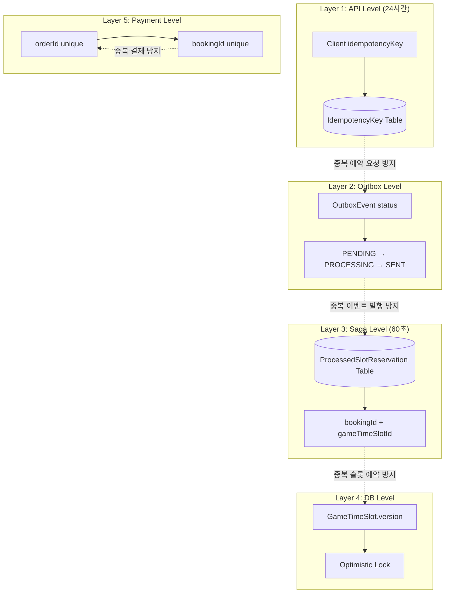

### 5.2 각 계층별 역할

| 계층 | 위치 | 저장소 | TTL | 목적 |
|------|------|--------|-----|------|
| **API Level** | booking-service | PostgreSQL (idempotency_keys) | 24시간 | 클라이언트 중복 요청 방지 |
| **Outbox Level** | booking-service | PostgreSQL (outbox_events) | - | 이벤트 중복 발행 방지 |
| **Saga Level** | course-service | PostgreSQL (processed_slot_reservations) | 60초 | 슬롯 중복 예약 방지 |
| **DB Level** | course-service | PostgreSQL (game_time_slots.version) | - | 동시성 제어 (Optimistic Lock) |
| **Payment Level** | payment-service | PostgreSQL (payments.orderId, payments.bookingId) | - | 중복 결제 방지 |

### 5.3 Saga 레벨 멱등성 (course-service)

```typescript
// game-time-slot.service.ts
const IDEMPOTENCY_TTL_MS = 60000; // 60초 TTL

// 1. 중복 요청 확인
const existingReservation = await this.prisma.processedSlotReservation.findUnique({
  where: {
    bookingId_gameTimeSlotId: { bookingId, gameTimeSlotId: timeSlotId },
  },
});

if (existingReservation) {
  return { success: true }; // 즉시 성공 반환 (슬롯 수정 안 함)
}

// 2. 슬롯 예약 처리 후 레코드 저장
await this.prisma.processedSlotReservation.create({
  data: {
    bookingId,
    gameTimeSlotId: timeSlotId,
    expiresAt: new Date(Date.now() + IDEMPOTENCY_TTL_MS),
  },
});

// 3. 5분마다 만료된 레코드 정리 (Cleanup Job)
```

---

## 6. 동시성 제어

### 6.1 Optimistic Locking

GameTimeSlot 테이블의 `version` 필드를 사용하여 동시성 제어:

```sql
-- 슬롯 예약 시
UPDATE game_time_slots
SET booked_players = booked_players + :playerCount,
    version = version + 1,
    status = CASE WHEN booked_players + :playerCount >= max_players
             THEN 'FULLY_BOOKED' ELSE 'AVAILABLE' END
WHERE id = :slotId AND version = :currentVersion;

-- affected rows = 0 이면 버전 충돌 → 재시도
```

### 6.2 재시도 로직

```typescript
// course-service: 최대 3회 재시도, 지수 백오프
const MAX_RETRIES = 3;
const BASE_DELAY_MS = 50;

for (let attempt = 1; attempt <= MAX_RETRIES; attempt++) {
  try {
    return await this.reserveSlotWithLock(timeSlotId, playerCount);
  } catch (error) {
    if (error instanceof ConflictException && attempt < MAX_RETRIES) {
      await sleep(BASE_DELAY_MS * attempt); // 50ms, 100ms, 150ms
      continue;
    }
    throw error;
  }
}
```

### 6.3 Outbox 동시 처리 방지

```sql
-- FOR UPDATE SKIP LOCKED: 이미 처리 중인 이벤트 건너뛰기
SELECT * FROM outbox_events
WHERE status = 'PENDING'
ORDER BY created_at ASC
LIMIT 10
FOR UPDATE SKIP LOCKED;
```

---

## 7. 타임아웃 및 재시도 설정

### 7.1 현재 설정값

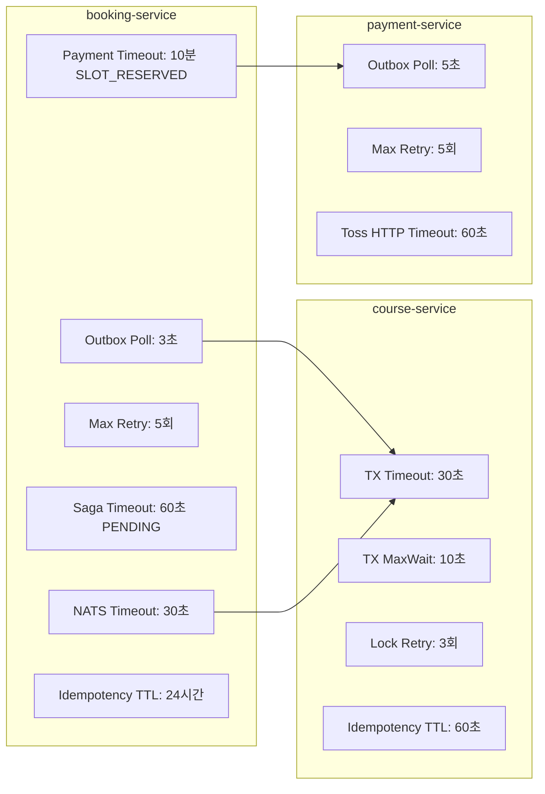

### 7.2 설정 상세

| 설정 | 값 | 서비스 | 용도 |
|------|-----|--------|------|
| `POLL_INTERVAL_MS` | 3,000ms | booking | Outbox 폴링 주기 |
| `BATCH_SIZE` | 10 | booking | 한 번에 처리할 이벤트 수 |
| `MAX_RETRY_COUNT` | 5 | booking | Outbox 최대 재시도 |
| `NATS_TIMEOUT` | 30,000ms | booking | NATS 요청 타임아웃 |
| `SAGA_TIMEOUT_MS` | 60,000ms | booking | PENDING 상태 타임아웃 |
| `PAYMENT_TIMEOUT_MS` | 600,000ms (10분) | booking | SLOT_RESERVED 결제 대기 타임아웃 |
| `IDEMPOTENCY_KEY_TTL` | 24시간 | booking | 멱등성 키 보관 기간 |
| `TX_TIMEOUT` | 30,000ms | course | Prisma 트랜잭션 타임아웃 |
| `TX_MAX_WAIT` | 10,000ms | course | 트랜잭션 대기 최대 시간 |
| `LOCK_RETRY_COUNT` | 3 | course | Optimistic Lock 재시도 |
| `SLOT_IDEMPOTENCY_TTL` | 60,000ms | course | 슬롯 예약 멱등성 TTL |
| `PAYMENT_OUTBOX_POLL` | 5,000ms | payment | 결제 Outbox 폴링 주기 |
| `TOSS_HTTP_TIMEOUT` | 60,000ms | payment | 토스페이먼츠 API HTTP 타임아웃 (공식 권장) |

### 7.3 정리 작업 스케줄

| 작업 | 주기 | 대상 | 서비스 |
|------|------|------|--------|
| PENDING 예약 타임아웃 | 1분마다 | 60초 이상 PENDING 예약 → FAILED | booking |
| SLOT_RESERVED 결제 타임아웃 | 1분마다 | 10분 이상 SLOT_RESERVED 예약 → FAILED + 슬롯 해제 | booking |
| 오래된 Outbox 이벤트 삭제 | 매일 자정 | 7일 이상 된 SENT 이벤트 | booking |
| 만료된 슬롯 예약 레코드 삭제 | 5분마다 | TTL 만료된 레코드 | course |

---

## 8. 취소 및 환불 프로세스

### 8.1 취소 유형

| 취소 유형 | 요청자 | 시점 제한 | 환불 | 슬롯 해제 |
|----------|--------|----------|------|----------|
| **고객 취소** | 고객 | 정책에 따름 | 정책에 따름 | O |
| **관리자 취소** | 관리자 | 제한 없음 | 전액 | O |
| **시스템 취소** | 시스템 | 자동 | 전액 | O |
| **결제 타임아웃** | 시스템 | SLOT_RESERVED 10분 초과 | - (미결제) | O |
| **Saga 실패** | 시스템 | PENDING 상태 | - | X (미예약) |

### 8.2 취소 프로세스 (현장결제)

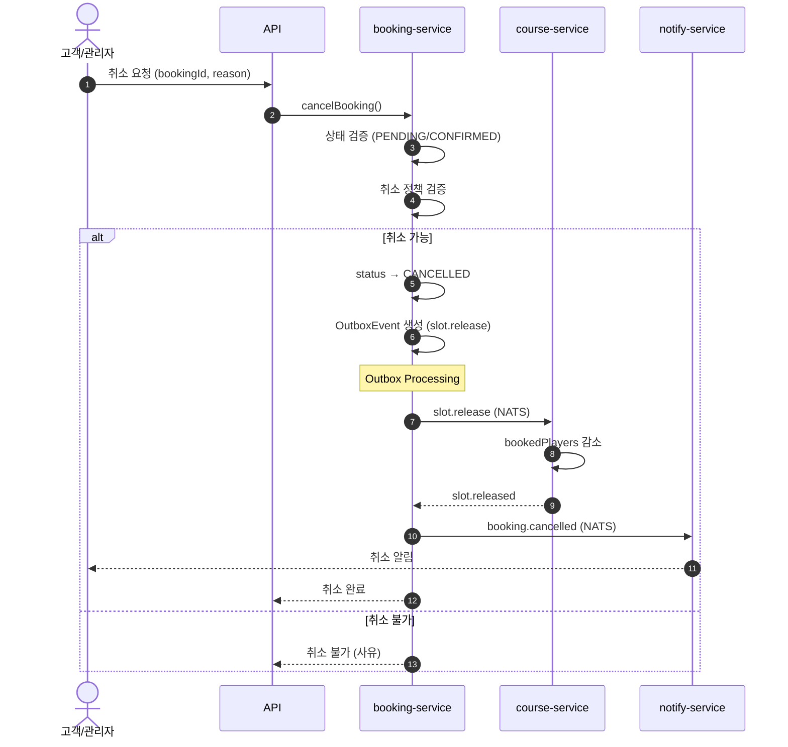

### 8.3 취소 프로세스 (카드결제 — 환불 포함)

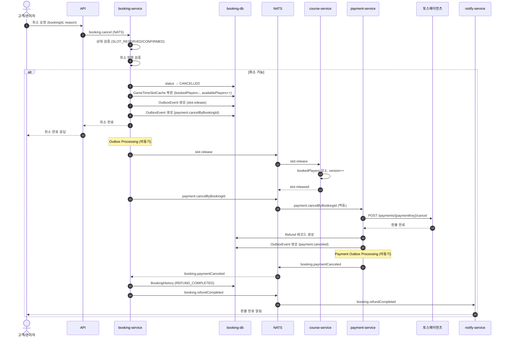

> **참고**: `payment.cancelByBookingId`는 멱등성이 보장됩니다. 결제 내역이 없거나, 이미 취소된 경우, 또는 paymentKey가 없는 경우 `{ skipped: true }` 를 반환합니다.

### 8.4 결제 타임아웃 Compensation (SLOT_RESERVED → FAILED)

```typescript
// saga-scheduler.service.ts
const PAYMENT_TIMEOUT_MS = 10 * 60 * 1000; // 10분

// 결제 대기 타임아웃 처리
const timedOutBookings = await this.prisma.booking.findMany({
  where: {
    status: BookingStatus.SLOT_RESERVED,
    updatedAt: { lt: new Date(Date.now() - PAYMENT_TIMEOUT_MS) },
  },
});

for (const booking of timedOutBookings) {
  // 1. SLOT_RESERVED → FAILED
  await this.prisma.booking.update({
    where: { id: booking.id },
    data: {
      status: BookingStatus.FAILED,
      sagaFailReason: 'Payment timeout',
    },
  });

  // 2. OutboxEvent 생성 → 슬롯 해제
  await this.prisma.outboxEvent.create({
    data: {
      eventType: 'slot.release',
      payload: {
        bookingId: booking.id,
        gameTimeSlotId: booking.gameTimeSlotId,
        playerCount: booking.playerCount,
      },
      status: OutboxStatus.PENDING,
    },
  });
}
```

> **참고**: 결제 타임아웃 시점에서는 미결제 상태이므로 `payment.cancelByBookingId` Outbox 이벤트는 생성하지 않습니다.
> 단, 타임아웃 이후 결제가 도착하는 엣지 케이스는 아래 8.4.1에서 처리합니다.

#### 8.4.1 결제 타임아웃 이후 결제 도착 시 자동 환불

사용자가 Toss 결제 위젯에서 10분 이상 결제를 지연한 경우:
1. 스케줄러가 SLOT_RESERVED → FAILED 처리 + 슬롯 해제
2. 이후 사용자가 결제를 완료하면 payment-service가 `booking.paymentConfirmed` 이벤트 발행
3. `handlePaymentConfirmed()`에서 booking이 FAILED 상태임을 감지 → **자동 환불** 트리거

```typescript
// saga-handler.service.ts — handlePaymentConfirmed 내부
if (booking.status === BookingStatus.FAILED) {
  // 1. BookingHistory에 AUTO_REFUND_REQUESTED 기록
  await prisma.bookingHistory.create({
    data: {
      bookingId: data.bookingId,
      action: 'AUTO_REFUND_REQUESTED',
      details: {
        reason: 'Payment arrived after booking timeout',
        paymentId: data.paymentId,
        amount: data.amount,
      },
    },
  });

  // 2. payment.cancelByBookingId Outbox 이벤트 → payment-service가 Toss 환불 API 호출
  await prisma.outboxEvent.create({
    data: {
      eventType: 'payment.cancelByBookingId',
      payload: { bookingId: data.bookingId, cancelReason: 'Auto-refund: payment arrived after booking timeout' },
      status: OutboxStatus.PENDING,
    },
  });
}
```

> **흐름**: `handlePaymentConfirmed` → Outbox `payment.cancelByBookingId` → payment-service 환불 → `booking.paymentCanceled` 이벤트 → `handlePaymentCanceled`에서 `REFUND_COMPLETED` 기록 + 알림

### 8.5 슬롯 해제 (Compensation)

```typescript
// course-service: releaseSlotForSaga
async releaseSlotForSaga(timeSlotId: number, playerCount: number) {
  return await this.prisma.$transaction(async (tx) => {
    const slot = await tx.gameTimeSlot.findUnique({
      where: { id: timeSlotId },
    });

    const newBookedPlayers = Math.max(0, slot.bookedPlayers - playerCount);
    const newStatus = newBookedPlayers < slot.maxPlayers
      ? TimeSlotStatus.AVAILABLE
      : TimeSlotStatus.FULLY_BOOKED;

    await tx.gameTimeSlot.update({
      where: { id: timeSlotId },
      data: {
        bookedPlayers: newBookedPlayers,
        status: newStatus,
        version: { increment: 1 },
      },
    });
  }, {
    timeout: 30000,
    maxWait: 10000,
  });
}
```

### 8.6 환불 정책 (동적 계층 정책)

환불 정책은 **3-tier 계층 구조**로 관리됩니다. 골프장(Club)별로 다른 환불 규칙을 설정할 수 있으며,
설정이 없으면 상위 스코프(Company → Platform)의 정책으로 자동 폴백합니다.

#### 정책 스코프

```
PLATFORM (플랫폼 기본값)
  └── COMPANY (가맹점별 설정)
        └── CLUB (골프장별 설정)
```

| 스코프 | 설정 주체 | 폴백 |
|--------|----------|------|
| `PLATFORM` | 시스템 관리자 | - (최종 기본값) |
| `COMPANY` | 가맹점 관리자 | → PLATFORM |
| `CLUB` | 골프장 관리자 | → COMPANY → PLATFORM |

#### RefundPolicy 모델

```typescript
interface RefundPolicy {
  scopeLevel: 'PLATFORM' | 'COMPANY' | 'CLUB';
  companyId?: number;
  clubId?: number;
  name: string;                   // "기본 환불 정책"

  adminCancelRefundRate: number;  // 관리자 취소 환불율 (기본: 100%)
  systemCancelRefundRate: number; // 시스템 취소 환불율 (기본: 100%)

  minRefundAmount: number;        // 최소 환불 금액 (기본: 0원)
  refundFee: number;              // 환불 수수료 (정액, KRW)
  refundFeeRate: number;          // 환불 수수료 (정률, %)

  tiers: RefundTier[];            // 시간 기반 환불율 계단
}

interface RefundTier {
  minHoursBefore: number;         // 예약 시작 N시간 전 (하한)
  maxHoursBefore?: number;        // 예약 시작 N시간 전 (상한, null=무한)
  refundRate: number;             // 환불율 (%)
  label?: string;                 // "7일 전", "당일" 등
}
```

#### 기본 환불율 (PLATFORM 기본값 예시)

| 취소 시점 | 환불율 | label |
|----------|--------|-------|
| 예약일 7일 전 (168시간+) | 100% | 7일 전 |
| 예약일 3~7일 전 (72~168시간) | 80% | 3~7일 전 |
| 예약일 1~3일 전 (24~72시간) | 50% | 1~3일 전 |
| 예약일 24시간 이내 | 0% (환불 불가) | 당일 |

| 취소 유형 | 환불율 |
|----------|--------|
| 관리자 취소 (`adminCancelRefundRate`) | 100% |
| 시스템 취소 (`systemCancelRefundRate`) | 100% |
| 결제 타임아웃 | 타임아웃 시점에서는 미결제이므로 환불 불필요. 단, 타임아웃 후 결제 도착 시 자동 환불 (8.4.1) |
| 노쇼 | 0% (별도 NoShowPolicy로 관리) |

#### Resolve 패턴 (policy.refund.resolve)

```typescript
// booking-service에서 환불 정책 조회 시
const policy = await this.natsClient.send('policy.refund.resolve', {
  scopeLevel: 'CLUB',
  companyId: booking.companyId,
  clubId: booking.clubId,
});

// 응답: { ...policy, inherited: boolean, inheritedFrom: 'PLATFORM' | 'COMPANY' | null }
// CLUB에 설정이 없으면 COMPANY → PLATFORM 순으로 폴백
```

#### 취소 유형 (CancellationType)

```
USER_NORMAL      // 일반 고객 취소 (기한 내)
USER_LATE        // 지연 고객 취소 (1~3일 전)
USER_LASTMINUTE  // 긴급 취소 (24시간 이내)
ADMIN            // 관리자 취소
SYSTEM           // 시스템 취소 (Saga 실패 등)
```

---

## 9. 모니터링 및 디버깅

### 9.1 로그 태그

| 태그 | 서비스 | 용도 |
|------|--------|------|
| `[REQ-xxx]` | booking-service | 요청 추적 ID |
| `[Outbox]` | booking-service | Outbox 이벤트 처리 |
| `[SagaHandler]` | booking-service | Saga 상태 전이 |
| `[Saga]` | course-service | 슬롯 예약 처리 |
| `[Payment]` | payment-service | 결제 처리 |

### 9.2 로그 예시

```
# 현장결제 정상 흐름
[REQ-123] ========== BOOKING CREATE START ==========
[REQ-123] Step 1: Idempotency key check passed
[REQ-123] Step 2: Slot validation passed
[REQ-123] Step 3: COMPLETED - Booking BK-ABC123 created with PENDING status (onsite)
[Outbox] Processing event 42 (slot.reserve) for bookingId=15
[Saga] SLOT_RESERVE SUCCESS in 18ms - bookingId=15, emitting slot.reserved
[SagaHandler] Booking 15: paymentMethod=onsite → CONFIRMED
CompanyMember registered: companyId=3, userId=42

# 카드결제 정상 흐름
[REQ-456] ========== BOOKING CREATE START ==========
[REQ-456] Step 3: COMPLETED - Booking BK-DEF456 created with PENDING status (card)
[Outbox] Processing event 43 (slot.reserve) for bookingId=16
[Saga] SLOT_RESERVE SUCCESS in 15ms - bookingId=16, emitting slot.reserved
[SagaHandler] Booking 16: paymentMethod=card → SLOT_RESERVED (awaiting payment)
[Payment] Prepare: orderId=ORD-1707123456789-a1b2c3d4, amount=50000
[Payment] Confirm: orderId=ORD-1707123456789-a1b2c3d4, paymentKey=tgen_xxx
[Payment] Outbox: emit booking.paymentConfirmed for bookingId=16
[SagaHandler] Booking 16: SLOT_RESERVED → CONFIRMED (payment confirmed)
CompanyMember registered: companyId=3, userId=42

# 결제 타임아웃
[SagaScheduler] Booking 17: SLOT_RESERVED for 10m+ → FAILED (payment timeout)
[SagaScheduler] Creating slot.release outbox for booking 17
```

### 9.3 GCP Cloud Logging 쿼리

```
# Saga 관련 로그 조회
resource.type="cloud_run_revision"
resource.labels.service_name="course-service-dev"
textPayload:("[Saga]")

# 특정 예약 추적
resource.type="cloud_run_revision"
textPayload:("bookingId=15")

# 결제 관련 로그 조회
resource.type="cloud_run_revision"
resource.labels.service_name="payment-service-dev"
textPayload:("[Payment]")

# Outbox 이벤트 처리 추적
resource.type="cloud_run_revision"
resource.labels.service_name="booking-service-dev"
textPayload:("[Outbox]")
```

### 9.4 성능 메트릭

| 단계 | 예상 소요 시간 |
|------|---------------|
| Idempotency Check | 1-5ms |
| Slot Query | 3-10ms |
| Slot Update (with lock) | 5-15ms |
| Total Saga - 현장결제 (booking → confirmed) | 50-200ms |
| Total Saga - 카드결제 (booking → slot_reserved) | 50-200ms |
| Payment Prepare | 10-50ms |
| Payment Confirm (토스 API) | 200-500ms |
| Total Saga - 카드결제 (slot_reserved → confirmed) | 300-600ms |

---

## 변경 이력

| 버전 | 날짜 | 변경 내용 |
|------|------|----------|
| 3.4 | 2026-02-24 | 결제 타임아웃 이후 결제 도착 시 자동 환불 (handlePaymentConfirmed → AUTO_REFUND_REQUESTED) |
| 3.3 | 2026-02-24 | AI 에이전트 Saga 폴링 노트 추가, Toss HTTP Timeout 60초 설정 반영 |
| 3.2 | 2026-02-23 | 결제 관련 보완: PaymentStatus 누락 상태 추가, serviceFee 계산 반영, Outbox 폴링 주기 수정 (1s→3s), 카드결제 취소 시퀀스 Outbox 기반으로 수정, 환불 정책 3-tier 동적 계층 시스템 반영, agent-service 크로스 레퍼런스 추가 |
| 3.1 | 2026-02-15 | 예약 확정 시 CompanyMember 자동 등록 (iam-service 연동) 추가 |
| 3.0 | 2026-02-10 | 토스페이먼츠 결제 연동, SLOT_RESERVED 상태 활성화, 결제 타임아웃 Compensation 추가 |
| 2.0 | 2026-01-21 | BOOKING_SAGA_ARCHITECTURE.md, booking-workflow-design.md 통합 및 소스 코드 반영 |
| 1.0 | 2026-01-12 | booking-workflow-design.md 초안 작성 |
| 1.0 | 2026-01-06 | BOOKING_SAGA_ARCHITECTURE.md 작성 |

---

## 참고 자료

- [Microservices Patterns - Saga Pattern](https://microservices.io/patterns/data/saga.html)
- [Transactional Outbox Pattern](https://microservices.io/patterns/data/transactional-outbox.html)
- [Optimistic Locking - Prisma](https://www.prisma.io/docs/concepts/components/prisma-client/transactions#optimistic-concurrency-control)
- [토스페이먼츠 결제 위젯 연동](https://docs.tosspayments.com/guides/v2/widget/integration)
