# Chat System

Park Golf Platform 채팅 시스템 아키텍처 및 워크플로우 문서입니다.

## 목차

1. [시스템 개요](#1-시스템-개요)
2. [아키텍처](#2-아키텍처)
3. [WebSocket 실시간 통신](#3-websocket-실시간-통신)
4. [REST API](#4-rest-api)
5. [NATS 메시지 패턴](#5-nats-메시지-패턴)
6. [데이터베이스 스키마](#6-데이터베이스-스키마)
7. [클라이언트 구현](#7-클라이언트-구현)
8. [에러 처리 및 복구](#8-에러-처리-및-복구)
9. [배포 및 운영](#9-배포-및-운영)

---

## 1. 시스템 개요

### 핵심 기능

| 기능 | 설명 |
|------|------|
| **1:1 채팅 (DIRECT)** | 친구 간 개인 대화 |
| **그룹 채팅 (GROUP)** | 여러 사용자 참여 채팅방 |
| **예약 채팅 (BOOKING)** | 예약 기반 자동 생성 채팅방 |
| **실시간 메시지** | WebSocket 기반 즉시 전달 |
| **타이핑 표시** | 상대방 입력 중 표시 |
| **읽음 처리** | 메시지 읽음 상태 동기화 |
| **REST Fallback** | WebSocket 실패 시 HTTP 전송 |

### 채팅방 타입

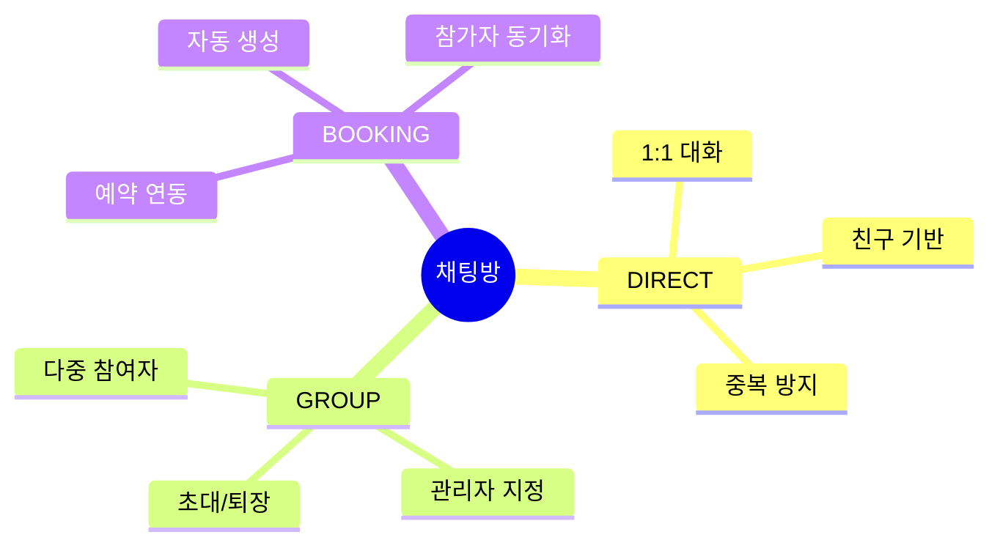
```mermaid
mindmap
  root((채팅방))
    DIRECT
      1:1 대화
      친구 기반
      중복 방지
    GROUP
      다중 참여자
      관리자 지정
      초대/퇴장
    BOOKING
      예약 연동
      자동 생성
      참가자 동기화
```

### 메시지 타입

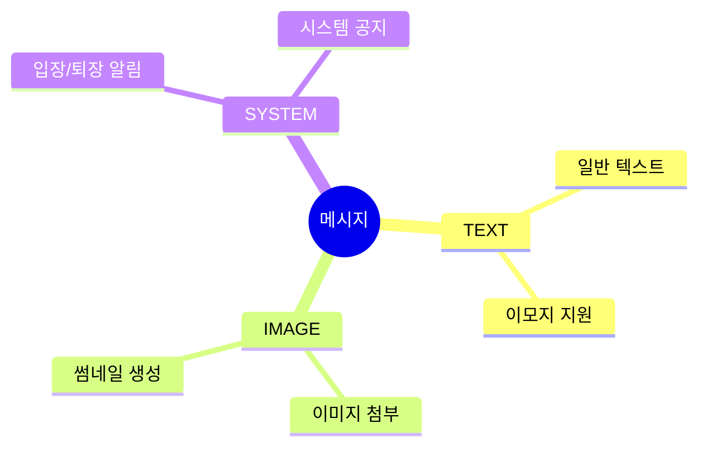
```mermaid
mindmap
  root((메시지))
    TEXT
      일반 텍스트
      이모지 지원
    IMAGE
      이미지 첨부
      썸네일 생성
    SYSTEM
      입장/퇴장 알림
      시스템 공지
```

---

## 2. 아키텍처

### 전체 시스템 구조

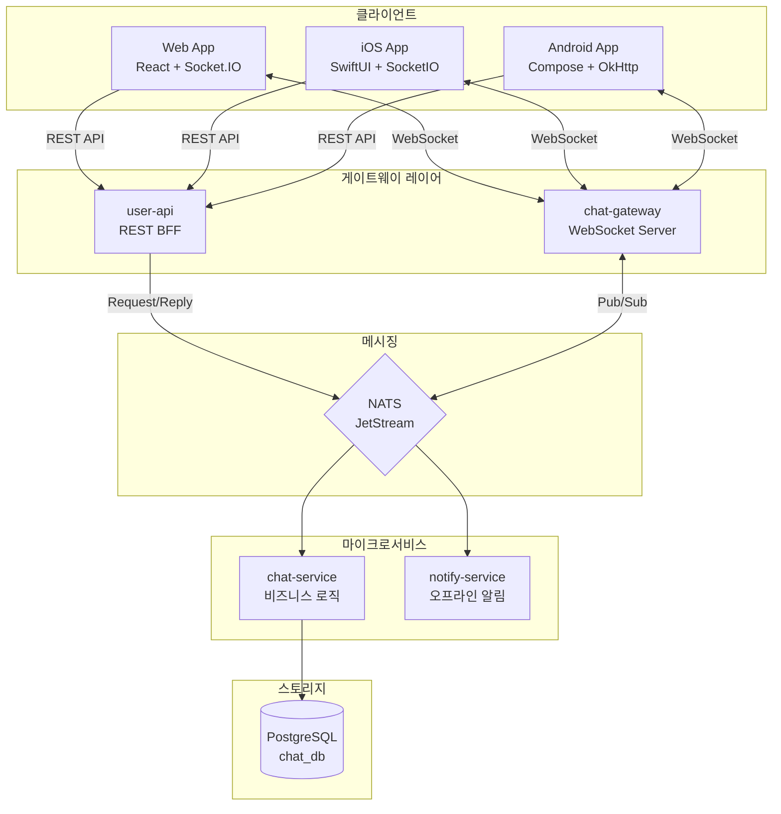
```mermaid
flowchart TB
    subgraph Clients["클라이언트"]
        WEB[Web App<br/>React + Socket.IO]
        IOS[iOS App<br/>SwiftUI + SocketIO]
        AND[Android App<br/>Compose + OkHttp]
    end

    subgraph Gateway["게이트웨이 레이어"]
        BFF[user-api<br/>REST BFF]
        WSG[chat-gateway<br/>WebSocket Server]
    end

    subgraph Messaging["메시징"]
        NATS{NATS<br/>JetStream}
    end

    subgraph Services["마이크로서비스"]
        CHAT[chat-service<br/>비즈니스 로직]
        NOTIFY[notify-service<br/>오프라인 알림]
    end

    subgraph Storage["스토리지"]
        DB[(PostgreSQL<br/>chat_db)]
    end

    WEB & IOS & AND -->|REST API| BFF
    WEB & IOS & AND <-->|WebSocket| WSG

    BFF -->|Request/Reply| NATS
    WSG <-->|Pub/Sub| NATS

    NATS --> CHAT
    NATS --> NOTIFY
    CHAT --> DB
```

### chat-gateway 내부 구조

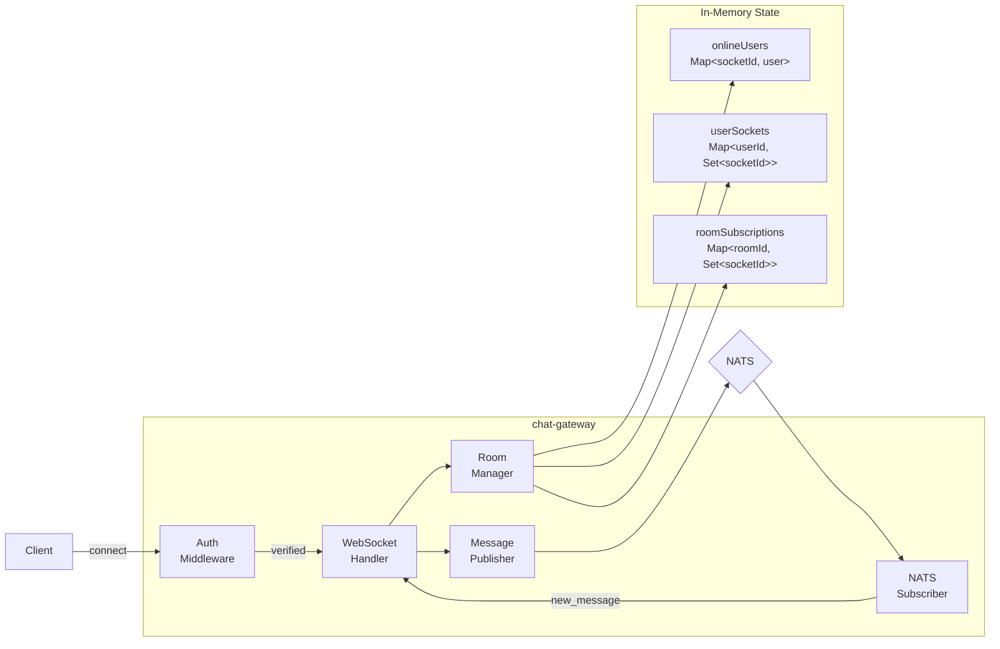
```mermaid
flowchart LR
    subgraph Gateway["chat-gateway"]
        WS[WebSocket<br/>Handler]
        AUTH[Auth<br/>Middleware]
        ROOM[Room<br/>Manager]
        MSG[Message<br/>Publisher]
        SUB[NATS<br/>Subscriber]
    end

    subgraph State["In-Memory State"]
        ONLINE[onlineUsers<br/>Map&lt;socketId, user&gt;]
        SOCKETS[userSockets<br/>Map&lt;userId, Set&lt;socketId&gt;&gt;]
        ROOMS[roomSubscriptions<br/>Map&lt;roomId, Set&lt;socketId&gt;&gt;]
    end

    Client -->|connect| AUTH
    AUTH -->|verified| WS
    WS --> ROOM
    WS --> MSG
    SUB -->|new_message| WS

    ROOM --> ONLINE & SOCKETS & ROOMS
    MSG --> NATS{NATS}
    NATS --> SUB
```

### 통신 방식 비교

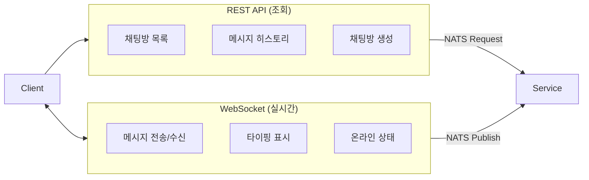
```mermaid
flowchart LR
    subgraph REST["REST API (조회)"]
        R1[채팅방 목록]
        R2[메시지 히스토리]
        R3[채팅방 생성]
    end

    subgraph WebSocket["WebSocket (실시간)"]
        W1[메시지 전송/수신]
        W2[타이핑 표시]
        W3[온라인 상태]
    end

    Client --> REST
    Client <--> WebSocket

    REST -->|NATS Request| Service
    WebSocket -->|NATS Publish| Service
```

---

## 3. WebSocket 실시간 통신

### 3.1 연결 및 인증

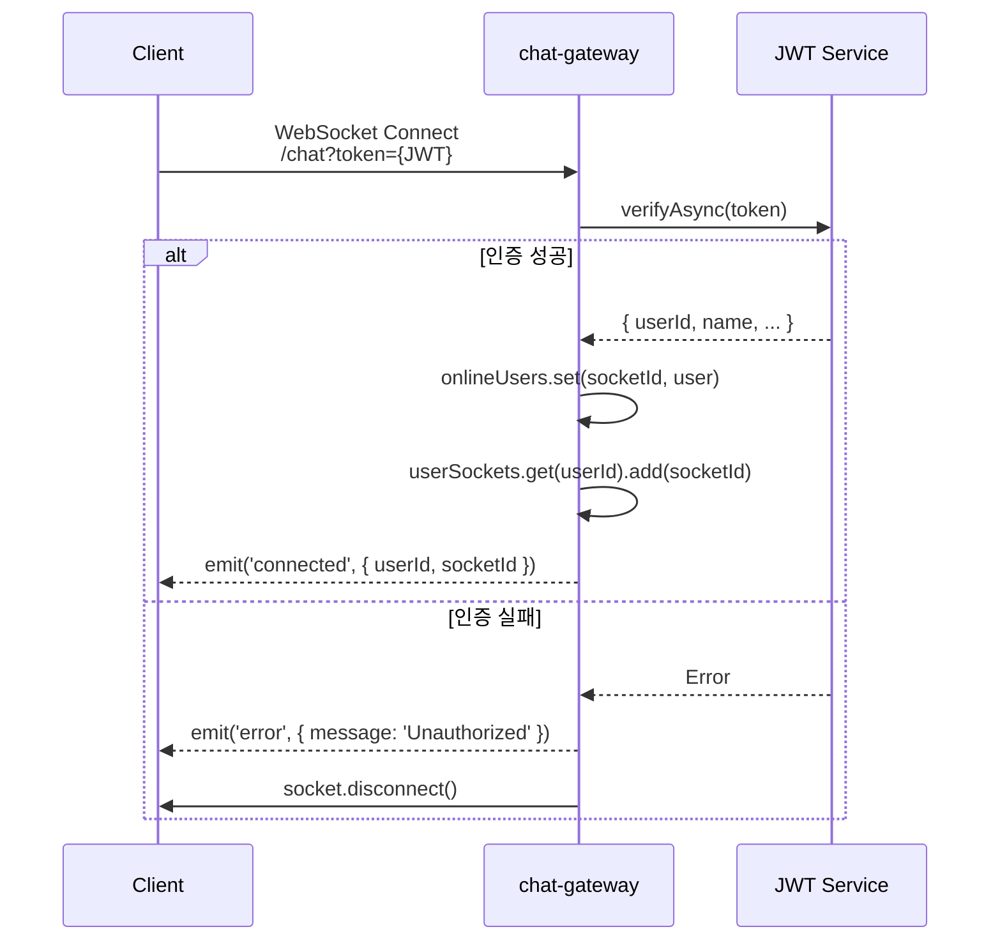
```mermaid
sequenceDiagram
    participant Client
    participant Gateway as chat-gateway
    participant JWT as JWT Service

    Client->>Gateway: WebSocket Connect<br/>/chat?token={JWT}

    Gateway->>JWT: verifyAsync(token)

    alt 인증 성공
        JWT-->>Gateway: { userId, name, ... }
        Gateway->>Gateway: onlineUsers.set(socketId, user)
        Gateway->>Gateway: userSockets.get(userId).add(socketId)
        Gateway-->>Client: emit('connected', { userId, socketId })
    else 인증 실패
        JWT-->>Gateway: Error
        Gateway-->>Client: emit('error', { message: 'Unauthorized' })
        Gateway->>Client: socket.disconnect()
    end
```

### 3.2 채팅방 입장/퇴장

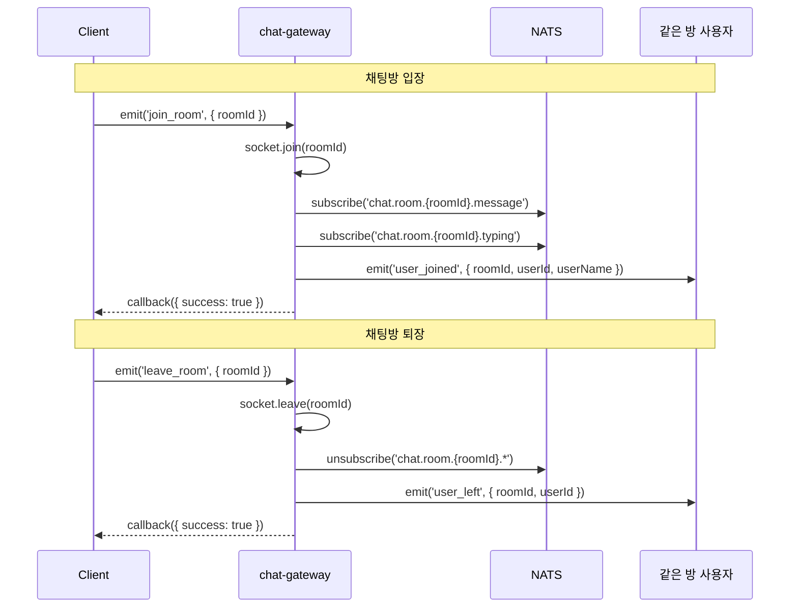
```mermaid
sequenceDiagram
    participant Client
    participant Gateway as chat-gateway
    participant NATS
    participant Others as 같은 방 사용자

    Note over Client,Others: 채팅방 입장
    Client->>Gateway: emit('join_room', { roomId })
    Gateway->>Gateway: socket.join(roomId)
    Gateway->>NATS: subscribe('chat.room.{roomId}.message')
    Gateway->>NATS: subscribe('chat.room.{roomId}.typing')
    Gateway->>Others: emit('user_joined', { roomId, userId, userName })
    Gateway-->>Client: callback({ success: true })

    Note over Client,Others: 채팅방 퇴장
    Client->>Gateway: emit('leave_room', { roomId })
    Gateway->>Gateway: socket.leave(roomId)
    Gateway->>NATS: unsubscribe('chat.room.{roomId}.*')
    Gateway->>Others: emit('user_left', { roomId, userId })
    Gateway-->>Client: callback({ success: true })
```

### 3.3 메시지 전송 흐름

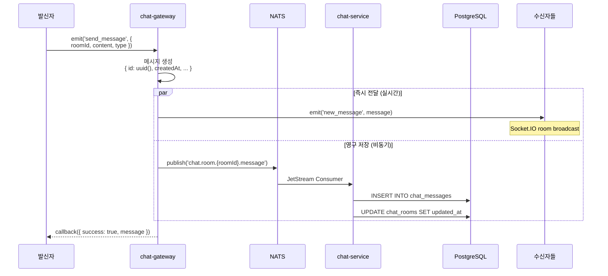
```mermaid
sequenceDiagram
    participant Sender as 발신자
    participant Gateway as chat-gateway
    participant NATS
    participant Service as chat-service
    participant DB as PostgreSQL
    participant Receivers as 수신자들

    Sender->>Gateway: emit('send_message', {<br/>roomId, content, type })

    Gateway->>Gateway: 메시지 생성<br/>{ id: uuid(), createdAt, ... }

    par 즉시 전달 (실시간)
        Gateway->>Receivers: emit('new_message', message)
        Note over Receivers: Socket.IO room broadcast
    and 영구 저장 (비동기)
        Gateway->>NATS: publish('chat.room.{roomId}.message')
        NATS->>Service: JetStream Consumer
        Service->>DB: INSERT INTO chat_messages
        Service->>DB: UPDATE chat_rooms SET updated_at
    end

    Gateway-->>Sender: callback({ success: true, message })
```

### 3.4 타이핑 표시

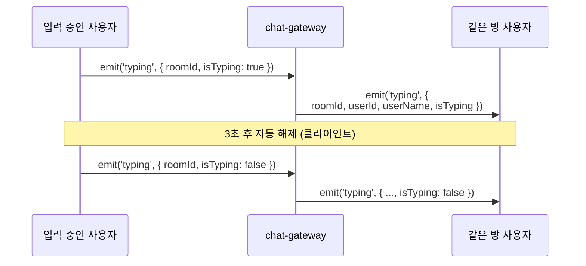
```mermaid
sequenceDiagram
    participant Typer as 입력 중인 사용자
    participant Gateway as chat-gateway
    participant Others as 같은 방 사용자

    Typer->>Gateway: emit('typing', { roomId, isTyping: true })

    Gateway->>Others: emit('typing', {<br/>roomId, userId, userName, isTyping })

    Note over Typer,Others: 3초 후 자동 해제 (클라이언트)

    Typer->>Gateway: emit('typing', { roomId, isTyping: false })
    Gateway->>Others: emit('typing', { ..., isTyping: false })
```

### 3.5 연결 해제 처리

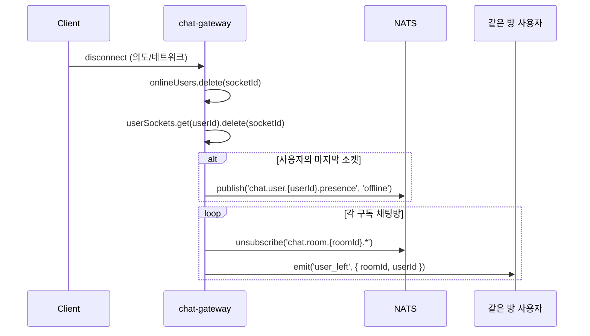
```mermaid
sequenceDiagram
    participant Client
    participant Gateway as chat-gateway
    participant NATS
    participant Others as 같은 방 사용자

    Client->>Gateway: disconnect (의도/네트워크)

    Gateway->>Gateway: onlineUsers.delete(socketId)
    Gateway->>Gateway: userSockets.get(userId).delete(socketId)

    alt 사용자의 마지막 소켓
        Gateway->>NATS: publish('chat.user.{userId}.presence', 'offline')
    end

    loop 각 구독 채팅방
        Gateway->>NATS: unsubscribe('chat.room.{roomId}.*')
        Gateway->>Others: emit('user_left', { roomId, userId })
    end
```

### WebSocket 이벤트 요약

| 이벤트 | 방향 | Payload | 설명 |
|--------|------|---------|------|
| `connected` | S→C | `{ userId, socketId }` | 연결 성공 |
| `join_room` | C→S | `{ roomId }` | 채팅방 입장 |
| `leave_room` | C→S | `{ roomId }` | 채팅방 퇴장 |
| `send_message` | C→S | `{ roomId, content, type }` | 메시지 전송 |
| `new_message` | S→C | `{ id, roomId, senderId, content, ... }` | 새 메시지 수신 |
| `typing` | C↔S | `{ roomId, userId, isTyping }` | 타이핑 상태 |
| `user_joined` | S→C | `{ roomId, userId, userName }` | 사용자 입장 |
| `user_left` | S→C | `{ roomId, userId }` | 사용자 퇴장 |
| `error` | S→C | `{ message, code }` | 에러 발생 |

---

## 4. REST API

### 4.1 채팅방 API

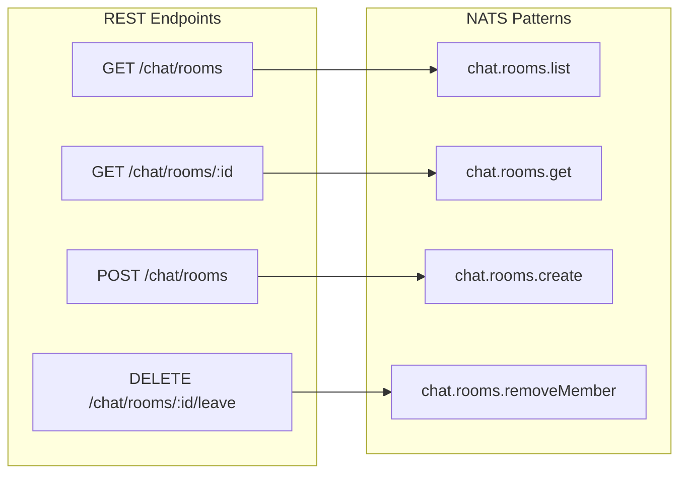
```mermaid
flowchart LR
    subgraph Endpoints["REST Endpoints"]
        E1[GET /chat/rooms]
        E2[GET /chat/rooms/:id]
        E3[POST /chat/rooms]
        E4[DELETE /chat/rooms/:id/leave]
    end

    subgraph NATS["NATS Patterns"]
        N1[chat.rooms.list]
        N2[chat.rooms.get]
        N3[chat.rooms.create]
        N4[chat.rooms.removeMember]
    end

    E1 --> N1
    E2 --> N2
    E3 --> N3
    E4 --> N4
```

#### 채팅방 목록 조회

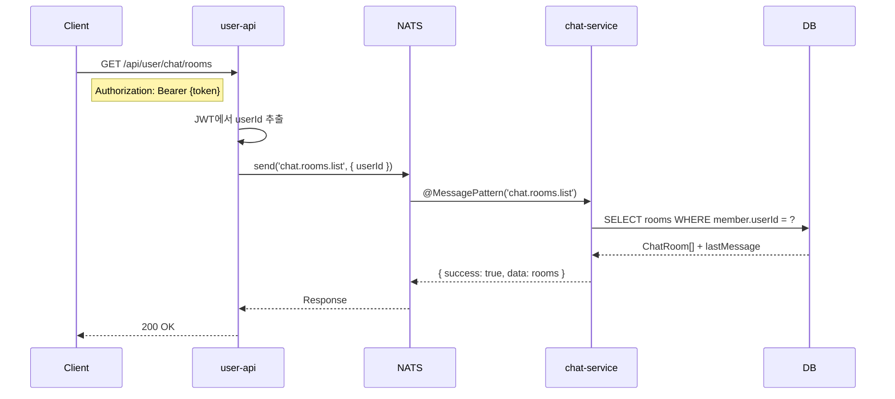
```mermaid
sequenceDiagram
    participant Client
    participant BFF as user-api
    participant NATS
    participant Service as chat-service
    participant DB

    Client->>BFF: GET /api/user/chat/rooms
    Note right of Client: Authorization: Bearer {token}

    BFF->>BFF: JWT에서 userId 추출
    BFF->>NATS: send('chat.rooms.list', { userId })

    NATS->>Service: @MessagePattern('chat.rooms.list')
    Service->>DB: SELECT rooms WHERE member.userId = ?

    DB-->>Service: ChatRoom[] + lastMessage
    Service-->>NATS: { success: true, data: rooms }
    NATS-->>BFF: Response
    BFF-->>Client: 200 OK
```

**응답 예시:**
```json
{
  "success": true,
  "data": [
    {
      "id": "room-uuid",
      "name": null,
      "type": "DIRECT",
      "members": [
        { "userId": 4, "userName": "김철수" }
      ],
      "lastMessage": {
        "content": "안녕하세요!",
        "createdAt": "2024-01-15T10:30:00Z"
      },
      "unreadCount": 3,
      "updatedAt": "2024-01-15T10:30:00Z"
    }
  ]
}
```

#### 채팅방 생성

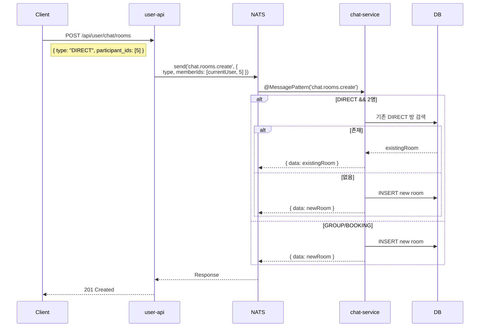
```mermaid
sequenceDiagram
    participant Client
    participant BFF as user-api
    participant NATS
    participant Service as chat-service
    participant DB

    Client->>BFF: POST /api/user/chat/rooms
    Note right of Client: { type: "DIRECT", participant_ids: [5] }

    BFF->>NATS: send('chat.rooms.create', {<br/>type, memberIds: [currentUser, 5] })

    NATS->>Service: @MessagePattern('chat.rooms.create')

    alt DIRECT && 2명
        Service->>DB: 기존 DIRECT 방 검색
        alt 존재
            DB-->>Service: existingRoom
            Service-->>NATS: { data: existingRoom }
        else 없음
            Service->>DB: INSERT new room
            Service-->>NATS: { data: newRoom }
        end
    else GROUP/BOOKING
        Service->>DB: INSERT new room
        Service-->>NATS: { data: newRoom }
    end

    NATS-->>BFF: Response
    BFF-->>Client: 201 Created
```

### 4.2 메시지 API

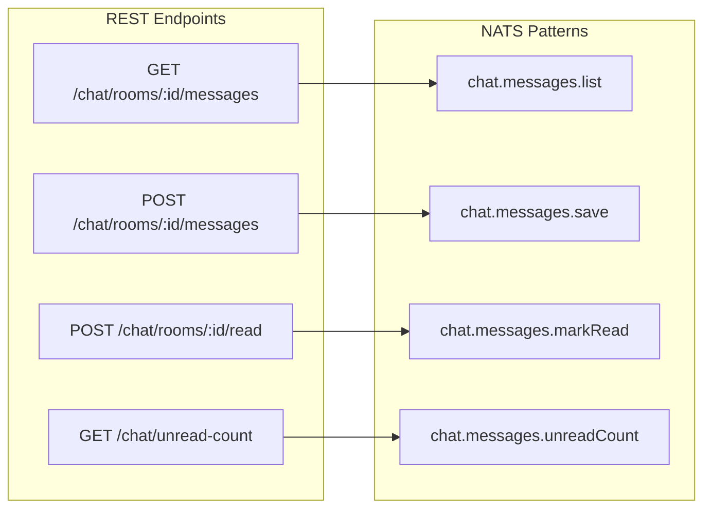
```mermaid
flowchart LR
    subgraph Endpoints["REST Endpoints"]
        E1[GET /chat/rooms/:id/messages]
        E2[POST /chat/rooms/:id/messages]
        E3[POST /chat/rooms/:id/read]
        E4[GET /chat/unread-count]
    end

    subgraph NATS["NATS Patterns"]
        N1[chat.messages.list]
        N2[chat.messages.save]
        N3[chat.messages.markRead]
        N4[chat.messages.unreadCount]
    end

    E1 --> N1
    E2 --> N2
    E3 --> N3
    E4 --> N4
```

#### 메시지 조회 (커서 페이지네이션)

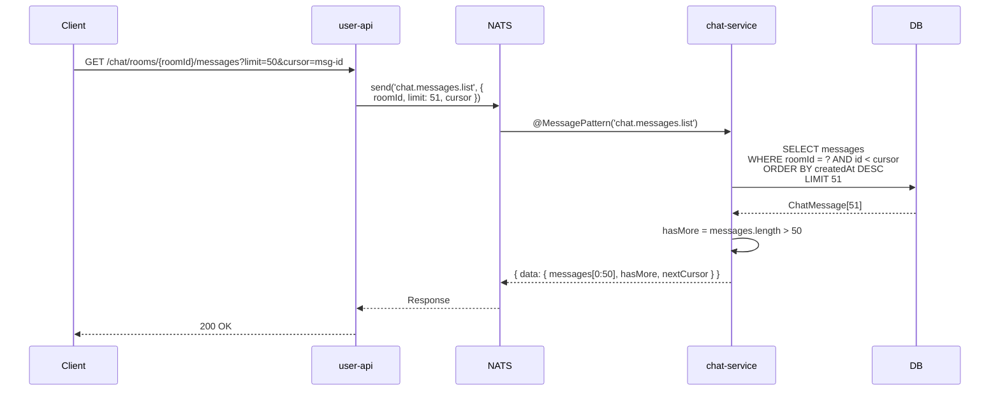
```mermaid
sequenceDiagram
    participant Client
    participant BFF as user-api
    participant NATS
    participant Service as chat-service
    participant DB

    Client->>BFF: GET /chat/rooms/{roomId}/messages?limit=50&cursor=msg-id

    BFF->>NATS: send('chat.messages.list', {<br/>roomId, limit: 51, cursor })

    NATS->>Service: @MessagePattern('chat.messages.list')
    Service->>DB: SELECT messages<br/>WHERE roomId = ? AND id < cursor<br/>ORDER BY createdAt DESC<br/>LIMIT 51

    DB-->>Service: ChatMessage[51]
    Service->>Service: hasMore = messages.length > 50
    Service-->>NATS: { data: { messages[0:50], hasMore, nextCursor } }

    NATS-->>BFF: Response
    BFF-->>Client: 200 OK
```

#### 메시지 전송 (REST Fallback)

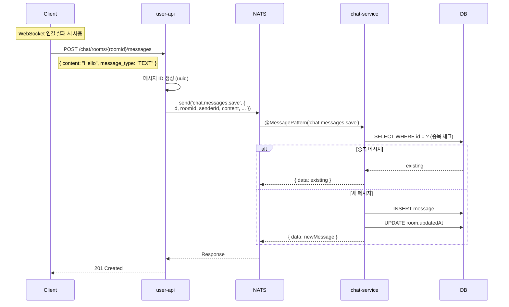
```mermaid
sequenceDiagram
    participant Client
    participant BFF as user-api
    participant NATS
    participant Service as chat-service
    participant DB

    Note over Client: WebSocket 연결 실패 시 사용

    Client->>BFF: POST /chat/rooms/{roomId}/messages
    Note right of Client: { content: "Hello", message_type: "TEXT" }

    BFF->>BFF: 메시지 ID 생성 (uuid)
    BFF->>NATS: send('chat.messages.save', {<br/>id, roomId, senderId, content, ... })

    NATS->>Service: @MessagePattern('chat.messages.save')
    Service->>DB: SELECT WHERE id = ? (중복 체크)

    alt 중복 메시지
        DB-->>Service: existing
        Service-->>NATS: { data: existing }
    else 새 메시지
        Service->>DB: INSERT message
        Service->>DB: UPDATE room.updatedAt
        Service-->>NATS: { data: newMessage }
    end

    NATS-->>BFF: Response
    BFF-->>Client: 201 Created
```

---

## 5. NATS 메시지 패턴

### Request/Reply 패턴

| 패턴 | 용도 | Payload |
|------|------|---------|
| `chat.rooms.list` | 채팅방 목록 | `{ userId }` |
| `chat.rooms.get` | 채팅방 상세 | `{ roomId, userId }` |
| `chat.rooms.create` | 채팅방 생성 | `{ type, name?, memberIds, memberNames }` |
| `chat.rooms.removeMember` | 채팅방 나가기 | `{ roomId, userId }` |
| `chat.messages.list` | 메시지 목록 | `{ roomId, limit, cursor? }` |
| `chat.messages.save` | 메시지 저장 | `{ id, roomId, senderId, content, type }` |
| `chat.messages.markRead` | 읽음 처리 | `{ roomId, userId, messageId }` |
| `chat.messages.unreadCount` | 안읽은 수 | `{ userId }` |

### Pub/Sub 패턴 (JetStream)

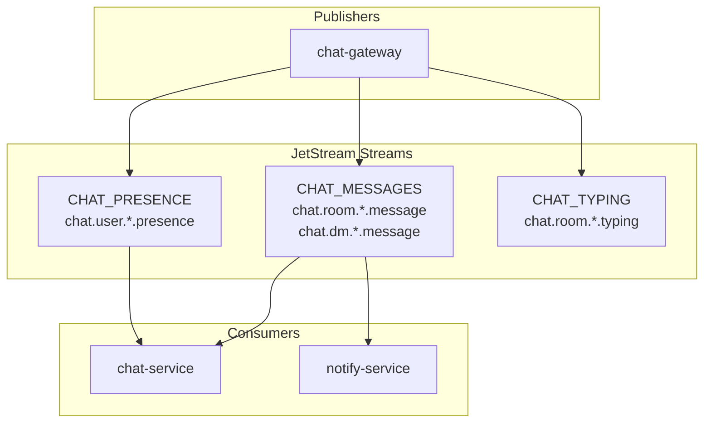
```mermaid
flowchart TB
    subgraph Publishers["Publishers"]
        GW[chat-gateway]
    end

    subgraph Streams["JetStream Streams"]
        S1[CHAT_MESSAGES<br/>chat.room.*.message<br/>chat.dm.*.message]
        S2[CHAT_PRESENCE<br/>chat.user.*.presence]
        S3[CHAT_TYPING<br/>chat.room.*.typing]
    end

    subgraph Consumers["Consumers"]
        CS[chat-service]
        NS[notify-service]
    end

    GW --> S1 & S2 & S3
    S1 --> CS
    S1 --> NS
    S2 --> CS
```

### JetStream 스트림 설정

| 스트림 | Subject 패턴 | 보존 기간 | 저장소 |
|--------|-------------|----------|--------|
| `CHAT_MESSAGES` | `chat.room.*.message`, `chat.dm.*.message` | 30일 | File |
| `CHAT_PRESENCE` | `chat.user.*.presence` | 5분 | Memory |
| `CHAT_TYPING` | `chat.room.*.typing` | 10초 | Memory |

---

## 6. 데이터베이스 스키마

### ERD

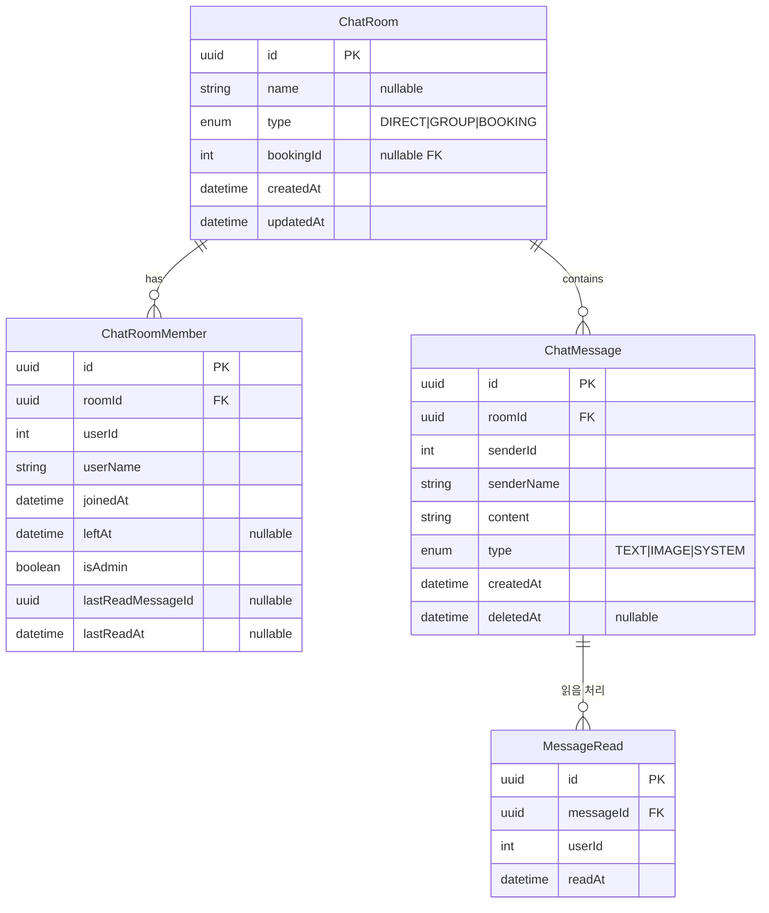
```mermaid
erDiagram
    ChatRoom ||--o{ ChatRoomMember : has
    ChatRoom ||--o{ ChatMessage : contains
    ChatMessage ||--o{ MessageRead : "읽음 처리"

    ChatRoom {
        uuid id PK
        string name "nullable"
        enum type "DIRECT|GROUP|BOOKING"
        int bookingId "nullable FK"
        datetime createdAt
        datetime updatedAt
    }

    ChatRoomMember {
        uuid id PK
        uuid roomId FK
        int userId
        string userName
        datetime joinedAt
        datetime leftAt "nullable"
        boolean isAdmin
        uuid lastReadMessageId "nullable"
        datetime lastReadAt "nullable"
    }

    ChatMessage {
        uuid id PK
        uuid roomId FK
        int senderId
        string senderName
        string content
        enum type "TEXT|IMAGE|SYSTEM"
        datetime createdAt
        datetime deletedAt "nullable"
    }

    MessageRead {
        uuid id PK
        uuid messageId FK
        int userId
        datetime readAt
    }
```

### 인덱스 설계

| 테이블 | 인덱스 | 용도 |
|--------|--------|------|
| chat_rooms | `(type, updated_at DESC)` | 타입별 최신순 정렬 |
| chat_room_members | `(user_id, left_at)` | 사용자별 활성 채팅방 |
| chat_room_members | `(room_id, user_id)` | 채팅방 멤버 조회 |
| chat_messages | `(room_id, created_at DESC)` | 채팅방 메시지 목록 |
| chat_messages | `(room_id, id)` | 커서 페이지네이션 |
| message_reads | `(message_id, user_id)` | 읽음 상태 조회 |

---

## 7. 클라이언트 구현

### 7.1 플랫폼별 구현 위치

| 플랫폼 | Socket Manager | API | UI |
|--------|---------------|-----|-----|
| Web | `lib/socket/chatSocket.ts` | `lib/api/chatApi.ts` | `pages/ChatPage.tsx` |
| iOS | `ChatSocketManager.swift` | `ChatService.swift` | `ChatView.swift` |
| Android | `ChatSocketManager.kt` | `ChatApi.kt` | `ChatScreen.kt` |

### 7.2 Web (React + Socket.IO)

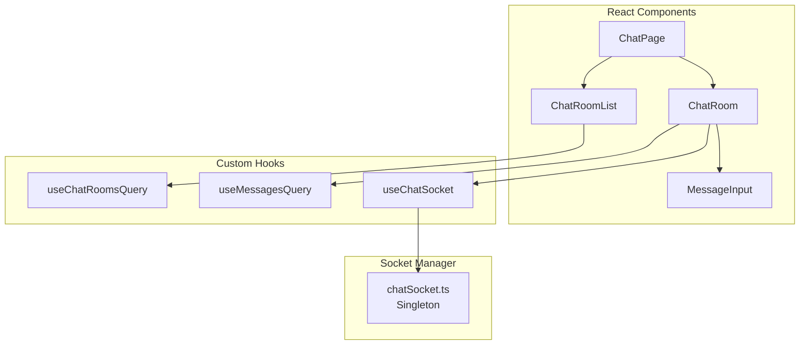
```mermaid
flowchart TB
    subgraph Components["React Components"]
        PAGE[ChatPage]
        LIST[ChatRoomList]
        ROOM[ChatRoom]
        INPUT[MessageInput]
    end

    subgraph Hooks["Custom Hooks"]
        QUERY[useChatRoomsQuery]
        MSG[useMessagesQuery]
        SOCKET[useChatSocket]
    end

    subgraph Socket["Socket Manager"]
        SM[chatSocket.ts<br/>Singleton]
    end

    PAGE --> LIST & ROOM
    ROOM --> INPUT
    LIST --> QUERY
    ROOM --> MSG & SOCKET
    SOCKET --> SM
```

**chatSocket.ts 주요 메서드:**
```typescript
// 연결
chatSocket.connect(token: string): void

// 채팅방
chatSocket.joinRoom(roomId: string): Promise<boolean>
chatSocket.leaveRoom(roomId: string): void

// 메시지
chatSocket.sendMessage(roomId, content, type): Promise<Message | null>
chatSocket.onMessage(callback: (msg: Message) => void): void

// 타이핑
chatSocket.sendTyping(roomId: string, isTyping: boolean): void
chatSocket.onTyping(callback: (event: TypingEvent) => void): void

// 상태
chatSocket.isConnected(): boolean
chatSocket.disconnect(): void
```

### 7.3 iOS (SwiftUI + SocketIO)

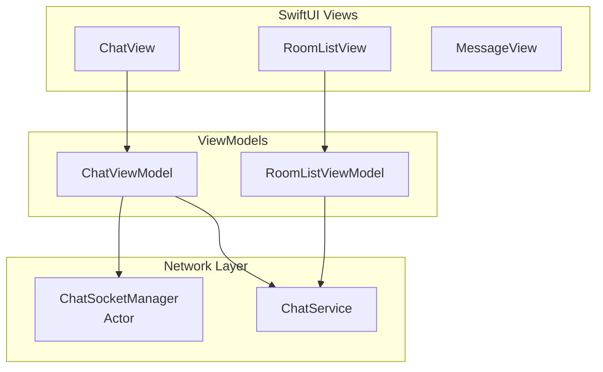
```mermaid
flowchart TB
    subgraph Views["SwiftUI Views"]
        CV[ChatView]
        RLV[RoomListView]
        MV[MessageView]
    end

    subgraph ViewModels["ViewModels"]
        CVM[ChatViewModel]
        RVM[RoomListViewModel]
    end

    subgraph Network["Network Layer"]
        SM[ChatSocketManager<br/>Actor]
        API[ChatService]
    end

    CV --> CVM
    RLV --> RVM
    CVM --> SM & API
    RVM --> API
```

**ChatSocketManager 주요 메서드:**
```swift
// 연결
func connect(token: String)
func disconnect()

// 채팅방
func joinRoom(roomId: String) async -> Bool
func leaveRoom(roomId: String)

// 메시지
func sendMessage(roomId: String, content: String) async -> ChatMessage?

// Publishers (Combine)
var messageReceived: AnyPublisher<ChatMessage, Never>
var typingReceived: AnyPublisher<TypingEvent, Never>
var connectionState: AnyPublisher<ConnectionState, Never>
```

### 7.4 연결 상태 관리

```mermaid
stateDiagram-v2
    [*] --> Disconnected

    Disconnected --> Connecting: connect()
    Connecting --> Connected: 인증 성공
    Connecting --> Disconnected: 인증 실패

    Connected --> Reconnecting: 연결 끊김
    Reconnecting --> Connected: 재연결 성공
    Reconnecting --> Disconnected: 재연결 실패 (max retry)

    Connected --> Disconnected: disconnect()
```

---

## 8. 에러 처리 및 복구

### 8.1 WebSocket 연결 실패

```mermaid
flowchart TD
    A[메시지 전송] --> B{WebSocket 연결?}
    B -->|연결됨| C[WebSocket 전송]
    B -->|끊김| D[REST API Fallback]

    C --> E{전송 성공?}
    E -->|성공| F[완료]
    E -->|실패| D

    D --> G["POST /chat/rooms/:id/messages"]
    G --> H{API 성공?}
    H -->|성공| F
    H -->|실패| I[에러 표시 + 재시도 버튼]
```

### 8.2 재연결 전략

```mermaid
flowchart TB
    subgraph Reconnect["재연결 로직"]
        R1[연결 끊김 감지]
        R2[지수 백오프 대기<br/>3s → 6s → 12s → ... → 30s]
        R3[재연결 시도]
        R4{성공?}
        R5[채팅방 재입장]
        R6[최대 재시도 초과]
    end

    R1 --> R2 --> R3 --> R4
    R4 -->|성공| R5
    R4 -->|실패| R2
    R4 -->|max retry| R6
```

### 8.3 메시지 중복 방지

```mermaid
sequenceDiagram
    participant Client
    participant Gateway as chat-gateway
    participant Service as chat-service
    participant DB

    Note over Client: 메시지 ID를 클라이언트에서 생성 (UUID)

    Client->>Gateway: send_message({ id: "uuid-123", ... })
    Gateway->>Service: save({ id: "uuid-123", ... })

    Service->>DB: SELECT WHERE id = "uuid-123"

    alt 이미 존재
        DB-->>Service: existing message
        Service-->>Gateway: { data: existing, duplicate: true }
    else 새 메시지
        Service->>DB: INSERT
        Service-->>Gateway: { data: new, duplicate: false }
    end
```

### 8.4 NATS 연결 실패

```mermaid
flowchart TD
    A[NATS 요청] --> B{NATS 연결?}
    B -->|연결| C[정상 처리]
    B -->|끊김| D[자동 재연결 시도]

    D --> E{재연결 성공?}
    E -->|성공| C
    E -->|실패| F[503 Service Unavailable]

    F --> G[클라이언트 재시도]
```

---

## 9. 배포 및 운영

### 9.1 서비스 구성

| 서비스 | 개발 환경 | 프로덕션 환경 | Min Instances |
|--------|----------|--------------|---------------|
| user-api | localhost:3001 | Cloud Run | 1 |
| chat-gateway | localhost:3003 | Cloud Run | 1 |
| chat-service | localhost:3004 | Cloud Run | 1 |
| NATS | localhost:4222 | VM (External IP) | 1 |
| PostgreSQL | localhost:5432 | VM (External IP) | 1 |

### 9.2 Cloud Run 설정

```mermaid
flowchart TB
    subgraph CloudRun["Cloud Run Services"]
        GW[chat-gateway<br/>min: 1, max: 10<br/>WebSocket timeout: 3600s]
        CS[chat-service<br/>min: 1, max: 10<br/>concurrency: 80]
    end

    subgraph Infra["Infrastructure"]
        NATS[NATS VM<br/>External IP<br/>:4222]
        DB[PostgreSQL VM<br/>External IP<br/>:5432]
    end

    GW <--> NATS
    CS <--> NATS
    CS --> DB
```

### 9.3 WebSocket 타임아웃 설정

Cloud Run에서 WebSocket을 사용하려면 요청 타임아웃을 늘려야 합니다.

```yaml
# Cloud Run 배포 시
--timeout=3600  # 1시간
--cpu-throttling  # CPU 스로틀링 활성화 (비용 절감)
```

### 9.4 모니터링

```mermaid
flowchart LR
    subgraph Metrics["주요 지표"]
        M1[동시 접속자 수]
        M2[초당 메시지 수]
        M3[WebSocket 연결 실패율]
        M4[평균 메시지 전송 지연]
    end

    subgraph Logs["로그 확인"]
        L1[gcloud run logs read<br/>--service=chat-gateway]
        L2[NATS 연결 상태]
        L3[JWT 인증 실패]
    end

    M1 & M2 & M3 & M4 --> Dashboard
    L1 & L2 & L3 --> Alerting
```

### 9.5 문제 해결

| 증상 | 원인 | 해결 방법 |
|------|------|----------|
| WebSocket 연결 안됨 | Cloud Run 타임아웃 | `--timeout=3600` 설정 |
| 메시지 전달 지연 | Cold Start | `--min-instances=1` 설정 |
| "No subscribers" 에러 | chat-service 미시작 | 서비스 상태 확인, health check |
| 메시지 중복 | 재전송 로직 버그 | 클라이언트 UUID 확인 |
| 채팅방 목록 안 뜸 | NATS 연결 실패 | NATS VM 상태 확인 |

---

## 부록: 향후 개선 사항

### 실시간 알림 통합

현재 채팅 메시지는 오프라인 사용자에게 Push 알림으로 전달됩니다. 향후 chat-gateway를 통해 웹 클라이언트에도 실시간 알림을 전달할 수 있습니다.

```mermaid
flowchart LR
    subgraph Current["현재"]
        NS[notify-service] -->|FCM/APNs| Mobile
    end

    subgraph Future["향후"]
        NS2[notify-service] -->|NATS| GW[chat-gateway]
        GW -->|WebSocket| Web
        NS2 -->|FCM/APNs| Mobile2[Mobile]
    end
```

### 메시지 검색

- Elasticsearch 연동
- 채팅방 내 키워드 검색
- 날짜 범위 필터

### 파일 첨부

- 이미지/파일 업로드 (Cloud Storage)
- 썸네일 자동 생성
- 파일 만료 정책
