# Chat Workflow Documentation

채팅 시스템의 전체 아키텍처와 데이터 흐름을 설명합니다.

## 목차

1. [시스템 아키텍처](#시스템-아키텍처)
2. [컴포넌트 구성](#컴포넌트-구성)
3. [데이터 흐름](#데이터-흐름)
4. [REST API 흐름](#rest-api-흐름)
5. [WebSocket 실시간 통신](#websocket-실시간-통신)
6. [데이터베이스 스키마](#데이터베이스-스키마)
7. [NATS 메시지 패턴](#nats-메시지-패턴)

---

## 시스템 아키텍처

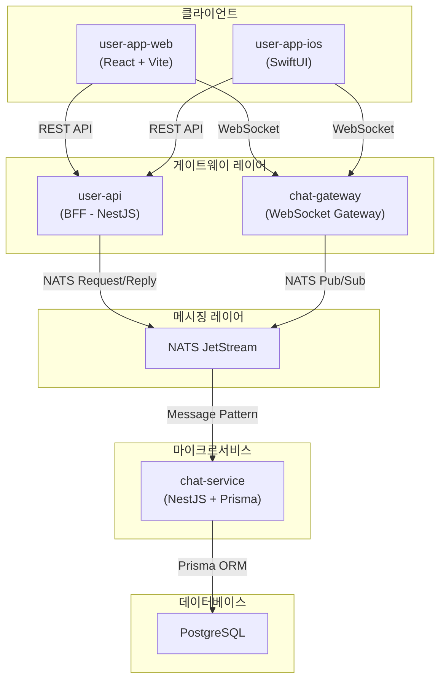

---

## 컴포넌트 구성

### 클라이언트

| 컴포넌트 | 기술 스택 | 역할 |
|---------|----------|------|
| **user-app-web** | React, Vite, Socket.IO Client | 웹 브라우저용 채팅 UI |
| **user-app-ios** | SwiftUI, SocketIO | iOS 앱용 채팅 UI |

### 백엔드

| 컴포넌트 | 기술 스택 | 역할 |
|---------|----------|------|
| **user-api** | NestJS | REST API 제공 (BFF) |
| **chat-gateway** | NestJS, Socket.IO | WebSocket 실시간 통신 |
| **chat-service** | NestJS, Prisma | 채팅 비즈니스 로직 + DB |
| **NATS JetStream** | NATS | 메시지 브로커 |

---

## 데이터 흐름

### 전체 흐름 개요

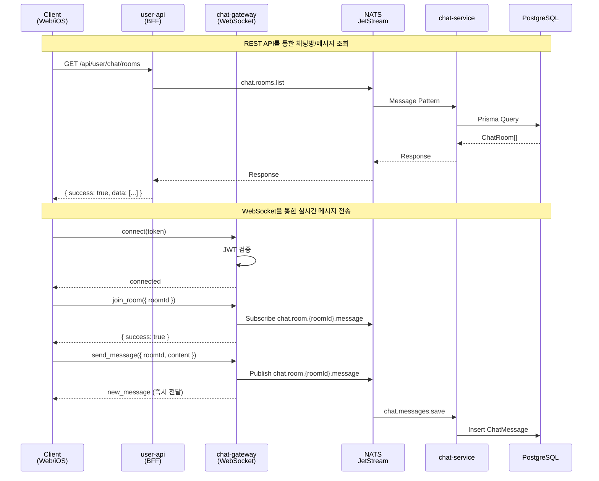

---

## REST API 흐름

REST API는 채팅방 목록/상세 조회, 메시지 히스토리 조회, 채팅방 생성 등에 사용됩니다.

### 1. 채팅방 목록 조회

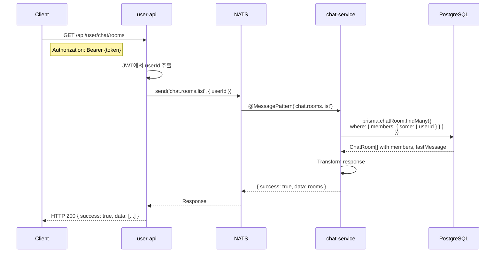

**엔드포인트:**
```
GET /api/user/chat/rooms
Authorization: Bearer {JWT_TOKEN}
```

**응답 예시:**
```json
{
  "success": true,
  "data": [
    {
      "id": "uuid-1234",
      "name": "박영희",
      "type": "DIRECT",
      "members": [
        {
          "id": "member-uuid",
          "userId": 4,
          "userName": "김철수",
          "joinedAt": "2024-01-15T10:00:00Z"
        }
      ],
      "lastMessage": {
        "id": "msg-uuid",
        "content": "안녕하세요!",
        "senderId": 4,
        "createdAt": "2024-01-15T10:30:00Z"
      },
      "createdAt": "2024-01-15T10:00:00Z",
      "updatedAt": "2024-01-15T10:30:00Z"
    }
  ]
}
```

### 2. 채팅방 생성

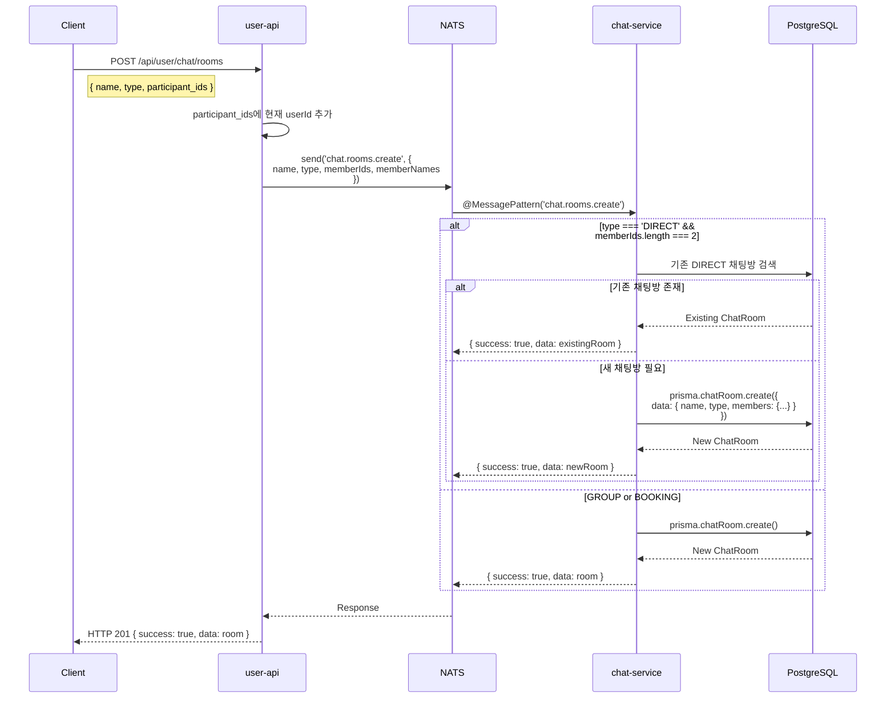

**엔드포인트:**
```
POST /api/user/chat/rooms
Authorization: Bearer {JWT_TOKEN}
Content-Type: application/json

{
  "name": "그룹 채팅방",
  "type": "GROUP",
  "participant_ids": ["5", "6", "7"]
}
```

### 3. 메시지 목록 조회

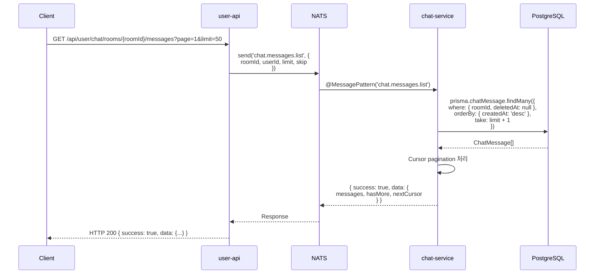

### 4. 메시지 전송 (REST Fallback)

WebSocket 연결이 불안정할 때 REST API로 메시지를 전송할 수 있습니다.

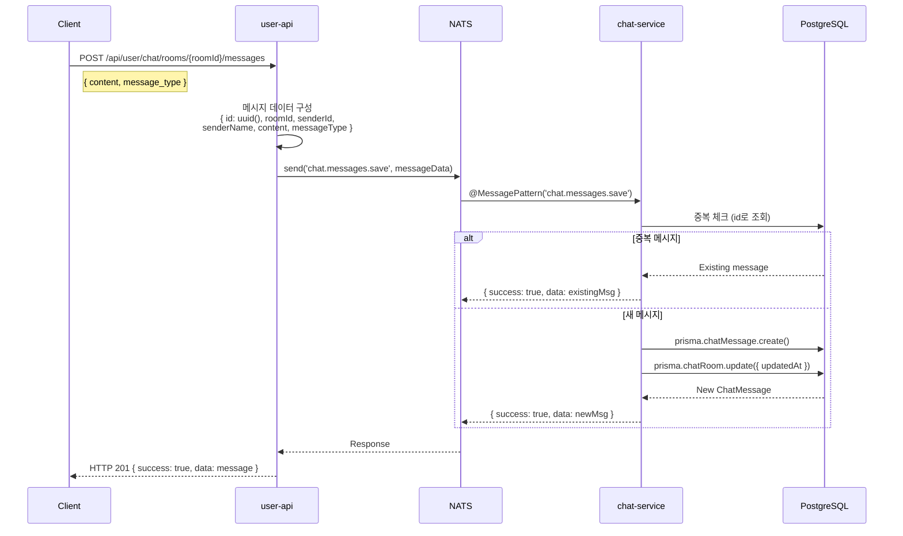

---

## WebSocket 실시간 통신

WebSocket은 실시간 메시지 전송과 수신에 사용됩니다.

### 연결 및 인증

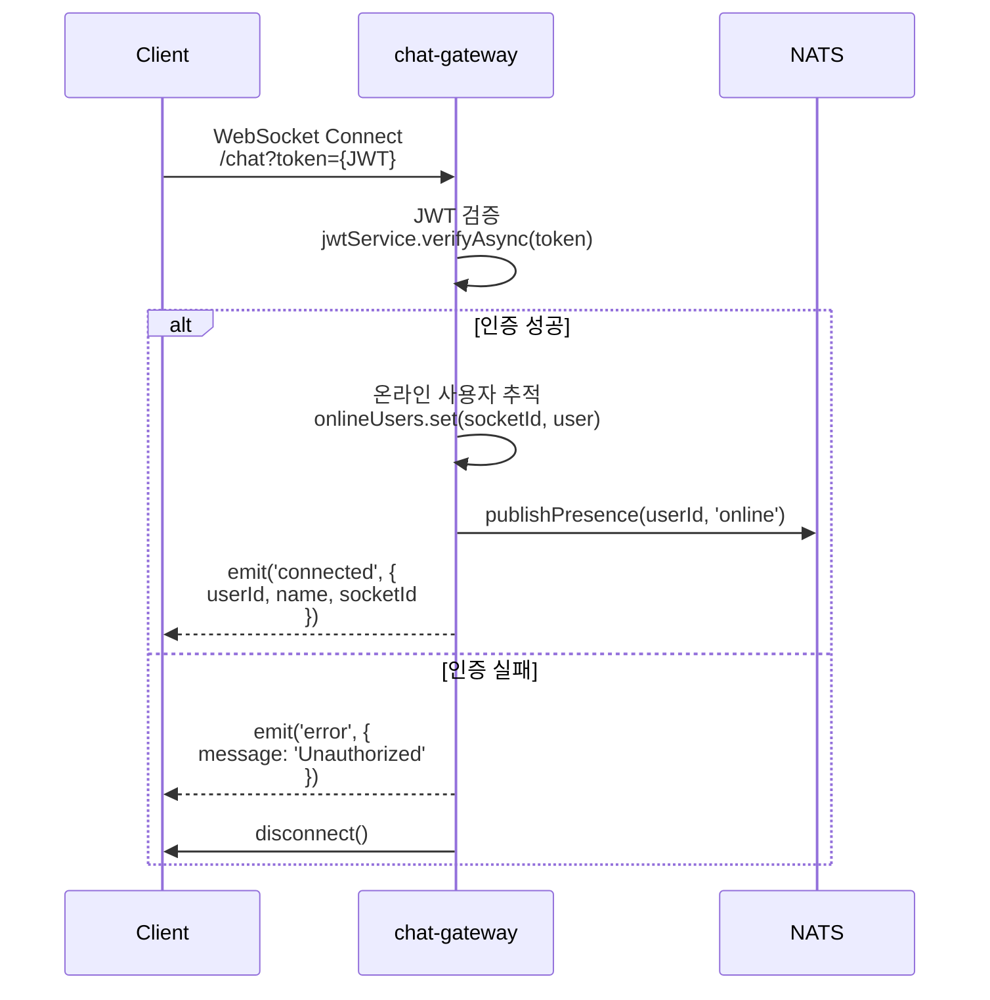

### 채팅방 입장

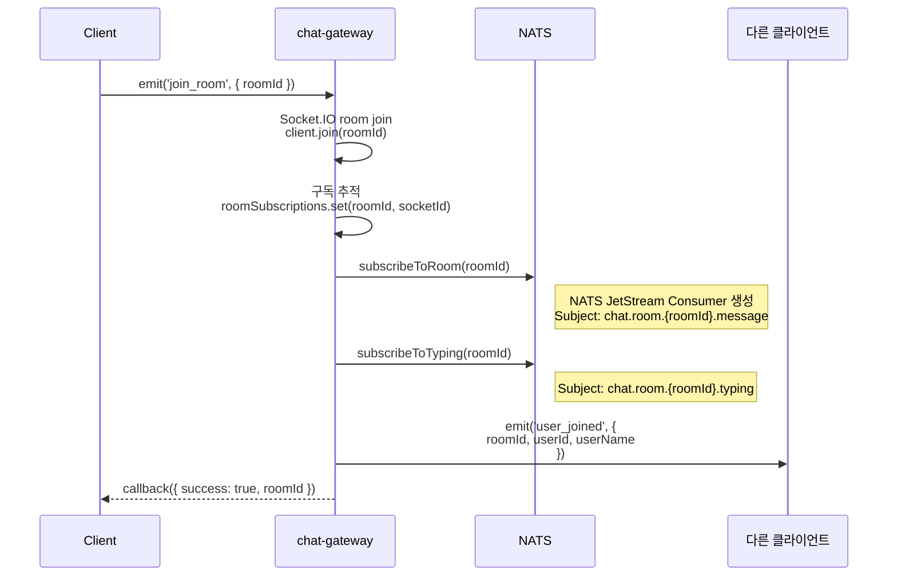

### 메시지 전송 (실시간)

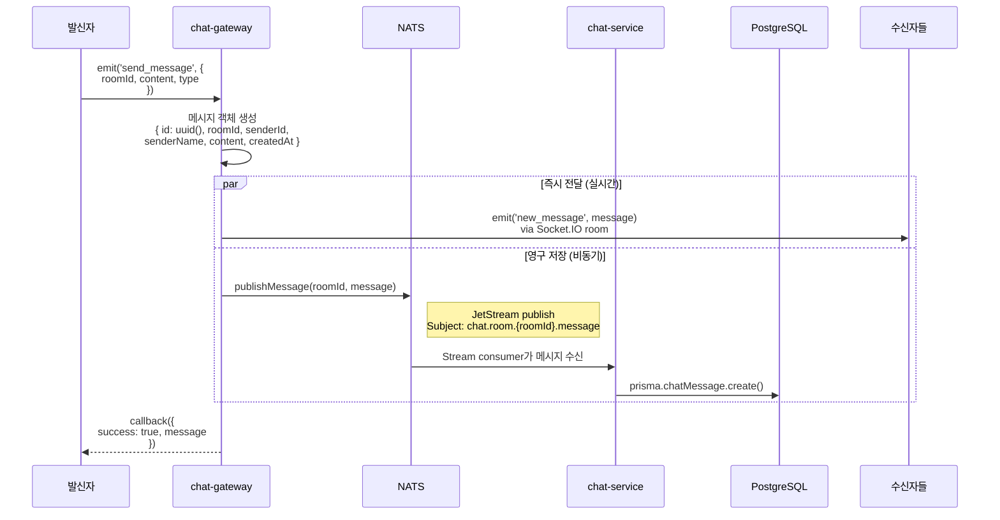

### 타이핑 표시

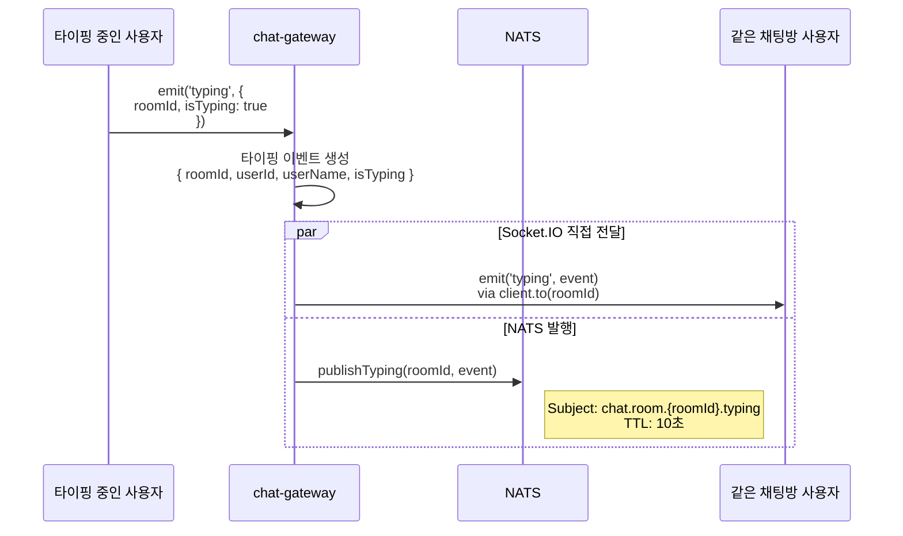

### 연결 해제

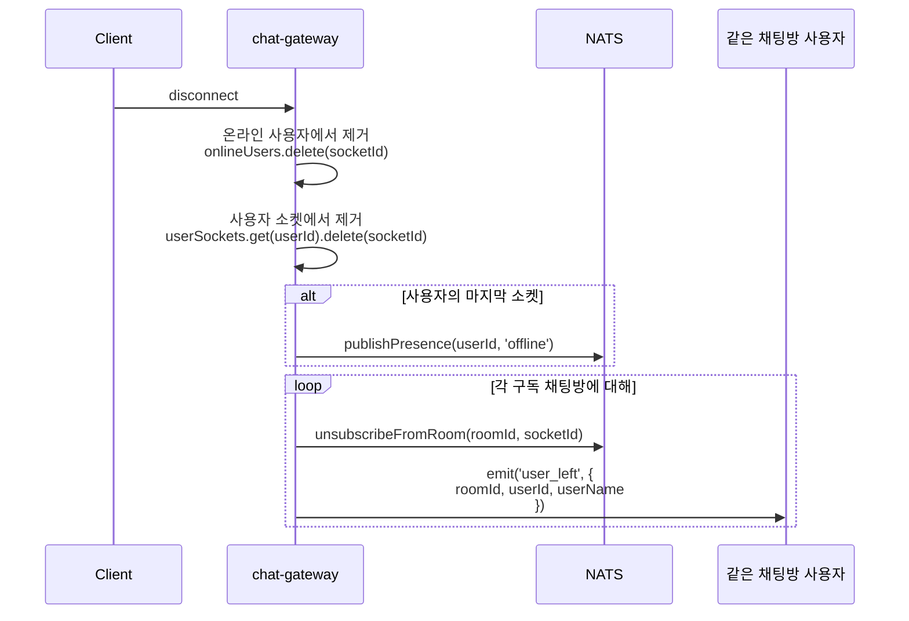

---

## 데이터베이스 스키마

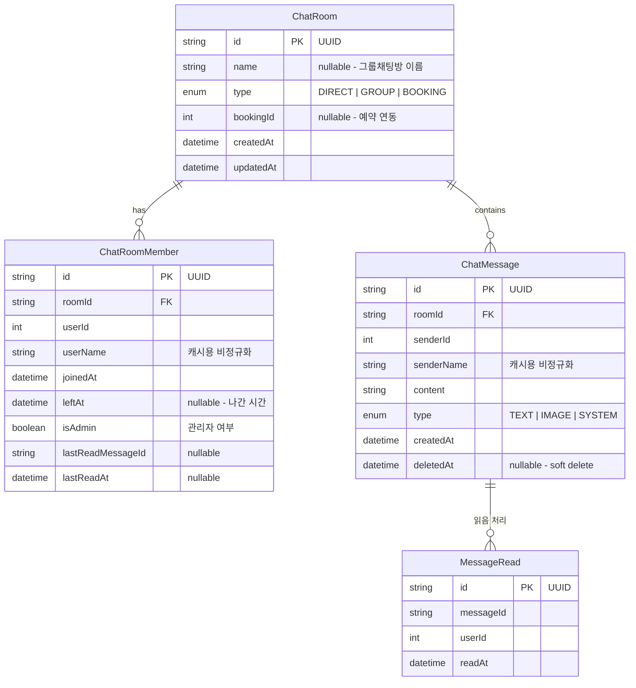

---

## NATS 메시지 패턴

### Request/Reply 패턴 (REST API용)

| 패턴 | 용도 | Payload |
|------|------|---------|
| `chat.rooms.list` | 채팅방 목록 조회 | `{ userId: number }` |
| `chat.rooms.get` | 채팅방 상세 조회 | `{ roomId: string }` |
| `chat.rooms.create` | 채팅방 생성 | `{ name, type, memberIds, memberNames }` |
| `chat.rooms.removeMember` | 채팅방 나가기 | `{ roomId, userId }` |
| `chat.messages.list` | 메시지 목록 조회 | `{ roomId, limit, skip }` |
| `chat.messages.save` | 메시지 저장 | `{ id, roomId, senderId, content, ... }` |
| `chat.messages.markRead` | 읽음 처리 | `{ roomId, userId, messageId }` |
| `chat.messages.unreadCount` | 안읽은 수 조회 | `{ roomId, userId }` |

### Pub/Sub 패턴 (실시간 통신용)

| Subject | 용도 | Stream |
|---------|------|--------|
| `chat.room.{roomId}.message` | 채팅 메시지 | CHAT_MESSAGES |
| `chat.dm.{userId1}-{userId2}.message` | DM 메시지 | CHAT_MESSAGES |
| `chat.user.{userId}.presence` | 온라인 상태 | CHAT_PRESENCE |
| `chat.room.{roomId}.typing` | 타이핑 표시 | CHAT_TYPING |

### JetStream 스트림 설정

| 스트림 | Subject 패턴 | 보존 기간 | 저장소 |
|--------|-------------|----------|--------|
| CHAT_MESSAGES | `chat.room.*.message`, `chat.dm.*.message` | 30일 | File |
| CHAT_PRESENCE | `chat.user.*.presence` | 5분 | Memory |
| CHAT_TYPING | `chat.room.*.typing` | 10초 | Memory |

---

## 클라이언트 구현 요약

### user-app-web (React)

```typescript
// 연결
chatSocket.connect(token);

// 채팅방 입장
chatSocket.onConnect(() => {
  chatSocket.joinRoom(roomId);
});

// 메시지 수신
chatSocket.onMessage((message) => {
  setMessages(prev => [...prev, message]);
});

// 메시지 전송
const result = await chatSocket.sendMessage(roomId, content);
if (!result) {
  // WebSocket 실패 시 REST API fallback
  await sendMessageMutation.mutateAsync({ roomId, content });
}
```

### user-app-ios (Swift)

```swift
// 연결
ChatSocketManager.shared.connect(token: token)

// 채팅방 입장
ChatSocketManager.shared.joinRoom(roomId: roomId) { success in
    print("Joined room: \(success)")
}

// 메시지 수신
ChatSocketManager.shared.messageReceived
    .receive(on: DispatchQueue.main)
    .sink { message in
        self.messages.append(message)
    }

// 메시지 전송
ChatSocketManager.shared.sendMessage(roomId: roomId, content: content) { message in
    if message == nil {
        // REST API fallback
    }
}
```

---

## 에러 처리

### NATS 연결 실패

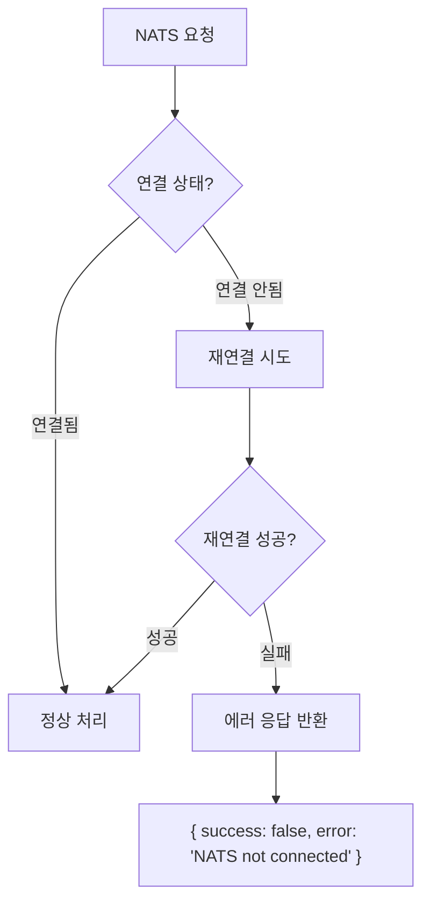

### WebSocket 연결 실패

```mermaid
flowchart TD
    A[WebSocket 메시지 전송] --> B{연결 상태?}
    B -->|연결됨| C[WebSocket으로 전송]
    B -->|연결 안됨| D[REST API Fallback]
    C --> E{전송 성공?}
    E -->|성공| F[완료]
    E -->|실패| D
    D --> G[POST /api/user/chat/rooms/{roomId}/messages]
```

---

## 배포 환경

| 서비스 | 개발 환경 | 프로덕션 환경 |
|--------|----------|--------------|
| user-api | `localhost:3001` | Cloud Run |
| chat-gateway | `localhost:3003` | Cloud Run |
| chat-service | `localhost:3004` | Cloud Run |
| NATS | `localhost:4222` | Cloud Run (내부) |
| PostgreSQL | `localhost:5432` | Cloud SQL |

### Cloud Run Cold Start 주의

Cloud Run은 트래픽이 없을 때 인스턴스를 0으로 스케일 다운합니다. 이로 인해:

1. **첫 번째 요청 지연**: chat-service가 cold start 상태일 때 NATS 구독이 아직 완료되지 않아 "No subscribers" 에러 발생 가능
2. **해결 방법**:
   - 최소 인스턴스 수 설정 (`--min-instances=1`)
   - Health check로 서비스 warm-up
   - 클라이언트에서 재시도 로직 구현
