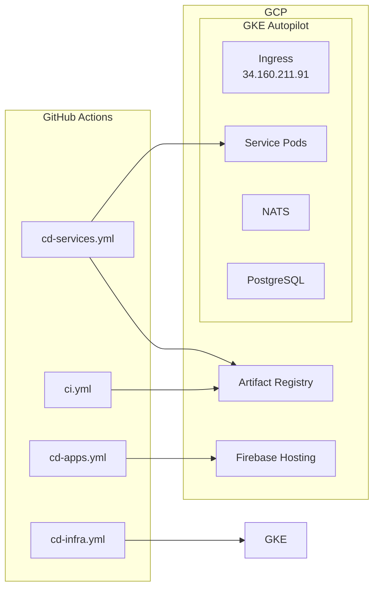

# Park Golf Platform CI/CD 가이드 (GKE Autopilot)

## 목차
1. [개요](#개요)
2. [워크플로우 구성](#워크플로우-구성)
3. [배포 순서](#배포-순서)
4. [워크플로우 상세](#워크플로우-상세)
5. [GitHub Secrets 설정](#github-secrets-설정)
6. [사용 예시](#사용-예시)
7. [트러블슈팅](#트러블슈팅)

---

## 개요

Park Golf Platform은 **수동 실행(workflow_dispatch)** 기반의 CI/CD 파이프라인을 사용합니다.

### 주요 특징
- 모든 워크플로우는 수동으로만 실행
- 환경별(dev/prod) 분리 배포
- GKE Autopilot 클러스터 기반 인프라
- 인프라(GKE)와 애플리케이션(서비스, 앱) 분리
- 선택적 서비스/앱 배포 지원

### 기술 스택
| 구성요소 | 기술 |
|---------|------|
| 인프라 관리 | GKE Autopilot + kubectl |
| 백엔드 서비스 | GKE Deployments |
| 프론트엔드 앱 | Firebase Hosting |
| 컨테이너 레지스트리 | Artifact Registry |
| CI/CD | GitHub Actions |

### 아키텍처 개요



---

## 워크플로우 구성

| 워크플로우 | 파일 | 용도 | 트리거 |
|-----------|------|------|--------|
| **CI Pipeline** | `ci.yml` | 코드 품질 검증 (lint, test, build) | 수동 |
| **CD Infrastructure** | `cd-infra.yml` | GKE 클러스터 및 인프라 관리 | 수동 |
| **CD Services** | `cd-services.yml` | 백엔드 서비스 배포 (GKE) | 수동 |
| **CD Apps** | `cd-apps.yml` | 프론트엔드 앱 배포 (Firebase) | 수동 |

---

## 배포 순서

### 최초 환경 구축 시

```
1. CD Infrastructure (network-apply) → 네트워크 설정
           ↓
2. CD Infrastructure (gke-setup) → GKE 클러스터 생성
           ↓
3. CD Services (all) → 백엔드 서비스 배포
           ↓
4. CD Apps (all) → 프론트엔드 앱 배포
```

### 일반 배포 시

```
코드 변경 → CD Services 또는 CD Apps 실행
```

### 인프라 변경 시

```
인프라 변경 필요 → CD Infrastructure 실행
```

### 환경 삭제 시

```
CD Infrastructure (gke-destroy) → 클러스터 및 리소스 삭제
```

---

## 워크플로우 상세

### 1. CD Infrastructure (`cd-infra.yml`)

GKE Autopilot 클러스터와 관련 인프라를 관리합니다.

**입력 옵션:**
| 옵션 | 설명 | 값 |
|------|------|-----|
| environment | 대상 환경 | `dev`, `prod` |
| action | 실행할 작업 | `network-apply`, `gke-setup`, `gke-destroy` |

**Action 설명:**

| Action | 설명 | 생성/삭제 리소스 |
|--------|------|-----------------|
| `network-apply` | 네트워크 리소스 설정 | Static IP |
| `gke-setup` | GKE 클러스터 생성 및 구성 | Cluster, NATS, PostgreSQL, Secrets |
| `gke-destroy` | GKE 클러스터 및 리소스 삭제 | 전체 클러스터 + PVC 디스크 |

**gke-setup 실행 단계:**
1. GKE Autopilot 클러스터 생성
2. 클러스터 인증 정보 획득
3. Kubernetes Secrets 생성 (DB, JWT)
4. NATS Deployment 생성
5. PostgreSQL StatefulSet 생성 (PVC 포함)
6. 데이터베이스 초기화 (5개 DB 생성)

**gke-destroy 실행 단계:**
1. GKE 클러스터 삭제
2. 고아(orphaned) PVC 디스크 정리

**사용 예:**
```
# 네트워크 설정
GitHub Actions → CD Infrastructure
- environment: dev
- action: network-apply

# GKE 클러스터 생성
GitHub Actions → CD Infrastructure
- environment: dev
- action: gke-setup

# GKE 클러스터 삭제
GitHub Actions → CD Infrastructure
- environment: dev
- action: gke-destroy
```

---

### 2. CD Services (`cd-services.yml`)

백엔드 서비스를 GKE 클러스터에 배포합니다.

**입력 옵션:**
| 옵션 | 설명 | 값 |
|------|------|-----|
| environment | 대상 환경 | `dev`, `prod` |
| services | 배포할 서비스 | `all` 또는 서비스명 (콤마 구분) |

**대상 서비스:**
- `iam-service` - 인증/인가
- `course-service` - 골프장/코스 관리
- `booking-service` - 예약 관리
- `notify-service` - 알림 (이메일, 푸시)
- `chat-service` - 채팅 백엔드
- `admin-api` - 관리자 BFF
- `user-api` - 사용자 BFF
- `chat-gateway` - WebSocket 게이트웨이

**실행 단계:**
1. Docker 이미지 빌드
2. Artifact Registry에 푸시
3. GKE 클러스터 인증
4. Kubernetes Deployment 생성/업데이트
5. Kubernetes Service 생성/업데이트
6. Ingress 업데이트 (BFF 서비스만)
7. 롤아웃 상태 확인

**리소스 스펙:**
| 환경 | CPU Request | CPU Limit | Memory Request | Memory Limit |
|------|-------------|-----------|----------------|--------------|
| dev | 100m | 300m | 128Mi | 256Mi |
| prod | 200m | 500m | 256Mi | 512Mi |

**사용 예:**
```
# 전체 서비스 배포
GitHub Actions → CD Services
- environment: dev
- services: all

# 특정 서비스만 배포
GitHub Actions → CD Services
- environment: dev
- services: iam-service,user-api
```

---

### 3. CD Apps (`cd-apps.yml`)

프론트엔드 앱을 Firebase Hosting에 배포합니다.

**입력 옵션:**
| 옵션 | 설명 | 값 |
|------|------|-----|
| environment | 대상 환경 | `dev`, `prod` |
| apps | 배포할 앱 | `all` 또는 앱명 (콤마 구분) |

**대상 앱:**
- `admin-dashboard` - 관리자 대시보드
- `user-app-web` - 사용자 웹앱

**실행 단계:**
1. npm ci → 의존성 설치
2. 환경변수 설정 (API URL)
3. npm run build → 빌드
4. Firebase Hosting에 배포

**환경별 API URL:**
| 환경 | API URL |
|------|---------|
| dev | `http://34.160.211.91` |
| prod | `https://api.parkgolf.app` |

**사용 예:**
```
# 전체 앱 배포
GitHub Actions → CD Apps
- environment: dev
- apps: all

# 관리자 대시보드만 배포
GitHub Actions → CD Apps
- environment: dev
- apps: admin-dashboard
```

---

### 4. CI Pipeline (`ci.yml`)

코드 품질을 검증합니다.

**입력 옵션:**
| 옵션 | 설명 | 값 |
|------|------|-----|
| target | 검증 대상 | `all`, `apps`, `services` |

**실행 단계:**
1. Lint - 코드 스타일 검사
2. Type Check - TypeScript 타입 검사
3. Test - 단위 테스트
4. Build - 빌드 검증
5. Security Scan - Trivy 보안 스캔

---

## GitHub Secrets 설정

GitHub 저장소 → Settings → Secrets and variables → Actions

### 필수 Secrets

| Secret | 설명 | 예시 |
|--------|------|------|
| `GCP_SA_KEY` | GCP 서비스 계정 JSON 키 | `{ "type": "service_account", ... }` |
| `DB_PASSWORD` | PostgreSQL 비밀번호 | `MySecureP@ssw0rd!2024` |
| `JWT_SECRET` | JWT 서명 키 (32자 이상) | `your-super-secret-jwt-key-min-32-chars` |
| `JWT_REFRESH_SECRET` | JWT 리프레시 키 | `your-refresh-secret-key-min-32-chars` |

### Secret 생성 방법

```bash
# GCP Service Account 키 생성
gcloud iam service-accounts keys create key.json \
  --iam-account=github-actions@PROJECT_ID.iam.gserviceaccount.com

# 키 내용을 GCP_SA_KEY Secret으로 등록

# 랜덤 비밀번호/시크릿 생성
openssl rand -base64 32
```

---

## 사용 예시

### 시나리오 1: 새 환경 구축 (전체 배포)

```
1. GitHub Actions → CD Infrastructure
   - environment: dev
   - action: network-apply

2. GitHub Actions → CD Infrastructure
   - environment: dev
   - action: gke-setup

3. GitHub Actions → CD Services
   - environment: dev
   - services: all

4. GitHub Actions → CD Apps
   - environment: dev
   - apps: all
```

### 시나리오 2: 특정 서비스 업데이트

```
GitHub Actions → CD Services
- environment: dev
- services: iam-service
```

### 시나리오 3: 여러 서비스 동시 업데이트

```
GitHub Actions → CD Services
- environment: dev
- services: iam-service,booking-service,user-api
```

### 시나리오 4: 프로덕션 배포

```
1. develop 브랜치에서 테스트 완료
2. main 브랜치로 머지
3. GitHub Actions → CD Services
   - environment: prod
   - services: all
4. GitHub Actions → CD Apps
   - environment: prod
   - apps: all
```

### 시나리오 5: 환경 삭제

```
GitHub Actions → CD Infrastructure
- environment: dev
- action: gke-destroy
```

---

## 트러블슈팅

### 1. "Permission denied" 오류

**원인:** GCP 서비스 계정 권한 부족

**해결:**
```bash
# 필요한 역할 확인
gcloud projects get-iam-policy PROJECT_ID \
  --flatten="bindings[].members" \
  --filter="bindings.members:github-actions"

# 권한 추가
gcloud projects add-iam-policy-binding PROJECT_ID \
  --member="serviceAccount:SA_EMAIL" \
  --role="roles/container.admin"
```

### 2. "Image not found" 오류

**원인:** Docker 이미지가 Artifact Registry에 없음

**해결:**
1. CD Services 워크플로우로 이미지 먼저 빌드
2. Artifact Registry에서 이미지 존재 확인

```bash
gcloud artifacts docker images list \
  asia-northeast3-docker.pkg.dev/uniyous-319808/parkgolf
```

### 3. "Pod failed to start" 오류

**확인사항:**
1. Dockerfile CMD/ENTRYPOINT 확인
2. 포트가 8080인지 확인
3. 환경변수 누락 여부
4. 리소스 requests/limits 적절성

**로그 확인:**
```bash
# 클러스터 인증
gcloud container clusters get-credentials parkgolf-cluster-dev \
  --region asia-northeast3

# Pod 로그 확인
kubectl logs -l app=<service-name> --tail=50

# Pod 상세 정보
kubectl describe pod -l app=<service-name>
```

### 4. Ingress 접근 불가

**원인:** Ingress 설정 오류 또는 Backend 서비스 미실행

**해결:**
```bash
# Ingress 상태 확인
kubectl get ingress parkgolf-ingress
kubectl describe ingress parkgolf-ingress

# Backend 서비스 확인
kubectl get pods -l app=admin-api
kubectl get pods -l app=user-api

# 서비스 엔드포인트 확인
kubectl get endpoints admin-api
kubectl get endpoints user-api
```

### 5. Database 연결 실패

**원인:** PostgreSQL Pod 미실행 또는 Secret 오류

**해결:**
```bash
# PostgreSQL Pod 상태 확인
kubectl get pods -l app=postgresql
kubectl logs postgresql-0

# Secret 확인
kubectl get secrets db-credentials -o yaml

# 연결 테스트
kubectl exec -it <app-pod> -- nc -zv postgresql 5432
```

### 6. NATS 연결 실패

**원인:** NATS Pod 미실행

**해결:**
```bash
# NATS Pod 상태 확인
kubectl get pods -l app=nats
kubectl logs -l app=nats

# NATS 서비스 확인
kubectl get svc nats

# 연결 테스트
kubectl exec -it <app-pod> -- nc -zv nats 4222
```

### 7. PVC 디스크 삭제 실패 (gke-destroy)

**원인:** GKE 삭제 후 PVC 디스크가 고아 상태로 남음

**해결:**
```bash
# 고아 디스크 확인
gcloud compute disks list --filter="name~^pvc-"

# 수동 삭제
gcloud compute disks delete <disk-name> --zone=<zone> --quiet
```

---

## 로그 확인 명령어

### GKE 리소스 확인

```bash
# 클러스터 인증
gcloud container clusters get-credentials parkgolf-cluster-dev \
  --region asia-northeast3

# 모든 리소스 확인
kubectl get all

# Pod 상태
kubectl get pods

# 서비스 상태
kubectl get svc

# Ingress 상태
kubectl get ingress
```

### Pod 로그

```bash
# 최근 로그
kubectl logs -l app=<service-name> --tail=100

# 실시간 로그
kubectl logs -l app=<service-name> -f

# 이전 Pod 로그 (재시작된 경우)
kubectl logs -l app=<service-name> --previous
```

### 디버깅

```bash
# Pod 내부 쉘 접근
kubectl exec -it <pod-name> -- /bin/sh

# 리소스 사용량
kubectl top pods

# Pod 이벤트 확인
kubectl describe pod <pod-name>
```

---

## 참고 문서

- [ARCHITECTURE.md](./ARCHITECTURE.md) - 시스템 아키텍처
- [GCP_INFRASTRUCTURE.md](./GCP_INFRASTRUCTURE.md) - GCP 인프라 상세

---

**Document Version**: 2.0.0
**Last Updated**: 2026-01-28
**Architecture**: GKE Autopilot (migrated from Cloud Run)
