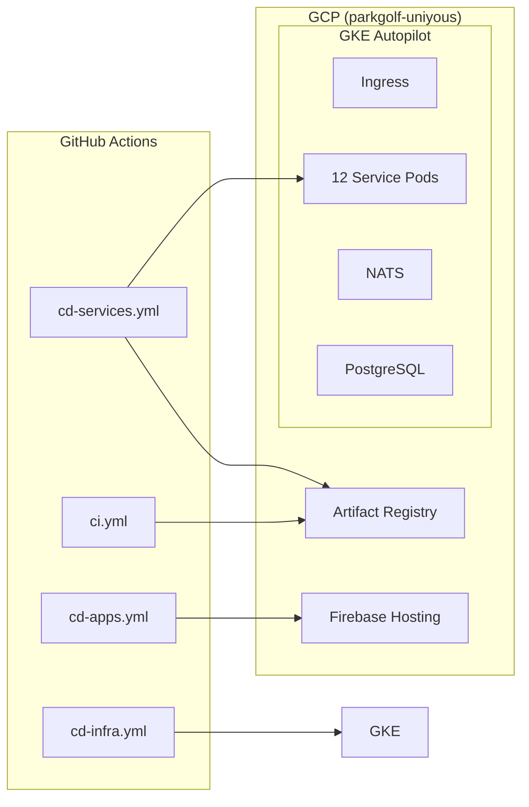

# Park Golf Platform CI/CD 가이드 (GKE Autopilot)

## 목차
1. [개요](#개요)
2. [워크플로우 구성](#워크플로우-구성)
3. [배포 순서](#배포-순서)
4. [워크플로우 상세](#워크플로우-상세)
5. [GitHub Secrets 설정](#github-secrets-설정)
6. [사용 예시](#사용-예시)
7. [트러블슈팅](#트러블슈팅)

---

## 개요

Park Golf Platform은 **수동 실행(workflow_dispatch)** 기반의 CI/CD 파이프라인을 사용합니다.

### 주요 특징
- 모든 워크플로우는 수동으로만 실행
- 환경별(dev/prod) 분리 배포
- GKE Autopilot 클러스터 기반 인프라
- 인프라(GKE)와 애플리케이션(서비스, 앱) 분리
- 선택적 서비스/앱 배포 지원

### 기술 스택
| 구성요소 | 기술 |
|---------|------|
| 인프라 관리 | GKE Autopilot + kubectl |
| 백엔드 서비스 | GKE Deployments |
| 프론트엔드 앱 | Firebase Hosting |
| 컨테이너 레지스트리 | Artifact Registry |
| CI/CD | GitHub Actions |

### 아키텍처 개요


```mermaid
graph LR
    subgraph "GitHub Actions"
        CI[ci.yml]
        INFRA[cd-infra.yml]
        SERVICES[cd-services.yml]
        APPS[cd-apps.yml]
    end

    subgraph "GCP (parkgolf-uniyous)"
        subgraph "GKE Autopilot"
            ING[Ingress]
            PODS[12 Service Pods]
            NATS[NATS]
            PG[PostgreSQL]
        end
        AR[Artifact Registry]
        FH[Firebase Hosting]
    end

    CI --> AR
    INFRA --> GKE
    SERVICES --> AR
    SERVICES --> PODS
    APPS --> FH
```

---

## 워크플로우 구성

| 워크플로우 | 파일 | 용도 | 트리거 |
|-----------|------|------|--------|
| **CI Pipeline** | `ci.yml` | 코드 품질 검증 (lint, test, build) | 수동 |
| **CD Infrastructure** | `cd-infra.yml` | GKE 클러스터 및 인프라 관리 | 수동 |
| **CD Services** | `cd-services.yml` | 백엔드 서비스 배포 (GKE) | 수동 |
| **CD Apps** | `cd-apps.yml` | 프론트엔드 앱 배포 (Firebase) | 수동 |

---

## 배포 순서

### 최초 환경 구축 시

```
1. CD Infrastructure (network-apply) → 네트워크 설정
           ↓
2. CD Infrastructure (gke-setup) → GKE 클러스터 생성
           ↓
3. CD Services (all) → 백엔드 서비스 배포
           ↓
4. CD Apps (all) → 프론트엔드 앱 배포
```

### 일반 배포 시

```
코드 변경 → CD Services 또는 CD Apps 실행
```

### 인프라 변경 시

```
인프라 변경 필요 → CD Infrastructure 실행
```

### 환경 삭제 시

```
CD Infrastructure (gke-destroy) → 클러스터 및 리소스 삭제
```

---

## 워크플로우 상세

### 1. CD Infrastructure (`cd-infra.yml`)

GKE Autopilot 클러스터와 관련 인프라를 관리합니다.

**입력 옵션:**
| 옵션 | 설명 | 값 |
|------|------|-----|
| environment | 대상 환경 | `dev`, `prod` |
| action | 실행할 작업 | `status`, `network-apply`, `gke-setup`, `gke-update`, `gke-destroy`, `network-destroy` |

**Action 설명:**

| Action | 설명 | 생성/삭제 리소스 |
|--------|------|-----------------|
| `status` | 인프라 상태 확인 | VPC, GKE, Pods, Services, Ingress 확인 |
| `network-apply` | VPC 네트워크 설정 (Terraform) | VPC, Subnets, Firewall |
| `gke-setup` | GKE 클러스터 생성 및 전체 구성 | Cluster, Namespace, Secrets, ConfigMap, PostgreSQL, NATS, PDB |
| `gke-update` | Secret/ConfigMap 업데이트 | Secrets, ConfigMap 재적용 + 전체 Pod 재시작 |
| `gke-destroy` | GKE 클러스터 삭제 | 전체 클러스터 + 고아 PVC 디스크 (**prod 차단**) |
| `network-destroy` | VPC 삭제 (Terraform) | VPC 및 관련 리소스 (**prod 차단**) |

**gke-setup 실행 단계:**
1. GCP API 활성화 (container, artifactregistry, compute)
2. Artifact Registry 생성 (parkgolf)
3. GKE Autopilot 클러스터 생성 (VPC 네트워크 연결)
4. Namespace 생성 (parkgolf-{env})
5. Kubernetes Secrets + ConfigMap 생성
6. PostgreSQL StatefulSet 배포 (PVC 포함)
7. 데이터베이스 초기화 (6개 DB: iam, course, booking, payment, chat, notify)
8. NATS Deployment 배포 (JetStream 활성화)
9. PodDisruptionBudget 설정 (postgres, nats)

**gke-destroy 실행 단계:**
1. GKE 클러스터 삭제
2. Static IP 삭제
3. 고아(orphaned) PVC 디스크 정리

> **주의:** `gke-destroy`와 `network-destroy`는 프로덕션 환경에서 실행이 차단됩니다.

**사용 예:**
```
# 인프라 상태 확인
GitHub Actions → CD Infrastructure
- environment: dev
- action: status

# 네트워크 설정 (Terraform)
GitHub Actions → CD Infrastructure
- environment: dev
- action: network-apply

# GKE 클러스터 생성
GitHub Actions → CD Infrastructure
- environment: dev
- action: gke-setup

# Secret/ConfigMap 업데이트 후 재배포
GitHub Actions → CD Infrastructure
- environment: dev
- action: gke-update

# GKE 클러스터 삭제
GitHub Actions → CD Infrastructure
- environment: dev
- action: gke-destroy
```

---

### 2. CD Services (`cd-services.yml`)

백엔드 서비스를 GKE 클러스터에 배포합니다.

**입력 옵션:**
| 옵션 | 설명 | 값 |
|------|------|-----|
| environment | 대상 환경 | `dev`, `prod` |
| services | 배포할 서비스 | `all` 또는 서비스명 (콤마 구분) |

**대상 서비스 (12개):**

| Service | Category | Purpose |
|---------|----------|---------|
| `admin-api` | BFF | 관리자/플랫폼 API Gateway |
| `user-api` | BFF | 사용자 API Gateway |
| `chat-gateway` | BFF | WebSocket Gateway (2 replicas) |
| `iam-service` | Core | 인증/인가/회원관리 |
| `course-service` | Core | 골프장/게임 관리 |
| `booking-service` | Core | 예약/정책 관리 |
| `payment-service` | Core | 결제 (Toss Payments) |
| `chat-service` | Core | 채팅 백엔드 |
| `notify-service` | Core | 알림 |
| `agent-service` | AI/Ext | AI 예약 어시스턴트 |
| `weather-service` | AI/Ext | 날씨 (기상청 API) |
| `location-service` | AI/Ext | 위치 (카카오 로컬 API) |

**실행 단계:**
1. Docker 이미지 빌드 (multi-stage, `node:20-alpine`)
2. Artifact Registry에 푸시 (태그: `{sha}`, `{env}-latest`)
3. GKE 클러스터 인증 + Namespace 설정
4. Kubernetes Deployment 생성/업데이트 (inline YAML)
5. Kubernetes Service 생성/업데이트 (ClusterIP)
6. Ingress 설정 (BFF + payment webhook)
7. 롤아웃 상태 확인

**리소스 스펙:**
| 환경 | CPU Request | CPU Limit | Memory Request | Memory Limit |
|------|-------------|-----------|----------------|--------------|
| dev | 50m | 250m | 128Mi | 384Mi |
| prod | 200m | 500m | 256Mi | 512Mi |

**Health Check 설정:**
| Probe | Path | Period |
|-------|------|--------|
| startupProbe | `/health` | 10s (failureThreshold: 30) |
| readinessProbe | `/health/ready` | 10s |
| livenessProbe | `/health/live` | 30s |

**사용 예:**
```
# 전체 서비스 배포
GitHub Actions → CD Services
- environment: dev
- services: all

# 특정 서비스만 배포
GitHub Actions → CD Services
- environment: dev
- services: iam-service,user-api
```

---

### 3. CD Apps (`cd-apps.yml`)

프론트엔드 앱을 Firebase Hosting에 배포합니다.

**입력 옵션:**
| 옵션 | 설명 | 값 |
|------|------|-----|
| environment | 대상 환경 | `dev`, `prod` |
| apps | 배포할 앱 | `all` 또는 앱명 (콤마 구분) |

**대상 앱:**
- `admin-dashboard` - 관리자 대시보드
- `platform-dashboard` - 플랫폼 관리자 대시보드
- `user-app-web` - 사용자 웹앱

**실행 단계:**
1. npm ci → 의존성 설치
2. 환경변수 설정 (API URL, TOSS_CLIENT_KEY 등)
3. npm run build → 빌드
4. Firebase Hosting에 배포 (Firebase CLI)

**환경별 설정:**
| 환경 | API URL | Firebase Site Suffix |
|------|---------|---------------------|
| dev | `https://dev-api.parkgolfmate.com` | `-dev` (e.g. `parkgolf-admin-dev`) |
| prod | `https://api.parkgolfmate.com` | (없음, e.g. `parkgolf-admin`) |

**Firebase Hosting 사이트:**
| App | Dev Site | Prod Site |
|-----|----------|-----------|
| admin-dashboard | `parkgolf-admin-dev` | `parkgolf-admin` |
| platform-dashboard | `parkgolf-platform-dev` | `parkgolf-platform` |
| user-app-web | `parkgolf-user-dev` | `parkgolf-user` |

> Firebase 프로젝트: `parkgolf-uniyous`

**사용 예:**
```
# 전체 앱 배포
GitHub Actions → CD Apps
- environment: dev
- apps: all

# 관리자 대시보드만 배포
GitHub Actions → CD Apps
- environment: dev
- apps: admin-dashboard

# 플랫폼 대시보드만 배포
GitHub Actions → CD Apps
- environment: dev
- apps: platform-dashboard
```

---

### 4. CI Pipeline (`ci.yml`)

코드 품질을 검증합니다.

**입력 옵션:**
| 옵션 | 설명 | 값 |
|------|------|-----|
| target | 검증 대상 | `all`, `apps`, `services` |

**실행 단계:**
1. Lint - 코드 스타일 검사
2. Type Check - TypeScript 타입 검사
3. Test - 단위 테스트
4. Build - 빌드 검증
5. Security Scan - Trivy 보안 스캔

---

## GitHub Secrets 설정

GitHub 저장소 → Settings → Secrets and variables → Actions

### 필수 Secrets

| Secret | 설명 | 용도 |
|--------|------|------|
| `GCP_SA_KEY` | GCP 서비스 계정 JSON 키 | GKE/Artifact Registry 접근 |
| `DB_PASSWORD` | PostgreSQL 비밀번호 | 데이터베이스 연결 |
| `JWT_SECRET` | JWT 서명 키 (32자 이상) | Access Token 서명 |
| `JWT_REFRESH_SECRET` | JWT 리프레시 키 (32자 이상) | Refresh Token 서명 |
| `TOSS_CLIENT_KEY` | Toss Payments 클라이언트 키 | 프론트엔드 결제위젯 |
| `TOSS_SECRET_KEY` | Toss Payments 시크릿 키 | 결제 API 인증 |
| `TOSS_SECURITY_KEY` | Toss Payments 보안 키 | 웹훅 검증 |
| `KMA_API_KEY` | 기상청 API 인증 키 | weather-service |
| `KAKAO_API_KEY` | 카카오 로컬 API 키 | location-service |
| `FIREBASE_TOKEN` | Firebase CLI 배포 토큰 | Firebase Hosting 배포 |

### Secret 생성 방법

```bash
# GCP Service Account 키 생성
gcloud iam service-accounts keys create key.json \
  --iam-account=github-actions@PROJECT_ID.iam.gserviceaccount.com

# 키 내용을 GCP_SA_KEY Secret으로 등록

# 랜덤 비밀번호/시크릿 생성
openssl rand -base64 32
```

---

## 사용 예시

### 시나리오 1: 새 환경 구축 (전체 배포)

```
1. GitHub Actions → CD Infrastructure
   - environment: dev
   - action: network-apply

2. GitHub Actions → CD Infrastructure
   - environment: dev
   - action: gke-setup

3. GitHub Actions → CD Services
   - environment: dev
   - services: all

4. GitHub Actions → CD Apps
   - environment: dev
   - apps: all
```

### 시나리오 2: 특정 서비스 업데이트

```
GitHub Actions → CD Services
- environment: dev
- services: iam-service
```

### 시나리오 3: 여러 서비스 동시 업데이트

```
GitHub Actions → CD Services
- environment: dev
- services: iam-service,booking-service,user-api
```

### 시나리오 4: 프로덕션 배포

```
1. develop 브랜치에서 테스트 완료
2. main 브랜치로 머지
3. GitHub Actions → CD Services
   - environment: prod
   - services: all
4. GitHub Actions → CD Apps
   - environment: prod
   - apps: all
```

### 시나리오 5: 환경 삭제

```
GitHub Actions → CD Infrastructure
- environment: dev
- action: gke-destroy
```

---

## 트러블슈팅

### 1. "Permission denied" 오류

**원인:** GCP 서비스 계정 권한 부족

**해결:**
```bash
# 필요한 역할 확인
gcloud projects get-iam-policy PROJECT_ID \
  --flatten="bindings[].members" \
  --filter="bindings.members:github-actions"

# 권한 추가
gcloud projects add-iam-policy-binding PROJECT_ID \
  --member="serviceAccount:SA_EMAIL" \
  --role="roles/container.admin"
```

### 2. "Image not found" 오류

**원인:** Docker 이미지가 Artifact Registry에 없음

**해결:**
1. CD Services 워크플로우로 이미지 먼저 빌드
2. Artifact Registry에서 이미지 존재 확인

```bash
gcloud artifacts docker images list \
  asia-northeast3-docker.pkg.dev/parkgolf-uniyous/parkgolf
```

### 3. "Pod failed to start" 오류

**확인사항:**
1. Dockerfile CMD/ENTRYPOINT 확인
2. 포트가 8080인지 확인
3. 환경변수 누락 여부
4. 리소스 requests/limits 적절성

**로그 확인:**
```bash
# 클러스터 인증
gcloud container clusters get-credentials parkgolf-dev-cluster \
  --region asia-northeast3 --project parkgolf-uniyous

# Pod 로그 확인
kubectl logs -l app=<service-name> -n parkgolf-dev --tail=50

# Pod 상세 정보
kubectl describe pod -l app=<service-name> -n parkgolf-dev
```

### 4. Ingress 접근 불가

**원인:** Ingress 설정 오류 또는 Backend 서비스 미실행

**해결:**
```bash
# Ingress 상태 확인
kubectl get ingress parkgolf-ingress -n parkgolf-dev
kubectl describe ingress parkgolf-ingress -n parkgolf-dev

# Backend 서비스 확인
kubectl get pods -l app=admin-api -n parkgolf-dev
kubectl get pods -l app=user-api -n parkgolf-dev

# 서비스 엔드포인트 확인
kubectl get endpoints admin-api -n parkgolf-dev
kubectl get endpoints user-api -n parkgolf-dev
```

### 5. Database 연결 실패

**원인:** PostgreSQL Pod 미실행 또는 Secret 오류

**해결:**
```bash
# PostgreSQL Pod 상태 확인
kubectl get pods -l app=postgres -n parkgolf-dev
kubectl logs postgres-0 -n parkgolf-dev

# Secret 확인
kubectl get secrets parkgolf-secrets -n parkgolf-dev -o yaml

# 연결 테스트
kubectl exec -it <app-pod> -n parkgolf-dev -- nc -zv postgres 5432
```

### 6. NATS 연결 실패

**원인:** NATS Pod 미실행

**해결:**
```bash
# NATS Pod 상태 확인
kubectl get pods -l app=nats -n parkgolf-dev
kubectl logs -l app=nats -n parkgolf-dev

# NATS 서비스 확인
kubectl get svc nats -n parkgolf-dev

# 연결 테스트
kubectl exec -it <app-pod> -n parkgolf-dev -- nc -zv nats 4222
```

### 7. PVC 디스크 삭제 실패 (gke-destroy)

**원인:** GKE 삭제 후 PVC 디스크가 고아 상태로 남음

**해결:**
```bash
# 고아 디스크 확인
gcloud compute disks list --filter="name~^pvc-"

# 수동 삭제
gcloud compute disks delete <disk-name> --zone=<zone> --quiet
```

---

## 로그 확인 명령어

### GKE 리소스 확인

```bash
# 클러스터 인증
gcloud container clusters get-credentials parkgolf-dev-cluster \
  --region asia-northeast3 --project parkgolf-uniyous

# 네임스페이스 설정
kubectl config set-context --current --namespace=parkgolf-dev

# 모든 리소스 확인
kubectl get all -n parkgolf-dev

# Pod 상태
kubectl get pods -n parkgolf-dev

# 서비스 상태
kubectl get svc -n parkgolf-dev

# Ingress 상태
kubectl get ingress -n parkgolf-dev
```

### Pod 로그

```bash
# 최근 로그
kubectl logs -l app=<service-name> -n parkgolf-dev --tail=100

# 실시간 로그
kubectl logs -l app=<service-name> -n parkgolf-dev -f

# 이전 Pod 로그 (재시작된 경우)
kubectl logs -l app=<service-name> -n parkgolf-dev --previous
```

### 디버깅

```bash
# Pod 내부 쉘 접근
kubectl exec -it <pod-name> -- /bin/sh

# 리소스 사용량
kubectl top pods

# Pod 이벤트 확인
kubectl describe pod <pod-name>
```

---

## 참고 문서

- [ARCHITECTURE.md](./ARCHITECTURE.md) - 시스템 아키텍처
- [GCP_INFRASTRUCTURE.md](./GCP_INFRASTRUCTURE.md) - GCP 인프라 상세

---

**Document Version**: 3.0.0
**Last Updated**: 2026-02-14
**Architecture**: GKE Autopilot
