# Park Golf Platform - Database ERD

## 개요

Park Golf 플랫폼은 5개의 독립 마이크로서비스 데이터베이스로 구성됩니다.
서비스 간 데이터 참조는 NATS 메시징을 통해 이루어지며, 직접적인 FK 관계는 없습니다.

| 서비스 | 데이터베이스 | 설명 |
|--------|------------|------|
| iam-service | iam_db | 인증, 사용자, 관리자, 역할/권한, 친구 |
| course-service | course_db | 골프장, 코스, 홀, 게임, 타임슬롯 |
| booking-service | booking_db | 예약, 결제, 정책, Saga 패턴 |
| chat-service | chat_db | 채팅방, 멤버, 메시지 |
| notify-service | notify_db | 알림, 템플릿, 설정 |

---

## 서비스 간 참조 관계

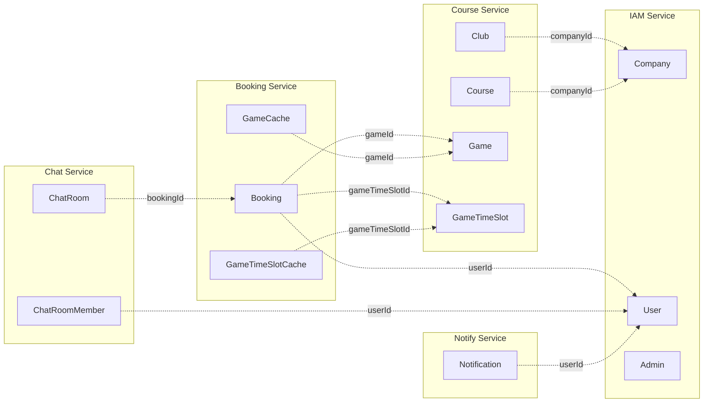
```mermaid
flowchart LR
    subgraph iam["IAM Service"]
        Company
        User
        Admin
    end

    subgraph course["Course Service"]
        Club
        Course
        Game
        GameTimeSlot
    end

    subgraph booking["Booking Service"]
        Booking
        GameCache
        SlotCache["GameTimeSlotCache"]
    end

    subgraph chat["Chat Service"]
        ChatRoom
        ChatRoomMember
    end

    subgraph notify["Notify Service"]
        Notification
    end

    Club -.->|companyId| Company
    Course -.->|companyId| Company
    Booking -.->|userId| User
    Booking -.->|gameTimeSlotId| GameTimeSlot
    Booking -.->|gameId| Game
    GameCache -.->|gameId| Game
    SlotCache -.->|gameTimeSlotId| GameTimeSlot
    ChatRoom -.->|bookingId| Booking
    ChatRoomMember -.->|userId| User
    Notification -.->|userId| User
```

---

## 1. IAM Service (iam_db)

### 전체 구조

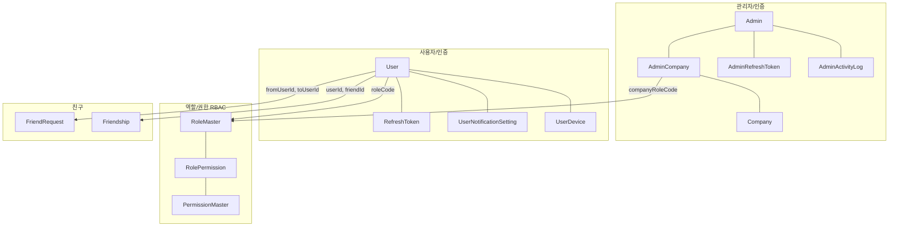
```mermaid
flowchart TB
    subgraph admin["관리자/인증"]
        A_Admin["Admin"]
        A_Company["Company"]
        A_AdminCompany["AdminCompany"]
        A_AdminRefreshToken["AdminRefreshToken"]
        A_AdminActivityLog["AdminActivityLog"]
        A_Admin --- A_AdminCompany --- A_Company
        A_Admin --- A_AdminRefreshToken
        A_Admin --- A_AdminActivityLog
    end

    subgraph user["사용자/인증"]
        U_User["User"]
        U_RefreshToken["RefreshToken"]
        U_NotifSetting["UserNotificationSetting"]
        U_Device["UserDevice"]
        U_User --- U_RefreshToken
        U_User --- U_NotifSetting
        U_User --- U_Device
    end

    subgraph rbac["역할/권한 RBAC"]
        R_Role["RoleMaster"]
        R_Permission["PermissionMaster"]
        R_RolePermission["RolePermission"]
        R_Role --- R_RolePermission --- R_Permission
    end

    subgraph friend["친구"]
        F_Request["FriendRequest"]
        F_Ship["Friendship"]
    end

    A_AdminCompany -->|companyRoleCode| R_Role
    U_User -->|roleCode| R_Role
    U_User -->|fromUserId, toUserId| F_Request
    U_User -->|userId, friendId| F_Ship
```

> **그룹 간 참조**: AdminCompany.companyRoleCode → RoleMaster.code | User.roleCode → RoleMaster.code

---

### 1-1. 관리자/인증

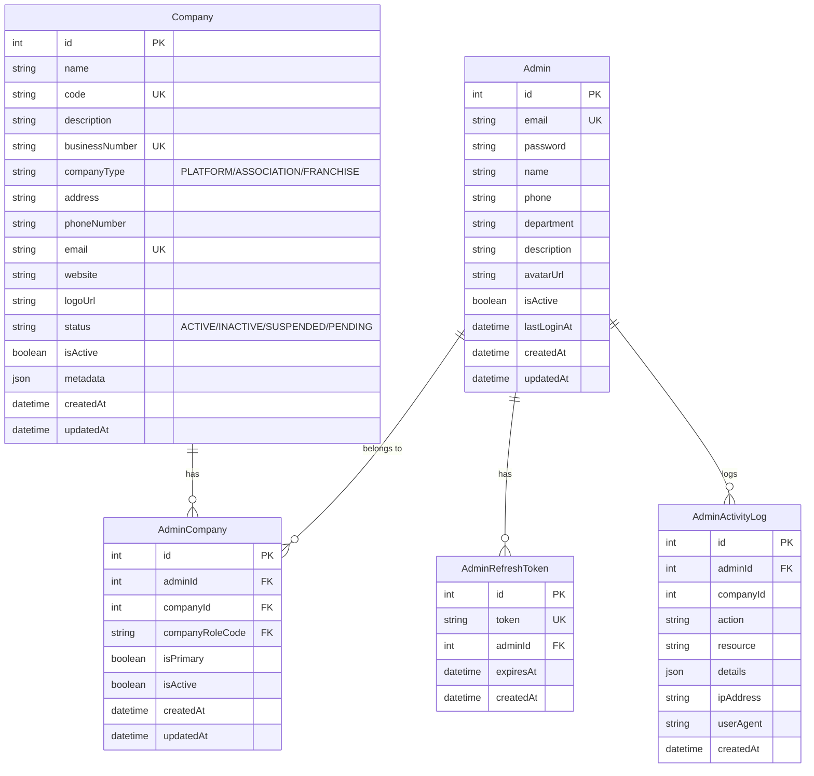
```mermaid
erDiagram
    Company ||--o{ AdminCompany : "has"
    Admin ||--o{ AdminCompany : "belongs to"
    Admin ||--o{ AdminRefreshToken : "has"
    Admin ||--o{ AdminActivityLog : "logs"

    Company {
        int id PK
        string name
        string code UK
        string description
        string businessNumber UK
        string companyType "PLATFORM/ASSOCIATION/FRANCHISE"
        string address
        string phoneNumber
        string email UK
        string website
        string logoUrl
        string status "ACTIVE/INACTIVE/SUSPENDED/PENDING"
        boolean isActive
        json metadata
        datetime createdAt
        datetime updatedAt
    }

    Admin {
        int id PK
        string email UK
        string password
        string name
        string phone
        string department
        string description
        string avatarUrl
        boolean isActive
        datetime lastLoginAt
        datetime createdAt
        datetime updatedAt
    }

    AdminCompany {
        int id PK
        int adminId FK
        int companyId FK
        string companyRoleCode FK
        boolean isPrimary
        boolean isActive
        datetime createdAt
        datetime updatedAt
    }

    AdminRefreshToken {
        int id PK
        string token UK
        int adminId FK
        datetime expiresAt
        datetime createdAt
    }

    AdminActivityLog {
        int id PK
        int adminId FK
        int companyId
        string action
        string resource
        json details
        string ipAddress
        string userAgent
        datetime createdAt
    }
```

---

### 1-2. 사용자/인증

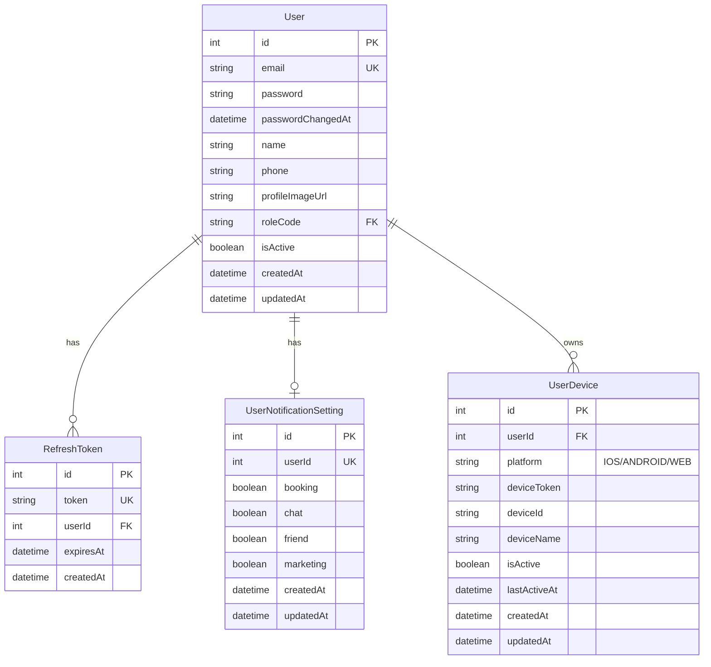
```mermaid
erDiagram
    User ||--o{ RefreshToken : "has"
    User ||--o| UserNotificationSetting : "has"
    User ||--o{ UserDevice : "owns"

    User {
        int id PK
        string email UK
        string password
        datetime passwordChangedAt
        string name
        string phone
        string profileImageUrl
        string roleCode FK
        boolean isActive
        datetime createdAt
        datetime updatedAt
    }

    RefreshToken {
        int id PK
        string token UK
        int userId FK
        datetime expiresAt
        datetime createdAt
    }

    UserNotificationSetting {
        int id PK
        int userId UK
        boolean booking
        boolean chat
        boolean friend
        boolean marketing
        datetime createdAt
        datetime updatedAt
    }

    UserDevice {
        int id PK
        int userId FK
        string platform "IOS/ANDROID/WEB"
        string deviceToken
        string deviceId
        string deviceName
        boolean isActive
        datetime lastActiveAt
        datetime createdAt
        datetime updatedAt
    }
```

---

### 1-3. 역할/권한 (RBAC)

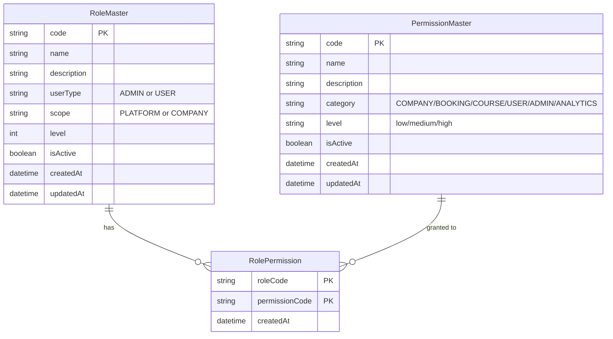
```mermaid
erDiagram
    RoleMaster ||--o{ RolePermission : "has"
    PermissionMaster ||--o{ RolePermission : "granted to"

    RoleMaster {
        string code PK
        string name
        string description
        string userType "ADMIN or USER"
        string scope "PLATFORM or COMPANY"
        int level
        boolean isActive
        datetime createdAt
        datetime updatedAt
    }

    PermissionMaster {
        string code PK
        string name
        string description
        string category "COMPANY/BOOKING/COURSE/USER/ADMIN/ANALYTICS"
        string level "low/medium/high"
        boolean isActive
        datetime createdAt
        datetime updatedAt
    }

    RolePermission {
        string roleCode PK
        string permissionCode PK
        datetime createdAt
    }
```

---

### 1-4. 친구

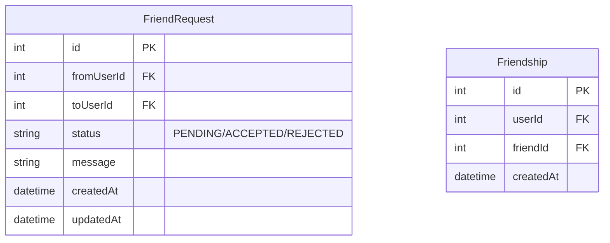
```mermaid
erDiagram
    FriendRequest {
        int id PK
        int fromUserId FK
        int toUserId FK
        string status "PENDING/ACCEPTED/REJECTED"
        string message
        datetime createdAt
        datetime updatedAt
    }

    Friendship {
        int id PK
        int userId FK
        int friendId FK
        datetime createdAt
    }
```

> **참조**: FriendRequest.fromUserId, toUserId → User.id | Friendship.userId, friendId → User.id

---

## 2. Course Service (course_db)

### 전체 구조

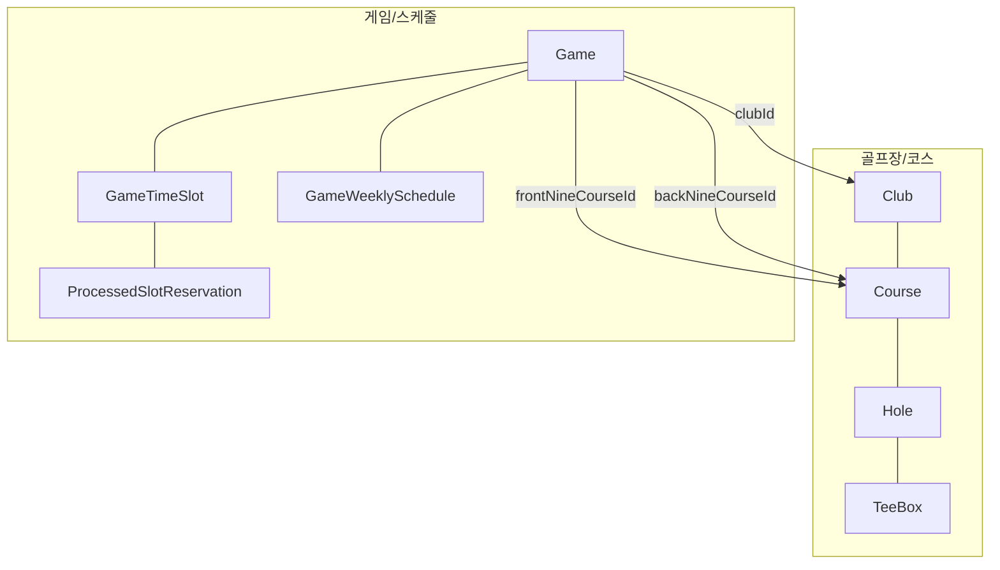
```mermaid
flowchart TB
    subgraph facility["골프장/코스"]
        C_Club["Club"]
        C_Course["Course"]
        C_Hole["Hole"]
        C_TeeBox["TeeBox"]
        C_Club --- C_Course --- C_Hole --- C_TeeBox
    end

    subgraph game["게임/스케줄"]
        G_Game["Game"]
        G_TimeSlot["GameTimeSlot"]
        G_Weekly["GameWeeklySchedule"]
        G_Processed["ProcessedSlotReservation"]
        G_Game --- G_TimeSlot
        G_Game --- G_Weekly
        G_TimeSlot --- G_Processed
    end

    G_Game -->|frontNineCourseId| C_Course
    G_Game -->|backNineCourseId| C_Course
    G_Game -->|clubId| C_Club
```

> **그룹 간 참조**: Game.frontNineCourseId, backNineCourseId → Course.id | Game.clubId → Club.id

---

### 2-1. 골프장/코스

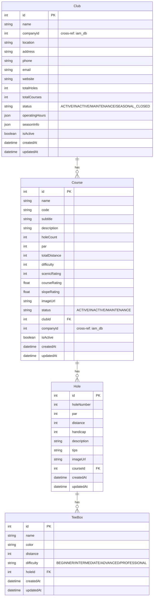
```mermaid
erDiagram
    Club ||--o{ Course : "has"
    Course ||--o{ Hole : "has"
    Hole ||--o{ TeeBox : "has"

    Club {
        int id PK
        string name
        int companyId "cross-ref: iam_db"
        string location
        string address
        string phone
        string email
        string website
        int totalHoles
        int totalCourses
        string status "ACTIVE/INACTIVE/MAINTENANCE/SEASONAL_CLOSED"
        json operatingHours
        json seasonInfo
        boolean isActive
        datetime createdAt
        datetime updatedAt
    }

    Course {
        int id PK
        string name
        string code
        string subtitle
        string description
        int holeCount
        int par
        int totalDistance
        int difficulty
        int scenicRating
        float courseRating
        float slopeRating
        string imageUrl
        string status "ACTIVE/INACTIVE/MAINTENANCE"
        int clubId FK
        int companyId "cross-ref: iam_db"
        boolean isActive
        datetime createdAt
        datetime updatedAt
    }

    Hole {
        int id PK
        int holeNumber
        int par
        int distance
        int handicap
        string description
        string tips
        string imageUrl
        int courseId FK
        datetime createdAt
        datetime updatedAt
    }

    TeeBox {
        int id PK
        string name
        string color
        int distance
        string difficulty "BEGINNER/INTERMEDIATE/ADVANCED/PROFESSIONAL"
        int holeId FK
        datetime createdAt
        datetime updatedAt
    }
```

---

### 2-2. 게임/스케줄

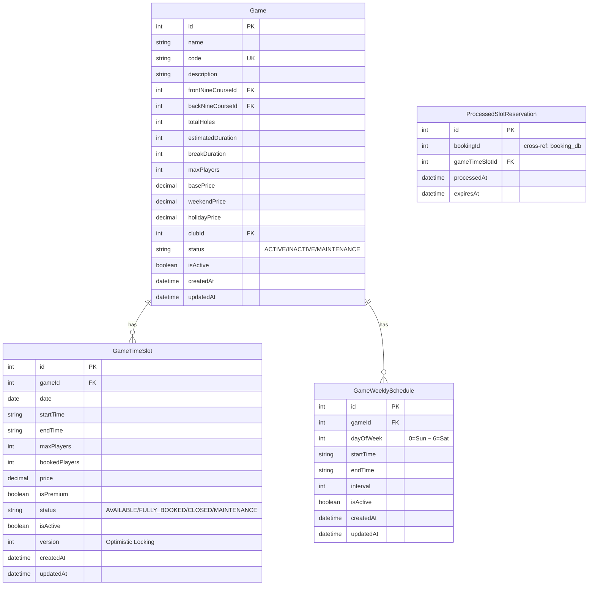
```mermaid
erDiagram
    Game ||--o{ GameTimeSlot : "has"
    Game ||--o{ GameWeeklySchedule : "has"

    Game {
        int id PK
        string name
        string code UK
        string description
        int frontNineCourseId FK
        int backNineCourseId FK
        int totalHoles
        int estimatedDuration
        int breakDuration
        int maxPlayers
        decimal basePrice
        decimal weekendPrice
        decimal holidayPrice
        int clubId FK
        string status "ACTIVE/INACTIVE/MAINTENANCE"
        boolean isActive
        datetime createdAt
        datetime updatedAt
    }

    GameTimeSlot {
        int id PK
        int gameId FK
        date date
        string startTime
        string endTime
        int maxPlayers
        int bookedPlayers
        decimal price
        boolean isPremium
        string status "AVAILABLE/FULLY_BOOKED/CLOSED/MAINTENANCE"
        boolean isActive
        int version "Optimistic Locking"
        datetime createdAt
        datetime updatedAt
    }

    GameWeeklySchedule {
        int id PK
        int gameId FK
        int dayOfWeek "0=Sun ~ 6=Sat"
        string startTime
        string endTime
        int interval
        boolean isActive
        datetime createdAt
        datetime updatedAt
    }

    ProcessedSlotReservation {
        int id PK
        int bookingId "cross-ref: booking_db"
        int gameTimeSlotId FK
        datetime processedAt
        datetime expiresAt
    }
```

---

## 3. Booking Service (booking_db)

### 전체 구조

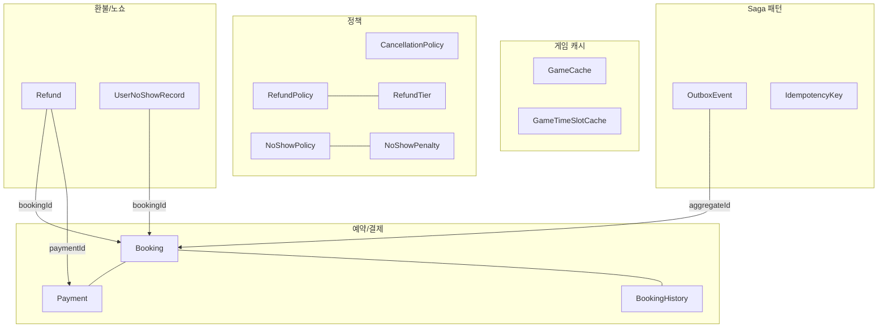
```mermaid
flowchart TB
    subgraph core["예약/결제"]
        B_Booking["Booking"]
        B_Payment["Payment"]
        B_History["BookingHistory"]
        B_Booking --- B_Payment
        B_Booking --- B_History
    end

    subgraph cache["게임 캐시"]
        BC_Game["GameCache"]
        BC_Slot["GameTimeSlotCache"]
    end

    subgraph refund["환불/노쇼"]
        R_Refund["Refund"]
        R_NoShow["UserNoShowRecord"]
    end

    subgraph policy["정책"]
        P_Cancel["CancellationPolicy"]
        P_Refund["RefundPolicy"]
        P_RefundTier["RefundTier"]
        P_NoShow["NoShowPolicy"]
        P_NoShowPenalty["NoShowPenalty"]
        P_Refund --- P_RefundTier
        P_NoShow --- P_NoShowPenalty
    end

    subgraph saga["Saga 패턴"]
        S_Outbox["OutboxEvent"]
        S_Idempotency["IdempotencyKey"]
    end

    R_Refund -->|bookingId| B_Booking
    R_Refund -->|paymentId| B_Payment
    R_NoShow -->|bookingId| B_Booking
    S_Outbox -->|aggregateId| B_Booking
```

> **그룹 간 참조**: Refund.bookingId → Booking.id | Refund.paymentId → Payment.id | UserNoShowRecord.bookingId → Booking.id

---

### 3-1. 예약/결제

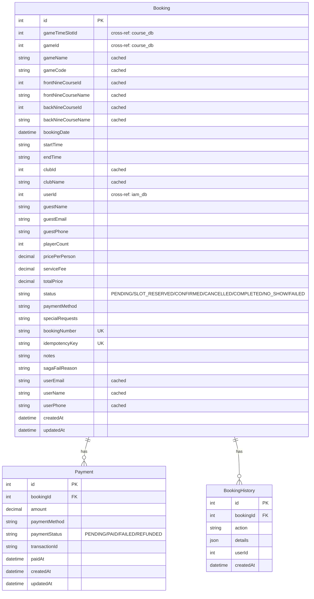
```mermaid
erDiagram
    Booking ||--o{ Payment : "has"
    Booking ||--o{ BookingHistory : "has"

    Booking {
        int id PK
        int gameTimeSlotId "cross-ref: course_db"
        int gameId "cross-ref: course_db"
        string gameName "cached"
        string gameCode "cached"
        int frontNineCourseId "cached"
        string frontNineCourseName "cached"
        int backNineCourseId "cached"
        string backNineCourseName "cached"
        datetime bookingDate
        string startTime
        string endTime
        int clubId "cached"
        string clubName "cached"
        int userId "cross-ref: iam_db"
        string guestName
        string guestEmail
        string guestPhone
        int playerCount
        decimal pricePerPerson
        decimal serviceFee
        decimal totalPrice
        string status "PENDING/SLOT_RESERVED/CONFIRMED/CANCELLED/COMPLETED/NO_SHOW/FAILED"
        string paymentMethod
        string specialRequests
        string bookingNumber UK
        string idempotencyKey UK
        string notes
        string sagaFailReason
        string userEmail "cached"
        string userName "cached"
        string userPhone "cached"
        datetime createdAt
        datetime updatedAt
    }

    Payment {
        int id PK
        int bookingId FK
        decimal amount
        string paymentMethod
        string paymentStatus "PENDING/PAID/FAILED/REFUNDED"
        string transactionId
        datetime paidAt
        datetime createdAt
        datetime updatedAt
    }

    BookingHistory {
        int id PK
        int bookingId FK
        string action
        json details
        int userId
        datetime createdAt
    }
```

---

### 3-2. 게임 캐시

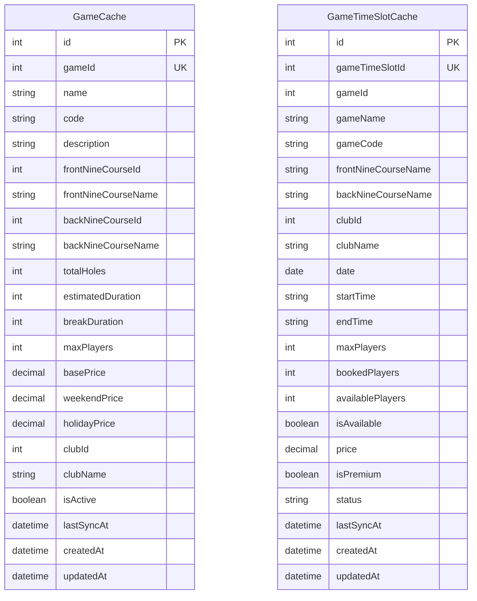
```mermaid
erDiagram
    GameCache {
        int id PK
        int gameId UK
        string name
        string code
        string description
        int frontNineCourseId
        string frontNineCourseName
        int backNineCourseId
        string backNineCourseName
        int totalHoles
        int estimatedDuration
        int breakDuration
        int maxPlayers
        decimal basePrice
        decimal weekendPrice
        decimal holidayPrice
        int clubId
        string clubName
        boolean isActive
        datetime lastSyncAt
        datetime createdAt
        datetime updatedAt
    }

    GameTimeSlotCache {
        int id PK
        int gameTimeSlotId UK
        int gameId
        string gameName
        string gameCode
        string frontNineCourseName
        string backNineCourseName
        int clubId
        string clubName
        date date
        string startTime
        string endTime
        int maxPlayers
        int bookedPlayers
        int availablePlayers
        boolean isAvailable
        decimal price
        boolean isPremium
        string status
        datetime lastSyncAt
        datetime createdAt
        datetime updatedAt
    }
```

---

### 3-3. 환불/노쇼

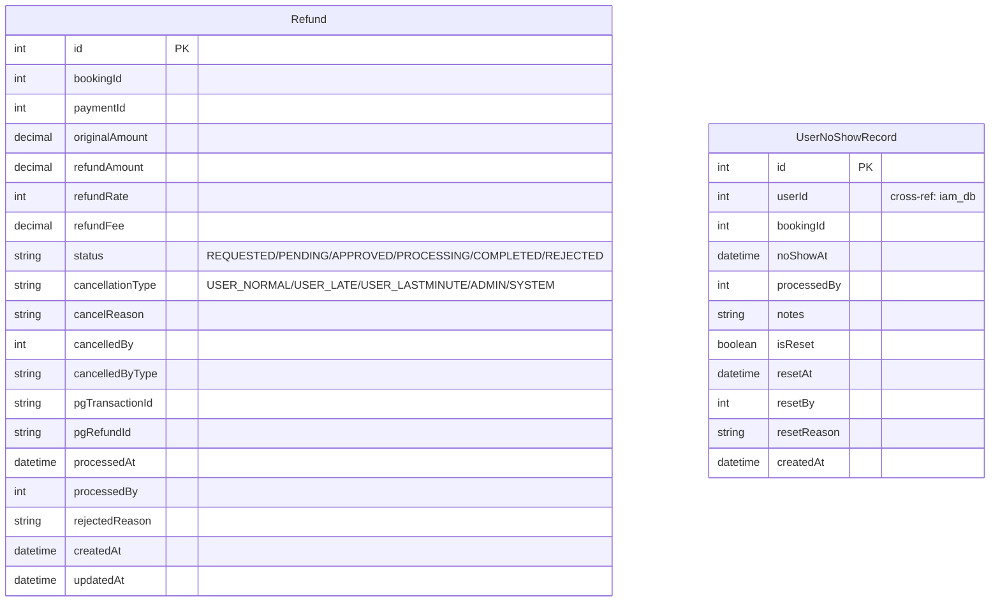
```mermaid
erDiagram
    Refund {
        int id PK
        int bookingId
        int paymentId
        decimal originalAmount
        decimal refundAmount
        int refundRate
        decimal refundFee
        string status "REQUESTED/PENDING/APPROVED/PROCESSING/COMPLETED/REJECTED"
        string cancellationType "USER_NORMAL/USER_LATE/USER_LASTMINUTE/ADMIN/SYSTEM"
        string cancelReason
        int cancelledBy
        string cancelledByType
        string pgTransactionId
        string pgRefundId
        datetime processedAt
        int processedBy
        string rejectedReason
        datetime createdAt
        datetime updatedAt
    }

    UserNoShowRecord {
        int id PK
        int userId "cross-ref: iam_db"
        int bookingId
        datetime noShowAt
        int processedBy
        string notes
        boolean isReset
        datetime resetAt
        int resetBy
        string resetReason
        datetime createdAt
    }
```

---

### 3-4. 정책

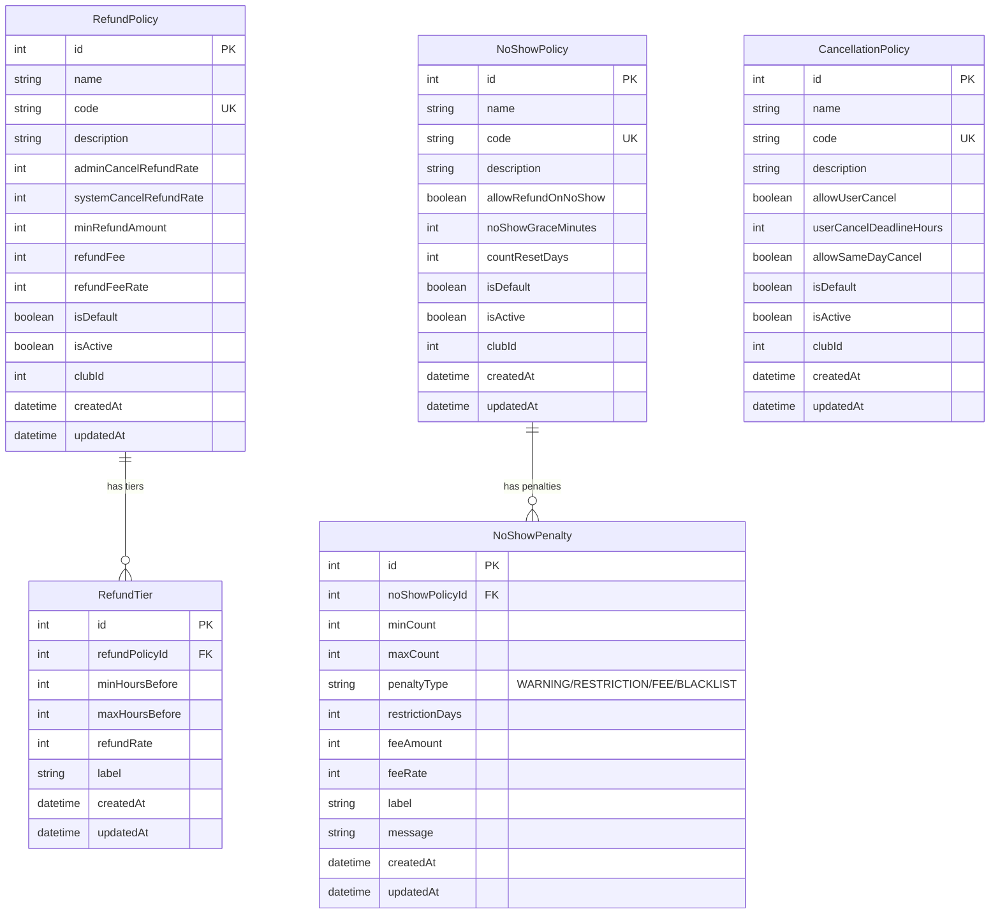
```mermaid
erDiagram
    RefundPolicy ||--o{ RefundTier : "has tiers"
    NoShowPolicy ||--o{ NoShowPenalty : "has penalties"

    CancellationPolicy {
        int id PK
        string name
        string code UK
        string description
        boolean allowUserCancel
        int userCancelDeadlineHours
        boolean allowSameDayCancel
        boolean isDefault
        boolean isActive
        int clubId
        datetime createdAt
        datetime updatedAt
    }

    RefundPolicy {
        int id PK
        string name
        string code UK
        string description
        int adminCancelRefundRate
        int systemCancelRefundRate
        int minRefundAmount
        int refundFee
        int refundFeeRate
        boolean isDefault
        boolean isActive
        int clubId
        datetime createdAt
        datetime updatedAt
    }

    RefundTier {
        int id PK
        int refundPolicyId FK
        int minHoursBefore
        int maxHoursBefore
        int refundRate
        string label
        datetime createdAt
        datetime updatedAt
    }

    NoShowPolicy {
        int id PK
        string name
        string code UK
        string description
        boolean allowRefundOnNoShow
        int noShowGraceMinutes
        int countResetDays
        boolean isDefault
        boolean isActive
        int clubId
        datetime createdAt
        datetime updatedAt
    }

    NoShowPenalty {
        int id PK
        int noShowPolicyId FK
        int minCount
        int maxCount
        string penaltyType "WARNING/RESTRICTION/FEE/BLACKLIST"
        int restrictionDays
        int feeAmount
        int feeRate
        string label
        string message
        datetime createdAt
        datetime updatedAt
    }
```

---

### 3-5. Saga 패턴

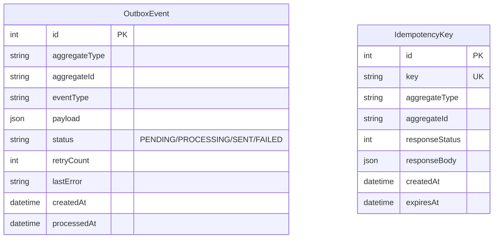
```mermaid
erDiagram
    OutboxEvent {
        int id PK
        string aggregateType
        string aggregateId
        string eventType
        json payload
        string status "PENDING/PROCESSING/SENT/FAILED"
        int retryCount
        string lastError
        datetime createdAt
        datetime processedAt
    }

    IdempotencyKey {
        int id PK
        string key UK
        string aggregateType
        string aggregateId
        int responseStatus
        json responseBody
        datetime createdAt
        datetime expiresAt
    }
```

---

## 4. Chat Service (chat_db)

### 전체 구조

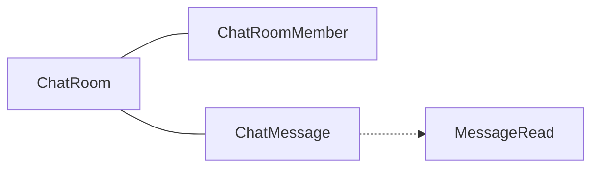
```mermaid
flowchart LR
    ChatRoom --- ChatRoomMember
    ChatRoom --- ChatMessage
    ChatMessage -.-> MessageRead
```

### 상세

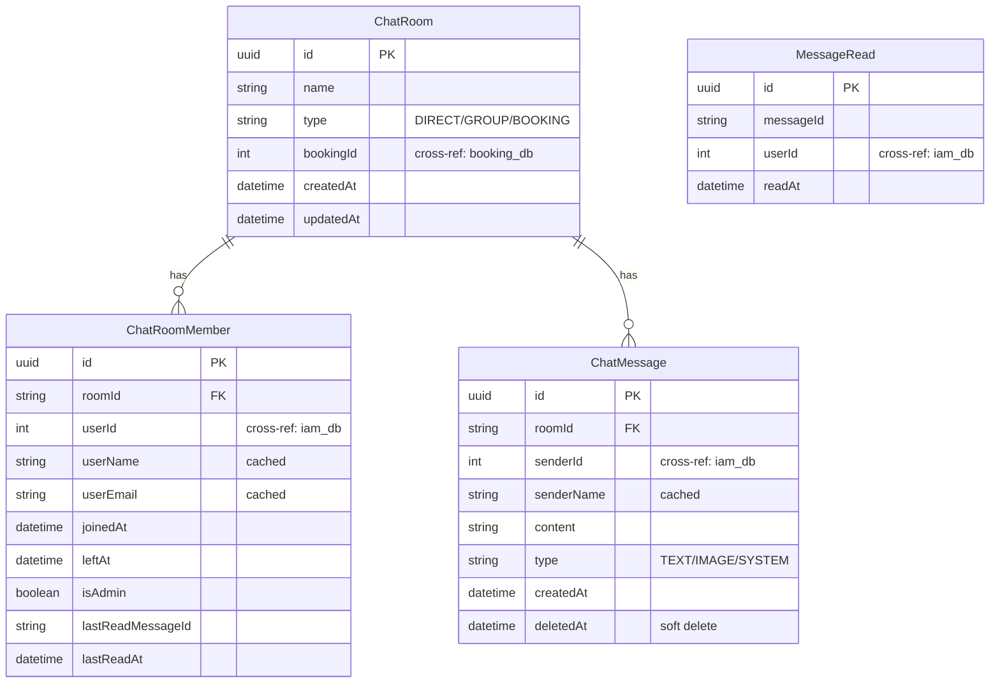
```mermaid
erDiagram
    ChatRoom ||--o{ ChatRoomMember : "has"
    ChatRoom ||--o{ ChatMessage : "has"

    ChatRoom {
        uuid id PK
        string name
        string type "DIRECT/GROUP/BOOKING"
        int bookingId "cross-ref: booking_db"
        datetime createdAt
        datetime updatedAt
    }

    ChatRoomMember {
        uuid id PK
        string roomId FK
        int userId "cross-ref: iam_db"
        string userName "cached"
        string userEmail "cached"
        datetime joinedAt
        datetime leftAt
        boolean isAdmin
        string lastReadMessageId
        datetime lastReadAt
    }

    ChatMessage {
        uuid id PK
        string roomId FK
        int senderId "cross-ref: iam_db"
        string senderName "cached"
        string content
        string type "TEXT/IMAGE/SYSTEM"
        datetime createdAt
        datetime deletedAt "soft delete"
    }

    MessageRead {
        uuid id PK
        string messageId
        int userId "cross-ref: iam_db"
        datetime readAt
    }
```

---

## 5. Notification Service (notify_db)

### 전체 구조

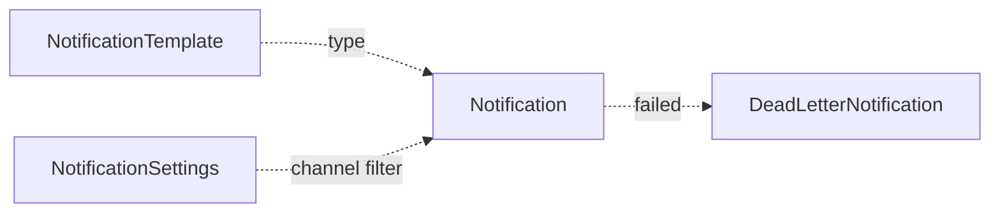
```mermaid
flowchart LR
    Notification -.->|"failed"| DeadLetterNotification
    NotificationTemplate -.->|"type"| Notification
    NotificationSettings -.->|"channel filter"| Notification
```

### 상세

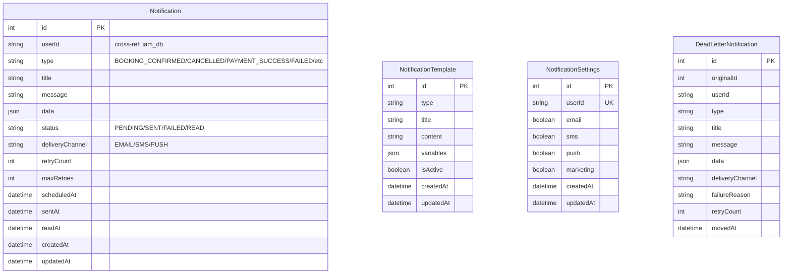
```mermaid
erDiagram
    Notification {
        int id PK
        string userId "cross-ref: iam_db"
        string type "BOOKING_CONFIRMED/CANCELLED/PAYMENT_SUCCESS/FAILED/etc"
        string title
        string message
        json data
        string status "PENDING/SENT/FAILED/READ"
        string deliveryChannel "EMAIL/SMS/PUSH"
        int retryCount
        int maxRetries
        datetime scheduledAt
        datetime sentAt
        datetime readAt
        datetime createdAt
        datetime updatedAt
    }

    NotificationTemplate {
        int id PK
        string type
        string title
        string content
        json variables
        boolean isActive
        datetime createdAt
        datetime updatedAt
    }

    NotificationSettings {
        int id PK
        string userId UK
        boolean email
        boolean sms
        boolean push
        boolean marketing
        datetime createdAt
        datetime updatedAt
    }

    DeadLetterNotification {
        int id PK
        int originalId
        string userId
        string type
        string title
        string message
        json data
        string deliveryChannel
        string failureReason
        int retryCount
        datetime movedAt
    }
```

---

## Enum 정의 참조

### IAM Service

| Enum | 값 | 설명 |
|------|----|------|
| CompanyType | `PLATFORM`, `ASSOCIATION`, `FRANCHISE` | 회사 유형 |
| CompanyStatus | `ACTIVE`, `INACTIVE`, `SUSPENDED`, `PENDING` | 회사 상태 |
| FriendRequestStatus | `PENDING`, `ACCEPTED`, `REJECTED` | 친구 요청 상태 |
| DevicePlatform | `IOS`, `ANDROID`, `WEB` | 디바이스 플랫폼 |

### Course Service

| Enum | 값 | 설명 |
|------|----|------|
| ClubStatus | `ACTIVE`, `INACTIVE`, `MAINTENANCE`, `SEASONAL_CLOSED` | 골프장 상태 |
| CourseStatus | `ACTIVE`, `INACTIVE`, `MAINTENANCE` | 코스 상태 |
| GameStatus | `ACTIVE`, `INACTIVE`, `MAINTENANCE` | 게임 상태 |
| TimeSlotStatus | `AVAILABLE`, `FULLY_BOOKED`, `CLOSED`, `MAINTENANCE` | 타임슬롯 상태 |
| TeeBoxLevel | `BEGINNER`, `INTERMEDIATE`, `ADVANCED`, `PROFESSIONAL` | 티박스 난이도 |

### Booking Service

| Enum | 값 | 설명 |
|------|----|------|
| BookingStatus | `PENDING`, `SLOT_RESERVED`, `CONFIRMED`, `CANCELLED`, `COMPLETED`, `NO_SHOW`, `FAILED` | 예약 상태 (Saga) |
| PaymentStatus | `PENDING`, `PAID`, `FAILED`, `REFUNDED` | 결제 상태 |
| OutboxStatus | `PENDING`, `PROCESSING`, `SENT`, `FAILED` | Outbox 이벤트 상태 |
| RefundStatus | `REQUESTED`, `PENDING`, `APPROVED`, `PROCESSING`, `COMPLETED`, `REJECTED` | 환불 상태 |
| CancellationType | `USER_NORMAL`, `USER_LATE`, `USER_LASTMINUTE`, `ADMIN`, `SYSTEM` | 취소 유형 |
| NoShowPenaltyType | `WARNING`, `RESTRICTION`, `FEE`, `BLACKLIST` | 노쇼 페널티 |

### Chat Service

| Enum | 값 | 설명 |
|------|----|------|
| RoomType | `DIRECT`, `GROUP`, `BOOKING` | 채팅방 유형 |
| MessageType | `TEXT`, `IMAGE`, `SYSTEM` | 메시지 유형 |

### Notification Service

| Enum | 값 | 설명 |
|------|----|------|
| NotificationType | `BOOKING_CONFIRMED`, `BOOKING_CANCELLED`, `PAYMENT_SUCCESS`, `PAYMENT_FAILED`, `FRIEND_REQUEST`, `FRIEND_ACCEPTED`, `CHAT_MESSAGE`, `SYSTEM_ALERT` | 알림 유형 |
| NotificationStatus | `PENDING`, `SENT`, `FAILED`, `READ` | 알림 상태 |
