# 크로스 서비스 데이터 플로우 (Cross-Service Data Flow)

> 버전: 1.0
> 최종 수정: 2026-02-02

## 목차

1. [개요](#1-개요)
2. [데이터 플로우 아키텍처](#2-데이터-플로우-아키텍처)
3. [인증 플로우](#3-인증-플로우)
4. [예약 데이터 플로우](#4-예약-데이터-플로우)
5. [채팅 데이터 플로우](#5-채팅-데이터-플로우)
6. [알림 데이터 플로우](#6-알림-데이터-플로우)
7. [친구 관계 데이터 플로우](#7-친구-관계-데이터-플로우)
8. [관리자 데이터 플로우](#8-관리자-데이터-플로우)
9. [데이터베이스 간 관계](#9-데이터베이스-간-관계)
10. [NATS 메시지 패턴 종합](#10-nats-메시지-패턴-종합)

---

## 1. 개요

본 문서는 Park Golf Platform의 마이크로서비스 간 데이터 흐름을 시각화합니다. 모든 서비스 간 통신은 NATS 메시지 브로커를 통해 이루어지며, 동기(Request-Reply)와 비동기(Event) 패턴을 사용합니다.

### 1.1 통신 패턴 요약

| 패턴 | 용도 | 표현 |
|------|------|------|
| **Request-Reply** | 클라이언트 요청에 대한 즉시 응답 | 실선 화살표 |
| **Event (Pub/Sub)** | 서비스 간 이벤트 전파 | 점선 화살표 |
| **WebSocket** | 실시간 양방향 통신 | 이중 화살표 |

### 1.2 관련 문서

- [시스템 아키텍처](./ARCHITECTURE.md) — 전체 시스템 구조
- [예약 워크플로우](./BOOKING-WORKFLOW.md) — Saga 패턴 상세
- [채팅 워크플로우](./CHAT_WORKFLOW.md) — Socket.IO 이벤트 상세
- [알림 워크플로우](./NOTIFICATION-WORKFLOW.md) — 다채널 알림 상세
- [보안 워크플로우](./SECURITY_WORKFLOW.md) — 인증/인가 상세

---

## 2. 데이터 플로우 아키텍처

### 2.1 마스터 다이어그램

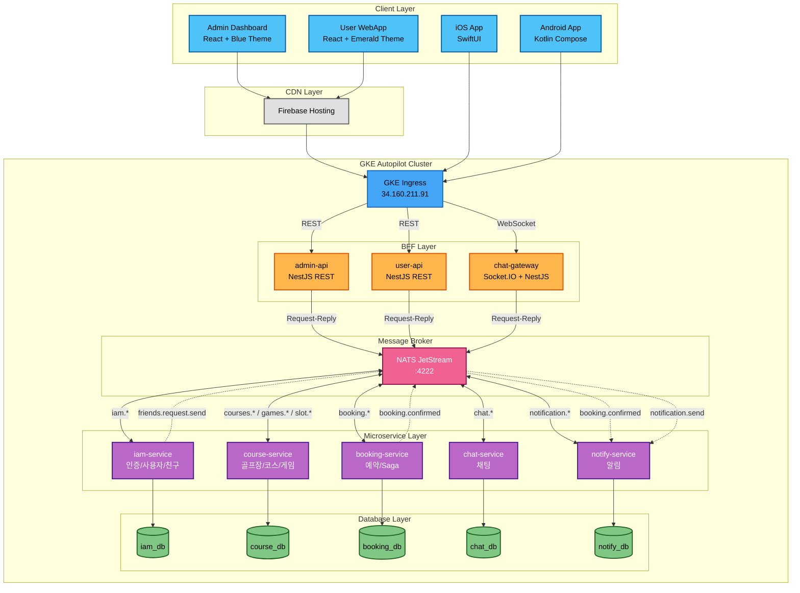
```mermaid
graph TB
    subgraph "Client Layer"
        AD[Admin Dashboard<br/>React + Blue Theme]
        UW[User WebApp<br/>React + Emerald Theme]
        IOS[iOS App<br/>SwiftUI]
        AND[Android App<br/>Kotlin Compose]
    end

    subgraph "CDN Layer"
        FH[Firebase Hosting]
    end

    subgraph "GKE Autopilot Cluster"
        ING[GKE Ingress<br/>34.160.211.91]

        subgraph "BFF Layer"
            AAPI[admin-api<br/>NestJS REST]
            UAPI[user-api<br/>NestJS REST]
            CHATGW[chat-gateway<br/>Socket.IO + NestJS]
        end

        subgraph "Message Broker"
            NATS[NATS JetStream<br/>:4222]
        end

        subgraph "Microservice Layer"
            IAM[iam-service<br/>인증/사용자/친구]
            COURSE[course-service<br/>골프장/코스/게임]
            BOOK[booking-service<br/>예약/Saga]
            CHAT[chat-service<br/>채팅]
            NOTIFY[notify-service<br/>알림]
        end

        subgraph "Database Layer"
            IAM_DB[(iam_db)]
            COURSE_DB[(course_db)]
            BOOK_DB[(booking_db)]
            CHAT_DB[(chat_db)]
            NOTIFY_DB[(notify_db)]
        end
    end

    %% Client → CDN → Ingress
    AD --> FH
    UW --> FH
    FH --> ING
    IOS --> ING
    AND --> ING

    %% Ingress → BFF (REST)
    ING -->|REST| AAPI
    ING -->|REST| UAPI
    ING -->|WebSocket| CHATGW

    %% BFF → NATS (동기 Request-Reply)
    AAPI -->|Request-Reply| NATS
    UAPI -->|Request-Reply| NATS
    CHATGW -->|Request-Reply| NATS

    %% NATS → Microservices
    NATS <-->|iam.*| IAM
    NATS <-->|courses.* / games.* / slot.*| COURSE
    NATS <-->|booking.*| BOOK
    NATS <-->|chat.*| CHAT
    NATS <-->|notification.*| NOTIFY

    %% Microservices → DB
    IAM --> IAM_DB
    COURSE --> COURSE_DB
    BOOK --> BOOK_DB
    CHAT --> CHAT_DB
    NOTIFY --> NOTIFY_DB

    %% 크로스 서비스 이벤트 (비동기)
    BOOK -.->|booking.confirmed| NATS
    NATS -.->|booking.confirmed| NOTIFY
    IAM -.->|friends.request.send| NATS
    NATS -.->|notification.send| NOTIFY

    classDef frontend fill:#4fc3f7,stroke:#01579b,stroke-width:2px,color:#000
    classDef bff fill:#ffb74d,stroke:#e65100,stroke-width:2px,color:#000
    classDef service fill:#ba68c8,stroke:#4a148c,stroke-width:2px,color:#fff
    classDef data fill:#81c784,stroke:#1b5e20,stroke-width:2px,color:#000
    classDef message fill:#f06292,stroke:#880e4f,stroke-width:2px,color:#fff
    classDef ingress fill:#42a5f5,stroke:#1565c0,stroke-width:2px,color:#000
    classDef cdn fill:#e0e0e0,stroke:#616161,stroke-width:2px,color:#000

    class AD,UW,IOS,AND frontend
    class AAPI,UAPI,CHATGW bff
    class IAM,COURSE,BOOK,CHAT,NOTIFY service
    class IAM_DB,COURSE_DB,BOOK_DB,CHAT_DB,NOTIFY_DB data
    class NATS message
    class ING ingress
    class FH cdn
```

### 2.2 통신 경로 요약

| 경로 | 프로토콜 | 용도 |
|------|----------|------|
| Client → Ingress | HTTPS / WSS | REST API 호출, WebSocket 연결 |
| Ingress → BFF | HTTP | 내부 라우팅 |
| BFF → NATS → Service | NATS Request-Reply | 동기 요청/응답 |
| Service → NATS → Service | NATS Event | 비동기 이벤트 전파 |
| Service → PostgreSQL | TCP | 데이터 영속화 |
| chat-gateway ↔ Client | Socket.IO (WSS) | 실시간 메시징 |

---

## 3. 인증 플로우

### 3.1 로그인 플로우

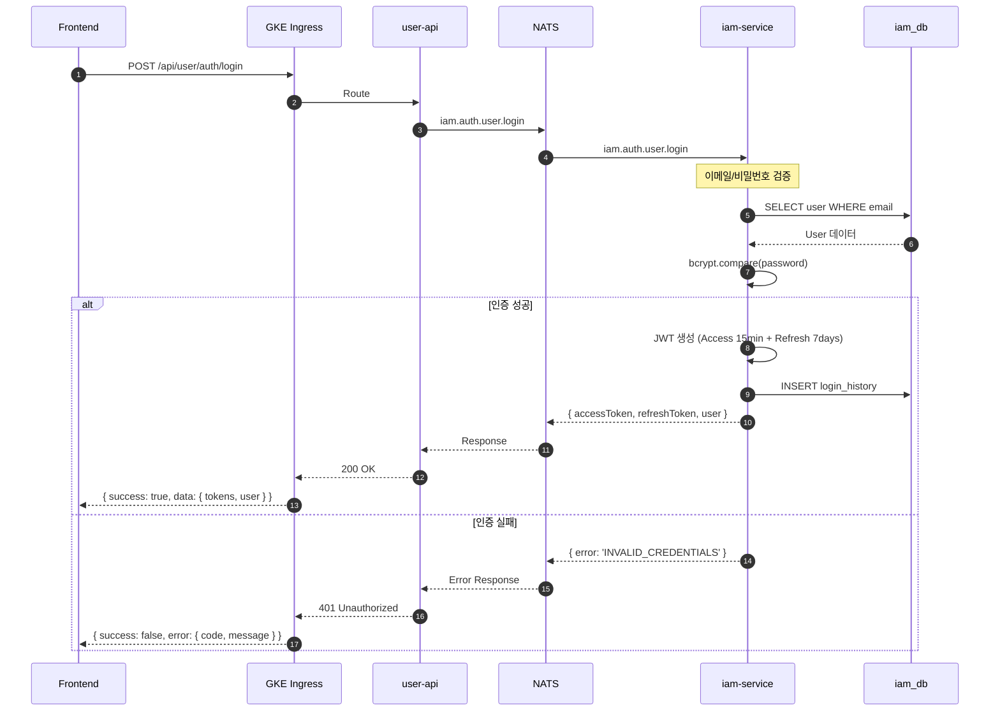
```mermaid
sequenceDiagram
    autonumber
    participant Client as Frontend
    participant ING as GKE Ingress
    participant UAPI as user-api
    participant NATS as NATS
    participant IAM as iam-service
    participant DB as iam_db

    Client->>ING: POST /api/user/auth/login
    ING->>UAPI: Route
    UAPI->>NATS: iam.auth.user.login
    NATS->>IAM: iam.auth.user.login

    Note over IAM: 이메일/비밀번호 검증

    IAM->>DB: SELECT user WHERE email
    DB-->>IAM: User 데이터

    IAM->>IAM: bcrypt.compare(password)

    alt 인증 성공
        IAM->>IAM: JWT 생성 (Access 15min + Refresh 7days)
        IAM->>DB: INSERT login_history
        IAM-->>NATS: { accessToken, refreshToken, user }
        NATS-->>UAPI: Response
        UAPI-->>ING: 200 OK
        ING-->>Client: { success: true, data: { tokens, user } }
    else 인증 실패
        IAM-->>NATS: { error: 'INVALID_CREDENTIALS' }
        NATS-->>UAPI: Error Response
        UAPI-->>ING: 401 Unauthorized
        ING-->>Client: { success: false, error: { code, message } }
    end
```

### 3.2 토큰 갱신 플로우

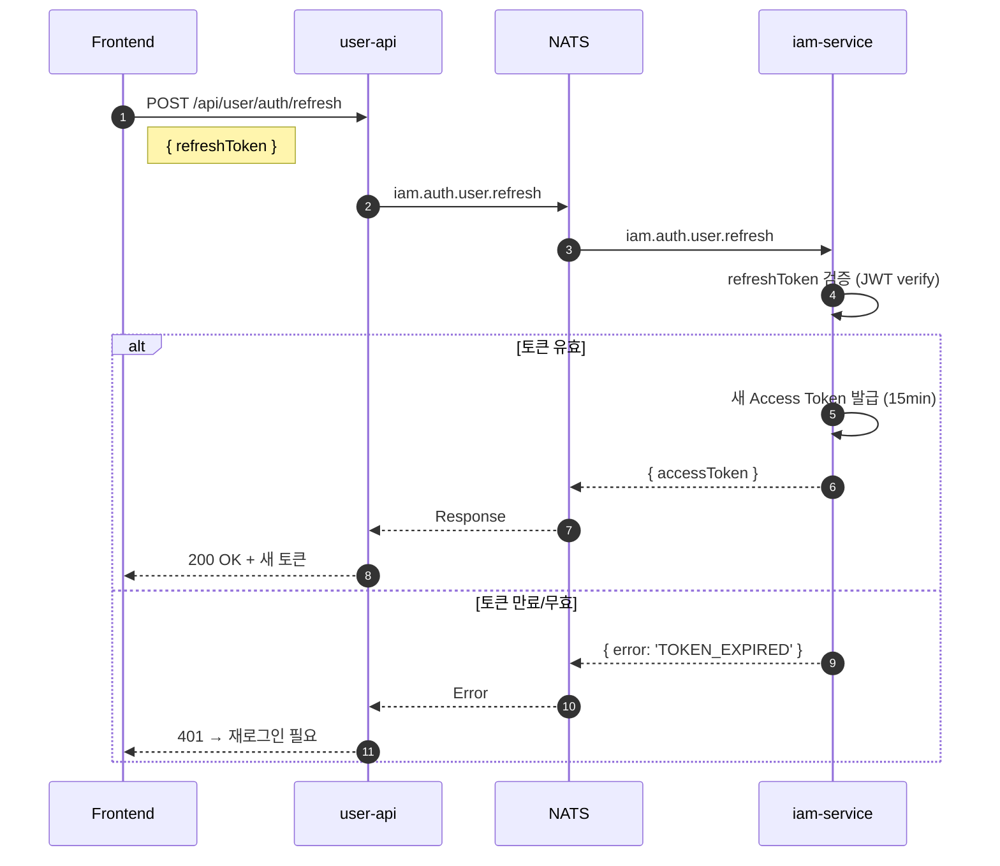
```mermaid
sequenceDiagram
    autonumber
    participant Client as Frontend
    participant UAPI as user-api
    participant NATS as NATS
    participant IAM as iam-service

    Client->>UAPI: POST /api/user/auth/refresh
    Note right of Client: { refreshToken }

    UAPI->>NATS: iam.auth.user.refresh
    NATS->>IAM: iam.auth.user.refresh

    IAM->>IAM: refreshToken 검증 (JWT verify)

    alt 토큰 유효
        IAM->>IAM: 새 Access Token 발급 (15min)
        IAM-->>NATS: { accessToken }
        NATS-->>UAPI: Response
        UAPI-->>Client: 200 OK + 새 토큰
    else 토큰 만료/무효
        IAM-->>NATS: { error: 'TOKEN_EXPIRED' }
        NATS-->>UAPI: Error
        UAPI-->>Client: 401 → 재로그인 필요
    end
```

### 3.3 WebSocket 인증 플로우

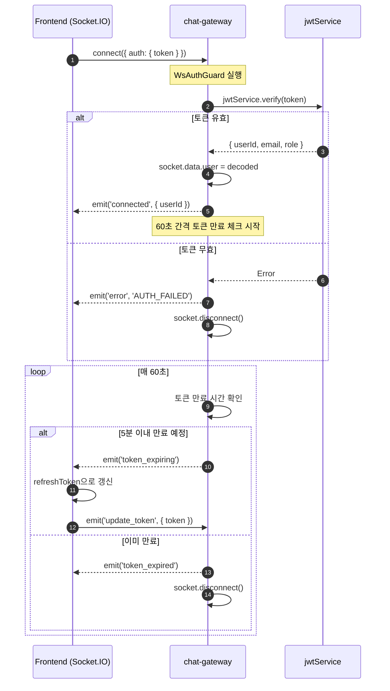
```mermaid
sequenceDiagram
    autonumber
    participant Client as Frontend (Socket.IO)
    participant CHATGW as chat-gateway
    participant JWT as jwtService

    Client->>CHATGW: connect({ auth: { token } })
    Note over CHATGW: WsAuthGuard 실행

    CHATGW->>JWT: jwtService.verify(token)

    alt 토큰 유효
        JWT-->>CHATGW: { userId, email, role }
        CHATGW->>CHATGW: socket.data.user = decoded
        CHATGW-->>Client: emit('connected', { userId })
        Note over CHATGW: 60초 간격 토큰 만료 체크 시작
    else 토큰 무효
        JWT-->>CHATGW: Error
        CHATGW-->>Client: emit('error', 'AUTH_FAILED')
        CHATGW->>CHATGW: socket.disconnect()
    end

    loop 매 60초
        CHATGW->>CHATGW: 토큰 만료 시간 확인
        alt 5분 이내 만료 예정
            CHATGW-->>Client: emit('token_expiring')
            Client->>Client: refreshToken으로 갱신
            Client->>CHATGW: emit('update_token', { token })
        else 이미 만료
            CHATGW-->>Client: emit('token_expired')
            CHATGW->>CHATGW: socket.disconnect()
        end
    end
```

### 3.4 API 요청 인증 (BFF → IAM)

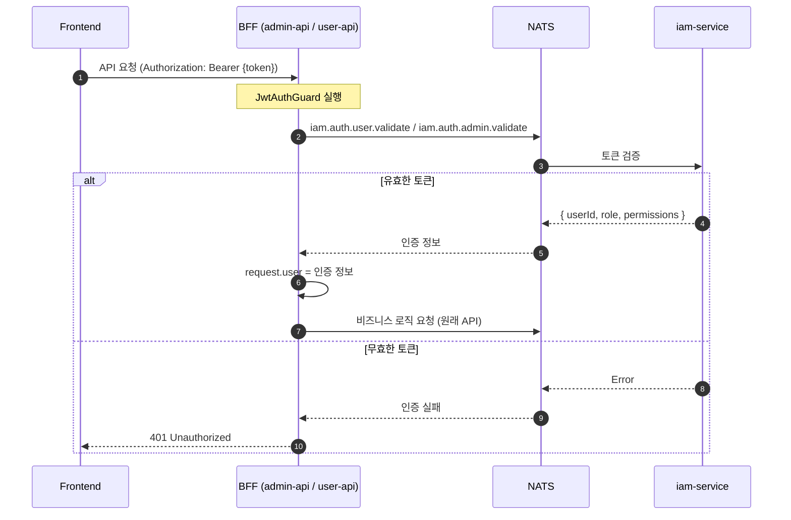
```mermaid
sequenceDiagram
    autonumber
    participant Client as Frontend
    participant BFF as BFF (admin-api / user-api)
    participant NATS as NATS
    participant IAM as iam-service

    Client->>BFF: API 요청 (Authorization: Bearer {token})

    Note over BFF: JwtAuthGuard 실행

    BFF->>NATS: iam.auth.user.validate / iam.auth.admin.validate
    NATS->>IAM: 토큰 검증

    alt 유효한 토큰
        IAM-->>NATS: { userId, role, permissions }
        NATS-->>BFF: 인증 정보
        BFF->>BFF: request.user = 인증 정보
        BFF->>NATS: 비즈니스 로직 요청 (원래 API)
    else 무효한 토큰
        IAM-->>NATS: Error
        NATS-->>BFF: 인증 실패
        BFF-->>Client: 401 Unauthorized
    end
```

---

## 4. 예약 데이터 플로우

> 상세 Saga 패턴은 [BOOKING-WORKFLOW.md](./BOOKING-WORKFLOW.md)를 참조하세요.

### 4.1 예약 생성 전체 흐름

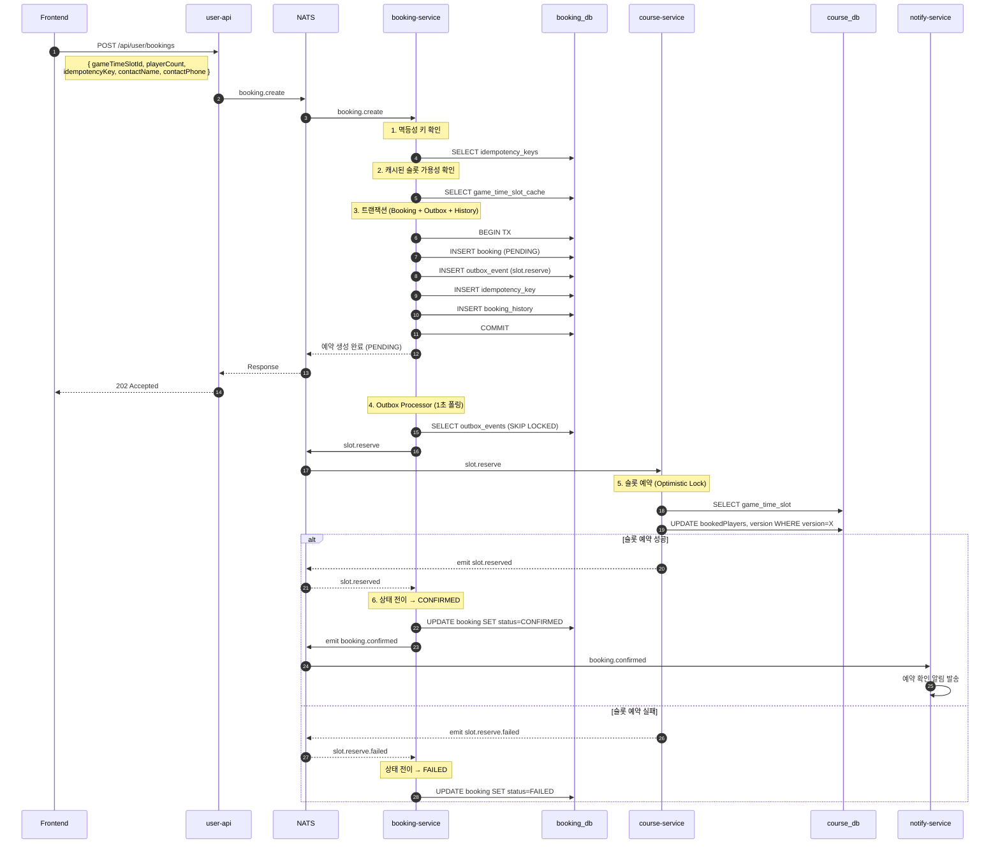
```mermaid
sequenceDiagram
    autonumber
    participant Client as Frontend
    participant UAPI as user-api
    participant NATS as NATS
    participant BOOK as booking-service
    participant BOOK_DB as booking_db
    participant COURSE as course-service
    participant COURSE_DB as course_db
    participant NOTIFY as notify-service

    Client->>UAPI: POST /api/user/bookings
    Note right of Client: { gameTimeSlotId, playerCount,<br/>idempotencyKey, contactName, contactPhone }

    UAPI->>NATS: booking.create
    NATS->>BOOK: booking.create

    Note over BOOK: 1. 멱등성 키 확인
    BOOK->>BOOK_DB: SELECT idempotency_keys

    Note over BOOK: 2. 캐시된 슬롯 가용성 확인
    BOOK->>BOOK_DB: SELECT game_time_slot_cache

    Note over BOOK: 3. 트랜잭션 (Booking + Outbox + History)
    BOOK->>BOOK_DB: BEGIN TX
    BOOK->>BOOK_DB: INSERT booking (PENDING)
    BOOK->>BOOK_DB: INSERT outbox_event (slot.reserve)
    BOOK->>BOOK_DB: INSERT idempotency_key
    BOOK->>BOOK_DB: INSERT booking_history
    BOOK->>BOOK_DB: COMMIT

    BOOK-->>NATS: 예약 생성 완료 (PENDING)
    NATS-->>UAPI: Response
    UAPI-->>Client: 202 Accepted

    Note over BOOK: 4. Outbox Processor (1초 폴링)
    BOOK->>BOOK_DB: SELECT outbox_events (SKIP LOCKED)
    BOOK->>NATS: slot.reserve
    NATS->>COURSE: slot.reserve

    Note over COURSE: 5. 슬롯 예약 (Optimistic Lock)
    COURSE->>COURSE_DB: SELECT game_time_slot
    COURSE->>COURSE_DB: UPDATE bookedPlayers, version WHERE version=X

    alt 슬롯 예약 성공
        COURSE-->>NATS: emit slot.reserved
        NATS-->>BOOK: slot.reserved

        Note over BOOK: 6. 상태 전이 → CONFIRMED
        BOOK->>BOOK_DB: UPDATE booking SET status=CONFIRMED
        BOOK->>NATS: emit booking.confirmed
        NATS->>NOTIFY: booking.confirmed
        NOTIFY->>NOTIFY: 예약 확인 알림 발송
    else 슬롯 예약 실패
        COURSE-->>NATS: emit slot.reserve.failed
        NATS-->>BOOK: slot.reserve.failed

        Note over BOOK: 상태 전이 → FAILED
        BOOK->>BOOK_DB: UPDATE booking SET status=FAILED
    end
```

### 4.2 예약 상태 전이

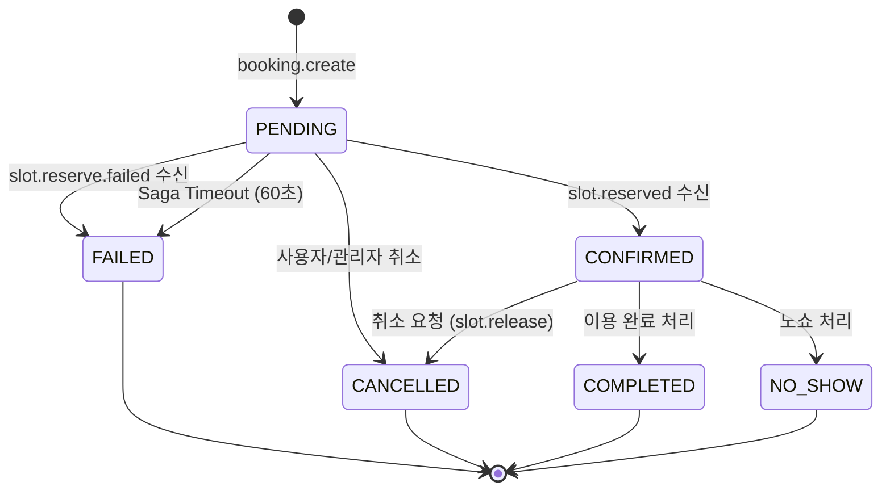
```mermaid
stateDiagram-v2
    [*] --> PENDING: booking.create

    PENDING --> CONFIRMED: slot.reserved 수신
    PENDING --> FAILED: slot.reserve.failed 수신
    PENDING --> FAILED: Saga Timeout (60초)
    PENDING --> CANCELLED: 사용자/관리자 취소

    CONFIRMED --> CANCELLED: 취소 요청 (slot.release)
    CONFIRMED --> COMPLETED: 이용 완료 처리
    CONFIRMED --> NO_SHOW: 노쇼 처리

    FAILED --> [*]
    CANCELLED --> [*]
    COMPLETED --> [*]
    NO_SHOW --> [*]
```

### 4.3 데이터 페이로드

**booking.create 요청:**
```json
{
  "userId": 1,
  "gameTimeSlotId": 100,
  "playerCount": 2,
  "contactName": "홍길동",
  "contactPhone": "010-1234-5678",
  "idempotencyKey": "uuid-v4"
}
```

**slot.reserve 이벤트 (Outbox → NATS):**
```json
{
  "bookingId": 15,
  "gameTimeSlotId": 100,
  "playerCount": 2,
  "idempotencyKey": "uuid-v4"
}
```

**slot.reserved 이벤트 (course-service → booking-service):**
```json
{
  "bookingId": 15,
  "gameTimeSlotId": 100,
  "success": true
}
```

**booking.confirmed 이벤트 (booking-service → notify-service):**
```json
{
  "bookingId": 15,
  "userId": 1,
  "bookingNumber": "BK-ABC123",
  "gameTimeSlotId": 100,
  "status": "CONFIRMED"
}
```

### 4.4 취소 플로우

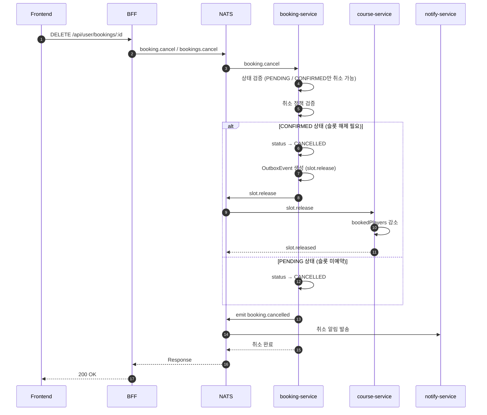
```mermaid
sequenceDiagram
    autonumber
    participant Client as Frontend
    participant BFF as BFF
    participant NATS as NATS
    participant BOOK as booking-service
    participant COURSE as course-service
    participant NOTIFY as notify-service

    Client->>BFF: DELETE /api/user/bookings/:id
    BFF->>NATS: booking.cancel / bookings.cancel
    NATS->>BOOK: booking.cancel

    BOOK->>BOOK: 상태 검증 (PENDING / CONFIRMED만 취소 가능)
    BOOK->>BOOK: 취소 정책 검증

    alt CONFIRMED 상태 (슬롯 해제 필요)
        BOOK->>BOOK: status → CANCELLED
        BOOK->>BOOK: OutboxEvent 생성 (slot.release)
        BOOK->>NATS: slot.release
        NATS->>COURSE: slot.release
        COURSE->>COURSE: bookedPlayers 감소
        COURSE-->>NATS: slot.released
    else PENDING 상태 (슬롯 미예약)
        BOOK->>BOOK: status → CANCELLED
    end

    BOOK->>NATS: emit booking.cancelled
    NATS->>NOTIFY: 취소 알림 발송

    BOOK-->>NATS: 취소 완료
    NATS-->>BFF: Response
    BFF-->>Client: 200 OK
```

---

## 5. 채팅 데이터 플로우

> 상세 Socket.IO 이벤트는 [CHAT_WORKFLOW.md](./CHAT_WORKFLOW.md)를 참조하세요.

### 5.1 WebSocket 메시지 전송 흐름

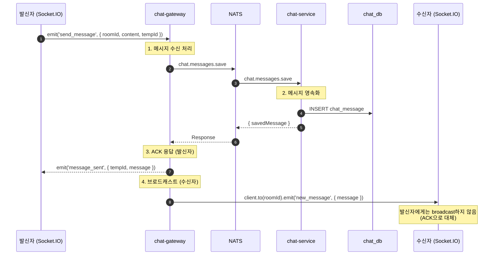
```mermaid
sequenceDiagram
    autonumber
    participant A as 발신자 (Socket.IO)
    participant GW as chat-gateway
    participant NATS as NATS
    participant CHAT as chat-service
    participant CHAT_DB as chat_db
    participant B as 수신자 (Socket.IO)

    A->>GW: emit('send_message', { roomId, content, tempId })

    Note over GW: 1. 메시지 수신 처리

    GW->>NATS: chat.messages.save
    NATS->>CHAT: chat.messages.save

    Note over CHAT: 2. 메시지 영속화
    CHAT->>CHAT_DB: INSERT chat_message
    CHAT-->>NATS: { savedMessage }
    NATS-->>GW: Response

    Note over GW: 3. ACK 응답 (발신자)
    GW-->>A: emit('message_sent', { tempId, message })

    Note over GW: 4. 브로드캐스트 (수신자)
    GW->>B: client.to(roomId).emit('new_message', { message })

    Note over B: 발신자에게는 broadcast하지 않음<br/>(ACK으로 대체)
```

### 5.2 REST Fallback 플로우

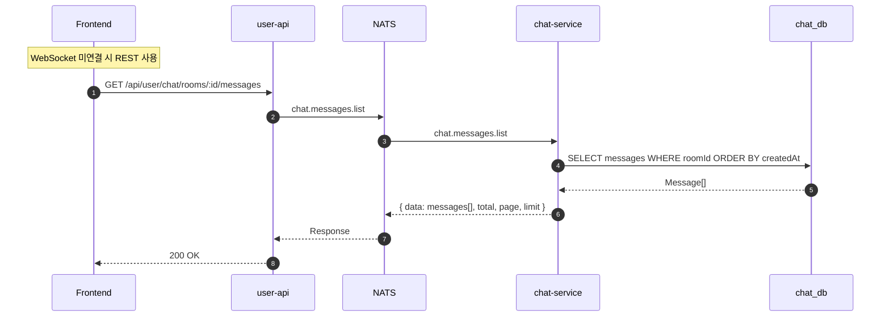
```mermaid
sequenceDiagram
    autonumber
    participant Client as Frontend
    participant UAPI as user-api
    participant NATS as NATS
    participant CHAT as chat-service
    participant CHAT_DB as chat_db

    Note over Client: WebSocket 미연결 시 REST 사용

    Client->>UAPI: GET /api/user/chat/rooms/:id/messages
    UAPI->>NATS: chat.messages.list
    NATS->>CHAT: chat.messages.list

    CHAT->>CHAT_DB: SELECT messages WHERE roomId ORDER BY createdAt
    CHAT_DB-->>CHAT: Message[]

    CHAT-->>NATS: { data: messages[], total, page, limit }
    NATS-->>UAPI: Response
    UAPI-->>Client: 200 OK
```

### 5.3 채팅방 생성 플로우

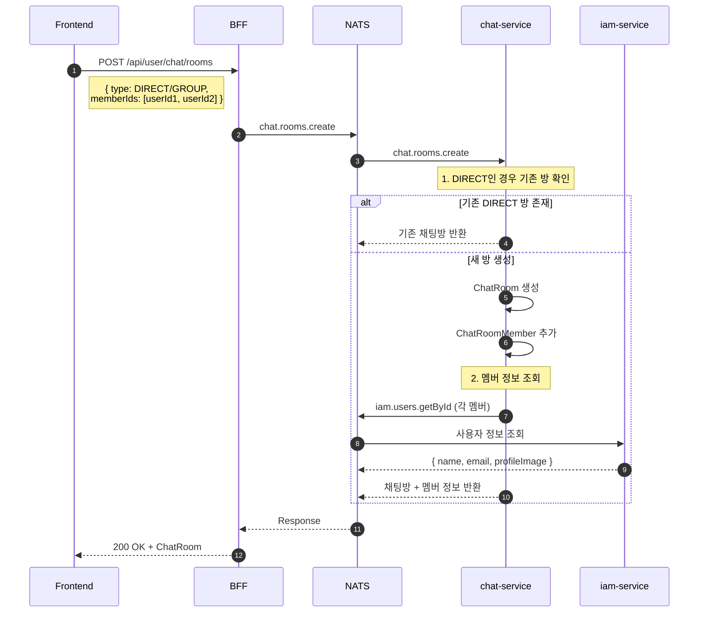
```mermaid
sequenceDiagram
    autonumber
    participant Client as Frontend
    participant BFF as BFF
    participant NATS as NATS
    participant CHAT as chat-service
    participant IAM as iam-service

    Client->>BFF: POST /api/user/chat/rooms
    Note right of Client: { type: DIRECT/GROUP,<br/>memberIds: [userId1, userId2] }

    BFF->>NATS: chat.rooms.create
    NATS->>CHAT: chat.rooms.create

    Note over CHAT: 1. DIRECT인 경우 기존 방 확인

    alt 기존 DIRECT 방 존재
        CHAT-->>NATS: 기존 채팅방 반환
    else 새 방 생성
        CHAT->>CHAT: ChatRoom 생성
        CHAT->>CHAT: ChatRoomMember 추가

        Note over CHAT: 2. 멤버 정보 조회
        CHAT->>NATS: iam.users.getById (각 멤버)
        NATS->>IAM: 사용자 정보 조회
        IAM-->>NATS: { name, email, profileImage }

        CHAT-->>NATS: 채팅방 + 멤버 정보 반환
    end

    NATS-->>BFF: Response
    BFF-->>Client: 200 OK + ChatRoom
```

### 5.4 실시간 이벤트 요약

| 이벤트 | 방향 | 데이터 |
|--------|------|--------|
| `join_room` | Client → Server | `{ roomId }` |
| `leave_room` | Client → Server | `{ roomId }` |
| `send_message` | Client → Server | `{ roomId, content, tempId }` |
| `send_dm` | Client → Server | `{ targetUserId, content, tempId }` |
| `typing` | Client → Server | `{ roomId, isTyping }` |
| `message_sent` | Server → Client (ACK) | `{ tempId, message }` |
| `new_message` | Server → Client (Broadcast) | `{ message }` |
| `user_joined` | Server → Room | `{ userId, roomId }` |
| `user_left` | Server → Room | `{ userId, roomId }` |
| `typing` | Server → Room | `{ userId, roomId, isTyping }` |
| `token_expiring` | Server → Client | `{}` |
| `token_expired` | Server → Client | `{}` |

---

## 6. 알림 데이터 플로우

> 상세 알림 시스템은 [NOTIFICATION-WORKFLOW.md](./NOTIFICATION-WORKFLOW.md)를 참조하세요.

### 6.1 알림 전체 흐름

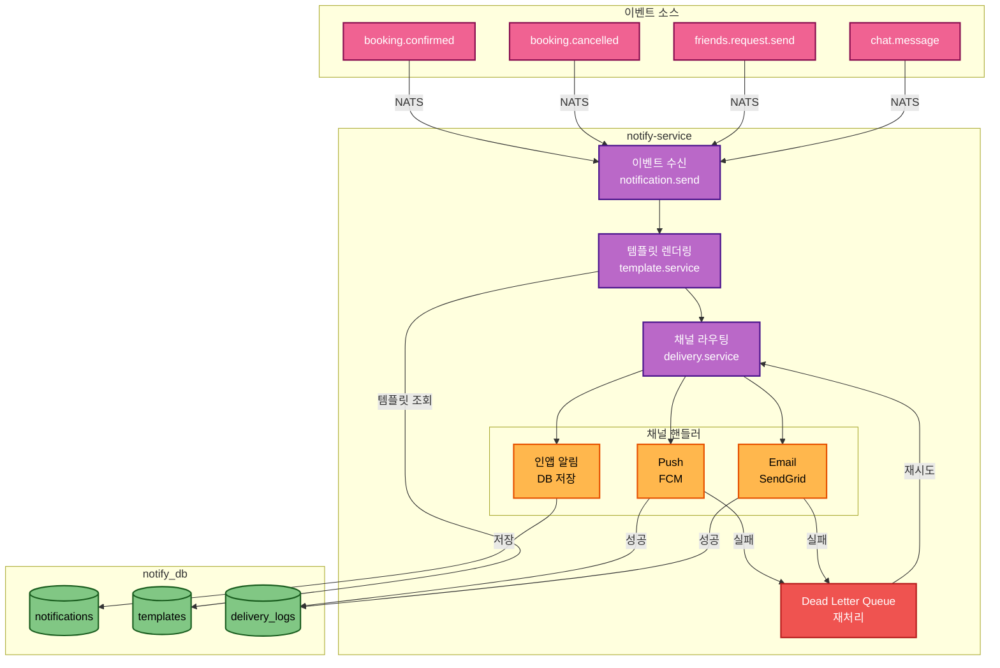
```mermaid
flowchart TB
    subgraph "이벤트 소스"
        E1[booking.confirmed]
        E2[booking.cancelled]
        E3[friends.request.send]
        E4[chat.message]
    end

    subgraph "notify-service"
        RECV[이벤트 수신<br/>notification.send]
        TMPL[템플릿 렌더링<br/>template.service]
        ROUTE[채널 라우팅<br/>delivery.service]

        subgraph "채널 핸들러"
            PUSH[Push<br/>FCM]
            EMAIL[Email<br/>SendGrid]
            INAPP[인앱 알림<br/>DB 저장]
        end

        DLQ[Dead Letter Queue<br/>재처리]
    end

    subgraph "notify_db"
        NOTI_DB[(notifications)]
        TMPL_DB[(templates)]
        LOG_DB[(delivery_logs)]
    end

    E1 -->|NATS| RECV
    E2 -->|NATS| RECV
    E3 -->|NATS| RECV
    E4 -->|NATS| RECV

    RECV --> TMPL
    TMPL -->|템플릿 조회| TMPL_DB
    TMPL --> ROUTE
    ROUTE --> PUSH
    ROUTE --> EMAIL
    ROUTE --> INAPP

    PUSH -->|성공| LOG_DB
    EMAIL -->|성공| LOG_DB
    INAPP -->|저장| NOTI_DB

    PUSH -->|실패| DLQ
    EMAIL -->|실패| DLQ
    DLQ -->|재시도| ROUTE

    classDef event fill:#f06292,stroke:#880e4f,stroke-width:2px,color:#fff
    classDef service fill:#ba68c8,stroke:#4a148c,stroke-width:2px,color:#fff
    classDef channel fill:#ffb74d,stroke:#e65100,stroke-width:2px,color:#000
    classDef data fill:#81c784,stroke:#1b5e20,stroke-width:2px,color:#000
    classDef dlq fill:#ef5350,stroke:#b71c1c,stroke-width:2px,color:#fff

    class E1,E2,E3,E4 event
    class RECV,TMPL,ROUTE service
    class PUSH,EMAIL,INAPP channel
    class NOTI_DB,TMPL_DB,LOG_DB data
    class DLQ dlq
```

### 6.2 알림 발송 시퀀스

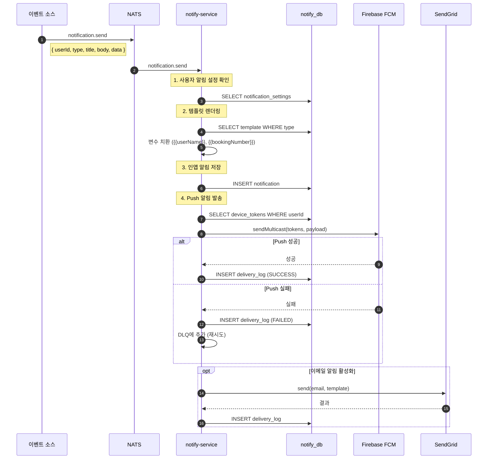
```mermaid
sequenceDiagram
    autonumber
    participant SRC as 이벤트 소스
    participant NATS as NATS
    participant NOTIFY as notify-service
    participant DB as notify_db
    participant FCM as Firebase FCM
    participant SG as SendGrid

    SRC->>NATS: notification.send
    Note right of SRC: { userId, type, title, body, data }

    NATS->>NOTIFY: notification.send

    Note over NOTIFY: 1. 사용자 알림 설정 확인
    NOTIFY->>DB: SELECT notification_settings

    Note over NOTIFY: 2. 템플릿 렌더링
    NOTIFY->>DB: SELECT template WHERE type
    NOTIFY->>NOTIFY: 변수 치환 ({{userName}}, {{bookingNumber}})

    Note over NOTIFY: 3. 인앱 알림 저장
    NOTIFY->>DB: INSERT notification

    Note over NOTIFY: 4. Push 알림 발송
    NOTIFY->>DB: SELECT device_tokens WHERE userId
    NOTIFY->>FCM: sendMulticast(tokens, payload)

    alt Push 성공
        FCM-->>NOTIFY: 성공
        NOTIFY->>DB: INSERT delivery_log (SUCCESS)
    else Push 실패
        FCM-->>NOTIFY: 실패
        NOTIFY->>DB: INSERT delivery_log (FAILED)
        NOTIFY->>NOTIFY: DLQ에 추가 (재시도)
    end

    opt 이메일 알림 활성화
        NOTIFY->>SG: send(email, template)
        SG-->>NOTIFY: 결과
        NOTIFY->>DB: INSERT delivery_log
    end
```

### 6.3 알림 타입별 이벤트 매핑

| 이벤트 | 알림 타입 | 채널 | 대상 |
|--------|----------|------|------|
| `booking.confirmed` | 예약 확정 | Push + 인앱 | 예약자 |
| `booking.cancelled` | 예약 취소 | Push + 인앱 | 예약자 |
| `friends.request.send` | 친구 요청 | Push + 인앱 | 수신자 |
| `friends.request.accept` | 친구 수락 | Push + 인앱 | 요청자 |
| `chat.message` | 새 메시지 | Push | 오프라인 멤버 |

---

## 7. 친구 관계 데이터 플로우

### 7.1 친구 요청/수락 흐름

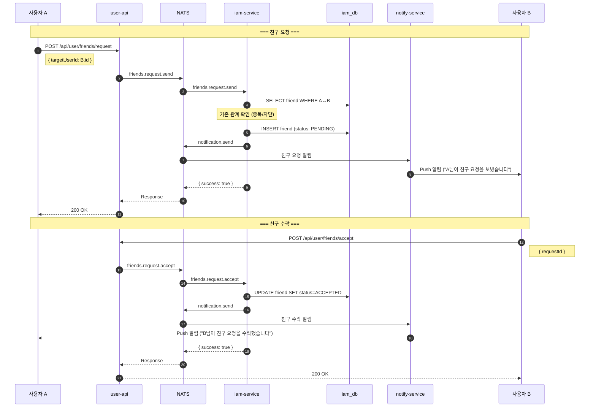
```mermaid
sequenceDiagram
    autonumber
    participant A as 사용자 A
    participant UAPI as user-api
    participant NATS as NATS
    participant IAM as iam-service
    participant IAM_DB as iam_db
    participant NOTIFY as notify-service
    participant B as 사용자 B

    Note over A,B: === 친구 요청 ===
    A->>UAPI: POST /api/user/friends/request
    Note right of A: { targetUserId: B.id }

    UAPI->>NATS: friends.request.send
    NATS->>IAM: friends.request.send

    IAM->>IAM_DB: SELECT friend WHERE A↔B
    Note over IAM: 기존 관계 확인 (중복/차단)

    IAM->>IAM_DB: INSERT friend (status: PENDING)
    IAM->>NATS: notification.send
    NATS->>NOTIFY: 친구 요청 알림
    NOTIFY->>B: Push 알림 ("A님이 친구 요청을 보냈습니다")

    IAM-->>NATS: { success: true }
    NATS-->>UAPI: Response
    UAPI-->>A: 200 OK

    Note over A,B: === 친구 수락 ===
    B->>UAPI: POST /api/user/friends/accept
    Note right of B: { requestId }

    UAPI->>NATS: friends.request.accept
    NATS->>IAM: friends.request.accept

    IAM->>IAM_DB: UPDATE friend SET status=ACCEPTED
    IAM->>NATS: notification.send
    NATS->>NOTIFY: 친구 수락 알림
    NOTIFY->>A: Push 알림 ("B님이 친구 요청을 수락했습니다")

    IAM-->>NATS: { success: true }
    NATS-->>UAPI: Response
    UAPI-->>B: 200 OK
```

### 7.2 연락처 기반 친구 검색

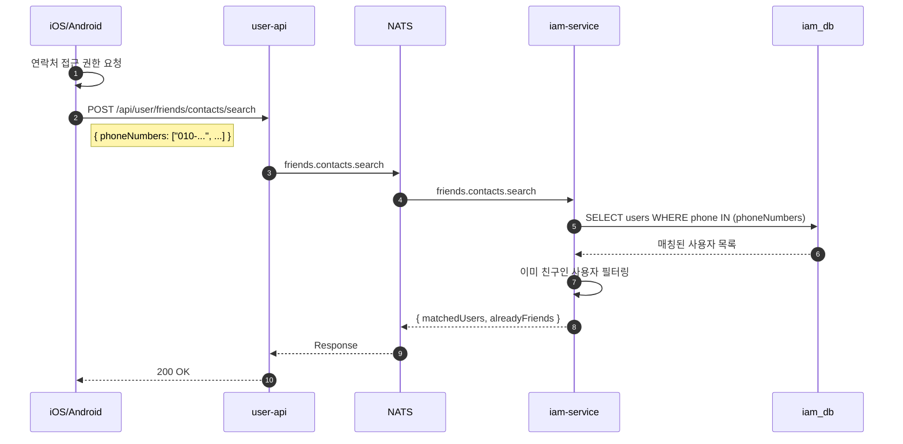
```mermaid
sequenceDiagram
    autonumber
    participant Client as iOS/Android
    participant UAPI as user-api
    participant NATS as NATS
    participant IAM as iam-service
    participant DB as iam_db

    Client->>Client: 연락처 접근 권한 요청
    Client->>UAPI: POST /api/user/friends/contacts/search
    Note right of Client: { phoneNumbers: ["010-...", ...] }

    UAPI->>NATS: friends.contacts.search
    NATS->>IAM: friends.contacts.search

    IAM->>DB: SELECT users WHERE phone IN (phoneNumbers)
    DB-->>IAM: 매칭된 사용자 목록

    IAM->>IAM: 이미 친구인 사용자 필터링
    IAM-->>NATS: { matchedUsers, alreadyFriends }
    NATS-->>UAPI: Response
    UAPI-->>Client: 200 OK
```

---

## 8. 관리자 데이터 플로우

### 8.1 관리자 API 팬아웃

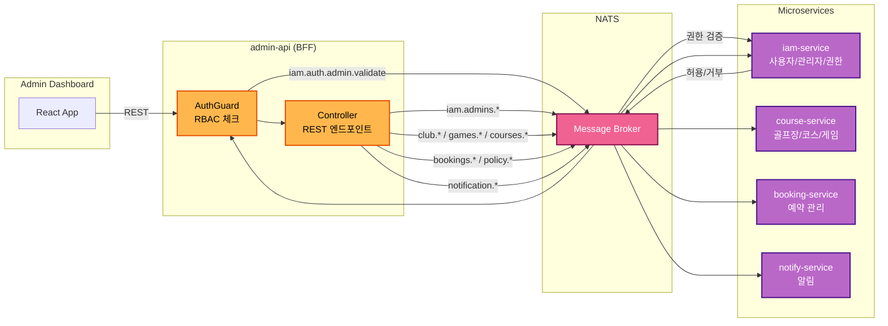
```mermaid
flowchart LR
    subgraph "Admin Dashboard"
        AD[React App]
    end

    subgraph "admin-api (BFF)"
        AUTH_MW[AuthGuard<br/>RBAC 체크]
        CTRL[Controller<br/>REST 엔드포인트]
    end

    subgraph "NATS"
        N[Message Broker]
    end

    subgraph "Microservices"
        IAM[iam-service<br/>사용자/관리자/권한]
        COURSE[course-service<br/>골프장/코스/게임]
        BOOK[booking-service<br/>예약 관리]
        NOTIFY[notify-service<br/>알림]
    end

    AD -->|REST| AUTH_MW
    AUTH_MW -->|"iam.auth.admin.validate"| N
    N -->|권한 검증| IAM
    IAM -->|허용/거부| N
    N --> AUTH_MW
    AUTH_MW --> CTRL

    CTRL -->|"iam.admins.*"| N --> IAM
    CTRL -->|"club.* / games.* / courses.*"| N --> COURSE
    CTRL -->|"bookings.* / policy.*"| N --> BOOK
    CTRL -->|"notification.*"| N --> NOTIFY

    classDef bff fill:#ffb74d,stroke:#e65100,stroke-width:2px,color:#000
    classDef service fill:#ba68c8,stroke:#4a148c,stroke-width:2px,color:#fff
    classDef message fill:#f06292,stroke:#880e4f,stroke-width:2px,color:#fff

    class AUTH_MW,CTRL bff
    class IAM,COURSE,BOOK,NOTIFY service
    class N message
```

### 8.2 관리자 RBAC 검증 흐름

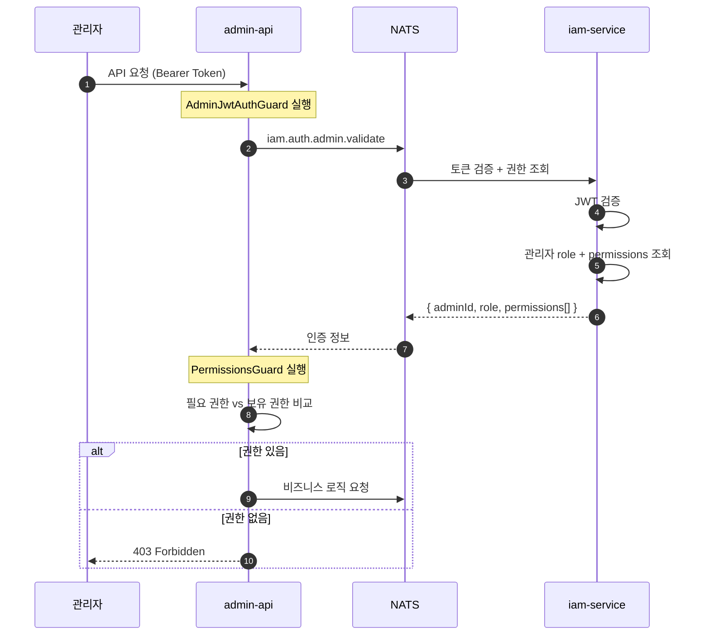
```mermaid
sequenceDiagram
    autonumber
    participant Admin as 관리자
    participant AAPI as admin-api
    participant NATS as NATS
    participant IAM as iam-service

    Admin->>AAPI: API 요청 (Bearer Token)

    Note over AAPI: AdminJwtAuthGuard 실행
    AAPI->>NATS: iam.auth.admin.validate
    NATS->>IAM: 토큰 검증 + 권한 조회

    IAM->>IAM: JWT 검증
    IAM->>IAM: 관리자 role + permissions 조회

    IAM-->>NATS: { adminId, role, permissions[] }
    NATS-->>AAPI: 인증 정보

    Note over AAPI: PermissionsGuard 실행
    AAPI->>AAPI: 필요 권한 vs 보유 권한 비교

    alt 권한 있음
        AAPI->>NATS: 비즈니스 로직 요청
    else 권한 없음
        AAPI-->>Admin: 403 Forbidden
    end
```

### 8.3 관리자 주요 NATS 패턴

| 도메인 | 패턴 | 설명 |
|--------|------|------|
| 인증 | `iam.auth.admin.login` | 관리자 로그인 |
| 인증 | `iam.auth.admin.validate` | 토큰 + 권한 검증 |
| 사용자 | `iam.users.list` / `iam.users.updateStatus` | 사용자 관리 |
| 관리자 | `iam.admins.list` / `iam.admins.create` | 관리자 관리 |
| 권한 | `iam.permissions.list` / `iam.roles.list` | 권한/역할 관리 |
| 골프장 | `club.findAll` / `club.create` | 골프장 CRUD |
| 게임 | `games.list` / `games.create` | 게임 관리 |
| 예약 | `bookings.list` / `bookings.confirm` / `bookings.noShow` | 예약 관리 |
| 정책 | `policy.cancellation.*` / `policy.refund.*` | 정책 관리 |

---

## 9. 데이터베이스 간 관계

### 9.1 서비스별 DB 분리

각 마이크로서비스는 독립된 데이터베이스를 소유하며, 서비스 간 데이터 참조는 NATS를 통한 ID 기반으로 이루어집니다.

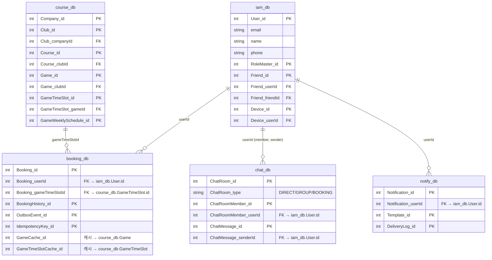
```mermaid
erDiagram
    iam_db {
        int User_id PK
        string email
        string name
        string phone
        int RoleMaster_id PK
        int Friend_id PK
        int Friend_userId FK
        int Friend_friendId FK
        int Device_id PK
        int Device_userId FK
    }

    course_db {
        int Company_id PK
        int Club_id PK
        int Club_companyId FK
        int Course_id PK
        int Course_clubId FK
        int Game_id PK
        int Game_clubId FK
        int GameTimeSlot_id PK
        int GameTimeSlot_gameId FK
        int GameWeeklySchedule_id PK
    }

    booking_db {
        int Booking_id PK
        int Booking_userId "FK → iam_db.User.id"
        int Booking_gameTimeSlotId "FK → course_db.GameTimeSlot.id"
        int BookingHistory_id PK
        int OutboxEvent_id PK
        int IdempotencyKey_id PK
        int GameCache_id "캐시 → course_db.Game"
        int GameTimeSlotCache_id "캐시 → course_db.GameTimeSlot"
    }

    chat_db {
        int ChatRoom_id PK
        string ChatRoom_type "DIRECT/GROUP/BOOKING"
        int ChatRoomMember_id PK
        int ChatRoomMember_userId "FK → iam_db.User.id"
        int ChatMessage_id PK
        int ChatMessage_senderId "FK → iam_db.User.id"
    }

    notify_db {
        int Notification_id PK
        int Notification_userId "FK → iam_db.User.id"
        int Template_id PK
        int DeliveryLog_id PK
    }

    iam_db ||--o{ booking_db : "userId"
    iam_db ||--o{ chat_db : "userId (member, sender)"
    iam_db ||--o{ notify_db : "userId"
    course_db ||--o{ booking_db : "gameTimeSlotId"
```

### 9.2 크로스 서비스 ID 참조 요약

| 참조하는 DB | 참조되는 DB | 필드 | 용도 |
|------------|-----------|------|------|
| booking_db | iam_db | `Booking.userId` → `User.id` | 예약자 식별 |
| booking_db | course_db | `Booking.gameTimeSlotId` → `GameTimeSlot.id` | 예약 슬롯 |
| booking_db | course_db | `GameCache.gameId` → `Game.id` | 게임 정보 캐시 |
| booking_db | course_db | `GameTimeSlotCache.gameTimeSlotId` → `GameTimeSlot.id` | 슬롯 캐시 |
| chat_db | iam_db | `ChatRoomMember.userId` → `User.id` | 채팅방 멤버 |
| chat_db | iam_db | `ChatMessage.senderId` → `User.id` | 메시지 발신자 |
| notify_db | iam_db | `Notification.userId` → `User.id` | 알림 수신자 |

> **중요**: FK 제약 조건은 같은 DB 내에서만 적용됩니다. 크로스 서비스 참조는 NATS를 통한 논리적 참조이며, 데이터 정합성은 이벤트 기반으로 보장합니다.

---

## 10. NATS 메시지 패턴 종합

### 10.1 IAM Service 패턴

| 패턴 | 타입 | 설명 | 타임아웃 |
|------|------|------|---------|
| `iam.auth.user.login` | Request-Reply | 사용자 로그인 | 5s |
| `iam.auth.user.validate` | Request-Reply | 사용자 토큰 검증 | 5s |
| `iam.auth.user.refresh` | Request-Reply | 토큰 갱신 | 5s |
| `iam.auth.user.me` | Request-Reply | 내 정보 조회 | 5s |
| `iam.auth.user.logout` | Request-Reply | 로그아웃 | 5s |
| `iam.auth.admin.login` | Request-Reply | 관리자 로그인 | 5s |
| `iam.auth.admin.validate` | Request-Reply | 관리자 토큰 검증 | 5s |
| `iam.auth.admin.refresh` | Request-Reply | 관리자 토큰 갱신 | 5s |
| `iam.auth.admin.me` | Request-Reply | 관리자 정보 조회 | 5s |
| `iam.auth.admin.logout` | Request-Reply | 관리자 로그아웃 | 5s |
| `iam.users.list` | Request-Reply | 사용자 목록 | 5s |
| `iam.users.getById` | Request-Reply | 사용자 조회 | 5s |
| `iam.users.create` | Request-Reply | 사용자 생성 | 5s |
| `iam.users.update` | Request-Reply | 사용자 수정 | 5s |
| `iam.users.delete` | Request-Reply | 사용자 삭제 | 5s |
| `iam.users.updateStatus` | Request-Reply | 상태 변경 | 5s |
| `iam.users.findByEmail` | Request-Reply | 이메일 검색 | 5s |
| `iam.users.changePassword` | Request-Reply | 비밀번호 변경 | 5s |
| `iam.admins.list` | Request-Reply | 관리자 목록 | 5s |
| `iam.admins.create` | Request-Reply | 관리자 생성 | 5s |
| `iam.admins.update` | Request-Reply | 관리자 수정 | 5s |
| `iam.admins.delete` | Request-Reply | 관리자 삭제 | 5s |
| `iam.permissions.list` | Request-Reply | 권한 목록 | 5s |
| `iam.roles.list` | Request-Reply | 역할 목록 | 5s |
| `iam.roles.permissions` | Request-Reply | 역할별 권한 | 5s |
| `iam.companies.list` | Request-Reply | 회사 목록 | 5s |
| `iam.companies.create` | Request-Reply | 회사 생성 | 5s |
| `iam.companies.update` | Request-Reply | 회사 수정 | 5s |

### 10.2 Friend 패턴

| 패턴 | 타입 | 설명 | 타임아웃 |
|------|------|------|---------|
| `friends.list` | Request-Reply | 친구 목록 | 5s |
| `friends.count` | Request-Reply | 친구 수 | 5s |
| `friends.requests` | Request-Reply | 받은 요청 목록 | 5s |
| `friends.requests.sent` | Request-Reply | 보낸 요청 목록 | 5s |
| `friends.search` | Request-Reply | 사용자 검색 | 5s |
| `friends.request.send` | Request-Reply | 친구 요청 | 5s |
| `friends.request.accept` | Request-Reply | 요청 수락 | 5s |
| `friends.request.reject` | Request-Reply | 요청 거절 | 5s |
| `friends.remove` | Request-Reply | 친구 삭제 | 5s |
| `friends.check` | Request-Reply | 친구 여부 확인 | 5s |
| `friends.contacts.search` | Request-Reply | 연락처 검색 | 5s |

### 10.3 Course Service 패턴

| 패턴 | 타입 | 설명 | 타임아웃 |
|------|------|------|---------|
| `club.findAll` | Request-Reply | 골프장 목록 | 5s |
| `club.findOne` | Request-Reply | 골프장 상세 | 5s |
| `club.create` | Request-Reply | 골프장 생성 | 5s |
| `club.update` | Request-Reply | 골프장 수정 | 5s |
| `club.remove` | Request-Reply | 골프장 삭제 | 5s |
| `club.search` | Request-Reply | 골프장 검색 | 5s |
| `courses.list` | Request-Reply | 코스 목록 | 5s |
| `courses.create` | Request-Reply | 코스 생성 | 5s |
| `games.list` | Request-Reply | 게임 목록 | 5s |
| `games.create` | Request-Reply | 게임 생성 | 5s |
| `games.get` | Request-Reply | 게임 조회 | 5s |
| `gameTimeSlots.list` | Request-Reply | 타임슬롯 목록 | 5s |
| `gameTimeSlots.available` | Request-Reply | 가용 슬롯 조회 | 5s |
| `gameTimeSlots.generate` | Request-Reply | 슬롯 자동 생성 | 15s |
| `gameWeeklySchedules.bulkCreate` | Request-Reply | 스케줄 일괄 생성 | 15s |
| `slot.reserve` | Event (Saga) | 슬롯 예약 요청 | 30s |
| `slot.reserved` | Event (Saga) | 슬롯 예약 완료 | - |
| `slot.reserve.failed` | Event (Saga) | 슬롯 예약 실패 | - |
| `slot.release` | Event (Saga) | 슬롯 해제 요청 | 30s |

### 10.4 Booking Service 패턴

| 패턴 | 타입 | 설명 | 타임아웃 |
|------|------|------|---------|
| `booking.create` | Request-Reply | 예약 생성 (Saga 시작) | 15s |
| `booking.findById` | Request-Reply | 예약 조회 | 5s |
| `booking.findByNumber` | Request-Reply | 예약번호 조회 | 5s |
| `booking.findByUserId` | Request-Reply | 사용자 예약 목록 | 5s |
| `booking.search` | Request-Reply | 예약 검색 | 5s |
| `bookings.list` | Request-Reply | 예약 목록 (관리자) | 5s |
| `booking.cancel` | Request-Reply | 예약 취소 | 15s |
| `bookings.confirm` | Request-Reply | 예약 확정 (관리자) | 15s |
| `bookings.complete` | Request-Reply | 이용 완료 처리 | 5s |
| `bookings.noShow` | Request-Reply | 노쇼 처리 | 5s |
| `booking.confirmed` | Event | 예약 확정 이벤트 | - |
| `booking.cancelled` | Event | 예약 취소 이벤트 | - |
| `booking.userStats` | Request-Reply | 사용자 예약 통계 | 5s |
| `policy.cancellation.*` | Request-Reply | 취소 정책 CRUD | 5s |
| `policy.refund.*` | Request-Reply | 환불 정책 CRUD | 5s |
| `policy.noshow.*` | Request-Reply | 노쇼 정책 CRUD | 5s |

### 10.5 Chat Service 패턴

| 패턴 | 타입 | 설명 | 타임아웃 |
|------|------|------|---------|
| `chat.rooms.create` | Request-Reply | 채팅방 생성 | 5s |
| `chat.rooms.get` | Request-Reply | 채팅방 조회 | 5s |
| `chat.rooms.list` | Request-Reply | 채팅방 목록 | 5s |
| `chat.rooms.addMember` | Request-Reply | 멤버 추가 | 5s |
| `chat.rooms.removeMember` | Request-Reply | 멤버 제거 | 5s |
| `chat.rooms.booking` | Request-Reply | 예약 채팅방 생성 | 5s |
| `chat.messages.save` | Request-Reply | 메시지 저장 | 5s |
| `chat.messages.list` | Request-Reply | 메시지 목록 | 5s |
| `chat.messages.markRead` | Request-Reply | 읽음 처리 | 5s |
| `chat.messages.unreadCount` | Request-Reply | 안읽은 수 | 5s |
| `chat.messages.delete` | Request-Reply | 메시지 삭제 | 5s |

### 10.6 Notify Service 패턴

| 패턴 | 타입 | 설명 | 타임아웃 |
|------|------|------|---------|
| `notification.send` | Request-Reply | 알림 발송 | 15s |
| `notification.get_user_notifications` | Request-Reply | 사용자 알림 목록 | 5s |
| `notification.mark_as_read` | Request-Reply | 읽음 처리 | 5s |
| `notification.get_unread_count` | Request-Reply | 안읽은 수 | 5s |
| `notification.mark_all_as_read` | Request-Reply | 전체 읽음 처리 | 5s |
| `notification.delete` | Request-Reply | 알림 삭제 | 5s |

### 10.7 Device 패턴

| 패턴 | 타입 | 설명 | 타임아웃 |
|------|------|------|---------|
| `users.devices.register` | Request-Reply | 디바이스 등록 | 5s |
| `users.devices.remove` | Request-Reply | 디바이스 제거 | 5s |
| `users.devices.list` | Request-Reply | 디바이스 목록 | 5s |
| `users.devices.tokens` | Request-Reply | FCM 토큰 조회 | 5s |
| `users.devices.heartbeat` | Request-Reply | 하트비트 | 5s |

### 10.8 타임아웃 티어

| 티어 | 타임아웃 | 대상 패턴 |
|------|---------|----------|
| **Fast (5s)** | 5,000ms | 단순 CRUD, 조회, 인증 |
| **Medium (15s)** | 15,000ms | 예약 생성/취소, 슬롯 생성, 알림 발송 |
| **Slow (30s)** | 30,000ms | Saga 이벤트 (slot.reserve, slot.release) |
| **Saga (60s)** | 60,000ms | Saga 전체 타임아웃 (PENDING → CONFIRMED) |

---

## 변경 이력

| 버전 | 날짜 | 변경 내용 |
|------|------|----------|
| 1.0 | 2026-02-02 | 초안 작성 — 전체 데이터 플로우 다이어그램 |

---

## 참고 자료

- [ARCHITECTURE.md](./ARCHITECTURE.md) — 시스템 아키텍처
- [BOOKING-WORKFLOW.md](./BOOKING-WORKFLOW.md) — 예약 Saga 패턴 상세
- [CHAT_WORKFLOW.md](./CHAT_WORKFLOW.md) — 채팅 시스템 상세
- [NOTIFICATION-WORKFLOW.md](./NOTIFICATION-WORKFLOW.md) — 알림 시스템 상세
- [SECURITY_WORKFLOW.md](./SECURITY_WORKFLOW.md) — 보안/인증 상세
