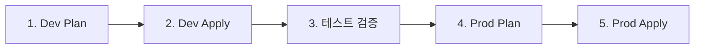

# GitHub Workflow 설정 가이드

## 목차
1. [사전 요구사항](#사전-요구사항)
2. [GCP 초기 설정](#gcp-초기-설정)
3. [GitHub Secrets 설정](#github-secrets-설정)
4. [Workflow 실행](#workflow-실행)
5. [문제 해결](#문제-해결)

---

## 사전 요구사항

### 필수 도구
- `gcloud` CLI 설치 및 인증
- GitHub 저장소 Admin 권한

### GCP 프로젝트 정보
| 항목 | 값 |
|------|-----|
| Project ID | `parkgolf-uniyous` |
| Region | `asia-northeast3` (Seoul) |
| State Bucket | `parkgolf-uniyous-terraform-state` |

---

## GCP 초기 설정

### Step 1: 초기 설정 스크립트 실행

```bash
# 프로젝트 루트에서 실행
cd scripts/infra
chmod +x setup-gcp-infrastructure.sh
./setup-gcp-infrastructure.sh
```

이 스크립트는 다음을 수행합니다:
- 필요한 GCP API 활성화
- Terraform State 버킷 생성
- GitHub Actions용 Service Account 생성
- IAM 권한 부여
- Service Account Key 생성

### Step 2: 스크립트 실행 결과 확인

```bash
# State 버킷 확인
gsutil ls gs://parkgolf-uniyous-terraform-state

# Service Account 확인
gcloud iam service-accounts list --filter="email:github-actions-terraform"

# 생성된 키 파일 확인
ls -la github-actions-sa-key.json
```

---

## GitHub Secrets 설정

### 필수 Secrets 목록

GitHub 저장소 → Settings → Secrets and variables → Actions → New repository secret

| Secret Name | 설명 | 예시 값 |
|-------------|------|---------|
| `GCP_SA_KEY` | Service Account JSON (base64) | `cat github-actions-sa-key.json` 내용 |
| `DB_PASSWORD` | PostgreSQL 비밀번호 | `MySecureP@ssw0rd!2024` |
| `JWT_SECRET` | JWT 서명 키 (32자 이상) | `your-super-secret-jwt-key-min-32-characters` |
| `JWT_REFRESH_SECRET` | JWT 리프레시 키 | `your-refresh-secret-key-min-32-characters` |
| `ALERT_EMAIL` | 알림 이메일 | `dev@uniyous.com` |

### 선택 Secrets (Production)

| Secret Name | 설명 | 예시 값 |
|-------------|------|---------|
| `OPS_EMAIL` | 운영팀 이메일 | `ops@uniyous.com` |
| `SLACK_CHANNEL` | Slack 채널 | `#parkgolf-alerts` |
| `SLACK_TOKEN` | Slack Webhook 토큰 | `xoxb-...` |
| `FIREBASE_SERVICE_ACCOUNT` | Firebase SA JSON | Firebase Console에서 다운로드 |

### Secret 설정 방법

#### 1. GCP_SA_KEY 설정

```bash
# Service Account 키 내용 복사
cat github-actions-sa-key.json
```

위 내용을 **그대로** `GCP_SA_KEY` Secret에 붙여넣기

#### 2. 보안 비밀번호 생성 (권장)

```bash
# 랜덤 비밀번호 생성
openssl rand -base64 24

# 랜덤 JWT Secret 생성 (32자 이상)
openssl rand -base64 32
```

---

## Workflow 실행

### 사용 가능한 Workflows

| Workflow | 파일 | 용도 | 트리거 |
|----------|------|------|--------|
| CI Pipeline | `ci.yml` | 테스트/빌드 | PR 생성 시 자동 |
| CD Infrastructure | `cd-infra.yml` | Terraform 배포 | `infra/**` 변경 또는 수동 |
| CD Applications | `cd-apps.yml` | 앱 배포 | `apps/**` 변경 또는 수동 |
| Rollback | `rollback.yml` | 롤백 | 수동만 |

### Infrastructure 배포 (최초)

1. **GitHub Actions 탭으로 이동**

2. **CD Infrastructure 선택**

3. **Run workflow 클릭**
   ```
   Environment: dev
   Action: plan  (먼저 plan으로 확인)
   ```

4. **Plan 결과 확인 후 Apply**
   ```
   Environment: dev
   Action: apply
   ```

### 배포 순서 (권장)



---

## Workflow 상세

### CD Infrastructure (`cd-infra.yml`)

```yaml
# 수동 실행 옵션
workflow_dispatch:
  inputs:
    environment:  # dev, staging, prod
    action:       # plan, apply, destroy
```

**자동 트리거:**
- `develop` 브랜치 push → Dev 환경 plan + apply
- `main` 브랜치 push → Prod 환경 plan + apply (승인 필요)

### CD Applications (`cd-apps.yml`)

```yaml
# 수동 실행 옵션
workflow_dispatch:
  inputs:
    environment:     # dev, staging, prod
    services:        # all 또는 "auth-service,user-api"
    deploy_frontend: # true/false
```

**자동 트리거:**
- `develop` 브랜치 push → Dev 환경 배포
- `main` 브랜치 push → Staging 환경 배포

---

## 문제 해결

### 1. "Permission denied" 오류

```
Error: googleapi: Error 403: Permission denied
```

**해결:**
```bash
# Service Account 권한 확인
gcloud projects get-iam-policy parkgolf-uniyous \
  --flatten="bindings[].members" \
  --filter="bindings.members:github-actions-terraform"

# 누락된 권한 추가
gcloud projects add-iam-policy-binding parkgolf-uniyous \
  --member="serviceAccount:github-actions-terraform@parkgolf-uniyous.iam.gserviceaccount.com" \
  --role="roles/compute.admin"
```

### 2. "Bucket not found" 오류

```
Error: Failed to get existing workspaces: storage: bucket doesn't exist
```

**해결:**
```bash
# 버킷 생성
gsutil mb -p parkgolf-uniyous -l asia-northeast3 gs://parkgolf-uniyous-terraform-state
```

### 3. "API not enabled" 오류

```
Error: googleapi: Error 403: API compute.googleapis.com not enabled
```

**해결:**
```bash
# API 활성화
gcloud services enable compute.googleapis.com --project=parkgolf-uniyous
```

### 4. Terraform State Lock 오류

```
Error: Error acquiring the state lock
```

**해결:**
```bash
# State lock 강제 해제 (주의: 다른 작업이 없는지 확인)
cd infra/environments/dev
terraform force-unlock LOCK_ID
```

### 5. Secret 형식 오류

**GCP_SA_KEY가 유효한 JSON인지 확인:**
```bash
# 로컬에서 테스트
cat github-actions-sa-key.json | jq .
```

---

## 보안 주의사항

1. **로컬 키 파일 삭제**
   ```bash
   # GitHub Secrets 설정 후 삭제
   rm github-actions-sa-key.json
   ```

2. **키 파일 커밋 금지**
   `.gitignore`에 이미 포함되어 있어야 함:
   ```
   *.json
   !package.json
   !tsconfig.json
   ```

3. **정기적 키 로테이션**
   - 90일마다 Service Account 키 갱신 권장
   - 새 키 생성 → GitHub Secret 업데이트 → 이전 키 삭제

---

## 빠른 시작 체크리스트

- [ ] `gcloud auth login` 완료
- [ ] `./scripts/infra/setup-gcp-infrastructure.sh` 실행
- [ ] GitHub Secrets 설정 완료:
  - [ ] `GCP_SA_KEY`
  - [ ] `DB_PASSWORD`
  - [ ] `JWT_SECRET`
  - [ ] `JWT_REFRESH_SECRET`
  - [ ] `ALERT_EMAIL`
- [ ] CD Infrastructure workflow → `dev` + `plan` 실행
- [ ] Plan 결과 확인
- [ ] CD Infrastructure workflow → `dev` + `apply` 실행
- [ ] 로컬 키 파일 삭제
