# Notification System

Park Golf Platform 알림 시스템 아키텍처 및 워크플로우 문서입니다.

## 목차

1. [시스템 개요](#1-시스템-개요)
2. [아키텍처](#2-아키텍처)
3. [이벤트 플로우](#3-이벤트-플로우)
4. [Push 알림 (FCM/APNs)](#4-push-알림-fcmapns)
5. [재시도 및 Dead Letter Queue](#5-재시도-및-dead-letter-queue)
6. [알림 타입 및 템플릿](#6-알림-타입-및-템플릿)
7. [API 엔드포인트](#7-api-엔드포인트)
8. [데이터베이스 스키마](#8-데이터베이스-스키마)
9. [클라이언트 구현](#9-클라이언트-구현)
10. [설정 및 환경변수](#10-설정-및-환경변수)
11. [부록: iOS Push 알림 구현 가이드](#부록-ios-push-알림-구현-가이드)

---

## 1. 시스템 개요

### 핵심 기능

| 기능 | 설명 |
|------|------|
| **이벤트 기반 알림** | 예약, 친구, 채팅 등 이벤트 발생 시 자동 알림 생성 |
| **Push 알림** | FCM을 통한 Android/iOS 실시간 푸시 |
| **템플릿 시스템** | 알림 타입별 템플릿 및 변수 치환 |
| **재시도 로직** | 지수 백오프 기반 자동 재시도 |
| **Dead Letter Queue** | 영구 실패 알림 별도 관리 |
| **사용자 설정** | 채널별 알림 수신 설정 |

### 알림 타입 (8종)

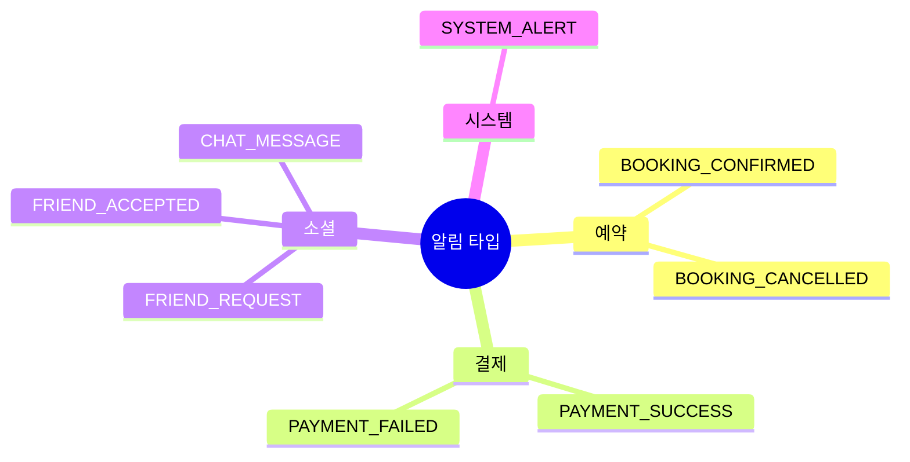
```mermaid
mindmap
  root((알림 타입))
    예약
      BOOKING_CONFIRMED
      BOOKING_CANCELLED
    결제
      PAYMENT_SUCCESS
      PAYMENT_FAILED
    소셜
      FRIEND_REQUEST
      FRIEND_ACCEPTED
      CHAT_MESSAGE
    시스템
      SYSTEM_ALERT
```

---

## 2. 아키텍처

### 전체 시스템 구조

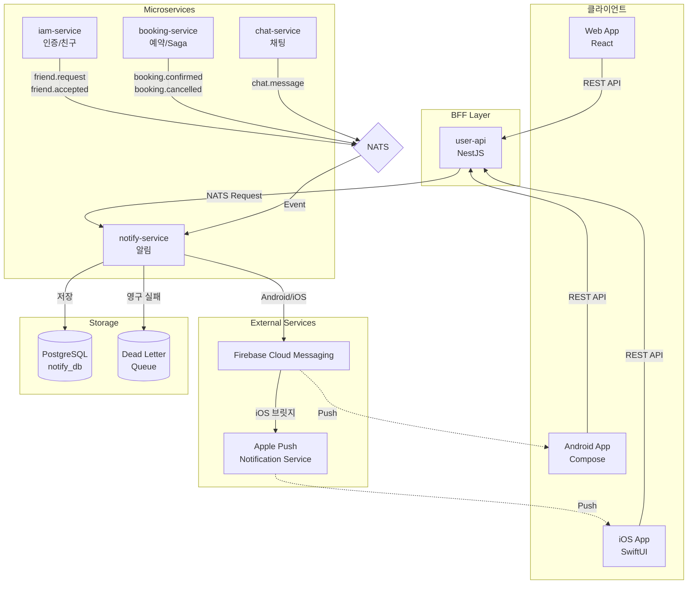
```mermaid
flowchart TB
    subgraph Clients["클라이언트"]
        WEB[Web App<br/>React]
        IOS[iOS App<br/>SwiftUI]
        AND[Android App<br/>Compose]
    end

    subgraph BFF["BFF Layer"]
        UAPI[user-api<br/>NestJS]
    end

    subgraph Services["Microservices"]
        IAM[iam-service<br/>인증/친구]
        BOOK[booking-service<br/>예약/Saga]
        CHAT[chat-service<br/>채팅]
        NOTIFY[notify-service<br/>알림]
    end

    subgraph External["External Services"]
        FCM[Firebase Cloud Messaging]
        APNS[Apple Push<br/>Notification Service]
    end

    subgraph Storage["Storage"]
        DB[(PostgreSQL<br/>notify_db)]
        DLQ[(Dead Letter<br/>Queue)]
    end

    WEB & IOS & AND -->|REST API| UAPI
    UAPI -->|NATS Request| NOTIFY

    IAM -->|friend.request<br/>friend.accepted| NATS
    BOOK -->|booking.confirmed<br/>booking.cancelled| NATS
    CHAT -->|chat.message| NATS

    NATS{NATS} -->|Event| NOTIFY

    NOTIFY -->|저장| DB
    NOTIFY -->|영구 실패| DLQ
    NOTIFY -->|Android/iOS| FCM
    FCM -->|iOS 브릿지| APNS

    FCM -.->|Push| AND
    APNS -.->|Push| IOS
```

### notify-service 내부 구조

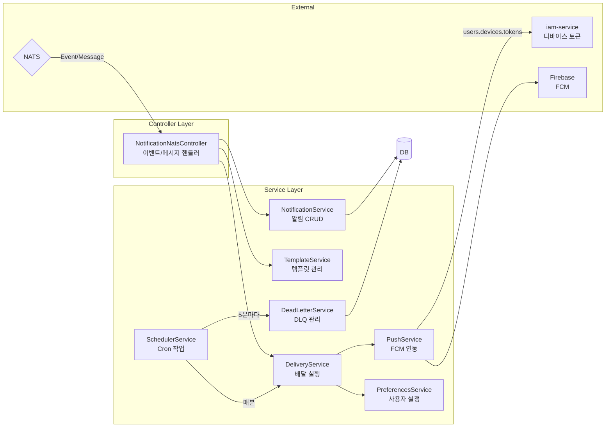
```mermaid
flowchart LR
    subgraph Controller["Controller Layer"]
        NC[NotificationNatsController<br/>이벤트/메시지 핸들러]
    end

    subgraph Services["Service Layer"]
        NS[NotificationService<br/>알림 CRUD]
        TS[TemplateService<br/>템플릿 관리]
        DS[DeliveryService<br/>배달 실행]
        PS[PushService<br/>FCM 연동]
        DLS[DeadLetterService<br/>DLQ 관리]
        PREF[PreferencesService<br/>사용자 설정]
        SCHED[SchedulerService<br/>Cron 작업]
    end

    subgraph External["External"]
        NATS{NATS}
        IAM[iam-service<br/>디바이스 토큰]
        FCM[Firebase<br/>FCM]
    end

    NATS -->|Event/Message| NC
    NC --> NS
    NC --> TS
    NC --> DS

    NS --> DB[(DB)]
    DS --> PREF
    DS --> PS
    PS -->|users.devices.tokens| IAM
    PS --> FCM

    SCHED -->|매분| DS
    SCHED -->|5분마다| DLS
    DLS --> DB
```

---

## 3. 이벤트 플로우

### 3.1 예약 확정 알림

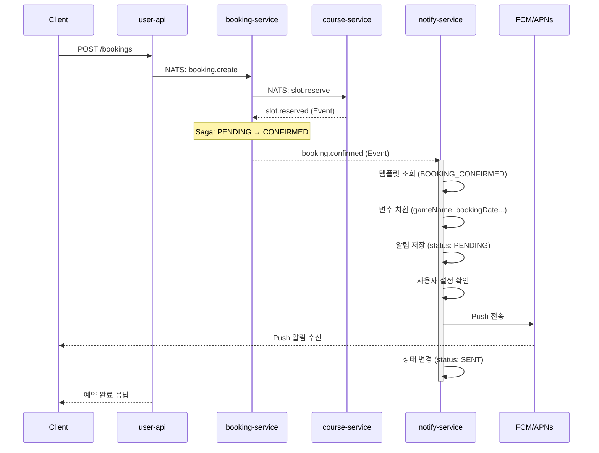
```mermaid
sequenceDiagram
    participant C as Client
    participant UA as user-api
    participant BS as booking-service
    participant CS as course-service
    participant NS as notify-service
    participant FCM as FCM/APNs

    C->>UA: POST /bookings
    UA->>BS: NATS: booking.create
    BS->>CS: NATS: slot.reserve
    CS-->>BS: slot.reserved (Event)

    Note over BS: Saga: PENDING → CONFIRMED

    BS-->>NS: booking.confirmed (Event)

    activate NS
    NS->>NS: 템플릿 조회 (BOOKING_CONFIRMED)
    NS->>NS: 변수 치환 (gameName, bookingDate...)
    NS->>NS: 알림 저장 (status: PENDING)
    NS->>NS: 사용자 설정 확인
    NS->>FCM: Push 전송
    FCM-->>C: Push 알림 수신
    NS->>NS: 상태 변경 (status: SENT)
    deactivate NS

    UA-->>C: 예약 완료 응답
```

### 3.2 친구 요청/수락 알림

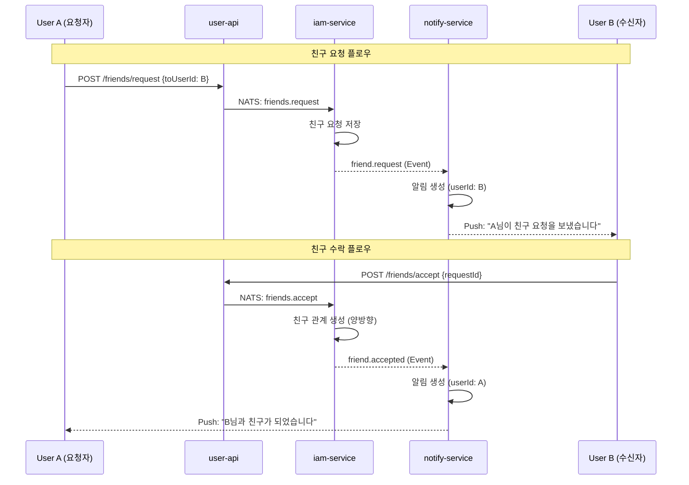
```mermaid
sequenceDiagram
    participant A as User A (요청자)
    participant UA as user-api
    participant IAM as iam-service
    participant NS as notify-service
    participant B as User B (수신자)

    Note over A,B: 친구 요청 플로우
    A->>UA: POST /friends/request {toUserId: B}
    UA->>IAM: NATS: friends.request
    IAM->>IAM: 친구 요청 저장
    IAM-->>NS: friend.request (Event)
    NS->>NS: 알림 생성 (userId: B)
    NS-->>B: Push: "A님이 친구 요청을 보냈습니다"

    Note over A,B: 친구 수락 플로우
    B->>UA: POST /friends/accept {requestId}
    UA->>IAM: NATS: friends.accept
    IAM->>IAM: 친구 관계 생성 (양방향)
    IAM-->>NS: friend.accepted (Event)
    NS->>NS: 알림 생성 (userId: A)
    NS-->>A: Push: "B님과 친구가 되었습니다"
```

### 3.3 채팅 메시지 알림

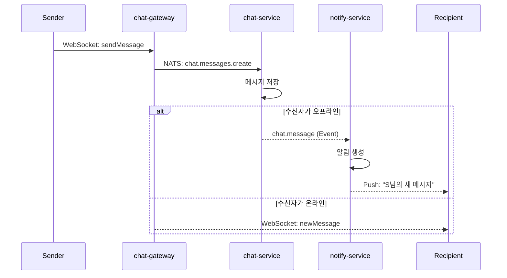
```mermaid
sequenceDiagram
    participant S as Sender
    participant CG as chat-gateway
    participant CS as chat-service
    participant NS as notify-service
    participant R as Recipient

    S->>CG: WebSocket: sendMessage
    CG->>CS: NATS: chat.messages.create
    CS->>CS: 메시지 저장

    alt 수신자가 오프라인
        CS-->>NS: chat.message (Event)
        NS->>NS: 알림 생성
        NS-->>R: Push: "S님의 새 메시지"
    else 수신자가 온라인
        CG-->>R: WebSocket: newMessage
    end
```

### NATS 이벤트 패턴 요약

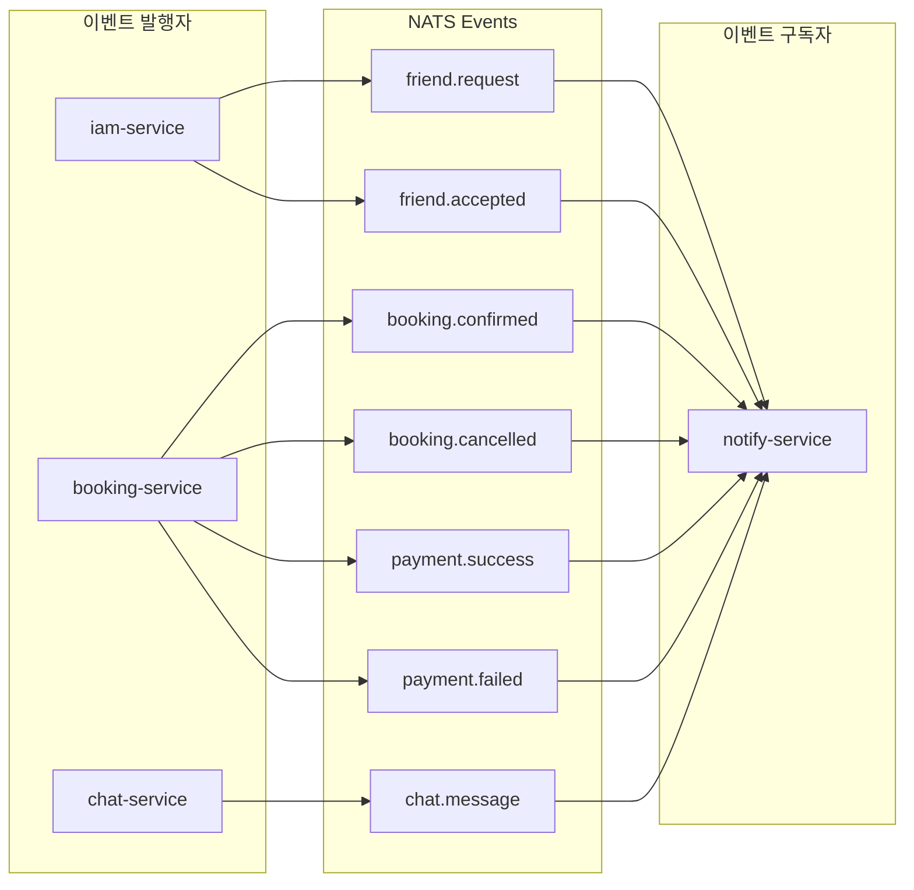
```mermaid
flowchart LR
    subgraph Publishers["이벤트 발행자"]
        IAM[iam-service]
        BOOK[booking-service]
        CHAT[chat-service]
    end

    subgraph Events["NATS Events"]
        E1[friend.request]
        E2[friend.accepted]
        E3[booking.confirmed]
        E4[booking.cancelled]
        E5[payment.success]
        E6[payment.failed]
        E7[chat.message]
    end

    subgraph Subscriber["이벤트 구독자"]
        NS[notify-service]
    end

    IAM --> E1 & E2
    BOOK --> E3 & E4 & E5 & E6
    CHAT --> E7

    E1 & E2 & E3 & E4 & E5 & E6 & E7 --> NS
```

---

## 4. Push 알림 (FCM/APNs)

### 4.1 Push 전송 플로우

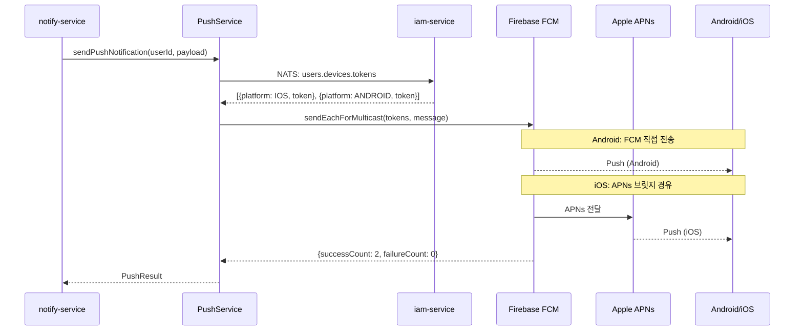
```mermaid
sequenceDiagram
    participant NS as notify-service
    participant PS as PushService
    participant IAM as iam-service
    participant FCM as Firebase FCM
    participant APNS as Apple APNs
    participant Device as Android/iOS

    NS->>PS: sendPushNotification(userId, payload)
    PS->>IAM: NATS: users.devices.tokens
    IAM-->>PS: [{platform: IOS, token}, {platform: ANDROID, token}]

    PS->>FCM: sendEachForMulticast(tokens, message)

    Note over FCM,Device: Android: FCM 직접 전송
    FCM-->>Device: Push (Android)

    Note over FCM,Device: iOS: APNs 브릿지 경유
    FCM->>APNS: APNs 전달
    APNS-->>Device: Push (iOS)

    FCM-->>PS: {successCount: 2, failureCount: 0}
    PS-->>NS: PushResult
```

### 4.2 플랫폼별 메시지 구조

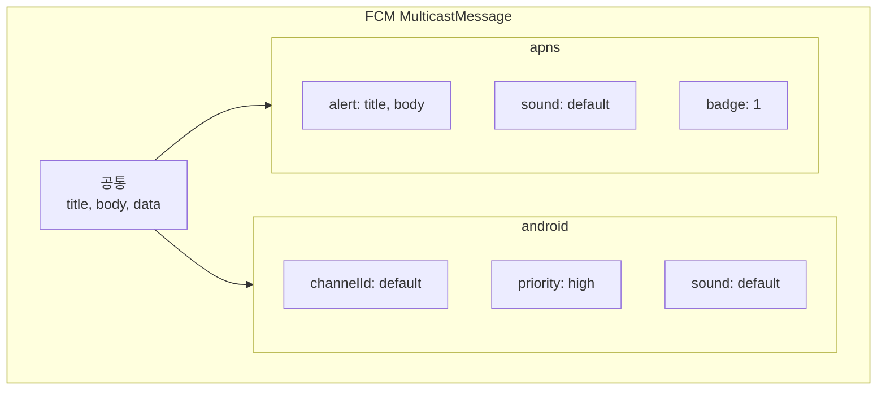
```mermaid
flowchart TB
    subgraph Message["FCM MulticastMessage"]
        COMMON[공통<br/>title, body, data]

        subgraph Android["android"]
            A1[channelId: default]
            A2[priority: high]
            A3[sound: default]
        end

        subgraph iOS["apns"]
            I1[alert: title, body]
            I2[sound: default]
            I3[badge: 1]
        end
    end

    COMMON --> Android
    COMMON --> iOS
```

### 4.3 디바이스 토큰 관리

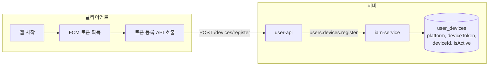
```mermaid
flowchart LR
    subgraph Client["클라이언트"]
        APP[앱 시작]
        TOKEN[FCM 토큰 획득]
        REG[토큰 등록 API 호출]
    end

    subgraph Server["서버"]
        UAPI[user-api]
        IAM[iam-service]
        DB[(user_devices<br/>platform, deviceToken,<br/>deviceId, isActive)]
    end

    APP --> TOKEN --> REG
    REG -->|POST /devices/register| UAPI
    UAPI -->|users.devices.register| IAM
    IAM --> DB
```

---

## 5. 재시도 및 Dead Letter Queue

### 5.1 알림 상태 전이

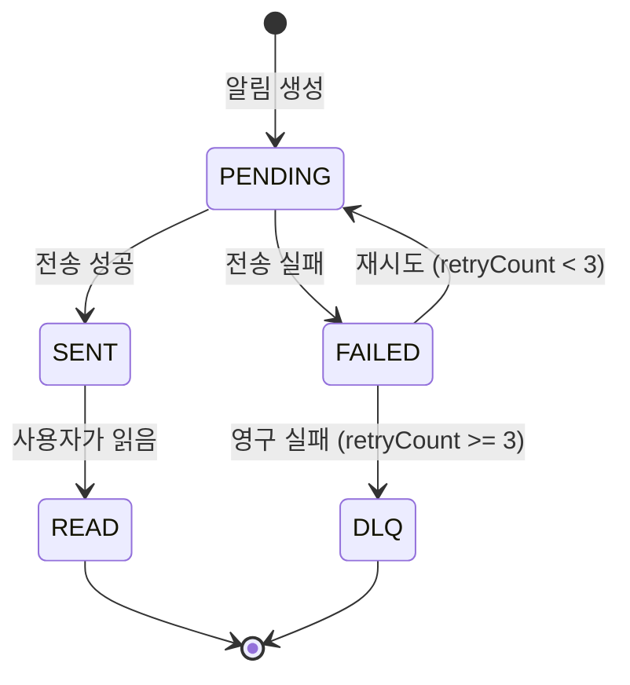
```mermaid
stateDiagram-v2
    [*] --> PENDING: 알림 생성

    PENDING --> SENT: 전송 성공
    PENDING --> FAILED: 전송 실패

    SENT --> READ: 사용자가 읽음

    FAILED --> PENDING: 재시도 (retryCount < 3)
    FAILED --> DLQ: 영구 실패 (retryCount >= 3)

    READ --> [*]
    DLQ --> [*]
```

### 5.2 지수 백오프 재시도

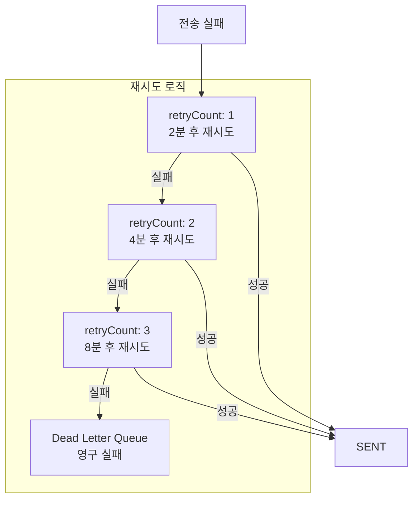
```mermaid
flowchart TB
    subgraph Retry["재시도 로직"]
        R1[retryCount: 1<br/>2분 후 재시도]
        R2[retryCount: 2<br/>4분 후 재시도]
        R3[retryCount: 3<br/>8분 후 재시도]
        DLQ[Dead Letter Queue<br/>영구 실패]
    end

    FAIL[전송 실패] --> R1
    R1 -->|실패| R2
    R2 -->|실패| R3
    R3 -->|실패| DLQ

    R1 -->|성공| SENT[SENT]
    R2 -->|성공| SENT
    R3 -->|성공| SENT
```

### 5.3 스케줄러 작업

```mermaid
flowchart LR
    subgraph Cron["SchedulerService"]
        C1[매분<br/>예약 알림 처리]
        C2[매분<br/>재시도 (백오프)]
        C3[5분마다<br/>DLQ 이동]
        C4[매시간<br/>DLQ 통계]
        C5[매일 자정<br/>DLQ 정리]
    end

    C1 --> |scheduledAt <= now| PENDING
    C2 --> |FAILED + 백오프 충족| RETRY
    C3 --> |retryCount >= 3| DLQ
    C5 --> |30일 이상| DELETE
```

### 5.4 Dead Letter Queue 관리

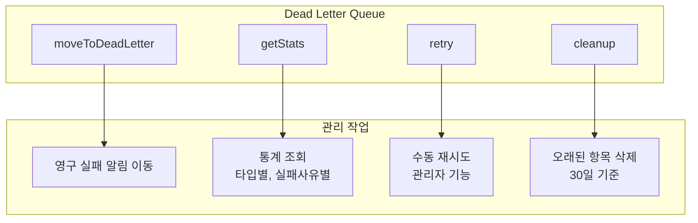
```mermaid
flowchart TB
    subgraph DLQ["Dead Letter Queue"]
        MOVE[moveToDeadLetter]
        STATS[getStats]
        RETRY[retry]
        CLEANUP[cleanup]
    end

    subgraph Actions["관리 작업"]
        A1[영구 실패 알림 이동]
        A2[통계 조회<br/>타입별, 실패사유별]
        A3[수동 재시도<br/>관리자 기능]
        A4[오래된 항목 삭제<br/>30일 기준]
    end

    MOVE --> A1
    STATS --> A2
    RETRY --> A3
    CLEANUP --> A4
```

---

## 6. 알림 타입 및 템플릿

### 6.1 템플릿 처리 플로우

```mermaid
flowchart LR
    subgraph Input["입력"]
        EVENT[이벤트 데이터<br/>gameName, bookingDate...]
        TYPE[알림 타입<br/>BOOKING_CONFIRMED]
    end

    subgraph Process["TemplateService"]
        FIND[템플릿 조회]
        RENDER[변수 치환]
    end

    subgraph Output["출력"]
        TITLE[제목<br/>"예약이 확정되었습니다"]
        MSG[내용<br/>"파크골프장에서 2024-01-28..."]
    end

    EVENT & TYPE --> FIND
    FIND --> RENDER
    RENDER --> TITLE & MSG
```

### 6.2 기본 템플릿

| 타입 | 제목 | 내용 |
|------|------|------|
| `BOOKING_CONFIRMED` | 예약이 확정되었습니다 - {{courseName}} | {{courseName}}에서 {{bookingDate}} {{bookingTime}} 예약이 확정되었습니다. |
| `BOOKING_CANCELLED` | 예약이 취소되었습니다 - {{courseName}} | {{courseName}}에서 {{bookingDate}} {{bookingTime}} 예약이 취소되었습니다. |
| `PAYMENT_SUCCESS` | 결제가 완료되었습니다 | {{amount}}원 결제가 완료되었습니다. |
| `PAYMENT_FAILED` | 결제가 실패했습니다 | {{amount}}원 결제가 실패했습니다. 사유: {{failureReason}} |
| `FRIEND_REQUEST` | {{fromUserName}}님이 친구 요청을 보냈습니다 | 앱에서 친구 요청을 확인해 주세요. |
| `FRIEND_ACCEPTED` | 친구 요청이 수락되었습니다 | {{toUserName}}님과 친구가 되었습니다. |
| `CHAT_MESSAGE` | {{senderName}}님의 새 메시지 | {{senderName}}: {{messagePreview}} |
| `SYSTEM_ALERT` | 시스템 공지사항 | {{alertContent}} |

---

## 7. API 엔드포인트

### 7.1 User API

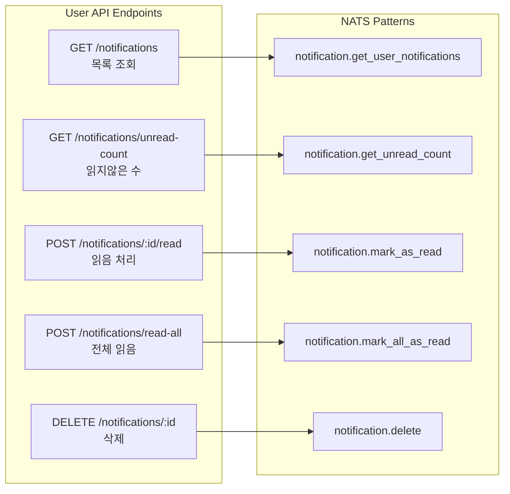
```mermaid
flowchart LR
    subgraph Endpoints["User API Endpoints"]
        GET1[GET /notifications<br/>목록 조회]
        GET2[GET /notifications/unread-count<br/>읽지않은 수]
        POST1[POST /notifications/:id/read<br/>읽음 처리]
        POST2[POST /notifications/read-all<br/>전체 읽음]
        DEL[DELETE /notifications/:id<br/>삭제]
    end

    subgraph NATS["NATS Patterns"]
        N1[notification.get_user_notifications]
        N2[notification.get_unread_count]
        N3[notification.mark_as_read]
        N4[notification.mark_all_as_read]
        N5[notification.delete]
    end

    GET1 --> N1
    GET2 --> N2
    POST1 --> N3
    POST2 --> N4
    DEL --> N5
```

### 7.2 응답 형식

```typescript
// 목록 응답 (페이지네이션)
{
  success: true,
  data: Notification[],
  total: number,
  page: number,
  limit: number,
  totalPages: number
}

// 단일 응답
{
  success: true,
  data: Notification
}

// 카운트 응답
{
  success: true,
  count: number
}
```

---

## 8. 데이터베이스 스키마

### 8.1 ERD

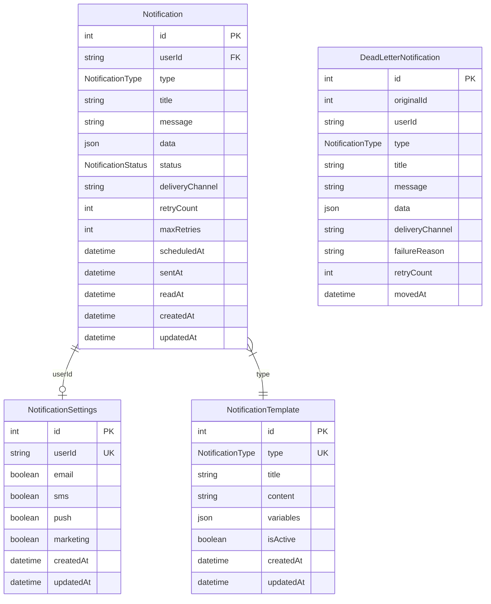
```mermaid
erDiagram
    Notification {
        int id PK
        string userId FK
        NotificationType type
        string title
        string message
        json data
        NotificationStatus status
        string deliveryChannel
        int retryCount
        int maxRetries
        datetime scheduledAt
        datetime sentAt
        datetime readAt
        datetime createdAt
        datetime updatedAt
    }

    NotificationTemplate {
        int id PK
        NotificationType type UK
        string title
        string content
        json variables
        boolean isActive
        datetime createdAt
        datetime updatedAt
    }

    NotificationSettings {
        int id PK
        string userId UK
        boolean email
        boolean sms
        boolean push
        boolean marketing
        datetime createdAt
        datetime updatedAt
    }

    DeadLetterNotification {
        int id PK
        int originalId
        string userId
        NotificationType type
        string title
        string message
        json data
        string deliveryChannel
        string failureReason
        int retryCount
        datetime movedAt
    }

    Notification ||--o| NotificationSettings : "userId"
    Notification }|--|| NotificationTemplate : "type"
```

### 8.2 인덱스 설계

| 테이블 | 인덱스 | 용도 |
|--------|--------|------|
| notifications | `(userId, status)` | 사용자별 알림 조회 |
| notifications | `(userId, readAt)` | 읽지 않은 알림 조회 |
| notifications | `(userId, createdAt DESC)` | 최신순 정렬 |
| notifications | `(status, scheduledAt)` | 예약 알림 조회 |
| notifications | `(status, retryCount)` | 재시도 대상 조회 |
| dead_letter_notifications | `(userId)` | 사용자별 DLQ 조회 |
| dead_letter_notifications | `(movedAt)` | 정리 대상 조회 |

---

## 9. 클라이언트 구현

### 9.1 플랫폼별 구현 위치

| 플랫폼 | API | 화면 | ViewModel |
|--------|-----|------|-----------|
| Web | `lib/api/notificationApi.ts` | `pages/NotificationsPage.tsx` | React Query hooks |
| iOS | `Core/Network/NotificationService.swift` | `Features/Notifications/NotificationsView.swift` | `NotificationsViewModel.swift` |
| Android | `data/remote/api/NotificationApi.kt` | `feature/notifications/NotificationsScreen.kt` | `NotificationsViewModel.kt` |

### 9.2 알림 탭 시 화면 이동

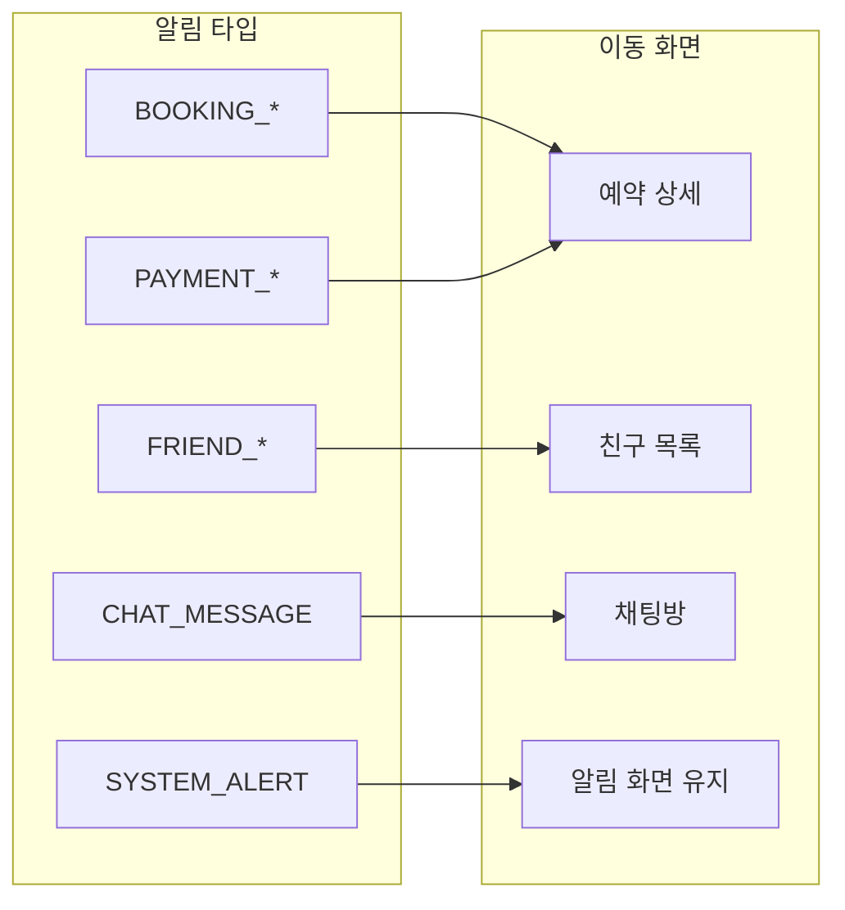
```mermaid
flowchart LR
    subgraph Types["알림 타입"]
        T1[BOOKING_*]
        T2[PAYMENT_*]
        T3[FRIEND_*]
        T4[CHAT_MESSAGE]
        T5[SYSTEM_ALERT]
    end

    subgraph Screens["이동 화면"]
        S1[예약 상세]
        S2[친구 목록]
        S3[채팅방]
        S4[알림 화면 유지]
    end

    T1 & T2 --> S1
    T3 --> S2
    T4 --> S3
    T5 --> S4
```

---

## 10. 설정 및 환경변수

### 10.1 notify-service 환경변수

| 변수명 | 설명 | 필수 |
|--------|------|------|
| `DATABASE_URL` | PostgreSQL 연결 문자열 | O |
| `NATS_URL` | NATS 서버 URL | O |
| `GCP_SA_KEY` | GCP 서비스 계정 키 (FCM용) | O |
| `FIREBASE_PROJECT_ID` | Firebase 프로젝트 ID | - |
| `FIREBASE_CLIENT_EMAIL` | Firebase 클라이언트 이메일 | - |
| `FIREBASE_PRIVATE_KEY` | Firebase 비공개 키 | - |

> `GCP_SA_KEY`가 설정되면 개별 Firebase 변수는 불필요

### 10.2 Firebase 설정 방법

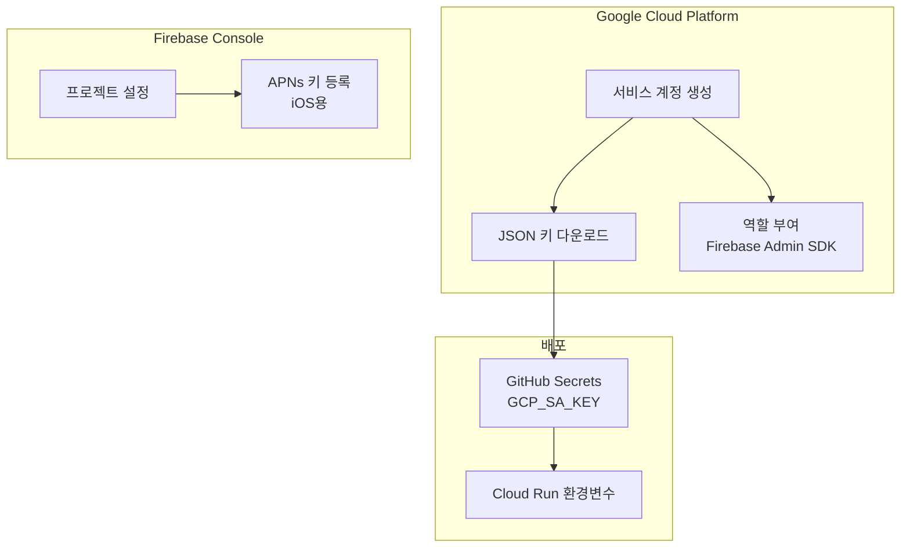
```mermaid
flowchart TB
    subgraph GCP["Google Cloud Platform"]
        SA[서비스 계정 생성]
        KEY[JSON 키 다운로드]
        ROLE[역할 부여<br/>Firebase Admin SDK]
    end

    subgraph Firebase["Firebase Console"]
        PROJ[프로젝트 설정]
        APNS[APNs 키 등록<br/>iOS용]
    end

    subgraph Deploy["배포"]
        SECRET[GitHub Secrets<br/>GCP_SA_KEY]
        ENV[Cloud Run 환경변수]
    end

    SA --> KEY --> SECRET
    SA --> ROLE
    SECRET --> ENV
    PROJ --> APNS
```

### 10.3 APNs 설정 (iOS Push)

1. **Apple Developer Program** 등록 ($99/년)
2. **App ID** 생성 (Push Notifications 활성화)
3. **APNs Key** 생성 (.p8 파일 다운로드)
4. **Firebase Console**에서 APNs Key 등록

> Android는 추가 설정 없이 FCM으로 바로 사용 가능

---

## 부록: 문제 해결

### 일반적인 문제

| 증상 | 원인 | 해결 |
|------|------|------|
| Push 알림 안 옴 | 디바이스 토큰 미등록 | 앱에서 토큰 등록 확인 |
| Push 알림 안 옴 | Firebase 미설정 | `GCP_SA_KEY` 환경변수 확인 |
| iOS Push 안 옴 | APNs 키 미등록 | Firebase Console에서 .p8 등록 |
| 알림 FAILED | 네트워크 오류 | 재시도 후 DLQ 확인 |

### 로그 확인

```bash
# Cloud Run 로그 확인
gcloud run logs read --service=notify-service-dev --region=asia-northeast3 --limit=100

# Firebase 초기화 확인
gcloud run logs read --service=notify-service-dev | grep -i firebase

# Push 전송 로그
gcloud run logs read --service=notify-service-dev | grep -i "FCM\|Push"
```

---

## 부록: iOS Push 알림 구현 가이드

### 현재 구현 상태

| 항목 | 상태 | 파일 위치 |
|------|------|----------|
| AppDelegate Push 권한 요청 | ✅ 완료 | `Sources/App/AppDelegate.swift` |
| APNs 토큰 수신 처리 | ✅ 완료 | `Sources/App/AppDelegate.swift` |
| PushNotificationManager | ✅ 완료 | `Sources/Core/Network/DeviceService.swift` |
| 로그인/로그아웃 연동 | ✅ 완료 | `Sources/App/ParkGolfApp.swift` |
| 알림 탭 시 화면 이동 | ✅ 완료 | `Sources/App/AppDelegate.swift` |
| Entitlements 설정 | ✅ 완료 | `Project.swift` |
| Firebase SDK 연동 | ❌ 미완료 | - |
| APNs 키 등록 | ❌ 미완료 | Firebase Console |

### 추가 작업 순서

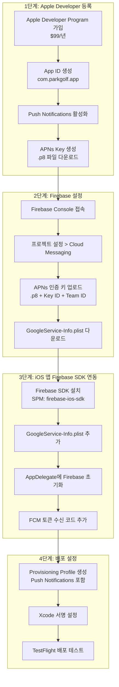
```mermaid
flowchart TB
    subgraph Step1["1단계: Apple Developer 등록"]
        A1[Apple Developer Program 가입<br/>$99/년]
        A2[App ID 생성<br/>com.parkgolf.app]
        A3[Push Notifications 활성화]
        A4[APNs Key 생성<br/>.p8 파일 다운로드]
    end

    subgraph Step2["2단계: Firebase 설정"]
        B1[Firebase Console 접속]
        B2[프로젝트 설정 > Cloud Messaging]
        B3[APNs 인증 키 업로드<br/>.p8 + Key ID + Team ID]
        B4[GoogleService-Info.plist 다운로드]
    end

    subgraph Step3["3단계: iOS 앱 Firebase SDK 연동"]
        C1[Firebase SDK 설치<br/>SPM: firebase-ios-sdk]
        C2[GoogleService-Info.plist 추가]
        C3[AppDelegate에 Firebase 초기화]
        C4[FCM 토큰 수신 코드 추가]
    end

    subgraph Step4["4단계: 배포 설정"]
        D1[Provisioning Profile 생성<br/>Push Notifications 포함]
        D2[Xcode 서명 설정]
        D3[TestFlight 배포 테스트]
    end

    A1 --> A2 --> A3 --> A4
    A4 --> B1
    B1 --> B2 --> B3 --> B4
    B4 --> C1
    C1 --> C2 --> C3 --> C4
    C4 --> D1
    D1 --> D2 --> D3
```

### 1단계: Apple Developer Program 등록

1. **Apple Developer Program 가입**
   - https://developer.apple.com/programs/ 접속
   - 연간 $99 (약 13만원)
   - 등록 완료까지 24-48시간 소요

2. **App ID 생성**
   - Certificates, Identifiers & Profiles > Identifiers
   - Bundle ID: `com.parkgolf.app`
   - Capabilities에서 "Push Notifications" 체크

3. **APNs Key 생성**
   - Keys 메뉴에서 새 키 생성
   - "Apple Push Notifications service (APNs)" 체크
   - `.p8` 파일 다운로드 (한 번만 가능, 안전하게 보관)
   - Key ID 기록 (10자리 영숫자)

### 2단계: Firebase Console 설정

1. **Firebase Console** 접속: https://console.firebase.google.com

2. **프로젝트 설정 > Cloud Messaging**

3. **APNs 인증 키 등록**
   - "Apple 앱 구성" 섹션
   - APNs 인증 키 업로드 (.p8 파일)
   - Key ID 입력
   - Team ID 입력 (Apple Developer 계정에서 확인)

4. **GoogleService-Info.plist 다운로드**
   - 프로젝트 설정 > 일반 > iOS 앱
   - `GoogleService-Info.plist` 다운로드

### 3단계: iOS 앱 Firebase SDK 연동

#### 3.1 Firebase SDK 설치 (SPM)

`apps/user-app-ios/Tuist/Package.swift` 수정:

```swift
// Package.swift
dependencies: [
    .package(url: "https://github.com/firebase/firebase-ios-sdk", from: "11.0.0"),
]
```

`Project.swift` dependencies 추가:

```swift
dependencies: [
    .external(name: "Alamofire"),
    .external(name: "KeychainAccess"),
    .external(name: "SocketIO"),
    .external(name: "FirebaseMessaging"),  // 추가
]
```

#### 3.2 GoogleService-Info.plist 추가

- `apps/user-app-ios/Resources/GoogleService-Info.plist` 위치에 파일 복사

#### 3.3 AppDelegate Firebase 초기화

```swift
// AppDelegate.swift
import FirebaseCore
import FirebaseMessaging

class AppDelegate: NSObject, UIApplicationDelegate, UNUserNotificationCenterDelegate, MessagingDelegate {

    func application(_ application: UIApplication,
                     didFinishLaunchingWithOptions launchOptions: [UIApplication.LaunchOptionsKey: Any]?) -> Bool {
        // Firebase 초기화
        FirebaseApp.configure()

        // FCM delegate 설정
        Messaging.messaging().delegate = self

        // 기존 Push 알림 설정...
        UNUserNotificationCenter.current().delegate = self
        requestPushNotificationPermission(application: application)

        return true
    }

    // APNs 토큰 수신 시 FCM에 전달
    func application(_ application: UIApplication,
                     didRegisterForRemoteNotificationsWithDeviceToken deviceToken: Data) {
        // FCM에 APNs 토큰 전달 (FCM이 자체 토큰 생성)
        Messaging.messaging().apnsToken = deviceToken
    }

    // MARK: - MessagingDelegate

    // FCM 토큰 수신 (서버에 등록할 토큰)
    func messaging(_ messaging: Messaging, didReceiveRegistrationToken fcmToken: String?) {
        guard let token = fcmToken else { return }
        print("[FCM] Token received: \(token.prefix(20))...")

        Task {
            await PushNotificationManager.shared.setFCMToken(token)
            await PushNotificationManager.shared.registerDeviceIfNeeded()
        }
    }
}
```

#### 3.4 PushNotificationManager FCM 토큰 지원

```swift
// DeviceService.swift - PushNotificationManager 수정
actor PushNotificationManager {
    static let shared = PushNotificationManager()

    private var fcmToken: String?  // APNs 대신 FCM 토큰 사용
    private var isRegistered = false
    private let deviceService = DeviceService.shared

    /// FCM 토큰 설정 (MessagingDelegate에서 호출)
    func setFCMToken(_ token: String) {
        self.fcmToken = token
        print("[PushNotificationManager] FCM Token set: \(token.prefix(20))...")
    }

    /// 서버에 디바이스 등록
    func registerDeviceIfNeeded() async {
        guard let token = fcmToken else {
            print("[PushNotificationManager] No FCM token available")
            return
        }

        guard !isRegistered else { return }

        do {
            let response = try await deviceService.registerDevice(deviceToken: token)
            isRegistered = true
            print("[PushNotificationManager] Device registered: ID=\(response.id)")
        } catch {
            print("[PushNotificationManager] Registration failed: \(error)")
        }
    }

    // ... 나머지 메서드 동일
}
```

### 4단계: 배포 설정

#### Provisioning Profile 생성

1. Apple Developer > Profiles
2. iOS App Development (개발용) 또는 App Store (배포용) 선택
3. App ID 선택 (Push Notifications 포함된 것)
4. 인증서 및 디바이스 선택
5. 프로필 다운로드

#### Xcode 서명 설정

```swift
// Project.swift - entitlements 수정 (배포용)
entitlements: .dictionary([
    "aps-environment": .string("production"),  // development → production
]),
```

### APNs 토큰 vs FCM 토큰 비교

```mermaid
flowchart TB
    subgraph Current["현재 구현 (APNs 직접)"]
        C1[앱 시작] --> C2[APNs 토큰 수신<br/>Data 타입]
        C2 --> C3[Hex 문자열 변환]
        C3 --> C4[서버 등록<br/>64자 hex]
        C4 --> C5[서버에서 FCM API 호출 시<br/>APNs 토큰 사용 불가 ❌]
    end

    subgraph Target["목표 구현 (FCM 연동)"]
        T1[앱 시작] --> T2[Firebase 초기화]
        T2 --> T3[APNs 토큰 → FCM 전달]
        T3 --> T4[FCM 토큰 수신<br/>String 타입, ~150자]
        T4 --> T5[서버 등록]
        T5 --> T6[서버에서 FCM API로<br/>Push 전송 ✅]
    end
```

### 테스트 방법

#### 개발 환경 테스트

```bash
# Firebase Console > Cloud Messaging > 테스트 메시지 전송
# FCM 토큰 입력 후 테스트 전송
```

#### 서버 로그 확인

```bash
# notify-service 로그에서 Push 전송 확인
gcloud run logs read --service=notify-service-dev | grep -i "FCM\|Push"

# 예상 로그:
# [PushService] Sending push to user 123 (2 devices)
# [PushService] FCM multicast result: 2 success, 0 failures
```

### 예상 일정

| 작업 | 예상 소요 |
|------|----------|
| Apple Developer 가입 | 1-2일 (심사) |
| APNs Key 생성 | 30분 |
| Firebase 설정 | 30분 |
| iOS SDK 연동 | 2-4시간 |
| 테스트 및 디버깅 | 1-2일 |

> **참고**: Apple Developer Program 가입 완료 후 진행하세요.
