# Notification System

Park Golf Platform 알림 시스템 아키텍처 및 워크플로우 문서입니다.

## 목차

1. [시스템 개요](#1-시스템-개요)
2. [아키텍처](#2-아키텍처)
3. [이벤트 플로우](#3-이벤트-플로우)
4. [Push 알림 (FCM/APNs)](#4-push-알림-fcmapns)
5. [재시도 및 Dead Letter Queue](#5-재시도-및-dead-letter-queue)
6. [알림 타입 및 템플릿](#6-알림-타입-및-템플릿)
7. [API 엔드포인트](#7-api-엔드포인트)
8. [데이터베이스 스키마](#8-데이터베이스-스키마)
9. [클라이언트 구현](#9-클라이언트-구현)
10. [실시간 알림 (WebSocket)](#10-실시간-알림-websocket)
11. [설정 및 환경변수](#11-설정-및-환경변수)
12. [부록: iOS Push 알림 구현 가이드](#부록-ios-push-알림-구현-가이드)

---

## 1. 시스템 개요

### 핵심 기능

| 기능 | 설명 |
|------|------|
| **이벤트 기반 알림** | 예약, 친구, 채팅 등 이벤트 발생 시 자동 알림 생성 |
| **Push 알림** | FCM을 통한 Android/iOS 실시간 푸시 |
| **템플릿 시스템** | 알림 타입별 템플릿 및 변수 치환 |
| **재시도 로직** | 지수 백오프 기반 자동 재시도 |
| **Dead Letter Queue** | 영구 실패 알림 별도 관리 |
| **사용자 설정** | 채널별 알림 수신 설정 |

### 알림 타입 (8종)

```mermaid
mindmap
  root((알림 타입))
    예약
      BOOKING_CONFIRMED
      BOOKING_CANCELLED
    결제
      PAYMENT_SUCCESS
      PAYMENT_FAILED
    소셜
      FRIEND_REQUEST
      FRIEND_ACCEPTED
      CHAT_MESSAGE
    시스템
      SYSTEM_ALERT
```

---

## 2. 아키텍처

### 전체 시스템 구조

```mermaid
flowchart TB
    subgraph Clients["클라이언트"]
        WEB[Web App<br/>React]
        IOS[iOS App<br/>SwiftUI]
        AND[Android App<br/>Compose]
    end

    subgraph BFF["BFF Layer"]
        UAPI[user-api<br/>NestJS]
    end

    subgraph Services["Microservices"]
        IAM[iam-service<br/>인증/친구]
        BOOK[booking-service<br/>예약/Saga]
        CHAT[chat-service<br/>채팅]
        NOTIFY[notify-service<br/>알림]
    end

    subgraph External["External Services"]
        FCM[Firebase Cloud Messaging]
        APNS[Apple Push<br/>Notification Service]
    end

    subgraph Storage["Storage"]
        DB[(PostgreSQL<br/>notify_db)]
        DLQ[(Dead Letter<br/>Queue)]
    end

    WEB & IOS & AND -->|REST API| UAPI
    UAPI -->|NATS Request| NOTIFY

    IAM -->|friend.request<br/>friend.accepted| NATS
    BOOK -->|booking.confirmed<br/>booking.cancelled| NATS
    CHAT -->|chat.message| NATS

    NATS{NATS} -->|Event| NOTIFY

    NOTIFY -->|저장| DB
    NOTIFY -->|영구 실패| DLQ
    NOTIFY -->|Android/iOS| FCM
    FCM -->|iOS 브릿지| APNS

    FCM -.->|Push| AND
    APNS -.->|Push| IOS
```

### notify-service 내부 구조

```mermaid
flowchart LR
    subgraph Controller["Controller Layer"]
        NC[NotificationNatsController<br/>이벤트/메시지 핸들러]
    end

    subgraph Services["Service Layer"]
        NS[NotificationService<br/>알림 CRUD]
        TS[TemplateService<br/>템플릿 관리]
        DS[DeliveryService<br/>배달 실행]
        PS[PushService<br/>FCM 연동]
        DLS[DeadLetterService<br/>DLQ 관리]
        PREF[PreferencesService<br/>사용자 설정]
        SCHED[SchedulerService<br/>Cron 작업]
    end

    subgraph External["External"]
        NATS{NATS}
        IAM[iam-service<br/>디바이스 토큰]
        FCM[Firebase<br/>FCM]
    end

    NATS -->|Event/Message| NC
    NC --> NS
    NC --> TS
    NC --> DS

    NS --> DB[(DB)]
    DS --> PREF
    DS --> PS
    PS -->|users.devices.tokens| IAM
    PS --> FCM

    SCHED -->|매분| DS
    SCHED -->|5분마다| DLS
    DLS --> DB
```

---

## 3. 이벤트 플로우

### 3.1 예약 확정 알림

```mermaid
sequenceDiagram
    participant C as Client
    participant UA as user-api
    participant BS as booking-service
    participant CS as course-service
    participant NS as notify-service
    participant FCM as FCM/APNs

    C->>UA: POST /bookings
    UA->>BS: NATS: booking.create
    BS->>CS: NATS: slot.reserve
    CS-->>BS: slot.reserved (Event)

    Note over BS: Saga: PENDING → CONFIRMED

    BS-->>NS: booking.confirmed (Event)

    activate NS
    NS->>NS: 템플릿 조회 (BOOKING_CONFIRMED)
    NS->>NS: 변수 치환 (gameName, bookingDate...)
    NS->>NS: 알림 저장 (status: PENDING)
    NS->>NS: 사용자 설정 확인
    NS->>FCM: Push 전송
    FCM-->>C: Push 알림 수신
    NS->>NS: 상태 변경 (status: SENT)
    deactivate NS

    UA-->>C: 예약 완료 응답
```

### 3.2 친구 요청/수락 알림

```mermaid
sequenceDiagram
    participant A as User A (요청자)
    participant UA as user-api
    participant IAM as iam-service
    participant NS as notify-service
    participant B as User B (수신자)

    Note over A,B: 친구 요청 플로우
    A->>UA: POST /friends/request {toUserId: B}
    UA->>IAM: NATS: friends.request
    IAM->>IAM: 친구 요청 저장
    IAM-->>NS: friend.request (Event)
    NS->>NS: 알림 생성 (userId: B)
    NS-->>B: Push: "A님이 친구 요청을 보냈습니다"

    Note over A,B: 친구 수락 플로우
    B->>UA: POST /friends/accept {requestId}
    UA->>IAM: NATS: friends.accept
    IAM->>IAM: 친구 관계 생성 (양방향)
    IAM-->>NS: friend.accepted (Event)
    NS->>NS: 알림 생성 (userId: A)
    NS-->>A: Push: "B님과 친구가 되었습니다"
```

### 3.3 채팅 메시지 알림

```mermaid
sequenceDiagram
    participant S as Sender
    participant CG as chat-gateway
    participant CS as chat-service
    participant NS as notify-service
    participant R as Recipient

    S->>CG: WebSocket: sendMessage
    CG->>CS: NATS: chat.messages.create
    CS->>CS: 메시지 저장

    alt 수신자가 오프라인
        CS-->>NS: chat.message (Event)
        NS->>NS: 알림 생성
        NS-->>R: Push: "S님의 새 메시지"
    else 수신자가 온라인
        CG-->>R: WebSocket: newMessage
    end
```

### NATS 이벤트 패턴 요약


---

## 4. Push 알림 (FCM/APNs)

### 4.1 Push 전송 플로우

```mermaid
sequenceDiagram
    participant NS as notify-service
    participant PS as PushService
    participant IAM as iam-service
    participant FCM as Firebase FCM
    participant APNS as Apple APNs
    participant Device as Android/iOS

    NS->>PS: sendPushNotification(userId, payload)
    PS->>IAM: NATS: users.devices.tokens
    IAM-->>PS: [{platform: IOS, token}, {platform: ANDROID, token}]

    PS->>FCM: sendEachForMulticast(tokens, message)

    Note over FCM,Device: Android: FCM 직접 전송
    FCM-->>Device: Push (Android)

    Note over FCM,Device: iOS: APNs 브릿지 경유
    FCM->>APNS: APNs 전달
    APNS-->>Device: Push (iOS)

    FCM-->>PS: {successCount: 2, failureCount: 0}
    PS-->>NS: PushResult
```

### 4.2 플랫폼별 메시지 구조


### 4.3 디바이스 토큰 관리

```mermaid
flowchart LR
    subgraph Client["클라이언트"]
        APP[앱 시작]
        TOKEN[FCM 토큰 획득]
        REG[토큰 등록 API 호출]
    end

    subgraph Server["서버"]
        UAPI[user-api]
        IAM[iam-service]
        DB[(user_devices<br/>platform, deviceToken,<br/>deviceId, isActive)]
    end

    APP --> TOKEN --> REG
    REG -->|POST /devices/register| UAPI
    UAPI -->|users.devices.register| IAM
    IAM --> DB
```

---

## 5. 재시도 및 Dead Letter Queue

### 5.1 알림 상태 전이

```mermaid
stateDiagram-v2
    [*] --> PENDING: 알림 생성

    PENDING --> SENT: 전송 성공
    PENDING --> FAILED: 전송 실패

    SENT --> READ: 사용자가 읽음

    FAILED --> PENDING: 재시도 (retryCount < 3)
    FAILED --> DLQ: 영구 실패 (retryCount >= 3)

    READ --> [*]
    DLQ --> [*]
```

### 5.2 지수 백오프 재시도

```mermaid
flowchart TB
    subgraph Retry["재시도 로직"]
        R1[retryCount: 1<br/>2분 후 재시도]
        R2[retryCount: 2<br/>4분 후 재시도]
        R3[retryCount: 3<br/>8분 후 재시도]
        DLQ[Dead Letter Queue<br/>영구 실패]
    end

    FAIL[전송 실패] --> R1
    R1 -->|실패| R2
    R2 -->|실패| R3
    R3 -->|실패| DLQ

    R1 -->|성공| SENT[SENT]
    R2 -->|성공| SENT
    R3 -->|성공| SENT
```

### 5.3 스케줄러 작업

```mermaid
flowchart LR
    subgraph Cron["SchedulerService"]
        C1[매분<br/>예약 알림 처리]
        C2[매분<br/>재시도 (백오프)]
        C3[5분마다<br/>DLQ 이동]
        C4[매시간<br/>DLQ 통계]
        C5[매일 자정<br/>DLQ 정리]
    end

    C1 --> |scheduledAt <= now| PENDING
    C2 --> |FAILED + 백오프 충족| RETRY
    C3 --> |retryCount >= 3| DLQ
    C5 --> |30일 이상| DELETE
```

### 5.4 Dead Letter Queue 관리

```mermaid
flowchart TB
    subgraph DLQ["Dead Letter Queue"]
        MOVE[moveToDeadLetter]
        STATS[getStats]
        RETRY[retry]
        CLEANUP[cleanup]
    end

    subgraph Actions["관리 작업"]
        A1[영구 실패 알림 이동]
        A2[통계 조회<br/>타입별, 실패사유별]
        A3[수동 재시도<br/>관리자 기능]
        A4[오래된 항목 삭제<br/>30일 기준]
    end

    MOVE --> A1
    STATS --> A2
    RETRY --> A3
    CLEANUP --> A4
```

---

## 6. 알림 타입 및 템플릿

### 6.1 템플릿 처리 플로우

```mermaid
flowchart LR
    subgraph Input["입력"]
        EVENT[이벤트 데이터<br/>gameName, bookingDate...]
        TYPE[알림 타입<br/>BOOKING_CONFIRMED]
    end

    subgraph Process["TemplateService"]
        FIND[템플릿 조회]
        RENDER[변수 치환]
    end

    subgraph Output["출력"]
        TITLE[제목<br/>"예약이 확정되었습니다"]
        MSG[내용<br/>"파크골프장에서 2024-01-28..."]
    end

    EVENT & TYPE --> FIND
    FIND --> RENDER
    RENDER --> TITLE & MSG
```

### 6.2 기본 템플릿

| 타입 | 제목 | 내용 |
|------|------|------|
| `BOOKING_CONFIRMED` | 예약이 확정되었습니다 - {{courseName}} | {{courseName}}에서 {{bookingDate}} {{bookingTime}} 예약이 확정되었습니다. |
| `BOOKING_CANCELLED` | 예약이 취소되었습니다 - {{courseName}} | {{courseName}}에서 {{bookingDate}} {{bookingTime}} 예약이 취소되었습니다. |
| `PAYMENT_SUCCESS` | 결제가 완료되었습니다 | {{amount}}원 결제가 완료되었습니다. |
| `PAYMENT_FAILED` | 결제가 실패했습니다 | {{amount}}원 결제가 실패했습니다. 사유: {{failureReason}} |
| `FRIEND_REQUEST` | {{fromUserName}}님이 친구 요청을 보냈습니다 | 앱에서 친구 요청을 확인해 주세요. |
| `FRIEND_ACCEPTED` | 친구 요청이 수락되었습니다 | {{toUserName}}님과 친구가 되었습니다. |
| `CHAT_MESSAGE` | {{senderName}}님의 새 메시지 | {{senderName}}: {{messagePreview}} |
| `SYSTEM_ALERT` | 시스템 공지사항 | {{alertContent}} |

---

## 7. API 엔드포인트

### 7.1 User API

```mermaid
flowchart LR
    subgraph Endpoints["User API Endpoints"]
        GET1[GET /notifications<br/>목록 조회]
        GET2[GET /notifications/unread-count<br/>읽지않은 수]
        POST1[POST /notifications/:id/read<br/>읽음 처리]
        POST2[POST /notifications/read-all<br/>전체 읽음]
        DEL[DELETE /notifications/:id<br/>삭제]
    end

    subgraph NATS["NATS Patterns"]
        N1[notification.get_user_notifications]
        N2[notification.get_unread_count]
        N3[notification.mark_as_read]
        N4[notification.mark_all_as_read]
        N5[notification.delete]
    end

    GET1 --> N1
    GET2 --> N2
    POST1 --> N3
    POST2 --> N4
    DEL --> N5
```

### 7.2 응답 형식

```typescript
// 목록 응답 (페이지네이션)
{
  success: true,
  data: Notification[],
  total: number,
  page: number,
  limit: number,
  totalPages: number
}

// 단일 응답
{
  success: true,
  data: Notification
}

// 카운트 응답
{
  success: true,
  count: number
}
```

---

## 8. 데이터베이스 스키마

### 8.1 ERD


### 8.2 인덱스 설계

| 테이블 | 인덱스 | 용도 |
|--------|--------|------|
| notifications | `(userId, status)` | 사용자별 알림 조회 |
| notifications | `(userId, readAt)` | 읽지 않은 알림 조회 |
| notifications | `(userId, createdAt DESC)` | 최신순 정렬 |
| notifications | `(status, scheduledAt)` | 예약 알림 조회 |
| notifications | `(status, retryCount)` | 재시도 대상 조회 |
| dead_letter_notifications | `(userId)` | 사용자별 DLQ 조회 |
| dead_letter_notifications | `(movedAt)` | 정리 대상 조회 |

---

## 9. 클라이언트 구현

### 9.1 플랫폼별 구현 위치

| 플랫폼 | API | 화면 | ViewModel |
|--------|-----|------|-----------|
| Web | `lib/api/notificationApi.ts` | `pages/NotificationsPage.tsx` | React Query hooks |
| iOS | `Core/Network/NotificationService.swift` | `Features/Notifications/NotificationsView.swift` | `NotificationsViewModel.swift` |
| Android | `data/remote/api/NotificationApi.kt` | `feature/notifications/NotificationsScreen.kt` | `NotificationsViewModel.kt` |

### 9.2 알림 탭 시 화면 이동

```mermaid
flowchart LR
    subgraph Types["알림 타입"]
        T1[BOOKING_*]
        T2[PAYMENT_*]
        T3[FRIEND_*]
        T4[CHAT_MESSAGE]
        T5[SYSTEM_ALERT]
    end

    subgraph Screens["이동 화면"]
        S1[예약 상세]
        S2[친구 목록]
        S3[채팅방]
        S4[알림 화면 유지]
    end

    T1 & T2 --> S1
    T3 --> S2
    T4 --> S3
    T5 --> S4
```

---

## 10. 실시간 알림 (WebSocket)

Web 클라이언트에서 알림을 실시간으로 수신하기 위한 WebSocket 기반 구현입니다.

### 10.1 아키텍처 개요

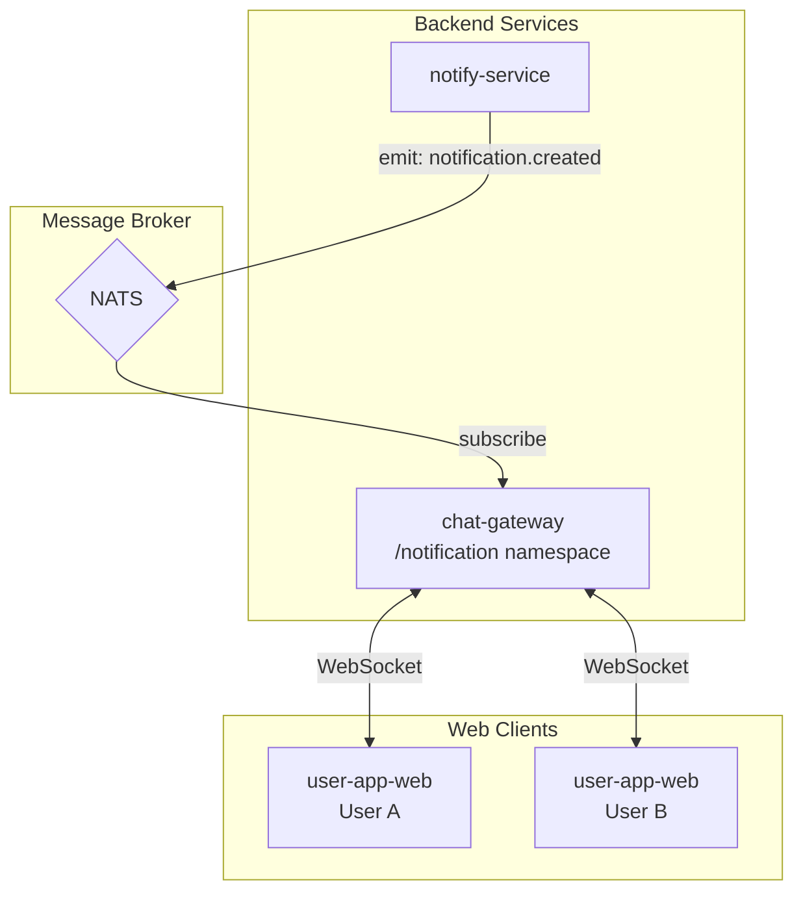

### 10.2 이벤트 플로우

```mermaid
sequenceDiagram
    participant E as 이벤트 발생<br/>(booking, friend, etc.)
    participant NS as notify-service
    participant NATS as NATS
    participant CG as chat-gateway<br/>/notification
    participant WEB as user-app-web

    Note over WEB,CG: 사용자 로그인 시 소켓 연결
    WEB->>CG: connect(token)
    CG->>CG: JWT 검증
    CG-->>WEB: connected

    Note over E,WEB: 알림 생성 및 실시간 전달
    E->>NS: 이벤트 발생
    NS->>NS: 알림 DB 저장
    NS->>NATS: emit: notification.created
    NATS->>CG: notification.created
    CG->>CG: 사용자 소켓 조회
    CG-->>WEB: notification (실시간)

    Note over WEB: React Query 캐시 무효화
    WEB->>WEB: invalidateQueries
    WEB->>WEB: UI 자동 갱신
```

### 10.3 서버 구현 (chat-gateway)

#### 네임스페이스 구조

| 네임스페이스 | 용도 | 파일 |
|-------------|------|------|
| `/chat` | 채팅 메시지 | `src/gateway/chat.gateway.ts` |
| `/notification` | 실시간 알림 | `src/notification/notification.gateway.ts` |

#### NotificationGateway 구조

```mermaid
classDiagram
    class NotificationGateway {
        -userSockets: Map~string, Set~string~~
        -onlineUsers: Map~string, WsUser~
        +handleConnection(client)
        +handleDisconnect(client)
        -subscribeToNotifications()
        -deliverNotificationToUser(notification)
    }

    class NatsService {
        +subscribeToNotifications(handler): cleanup
    }

    NotificationGateway --> NatsService: uses
```

#### 주요 이벤트

| 이벤트 | 방향 | 설명 |
|--------|------|------|
| `connected` | Server → Client | 연결 성공 확인 |
| `notification` | Server → Client | 새 알림 수신 |
| `error` | Server → Client | 인증 실패 등 오류 |

### 10.4 클라이언트 구현 (user-app-web)

#### 파일 구조

```
apps/user-app-web/src/
├── lib/socket/
│   ├── chatSocket.ts          # 채팅 소켓 (기존)
│   └── notificationSocket.ts  # 알림 소켓 (신규)
├── hooks/
│   └── useNotificationSocket.ts  # 알림 소켓 훅
└── components/
    └── PrivateRoute.tsx       # 소켓 초기화
```

#### NotificationSocketManager

```mermaid
stateDiagram-v2
    [*] --> Disconnected
    Disconnected --> Connecting: connect(token)
    Connecting --> Connected: connect event
    Connecting --> Disconnected: connect_error
    Connected --> Disconnected: disconnect
    Disconnected --> Connecting: ensureConnected / forceReconnect
```

#### 사용 예시

```typescript
// useNotificationSocket.ts
export function useNotificationSocketInitializer() {
  const queryClient = useQueryClient();
  const { token, isAuthenticated } = useAuthStore();

  useEffect(() => {
    if (!isAuthenticated || !token) {
      notificationSocket.disconnect();
      return;
    }

    notificationSocket.connect(token);

    const unsubscribe = notificationSocket.onNotification(() => {
      // 알림 수신 시 React Query 캐시 무효화
      queryClient.invalidateQueries({ queryKey: notificationKeys.all });
    });

    return () => unsubscribe();
  }, [isAuthenticated, token, queryClient]);
}
```

#### PrivateRoute에서 초기화

```typescript
// PrivateRoute.tsx
import { useNotificationSocketInitializer } from '@/hooks/useNotificationSocket';

export const PrivateRoute: React.FC = ({ children }) => {
  // 인증된 사용자에게만 알림 소켓 연결
  useNotificationSocketInitializer();

  // ... 나머지 로직
};
```

### 10.5 notify-service 이벤트 발행

```mermaid
flowchart LR
    subgraph NotificationService["NotificationService"]
        CREATE[create]
        EMIT[emitNotificationCreated]
    end

    subgraph NATS["NATS"]
        EVENT[notification.created]
    end

    CREATE --> DB[(DB 저장)]
    CREATE --> EMIT
    EMIT --> EVENT
```

#### 이벤트 페이로드

```typescript
interface NotificationEvent {
  id: number;
  userId: string;
  type: NotificationType;
  title: string;
  message: string;
  data?: Record<string, any>;
  isRead: boolean;
  createdAt: string;
}
```

### 10.6 Polling vs WebSocket 비교

| 방식 | 지연 시간 | 서버 부하 | 배터리 | 구현 복잡도 |
|------|----------|----------|--------|-----------|
| Polling (30초) | 0~30초 | 높음 | 높음 | 낮음 |
| WebSocket | 실시간 (~100ms) | 낮음 | 낮음 | 중간 |

#### 현재 구현 전략

- **기본**: WebSocket 실시간 수신
- **백업**: 5분 간격 polling (네트워크 장애 복구용)

```typescript
// notification.ts
export const useUnreadCountQuery = () => {
  return useQuery({
    queryKey: notificationKeys.unreadCount(),
    queryFn: () => notificationApi.getUnreadCount(),
    refetchInterval: 5 * 60 * 1000, // 5분 (백업용)
    refetchOnWindowFocus: true,
  });
};
```

### 10.7 연결 관리

#### 재연결 로직

```mermaid
flowchart TB
    START[연결 끊김] --> CHECK{재연결 가능?}
    CHECK -->|attempts < 10| WAIT[지수 백오프 대기<br/>3초 ~ 30초]
    CHECK -->|attempts >= 10| FAIL[재연결 포기]
    WAIT --> RECONNECT[재연결 시도]
    RECONNECT -->|성공| CONNECTED[연결됨<br/>attempts = 0]
    RECONNECT -->|실패| CHECK
```

#### 환경 설정

```typescript
// notificationSocket.ts
const SOCKET_URL = import.meta.env.VITE_CHAT_SOCKET_URL ||
  'https://chat-gateway-dev-iihuzmuufa-du.a.run.app';

const NAMESPACE = '/notification';
```

### 10.8 플랫폼별 구현 현황

| 플랫폼 | 실시간 알림 방식 | 상태 |
|--------|----------------|------|
| Web | WebSocket `/notification` | ✅ 구현 완료 |
| iOS | Push (APNs/FCM) | ✅ 구현 완료 |
| Android | Push (FCM) | 🚧 진행 중 |

---

## 11. 설정 및 환경변수

### 11.1 notify-service 환경변수

| 변수명 | 설명 | 필수 |
|--------|------|------|
| `DATABASE_URL` | PostgreSQL 연결 문자열 | O |
| `NATS_URL` | NATS 서버 URL | O |
| `GCP_SA_KEY` | GCP 서비스 계정 키 (FCM용) | O |
| `FIREBASE_PROJECT_ID` | Firebase 프로젝트 ID | - |
| `FIREBASE_CLIENT_EMAIL` | Firebase 클라이언트 이메일 | - |
| `FIREBASE_PRIVATE_KEY` | Firebase 비공개 키 | - |

> `GCP_SA_KEY`가 설정되면 개별 Firebase 변수는 불필요

### 11.2 chat-gateway 환경변수 (WebSocket)

| 변수명 | 설명 | 필수 |
|--------|------|------|
| `NATS_URL` | NATS 서버 URL | O |
| `JWT_SECRET` | JWT 토큰 검증용 시크릿 | O |
| `JWT_EXPIRATION` | JWT 만료 시간 (기본: 1h) | - |

### 11.3 user-app-web 환경변수

| 변수명 | 설명 | 기본값 |
|--------|------|--------|
| `VITE_CHAT_SOCKET_URL` | WebSocket 서버 URL | Cloud Run URL |

```bash
# .env.development
VITE_CHAT_SOCKET_URL=http://localhost:3004

# .env.production
VITE_CHAT_SOCKET_URL=https://chat-gateway-prod-xxx.run.app
```

### 11.4 Firebase 설정 방법

```mermaid
flowchart TB
    subgraph GCP["Google Cloud Platform"]
        SA[서비스 계정 생성]
        KEY[JSON 키 다운로드]
        ROLE[역할 부여<br/>Firebase Admin SDK]
    end

    subgraph Firebase["Firebase Console"]
        PROJ[프로젝트 설정]
        APNS[APNs 키 등록<br/>iOS용]
    end

    subgraph Deploy["배포"]
        SECRET[GitHub Secrets<br/>GCP_SA_KEY]
        ENV[Cloud Run 환경변수]
    end

    SA --> KEY --> SECRET
    SA --> ROLE
    SECRET --> ENV
    PROJ --> APNS
```

### 11.5 APNs 설정 (iOS Push)

1. **Apple Developer Program** 등록 ($99/년)
2. **App ID** 생성 (Push Notifications 활성화)
3. **APNs Key** 생성 (.p8 파일 다운로드)
4. **Firebase Console**에서 APNs Key 등록

> Android는 추가 설정 없이 FCM으로 바로 사용 가능

---

## 부록: 문제 해결

### 일반적인 문제

| 증상 | 원인 | 해결 |
|------|------|------|
| Push 알림 안 옴 | 디바이스 토큰 미등록 | 앱에서 토큰 등록 확인 |
| Push 알림 안 옴 | Firebase 미설정 | `GCP_SA_KEY` 환경변수 확인 |
| iOS Push 안 옴 | APNs 키 미등록 | Firebase Console에서 .p8 등록 |
| 알림 FAILED | 네트워크 오류 | 재시도 후 DLQ 확인 |
| Web 실시간 알림 안 옴 | WebSocket 연결 안 됨 | 브라우저 DevTools Network 탭 확인 |
| Web 실시간 알림 안 옴 | JWT 인증 실패 | 로그인 상태 및 토큰 유효성 확인 |
| Web 실시간 알림 안 옴 | CORS 오류 | chat-gateway CORS 설정 확인 |
| Web 알림 지연 | WebSocket 미연결 | 5분 polling으로 대체 동작 중 |

### 로그 확인

```bash
# notify-service 로그 확인
gcloud run logs read --service=notify-service-dev --region=asia-northeast3 --limit=100

# Firebase 초기화 확인
gcloud run logs read --service=notify-service-dev | grep -i firebase

# Push 전송 로그
gcloud run logs read --service=notify-service-dev | grep -i "FCM\|Push"

# chat-gateway 로그 확인 (WebSocket)
gcloud run logs read --service=chat-gateway-dev --region=asia-northeast3 --limit=100

# WebSocket 연결/알림 로그
gcloud run logs read --service=chat-gateway-dev | grep -i "NotificationSocket\|notification"

# NATS 알림 이벤트 로그
gcloud run logs read --service=notify-service-dev | grep -i "notification.created"
```

---

## 부록: iOS Push 알림 구현 가이드

### 현재 구현 상태

| 항목 | 상태 | 파일 위치 |
|------|------|----------|
| AppDelegate Push 권한 요청 | ✅ 완료 | `Sources/App/AppDelegate.swift` |
| APNs 토큰 수신 처리 | ✅ 완료 | `Sources/App/AppDelegate.swift` |
| PushNotificationManager | ✅ 완료 | `Sources/Core/Network/DeviceService.swift` |
| 로그인/로그아웃 연동 | ✅ 완료 | `Sources/App/ParkGolfApp.swift` |
| 알림 탭 시 화면 이동 | ✅ 완료 | `Sources/App/AppDelegate.swift` |
| Entitlements 설정 | ✅ 완료 | `Project.swift` |
| Firebase SDK 연동 | ❌ 미완료 | - |
| APNs 키 등록 | ❌ 미완료 | Firebase Console |

### 추가 작업 순서

```mermaid
flowchart TB
    subgraph Step1["1단계: Apple Developer 등록"]
        A1[Apple Developer Program 가입<br/>$99/년]
        A2[App ID 생성<br/>com.parkgolf.app]
        A3[Push Notifications 활성화]
        A4[APNs Key 생성<br/>.p8 파일 다운로드]
    end

    subgraph Step2["2단계: Firebase 설정"]
        B1[Firebase Console 접속]
        B2[프로젝트 설정 > Cloud Messaging]
        B3[APNs 인증 키 업로드<br/>.p8 + Key ID + Team ID]
        B4[GoogleService-Info.plist 다운로드]
    end

    subgraph Step3["3단계: iOS 앱 Firebase SDK 연동"]
        C1[Firebase SDK 설치<br/>SPM: firebase-ios-sdk]
        C2[GoogleService-Info.plist 추가]
        C3[AppDelegate에 Firebase 초기화]
        C4[FCM 토큰 수신 코드 추가]
    end

    subgraph Step4["4단계: 배포 설정"]
        D1[Provisioning Profile 생성<br/>Push Notifications 포함]
        D2[Xcode 서명 설정]
        D3[TestFlight 배포 테스트]
    end

    A1 --> A2 --> A3 --> A4
    A4 --> B1
    B1 --> B2 --> B3 --> B4
    B4 --> C1
    C1 --> C2 --> C3 --> C4
    C4 --> D1
    D1 --> D2 --> D3
```

### 1단계: Apple Developer Program 등록

1. **Apple Developer Program 가입**
   - https://developer.apple.com/programs/ 접속
   - 연간 $99 (약 13만원)
   - 등록 완료까지 24-48시간 소요

2. **App ID 생성**
   - Certificates, Identifiers & Profiles > Identifiers
   - Bundle ID: `com.parkgolf.app`
   - Capabilities에서 "Push Notifications" 체크

3. **APNs Key 생성**
   - Keys 메뉴에서 새 키 생성
   - "Apple Push Notifications service (APNs)" 체크
   - `.p8` 파일 다운로드 (한 번만 가능, 안전하게 보관)
   - Key ID 기록 (10자리 영숫자)

### 2단계: Firebase Console 설정

1. **Firebase Console** 접속: https://console.firebase.google.com

2. **프로젝트 설정 > Cloud Messaging**

3. **APNs 인증 키 등록**
   - "Apple 앱 구성" 섹션
   - APNs 인증 키 업로드 (.p8 파일)
   - Key ID 입력
   - Team ID 입력 (Apple Developer 계정에서 확인)

4. **GoogleService-Info.plist 다운로드**
   - 프로젝트 설정 > 일반 > iOS 앱
   - `GoogleService-Info.plist` 다운로드

### 3단계: iOS 앱 Firebase SDK 연동

#### 3.1 Firebase SDK 설치 (SPM)

`apps/user-app-ios/Tuist/Package.swift` 수정:

```swift
// Package.swift
dependencies: [
    .package(url: "https://github.com/firebase/firebase-ios-sdk", from: "11.0.0"),
]
```

`Project.swift` dependencies 추가:

```swift
dependencies: [
    .external(name: "Alamofire"),
    .external(name: "KeychainAccess"),
    .external(name: "SocketIO"),
    .external(name: "FirebaseMessaging"),  // 추가
]
```

#### 3.2 GoogleService-Info.plist 추가

- `apps/user-app-ios/Resources/GoogleService-Info.plist` 위치에 파일 복사

#### 3.3 AppDelegate Firebase 초기화

```swift
// AppDelegate.swift
import FirebaseCore
import FirebaseMessaging

class AppDelegate: NSObject, UIApplicationDelegate, UNUserNotificationCenterDelegate, MessagingDelegate {

    func application(_ application: UIApplication,
                     didFinishLaunchingWithOptions launchOptions: [UIApplication.LaunchOptionsKey: Any]?) -> Bool {
        // Firebase 초기화
        FirebaseApp.configure()

        // FCM delegate 설정
        Messaging.messaging().delegate = self

        // 기존 Push 알림 설정...
        UNUserNotificationCenter.current().delegate = self
        requestPushNotificationPermission(application: application)

        return true
    }

    // APNs 토큰 수신 시 FCM에 전달
    func application(_ application: UIApplication,
                     didRegisterForRemoteNotificationsWithDeviceToken deviceToken: Data) {
        // FCM에 APNs 토큰 전달 (FCM이 자체 토큰 생성)
        Messaging.messaging().apnsToken = deviceToken
    }

    // MARK: - MessagingDelegate

    // FCM 토큰 수신 (서버에 등록할 토큰)
    func messaging(_ messaging: Messaging, didReceiveRegistrationToken fcmToken: String?) {
        guard let token = fcmToken else { return }
        print("[FCM] Token received: \(token.prefix(20))...")

        Task {
            await PushNotificationManager.shared.setFCMToken(token)
            await PushNotificationManager.shared.registerDeviceIfNeeded()
        }
    }
}
```

#### 3.4 PushNotificationManager FCM 토큰 지원

```swift
// DeviceService.swift - PushNotificationManager 수정
actor PushNotificationManager {
    static let shared = PushNotificationManager()

    private var fcmToken: String?  // APNs 대신 FCM 토큰 사용
    private var isRegistered = false
    private let deviceService = DeviceService.shared

    /// FCM 토큰 설정 (MessagingDelegate에서 호출)
    func setFCMToken(_ token: String) {
        self.fcmToken = token
        print("[PushNotificationManager] FCM Token set: \(token.prefix(20))...")
    }

    /// 서버에 디바이스 등록
    func registerDeviceIfNeeded() async {
        guard let token = fcmToken else {
            print("[PushNotificationManager] No FCM token available")
            return
        }

        guard !isRegistered else { return }

        do {
            let response = try await deviceService.registerDevice(deviceToken: token)
            isRegistered = true
            print("[PushNotificationManager] Device registered: ID=\(response.id)")
        } catch {
            print("[PushNotificationManager] Registration failed: \(error)")
        }
    }

    // ... 나머지 메서드 동일
}
```

### 4단계: 배포 설정

#### Provisioning Profile 생성

1. Apple Developer > Profiles
2. iOS App Development (개발용) 또는 App Store (배포용) 선택
3. App ID 선택 (Push Notifications 포함된 것)
4. 인증서 및 디바이스 선택
5. 프로필 다운로드

#### Xcode 서명 설정

```swift
// Project.swift - entitlements 수정 (배포용)
entitlements: .dictionary([
    "aps-environment": .string("production"),  // development → production
]),
```

### APNs 토큰 vs FCM 토큰 비교

```mermaid
flowchart TB
    subgraph Current["현재 구현 (APNs 직접)"]
        C1[앱 시작] --> C2[APNs 토큰 수신<br/>Data 타입]
        C2 --> C3[Hex 문자열 변환]
        C3 --> C4[서버 등록<br/>64자 hex]
        C4 --> C5[서버에서 FCM API 호출 시<br/>APNs 토큰 사용 불가 ❌]
    end

    subgraph Target["목표 구현 (FCM 연동)"]
        T1[앱 시작] --> T2[Firebase 초기화]
        T2 --> T3[APNs 토큰 → FCM 전달]
        T3 --> T4[FCM 토큰 수신<br/>String 타입, ~150자]
        T4 --> T5[서버 등록]
        T5 --> T6[서버에서 FCM API로<br/>Push 전송 ✅]
    end
```

### 테스트 방법

#### 개발 환경 테스트

```bash
# Firebase Console > Cloud Messaging > 테스트 메시지 전송
# FCM 토큰 입력 후 테스트 전송
```

#### 서버 로그 확인

```bash
# notify-service 로그에서 Push 전송 확인
gcloud run logs read --service=notify-service-dev | grep -i "FCM\|Push"

# 예상 로그:
# [PushService] Sending push to user 123 (2 devices)
# [PushService] FCM multicast result: 2 success, 0 failures
```

### 예상 일정

| 작업 | 예상 소요 |
|------|----------|
| Apple Developer 가입 | 1-2일 (심사) |
| APNs Key 생성 | 30분 |
| Firebase 설정 | 30분 |
| iOS SDK 연동 | 2-4시간 |
| 테스트 및 디버깅 | 1-2일 |

> **참고**: Apple Developer Program 가입 완료 후 진행하세요.
