# Security Workflow - 인증/인가 아키텍처

> **작성일:** 2026-02-01
> **범위:** 전체 서비스 인증 흐름, 플랫폼별 구현, 보안 감사 결과

---

## 1. 시스템 개요

### 인증 아키텍처

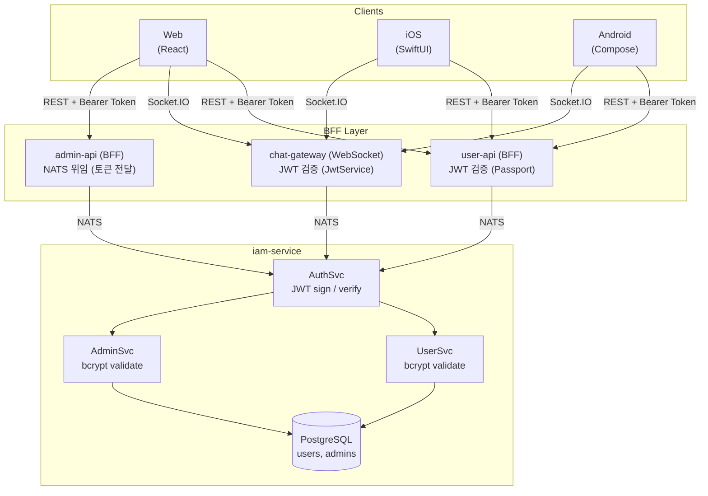

### 서비스 역할

| 서비스 | 역할 | JWT 관여 |
|--------|------|----------|
| `iam-service` | 토큰 발급/검증, 사용자/관리자 인증 (핵심 인증 서비스) | 발급 + 검증 |
| `user-api` | 사용자 BFF, JWT 로컬 검증 (Passport), NATS 중계 | 로컬 검증 |
| `admin-api` | 관리자 BFF, 토큰을 iam-service에 위임 | 없음 (NATS 위임) |
| `chat-gateway` | WebSocket 서버, 연결 시 JWT 검증 | 로컬 검증 |

---

## 2. JWT 토큰 구조

### Payload

```typescript
// User Token (type: 'user')
interface UserJwtPayload {
  email: string;     // 사용자 이메일
  sub: number;       // 사용자 ID (users.id)
  name: string;      // 사용자 이름
  roles: string[];   // 역할 코드 배열 (예: ['USER'])
  type: 'user';      // 토큰 타입 식별자
}

// Admin Token (type: 'admin')
interface AdminJwtPayload {
  email: string;     // 관리자 이메일
  sub: number;       // 관리자 ID (admins.id)
  roles: string[];   // 역할 코드 배열 (예: ['PLATFORM_ADMIN'])
  type: 'admin';     // 토큰 타입 식별자
}
```

### 만료 시간

| 토큰 | 만료 시간 | 설정 위치 |
|------|----------|-----------|
| Access Token | 1시간 (`1h`) | `iam-service/auth.module.ts:18` |
| Refresh Token | 7일 (`7d`) | `iam-service/auth.service.ts:54` (하드코딩) |

### JWT Secret 설정 (서비스별)

| 서비스 | 환경변수 | 필수 여부 | 파일 |
|--------|---------|----------|------|
| iam-service | `JWT_SECRET` | **필수** (`getOrThrow`) | `auth.module.ts:16` |
| iam-service | `JWT_REFRESH_SECRET` | **필수** (`getOrThrow`) | `auth.service.ts` (Refresh 전용) |
| user-api (JwtModule) | `JWT_SECRET` | **필수** (`getOrThrow`) | `auth.module.ts:18` |
| user-api (Passport) | `JWT_SECRET` | **필수** (`getOrThrow`) | `jwt.strategy.ts:11` |
| chat-gateway | `JWT_SECRET` | **필수** (`getOrThrow`) | `auth.module.ts:11` |
| admin-api | - | - | JWT 모듈 미사용 (NATS 위임) |

> **변경 이력 (2026-02-01):** 모든 서비스에서 하드코딩된 폴백 시크릿 제거됨. 환경변수 미설정 시 서비스 시작 실패.
> Access Token과 Refresh Token은 별도 시크릿(`JWT_SECRET`, `JWT_REFRESH_SECRET`)으로 서명됨.

---

## 3. 인증 흐름

### 3.1 사용자 로그인

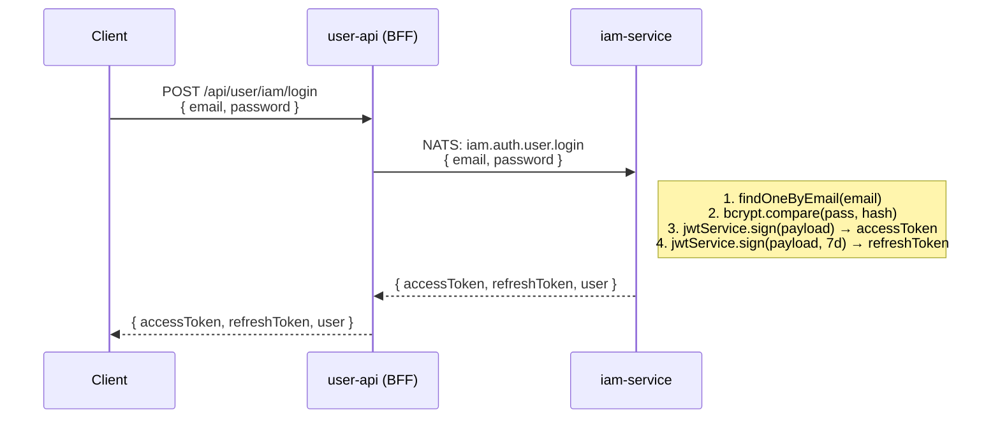

**관련 코드:**
- `services/user-api/src/auth/auth.controller.ts:50` — POST `/api/user/iam/login`
- `services/user-api/src/auth/auth.service.ts:78-106` — NATS 전송
- `services/iam-service/src/auth/auth.service.ts:19-41` — bcrypt 검증
- `services/iam-service/src/auth/auth.service.ts:43-67` — JWT 발급

### 3.2 관리자 로그인

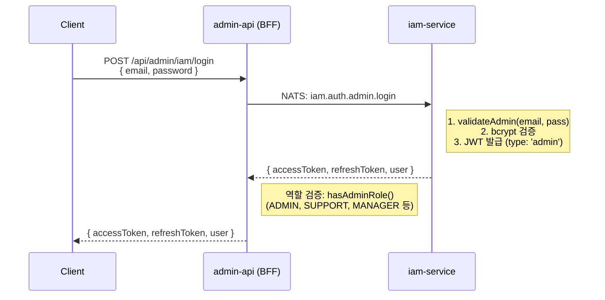

**관련 코드:**
- `services/admin-api/src/auth/auth.controller.ts:35-93` — 로그인 + 역할 검증
- `services/iam-service/src/auth/auth.service.ts:158-219` — 관리자 JWT 발급

### 3.3 토큰 갱신 (Refresh) — Token Rotation 적용

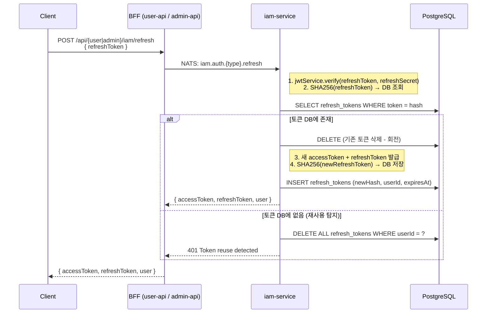

**핵심 로직:**
- **시크릿 분리:** Refresh Token은 `JWT_REFRESH_SECRET`으로 서명/검증 (Access Token과 분리)
- **토큰 해시:** SHA256으로 해싱하여 DB 저장 (원본 토큰은 서버에 미보관)
- **토큰 회전:** 갱신 시 기존 토큰 삭제 + 새 토큰 발급/저장
- **재사용 탐지:** DB에 해시가 없으면 해당 사용자의 모든 토큰 삭제 (탈취 대응)

**관련 코드:**
- `services/iam-service/src/auth/auth.service.ts` — 사용자/관리자 토큰 갱신 + DB 연동

### 3.4 로그아웃 — 서버 측 토큰 무효화

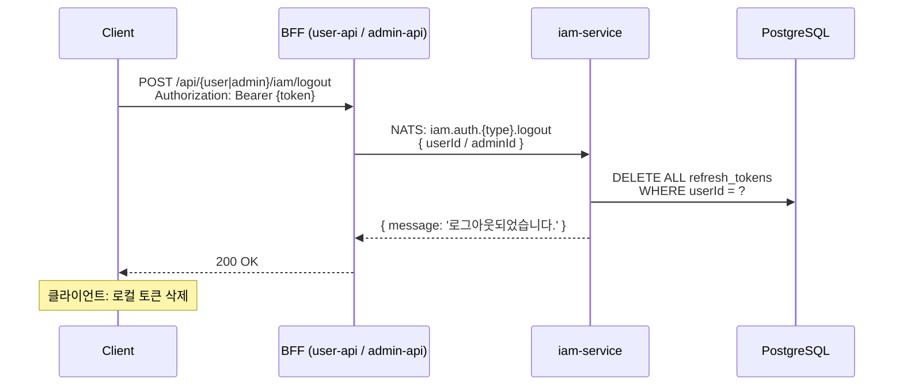

**핵심 로직:**
- **서버 측 무효화:** 로그아웃 시 해당 사용자의 모든 Refresh Token을 DB에서 삭제
- **사용자 로그아웃:** `user-api` → NATS `iam.auth.user.logout` → DB 삭제
- **관리자 로그아웃:** `admin-api` → NATS `iam.auth.admin.logout` → DB 삭제

**관련 코드:**
- `services/user-api/src/auth/auth.service.ts` — NATS 호출
- `services/admin-api/src/auth/auth.controller.ts` — `POST /api/admin/iam/logout`
- `services/iam-service/src/auth/auth.service.ts` — `logout()`, `adminLogout()`
- `services/iam-service/src/auth/auth-nats.controller.ts` — NATS 핸들러

### 3.5 WebSocket 인증 — 주기적 토큰 만료 검증

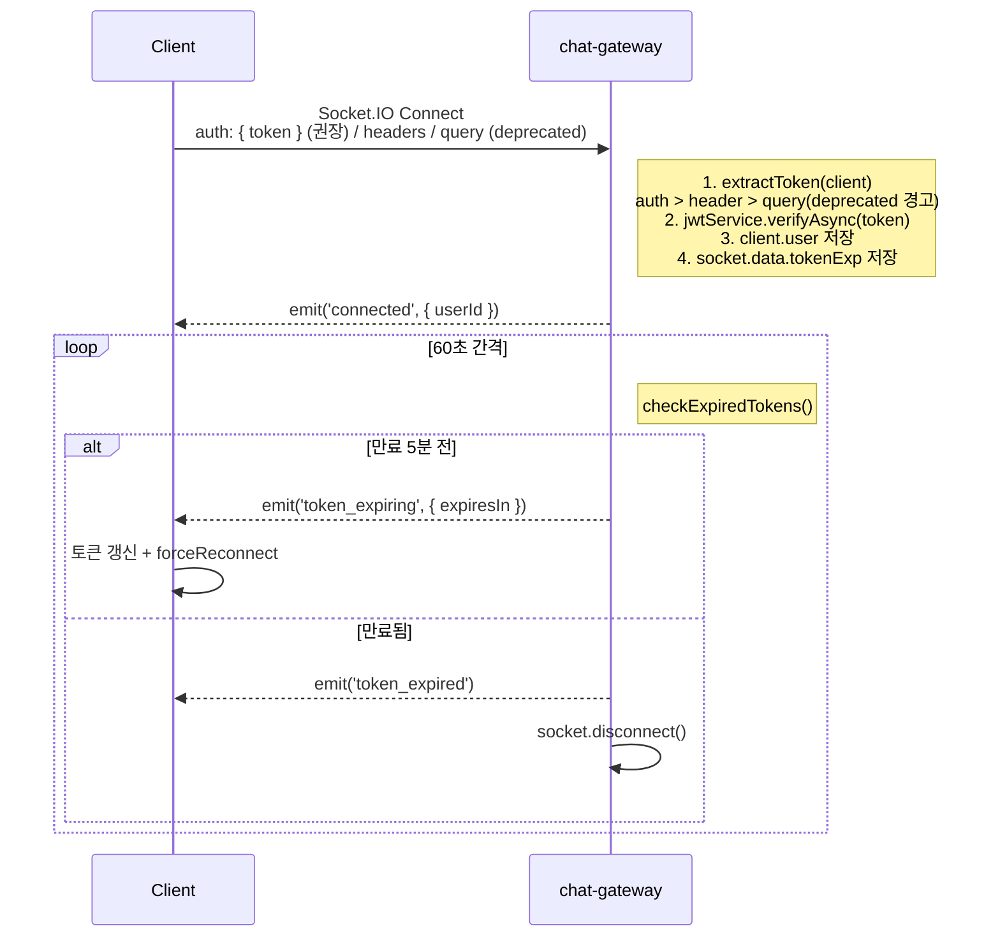

**핵심 로직:**
- **토큰 추출 우선순위:** `auth` 객체 > `Authorization` 헤더 > `query` param (deprecation 경고)
- **주기적 검증:** 60초 간격으로 `payload.exp` 기반 만료 확인
- **사전 경고:** 만료 5분 전 `token_expiring` 이벤트 → 클라이언트 토큰 갱신 + 재연결
- **만료 처리:** 만료 시 `token_expired` 이벤트 + 소켓 연결 종료

**관련 코드:**
- `services/chat-gateway/src/gateway/chat.gateway.ts` — 연결 시 인증 + 주기적 만료 검증
- `services/chat-gateway/src/auth/ws-auth.guard.ts` — 토큰 추출/검증
- `apps/user-app-web/src/lib/socket/chatSocket.ts` — `token_expiring`, `token_expired` 리스너
- `apps/user-app-web/src/lib/socket/notificationSocket.ts` — 동일

### 3.6 인증된 API 요청 (user-api)

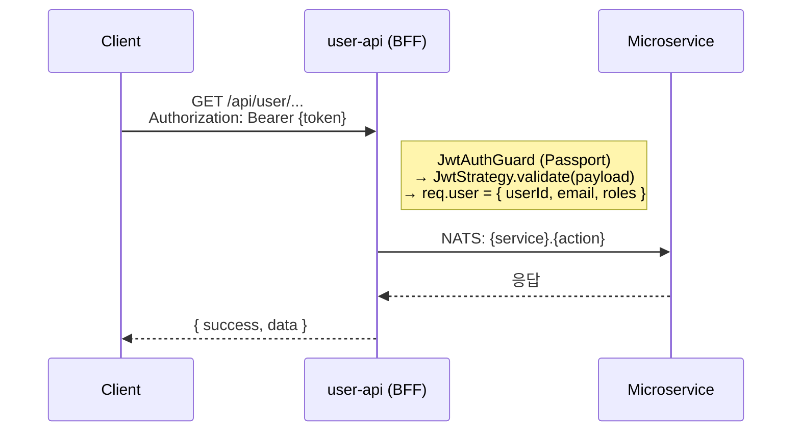

**관련 코드:**
- `services/user-api/src/auth/strategies/jwt.strategy.ts:6-22` — Passport JWT 전략

---

## 4. 플랫폼별 구현

### 4.1 Web (user-app-web)

#### 토큰 저장

- **저장소:** `localStorage`
- **키:** `accessToken`, `refreshToken`, `currentUser`
- **파일:** `apps/user-app-web/src/lib/storage.ts`

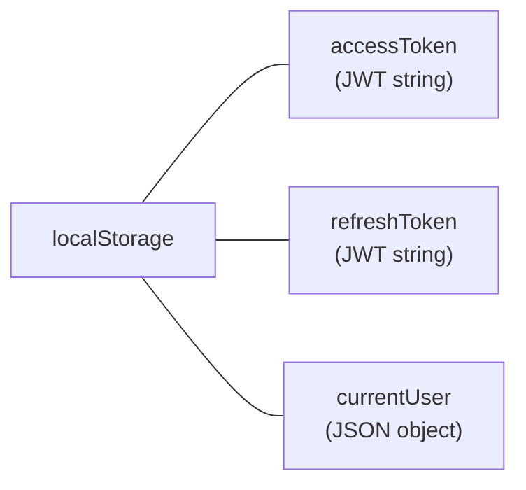

#### API 클라이언트 (토큰 갱신)

- **파일:** `apps/user-app-web/src/lib/api/client.ts`
- **전략:** Mutex 기반 단일 갱신 (Promise 공유)

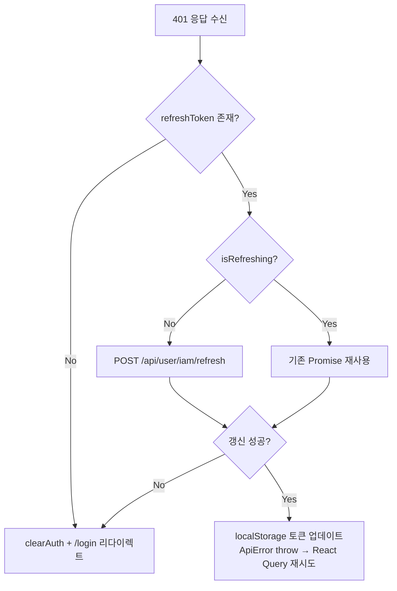

#### WebSocket 연결

- **파일:** `apps/user-app-web/src/lib/socket/chatSocket.ts`
- **인증 방식:** `auth` 객체에 토큰 전달 (동적 콜백)
- **재연결 시:** `authStorage.getToken()`으로 최신 토큰 사용
- **인증 실패 시:** `apiClient.refreshAccessToken()` 호출 후 `forceReconnect()`

### 4.2 iOS (user-app-ios)

#### 토큰 저장

- **저장소:** iOS Keychain (`KeychainAccess` 라이브러리)
- **서비스 ID:** `com.parkgolf.app`
- **접근성:** `.afterFirstUnlock`
- **파일:** `apps/user-app-ios/Sources/Core/Utils/KeychainManager.swift`

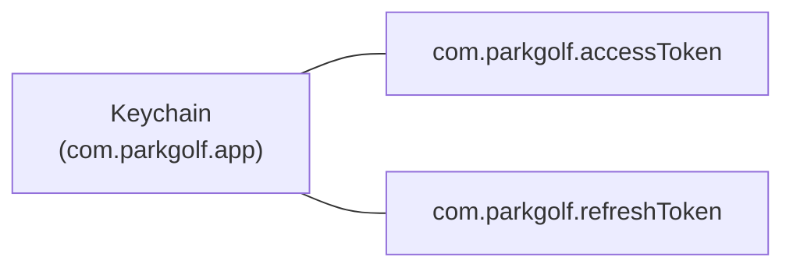

#### API 클라이언트 (토큰 갱신)

- **파일:** `apps/user-app-ios/Sources/Core/Network/APIClient.swift`
- **전략:** Swift Actor 기반 직렬화 + Task 재사용

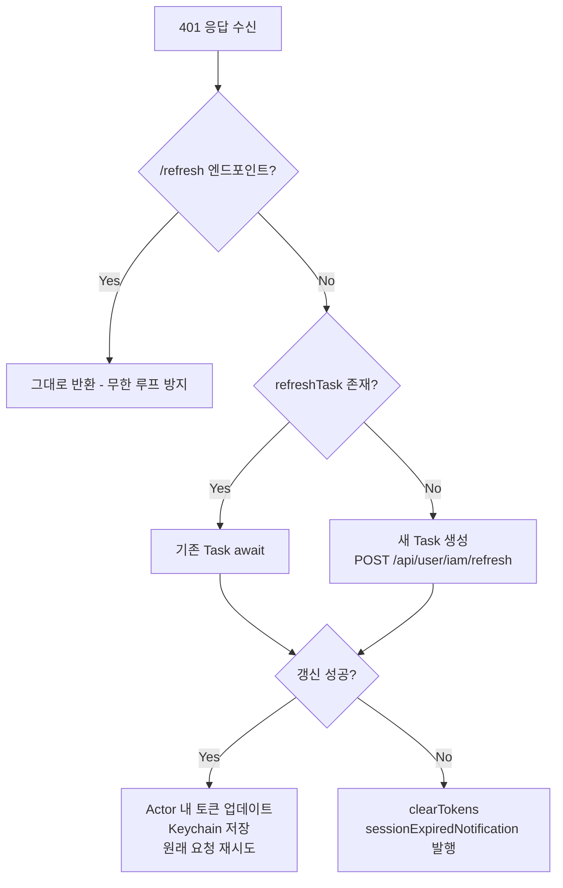

#### WebSocket 연결

- **파일:** `apps/user-app-ios/Sources/Core/Network/ChatSocketManager.swift`
- **인증 방식:** `connectParams(["token": token])` — query parameter
- **라이브러리:** SocketIO (Swift)
- **재연결:** 무제한 (`reconnectAttempts: -1`), 최대 30초 대기

### 4.3 Android (user-app-android)

#### 토큰 저장

- **저장소:** Jetpack DataStore (Preferences) + AtomicReference 캐시
- **파일:** `apps/user-app-android/.../datastore/AuthPreferences.kt`

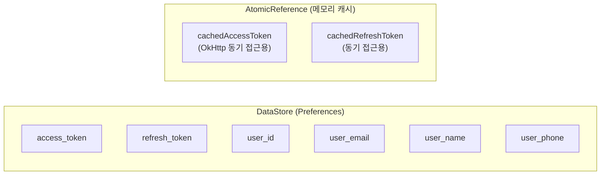

#### API 클라이언트 (토큰 갱신)

- **파일:** `apps/user-app-android/.../interceptor/TokenAuthenticator.kt`
- **전략:** OkHttp `Authenticator` + `synchronized` 블록

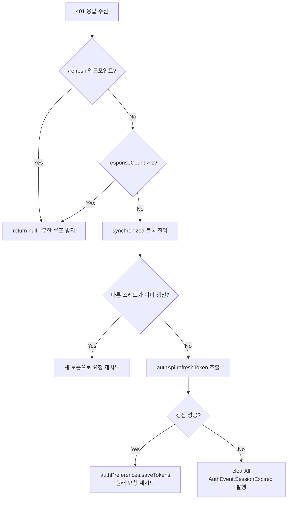

---

## 5. 보안 현황

### 5.1 강점

| # | 항목 | 설명 |
|---|------|------|
| S1 | bcrypt 패스워드 해싱 | `iam-service`에서 bcrypt 사용, 안전한 패스워드 저장 |
| S2 | 토큰 타입 분리 | `type: 'user' | 'admin'` 으로 사용자/관리자 토큰 구분 |
| S3 | BFF 패턴 | 마이크로서비스 직접 노출 방지, BFF에서 역할 검증 수행 |
| S4 | 관리자 역할 검증 | admin-api에서 `hasAdminRole()` 으로 관리자 엔드포인트 보호 |
| S5 | iOS Keychain 저장 | iOS에서 토큰을 Keychain에 안전하게 저장 |
| S6 | Android DataStore | EncryptedSharedPreferences 대비 낮지만 앱 샌드박스 내 보호 |
| S7 | 동시 갱신 방지 | 모든 플랫폼에서 동시 토큰 갱신 요청 직렬화 |
| S8 | Passport 만료 검증 | user-api에서 `ignoreExpiration: false` 설정 |
| S9 | CORS 화이트리스트 | 명시적 도메인 허용 목록 사용, `CORS_ALLOWED_ORIGINS` 환경변수 지원 |
| S10 | ValidationPipe | `whitelist: true`, `forbidNonWhitelisted: true` 설정 |
| S11 | Refresh Token Rotation | 갱신 시 기존 토큰 삭제 + 새 토큰 발급. 재사용 탐지 시 전체 무효화 |
| S12 | Access/Refresh 시크릿 분리 | `JWT_SECRET`과 `JWT_REFRESH_SECRET` 별도 사용 |
| S13 | Rate Limiting | `@nestjs/throttler`로 인증 엔드포인트 brute force 방어 (5req/60s) |
| S14 | WebSocket 토큰 만료 검증 | 60초 간격 주기적 검증, 만료 전 경고 + 만료 시 연결 종료 |
| S15 | 패스워드 정책 | 영문+숫자+특수문자 필수, 8~128자 제한 |

### 5.2 취약점 및 조치 현황

#### CRITICAL — 모두 해결됨 (2026-02-01)

| # | 문제 | 상태 | 조치 내용 |
|---|------|------|----------|
| C1 | **JWT 시크릿 폴백 불일치** | **해결** | 모든 서비스에서 하드코딩된 폴백 시크릿 제거. `configService.getOrThrow('JWT_SECRET')` 사용으로 환경변수 필수화. 미설정 시 서비스 시작 실패 |
| C2 | **Access/Refresh 동일 시크릿** | **해결** | `JWT_REFRESH_SECRET` 환경변수 도입. Refresh Token은 별도 시크릿으로 서명/검증. Access Token 탈취 시 Refresh Token 위조 불가 |
| C3 | **Refresh Token 무효화 없음** | **해결** | 기존 Prisma 모델(`RefreshToken`, `AdminRefreshToken`) 활용. 로그인 시 SHA256 해시 DB 저장. 로그아웃 시 해당 사용자의 모든 토큰 삭제. NATS `iam.auth.user.logout` / `iam.auth.admin.logout` 핸들러 추가 |

#### HIGH — 모두 해결됨 (2026-02-01)

| # | 문제 | 상태 | 조치 내용 |
|---|------|------|----------|
| H1 | **Refresh Token 회전 미적용** | **해결** | 갱신 시 기존 토큰 삭제 + 새 토큰 발급/DB 저장 (Token Rotation). 재사용 탐지: DB에 해시가 없으면 해당 사용자의 모든 토큰 삭제 |
| H2 | **인증 엔드포인트 Rate Limit 없음** | **해결** | `@nestjs/throttler` 적용. 글로벌: 60req/60s. 인증 엔드포인트(login, register, signup): 5req/60s |
| H3 | **WebSocket 장시간 연결 토큰 만료 미검증** | **해결** | 60초 간격 `checkExpiredTokens()` 타이머. 만료 5분 전 `token_expiring` 이벤트, 만료 시 `token_expired` + 연결 종료. 웹 클라이언트에서 자동 토큰 갱신 + 재연결 |
| H4 | **CORS 와일드카드 패턴** | **해결** | `/^https:\/\/.*\.run\.app$/` 정규식 제거. `CORS_ALLOWED_ORIGINS` 환경변수 지원 (쉼표 구분). 미설정 시 명시적 허용 목록 사용 |

#### MEDIUM

| # | 문제 | 상태 | 조치 내용 |
|---|------|------|----------|
| M1 | **Web localStorage 토큰 저장** | **보류** | HttpOnly 쿠키 전환은 BFF 쿠키 처리 + CSRF 보호 + 3개 플랫폼 변경 필요. CSP + CORS + React XSS 방어로 위험 완화 중. 별도 스프린트 예정 |
| M2 | **WebSocket query param 토큰** | **완화** | `extractToken()` 우선순위 변경: `auth` 객체 > `Authorization` 헤더 > query param (deprecation 경고 로그). Web은 이미 `auth` 사용. iOS query param은 별도 릴리스에서 전환 예정 |
| M3 | **패스워드 검증 규칙 미적용** | **해결** | 공통 상수 `PASSWORD_REGEX` 생성 (영문+숫자+특수문자, 8~128자). `create-user.dto`, `create-admin.dto`에 `@Matches`, `@MaxLength` 적용. admin-api DTO MinLength 6→8 상향 |

---

## 6. 개선 로드맵

### Phase 1: Critical 수정 — 완료 (2026-02-01)

| # | 작업 | 상태 | 변경 파일 |
|---|------|------|----------|
| 1-1 | JWT 시크릿 폴백 제거, 환경변수 필수화 | **완료** | `user-api/auth.module.ts`, `user-api/jwt.strategy.ts`, `chat-gateway/auth.module.ts`, `iam-service/auth.module.ts` |
| 1-2 | Access/Refresh 시크릿 분리 | **완료** | `iam-service/auth.service.ts` — `JWT_REFRESH_SECRET` 환경변수로 Refresh Token 별도 서명 |
| 1-3 | Refresh Token DB 저장 + 무효화 | **완료** | `iam-service/auth.service.ts`, `iam-service/auth-nats.controller.ts`, `user-api/auth.service.ts`, `admin-api/auth.controller.ts`, `admin-api/auth.service.ts` |

### Phase 2: High 개선 — 완료 (2026-02-01)

| # | 작업 | 상태 | 변경 파일 |
|---|------|------|----------|
| 2-1 | Refresh Token Rotation + 재사용 탐지 | **완료** | `iam-service/auth.service.ts` — SHA256 해시 DB 저장, 갱신 시 회전, 재사용 시 전체 무효화 |
| 2-2 | Rate Limiting 적용 | **완료** | `user-api/app.module.ts`, `admin-api/app.module.ts` — `@nestjs/throttler` 글로벌 60req/60s, 인증 5req/60s |
| 2-3 | WebSocket 주기적 토큰 만료 검증 | **완료** | `chat-gateway/chat.gateway.ts` — 60초 간격, `token_expiring`(5분 전), `token_expired` 이벤트. 웹 클라이언트 리스너 추가 |
| 2-4 | CORS 와일드카드 패턴 제거 | **완료** | `user-api/main.ts`, `admin-api/main.ts`, `chat-gateway/main.ts`, `chat-gateway/chat.gateway.ts`, `chat-service/main.ts` — `CORS_ALLOWED_ORIGINS` 환경변수 지원 |

### Phase 3: Medium 개선

| # | 작업 | 상태 | 비고 |
|---|------|------|------|
| 3-1 | HttpOnly 쿠키 전환 검토 | **보류** | BFF 쿠키 처리 + CSRF + 3개 플랫폼 변경 필요. 별도 스프린트 예정 |
| 3-2 | WebSocket query param 토큰 제거 | **완화** | 서버: `extractToken()` 우선순위 변경 + deprecation 경고. iOS 전환은 별도 릴리스 |
| 3-3 | 패스워드 정책 통일 | **완료** | `iam-service/common/constants/password.constants.ts` 생성. `create-user.dto`, `create-admin.dto`, admin-api DTOs 강화 |

### 필요 환경변수 (추가분)

| 환경변수 | 서비스 | 필수 | 설명 |
|---------|--------|------|------|
| `JWT_REFRESH_SECRET` | iam-service | **필수** | Refresh Token 전용 서명 시크릿. Access Token과 반드시 다른 값 사용 |
| `CORS_ALLOWED_ORIGINS` | user-api, admin-api, chat-gateway, chat-service | 선택 | 쉼표 구분 CORS 허용 목록. 미설정 시 기본 목록 사용 |

---

## 부록: 파일 참조 인덱스

### Backend

| 파일 | 역할 |
|------|------|
| `services/iam-service/src/auth/auth.service.ts` | 핵심 인증 로직 (JWT 발급/검증, bcrypt) |
| `services/iam-service/src/auth/auth.module.ts` | JWT 모듈 설정 (시크릿, 만료시간) |
| `services/user-api/src/auth/auth.controller.ts` | 사용자 BFF 엔드포인트 (login, register, refresh, logout) |
| `services/user-api/src/auth/auth.service.ts` | 사용자 BFF 서비스 (NATS 중계) |
| `services/user-api/src/auth/auth.module.ts` | user-api JWT 모듈 설정 |
| `services/user-api/src/auth/strategies/jwt.strategy.ts` | Passport JWT 전략 (토큰 검증) |
| `services/user-api/src/main.ts` | CORS 설정 |
| `services/admin-api/src/auth/auth.controller.ts` | 관리자 BFF 엔드포인트 |
| `services/admin-api/src/auth/auth.service.ts` | 관리자 BFF 서비스 (NATS 중계) |
| `services/chat-gateway/src/auth/auth.module.ts` | chat-gateway JWT 모듈 설정 |
| `services/chat-gateway/src/auth/ws-auth.guard.ts` | WebSocket 인증 Guard |
| `services/chat-gateway/src/gateway/chat.gateway.ts` | WebSocket 연결/메시지 처리 |

### Frontend

| 파일 | 역할 |
|------|------|
| `apps/user-app-web/src/lib/storage.ts` | Web 토큰 저장 (localStorage) |
| `apps/user-app-web/src/lib/api/client.ts` | Web API 클라이언트 (토큰 갱신) |
| `apps/user-app-web/src/lib/socket/chatSocket.ts` | Web WebSocket 인증 |
| `apps/user-app-ios/Sources/Core/Network/APIClient.swift` | iOS API 클라이언트 (토큰 갱신) |
| `apps/user-app-ios/Sources/Core/Utils/KeychainManager.swift` | iOS 토큰 저장 (Keychain) |
| `apps/user-app-ios/Sources/Core/Network/ChatSocketManager.swift` | iOS WebSocket 인증 |
| `apps/user-app-android/.../interceptor/TokenAuthenticator.kt` | Android 토큰 갱신 (OkHttp) |
| `apps/user-app-android/.../datastore/AuthPreferences.kt` | Android 토큰 저장 (DataStore) |
