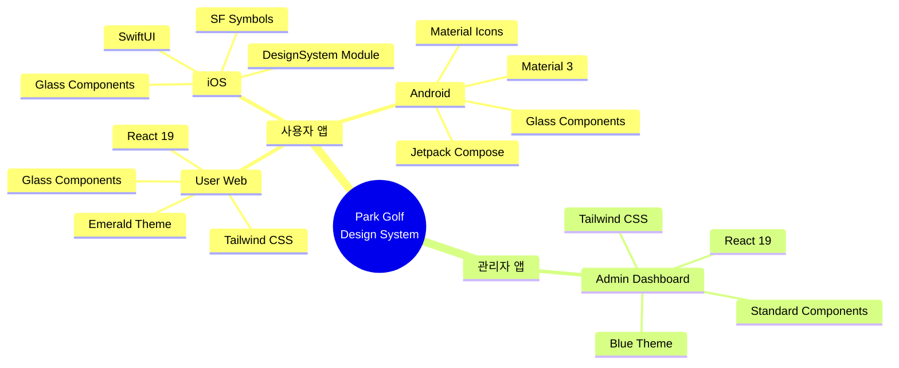

# UI 디자인 시스템 표준 (UI Standards)

> 버전: 1.0
> 최종 수정: 2026-02-02

## 목차

1. [디자인 원칙](#1-디자인-원칙)
2. [플랫폼 개요](#2-플랫폼-개요)
3. [컬러 시스템](#3-컬러-시스템)
4. [타이포그래피](#4-타이포그래피)
5. [간격 및 레이아웃](#5-간격-및-레이아웃)
6. [컴포넌트 라이브러리](#6-컴포넌트-라이브러리)
7. [글래스 모피즘](#7-글래스-모피즘)
8. [상태 표현](#8-상태-표현)
9. [반응형 디자인](#9-반응형-디자인)
10. [접근성](#10-접근성)
11. [구현 가이드](#11-구현-가이드)

---

## 1. 디자인 원칙

### 1.1 사용자 앱 (User Web, iOS, Android)

| 원칙 | 설명 |
|------|------|
| **Dark Theme** | 에메랄드 그라디언트 배경, 눈의 피로 감소 |
| **Glass Morphism** | 반투명 카드와 블러 효과로 깊이감 표현 |
| **Emerald Identity** | #10B981 기반 통일된 브랜드 컬러 |
| **Mobile First** | 모바일 우선 설계, 터치 최적화 |
| **iOS 스타일 일관성** | 3개 플랫폼(Web/iOS/Android) 동일한 시각적 경험 |

### 1.2 관리자 앱 (Admin Dashboard)

| 원칙 | 설명 |
|------|------|
| **Light Theme** | 밝은 배경, 데이터 가독성 우선 |
| **Data-Centric** | 테이블, 차트, 통계 중심 레이아웃 |
| **Blue Identity** | #2563EB 기반 신뢰감 있는 컬러 |
| **Desktop First** | 넓은 화면 최적화, 사이드바 네비게이션 |
| **Productivity** | 빠른 작업 처리를 위한 직관적 UI |

---

## 2. 플랫폼 개요



---

## 3. 컬러 시스템

### 3.1 Primary Colors

| Token | Admin Web | User Web | iOS | Android |
|-------|-----------|----------|-----|---------|
| **Primary** | `#2563EB` (blue-600) | `#10B981` (emerald-500) | `.parkPrimary` (#10B981) | `ParkPrimary` (#10B981) |
| **Primary Dark** | `#1D4ED8` (blue-700) | `#059669` (emerald-600) | `.parkSecondary` (#059669) | `ParkPrimaryDark` (#059669) |
| **Primary Light** | `#3B82F6` (blue-500) | `#34D399` (emerald-400) | — | `ParkPrimaryLight` (#34D399) |
| **Accent** | `#F59E0B` (amber-500) | `#F59E0B` (amber-500) | `.parkAccent` (#F59E0B) | `Accent` (#F59E0B) |

**소스 파일:**
- Admin Web: `apps/admin-dashboard/src/index.css`
- User Web: `apps/user-app-web/src/index.css`
- iOS: `apps/user-app-ios/Sources/DesignSystem/Theme/Colors.swift`
- Android: `apps/user-app-android/app/src/main/java/com/parkgolf/app/presentation/theme/Color.kt`

### 3.2 Semantic Colors

| Token | Color | Admin Web | User Web | iOS | Android |
|-------|-------|-----------|----------|-----|---------|
| **Success** | `#22C55E` | `text-green-500` | `text-green-500` | `.parkSuccess` | `Success` |
| **Warning** | `#F59E0B` | `text-amber-500` | `text-amber-500` | `.parkWarning` | `Warning` |
| **Error** | `#EF4444` | `text-red-500` | `text-red-500` | `.parkError` | `Error` |
| **Info** | `#3B82F6` | `text-blue-500` | `text-blue-500` | `.parkInfo` | `Info` |

### 3.3 Status Colors

예약 상태 등 비즈니스 로직에 사용되는 컬러입니다.

| Status | Color | 한국어 | Admin Web | User Web | iOS | Android |
|--------|-------|--------|-----------|----------|-----|---------|
| **Confirmed** | `#22C55E` | 예약확정 | `badge-success` | `badge-success` | `.statusConfirmed` | `StatusConfirmed` |
| **Pending** | `#F59E0B` | 대기중 | `badge-warning` | `badge-warning` | `.statusPending` | `StatusPending` |
| **Cancelled** | `#EF4444` | 취소됨 | `badge-error` | `badge-error` | `.statusCancelled` | `StatusCancelled` |
| **Completed** | `#6B7280` | 완료 | `badge-info` | `text-gray-400` | `.statusCompleted` | `StatusCompleted` |
| **No Show** | `#F97316` | 노쇼 | `text-orange-500` | `text-orange-500` | `.statusNoShow` | `StatusNoShow` |
| **Failed** | `#EF4444` | 실패 | `text-red-600` | `text-red-500` | `.statusFailed` | `StatusFailed` |

### 3.4 Background/Surface Colors

| Token | Admin Web | User Web | iOS | Android |
|-------|-----------|----------|-----|---------|
| **Background** | `#F9FAFB` (gray-50) | Gradient `#064E3B → #047857` | Gradient `.parkBackground` | `GradientStart → End` |
| **Surface** | `#FFFFFF` (white) | `rgba(255,255,255,0.1)` | `white.opacity(0.1)` | `GlassSurface` |
| **Surface Hover** | `#F3F4F6` (gray-100) | `rgba(255,255,255,0.15)` | `white.opacity(0.15)` | `GlassSurfaceHover` |
| **Card** | `#FFFFFF` | `rgba(255,255,255,0.1)` | `white.opacity(0.1)` | `GlassCard` |
| **Border** | `#E5E7EB` (gray-200) | `rgba(255,255,255,0.2)` | `white.opacity(0.2)` | `GlassBorder` |
| **Nav/Sidebar** | `#1F2937` (gray-800) | — (모바일 탭바) | — | — |

### 3.5 Text Colors

| Token | Admin Web | User Web | iOS | Android |
|-------|-----------|----------|-----|---------|
| **Primary** | `#111827` (gray-900) | `#FFFFFF` (white) | `.textPrimary` (white) | `TextOnGradient` |
| **Secondary** | `#6B7280` (gray-500) | `rgba(255,255,255,0.7)` | `.textSecondary` (70%) | `TextOnGradientSecondary` |
| **Tertiary** | `#9CA3AF` (gray-400) | `rgba(255,255,255,0.5)` | `.textTertiary` (50%) | `TextOnGradientTertiary` |
| **Disabled** | `#D1D5DB` (gray-300) | `rgba(255,255,255,0.4)` | `.textDisabled` (40%) | `TextOnGradientDisabled` |

### 3.6 Gradient Presets

**User App (공통):**

| Gradient | Start | Middle | End | 용도 |
|----------|-------|--------|-----|------|
| **Background** | `#064E3B` | `#065F46` | `#047857` | 앱 배경 |
| **Button** | `#059669` | — | `#10B981` | CTA 버튼 |
| **Card** | `#065F46` | — | `#047857` | 카드 오버레이 |

---

## 4. 타이포그래피

### 4.1 폰트 패밀리

| Platform | Font | 특징 |
|----------|------|------|
| **Admin Web** | System default (Inter fallback) | 가독성 중심 |
| **User Web** | System default | 플랫폼 네이티브 |
| **iOS** | SF Pro (`.rounded` design) | Apple 시스템 폰트, 둥근 디자인 |
| **Android** | Roboto (Material 3) | Google 시스템 폰트 |

### 4.2 타입 스케일 비교

| Scale | iOS (pt) | Android (sp) | Web (Tailwind) | Weight |
|-------|----------|--------------|----------------|--------|
| **Display Large** | 32 Bold | 40 Bold | `text-3xl` (30px) font-bold | Bold |
| **Display Medium** | 28 Bold | 32 Bold | `text-2xl` (24px) font-bold | Bold |
| **Display Small** | 24 Bold | 28 Bold | `text-xl` (20px) font-bold | Bold |
| **Headline Large** | 20 SemiBold | 24 SemiBold | `text-lg` (18px) font-semibold | SemiBold |
| **Headline Medium** | 18 SemiBold | 20 SemiBold | `text-base` (16px) font-semibold | SemiBold |
| **Headline Small** | 16 SemiBold | 18 SemiBold | `text-sm` (14px) font-semibold | SemiBold |
| **Body Large** | 16 Regular | 16 Normal | `text-base` (16px) font-normal | Regular |
| **Body Medium** | 14 Regular | 14 Normal | `text-sm` (14px) font-normal | Regular |
| **Body Small** | 12 Regular | 12 Normal | `text-xs` (12px) font-normal | Regular |
| **Label Large** | 14 Medium | 14 Medium | `text-sm` (14px) font-medium | Medium |
| **Label Medium** | 12 Medium | 12 Medium | `text-xs` (12px) font-medium | Medium |
| **Label Small** | 10 Medium | 10 Medium | `text-[10px]` font-medium | Medium |
| **Caption** | 11 Regular | — | `text-[11px]` font-normal | Regular |

### 4.3 iOS 타이포그래피 사용

```swift
// Sources/DesignSystem/Theme/Typography.swift

Text("제목")
    .font(ParkTypography.Display.large)   // 32pt Bold Rounded

Text("본문")
    .font(ParkTypography.Body.medium)     // 14pt Regular Rounded

Text("라벨")
    .font(ParkTypography.Label.medium)    // 12pt Medium Rounded
```

### 4.4 Android 타이포그래피 사용

```kotlin
// presentation/theme/Typography.kt

Text(
    text = "제목",
    style = MaterialTheme.typography.displayLarge  // 40sp Bold
)

Text(
    text = "본문",
    style = MaterialTheme.typography.bodyMedium    // 14sp Normal
)
```

---

## 5. 간격 및 레이아웃

### 5.1 Spacing 토큰

| Token | Size | iOS | Android | Web |
|-------|------|-----|---------|-----|
| **xxs** | 4pt | `ParkSpacing.xxs` | 4.dp | `p-1` (4px) |
| **xs** | 8pt | `ParkSpacing.xs` | 8.dp | `p-2` (8px) |
| **sm** | 12pt | `ParkSpacing.sm` | 12.dp | `p-3` (12px) |
| **md** | 16pt | `ParkSpacing.md` | 16.dp | `p-4` (16px) |
| **lg** | 20pt | `ParkSpacing.lg` | 20.dp | `p-5` (20px) |
| **xl** | 24pt | `ParkSpacing.xl` | 24.dp | `p-6` (24px) |
| **xxl** | 32pt | `ParkSpacing.xxl` | 32.dp | `p-8` (32px) |
| **xxxl** | 48pt | `ParkSpacing.xxxl` | 48.dp | `p-12` (48px) |

### 5.2 Border Radius

| Token | Size | iOS | Android | Web |
|-------|------|-----|---------|-----|
| **xs** | 4pt | `ParkSpacing.CornerRadius.xs` | 4.dp | `rounded` |
| **sm** | 8pt | `ParkSpacing.CornerRadius.sm` | 8.dp | `rounded-md` |
| **md** | 12pt | `ParkSpacing.CornerRadius.md` | 12.dp | `rounded-lg` |
| **lg** | 16pt | `ParkSpacing.CornerRadius.lg` | 16.dp | `rounded-xl` |
| **xl** | 20pt | `ParkSpacing.CornerRadius.xl` | 20.dp | `rounded-2xl` |
| **xxl** | 24pt | `ParkSpacing.CornerRadius.xxl` | 24.dp | `rounded-3xl` |
| **full** | 9999pt | `ParkSpacing.CornerRadius.full` | 9999.dp | `rounded-full` |

> **프로젝트 표준**: 카드/버튼은 `rounded-lg` (12pt) 통일. `cn()` 유틸리티로 클래스 병합.

### 5.3 Shadow 시스템 (iOS)

| Token | Radius | X | Y | Opacity |
|-------|--------|---|---|---------|
| **sm** | 4 | 0 | 2 | 0.1 |
| **md** | 8 | 0 | 4 | 0.15 |
| **lg** | 16 | 0 | 8 | 0.2 |

```swift
// iOS 사용
.shadow(ParkSpacing.Shadow.md)

// Web에서는 glass-card CSS 클래스에 포함
```

### 5.4 Icon Sizes

| Token | Size | iOS | Android | Web |
|-------|------|-----|---------|-----|
| **sm** | 16pt | `ParkSpacing.IconSize.sm` | 16.dp | `w-4 h-4` |
| **md** | 20pt | `ParkSpacing.IconSize.md` | 20.dp | `w-5 h-5` |
| **lg** | 24pt | `ParkSpacing.IconSize.lg` | 24.dp | `w-6 h-6` |
| **xl** | 32pt | `ParkSpacing.IconSize.xl` | 32.dp | `w-8 h-8` |
| **xxl** | 48pt | `ParkSpacing.IconSize.xxl` | 48.dp | `w-12 h-12` |

---

## 6. 컴포넌트 라이브러리

### 6.1 컴포넌트 매트릭스

| Component | Admin Web | User Web | iOS | Android |
|-----------|-----------|----------|-----|---------|
| **Button** | `Button` (CVA, 6종) | `Button` (CVA + glass) | `GradientButton` (4종) | `GradientButton` (3종) |
| **Card** | `Card` (white) | `GlassCard` | `GlassCard` | `GlassCard` |
| **Input** | `Input` | `Input` (glass) | `GlassTextField` | `GlassInputBackground` |
| **Secure Input** | — | — | `GlassSecureField` | — |
| **Textarea** | `Textarea` | `Textarea` | — | — |
| **Select** | `Select` | `Select` | — | — |
| **Modal** | `Modal` | `ConfirmModal` | `.sheet` | `Dialog` |
| **Bottom Sheet** | — | `BottomSheet` | `.sheet` | `ModalBottomSheet` |
| **Status Badge** | Tailwind class | Tailwind class | `StatusBadge` (6종) | `StatusBadge` |
| **Empty State** | `EmptyState` | — | `EmptyStateView` | `EmptyState` |
| **Loading** | `LoadingView` | — | `ProgressView` | `CircularProgressIndicator` |
| **Table** | `Table` | — | — | — |
| **Page Header** | — | `PageHeader` | — | — |
| **Section Header** | — | `SectionHeader` | — | — |
| **Price Display** | — | `PriceDisplay` | `PriceDisplay` | — |
| **Time Slot** | — | — | `TimeSlotButton` | — |

### 6.2 Button 변형

#### Admin Web

```typescript
// apps/admin-dashboard/src/components/ui/Button.tsx
// CVA (class-variance-authority) 기반

<Button variant="default">기본</Button>     // blue-600
<Button variant="outline">아웃라인</Button>  // border + text
<Button variant="ghost">고스트</Button>      // 투명 배경
<Button variant="destructive">삭제</Button>  // red-600
<Button size="sm">작은 버튼</Button>
<Button size="lg">큰 버튼</Button>
```

#### User Web

```typescript
// apps/user-app-web/src/components/ui/Button.tsx
// CVA + glass 변형 추가

<Button variant="default">기본</Button>      // emerald gradient
<Button variant="glass">글래스</Button>       // btn-glass
<Button variant="outline">아웃라인</Button>   // glass border
<Button variant="destructive">삭제</Button>   // red
<Button variant="ghost">고스트</Button>       // 투명
```

#### iOS

```swift
// Sources/DesignSystem/Components/GradientButton.swift

GradientButton("예약하기", style: .primary) { }    // 에메랄드 그라디언트
GradientButton("취소", style: .secondary) { }      // 반투명 배경
GradientButton("삭제", style: .destructive) { }    // 빨간 그라디언트
GradientButton("더보기", style: .ghost) { }        // 투명

// 아이콘 포함
GradientButton("검색", icon: "magnifyingglass") { }

// 로딩 상태
GradientButton("처리중", isLoading: true) { }

// SmallButton 변형
SmallButton("필터", icon: "line.3.horizontal.decrease") { }
```

#### Android

```kotlin
// presentation/components/GradientButton.kt

GradientButton(
    text = "예약하기",
    style = GradientButtonStyle.Primary,    // 에메랄드 그라디언트
    onClick = { }
)

GradientButton(
    text = "삭제",
    style = GradientButtonStyle.Destructive, // 빨간 그라디언트
    isLoading = true,                        // 로딩 상태
    onClick = { }
)

GradientButton(
    text = "더보기",
    style = GradientButtonStyle.Ghost,       // 투명
    onClick = { }
)
```

### 6.3 Card 컴포넌트

#### Admin Web — 일반 Card

```typescript
// apps/admin-dashboard/src/components/ui/Card.tsx

<Card>
  <CardHeader>
    <CardTitle>제목</CardTitle>
    <CardDescription>설명</CardDescription>
  </CardHeader>
  <CardContent>내용</CardContent>
  <CardFooter>하단</CardFooter>
</Card>

// CSS: white background, border, rounded-lg, shadow
```

#### User Web — GlassCard

```typescript
// apps/user-app-web/src/components/ui/GlassCard.tsx

<GlassCard>
  <h3>글래스 카드</h3>
  <p>반투명 배경</p>
</GlassCard>

// CSS: rgba(255,255,255,0.1), backdrop-blur, border
```

#### iOS — GlassCard

```swift
// Sources/DesignSystem/Components/GlassCard.swift

GlassCard {
    VStack {
        Text("글래스 카드")
        Text("반투명 배경")
    }
}

// .ultraThinMaterial + gradient overlay + border
```

#### Android — GlassCard

```kotlin
// presentation/components/GlassCard.kt

GlassCard(
    modifier = Modifier.fillMaxWidth()
) {
    Text("글래스 카드")
    Text("반투명 배경")
}

// Glass surface + border + rounded corners
```

---

## 7. 글래스 모피즘

사용자 앱 3개 플랫폼(User Web, iOS, Android)에서 공통 적용되는 Glass Morphism 스타일입니다.

### 7.1 기술 스펙

| Property | Web (CSS) | iOS (SwiftUI) | Android (Compose) |
|----------|-----------|---------------|-------------------|
| **Background** | `rgba(255,255,255,0.1)` | `Color.white.opacity(0.1)` | `Color.White.copy(alpha = 0.10f)` |
| **Background Hover** | `rgba(255,255,255,0.15)` | `Color.white.opacity(0.15)` | `Color.White.copy(alpha = 0.15f)` |
| **Blur** | `backdrop-filter: blur(8px)` | `.ultraThinMaterial` | `Modifier.blur(radius = 8.dp)` |
| **Border** | `1px solid rgba(255,255,255,0.2)` | `Color.white.opacity(0.2)` | `BorderStroke(1.dp, GlassBorder)` |
| **Corner Radius** | `border-radius: 12px` | `.cornerRadius(12)` | `RoundedCornerShape(12.dp)` |
| **Shadow** | `box-shadow: ...` | `ParkSpacing.Shadow.md` | `Modifier.shadow(8.dp)` |

### 7.2 Web 구현

```css
/* apps/user-app-web/src/index.css */

.glass-card {
  background: rgba(255, 255, 255, 0.1);
  backdrop-filter: blur(8px);
  -webkit-backdrop-filter: blur(8px);
  border: 1px solid rgba(255, 255, 255, 0.2);
  border-radius: 12px;
}

.glass-card-hover:hover {
  background: rgba(255, 255, 255, 0.15);
}

.btn-glass {
  background: rgba(255, 255, 255, 0.15);
  backdrop-filter: blur(8px);
  border: 1px solid rgba(255, 255, 255, 0.25);
}

.input-glass {
  background: rgba(255, 255, 255, 0.08);
  border: 1px solid rgba(255, 255, 255, 0.15);
}
```

### 7.3 iOS 구현

```swift
// Sources/DesignSystem/Components/GlassCard.swift

struct GlassCard<Content: View>: View {
    var body: some View {
        content
            .padding(padding)
            .background(.ultraThinMaterial)
            .overlay(
                LinearGradient(
                    colors: [
                        Color.white.opacity(0.15),
                        Color.white.opacity(0.05)
                    ],
                    startPoint: .topLeading,
                    endPoint: .bottomTrailing
                )
            )
            .clipShape(RoundedRectangle(cornerRadius: cornerRadius))
            .overlay(
                RoundedRectangle(cornerRadius: cornerRadius)
                    .stroke(Color.white.opacity(0.2), lineWidth: 1)
            )
    }
}
```

### 7.4 Android 구현

```kotlin
// presentation/components/GlassCard.kt

@Composable
fun GlassCard(
    modifier: Modifier = Modifier,
    content: @Composable ColumnScope.() -> Unit
) {
    Card(
        modifier = modifier,
        shape = RoundedCornerShape(12.dp),
        colors = CardDefaults.cardColors(
            containerColor = GlassSurface  // white.copy(alpha = 0.10f)
        ),
        border = BorderStroke(1.dp, GlassBorder)  // white.copy(alpha = 0.20f)
    ) {
        Column(modifier = Modifier.padding(16.dp)) {
            content()
        }
    }
}
```

### 7.5 Glass 효과 변형

| 변형 | Opacity | 용도 |
|------|---------|------|
| **Glass Surface** | 0.10 | 기본 카드 배경 |
| **Glass Surface Hover** | 0.15 | 호버/선택 상태 |
| **Glass Border** | 0.20 | 카드/버튼 테두리 |
| **Glass Input** | 0.08 | 입력 필드 배경 |
| **Glass Input Focus** | 0.12 | 입력 필드 포커스 |
| **Glass Button** | 0.15 | 보조 버튼 배경 |

---

## 8. 상태 표현

### 8.1 예약 상태별 시각 표현

| Status | Color | Background | iOS SF Symbol | Android Icon | 한국어 |
|--------|-------|------------|---------------|-------------|--------|
| **Confirmed** | `#22C55E` | `#22C55E/15%` | `checkmark.circle.fill` | `Icons.Default.CheckCircle` | 예약확정 |
| **Pending** | `#F59E0B` | `#F59E0B/15%` | `clock.fill` | `Icons.Default.Schedule` | 대기중 |
| **Cancelled** | `#EF4444` | `#EF4444/15%` | `xmark.circle.fill` | `Icons.Default.Cancel` | 취소됨 |
| **Completed** | `#6B7280` | `#6B7280/15%` | `flag.checkered` | `Icons.Default.Flag` | 완료 |
| **No Show** | `#F97316` | `#F97316/15%` | `person.fill.questionmark` | `Icons.Default.PersonOff` | 노쇼 |
| **Failed** | `#EF4444` | `#EF4444/15%` | `exclamationmark.triangle.fill` | `Icons.Default.Error` | 실패 |

### 8.2 iOS StatusBadge 사용

```swift
// Sources/DesignSystem/Components/StatusBadge.swift

StatusBadge(status: .confirmed)               // 예약확정 (초록)
StatusBadge(status: .pending, size: .large)    // 대기중 (주황, 큰 크기)
StatusBadge(status: .cancelled, size: .small)  // 취소됨 (빨강, 작은 크기)

// 예약 상태 문자열에서 변환
StatusBadge(status: StatusBadge.StatusType.from(bookingStatus: "CONFIRMED"))
```

### 8.3 Web Badge 사용

```html
<!-- Admin Web / User Web -->
<span class="badge-success">예약확정</span>
<span class="badge-warning">대기중</span>
<span class="badge-error">취소됨</span>
<span class="badge-info">완료</span>
```

### 8.4 Badge CSS 비교

| 속성 | Admin Web | User Web |
|------|-----------|----------|
| **Background** | `bg-green-100` (불투명) | `rgba(34,197,94,0.15)` (반투명) |
| **Text** | `text-green-800` | `text-green-400` |
| **Border** | 없음 | `1px solid rgba(34,197,94,0.3)` |
| **Radius** | `rounded-full` | `rounded-full` |

---

## 9. 반응형 디자인

### 9.1 User Web 반응형 전략

| Breakpoint | 레이아웃 | 네비게이션 |
|------------|---------|-----------|
| **< md** (< 768px) | 모바일 레이아웃 | `MobileHeader` + `MobileTabBar` (하단) |
| **>= md** (>= 768px) | 데스크톱 레이아웃 | `DesktopNavHeader` (상단) |

```
모바일 (<768px):
┌──────────────────┐
│   MobileHeader   │  ← 뒤로가기, 제목, 액션
├──────────────────┤
│                  │
│     Content      │
│                  │
├──────────────────┤
│  MobileTabBar    │  ← 홈, 예약, 채팅, 프로필
└──────────────────┘

데스크톱 (>=768px):
┌──────────────────────────────┐
│       DesktopNavHeader       │  ← 로고, 메뉴, 프로필
├──────────────────────────────┤
│                              │
│           Content            │
│     (max-width: 1200px)      │
│                              │
└──────────────────────────────┘
```

### 9.2 Admin Dashboard 레이아웃

```
┌────────┬─────────────────────────────┐
│        │        Top Header           │
│  Side  ├─────────────────────────────┤
│  bar   │                             │
│        │      Scrollable Content     │
│ (fixed)│                             │
│  240px │     Tables, Forms, Cards    │
│        │                             │
└────────┴─────────────────────────────┘
```

| 영역 | 너비 | 배경 |
|------|------|------|
| **Sidebar** | 240px (고정) | `#1F2937` (gray-800) |
| **Content** | 나머지 (flex-1) | `#F9FAFB` (gray-50) |
| **Top Header** | 100% | `#FFFFFF` (white) |

### 9.3 iOS 레이아웃

```swift
// NavigationStack 기반
NavigationStack {
    ScrollView {
        VStack(spacing: ParkSpacing.md) {
            // 콘텐츠
        }
        .padding(.horizontal, ParkSpacing.md)
    }
}

// TabView (하단 탭바)
TabView {
    HomeView().tabItem { Label("홈", systemImage: "house.fill") }
    BookingView().tabItem { Label("예약", systemImage: "calendar") }
    ChatView().tabItem { Label("채팅", systemImage: "bubble.left.fill") }
    ProfileView().tabItem { Label("프로필", systemImage: "person.fill") }
}
```

### 9.4 Safe Area 처리

| Platform | 처리 방법 |
|----------|----------|
| **User Web** | `.pb-safe` 클래스 (`padding-bottom: env(safe-area-inset-bottom)`) |
| **iOS** | SwiftUI 자동 처리 (`.safeAreaInset`) |
| **Android** | `WindowInsets.systemBars` + `Modifier.systemBarsPadding()` |

---

## 10. 접근성

> 현재 MVP 단계로, 접근성은 향후 개선 목표입니다.

### 10.1 현재 적용 항목

| 항목 | 상태 | 설명 |
|------|------|------|
| **색상 대비** | 부분 적용 | Dark theme에서 텍스트 가독성 확보 |
| **터치 영역** | 적용 | 최소 44pt (iOS), 48dp (Android) |
| **SF Symbols** | iOS 적용 | 의미론적 아이콘 사용 |
| **라벨** | 부분 적용 | 주요 버튼에 텍스트 라벨 포함 |

### 10.2 향후 계획

| 항목 | 우선순위 | 설명 |
|------|---------|------|
| **WCAG 2.1 AA** | 높음 | 색상 대비 4.5:1 이상 |
| **스크린 리더** | 높음 | VoiceOver / TalkBack 지원 |
| **키보드 네비게이션** | 중간 | Web 접근성 |
| **다크/라이트 전환** | 낮음 | 사용자 앱 라이트 모드 지원 |

---

## 11. 구현 가이드

### 11.1 파일 위치 참조

| Platform | Theme 파일 | 컴포넌트 디렉토리 |
|----------|-----------|-----------------|
| **Admin Web** | `apps/admin-dashboard/src/index.css` | `apps/admin-dashboard/src/components/ui/` |
| **User Web** | `apps/user-app-web/src/index.css` | `apps/user-app-web/src/components/ui/` |
| **iOS** | `apps/user-app-ios/Sources/DesignSystem/Theme/` | `apps/user-app-ios/Sources/DesignSystem/Components/` |
| **Android** | `apps/user-app-android/app/.../presentation/theme/` | `apps/user-app-android/app/.../presentation/components/` |

### 11.2 Theme 파일 상세

| Platform | 파일 | 내용 |
|----------|------|------|
| **Admin Web** | `index.css` | Tailwind 변수, glass-card, 버튼, 배지 클래스 |
| **User Web** | `index.css` | Tailwind 변수, 에메랄드 그라디언트, glass 효과 |
| **iOS** | `Colors.swift` | 컬러 팔레트, 그라디언트 프리셋 |
| **iOS** | `Typography.swift` | 타입 스케일 (.rounded 디자인) |
| **iOS** | `Spacing.swift` | 간격, 코너 반경, 그림자, 아이콘 크기 |
| **Android** | `Color.kt` | 컬러 팔레트, 그라디언트, 글래스 효과 |
| **Android** | `Theme.kt` | Material 3 테마, ParkColors 커스텀 |
| **Android** | `Typography.kt` | Material 3 타이포그래피 |

### 11.3 새 컴포넌트 추가 가이드

새 공통 컴포넌트 추가 시 4개 플랫폼 구현 체크리스트:

| # | 항목 |
|---|------|
| 1 | Admin Web: `apps/admin-dashboard/src/components/ui/` 에 CVA 기반 컴포넌트 |
| 2 | User Web: `apps/user-app-web/src/components/ui/` 에 glass 변형 포함 |
| 3 | iOS: `Sources/DesignSystem/Components/` 에 SwiftUI View |
| 4 | Android: `presentation/components/` 에 Composable 함수 |
| 5 | 이 문서의 컴포넌트 매트릭스 (§6.1) 업데이트 |
| 6 | 컬러/간격은 각 플랫폼 Theme 토큰 사용 (하드코딩 금지) |

---

## 변경 이력

| 버전 | 날짜 | 변경 내용 |
|------|------|----------|
| 1.0 | 2026-02-02 | 초안 작성 — 4개 플랫폼 디자인 시스템 통합 |

---

## 참고 자료

- [ARCHITECTURE.md](./ARCHITECTURE.md) — 시스템 아키텍처 (프론트엔드 기술 스택)
- [CLAUDE.md](/CLAUDE.md) — 프로젝트 개발 규칙 (스타일 규칙 섹션)
