# Park Golf Platform - Database ERD

## 개요

Park Golf 플랫폼은 8개의 독립 마이크로서비스 데이터베이스로 구성됩니다.
서비스 간 데이터 참조는 NATS 메시징을 통해 이루어지며, 직접적인 FK 관계는 없습니다.

| 서비스 | 데이터베이스 | 설명 |
|--------|------------|------|
| iam-service | iam_db | 인증, 사용자, 관리자, 역할/권한, 친구, 메뉴, 계정삭제 이력 |
| course-service | course_db | 골프장, 코스, 홀, 게임, 타임슬롯 |
| booking-service | booking_db | 예약, 결제, 정책, 환불/노쇼, 팀선정/더치페이 |
| saga-service | saga_db | Saga 오케스트레이션, Step 실행 이력, Outbox |
| payment-service | payment_db | 결제(토스페이먼츠), 환불, 빌링키, 분할결제, 웹훅 |
| partner-service | partner_db | 파트너 연동 설정, 코스/슬롯/예약 매핑, 동기화 이력 |
| chat-service | chat_db | 채팅방, 멤버, 메시지 |
| notify-service | notify_db | 알림, 템플릿, 설정 |

---

## 서비스 간 참조 관계

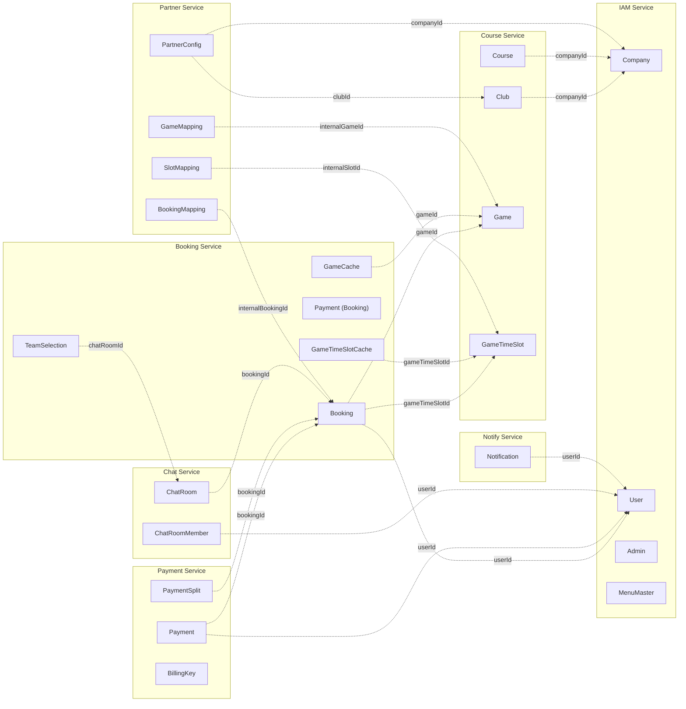
```mermaid
flowchart LR
    subgraph iam["IAM Service"]
        Company
        User
        Admin
        Menu["MenuMaster"]
    end

    subgraph course["Course Service"]
        Club
        Course
        Game
        GameTimeSlot
    end

    subgraph booking["Booking Service"]
        Booking
        TeamSelection
        BookingPayment["Payment (Booking)"]
        GameCache
        SlotCache["GameTimeSlotCache"]
    end

    subgraph payment["Payment Service"]
        Payment
        PaymentSplit
        BillingKey
    end

    subgraph chat["Chat Service"]
        ChatRoom
        ChatRoomMember
    end

    subgraph partner["Partner Service"]
        PartnerConfig
        GameMapping_P["GameMapping"]
        SlotMapping_P["SlotMapping"]
        BookingMapping_P["BookingMapping"]
    end

    subgraph notify["Notify Service"]
        Notification
    end

    Club -.->|companyId| Company
    Course -.->|companyId| Company
    Booking -.->|userId| User
    Booking -.->|gameTimeSlotId| GameTimeSlot
    Booking -.->|gameId| Game
    TeamSelection -.->|chatRoomId| ChatRoom
    GameCache -.->|gameId| Game
    SlotCache -.->|gameTimeSlotId| GameTimeSlot
    Payment -.->|userId| User
    Payment -.->|bookingId| Booking
    PaymentSplit -.->|bookingId| Booking
    ChatRoom -.->|bookingId| Booking
    ChatRoomMember -.->|userId| User
    Notification -.->|userId| User
    PartnerConfig -.->|clubId| Club
    PartnerConfig -.->|companyId| Company
    GameMapping_P -.->|internalGameId| Game
    SlotMapping_P -.->|internalSlotId| GameTimeSlot
    BookingMapping_P -.->|internalBookingId| Booking
```

---

## 1. IAM Service (iam_db)

### 전체 구조

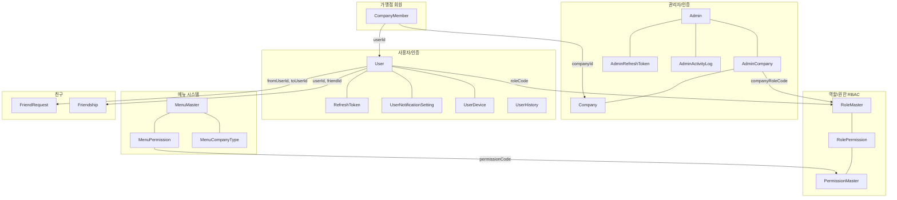
```mermaid
flowchart TB
    subgraph admin["관리자/인증"]
        A_Admin["Admin"]
        A_Company["Company"]
        A_AdminCompany["AdminCompany"]
        A_AdminRefreshToken["AdminRefreshToken"]
        A_AdminActivityLog["AdminActivityLog"]
        A_Admin --- A_AdminCompany --- A_Company
        A_Admin --- A_AdminRefreshToken
        A_Admin --- A_AdminActivityLog
    end

    subgraph user["사용자/인증"]
        U_User["User"]
        U_RefreshToken["RefreshToken"]
        U_NotifSetting["UserNotificationSetting"]
        U_Device["UserDevice"]
        U_History["UserHistory"]
        U_User --- U_RefreshToken
        U_User --- U_NotifSetting
        U_User --- U_Device
    end

    subgraph rbac["역할/권한 RBAC"]
        R_Role["RoleMaster"]
        R_Permission["PermissionMaster"]
        R_RolePermission["RolePermission"]
        R_Role --- R_RolePermission --- R_Permission
    end

    subgraph menu["메뉴 시스템"]
        M_Menu["MenuMaster"]
        M_MenuPerm["MenuPermission"]
        M_MenuCompType["MenuCompanyType"]
        M_Menu --- M_MenuPerm
        M_Menu --- M_MenuCompType
    end

    subgraph friend["친구"]
        F_Request["FriendRequest"]
        F_Ship["Friendship"]
    end

    subgraph member["가맹점 회원"]
        CM_Member["CompanyMember"]
    end

    A_AdminCompany -->|companyRoleCode| R_Role
    U_User -->|roleCode| R_Role
    U_User -->|fromUserId, toUserId| F_Request
    U_User -->|userId, friendId| F_Ship
    M_MenuPerm -->|permissionCode| R_Permission
    CM_Member -->|companyId| A_Company
    CM_Member -->|userId| U_User
```

> **그룹 간 참조**: AdminCompany.companyRoleCode -> RoleMaster.code | User.roleCode -> RoleMaster.code | MenuPermission.permissionCode -> PermissionMaster.code | CompanyMember.companyId -> Company.id, userId -> User.id

---

### 1-1. 관리자/인증

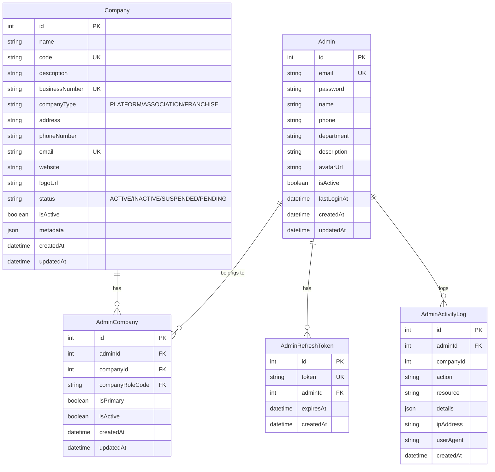
```mermaid
erDiagram
    Company ||--o{ AdminCompany : "has"
    Admin ||--o{ AdminCompany : "belongs to"
    Admin ||--o{ AdminRefreshToken : "has"
    Admin ||--o{ AdminActivityLog : "logs"

    Company {
        int id PK
        string name
        string code UK
        string description
        string businessNumber UK
        string companyType "PLATFORM/ASSOCIATION/FRANCHISE"
        string address
        string phoneNumber
        string email UK
        string website
        string logoUrl
        string status "ACTIVE/INACTIVE/SUSPENDED/PENDING"
        boolean isActive
        json metadata
        datetime createdAt
        datetime updatedAt
    }

    Admin {
        int id PK
        string email UK
        string password
        string name
        string phone
        string department
        string description
        string avatarUrl
        boolean isActive
        datetime lastLoginAt
        datetime createdAt
        datetime updatedAt
    }

    AdminCompany {
        int id PK
        int adminId FK
        int companyId FK
        string companyRoleCode FK
        boolean isPrimary
        boolean isActive
        datetime createdAt
        datetime updatedAt
    }

    AdminRefreshToken {
        int id PK
        string token UK
        int adminId FK
        datetime expiresAt
        datetime createdAt
    }

    AdminActivityLog {
        int id PK
        int adminId FK
        int companyId
        string action
        string resource
        json details
        string ipAddress
        string userAgent
        datetime createdAt
    }
```

---

### 1-2. 사용자/인증

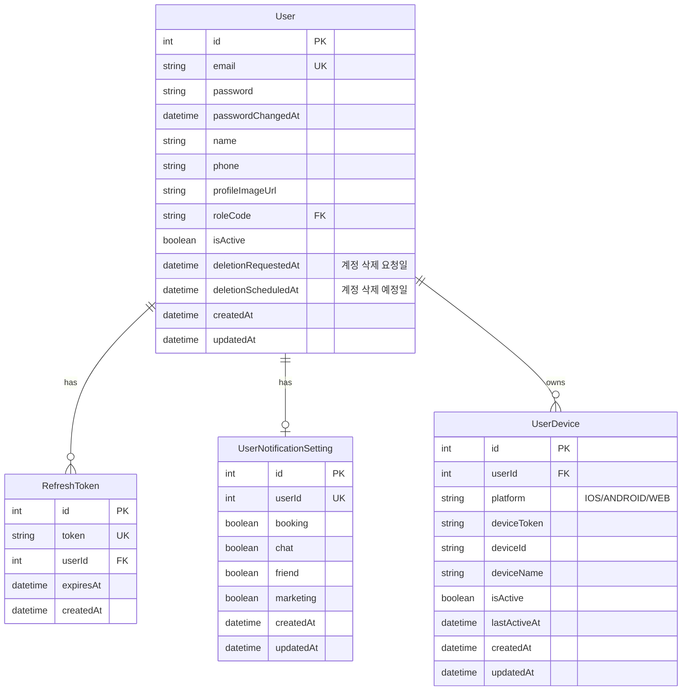
```mermaid
erDiagram
    User ||--o{ RefreshToken : "has"
    User ||--o| UserNotificationSetting : "has"
    User ||--o{ UserDevice : "owns"

    User {
        int id PK
        string email UK
        string password
        datetime passwordChangedAt
        string name
        string phone
        string profileImageUrl
        string roleCode FK
        boolean isActive
        datetime deletionRequestedAt "계정 삭제 요청일"
        datetime deletionScheduledAt "계정 삭제 예정일"
        datetime createdAt
        datetime updatedAt
    }

    RefreshToken {
        int id PK
        string token UK
        int userId FK
        datetime expiresAt
        datetime createdAt
    }

    UserNotificationSetting {
        int id PK
        int userId UK
        boolean booking
        boolean chat
        boolean friend
        boolean marketing
        datetime createdAt
        datetime updatedAt
    }

    UserDevice {
        int id PK
        int userId FK
        string platform "IOS/ANDROID/WEB"
        string deviceToken
        string deviceId
        string deviceName
        boolean isActive
        datetime lastActiveAt
        datetime createdAt
        datetime updatedAt
    }
```

---

### 1-3. 역할/권한 (RBAC)

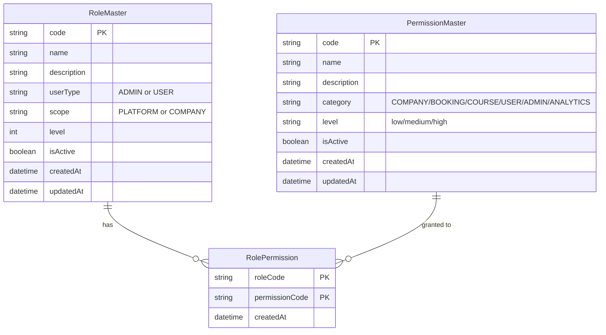
```mermaid
erDiagram
    RoleMaster ||--o{ RolePermission : "has"
    PermissionMaster ||--o{ RolePermission : "granted to"

    RoleMaster {
        string code PK
        string name
        string description
        string userType "ADMIN or USER"
        string scope "PLATFORM or COMPANY"
        int level
        boolean isActive
        datetime createdAt
        datetime updatedAt
    }

    PermissionMaster {
        string code PK
        string name
        string description
        string category "COMPANY/BOOKING/COURSE/USER/ADMIN/ANALYTICS"
        string level "low/medium/high"
        boolean isActive
        datetime createdAt
        datetime updatedAt
    }

    RolePermission {
        string roleCode PK
        string permissionCode PK
        datetime createdAt
    }
```

---

### 1-4. 메뉴 시스템

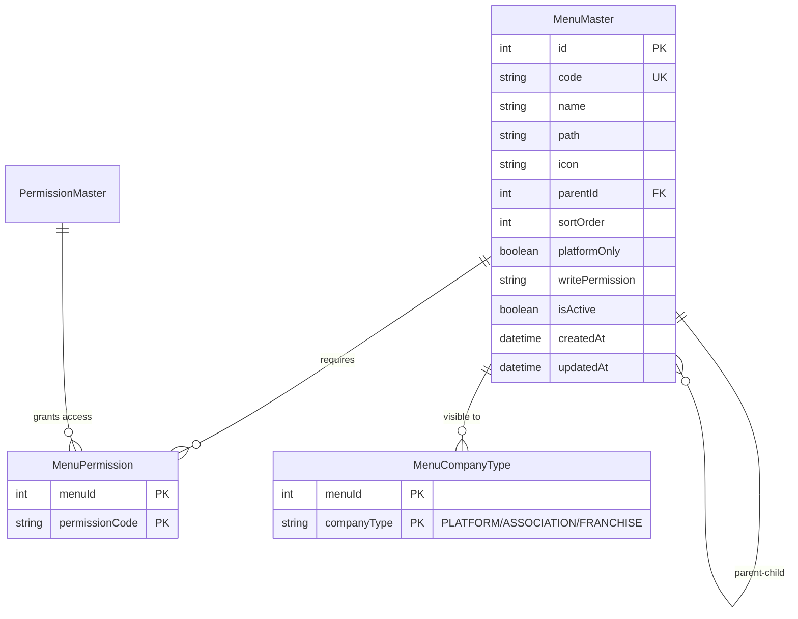
```mermaid
erDiagram
    MenuMaster ||--o{ MenuMaster : "parent-child"
    MenuMaster ||--o{ MenuPermission : "requires"
    MenuMaster ||--o{ MenuCompanyType : "visible to"
    PermissionMaster ||--o{ MenuPermission : "grants access"

    MenuMaster {
        int id PK
        string code UK
        string name
        string path
        string icon
        int parentId FK
        int sortOrder
        boolean platformOnly
        string writePermission
        boolean isActive
        datetime createdAt
        datetime updatedAt
    }

    MenuPermission {
        int menuId PK
        string permissionCode PK
    }

    MenuCompanyType {
        int menuId PK
        string companyType PK "PLATFORM/ASSOCIATION/FRANCHISE"
    }
```

> **설명**: MenuMaster는 self-relation으로 부모-자식 트리 구조를 형성합니다. MenuPermission은 메뉴 접근에 필요한 권한을 OR 조건으로 매핑하고, MenuCompanyType은 회사 유형별 메뉴 가시성을 제어합니다.

---

### 1-5. 친구

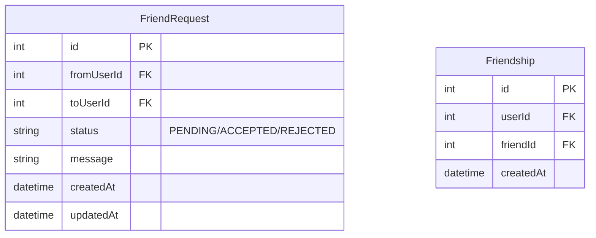
```mermaid
erDiagram
    FriendRequest {
        int id PK
        int fromUserId FK
        int toUserId FK
        string status "PENDING/ACCEPTED/REJECTED"
        string message
        datetime createdAt
        datetime updatedAt
    }

    Friendship {
        int id PK
        int userId FK
        int friendId FK
        datetime createdAt
    }
```

> **참조**: FriendRequest.fromUserId, toUserId -> User.id | Friendship.userId, friendId -> User.id

---

### 1-6. 가맹점 회원

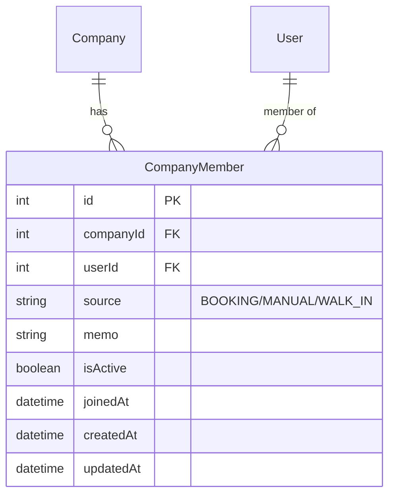
```mermaid
erDiagram
    Company ||--o{ CompanyMember : "has"
    User ||--o{ CompanyMember : "member of"

    CompanyMember {
        int id PK
        int companyId FK
        int userId FK
        string source "BOOKING/MANUAL/WALK_IN"
        string memo
        boolean isActive
        datetime joinedAt
        datetime createdAt
        datetime updatedAt
    }
```

> **설명**: CompanyMember는 가맹점별 회원을 관리합니다. source로 등록 경로를 추적하며, 예약 시 자동 등록(BOOKING), 관리자 수동 등록(MANUAL), 현장 등록(WALK_IN)을 구분합니다. `@@unique([companyId, userId])`로 중복 등록을 방지합니다.

---

### 1-7. 삭제 사용자 이력

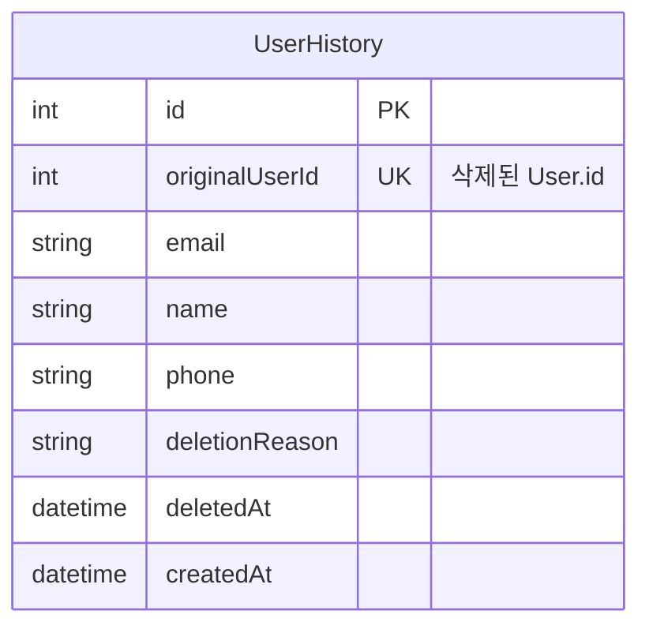
```mermaid
erDiagram
    UserHistory {
        int id PK
        int originalUserId UK "삭제된 User.id"
        string email
        string name
        string phone
        string deletionReason
        datetime deletedAt
        datetime createdAt
    }
```

> **설명**: 계정 삭제 처리된 사용자의 이력을 보관합니다. `originalUserId`로 원래 사용자를 식별하며, 삭제 사유와 삭제 시점을 기록합니다.

---

## 2. Course Service (course_db)

### 전체 구조

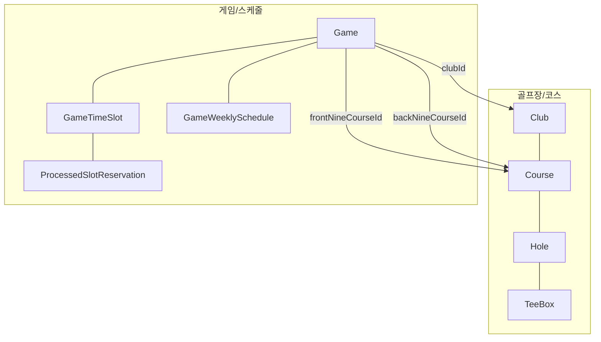
```mermaid
flowchart TB
    subgraph facility["골프장/코스"]
        C_Club["Club"]
        C_Course["Course"]
        C_Hole["Hole"]
        C_TeeBox["TeeBox"]
        C_Club --- C_Course --- C_Hole --- C_TeeBox
    end

    subgraph game["게임/스케줄"]
        G_Game["Game"]
        G_TimeSlot["GameTimeSlot"]
        G_Weekly["GameWeeklySchedule"]
        G_Processed["ProcessedSlotReservation"]
        G_Game --- G_TimeSlot
        G_Game --- G_Weekly
        G_TimeSlot --- G_Processed
    end

    G_Game -->|frontNineCourseId| C_Course
    G_Game -->|backNineCourseId| C_Course
    G_Game -->|clubId| C_Club
```

> **그룹 간 참조**: Game.frontNineCourseId, backNineCourseId -> Course.id | Game.clubId -> Club.id

---

### 2-1. 골프장/코스

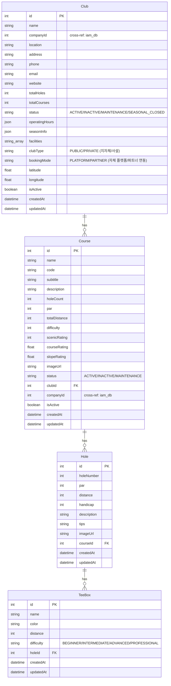
```mermaid
erDiagram
    Club ||--o{ Course : "has"
    Course ||--o{ Hole : "has"
    Hole ||--o{ TeeBox : "has"

    Club {
        int id PK
        string name
        int companyId "cross-ref: iam_db"
        string location
        string address
        string phone
        string email
        string website
        int totalHoles
        int totalCourses
        string status "ACTIVE/INACTIVE/MAINTENANCE/SEASONAL_CLOSED"
        json operatingHours
        json seasonInfo
        string_array facilities
        string clubType "PUBLIC/PRIVATE (지자체/사설)"
        string bookingMode "PLATFORM/PARTNER (자체 플랫폼/파트너 연동)"
        float latitude
        float longitude
        boolean isActive
        datetime createdAt
        datetime updatedAt
    }

    Course {
        int id PK
        string name
        string code
        string subtitle
        string description
        int holeCount
        int par
        int totalDistance
        int difficulty
        int scenicRating
        float courseRating
        float slopeRating
        string imageUrl
        string status "ACTIVE/INACTIVE/MAINTENANCE"
        int clubId FK
        int companyId "cross-ref: iam_db"
        boolean isActive
        datetime createdAt
        datetime updatedAt
    }

    Hole {
        int id PK
        int holeNumber
        int par
        int distance
        int handicap
        string description
        string tips
        string imageUrl
        int courseId FK
        datetime createdAt
        datetime updatedAt
    }

    TeeBox {
        int id PK
        string name
        string color
        int distance
        string difficulty "BEGINNER/INTERMEDIATE/ADVANCED/PROFESSIONAL"
        int holeId FK
        datetime createdAt
        datetime updatedAt
    }
```

---

### 2-2. 게임/스케줄

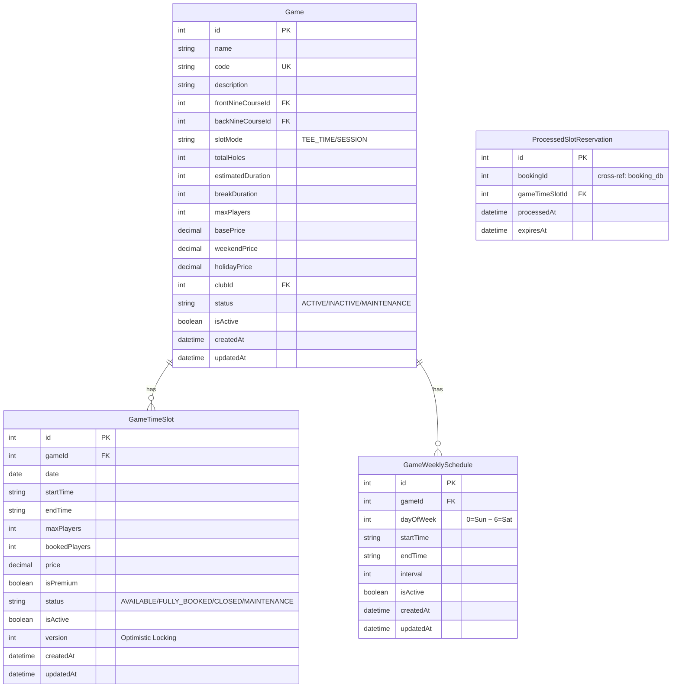
```mermaid
erDiagram
    Game ||--o{ GameTimeSlot : "has"
    Game ||--o{ GameWeeklySchedule : "has"

    Game {
        int id PK
        string name
        string code UK
        string description
        int frontNineCourseId FK
        int backNineCourseId FK
        string slotMode "TEE_TIME/SESSION"
        int totalHoles
        int estimatedDuration
        int breakDuration
        int maxPlayers
        decimal basePrice
        decimal weekendPrice
        decimal holidayPrice
        int clubId FK
        string status "ACTIVE/INACTIVE/MAINTENANCE"
        boolean isActive
        datetime createdAt
        datetime updatedAt
    }

    GameTimeSlot {
        int id PK
        int gameId FK
        date date
        string startTime
        string endTime
        int maxPlayers
        int bookedPlayers
        decimal price
        boolean isPremium
        string status "AVAILABLE/FULLY_BOOKED/CLOSED/MAINTENANCE"
        boolean isActive
        int version "Optimistic Locking"
        datetime createdAt
        datetime updatedAt
    }

    GameWeeklySchedule {
        int id PK
        int gameId FK
        int dayOfWeek "0=Sun ~ 6=Sat"
        string startTime
        string endTime
        int interval
        boolean isActive
        datetime createdAt
        datetime updatedAt
    }

    ProcessedSlotReservation {
        int id PK
        int bookingId "cross-ref: booking_db"
        int gameTimeSlotId FK
        datetime processedAt
        datetime expiresAt
    }
```

---

## 3. Booking Service (booking_db)

### 전체 구조

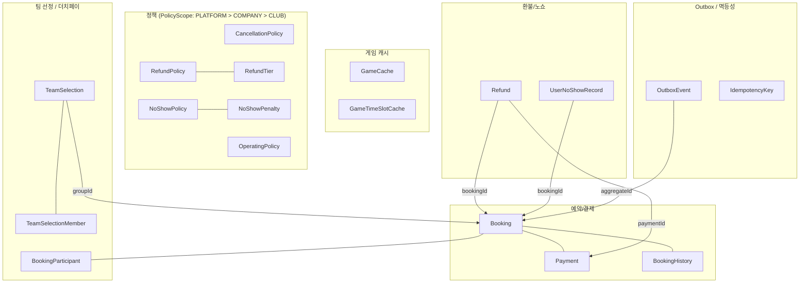
```mermaid
flowchart TB
    subgraph core["예약/결제"]
        B_Booking["Booking"]
        B_Payment["Payment"]
        B_History["BookingHistory"]
        B_Booking --- B_Payment
        B_Booking --- B_History
    end

    subgraph team["팀 선정 / 더치페이"]
        TS_Selection["TeamSelection"]
        TS_Member["TeamSelectionMember"]
        BG_Participant["BookingParticipant"]
        TS_Selection --- TS_Member
        B_Booking --- BG_Participant
    end

    subgraph cache["게임 캐시"]
        BC_Game["GameCache"]
        BC_Slot["GameTimeSlotCache"]
    end

    subgraph refund["환불/노쇼"]
        R_Refund["Refund"]
        R_NoShow["UserNoShowRecord"]
    end

    subgraph policy["정책 (PolicyScope: PLATFORM > COMPANY > CLUB)"]
        P_Cancel["CancellationPolicy"]
        P_Refund["RefundPolicy"]
        P_RefundTier["RefundTier"]
        P_NoShow["NoShowPolicy"]
        P_NoShowPenalty["NoShowPenalty"]
        P_Operating["OperatingPolicy"]
        P_Refund --- P_RefundTier
        P_NoShow --- P_NoShowPenalty
    end

    subgraph outbox["Outbox / 멱등성"]
        S_Outbox["OutboxEvent"]
        S_Idempotency["IdempotencyKey"]
    end

    R_Refund -->|bookingId| B_Booking
    R_Refund -->|paymentId| B_Payment
    R_NoShow -->|bookingId| B_Booking
    S_Outbox -->|aggregateId| B_Booking
    TS_Selection -->|groupId| B_Booking
```

> **그룹 간 참조**: Refund.bookingId -> Booking.id | Refund.paymentId -> Payment.id | UserNoShowRecord.bookingId -> Booking.id | Booking.groupId -> TeamSelection.groupId

---

### 3-1. 예약/결제

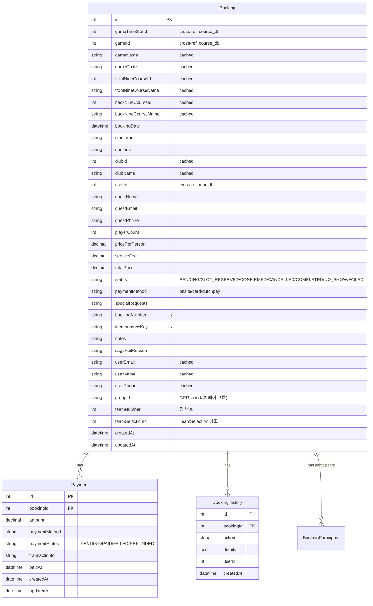
```mermaid
erDiagram
    Booking ||--o{ Payment : "has"
    Booking ||--o{ BookingHistory : "has"
    Booking ||--o{ BookingParticipant : "has participants"

    Booking {
        int id PK
        int gameTimeSlotId "cross-ref: course_db"
        int gameId "cross-ref: course_db"
        string gameName "cached"
        string gameCode "cached"
        int frontNineCourseId "cached"
        string frontNineCourseName "cached"
        int backNineCourseId "cached"
        string backNineCourseName "cached"
        datetime bookingDate
        string startTime
        string endTime
        int clubId "cached"
        string clubName "cached"
        int userId "cross-ref: iam_db"
        string guestName
        string guestEmail
        string guestPhone
        int playerCount
        decimal pricePerPerson
        decimal serviceFee
        decimal totalPrice
        string status "PENDING/SLOT_RESERVED/CONFIRMED/CANCELLED/COMPLETED/NO_SHOW/FAILED"
        string paymentMethod "onsite/card/dutchpay"
        string specialRequests
        string bookingNumber UK
        string idempotencyKey UK
        string notes
        string sagaFailReason
        string userEmail "cached"
        string userName "cached"
        string userPhone "cached"
        string groupId "GRP-xxx (더치페이 그룹)"
        int teamNumber "팀 번호"
        int teamSelectionId "TeamSelection 참조"
        datetime createdAt
        datetime updatedAt
    }

    Payment {
        int id PK
        int bookingId FK
        decimal amount
        string paymentMethod
        string paymentStatus "PENDING/PAID/FAILED/REFUNDED"
        string transactionId
        datetime paidAt
        datetime createdAt
        datetime updatedAt
    }

    BookingHistory {
        int id PK
        int bookingId FK
        string action
        json details
        int userId
        datetime createdAt
    }
```

---

### 3-2. 게임 캐시

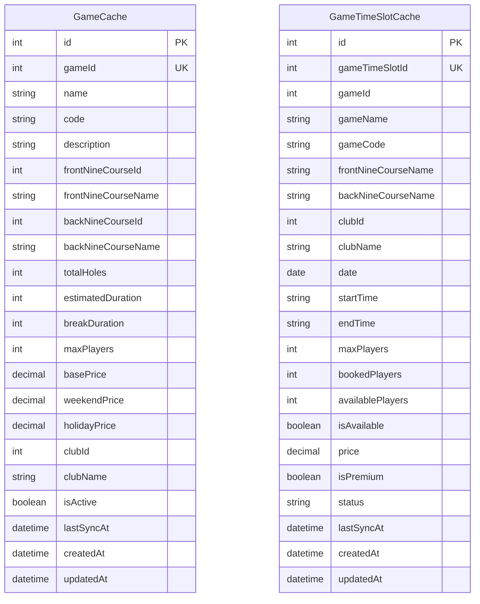
```mermaid
erDiagram
    GameCache {
        int id PK
        int gameId UK
        string name
        string code
        string description
        int frontNineCourseId
        string frontNineCourseName
        int backNineCourseId
        string backNineCourseName
        int totalHoles
        int estimatedDuration
        int breakDuration
        int maxPlayers
        decimal basePrice
        decimal weekendPrice
        decimal holidayPrice
        int clubId
        string clubName
        boolean isActive
        datetime lastSyncAt
        datetime createdAt
        datetime updatedAt
    }

    GameTimeSlotCache {
        int id PK
        int gameTimeSlotId UK
        int gameId
        string gameName
        string gameCode
        string frontNineCourseName
        string backNineCourseName
        int clubId
        string clubName
        date date
        string startTime
        string endTime
        int maxPlayers
        int bookedPlayers
        int availablePlayers
        boolean isAvailable
        decimal price
        boolean isPremium
        string status
        datetime lastSyncAt
        datetime createdAt
        datetime updatedAt
    }
```

---

### 3-3. 환불/노쇼

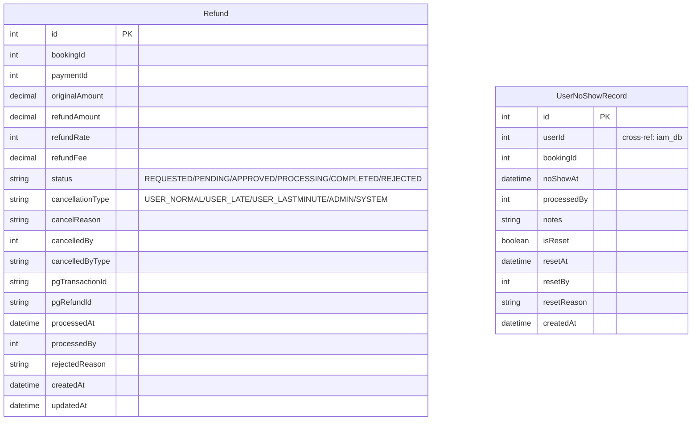
```mermaid
erDiagram
    Refund {
        int id PK
        int bookingId
        int paymentId
        decimal originalAmount
        decimal refundAmount
        int refundRate
        decimal refundFee
        string status "REQUESTED/PENDING/APPROVED/PROCESSING/COMPLETED/REJECTED"
        string cancellationType "USER_NORMAL/USER_LATE/USER_LASTMINUTE/ADMIN/SYSTEM"
        string cancelReason
        int cancelledBy
        string cancelledByType
        string pgTransactionId
        string pgRefundId
        datetime processedAt
        int processedBy
        string rejectedReason
        datetime createdAt
        datetime updatedAt
    }

    UserNoShowRecord {
        int id PK
        int userId "cross-ref: iam_db"
        int bookingId
        datetime noShowAt
        int processedBy
        string notes
        boolean isReset
        datetime resetAt
        int resetBy
        string resetReason
        datetime createdAt
    }
```

---

### 3-4. 정책

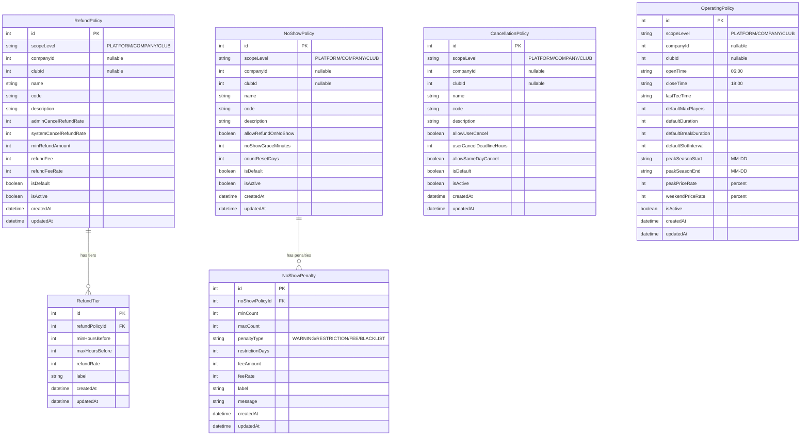
```mermaid
erDiagram
    RefundPolicy ||--o{ RefundTier : "has tiers"
    NoShowPolicy ||--o{ NoShowPenalty : "has penalties"

    CancellationPolicy {
        int id PK
        string scopeLevel "PLATFORM/COMPANY/CLUB"
        int companyId "nullable"
        int clubId "nullable"
        string name
        string code
        string description
        boolean allowUserCancel
        int userCancelDeadlineHours
        boolean allowSameDayCancel
        boolean isDefault
        boolean isActive
        datetime createdAt
        datetime updatedAt
    }

    RefundPolicy {
        int id PK
        string scopeLevel "PLATFORM/COMPANY/CLUB"
        int companyId "nullable"
        int clubId "nullable"
        string name
        string code
        string description
        int adminCancelRefundRate
        int systemCancelRefundRate
        int minRefundAmount
        int refundFee
        int refundFeeRate
        boolean isDefault
        boolean isActive
        datetime createdAt
        datetime updatedAt
    }

    RefundTier {
        int id PK
        int refundPolicyId FK
        int minHoursBefore
        int maxHoursBefore
        int refundRate
        string label
        datetime createdAt
        datetime updatedAt
    }

    NoShowPolicy {
        int id PK
        string scopeLevel "PLATFORM/COMPANY/CLUB"
        int companyId "nullable"
        int clubId "nullable"
        string name
        string code
        string description
        boolean allowRefundOnNoShow
        int noShowGraceMinutes
        int countResetDays
        boolean isDefault
        boolean isActive
        datetime createdAt
        datetime updatedAt
    }

    NoShowPenalty {
        int id PK
        int noShowPolicyId FK
        int minCount
        int maxCount
        string penaltyType "WARNING/RESTRICTION/FEE/BLACKLIST"
        int restrictionDays
        int feeAmount
        int feeRate
        string label
        string message
        datetime createdAt
        datetime updatedAt
    }

    OperatingPolicy {
        int id PK
        string scopeLevel "PLATFORM/COMPANY/CLUB"
        int companyId "nullable"
        int clubId "nullable"
        string openTime "06:00"
        string closeTime "18:00"
        string lastTeeTime
        int defaultMaxPlayers
        int defaultDuration
        int defaultBreakDuration
        int defaultSlotInterval
        string peakSeasonStart "MM-DD"
        string peakSeasonEnd "MM-DD"
        int peakPriceRate "percent"
        int weekendPriceRate "percent"
        boolean isActive
        datetime createdAt
        datetime updatedAt
    }
```

> **정책 스코프**: 모든 정책 모델은 `@@unique([scopeLevel, companyId, clubId])`로 스코프 당 하나의 정책만 허용합니다. resolve 시 Club -> Company -> Platform 순으로 폴백합니다.

---

### 3-5. Outbox / 멱등성

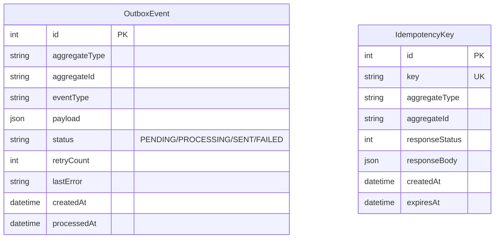
```mermaid
erDiagram
    OutboxEvent {
        int id PK
        string aggregateType
        string aggregateId
        string eventType
        json payload
        string status "PENDING/PROCESSING/SENT/FAILED"
        int retryCount
        string lastError
        datetime createdAt
        datetime processedAt
    }

    IdempotencyKey {
        int id PK
        string key UK
        string aggregateType
        string aggregateId
        int responseStatus
        json responseBody
        datetime createdAt
        datetime expiresAt
    }
```

---

### 3-6. 팀 선정 / 더치페이

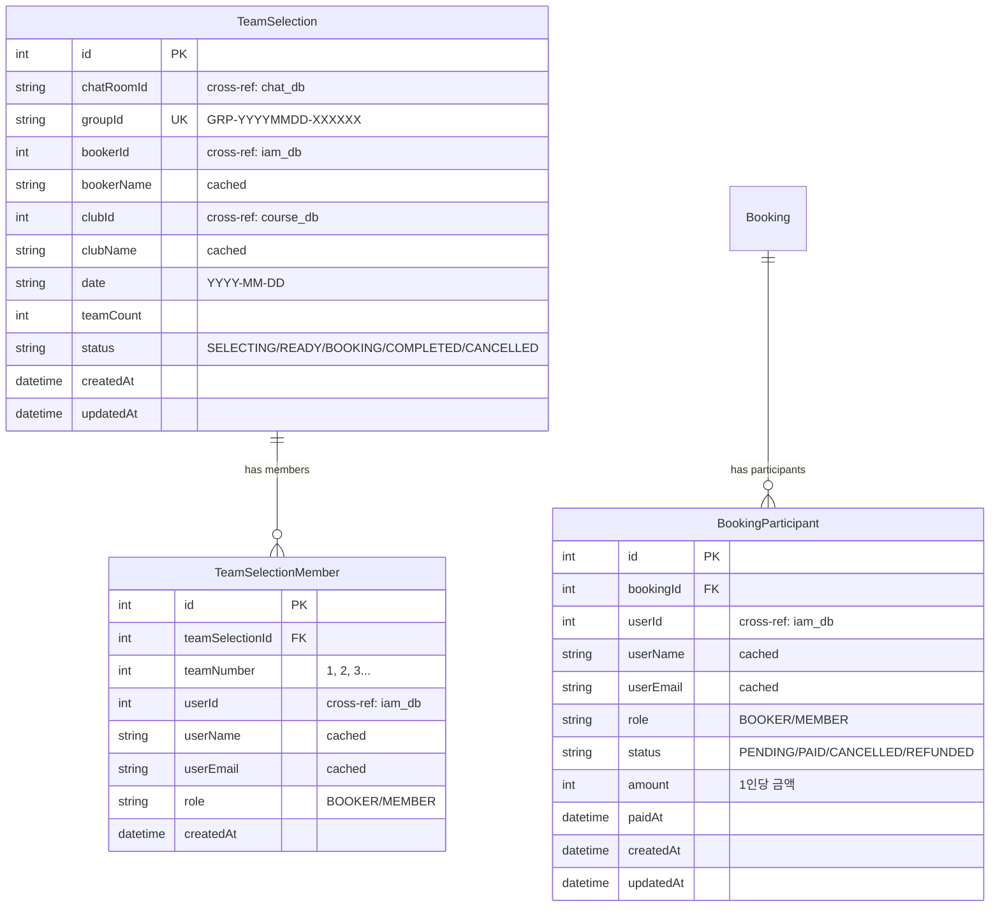
```mermaid
erDiagram
    TeamSelection ||--o{ TeamSelectionMember : "has members"
    Booking ||--o{ BookingParticipant : "has participants"

    TeamSelection {
        int id PK
        string chatRoomId "cross-ref: chat_db"
        string groupId UK "GRP-YYYYMMDD-XXXXXX"
        int bookerId "cross-ref: iam_db"
        string bookerName "cached"
        int clubId "cross-ref: course_db"
        string clubName "cached"
        string date "YYYY-MM-DD"
        int teamCount
        string status "SELECTING/READY/BOOKING/COMPLETED/CANCELLED"
        datetime createdAt
        datetime updatedAt
    }

    TeamSelectionMember {
        int id PK
        int teamSelectionId FK
        int teamNumber "1, 2, 3..."
        int userId "cross-ref: iam_db"
        string userName "cached"
        string userEmail "cached"
        string role "BOOKER/MEMBER"
        datetime createdAt
    }

    BookingParticipant {
        int id PK
        int bookingId FK
        int userId "cross-ref: iam_db"
        string userName "cached"
        string userEmail "cached"
        string role "BOOKER/MEMBER"
        string status "PENDING/PAID/CANCELLED/REFUNDED"
        int amount "1인당 금액"
        datetime paidAt
        datetime createdAt
        datetime updatedAt
    }
```

> **TeamSelection**: 채팅방에서 멤버를 선택하고 팀을 구성하는 과정을 관리합니다. 상태가 `COMPLETED`로 전이되면 각 팀별 Booking이 생성됩니다. `groupId`(GRP-xxx)로 Booking.groupId와 연결됩니다.
> **TeamSelectionMember**: 팀별 멤버 배정 목록. `@@unique([teamSelectionId, teamNumber, userId])`로 중복 방지.
> **BookingParticipant**: 팀별 참여자의 개별 결제 상태. `@@unique([bookingId, userId])`로 중복 방지. 결제 완료 시 `PAID`로 전이.

---

## 4. Payment Service (payment_db)

### 전체 구조

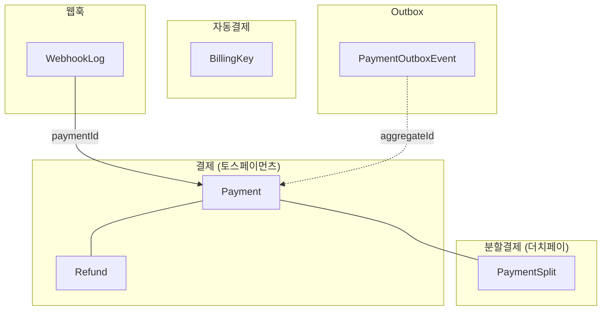
```mermaid
flowchart TB
    subgraph core["결제 (토스페이먼츠)"]
        P_Payment["Payment"]
        P_Refund["Refund"]
        P_Payment --- P_Refund
    end

    subgraph split["분할결제 (더치페이)"]
        P_Split["PaymentSplit"]
        P_Payment --- P_Split
    end

    subgraph billing["자동결제"]
        P_BillingKey["BillingKey"]
    end

    subgraph webhook["웹훅"]
        P_WebhookLog["WebhookLog"]
    end

    subgraph outbox["Outbox"]
        P_Outbox["PaymentOutboxEvent"]
    end

    P_WebhookLog -->|paymentId| P_Payment
    P_Outbox -.->|aggregateId| P_Payment
```

> **서비스 간 참조**: Payment.userId -> iam_db.User.id | Payment.bookingId -> booking_db.Booking.id

---

### 4-1. 결제 (토스페이먼츠)

```mermaid
erDiagram
    Payment ||--o{ Refund : "has"
    Payment ||--o{ WebhookLog : "logs"

    Payment {
        int id PK
        string paymentKey UK "토스 결제 키"
        string orderId UK "주문 ID (PG-XXXXX)"
        string orderName
        int amount
        string currency "KRW"
        string method "CARD/TRANSFER/VIRTUAL_ACCOUNT/EASY_PAY/MOBILE"
        string easyPayProvider "TOSSPAY/KAKAOPAY/NAVERPAY"
        string cardCompany
        string cardCompanyName
        string cardNumber "마스킹"
        string cardType "신용/체크/기프트"
        string ownerType "개인/법인"
        int installmentMonths
        boolean isInterestFree
        string virtualAccountNumber
        string virtualBankCode
        string virtualBankName
        datetime virtualDueDate
        string virtualAccountHolder
        string transferBankCode
        string transferBankName
        string status "READY/IN_PROGRESS/WAITING_FOR_DEPOSIT/DONE/CANCELED/PARTIAL_CANCELED/ABORTED/EXPIRED"
        int userId "cross-ref: iam_db"
        int bookingId UK "cross-ref: booking_db"
        datetime approvedAt
        datetime requestedAt
        datetime cancelledAt
        string cancelReason
        int cancelAmount
        string receiptUrl
        string checkoutUrl
        json metadata
        string customerName
        string customerEmail
        string customerPhone
        datetime createdAt
        datetime updatedAt
    }

    Refund {
        int id PK
        int paymentId FK
        string transactionKey UK "토스 거래 키"
        string cancelReason
        int cancelAmount
        int taxFreeAmount
        string refundStatus "PENDING/PROCESSING/COMPLETED/FAILED"
        string refundBankCode
        string refundBankName
        string refundAccount
        string refundHolder
        datetime refundedAt
        int requestedBy
        string requestedByType "USER/ADMIN/SYSTEM"
        datetime createdAt
        datetime updatedAt
    }
```

---

### 4-2. 빌링키 (자동결제)

```mermaid
erDiagram
    BillingKey {
        int id PK
        int userId "cross-ref: iam_db"
        string billingKey UK "토스 빌링키"
        string customerKey
        datetime authenticatedAt
        string cardCompany
        string cardCompanyName
        string cardNumber "마스킹"
        string cardType "신용/체크"
        boolean isActive
        datetime createdAt
        datetime updatedAt
    }
```

---

### 4-3. 분할결제 (더치페이)

```mermaid
erDiagram
    Payment ||--o{ PaymentSplit : "has splits"

    PaymentSplit {
        int id PK
        int paymentId FK "nullable, 결제 완료 시 연결"
        int bookingGroupId "cross-ref: booking_db"
        int bookingId "cross-ref: booking_db"
        int userId "cross-ref: iam_db"
        string userName "cached"
        string userEmail "cached"
        int amount "분담 금액"
        string status "PENDING/PAID/EXPIRED/CANCELLED/REFUNDED"
        string orderId UK "개별 Toss 주문 ID"
        datetime paidAt
        datetime expiredAt "결제 기한"
        datetime createdAt
        datetime updatedAt
    }
```

> **PaymentSplit**: 더치페이 참여자별 분할결제 레코드. 각 참여자에게 고유 `orderId`가 발급되며, Toss 결제위젯으로 개별 결제를 진행한다. `@@index([bookingGroupId, status])`, `@@index([bookingId])`, `@@index([userId, status])`

---

### 4-4. 웹훅/Outbox

```mermaid
erDiagram
    WebhookLog {
        int id PK
        int paymentId FK
        string eventType
        json payload
        string status "RECEIVED/PROCESSING/PROCESSED/FAILED"
        datetime processedAt
        string errorMessage
        datetime createdAt
    }

    PaymentOutboxEvent {
        int id PK
        string aggregateType
        string aggregateId
        string eventType
        json payload
        string status "PENDING/PROCESSING/SENT/FAILED"
        int retryCount
        string lastError
        datetime createdAt
        datetime processedAt
    }
```

---

## 5. Saga Service (saga_db)

### 전체 구조

```mermaid
flowchart LR
    SagaExecution --- SagaStep
    SagaExecution -.-> OutboxEvent
```

### 상세

```mermaid
erDiagram
    SagaExecution ||--o{ SagaStep : "has"

    SagaExecution {
        int id PK
        string sagaType "CREATE_BOOKING/CANCEL_BOOKING/ADMIN_REFUND/PAYMENT_CONFIRMED/PAYMENT_TIMEOUT"
        string correlationId UK "booking:123"
        string status "STARTED/STEP_EXECUTING/STEP_COMPLETED/COMPLETED/STEP_FAILED/COMPENSATING/COMPENSATION_COMPLETED/COMPENSATION_FAILED/FAILED/REQUIRES_MANUAL"
        int currentStep
        int totalSteps
        json payload "Saga 컨텍스트 (공유 데이터)"
        string failReason
        string triggeredBy "USER/ADMIN/SYSTEM/SCHEDULER"
        int triggeredById
        datetime startedAt
        datetime completedAt
        datetime failedAt
    }

    SagaStep {
        int id PK
        int sagaExecutionId FK
        int stepIndex
        string stepName
        string actionPattern "NATS 패턴"
        string status "PENDING/EXECUTING/COMPLETED/FAILED/COMPENSATED/SKIPPED"
        int retryCount
        json requestPayload
        json responsePayload
        string errorMessage
        boolean isCompensation
        string compensatePattern
        datetime startedAt
        datetime completedAt
    }

    OutboxEvent {
        int id PK
        string aggregateType "SagaExecution"
        string aggregateId
        string eventType
        json payload
        string status "PENDING/PROCESSING/SENT/FAILED"
        int retryCount
        string lastError
        datetime createdAt
        datetime processedAt
    }
```

> **설명**: saga-service는 분산 트랜잭션의 중앙 오케스트레이터입니다. SagaExecution이 전체 Saga 흐름을 추적하고, SagaStep이 개별 Step의 실행/보상 이력을 기록합니다. 실패 시 보상(compensation)이 자동 역순 실행되며, 보상 실패 시 `REQUIRES_MANUAL` 상태로 전이됩니다.

---

## 6. Chat Service (chat_db)

### 전체 구조

```mermaid
flowchart LR
    ChatRoom --- ChatRoomMember
    ChatRoom --- ChatMessage
    ChatMessage -.-> MessageRead
```

### 상세

```mermaid
erDiagram
    ChatRoom ||--o{ ChatRoomMember : "has"
    ChatRoom ||--o{ ChatMessage : "has"

    ChatRoom {
        uuid id PK
        string name
        string type "DIRECT/CHANNEL/BOOKING"
        int bookingId "cross-ref: booking_db"
        datetime createdAt
        datetime updatedAt
    }

    ChatRoomMember {
        uuid id PK
        string roomId FK
        int userId "cross-ref: iam_db"
        string userName "cached"
        string userEmail "cached"
        datetime joinedAt
        datetime leftAt
        boolean isAdmin
        string lastReadMessageId
        datetime lastReadAt
    }

    ChatMessage {
        uuid id PK
        string roomId FK
        int senderId "0=AI 브로드캐스트, cross-ref: iam_db"
        string senderName "cached"
        string content
        string type "TEXT/IMAGE/SYSTEM/AI_USER/AI_ASSISTANT"
        string metadata "nullable, AI 액션 JSON"
        datetime createdAt
        datetime deletedAt "soft delete"
    }

    MessageRead {
        uuid id PK
        string messageId
        int userId "cross-ref: iam_db"
        datetime readAt
    }
```

---

## 7. Notification Service (notify_db)

### 전체 구조

```mermaid
flowchart LR
    Notification -.->|"failed"| DeadLetterNotification
    NotificationTemplate -.->|"type"| Notification
    NotificationSettings -.->|"channel filter"| Notification
```

### 상세

```mermaid
erDiagram
    Notification {
        int id PK
        string userId "cross-ref: iam_db"
        string type "BOOKING_CONFIRMED/CANCELLED/REFUND_COMPLETED/PAYMENT_SUCCESS/FAILED/SPLIT_PAYMENT_REQUEST/etc"
        string title
        string message
        json data
        string status "PENDING/SENT/FAILED/READ"
        string deliveryChannel "PUSH/EMAIL/SMS"
        int retryCount
        int maxRetries
        datetime scheduledAt
        datetime sentAt
        datetime readAt
        datetime createdAt
        datetime updatedAt
    }

    NotificationTemplate {
        int id PK
        string type
        string title
        string content
        json variables
        boolean isActive
        datetime createdAt
        datetime updatedAt
    }

    NotificationSettings {
        int id PK
        string userId UK
        boolean email
        boolean sms
        boolean push
        boolean marketing
        datetime createdAt
        datetime updatedAt
    }

    DeadLetterNotification {
        int id PK
        int originalId
        string userId
        string type
        string title
        string message
        json data
        string deliveryChannel
        string failureReason
        int retryCount
        datetime movedAt
    }
```

---

## 8. Partner Service (partner_db)

### 전체 구조

```mermaid
flowchart TB
    subgraph config["연동 설정"]
        P_Config["PartnerConfig"]
        P_Course["GameMapping"]
        P_Config --- P_Course
    end

    subgraph mapping["데이터 매핑"]
        P_Slot["SlotMapping"]
        P_Booking["BookingMapping"]
        P_Course --- P_Slot
    end

    subgraph log["동기화 이력"]
        P_SyncLog["SyncLog"]
    end

    P_Config --- P_SyncLog
    P_Booking -.->|partnerId| P_Config
```

> **서비스 간 참조**: PartnerConfig.clubId -> course_db.Club.id | PartnerConfig.companyId -> iam_db.Company.id | GameMapping.internalGameId -> course_db.Game.id | SlotMapping.internalSlotId -> course_db.GameTimeSlot.id | BookingMapping.internalBookingId -> booking_db.Booking.id

---

### 8-1. 연동 설정

```mermaid
erDiagram
    PartnerConfig ||--o{ GameMapping : "has"
    PartnerConfig ||--o{ SyncLog : "logs"

    PartnerConfig {
        int id PK
        int clubId UK "cross-ref: course_db"
        int companyId "cross-ref: iam_db"
        string systemName "외부 시스템 표시명"
        string externalClubId UK "외부 시스템 골프장 ID"
        string specUrl "OpenAPI 스펙 URL"
        string apiKey "AES-256 암호화"
        string apiSecret "AES-256 암호화"
        string webhookSecret "웹훅 서명 검증용"
        json responseMapping "응답 필드 매핑 설정"
        string syncMode "API_POLLING/WEBHOOK/HYBRID/MANUAL"
        int syncIntervalMin "폴링 주기 (기본 10분)"
        int syncRangeDays "동기화 범위 (기본 7일)"
        boolean slotSyncEnabled
        boolean bookingSyncEnabled
        boolean isActive
        datetime lastSlotSyncAt
        string lastSlotSyncStatus "SUCCESS/PARTIAL/FAILED"
        string lastSlotSyncError
        datetime lastBookingSyncAt
        datetime createdAt
        datetime updatedAt
    }

    GameMapping {
        int id PK
        int partnerId FK
        string externalCourseName "외부 코스명"
        string externalCourseId "외부 코스 ID"
        int internalGameId "cross-ref: course_db Game.id"
        boolean isActive
        datetime createdAt
        datetime updatedAt
    }
```

> **PartnerConfig**: 골프장별 1건의 연동 설정. `BookingMode: PARTNER`인 Club에만 생성됩니다. `@@unique([externalClubId])`, `@@index([isActive, companyId])`
> **GameMapping**: 외부 코스명 ↔ 내부 Game ID 매핑. `@@unique([partnerId, externalCourseName])`, `@@unique([partnerId, internalGameId])`

---

### 8-2. 슬롯 매핑

```mermaid
erDiagram
    GameMapping ||--o{ SlotMapping : "has"

    SlotMapping {
        int id PK
        int gameMappingId FK
        string externalSlotId "외부 슬롯 ID"
        date date
        string startTime "HH:mm"
        string endTime "HH:mm"
        int internalSlotId "cross-ref: course_db GameTimeSlot.id"
        int externalMaxPlayers
        int externalBooked "외부 예약 인원"
        string externalStatus "AVAILABLE/FULLY_BOOKED/CLOSED"
        decimal externalPrice
        string syncStatus "SYNCED/PENDING/CONFLICT/UNMAPPED/FAILED"
        string syncError
        datetime lastSyncAt
        datetime createdAt
        datetime updatedAt
    }
```

> **SlotMapping**: 외부 슬롯 ↔ 내부 GameTimeSlot 매핑. 10분 주기 cron으로 외부 재고 스냅샷을 갱신합니다. `@@unique([gameMappingId, externalSlotId])`, `@@unique([gameMappingId, date, startTime])`

---

### 8-3. 예약 매핑

```mermaid
erDiagram
    BookingMapping {
        int id PK
        int partnerId "PartnerConfig.id (논리 참조)"
        int gameMappingId "GameMapping.id"
        int internalBookingId UK "cross-ref: booking_db Booking.id"
        string externalBookingId "외부 예약 ID"
        string syncDirection "INBOUND/OUTBOUND"
        string syncStatus "SYNCED/PENDING/CONFLICT/FAILED/CANCELLED"
        datetime lastSyncAt
        date date
        string startTime
        int playerCount
        string playerName
        string status "CONFIRMED/CANCELLED/COMPLETED"
        json conflictData "충돌 시 양쪽 데이터 스냅샷"
        datetime createdAt
        datetime updatedAt
    }
```

> **BookingMapping**: 양방향 예약 매핑. INBOUND(외부→내부)는 외부 예약을 파크골프메이트에 반영, OUTBOUND(내부→외부)는 파크골프메이트 예약을 외부에 전파. `@@unique([partnerId, externalBookingId])`

---

### 8-4. 동기화 이력

```mermaid
erDiagram
    PartnerConfig ||--o{ SyncLog : "logs"

    SyncLog {
        int id PK
        int partnerId FK
        string action "SLOT_SYNC/BOOKING_IMPORT/BOOKING_EXPORT/BOOKING_CANCEL/CONNECTION_TEST"
        string direction "INBOUND/OUTBOUND"
        string status "SUCCESS/PARTIAL/FAILED"
        int recordCount "처리 건수"
        int createdCount "신규 건수"
        int updatedCount "갱신 건수"
        int errorCount "실패 건수"
        string errorMessage
        int durationMs "소요 시간 (ms)"
        json payload "요청/응답 요약 (디버깅용)"
        datetime createdAt
    }
```

> **SyncLog**: 동기화 작업별 처리 결과를 기록합니다. job-service의 10분 주기 cron과 수동 동기화 모두 기록됩니다. `@@index([partnerId, createdAt])`, `@@index([action, status])`

---

## Enum 정의 참조

### IAM Service

| Enum | 값 | 설명 |
|------|----|------|
| CompanyType | `PLATFORM`, `ASSOCIATION`, `FRANCHISE` | 회사 유형 |
| CompanyStatus | `ACTIVE`, `INACTIVE`, `SUSPENDED`, `PENDING` | 회사 상태 |
| CompanyMemberSource | `BOOKING`, `MANUAL`, `WALK_IN` | 회원 등록 경로 |
| FriendRequestStatus | `PENDING`, `ACCEPTED`, `REJECTED` | 친구 요청 상태 |
| DevicePlatform | `IOS`, `ANDROID`, `WEB` | 디바이스 플랫폼 |

### Course Service

| Enum | 값 | 설명 |
|------|----|------|
| ClubStatus | `ACTIVE`, `INACTIVE`, `MAINTENANCE`, `SEASONAL_CLOSED` | 골프장 상태 |
| ClubType | `PUBLIC`, `PRIVATE` | 골프장 유형 (지자체/사설) |
| BookingMode | `PLATFORM`, `PARTNER` | 부킹 연동 방식 (자체 플랫폼/파트너 연동) |
| CourseStatus | `ACTIVE`, `INACTIVE`, `MAINTENANCE` | 코스 상태 |
| GameStatus | `ACTIVE`, `INACTIVE`, `MAINTENANCE` | 게임 상태 |
| SlotMode | `TEE_TIME`, `SESSION` | 슬롯 모드 |
| TimeSlotStatus | `AVAILABLE`, `FULLY_BOOKED`, `CLOSED`, `MAINTENANCE` | 타임슬롯 상태 |
| TeeBoxLevel | `BEGINNER`, `INTERMEDIATE`, `ADVANCED`, `PROFESSIONAL` | 티박스 난이도 |

### Booking Service

| Enum | 값 | 설명 |
|------|----|------|
| BookingStatus | `PENDING`, `SLOT_RESERVED`, `CONFIRMED`, `CANCELLED`, `COMPLETED`, `NO_SHOW`, `FAILED` | 예약 상태 |
| PolicyScope | `PLATFORM`, `COMPANY`, `CLUB` | 정책 스코프 (계층형 상속) |
| PaymentStatus | `PENDING`, `PAID`, `FAILED`, `REFUNDED` | 결제 상태 |
| TimeSlotCacheStatus | `AVAILABLE`, `FULLY_BOOKED`, `CLOSED`, `MAINTENANCE` | 슬롯 캐시 상태 |
| OutboxStatus | `PENDING`, `PROCESSING`, `SENT`, `FAILED` | Outbox 이벤트 상태 |
| RefundStatus | `REQUESTED`, `PENDING`, `APPROVED`, `PROCESSING`, `COMPLETED`, `REJECTED` | 환불 상태 |
| CancellationType | `USER_NORMAL`, `USER_LATE`, `USER_LASTMINUTE`, `ADMIN`, `SYSTEM` | 취소 유형 |
| NoShowPenaltyType | `WARNING`, `RESTRICTION`, `FEE`, `BLACKLIST` | 노쇼 페널티 |
| TeamSelectionStatus | `SELECTING`, `READY`, `BOOKING`, `COMPLETED`, `CANCELLED` | 팀 선정 상태 |
| ParticipantRole | `BOOKER`, `MEMBER` | 참여자 역할 |
| ParticipantStatus | `PENDING`, `PAID`, `CANCELLED`, `REFUNDED` | 참여자 결제 상태 |

### Saga Service

| Enum | 값 | 설명 |
|------|----|------|
| SagaStatus | `STARTED`, `STEP_EXECUTING`, `STEP_COMPLETED`, `COMPLETED`, `STEP_FAILED`, `COMPENSATING`, `COMPENSATION_COMPLETED`, `COMPENSATION_FAILED`, `FAILED`, `REQUIRES_MANUAL` | Saga 실행 상태 |
| StepStatus | `PENDING`, `EXECUTING`, `COMPLETED`, `FAILED`, `COMPENSATED`, `SKIPPED` | Step 실행 상태 |
| OutboxStatus | `PENDING`, `PROCESSING`, `SENT`, `FAILED` | Outbox 이벤트 상태 |

### Payment Service

| Enum | 값 | 설명 |
|------|----|------|
| PaymentMethod | `CARD`, `TRANSFER`, `VIRTUAL_ACCOUNT`, `EASY_PAY`, `MOBILE`, `GIFT_CERTIFICATE`, `CULTURE_GIFT` | 결제 수단 |
| PaymentStatus | `READY`, `IN_PROGRESS`, `WAITING_FOR_DEPOSIT`, `DONE`, `CANCELED`, `PARTIAL_CANCELED`, `ABORTED`, `EXPIRED` | 결제 상태 (토스) |
| RefundStatus | `PENDING`, `PROCESSING`, `COMPLETED`, `FAILED` | 환불 상태 |
| RefundRequestorType | `USER`, `ADMIN`, `SYSTEM` | 환불 요청자 유형 |
| WebhookStatus | `RECEIVED`, `PROCESSING`, `PROCESSED`, `FAILED` | 웹훅 상태 |
| OutboxStatus | `PENDING`, `PROCESSING`, `SENT`, `FAILED` | Outbox 이벤트 상태 |
| SplitStatus | `PENDING`, `PAID`, `EXPIRED`, `CANCELLED`, `REFUNDED` | 분할결제 상태 |

### Partner Service

| Enum | 값 | 설명 |
|------|----|------|
| SyncMode | `API_POLLING`, `WEBHOOK`, `HYBRID`, `MANUAL` | 동기화 모드 |
| SyncResult | `SUCCESS`, `PARTIAL`, `FAILED` | 동기화 결과 |
| SyncAction | `SLOT_SYNC`, `BOOKING_IMPORT`, `BOOKING_EXPORT`, `BOOKING_CANCEL`, `CONNECTION_TEST` | 동기화 작업 유형 |
| SyncDirection | `INBOUND`, `OUTBOUND` | 동기화 방향 |
| SlotSyncStatus | `SYNCED`, `PENDING`, `CONFLICT`, `UNMAPPED`, `FAILED` | 슬롯 동기화 상태 |
| BookingSyncStatus | `SYNCED`, `PENDING`, `CONFLICT`, `FAILED`, `CANCELLED` | 예약 동기화 상태 |

### Chat Service

| Enum | 값 | 설명 |
|------|----|------|
| RoomType | `DIRECT`, `CHANNEL`, `BOOKING` | 채팅방 유형 |
| MessageType | `TEXT`, `IMAGE`, `SYSTEM`, `AI_USER`, `AI_ASSISTANT` | 메시지 유형 (DB 컬럼: `type`, 서비스 간: `messageType`) |

### Notification Service

| Enum | 값 | 설명 |
|------|----|------|
| NotificationType | `BOOKING_CONFIRMED`, `BOOKING_CANCELLED`, `REFUND_COMPLETED`, `PAYMENT_SUCCESS`, `PAYMENT_FAILED`, `FRIEND_REQUEST`, `FRIEND_ACCEPTED`, `CHAT_MESSAGE`, `SYSTEM_ALERT`, `SPLIT_PAYMENT_REQUEST` | 알림 유형 |
| NotificationStatus | `PENDING`, `SENT`, `FAILED`, `READ` | 알림 상태 |
| DeliveryChannelType | `PUSH`, `EMAIL`, `SMS` | 알림 전달 채널 |

---

## 테이블 통계 요약

| 데이터베이스 | 모델 수 | 주요 모델 |
|------------|---------|----------|
| iam_db | 19 | Company, Admin, User, RoleMaster, MenuMaster, CompanyMember, UserHistory |
| course_db | 8 | Club, Course, Hole, TeeBox, Game, GameTimeSlot |
| booking_db | 18 | Booking, TeamSelection, TeamSelectionMember, BookingParticipant, Refund, CancellationPolicy, OutboxEvent |
| saga_db | 3 | SagaExecution, SagaStep, OutboxEvent |
| payment_db | 6 | Payment, PaymentSplit, Refund, BillingKey, WebhookLog, PaymentOutboxEvent |
| partner_db | 5 | PartnerConfig, GameMapping, SlotMapping, BookingMapping, SyncLog |
| chat_db | 4 | ChatRoom, ChatRoomMember, ChatMessage, MessageRead |
| notify_db | 4 | Notification, NotificationTemplate, NotificationSettings, DeadLetterNotification |
| **합계** | **67** | |
