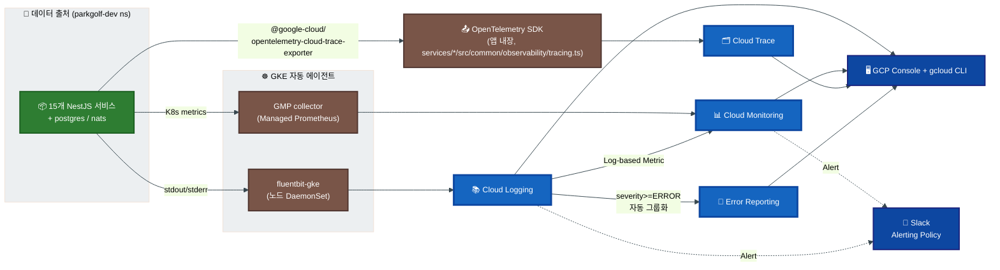
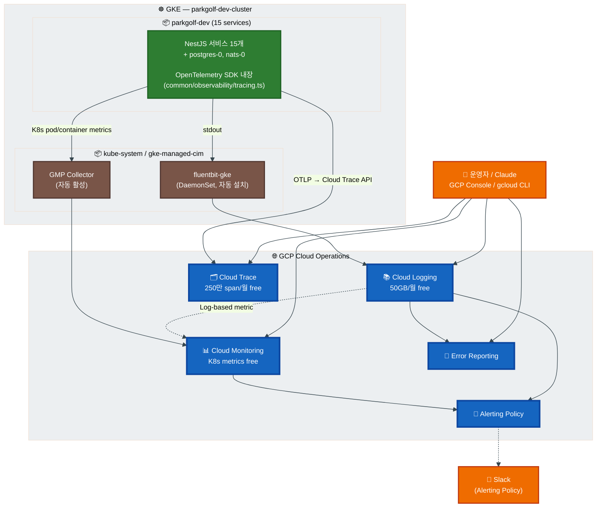

# 관측성(Observability) 아키텍처 — GCP Cloud-native

`parkgolf-dev-cluster` (GKE Standard) 위의 15개 NestJS 마이크로서비스를 **메트릭 → 로그 → 트레이스** 3축으로 관측. 자체 호스팅 OSS(Prometheus / Loki / Tempo / Grafana) 없이 **GCP Managed Services**만 사용한다.

> **구축 상태**: Phase 1·2 (메트릭·로그)는 GKE 옵션으로 자동 수집 중. Phase 3 (트레이스)는 OpenTelemetry SDK를 15개 서비스에 적용 완료.

---

## 1. 비즈니스 가치 요약

> **관측성 통합 시스템 (GCP Cloud Operations Suite)**
>
> - 15개 MSA 의 **메트릭(Cloud Monitoring) · 로그(Cloud Logging) · 트레이스(Cloud Trace)** 를 GCP Console / `gcloud` CLI 한 줄로 즉시 조회
> - 장애 분석 워크플로: **무엇이?**(메트릭) → **왜?**(로그) → **어디서?**(트레이스) — 모두 같은 콘솔
> - **OpenTelemetry 표준** 기반 export — 향후 자체 호스팅으로 이전 가능 (벤더 lock-in 최소)
> - **추가 인프라 0** — Helm 차트 4개 (Prometheus/Loki/Tempo/Grafana) 자체 호스팅 대비 운영 부담 0
> - dev 환경 **무료 (free tier 안)** / prod도 트래픽 기반 종량제

---

## 2. 전체 그림



---

## 3. 3축 역할 분담

| 축 | GCP 서비스 | 데이터 소스 | 답하는 질문 |
|----|------|------|------------|
| **메트릭** | Cloud Monitoring + Managed Service for Prometheus (GMP) | GKE system + (선택) app `/metrics` | **무엇이** 일어났나? (CPU spike, latency, error rate) |
| **로그** | Cloud Logging | 각 pod의 stdout/stderr (fluentbit-gke) | **왜** 일어났나? (에러 메시지, stack trace) |
| **트레이스** | Cloud Trace | OpenTelemetry SDK (앱 내장) | **어디서** 일어났나? (어느 서비스의 어느 메서드가 느렸나) |

추가 자동 활용:
- **Error Reporting**: Cloud Logging의 `severity>=ERROR` 자동 그룹화·중복 제거
- **Log-based Metrics**: 특정 로그 패턴(`booking.failed` 등)을 메트릭으로 추출

---

## 4. 전체 아키텍처



---

## 5. 구성 상세 — 현재 구축 상태

### 5.1 Cloud Logging (이미 가동)

| 항목 | 값 |
|---|---|
| 활성화 | cd-infra `gke-setup` 시 `--logging=SYSTEM,WORKLOAD` |
| 수집 대상 | 모든 pod의 stdout/stderr + K8s system 컴포넌트 |
| 수집 agent | `fluentbit-gke` DaemonSet (GKE 자동) |
| 보관 기간 | 30일 기본 (Log Bucket 설정으로 연장 가능) |
| 비용 (dev) | 50GB/월 무료 — 현재 트래픽으로 충분 |

### 5.2 Cloud Monitoring + Managed Prometheus (이미 가동)

| 항목 | 값 |
|---|---|
| 활성화 | cd-infra `gke-setup` 시 `--monitoring=SYSTEM` + `managedPrometheus.enabled=true` |
| 수집 대상 | 노드 CPU/메모리/디스크, Pod 리소스, K8s events |
| Prometheus 호환 | GMP가 `/metrics` endpoint scrape 가능 (PodMonitoring CRD로 등록) |
| 비용 | K8s 메트릭 무료, GMP는 6.7M sample/월 무료 |

### 5.3 Cloud Trace + OpenTelemetry (이미 적용)

| 항목 | 값 |
|---|---|
| 활성화 | API enabled + 노드 SA에 `roles/cloudtrace.agent` |
| SDK | 각 NestJS 서비스에 `src/common/observability/tracing.ts` |
| 패키지 | `@opentelemetry/sdk-node`, `auto-instrumentations-node`, `@google-cloud/opentelemetry-cloud-trace-exporter` |
| 자동 계측 | HTTP / NestJS / Prisma / outbound axios / Redis |
| 서비스 식별 | `OTEL_SERVICE_NAME` env (Helm chart `deployments.yaml`에서 자동 주입) |
| 비용 | 250만 span/월 무료 |

---

## 6. MSA 측 사전 작업 — 현재 적용 완료

| 항목 | 위치 | 상태 |
|---|---|---|
| OpenTelemetry SDK 패키지 | `services/*/package.json` (15개) | ✅ 적용 |
| `tracing.ts` 부트스트랩 | `services/*/src/common/observability/tracing.ts` | ✅ 적용 |
| `main.ts` 첫 줄 import | `services/*/src/main.ts` | ✅ 적용 |
| `OTEL_SERVICE_NAME` env 주입 | `k8s/charts/parkgolf/templates/deployments.yaml` | ✅ 적용 |
| 노드 SA 권한 | `roles/cloudtrace.agent` | ✅ 부여 |

### tracing.ts 내용 (모든 서비스 동일)

```typescript
import { NodeSDK } from '@opentelemetry/sdk-node';
import { Resource } from '@opentelemetry/resources';
import { SemanticResourceAttributes } from '@opentelemetry/semantic-conventions';
import { getNodeAutoInstrumentations } from '@opentelemetry/auto-instrumentations-node';
import { TraceExporter } from '@google-cloud/opentelemetry-cloud-trace-exporter';

const sdk = new NodeSDK({
  resource: new Resource({
    [SemanticResourceAttributes.SERVICE_NAME]:
      process.env.OTEL_SERVICE_NAME || 'unknown-service',
    [SemanticResourceAttributes.DEPLOYMENT_ENVIRONMENT]:
      process.env.NODE_ENV || 'development',
  }),
  traceExporter: new TraceExporter(),
  instrumentations: [
    getNodeAutoInstrumentations({
      '@opentelemetry/instrumentation-fs': { enabled: false },
    }),
  ],
});

sdk.start();
process.on('SIGTERM', () => sdk.shutdown());
```

---

## 7. 단계별 로드맵 — 현재 상태와 향후 옵션

### Phase 1 — 로그 ✅ 완료

- GKE `--logging=SYSTEM,WORKLOAD` 자동 수집
- Cloud Logging Explorer / `gcloud logging read`로 즉시 조회
- 추가 작업 없음

### Phase 2 — 메트릭 ✅ 자동 활성

- GKE `--monitoring=SYSTEM` + Managed Prometheus
- Cloud Console > Monitoring > Dashboards > Kubernetes Engine
- 추가 작업 없음

### Phase 3 — 트레이스 ✅ 1-A 완료 / 1-B는 옵션

- ✅ **Stage 1-A (자동 계측)** — 15개 서비스에 OpenTelemetry SDK 적용 완료
- ⏳ **Stage 1-B (NATS context propagation)** — NestJS Interceptor로 trace context를 NATS message에 inject (필요시)
- ⏳ **Stage 1-C (비즈니스 attribute)** — `bookingId / sagaExecutionId` 등 span attribute 부착 (필요시)

### Phase 4 — Alerting (선택)

- Cloud Monitoring Alerting Policy로 룰 정의 (CPU>80%, Pod CrashLoop, 5xx rate)
- Slack webhook 통합 (Notification Channel)

### Phase 5 — Grafana (선택)

- 필요 시 Grafana만 self-host (단일 pod ~256Mi)
- Datasource 3개: Cloud Monitoring / Cloud Logging / Cloud Trace
- 단일 화면 통합 — 그러나 현재는 GCP Console로 충분

---

## 8. 조회 방법

### 8.1 GCP Console (사람용)

| 작업 | 메뉴 |
|---|---|
| 로그 검색 | Logging > Logs Explorer |
| 메트릭 대시보드 | Monitoring > Dashboards > Kubernetes Engine |
| 트레이스 waterfall | Trace > Trace List |
| 에러 그룹 | Error Reporting |
| Alert 설정 | Monitoring > Alerting |

### 8.2 gcloud CLI (Claude 친화)

| 작업 | 명령 |
|---|---|
| 최근 1시간 ERROR | `gcloud logging read 'severity>=ERROR' --freshness=1h --limit=20 --format=json` |
| 특정 서비스 로그 | `gcloud logging read 'resource.labels.container_name="payment-service"' --freshness=30m --limit=50` |
| bookingId 추적 | `gcloud logging read 'jsonPayload.bookingId=123 OR textPayload:"bookingId=123"' --freshness=24h` |
| 메트릭 시계열 | `gcloud monitoring time-series list --filter='metric.type="kubernetes.io/container/cpu/core_usage_time"'` |
| 트레이스 목록 | `gcloud alpha trace traces list --start-time=-PT1H` |

### 8.3 kubectl (즉시 확인)

| 작업 | 명령 |
|---|---|
| 실시간 로그 | `kubectl --context=parkgolf-dev logs -n parkgolf-dev deploy/payment-service -f` |
| Pod 리소스 | `kubectl --context=parkgolf-dev top pod -n parkgolf-dev` |
| Events | `kubectl --context=parkgolf-dev describe pod -n parkgolf-dev <pod>` |

---

## 9. 활용 사례

### 9.1 더치페이 결제 원인 분석

```
[Cloud Trace UI]
  Trace List > splitPaymentComplete 검색
    └─ 단일 trace 클릭 → Waterfall 표시
       user-api ──▶ saga-service ──▶ payment-service
                                  ──▶ booking-service
                                  ──▶ notify-service
       각 hop의 latency / 에러 즉시 확인

[병렬 검증]
  gcloud logging read 'jsonPayload.bookingId=<ID>' --freshness=1h --format=json
    → 모든 서비스의 timestamp 순 로그 흐름
```

### 9.2 결제 실패 패턴 모니터링

```
[Log-based Metric]
  Cloud Logging > Logs-based Metrics > Create Metric
    필터: container_name="payment-service" AND jsonPayload.event="payment.failed"

[Alerting Policy]
  메트릭 > 5분 평균 > 임계값 5 이상 → Slack #parkgolf-alert
```

### 9.3 saga 정체 추적

```
gcloud trace traces list \
  --filter='span.attributes."saga.type"="CREATE_BOOKING" AND duration>5s' \
  --start-time=-PT1H

→ 5초 이상 걸린 saga만 추출 → 어느 step에서 지체됐는지 즉시 식별
```

---

## 10. 외부 노출

```
필요 없음 — 모든 데이터는 GCP Console + gcloud CLI에서 IAM 기반 접근
별도 Ingress / 인증서 / 도메인 설정 0
```

---

## 11. 비용 누적 (dev / prod)

| Phase | 서비스 | dev 월비용 | prod 예상 (트래픽 100x) |
|-------|--------|-----------|-----------------------|
| 1 (로그) | Cloud Logging | ~$0 (50GB free) | ~$5~$20 |
| 2 (메트릭) | Cloud Monitoring + GMP | ~$0 (K8s 기본 무료) | ~$0~$5 |
| 3 (트레이스) | Cloud Trace | ~$0 (250만 span free) | ~$0~$10 |
| Alerting | Notification Channel | $0 | $0 |
| **합계** | | **~$0/월** | **~$5~$35/월** |

> Self-host OSS 스택(Prometheus + Loki + Tempo + Grafana) 대비 운영 부담 없음.

---

## 12. 잔존 작업 (선택)

| 항목 | 우선순위 | 작업량 |
|---|---|---|
| Stage 1-B: NATS context propagation | P2 — saga 흐름 전체를 1 trace로 연결 | 1~2일 |
| Stage 1-C: 비즈니스 attribute 부착 | P2 — Claude가 bookingId로 trace 검색 | 반나절 |
| Phase 4: Alerting Policy 정의 | P1 — CrashLoop / 5xx rate / payment.failed 등 | 반나절 |
| Phase 5: Grafana 단일 화면 (옵션) | P3 — 운영자가 통합 화면 원할 때만 | 1일 |
| Log-based Metrics 정의 | P2 — 비즈니스 KPI 메트릭 | 반나절 |

---

## 13. 관련 파일 / 원천 자료

- ArgoCD 접속 가이드: `docs/guides/argocd-access-guide.md`
- Helm chart (`OTEL_SERVICE_NAME` 주입): `k8s/charts/parkgolf/templates/deployments.yaml`
- 각 서비스의 tracing 부트스트랩: `services/*/src/common/observability/tracing.ts`
- 인프라 워크플로우: `.github/workflows/cd-infra.yml`
- GCP 표준:
  - Cloud Logging: <https://cloud.google.com/logging/docs>
  - Cloud Monitoring: <https://cloud.google.com/monitoring/docs>
  - Cloud Trace: <https://cloud.google.com/trace/docs>
  - Google Managed Service for Prometheus: <https://cloud.google.com/managed-prometheus>
  - OpenTelemetry: <https://opentelemetry.io/>
