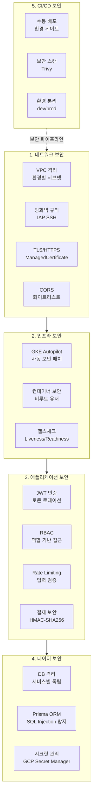
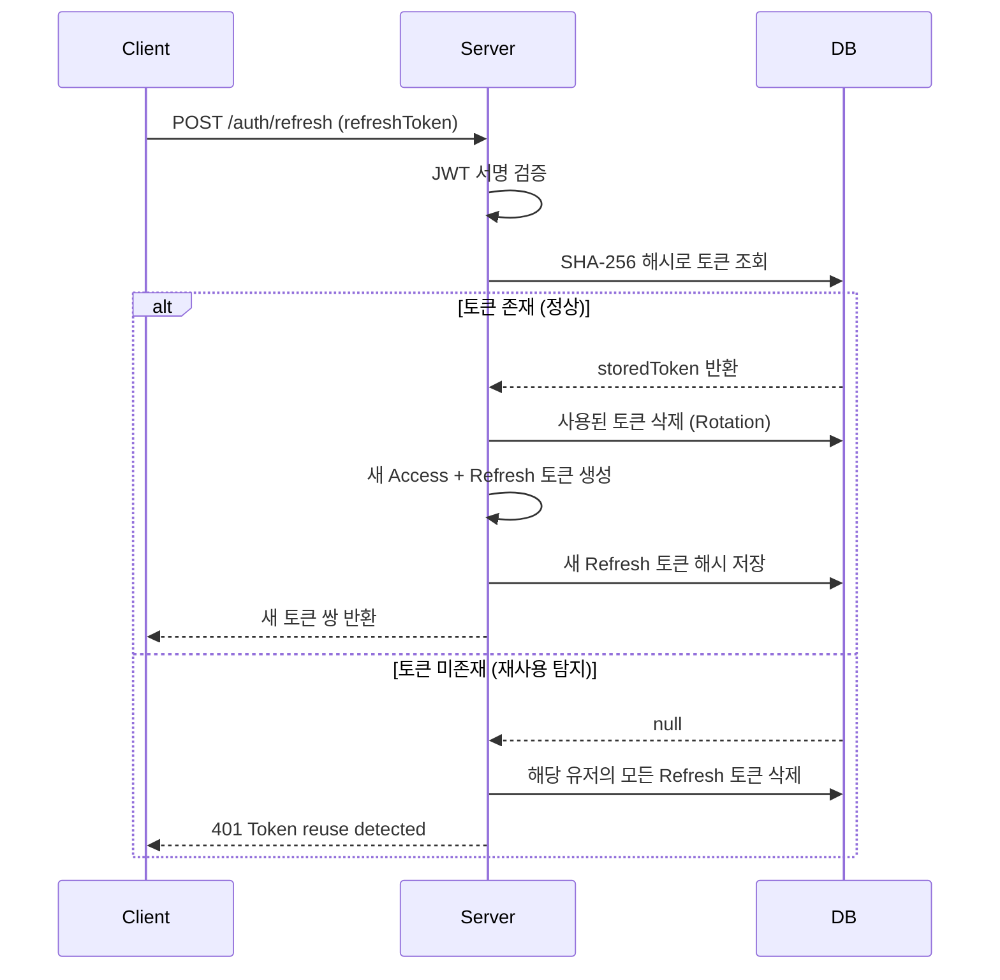
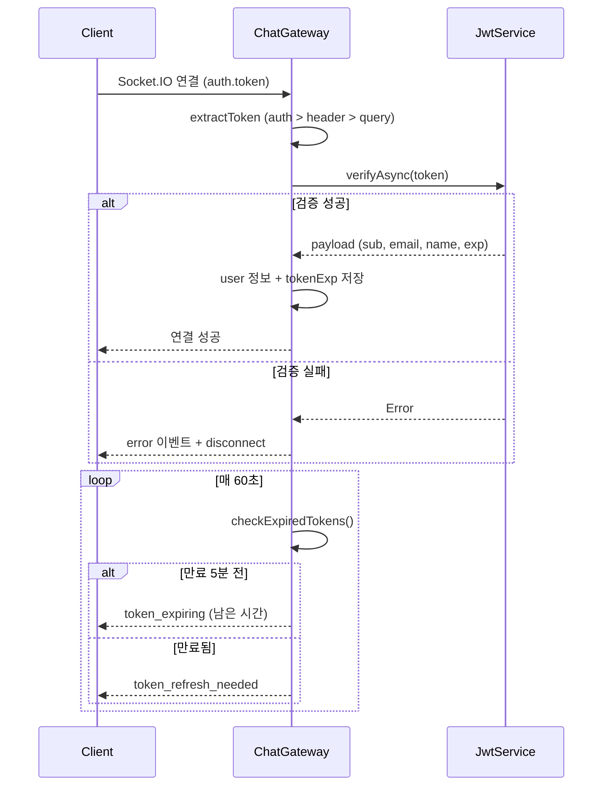
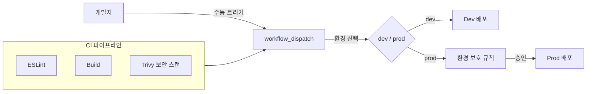

# Park Golf Platform - Security Architecture

## Table of Contents
1. [보안 아키텍처 개요](#보안-아키텍처-개요)
2. [네트워크 보안](#네트워크-보안)
3. [인프라 보안 (GKE / Container)](#인프라-보안-gke--container)
4. [인증 및 인가](#인증-및-인가-authentication--authorization)
5. [API 보안](#api-보안)
6. [결제 보안](#결제-보안)
7. [데이터 보안](#데이터-보안)
8. [서비스 간 통신 보안](#서비스-간-통신-보안)
9. [CI/CD 보안](#cicd-보안)
10. [보안 개선 권고사항](#보안-개선-권고사항)

## 보안 아키텍처 개요

Park Golf Platform은 5개 보안 영역에 걸친 다층 방어(Defense-in-Depth) 전략을 적용합니다.



---

## 네트워크 보안

> 소스: `infra/modules/networking/main.tf`

### VPC 격리

환경별 독립 VPC 네트워크와 3-tier 서브넷 구성으로 네트워크를 격리합니다.

| 환경 | VPC CIDR | Public 서브넷 | Private 서브넷 | Data 서브넷 |
|------|----------|--------------|---------------|------------|
| Dev | `10.2.0.0/16` | `10.2.1.0/24` | `10.2.2.0/24` | `10.2.3.0/24` |
| Prod | `10.4.0.0/16` | `10.4.1.0/24` | `10.4.2.0/24` | `10.4.3.0/24` |

- **Auto-create subnetworks**: Disabled (명시적 서브넷 관리)
- **Private IP Google Access**: 모든 서브넷에서 활성화 (외부 IP 없이 Google API 접근)
- **IP 예약**: `10.1.x.x`은 기존 VPC 충돌 방지를 위해 예약

### 방화벽 규칙

| 규칙 | 프로토콜 / 포트 | 소스 | 대상 태그 |
|------|----------------|------|----------|
| Allow Internal | TCP, UDP, ICMP | VPC CIDR 전체 | 전체 |
| Allow Health Check | TCP 80, 443, 8080 | `35.191.0.0/16`, `130.211.0.0/22` | `http-server`, `https-server` |
| Allow SSH (IAP) | TCP 22 | `35.235.240.0/20` (IAP 전용) | `ssh` |
| Allow NATS Internal | TCP 4222, 6222, 8222 | `internal` 태그 | `nats-server` |
| Allow PostgreSQL | TCP 5432 | 내부 네트워크 | `postgres-server` |

- **SSH 접근**: Google Cloud Identity-Aware Proxy(IAP) 경유만 허용, 직접 SSH 접근 차단
- **NATS 포트**: 클라이언트(4222), 클러스터(6222), 모니터링(8222)

### Cloud NAT

| 환경 | 상태 | 설정 |
|------|------|------|
| Dev | Disabled | 비용 최적화 (VM 직접 외부 IP 사용) |
| Prod | **Enabled** | AUTO_ONLY IP 할당, 전체 서브넷 아웃바운드, ERRORS_ONLY 로깅 |

Prod 환경의 Cloud NAT는 외부 API 호출(기상청, 카카오 로컬) 시 일관된 외부 IP를 제공합니다.

### TLS / HTTPS

- **Cloud Run**: 자동 HTTPS 인증서 프로비저닝 및 갱신
- **Firebase Hosting**: CDN 기반 자동 HTTPS
- **GKE Ingress**: ManagedCertificate + 경로 기반 라우팅

### CORS

서비스별 화이트리스트 기반 CORS 정책을 적용합니다.

| 서비스 | 허용 도메인 | 특이사항 |
|--------|-----------|---------|
| user-api | `parkgolf-user*.web.app`, `*user.parkgolfmate.com` | `Authorization` 헤더 |
| admin-api | `parkgolf-admin*.web.app`, `*admin.parkgolfmate.com`, `*platform.parkgolfmate.com` | `X-Company-Id` 커스텀 헤더 포함 |
| chat-gateway | `parkgolf-user*.web.app`, `*.run.app` (정규식) | WebSocket credentials 활성화 |

- 모든 서비스: `CORS_ALLOWED_ORIGINS` 환경변수로 오버라이드 가능
- Credentials: `true` (쿠키 허용)
- Methods: `GET`, `POST`, `PUT`, `DELETE`, `PATCH`, `OPTIONS`

---

## 인프라 보안 (GKE / Container)

> 소스: `services/*/Dockerfile`

### GKE Autopilot

- Google 관리형 노드 보안 (자동 OS 패치, 런타임 보안)
- Workload Identity 기반 서비스 계정 연결
- 자동 노드 업그레이드 및 보안 업데이트

### 컨테이너 보안

모든 서비스 Dockerfile은 다음 보안 원칙을 준수합니다:

```dockerfile
# 1. Multi-stage 빌드 (빌드 도구 제거)
FROM node:20-alpine AS builder
# ... build steps ...

# 2. 최소 베이스 이미지
FROM node:20-alpine AS production

# 3. 시그널 핸들링 (PID 1 문제 방지)
RUN apk add --no-cache dumb-init

# 4. production 의존성만 설치
RUN npm ci --only=production && npm cache clean --force

# 5. 비루트 유저 실행
RUN addgroup -g 1001 -S nodejs && \
    adduser -S nodejs -u 1001 && \
    chown -R nodejs:nodejs /app
USER nodejs

# 6. 헬스체크
HEALTHCHECK --interval=30s --timeout=3s --start-period=5s --retries=3 \
    CMD wget --no-verbose --tries=1 --spider http://localhost:8080/health || exit 1

# 7. dumb-init 엔트리포인트
ENTRYPOINT ["dumb-init", "--"]
CMD ["node", "dist/src/main.js"]
```

| 보안 항목 | 설명 |
|----------|------|
| Multi-stage 빌드 | 빌드 도구·소스코드를 프로덕션 이미지에서 제거 |
| `node:20-alpine` | 최소 공격 표면 (Alpine Linux) |
| 비루트 유저 (`nodejs:1001`) | 컨테이너 내 권한 최소화 |
| `dumb-init` | 좀비 프로세스 방지, 시그널 전달 |
| `HEALTHCHECK` | 30초 간격, 3회 실패 시 재시작 |
| 빌드 도구 정리 | `apk del python3 make g++` (bcrypt 빌드 후 제거) |

### PodDisruptionBudget

chat-gateway 등 고가용성 서비스에 PDB를 적용하여 롤링 배포 시 최소 가용 인스턴스를 보장합니다.

---

## 인증 및 인가 (Authentication & Authorization)

> 소스: `services/iam-service/src/auth/`, `services/chat-gateway/src/common/ws.utils.ts`

### JWT 토큰 구조

| 항목 | Access Token | Refresh Token |
|------|-------------|---------------|
| 만료 시간 | 1시간 (기본, `JWT_EXPIRES_IN`으로 조정 가능) | 7일 (고정) |
| 서명 키 | `JWT_SECRET` (환경변수) | `JWT_REFRESH_SECRET` (별도 환경변수) |
| 저장 | 클라이언트 메모리 | DB (SHA-256 해시) |
| 고유 ID | - | `crypto.randomUUID()` (jwtid) |

### 비밀번호 보안

```typescript
// bcrypt 10 rounds 해싱
const hashedPassword = await bcrypt.hash(password, 10);

// Refresh Token은 SHA-256 해시 후 DB 저장
private hashToken(token: string): string {
    return crypto.createHash('sha256').update(token).digest('hex');
}
```

- **비밀번호 정책**: 영문 + 숫자 + 특수문자 필수, 8자 이상 128자 이하
- **비밀번호 해싱**: bcrypt 10 rounds (~100ms 연산 시간)
- **Refresh Token 해싱**: SHA-256 (DB 유출 시 원본 토큰 복원 불가)

### Refresh Token Rotation + 재사용 탐지



- **토큰 로테이션**: 갱신 시 기존 Refresh Token 삭제 + 새 토큰 발급
- **재사용 탐지**: 이미 사용된 토큰 감지 시 해당 유저의 전체 세션 무효화 (보안 침해 대응)

### RBAC (역할 기반 접근 제어)

| 역할 | 범위 | 설명 |
|------|------|------|
| `PLATFORM_ADMIN` | PLATFORM | 전체 플랫폼 관리 |
| `COMPANY_ADMIN` | COMPANY | 소속 회사 관리 |
| `COMPANY_VIEWER` | COMPANY | 소속 회사 조회 전용 |
| `COMPANY_MODERATOR` | COMPANY | 소속 회사 운영 |
| `USER` | - | 일반 사용자 |

- **Scope 기반 분리**: PLATFORM 범위와 COMPANY 범위의 데이터 접근 격리
- **Admin Context**: `X-Company-Id` 헤더로 PLATFORM 관리자의 회사 전환 지원
- **JWT Guard**: Passport.js 기반 `JwtAuthGuard`로 모든 보호 라우트 인증

### WebSocket 인증



- **토큰 추출 우선순위**: `auth.token` > `Authorization` 헤더 > query 파라미터
- **만료 모니터링**: 60초 주기로 연결된 소켓의 토큰 만료 확인
- **사전 경고**: 만료 5분 전 `token_expiring` 이벤트 발송
- **만료 처리**: `token_refresh_needed` 이벤트로 클라이언트 갱신 유도

---

## API 보안

> 소스: `services/user-api/src/main.ts`, `services/admin-api/src/main.ts`

### Rate Limiting

`@nestjs/throttler`를 사용한 글로벌 + 엔드포인트별 요청 제한:

| 범위 | 제한 | TTL | 적용 대상 |
|------|------|-----|----------|
| 글로벌 | 60 req | 60초 | 모든 API 엔드포인트 |
| 인증 (로그인/회원가입) | 5 req | 60초 | `/auth/login`, `/auth/register`, `/auth/signup` |

```typescript
// 글로벌 Rate Limiting (user-api, admin-api)
ThrottlerModule.forRoot([{ ttl: 60000, limit: 60 }])

// 인증 엔드포인트 강화
@Throttle({ default: { ttl: 60000, limit: 5 } })
```

- **Trust Proxy**: GKE Load Balancer 뒤에서 `X-Forwarded-For` 기반 실제 클라이언트 IP 추적
- **APP_GUARD**: 전역 가드로 모든 요청에 자동 적용

### 입력 검증

`ValidationPipe`를 전역으로 적용하여 모든 요청 데이터를 검증합니다:

```typescript
app.useGlobalPipes(
  new ValidationPipe({
    whitelist: true,              // 알 수 없는 속성 자동 제거
    forbidNonWhitelisted: true,   // 알 수 없는 속성 존재 시 에러
    transform: true,              // 타입 자동 변환
    transformOptions: {
      enableImplicitConversion: true,  // string → number 등 자동 변환
    },
  }),
);
```

### DTO 기반 검증

모든 API 입력은 `class-validator` 데코레이터로 검증합니다:

```typescript
// 비밀번호 검증 규칙
export const PASSWORD_REGEX = /^(?=.*[a-zA-Z])(?=.*\d)(?=.*[!@#$%^&*()_+\-=\[\]{};':"\\|,.<>\/?]).{8,}$/;
export const PASSWORD_MIN_LENGTH = 8;
export const PASSWORD_MAX_LENGTH = 128;
```

- 모든 DTO에 `@IsString()`, `@IsNotEmpty()`, `@MinLength()` 등 적용
- `forbidNonWhitelisted`: 선언되지 않은 필드 전송 시 400 에러 반환
- `whitelist`: DTO에 정의되지 않은 필드 자동 제거 (Mass Assignment 방지)

---

## 결제 보안

> 소스: `services/payment-service/src/payment/controller/webhook.controller.ts`

### 웹훅 서명 검증

Toss Payments 웹훅은 HMAC-SHA256 서명 검증으로 위변조를 방지합니다:

```typescript
private verifySignature(payload: TossWebhookPayload, signature: string, transmissionTime: string): boolean {
    const message = `${JSON.stringify(payload)}:${transmissionTime}`;
    const computedHash = crypto
        .createHmac('sha256', this.securityKey)
        .update(message)
        .digest();

    const sigParts = sigBody.split(',');
    return sigParts.some((part) => {
        const decoded = Buffer.from(part.trim(), 'base64');
        return crypto.timingSafeEqual(computedHash, decoded);  // 타이밍 공격 방지
    });
}
```

| 보안 항목 | 구현 |
|----------|------|
| 서명 알고리즘 | HMAC-SHA256 |
| 타이밍 공격 방지 | `crypto.timingSafeEqual()` (상수 시간 비교) |
| 서명 키 관리 | `TOSS_SECURITY_KEY` (K8s Secret / GCP Secret Manager) |
| 전송 시간 검증 | payload + transmissionTime 결합 해시 |

### 웹훅 로깅

모든 웹훅 수신 및 처리 결과를 DB에 기록합니다:

```typescript
const webhookLog = await this.prisma.webhookLog.create({
    data: {
        eventType: payload.eventType,
        payload: payload as object,
        status: WebhookStatus.RECEIVED,  // RECEIVED → PROCESSED / FAILED
    },
});
```

- **감사 추적**: eventType, 전체 payload, 처리 상태, 에러 메시지, 처리 시간 기록
- **멱등성**: 웹훅 재전송 시 중복 처리 방지
- **에러 격리**: 처리 실패 시에도 HTTP 200 반환 (무한 재시도 방지)

---

## 데이터 보안

### DB 격리

서비스별 독립 데이터베이스로 데이터를 격리합니다:

| 서비스 | 데이터베이스 | 주요 데이터 |
|--------|-----------|-----------|
| iam-service | `iam_db` | 사용자, 관리자, 인증 토큰, 역할 |
| course-service | `course_db` | 골프장, 코스, 게임, 슬롯 |
| booking-service | `booking_db` | 예약, 정책, 환불/노쇼 |
| saga-service | `saga_db` | Saga 오케스트레이션, Step 이력 |
| payment-service | `payment_db` | 결제, 환불, 웹훅 로그 |
| chat-service | `chat_db` | 채팅방, 메시지, 파일 |
| notify-service | `notify_db` | 알림 |

- 서비스 간 직접 DB 접근 불가 (NATS 메시징으로만 통신)
- 각 서비스별 독립적인 `DATABASE_URL` 관리

### SQL Injection 방지

- **Prisma ORM**: Parameterized queries 기본 적용
- **Raw SQL 제한**: `findNearby` 등 Haversine 쿼리에서만 사용, 파라미터 바인딩 적용

### 시크릿 관리

> 소스: `infra/modules/secrets/main.tf`

**GCP Secret Manager**:

```terraform
resource "google_secret_manager_secret" "secrets" {
    for_each  = local.secret_names_set
    secret_id = "${each.value}-${var.environment}"
    replication { auto {} }  # 자동 리전 간 복제
}

# 서비스 계정별 IAM 접근 제어
resource "google_secret_manager_secret_iam_member" "accessors" {
    role   = "roles/secretmanager.secretAccessor"
    member = "serviceAccount:${each.value.service_account}"
}
```

| 시크릿 | 용도 |
|--------|------|
| `JWT_SECRET` | JWT Access Token 서명 |
| `JWT_REFRESH_SECRET` | JWT Refresh Token 서명 |
| `TOSS_SECRET_KEY` | Toss Payments API 인증 |
| `TOSS_SECURITY_KEY` | Toss Payments 웹훅 서명 검증 |
| `KAKAO_API_KEY` | 카카오 로컬 API |
| `KMA_API_KEY` | 기상청 API |
| `DEEPSEEK_API_KEY` | AI 에이전트 |
| `POSTGRES_USER` / `POSTGRES_PASSWORD` | DB 접근 |

- **환경별 분리**: `{secret_name}-{env}` 형식으로 dev/prod 시크릿 격리
- **Terraform sensitive**: 변수에 `sensitive = true` 적용 (출력·로그 마스킹)
- **IAM 최소 권한**: 서비스 계정별로 필요한 시크릿만 접근 허용
- **K8s Secret**: ConfigMap(비민감)과 Secret(민감) 분리, 환경변수로 주입

---

## 서비스 간 통신 보안

> 소스: `services/user-api/src/common/nats/nats.config.ts`

### NATS 내부 통신

서비스 간 모든 동기/비동기 통신은 NATS를 통해 이루어지며, 클러스터 외부에 노출되지 않습니다.

```typescript
// BFF 서비스 NATS 연결 설정
{
    transport: Transport.NATS,
    options: {
        servers: [configService.get<string>('NATS_URL') || 'nats://localhost:4222'],
        reconnect: true,
        maxReconnectAttempts: -1,   // 무한 재연결
        reconnectTimeWait: 1000,    // 1초 대기 후 재연결
        timeout: 60000,             // 60초 요청 타임아웃
        pingInterval: 10000,        // 10초 주기 ping
        maxPingOut: 3,              // 3회 ping 실패 시 연결 끊김
    },
}
```

| 설정 | 값 | 설명 |
|------|-----|------|
| `reconnect` | `true` | 자동 재연결 활성화 |
| `maxReconnectAttempts` | `-1` (∞) | 무한 재연결 시도 |
| `reconnectTimeWait` | `1000ms` | 재연결 간격 |
| `pingInterval` | `10000ms` | 헬스체크 주기 |
| `maxPingOut` | `3` | 최대 미응답 ping 횟수 |

- **네트워크 격리**: NATS는 클러스터 내부 통신 전용 (방화벽으로 내부 태그만 허용)
- **자동 복구**: 네트워크 장애 시 무한 재연결으로 서비스 연속성 보장
- **JetStream**: 메시지 영속성 + at-least-once 전달 보장

---

## CI/CD 보안

> 소스: `.github/workflows/`

### 배포 파이프라인 보안



### 보안 스캔 (Trivy)

CI 파이프라인에서 파일시스템 취약점 스캔을 수행합니다:

```yaml
- name: Run Trivy vulnerability scanner
  uses: aquasecurity/trivy-action@master
  with:
    scan-type: 'fs'
    severity: 'CRITICAL,HIGH'
    ignore-unfixed: true
    format: 'sarif'

- name: Upload Trivy scan results
  uses: github/codeql-action/upload-sarif@v3
```

- **SARIF 형식**: GitHub Security 탭과 통합
- **심각도 필터**: CRITICAL, HIGH만 보고
- **미수정 제외**: 아직 패치가 없는 취약점 무시 (노이즈 감소)

### 환경 보호

| 보안 항목 | 구현 |
|----------|------|
| 배포 트리거 | `workflow_dispatch` (수동만, 자동 배포 없음) |
| 환경 게이트 | GitHub Environments 보호 규칙 |
| 시크릿 격리 | dev/prod 별도 GitHub Secrets |
| Prod 파괴 방지 | `gke-destroy`, `network-destroy` 워크플로에서 prod 차단 |
| 인프라 파괴 확인 | `confirm: "destroy"` 입력 필수 |

### 환경 분리

| 항목 | Dev | Prod |
|------|-----|------|
| GKE 클러스터 | `parkgolf-dev-cluster` | `parkgolf-prod-cluster` |
| 네임스페이스 | `parkgolf-dev` | `parkgolf-prod` |
| VPC | `10.2.0.0/16` | `10.4.0.0/16` |
| 시크릿 | `*-dev` | `*-prod` |
| DB | dev 전용 인스턴스 | prod 전용 인스턴스 (HA + 백업) |

---

## 보안 개선 권고사항

현재 구현되지 않았거나 개선이 필요한 보안 영역입니다.

| 항목 | 위험도 | 현황 | 권고사항 |
|------|--------|------|---------|
| **Helmet.js** | 중간 | 미적용 | HTTP 보안 헤더 추가 (`X-Frame-Options`, `X-Content-Type-Options`, `CSP` 등) |
| **NATS 인증** | 낮음 | 미설정 | 클러스터 내부 통신이므로 위험은 낮으나, 토큰/TLS 인증 권장 |
| **NetworkPolicy** | 중간 | 미적용 | K8s NetworkPolicy로 Pod 간 통신을 명시적으로 제한 |
| **컨테이너 이미지 스캐닝** | 중간 | Trivy (FS만) | 빌드된 Docker 이미지에 대한 취약점 스캔 추가 |
| **시크릿 자동 로테이션** | 낮음 | 미구현 | GCP Secret Manager 자동 로테이션 정책 설정 |
| **Audit 로깅** | 중간 | 부분 적용 | 관리자 행위에 대한 체계적 감사 로그 시스템 구축 |
