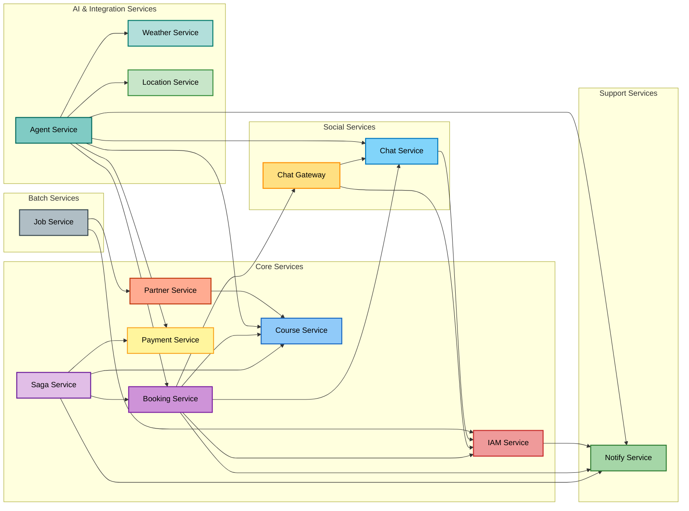
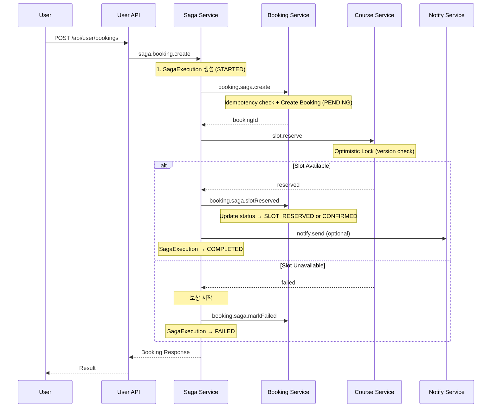
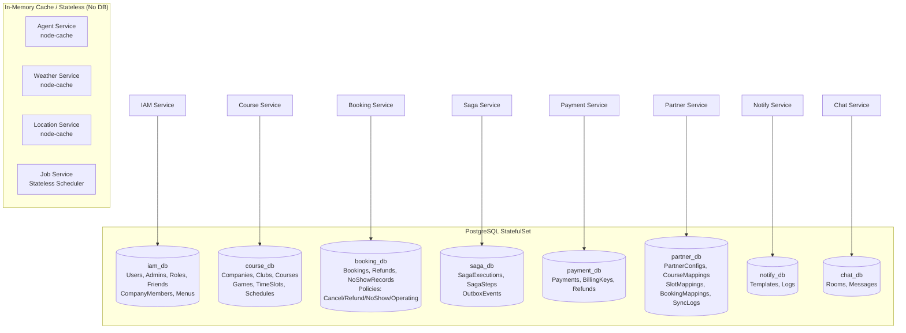
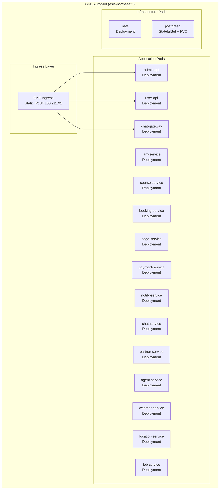
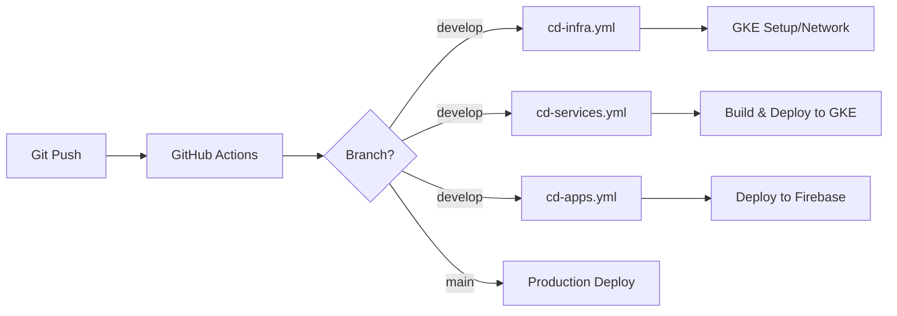

# Park Golf Platform - System Architecture

## Table of Contents
1. [Overview](#overview)
2. [System Architecture Diagram](#system-architecture-diagram)
3. [Service Dependencies](#service-dependencies)
4. [Service Details](#service-details)
5. [Saga Pattern](#saga-pattern-distributed-transactions)
6. [Database Architecture](#database-architecture)
7. [Deployment Architecture](#deployment-architecture)

## Overview

Park Golf Platform은 골프장 예약 및 관리를 위한 통합 플랫폼으로, 마이크로서비스 아키텍처(MSA)를 기반으로 구축되었습니다.

### 가맹점 분류 체계

#### 골프장 유형 (ClubType)
| 유형 | 설명 | 특징 |
|------|------|------|
| **지자체 파크골프장** (`PUBLIC`) | 지방자치단체 운영 공공 골프장 | 무료/저렴한 이용료, 자체 부킹 시스템 없는 경우가 대부분 |
| **사설 파크골프장** (`PRIVATE`) | 민간 사업자 운영 유료 골프장 | 유료 이용, 자체 부킹 시스템 보유 가능 |

#### 부킹 연동 방식 (BookingMode)
| 방식 | 설명 | 데이터 흐름 |
|------|------|------------|
| **자체 플랫폼** (`PLATFORM`) | 자체 부킹 시스템 없음 → 파크골프메이트 부킹 직접 사용 | booking-service에서 예약 직접 관리 |
| **파트너 연동** (`PARTNER`) | 자체 부킹 시스템 보유 → API 연동 | partner-service가 외부 시스템과 슬롯/예약 동기화 (10분 주기 cron) |

#### 분류 매트릭스

| 골프장 유형 | 자체 플랫폼 (`PLATFORM`) | 파트너 연동 (`PARTNER`) |
|------------|------------------------|----------------------|
| **지자체** (`PUBLIC`) | 주요 케이스 | 드문 케이스 |
| **사설** (`PRIVATE`) | 소규모 골프장 | 주요 케이스 |

- **DB 모델**: `Club.clubType` (PUBLIC/PRIVATE), `Club.bookingMode` (PLATFORM/PARTNER)
- **파트너 연동 시**: partner-service의 `PartnerConfig`로 연동 설정 관리
- **자체 플랫폼 시**: booking-service + course-service로 예약 직접 처리

### Core Design Principles
- **Microservices Architecture**: 도메인별 독립적인 서비스 분리
- **Backend for Frontend (BFF)**: 프론트엔드별 최적화된 API 게이트웨이
- **Event-Driven Architecture**: NATS 기반 비동기 메시징
- **Domain-Driven Design**: 비즈니스 도메인 중심 설계
- **Cloud-Native**: GKE Autopilot 기반 컨테이너 오케스트레이션

## System Architecture Diagram

```mermaid
graph TB
    subgraph "Client Layer"
        AD[Admin Dashboard<br/>React 19 + React Query<br/>:3000]
        PD[Platform Dashboard<br/>React 19 + React Query<br/>:3002]
        UW[User WebApp<br/>React 19<br/>:3001]
        IOS[iOS App<br/>SwiftUI + Socket.IO<br/>Native]
        AND[Android App<br/>Kotlin + Compose<br/>Native]
    end

    subgraph "GKE Autopilot"
        subgraph "API Gateway Layer (BFF)"
            AAPI[Admin API<br/>NestJS<br/>:8080]
            UAPI[User API<br/>NestJS<br/>:8080]
            CHATGW[Chat Gateway<br/>NestJS + Socket.IO<br/>:8080]
        end

        subgraph "Core Services"
            IAM[IAM Service<br/>NestJS<br/>:8080]
            COURSE[Course Service<br/>NestJS<br/>:8080]
            BOOK[Booking Service<br/>NestJS<br/>:8080]
            SAGA[Saga Service<br/>NestJS<br/>:8080]
            NOTIFY[Notify Service<br/>NestJS<br/>:8080]
            CHAT[Chat Service<br/>NestJS<br/>:8080]
            PAY[Payment Service<br/>NestJS<br/>:8086]
            PARTNER[Partner Service<br/>NestJS<br/>:8080]
        end

        subgraph "AI & External API Services"
            AGENT[Agent Service<br/>DeepSeek<br/>:8088]
            WEATHER[Weather Service<br/>기상청 API<br/>:8087]
            LOCATION[Location Service<br/>카카오 로컬 API<br/>:8089]
        end

        subgraph "Batch Services"
            JOB[Job Service<br/>NestJS Schedule<br/>:8080]
        end

        subgraph "Infrastructure Layer"
            NATS[NATS JetStream<br/>:4222]
            PG[(PostgreSQL<br/>:5432)]
        end

        ING[GKE Ingress<br/>Static IP: 34.160.211.91]
    end

    subgraph "External APIs"
        TOSS[Toss Payments API]
        KMA[기상청 API]
        KAKAO[카카오 로컬 API]
        DEEPSEEK[DeepSeek API]
    end

    subgraph "Firebase Hosting"
        FH_ADMIN[Admin Dashboard CDN]
        FH_PLATFORM[Platform Dashboard CDN]
        FH_USER[User WebApp CDN]
    end

    %% Client to Ingress connections
    AD --> FH_ADMIN
    PD --> FH_PLATFORM
    UW --> FH_USER
    FH_ADMIN --> ING
    FH_PLATFORM --> ING
    FH_USER --> ING
    IOS --> ING
    AND --> ING

    %% Ingress to BFF
    ING --> AAPI
    ING --> UAPI
    ING --> CHATGW

    %% BFF to Services via NATS
    AAPI --> NATS
    UAPI --> NATS
    CHATGW --> NATS

    %% NATS to Core Services
    NATS <--> IAM
    NATS <--> COURSE
    NATS <--> BOOK
    NATS <--> SAGA
    NATS <--> NOTIFY
    NATS <--> CHAT
    NATS <--> PAY
    NATS <--> PARTNER

    %% NATS to AI & External Services
    NATS <--> AGENT
    NATS <--> WEATHER
    NATS <--> LOCATION

    %% NATS to Batch Services
    NATS <--> JOB

    %% External API connections
    PAY --> TOSS
    WEATHER --> KMA
    LOCATION --> KAKAO
    AGENT --> DEEPSEEK

    %% Service to Database
    IAM --> PG
    COURSE --> PG
    BOOK --> PG
    SAGA --> PG
    NOTIFY --> PG
    CHAT --> PG
    PAY --> PG
    PARTNER --> PG

    classDef frontend fill:#4fc3f7,stroke:#01579b,stroke-width:2px,color:#000
    classDef bff fill:#ffb74d,stroke:#e65100,stroke-width:2px,color:#000
    classDef service fill:#ba68c8,stroke:#4a148c,stroke-width:2px,color:#fff
    classDef aiservice fill:#4db6ac,stroke:#00695c,stroke-width:2px,color:#000
    classDef data fill:#81c784,stroke:#1b5e20,stroke-width:2px,color:#000
    classDef message fill:#f06292,stroke:#880e4f,stroke-width:2px,color:#fff
    classDef ingress fill:#42a5f5,stroke:#1565c0,stroke-width:2px,color:#000
    classDef external fill:#ffcc80,stroke:#ef6c00,stroke-width:2px,color:#000

    class AD,PD,UW,IOS,AND frontend
    class AAPI,UAPI,CHATGW bff
    class IAM,COURSE,BOOK,SAGA,NOTIFY,CHAT,PAY,PARTNER service
    class AGENT,WEATHER,LOCATION aiservice
    class JOB service
    class PG data
    class NATS message
    class ING ingress
    class TOSS,KMA,KAKAO,DEEPSEEK external
```



## Service Dependencies



## Service Details

### 1. Frontend Services

#### Admin Dashboard (가맹점 관리자, :3000)
- 관리자 인증 및 권한 관리 (RBAC)
- 골프장/코스/게임 관리 (Company, Club, Course, Game, GameTimeSlot)
- 예약 관리 및 모니터링
- 가맹점별 회원 관리 (CompanyMember)
- 계층형 정책 관리 (취소/환불/노쇼/운영 - 상속 지원)
- 통계 대시보드, 카카오맵 연동

#### Platform Dashboard (플랫폼 관리자, :3002)
- 플랫폼 전체 관리 (PLATFORM 스코프)
- 가맹점 관리: 회사(Company) 관리, 파트너 연동 관리
- 플랫폼 기본 정책 설정 (취소/환불/노쇼/운영)
- 역할 및 권한 관리, 플랫폼 관리자 관리

#### User WebApp (:3001)
- 사용자 회원가입/로그인
- 골프장 검색 및 조회, 예약 생성/수정/취소
- 친구 관리, 채팅 (REST + WebSocket), 프로필 관리

#### iOS App (SwiftUI + MVVM, Native)
- 사용자 인증, 골프장 검색/조회, 예약 생성/조회/취소
- 친구 관리 (주소록 연동), 실시간 채팅 (Socket.IO)
- 라운드 기록 및 통계, 프로필 관리

#### Android App (Kotlin + Compose + MVVM, Native)
- iOS App과 동일 기능 세트
- Hilt DI, Retrofit + OkHttp, Repository 패턴

### 2. BFF Services (Backend for Frontend)

#### Admin API (:8080)
```
Purpose: 관리자 대시보드 + 플랫폼 대시보드 공용 API Gateway
- Response 변환 없이 그대로 전달 (BFF 패턴)
- @AdminContext() 데코레이터로 companyId 자동 주입

REST Routes:
  /api/admin/auth/*             → IAM Service
  /api/admin/clubs/*            → Course Service
  /api/admin/games/*            → Course Service
  /api/admin/company-members/*  → IAM Service
  /api/admin/policies/*         → Booking Service (취소/환불/노쇼/운영)
  /api/admin/companies/*        → IAM Service
  /api/admin/menus/*            → IAM Service
  /api/admin/partners/*         → Partner Service (연동 설정, 코스 매핑, 동기화)
```

#### User API (:8080)
```
Purpose: 사용자 웹앱/모바일앱 전용 API Gateway
- Response 변환 없이 그대로 전달 (BFF 패턴)
- 토큰 관리, Rate limiting

Connected Services (via NATS):
  IAM / Course / Booking / Payment / Notify / Chat / Agent
```

### 3. Core Microservices

#### IAM Service (:8080)
```
Database: PostgreSQL (iam_db)

Data Models:
  User, Admin, Company (PLATFORM/ASSOCIATION/FRANCHISE)
  RoleMaster, AdminCompany, Friend/FriendRequest
  RefreshToken, LoginHistory
  CompanyMember (source: BOOKING/MANUAL/WALK_IN)
  MenuMaster, MenuPermission, MenuCompanyType

Core Features:
  - JWT (Access 15min + Refresh 7days), RBAC (40+ permissions)
  - 가맹점별 회원 관리, DB 기반 동적 메뉴, 친구 관리

NATS Patterns:
  auth.login / auth.validate / auth.refresh
  auth.admin.* / auth.permission.*
  users.create/list/findById/update/delete
  friends.*
  iam.companyMembers.list/create/update/delete/addByBooking
  iam.menus.*
```

#### Course Service (:8080)
```
Database: PostgreSQL (course_db)

Data Models:
  Company, Club (위경도 좌표, ClubType: PUBLIC/PRIVATE, BookingMode: PLATFORM/PARTNER)
  Course (9홀), Hole, TeeBox
  Game (18홀, SlotMode: TEE_TIME/SESSION)
  GameTimeSlot (Optimistic Lock), GameWeeklySchedule

Core Features:
  - 골프장/코스/게임 관리, 타임슬롯 자동 생성
  - 근처 골프장 검색 (Haversine), Optimistic Locking 동시성 제어

NATS Patterns:
  companies.* / clubs.* / club.findNearby
  courses.* / holes.*
  games.list/get/create/update/delete/search
  gameTimeSlots.* / timeSlots.*
  gameWeeklySchedules.*
  slot.reserve / slot.release (← saga-service)
```

#### Booking Service (:8080)
```
Database: PostgreSQL (booking_db)

Data Models - Booking:
  Booking, BookingHistory, GameCache, GameTimeSlotCache
  OutboxEvent, IdempotencyKey, Refund, UserNoShowRecord

Data Models - Group Booking (더치페이):
  BookingGroup (그룹 예약, 정산 상태 관리)
  BookingParticipant (팀 참여자, 개별 결제 상태)
  SettlementStatus: PENDING/PARTIAL/COMPLETED/CANCELLED
  ParticipantRole: BOOKER/MEMBER
  ParticipantStatus: PENDING/PAID/CANCELLED/REFUNDED

Data Models - Policy (계층형, PLATFORM > COMPANY > CLUB):
  CancellationPolicy, RefundPolicy + RefundTier
  NoShowPolicy + NoShowPenalty, OperatingPolicy

Core Features:
  - 예약 도메인 로직 (CRUD, 상태 관리)
  - Saga Step Handler (saga-service에서 호출하는 booking.saga.* 패턴 처리)
  - Transactional Outbox, Idempotency Key
  - 계층형 정책 Resolve (Club → Company → Platform 폴백)
  - 시간대별 환불률, 노쇼 패널티
  - 더치페이 정산: BookingGroup + BookingParticipant + 정산 카드 Push

NATS Patterns:
  booking.create/findById/get/list/cancel
  booking.group.create/get/getByNumber/cancel
  booking.group.markParticipantPaid
  booking.saga.create/slotReserved/confirmPayment/cancel/adminCancel
  booking.saga.finalizeCancelled/markFailed/restoreStatus/paymentTimeout
  policy.cancellation.list/findById/resolve/create/update/delete
  policy.refund.list/findById/resolve/create/update/delete/calculate
  policy.noshow.list/findById/resolve/create/update/delete/getUserCount/getApplicablePenalty
  policy.operating.list/findById/resolve/create/update/delete
```

#### Saga Service (:8080)
```
Database: PostgreSQL (saga_db)

Data Models:
  SagaExecution (상태 머신: STARTED → STEP_EXECUTING → COMPLETED / FAILED)
  SagaStep (Step별 실행 이력, 보상 추적)
  OutboxEvent (saga-service 전용)

Core Features:
  - Saga Orchestrator: 분산 트랜잭션 중앙 관리
  - 선언적 Saga 정의: Step 배열로 흐름 선언, 보상 자동 역순 실행
  - 상태 머신: SagaExecution 테이블로 정확한 단계 추적
  - Transactional Outbox: Step 실행 보장
  - 타임아웃 감지 및 자동 보상

Saga Definitions:
  CreateBookingSaga: 예약 생성 (create → slot.reserve → slotReserved → notify)
  CancelBookingSaga: 예약 취소 (policy check → refund → cancel → slot.release → notify)
  AdminRefundSaga: 관리자 환불 (adminCancel → refund → finalizeCancelled → slot.release → notify)
  PaymentConfirmedSaga: 결제 완료 (confirmPayment → notify)
  PaymentTimeoutSaga: 결제 타임아웃 (paymentTimeout → slot.release → notify)

NATS Patterns — Inbound (트리거):
  saga.booking.create / saga.booking.cancel / saga.booking.adminRefund
  booking.paymentConfirmed / booking.paymentDeposited

NATS Patterns — Inbound (관리):
  saga.list / saga.get / saga.retry / saga.resolve / saga.stats

NATS Patterns — Outbound (Step 실행):
  booking.saga.* (→ booking-service)
  slot.reserve / slot.release (→ course-service)
  payment.refund (→ payment-service)
  policy.*.resolve (→ booking-service)
  notify.send (→ notify-service)
```

#### Payment Service (:8086)
```
Database: PostgreSQL (payment_db)
External API: Toss Payments

Data Models:
  Payment, BillingKey, PaymentHistory, Refund, OutboxEvent, WebhookLog
  PaymentSplit (더치페이 분할결제, SplitStatus: PENDING/PAID/EXPIRED/CANCELLED/REFUNDED)

Core Features:
  - 결제위젯 (Toss Payments), 카드/계좌이체/간편결제
  - 빌링키 자동결제, 부분/전액 환불
  - 결제 상태 (PENDING → COMPLETED → REFUNDED)
  - Webhook 수신/검증, Transactional Outbox
  - 더치페이 분할결제 (N명 개별 orderId 발급, 결제 상태 추적)

NATS Patterns:
  payment.prepare (orderId 발급)
  payment.request / payment.confirm / payment.cancel
  payment.billing.issue / payment.billing.charge
  payment.refund / payment.status / payment.webhook
  payment.splitPrepare (더치페이 N명 orderId 발급)
  payment.splitStatus (분할결제 상태 조회)
  payment.split.confirm (참여자 개별 결제 확인)
```

#### Partner Service (:8080)
```
Database: PostgreSQL (partner_db)

Data Models:
  PartnerConfig (골프장별 연동 설정, 1:1 Club 매핑)
  CourseMapping (외부 코스 ↔ 내부 Game 매핑)
  SlotMapping (외부 슬롯 ↔ 내부 GameTimeSlot 매핑)
  BookingMapping (양방향 예약 매핑, INBOUND/OUTBOUND)
  SyncLog (동기화 이력, 작업별 처리 건수/오류 기록)

Core Features:
  - 파트너 연동 설정 관리 (API 키, 스펙 URL, 동기화 주기)
  - OpenAPI 스펙 기반 동적 API 호출 (swagger-client)
  - 슬롯 동기화: 외부 슬롯 → SlotMapping → 내부 GameTimeSlot 반영
  - 예약 동기화: 양방향 예약 상태 전파 (INBOUND/OUTBOUND)
  - 서킷 브레이커: 연속 실패 시 자동 차단, 반자동 복구
  - 코스 매핑: 외부 코스명 ↔ 내부 Game ID 매핑 관리

적용 대상:
  - BookingMode가 PARTNER인 골프장만 해당
  - 지자체 골프장(PUBLIC)은 대부분 PLATFORM 모드 (자체 부킹 시스템 없음)
  - 사설 골프장(PRIVATE) 중 자체 부킹 시스템 보유 시 PARTNER 모드

동기화 모드:
  - API_POLLING: 주기적 폴링 (기본 10분 간격)
  - WEBHOOK: 외부 시스템이 변경 사항 Push
  - HYBRID: 폴링 + 웹훅 병행
  - MANUAL: 수동 동기화만

NATS Patterns:
  partner.config.list/get/create/update/delete
  partner.courseMapping.list/get/create/update/delete
  partner.slotMapping.list
  partner.syncLog.list
  partner.bookingMapping.list
  partner.sync.manual (수동 동기화 트리거)
  partner.sync.test (연결 테스트)
  partner.conflict.resolve (충돌 해결)
```

#### Notify Service (:8080)
```
Database: PostgreSQL (notify_db)

Core Features:
  - Multi-channel 알림 (Email/SMS/Push)
  - 템플릿 관리, 발송 스케줄링, 재시도 메커니즘
```

### 4. Social Services

#### Chat Service (:8080)
```
Database: PostgreSQL (chat_db)

Data Models:
  ChatRoom (DIRECT/CHANNEL/BOOKING), ChatRoomMember, MessageRead
  ChatMessage (metadata: AI 액션 JSON)
  MessageType: TEXT/IMAGE/SYSTEM/AI_USER/AI_ASSISTANT

Field Convention:
  DB 컬럼: type (Prisma)
  서비스 간: messageType (NATS/Socket.IO/REST 페이로드)
  chat-service가 경계 역할: messageType ↔ type 매핑

NATS Patterns:
  chat.rooms.create/get/list/addMember/removeMember/booking/checkMembership
  chat.room.getMembers (채팅방 멤버 목록)
  chat.messages.save/list/markRead/unreadCount/delete
```

#### Chat Gateway (:8080)
```
WebSocket (Socket.IO) + NATS + NATS Socket.IO Adapter (cross-pod broadcast)
Replicas: 2 (multi-pod, Session Affinity + PDB)

Namespaces:
  /chat          — 채팅 메시지, 타이핑, 입장/퇴장
  /notification  — 실시간 알림 전달

Events (Client→Server): join_room, leave_room, send_message, typing, heartbeat
Events (Server→Client): connected, new_message, user_joined/left, typing, error,
                         token_expiring, token_refresh_needed, system:nats_status

NATS 구독 (Raw):
  chat.message.room  — agent/booking-service가 발행한 AI/서비스 메시지를 Socket.IO로 전달
                        metadata.targetUserIds로 서버사이드 타겟팅 (user:{userId} 룸)

JetStream:
  CHAT_MESSAGES (chat.room.*.message) — 메시지 영속성/복구
  CHAT_PRESENCE (chat.user.*.presence) — 온라인 상태
```

### 5. AI & External API Services

#### Agent Service (:8088)
```
External API: DeepSeek (OpenAI-compatible)
Cache: In-memory (node-cache)

Architecture:
  DeepSeekService → Function Calling
  ToolExecutorService → NATS 통신 (7개 서비스 연동)
  ConversationService → 메모리 캐시 대화 관리
  BookingAgentService → 예약 플로우 오케스트레이션

Connected NATS Clients (7개):
  COURSE_SERVICE / BOOKING_SERVICE / PAYMENT_SERVICE
  WEATHER_SERVICE / LOCATION_SERVICE
  CHAT_SERVICE / NOTIFY_SERVICE

Function Calling Tools:
  search_clubs, search_clubs_with_slots, get_club_info
  get_weather, get_available_slots, create_booking
  search_address, get_nearby_clubs, get_booking_policy

Direct Handlers (LLM 없이 UI 이벤트 직접 처리):
  handleDirectClubSelect: 골프장 카드 → 멤버 조회 → SELECT_MEMBERS
  handleTeamMemberSelect: 멤버 확정 → 슬롯 조회 → SHOW_SLOTS
  handleDirectSlotSelect: 슬롯 선택 → CONFIRM_BOOKING (결제방법 3가지)
  handleDirectBooking:
    - 현장결제(onsite): CONFIRMED → TEAM_COMPLETE
    - 카드결제(card): SLOT_RESERVED → payment.prepare → SHOW_PAYMENT
    - 더치페이(dutchpay): payment.splitPrepare → SETTLEMENT_STATUS + 브로드캐스트
  handlePaymentComplete / handleCancelBooking
  handleSplitPaymentComplete: 참여자 결제 완료 → 정산 상태 갱신
  handleNextTeam: 다음 팀 예약 → SELECT_MEMBERS (이전 팀 멤버 제외)
  handleFinishGroup: 그룹 예약 종료 → BOOKING_COMPLETE + SYSTEM 메시지
  handleSendReminder: 미결제 참여자에게 push 알림

NATS Patterns — Inbound:
  agent.chat / agent.reset / agent.status / agent.stats

NATS Patterns — Outbound (send):
  club.search / clubs.get / club.findNearby (→ course-service)
  games.search (→ course-service)
  booking.create / booking.findById (→ booking-service)
  policy.*.resolve (→ booking-service)
  payment.prepare / payment.splitPrepare / payment.splitStatus (→ payment-service)
  weather.forecast (→ weather-service)
  location.search.address (→ location-service)
  chat.room.getMembers / chat.messages.save (→ chat-service)

NATS Patterns — Outbound (emit, fire-and-forget):
  chat.message.room (→ chat-gateway, Socket.IO 브로드캐스트)
  notify.sendBatch (→ notify-service, push 알림)

Conversation States:
  IDLE → COLLECTING → SELECTING_MEMBERS → CONFIRMING → BOOKING → COMPLETED
                                                          ↓
                                                   (더치페이 시) SETTLING → TEAM_COMPLETE
                                                                              ↓
                                                                    다음 팀 → SELECTING_MEMBERS
                                                                    종료   → COMPLETED
```

#### Weather Service (:8087)
```
External API: 기상청 공공데이터 API
Cache: In-memory (node-cache, TTL 30분/1시간)

Core Features:
  초단기실황, 초단기예보 (6시간), 단기예보 (3일)
  좌표 변환 (위경도 → 기상청 격자, LCC 투영법)

NATS Patterns:
  weather.current / weather.ultraShort / weather.forecast / weather.stats
```

#### Location Service (:8089)
```
External API: Kakao Local API
Cache: In-memory (node-cache, 주소 1시간, 좌표 24시간)

Core Features:
  주소/키워드/카테고리 검색, 좌표↔주소 변환, 근처 파크골프장 검색

NATS Patterns:
  location.search.address / location.search.keyword / location.search.category
  location.coord2address / location.coord2region / location.getCoordinates
  location.nearbyGolf / location.stats
```

### 6. Batch Services

#### Job Service (:8080)
```
Stateless scheduler (No DB)
Dependency: @nestjs/schedule (Cron)

Core Features:
  - 계정 삭제 워크플로우 스케줄링 (리마인더 + 실행)
  - Cron 기반 배치 작업 관리
  - NATS를 통한 수동 작업 트리거 지원

Scheduled Jobs:
  deletion-reminder: 매일 00:00 UTC (09:00 KST)
    → iam.deletion.processReminders (D-3, D-1 리마인더 알림)
  deletion-executor: 매일 03:00 UTC (12:00 KST)
    → iam.deletion.execute (유예 기간 만료 계정 삭제)
  partner-slot-sync: 매 10분
    → partner.sync.slots (파트너 연동 골프장 슬롯 동기화)

NATS Patterns — Inbound:
  job.list (등록된 작업 목록 조회)
  job.run (작업명으로 수동 실행)
  job.deletion.reminder (리마인더 수동 트리거)
  job.deletion.execute (삭제 수동 트리거)

NATS Patterns — Outbound:
  iam.deletion.processReminders (→ iam-service)
  iam.deletion.execute (→ iam-service)
  partner.sync.slots (→ partner-service, 슬롯 동기화)
```

## Saga Pattern (Distributed Transactions)

### Saga Orchestrator (saga-service)

saga-service가 분산 트랜잭션의 중앙 오케스트레이터 역할을 합니다.
BFF(user-api/admin-api)가 `saga.booking.*` 패턴으로 saga-service를 호출하면,
saga-service가 각 서비스(booking/course/payment/notify)에 Step을 순차 실행합니다.

### Booking Saga Flow


### Booking States

```
PENDING → SLOT_RESERVED → CONFIRMED
    ↓           ↓             ↓
  FAILED      FAILED      CANCELLED
              (timeout)
```

#### 결제방법별 흐름
| 결제방법 | Saga 목표 상태 | 이후 처리 |
|----------|---------------|----------|
| **현장결제** (onsite) | `CONFIRMED` | 바로 예약 완료 |
| **카드결제** (card) | `SLOT_RESERVED` | `payment.prepare` → orderId 발급 → Toss 결제위젯 → `payment.confirm` → `PaymentConfirmedSaga` → `CONFIRMED` |
| **더치페이** (dutchpay) | `SLOT_RESERVED` | `payment.splitPrepare` → N명 orderId 발급 → SETTLEMENT_STATUS + 브로드캐스트 → 전원 결제 → TEAM_COMPLETE |

#### AI Agent 원샷 처리 (카드결제)
```
saga.booking.create → Saga 완료(SLOT_RESERVED) → payment.prepare → SHOW_PAYMENT(orderId 포함)
```
Agent가 한 요청에서 순차 처리하여, Client는 별도 `payment.prepare` 호출 없이 바로 Toss 위젯을 띄울 수 있음.
`payment.prepare` 실패 시 `orderId: null`로 graceful degradation (Client fallback 지원).

## Database Architecture



## Deployment Architecture

### GKE Autopilot


### Service Port Assignments

| Service | Port | Description |
|---------|------|-------------|
| admin-api | 8080 | Admin BFF |
| user-api | 8080 | User BFF |
| chat-gateway | 8080 | WebSocket Gateway |
| iam-service | 8080 | Authentication |
| course-service | 8080 | Golf Course |
| booking-service | 8080 | Booking |
| saga-service | 8080 | Saga Orchestrator |
| notify-service | 8080 | Notification |
| chat-service | 8080 | Chat |
| partner-service | 8080 | Partner Integration |
| payment-service | 8086 | Toss Payments |
| weather-service | 8087 | 기상청 API |
| agent-service | 8088 | AI Agent (DeepSeek) |
| job-service | 8080 | Batch Scheduler |
| location-service | 8089 | 카카오 로컬 API |

### CI/CD Pipeline


| Workflow | File | Purpose |
|----------|------|---------|
| **CI Pipeline** | `ci.yml` | Lint, Test, Build, Security Scan |
| **CD Infrastructure** | `cd-infra.yml` | GKE Autopilot & Network Management |
| **CD Services** | `cd-services.yml` | Backend Service Deployment |
| **CD Apps** | `cd-apps.yml` | Frontend App Deployment (Firebase) |

---

**Document Version**: 9.0.0
**Last Updated**: 2026-03-15
**Maintained By**: Platform Team
