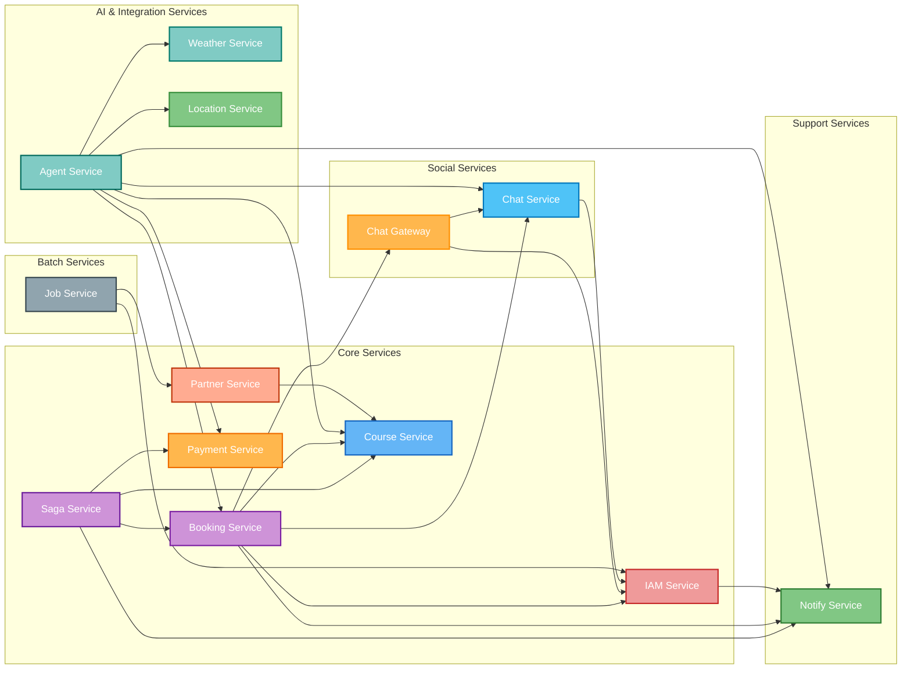
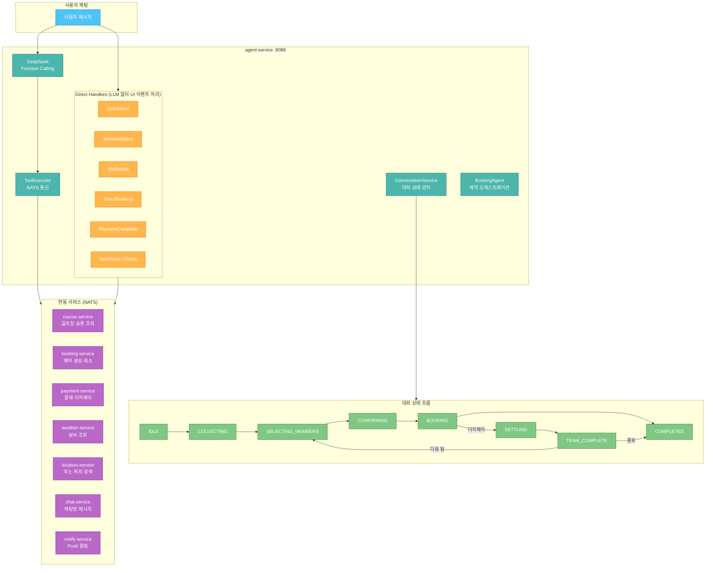
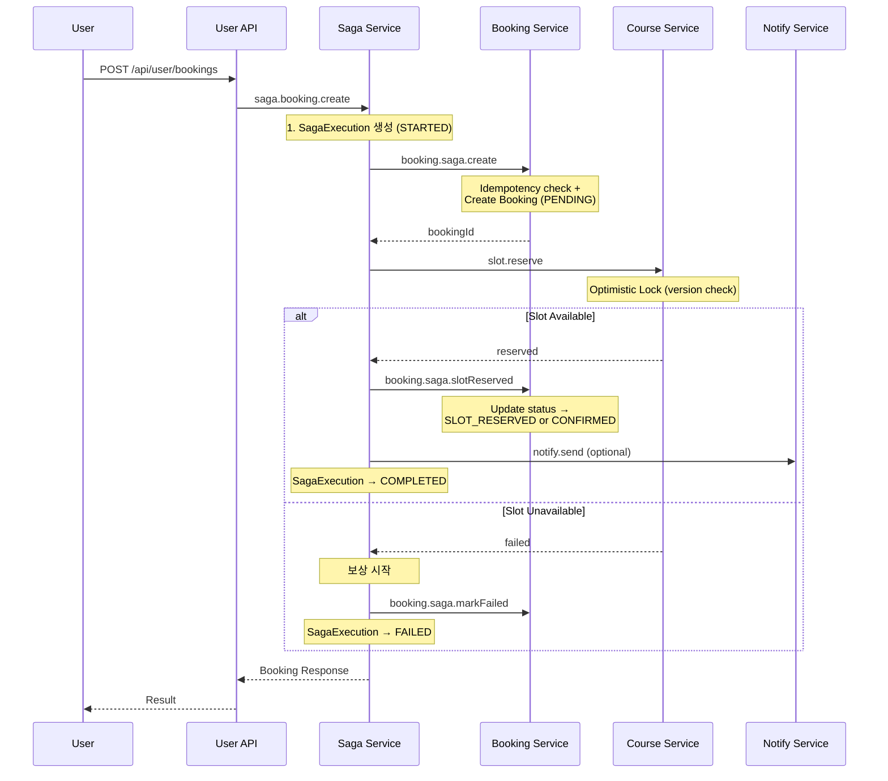
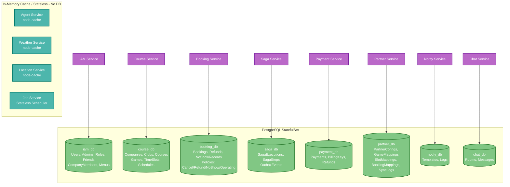
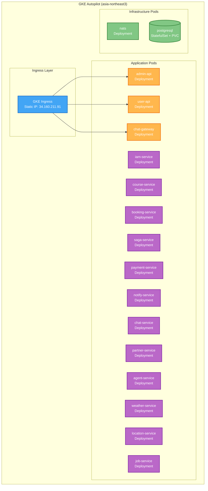
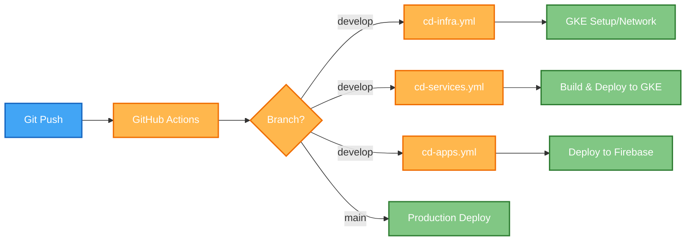

# Park Golf Platform - System Architecture

## Table of Contents
1. [Overview](#overview)
2. [System Architecture Diagram](#system-architecture-diagram)
3. [Service Dependencies](#service-dependencies)
4. [Service Details](#service-details)
5. [Saga Pattern](#saga-pattern-distributed-transactions)
6. [Database Architecture](#database-architecture)
7. [Deployment Architecture](#deployment-architecture)

## Overview

Park Golf Platform은 골프장 예약 및 관리를 위한 통합 플랫폼으로, 마이크로서비스 아키텍처(MSA)를 기반으로 구축되었습니다.

### 가맹점 분류 체계

#### 골프장 유형 (ClubType)
| 유형 | 설명 | 특징 |
|------|------|------|
| **지자체 파크골프장** (`PUBLIC`) | 지방자치단체 운영 공공 골프장 | 무료/저렴한 이용료, 자체 부킹 시스템 없는 경우가 대부분 |
| **사설 파크골프장** (`PRIVATE`) | 민간 사업자 운영 유료 골프장 | 유료 이용, 자체 부킹 시스템 보유 가능 |

#### 부킹 연동 방식 (BookingMode)
| 방식 | 설명 | 데이터 흐름 |
|------|------|------------|
| **자체 플랫폼** (`PLATFORM`) | 자체 부킹 시스템 없음 → 파크골프메이트 부킹 직접 사용 | booking-service에서 예약 직접 관리 |
| **파트너 연동** (`PARTNER`) | 자체 부킹 시스템 보유 → API 연동 | partner-service가 외부 시스템과 슬롯/예약 동기화 (10분 주기 cron) |

#### 분류 매트릭스

| 골프장 유형 | 자체 플랫폼 (`PLATFORM`) | 파트너 연동 (`PARTNER`) |
|------------|------------------------|----------------------|
| **지자체** (`PUBLIC`) | 주요 케이스 | 드문 케이스 |
| **사설** (`PRIVATE`) | 소규모 골프장 | 주요 케이스 |

- **DB 모델**: `Club.clubType` (PUBLIC/PRIVATE), `Club.bookingMode` (PLATFORM/PARTNER)
- **파트너 연동 시**: partner-service의 `PartnerConfig`로 연동 설정 관리
- **자체 플랫폼 시**: booking-service + course-service로 예약 직접 처리

### Core Design Principles
- **Microservices Architecture**: 도메인별 독립적인 서비스 분리
- **Backend for Frontend (BFF)**: 프론트엔드별 최적화된 API 게이트웨이
- **Event-Driven Architecture**: NATS 기반 비동기 메시징
- **Domain-Driven Design**: 비즈니스 도메인 중심 설계
- **Cloud-Native**: GKE Autopilot 기반 컨테이너 오케스트레이션

## System Architecture Diagram

```mermaid
graph TB
  classDef frontend fill:#4fc3f7,stroke:#0288d1,stroke-width:2px,color:#fff
  classDef bff fill:#ffb74d,stroke:#ef6c00,stroke-width:2px,color:#fff
  classDef service fill:#ba68c8,stroke:#7b1fa2,stroke-width:2px,color:#fff
  classDef aiservice fill:#4db6ac,stroke:#00796b,stroke-width:2px,color:#fff
  classDef data fill:#81c784,stroke:#2e7d32,stroke-width:2px,color:#fff
  classDef message fill:#f06292,stroke:#c2185b,stroke-width:2px,color:#fff
  classDef ingress fill:#42a5f5,stroke:#1565c0,stroke-width:2px,color:#fff
  classDef external fill:#ffcc80,stroke:#e65100,stroke-width:2px,color:#fff

  subgraph ClientLayer["Client Layer"]
    AD["Admin Dashboard<br/>React 19 + React Query<br/>:3000"]:::frontend
    PD["Platform Dashboard<br/>React 19 + React Query<br/>:3002"]:::frontend
    UW["User WebApp<br/>React 19<br/>:3001"]:::frontend
    IOS["iOS App<br/>SwiftUI + Socket.IO<br/>Native"]:::frontend
    AND["Android App<br/>Kotlin + Compose<br/>Native"]:::frontend
  end

  subgraph FirebaseHosting["Firebase Hosting"]
    FH_ADMIN["Admin Dashboard CDN"]:::frontend
    FH_PLATFORM["Platform Dashboard CDN"]:::frontend
    FH_USER["User WebApp CDN"]:::frontend
  end

  subgraph GKE["GKE Autopilot"]
    ING["GKE Ingress<br/>Static IP: 34.160.211.91"]:::ingress

    subgraph BFFLayer["API Gateway Layer - BFF"]
      AAPI["Admin API<br/>NestJS<br/>:8080"]:::bff
      UAPI["User API<br/>NestJS<br/>:8080"]:::bff
      CHATGW["Chat Gateway<br/>NestJS + Socket.IO<br/>:8080"]:::bff
    end

    subgraph CoreServices["Core Services"]
      IAM["IAM Service<br/>NestJS<br/>:8080"]:::service
      COURSE["Course Service<br/>NestJS<br/>:8080"]:::service
      BOOK["Booking Service<br/>NestJS<br/>:8080"]:::service
      SAGA["Saga Service<br/>NestJS<br/>:8080"]:::service
      NOTIFY["Notify Service<br/>NestJS<br/>:8080"]:::service
      CHAT["Chat Service<br/>NestJS<br/>:8080"]:::service
      PAY["Payment Service<br/>NestJS<br/>:8086"]:::service
      PARTNER["Partner Service<br/>NestJS<br/>:8080"]:::service
    end

    subgraph AIServices["AI & External API Services"]
      AGENT["Agent Service<br/>DeepSeek<br/>:8088"]:::aiservice
      WEATHER["Weather Service<br/>기상청 API<br/>:8087"]:::aiservice
      LOCATION["Location Service<br/>카카오 로컬 API<br/>:8089"]:::aiservice
    end

    subgraph BatchServices["Batch Services"]
      JOB["Job Service<br/>NestJS Schedule<br/>:8080"]:::service
    end

    subgraph InfraLayer["Infrastructure Layer"]
      NATS["NATS JetStream<br/>:4222"]:::message
      PG[("PostgreSQL<br/>:5432")]:::data
    end
  end

  subgraph ExternalAPIs["External APIs"]
    TOSS["Toss Payments API"]:::external
    KMA["기상청 API"]:::external
    KAKAO["카카오 로컬 API"]:::external
    DEEPSEEK["DeepSeek API"]:::external
  end

  %% Client to Firebase to Ingress
  AD --> FH_ADMIN
  PD --> FH_PLATFORM
  UW --> FH_USER
  FH_ADMIN --> ING
  FH_PLATFORM --> ING
  FH_USER --> ING
  IOS --> ING
  AND --> ING

  %% Ingress to BFF
  ING --> AAPI
  ING --> UAPI
  ING --> CHATGW

  %% BFF to NATS
  AAPI --> NATS
  UAPI --> NATS
  CHATGW --> NATS

  %% NATS to Core Services
  NATS <--> IAM
  NATS <--> COURSE
  NATS <--> BOOK
  NATS <--> SAGA
  NATS <--> NOTIFY
  NATS <--> CHAT
  NATS <--> PAY
  NATS <--> PARTNER

  %% NATS to AI & External Services
  NATS <--> AGENT
  NATS <--> WEATHER
  NATS <--> LOCATION

  %% NATS to Batch Services
  NATS <--> JOB

  %% External API connections
  PAY --> TOSS
  WEATHER --> KMA
  LOCATION --> KAKAO
  AGENT --> DEEPSEEK

  %% Service to Database
  IAM --> PG
  COURSE --> PG
  BOOK --> PG
  SAGA --> PG
  NOTIFY --> PG
  CHAT --> PG
  PAY --> PG
  PARTNER --> PG
```



## Service Dependencies



## Service Details

### 1. Frontend Services

#### Admin Dashboard (가맹점 관리자, :3000)
- 관리자 인증 및 권한 관리 (RBAC)
- 골프장/코스/게임 관리 (Company, Club, Course, Game, GameTimeSlot)
- 예약 관리 및 모니터링
- 가맹점별 회원 관리 (CompanyMember)
- 계층형 정책 관리 (취소/환불/노쇼/운영 - 상속 지원)
- 통계 대시보드, 카카오맵 연동

#### Platform Dashboard (플랫폼 관리자, :3002)
- 플랫폼 전체 관리 (PLATFORM 스코프)
- 가맹점 관리: 회사(Company) 관리, 파트너 연동 관리
- 플랫폼 기본 정책 설정 (취소/환불/노쇼/운영)
- 역할 및 권한 관리, 플랫폼 관리자 관리

#### User WebApp (:3001)
- 사용자 회원가입/로그인
- 골프장 검색 및 조회, 예약 생성/수정/취소
- 친구 관리, 채팅 (REST + WebSocket), 프로필 관리

#### iOS App (SwiftUI + MVVM, Native)
- 사용자 인증, 골프장 검색/조회, 예약 생성/조회/취소
- 친구 관리 (주소록 연동), 실시간 채팅 (Socket.IO)
- 라운드 기록 및 통계, 프로필 관리

#### Android App (Kotlin + Compose + MVVM, Native)
- iOS App과 동일 기능 세트
- Hilt DI, Retrofit + OkHttp, Repository 패턴

### 2. BFF Services (Backend for Frontend)

#### Admin API (:8080)
```
Purpose: 관리자 대시보드 + 플랫폼 대시보드 공용 API Gateway
- Response 변환 없이 그대로 전달 (BFF 패턴)
- @AdminContext() 데코레이터로 companyId 자동 주입

REST Routes:
  /api/admin/auth/*             → IAM Service
  /api/admin/clubs/*            → Course Service
  /api/admin/games/*            → Course Service
  /api/admin/company-members/*  → IAM Service
  /api/admin/policies/*         → Booking Service (취소/환불/노쇼/운영)
  /api/admin/companies/*        → IAM Service
  /api/admin/menus/*            → IAM Service
  /api/admin/partners/*         → Partner Service (연동 설정, 게임 매핑, 동기화)
```

#### User API (:8080)
```
Purpose: 사용자 웹앱/모바일앱 전용 API Gateway
- Response 변환 없이 그대로 전달 (BFF 패턴)
- 토큰 관리, Rate limiting

Connected Services (via NATS):
  IAM / Course / Booking / Payment / Notify / Chat / Agent
```

### 3. Core Microservices

| 서비스 | 포트 | DB | 핵심 기능 |
|--------|------|-----|----------|
| **iam-service** | 8080 | iam_db | JWT 인증 (Access 15min + Refresh 7d), RBAC (40+ 권한), 가맹점 회원, 동적 메뉴, 친구 관리 |
| **course-service** | 8080 | course_db | 골프장/코스/게임 관리, 타임슬롯 자동 생성, 근처 검색 (Haversine), Optimistic Locking |
| **booking-service** | 8080 | booking_db | 예약 CRUD, Saga Step Handler, 계층형 정책 Resolve (Club→Company→Platform), 더치페이 정산, 환불/노쇼 |
| **saga-service** | 8080 | saga_db | 분산 트랜잭션 Orchestrator, 선언적 Saga 정의, 보상 자동 역순 실행, Outbox |
| **payment-service** | 8086 | payment_db | Toss Payments 결제위젯, 빌링키, 부분/전액 환불, 더치페이 분할결제, Webhook |
| **partner-service** | 8080 | partner_db | 외부 ERP 연동 (OpenAPI 동적 호출), 슬롯/예약 양방향 동기화, 서킷 브레이커 |
| **notify-service** | 8080 | notify_db | Multi-channel 알림 (Email/SMS/Push), 템플릿, 재시도 |

#### Saga 정의

| Saga | 트리거 | 흐름 |
|------|--------|------|
| CreateBooking | `saga.booking.create` | create → slot.reserve → slotReserved → notify |
| CancelBooking | `saga.booking.cancel` | policy check → refund → cancel → slot.release → notify |
| AdminRefund | `saga.booking.adminRefund` | adminCancel → refund → finalizeCancelled → slot.release → notify |
| PaymentConfirmed | `booking.paymentConfirmed` | confirmPayment → notify |
| PaymentTimeout | 타임아웃 감지 | paymentTimeout → slot.release → notify |

### 4. Social Services

| 서비스 | 포트 | DB | 핵심 기능 |
|--------|------|-----|----------|
| **chat-service** | 8080 | chat_db | 채팅방 (DIRECT/CHANNEL/BOOKING), 메시지 저장/읽음, AI 메시지 (metadata JSON) |
| **chat-gateway** | 8080 | - | Socket.IO + NATS Adapter (cross-pod), 2 replicas, 토큰 만료 모니터링 |

### 5. AI & External API Services

| 서비스 | 포트 | 외부 API | 핵심 기능 |
|--------|------|----------|----------|
| **agent-service** | 8088 | DeepSeek | AI 예약 오케스트레이션 (아래 차트 참조) |
| **weather-service** | 8087 | 기상청 API | 초단기실황/예보, 단기예보 (3일), 좌표 변환 (LCC 투영) |
| **location-service** | 8089 | Kakao Local | 주소/키워드 검색, 좌표↔주소 변환, 근처 골프장 검색 |

#### Agent Service 오케스트레이션



### 6. Batch Services

| 서비스 | 포트 | DB | 핵심 기능 |
|--------|------|-----|----------|
| **job-service** | 8080 | - | Cron 스케줄러: 계정 삭제 (D-3 리마인더, 실행), 파트너 슬롯 동기화 (10분 주기) |

## Saga Pattern (Distributed Transactions)

### Saga Orchestrator (saga-service)

saga-service가 분산 트랜잭션의 중앙 오케스트레이터 역할을 합니다.
BFF(user-api/admin-api)가 `saga.booking.*` 패턴으로 saga-service를 호출하면,
saga-service가 각 서비스(booking/course/payment/notify)에 Step을 순차 실행합니다.

### Booking Saga Flow


### Booking States

```
PENDING → SLOT_RESERVED → CONFIRMED
    ↓           ↓             ↓
  FAILED      FAILED      CANCELLED
              (timeout)
```

#### 결제방법별 흐름
| 결제방법 | Saga 목표 상태 | 이후 처리 |
|----------|---------------|----------|
| **현장결제** (onsite) | `CONFIRMED` | 바로 예약 완료 |
| **카드결제** (card) | `SLOT_RESERVED` | `payment.prepare` → orderId 발급 → Toss 결제위젯 → `payment.confirm` → `PaymentConfirmedSaga` → `CONFIRMED` |
| **더치페이** (dutchpay) | `SLOT_RESERVED` | `payment.splitPrepare` → N명 orderId 발급 → SETTLEMENT_STATUS + 브로드캐스트 → 전원 결제 → TEAM_COMPLETE |

#### AI Agent 원샷 처리 (카드결제)
```
saga.booking.create → Saga 완료(SLOT_RESERVED) → payment.prepare → SHOW_PAYMENT(orderId 포함)
```
Agent가 한 요청에서 순차 처리하여, Client는 별도 `payment.prepare` 호출 없이 바로 Toss 위젯을 띄울 수 있음.
`payment.prepare` 실패 시 `orderId: null`로 graceful degradation (Client fallback 지원).

## Database Architecture



## Deployment Architecture

### GKE Autopilot


### Service Port Assignments

| Service | Port | Description |
|---------|------|-------------|
| admin-api | 8080 | Admin BFF |
| user-api | 8080 | User BFF |
| chat-gateway | 8080 | WebSocket Gateway |
| iam-service | 8080 | Authentication |
| course-service | 8080 | Golf Course |
| booking-service | 8080 | Booking |
| saga-service | 8080 | Saga Orchestrator |
| notify-service | 8080 | Notification |
| chat-service | 8080 | Chat |
| partner-service | 8080 | Partner Integration |
| payment-service | 8086 | Toss Payments |
| weather-service | 8087 | 기상청 API |
| agent-service | 8088 | AI Agent (DeepSeek) |
| job-service | 8080 | Batch Scheduler |
| location-service | 8089 | 카카오 로컬 API |

### CI/CD Pipeline


| Workflow | File | Purpose |
|----------|------|---------|
| **CI Pipeline** | `ci.yml` | Lint, Test, Build, Security Scan |
| **CD Infrastructure** | `cd-infra.yml` | GKE Autopilot & Network Management |
| **CD Services** | `cd-services.yml` | Backend Service Deployment |
| **CD Apps** | `cd-apps.yml` | Frontend App Deployment (Firebase) |

---

**Document Version**: 9.0.0
**Last Updated**: 2026-03-15
**Maintained By**: Platform Team
