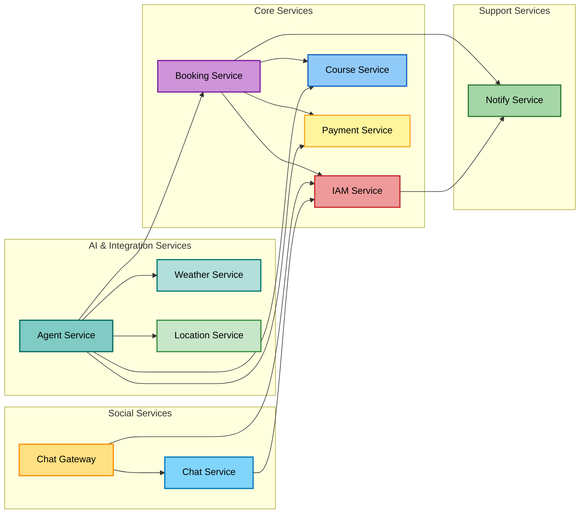
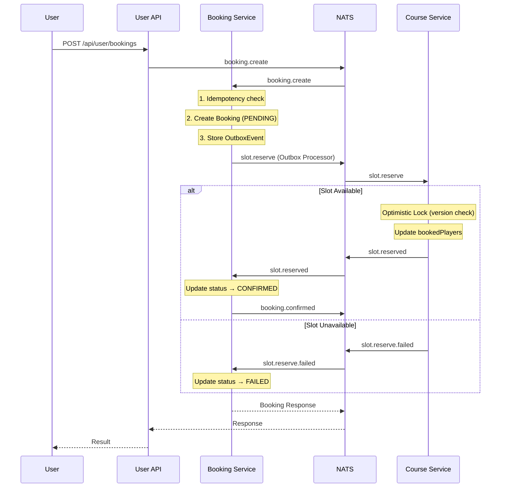
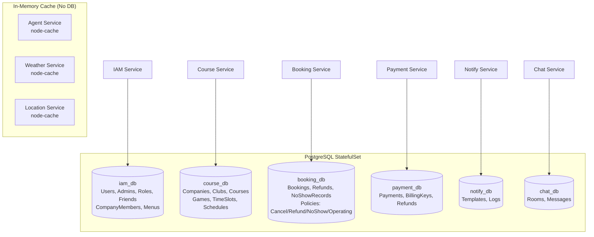
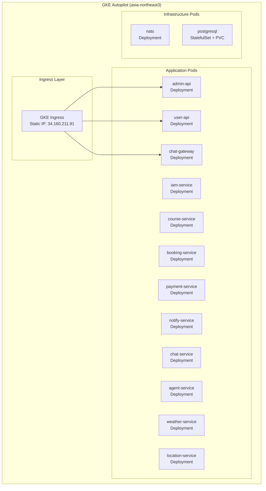
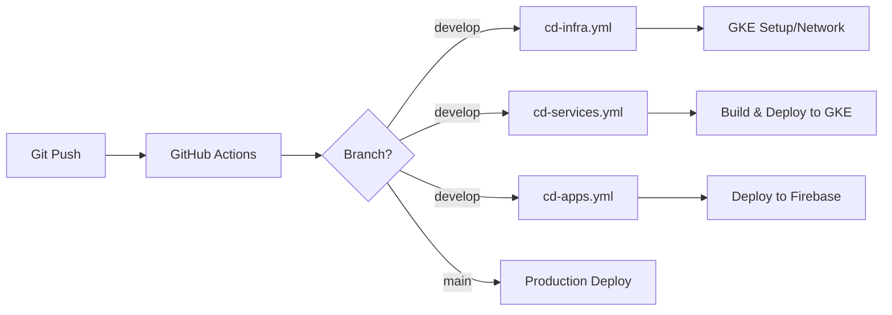

# Park Golf Platform - System Architecture

## Table of Contents
1. [Overview](#overview)
2. [System Architecture Diagram](#system-architecture-diagram)
3. [Service Dependencies](#service-dependencies)
4. [Service Details](#service-details)
5. [Saga Pattern](#saga-pattern-distributed-transactions)
6. [Database Architecture](#database-architecture)
7. [Deployment Architecture](#deployment-architecture)

## Overview

Park Golf Platform은 골프장 예약 및 관리를 위한 통합 플랫폼으로, 마이크로서비스 아키텍처(MSA)를 기반으로 구축되었습니다.

### Core Design Principles
- **Microservices Architecture**: 도메인별 독립적인 서비스 분리
- **Backend for Frontend (BFF)**: 프론트엔드별 최적화된 API 게이트웨이
- **Event-Driven Architecture**: NATS 기반 비동기 메시징
- **Domain-Driven Design**: 비즈니스 도메인 중심 설계
- **Cloud-Native**: GKE Autopilot 기반 컨테이너 오케스트레이션

## System Architecture Diagram

```mermaid
graph TB
    subgraph "Client Layer"
        AD[Admin Dashboard<br/>React 19 + React Query<br/>:3000]
        PD[Platform Dashboard<br/>React 19 + React Query<br/>:3002]
        UW[User WebApp<br/>React 19<br/>:3001]
        IOS[iOS App<br/>SwiftUI + Socket.IO<br/>Native]
        AND[Android App<br/>Kotlin + Compose<br/>Native]
    end

    subgraph "GKE Autopilot"
        subgraph "API Gateway Layer (BFF)"
            AAPI[Admin API<br/>NestJS<br/>:8080]
            UAPI[User API<br/>NestJS<br/>:8080]
            CHATGW[Chat Gateway<br/>NestJS + Socket.IO<br/>:8080]
        end

        subgraph "Core Services"
            IAM[IAM Service<br/>NestJS<br/>:8080]
            COURSE[Course Service<br/>NestJS<br/>:8080]
            BOOK[Booking Service<br/>NestJS<br/>:8080]
            NOTIFY[Notify Service<br/>NestJS<br/>:8080]
            CHAT[Chat Service<br/>NestJS<br/>:8080]
            PAY[Payment Service<br/>NestJS<br/>:8086]
        end

        subgraph "AI & External API Services"
            AGENT[Agent Service<br/>Gemini 1.5 Flash<br/>:8088]
            WEATHER[Weather Service<br/>기상청 API<br/>:8087]
            LOCATION[Location Service<br/>카카오 로컬 API<br/>:8089]
        end

        subgraph "Infrastructure Layer"
            NATS[NATS JetStream<br/>:4222]
            PG[(PostgreSQL<br/>:5432)]
        end

        ING[GKE Ingress<br/>Static IP: 34.160.211.91]
    end

    subgraph "External APIs"
        TOSS[Toss Payments API]
        KMA[기상청 API]
        KAKAO[카카오 로컬 API]
        GEMINI[Google Gemini API]
    end

    subgraph "Firebase Hosting"
        FH_ADMIN[Admin Dashboard CDN]
        FH_PLATFORM[Platform Dashboard CDN]
        FH_USER[User WebApp CDN]
    end

    %% Client to Ingress connections
    AD --> FH_ADMIN
    PD --> FH_PLATFORM
    UW --> FH_USER
    FH_ADMIN --> ING
    FH_PLATFORM --> ING
    FH_USER --> ING
    IOS --> ING
    AND --> ING

    %% Ingress to BFF
    ING --> AAPI
    ING --> UAPI
    ING --> CHATGW

    %% BFF to Services via NATS
    AAPI --> NATS
    UAPI --> NATS
    CHATGW --> NATS

    %% NATS to Core Services
    NATS <--> IAM
    NATS <--> COURSE
    NATS <--> BOOK
    NATS <--> NOTIFY
    NATS <--> CHAT
    NATS <--> PAY

    %% NATS to AI & External Services
    NATS <--> AGENT
    NATS <--> WEATHER
    NATS <--> LOCATION

    %% External API connections
    PAY --> TOSS
    WEATHER --> KMA
    LOCATION --> KAKAO
    AGENT --> GEMINI

    %% Service to Database
    IAM --> PG
    COURSE --> PG
    BOOK --> PG
    NOTIFY --> PG
    CHAT --> PG
    PAY --> PG

    classDef frontend fill:#4fc3f7,stroke:#01579b,stroke-width:2px,color:#000
    classDef bff fill:#ffb74d,stroke:#e65100,stroke-width:2px,color:#000
    classDef service fill:#ba68c8,stroke:#4a148c,stroke-width:2px,color:#fff
    classDef aiservice fill:#4db6ac,stroke:#00695c,stroke-width:2px,color:#000
    classDef data fill:#81c784,stroke:#1b5e20,stroke-width:2px,color:#000
    classDef message fill:#f06292,stroke:#880e4f,stroke-width:2px,color:#fff
    classDef ingress fill:#42a5f5,stroke:#1565c0,stroke-width:2px,color:#000
    classDef external fill:#ffcc80,stroke:#ef6c00,stroke-width:2px,color:#000

    class AD,PD,UW,IOS,AND frontend
    class AAPI,UAPI,CHATGW bff
    class IAM,COURSE,BOOK,NOTIFY,CHAT,PAY service
    class AGENT,WEATHER,LOCATION aiservice
    class PG data
    class NATS message
    class ING ingress
    class TOSS,KMA,KAKAO,GEMINI external
```



## Service Dependencies



## Service Details

### 1. Frontend Services

#### Admin Dashboard (가맹점 관리자, :3000)
- 관리자 인증 및 권한 관리 (RBAC)
- 골프장/코스/게임 관리 (Company, Club, Course, Game, GameTimeSlot)
- 예약 관리 및 모니터링
- 가맹점별 회원 관리 (CompanyMember)
- 계층형 정책 관리 (취소/환불/노쇼/운영 - 상속 지원)
- 통계 대시보드, 카카오맵 연동

#### Platform Dashboard (플랫폼 관리자, :3002)
- 플랫폼 전체 관리 (PLATFORM 스코프)
- 가맹점(Company) 관리, 플랫폼 관리자 관리
- 플랫폼 기본 정책 설정 (취소/환불/노쇼/운영)
- 역할 및 권한 관리

#### User WebApp (:3001)
- 사용자 회원가입/로그인
- 골프장 검색 및 조회, 예약 생성/수정/취소
- 친구 관리, 채팅 (REST + WebSocket), 프로필 관리

#### iOS App (SwiftUI + MVVM, Native)
- 사용자 인증, 골프장 검색/조회, 예약 생성/조회/취소
- 친구 관리 (주소록 연동), 실시간 채팅 (Socket.IO)
- 라운드 기록 및 통계, 프로필 관리

#### Android App (Kotlin + Compose + MVVM, Native)
- iOS App과 동일 기능 세트
- Hilt DI, Retrofit + OkHttp, Repository 패턴

### 2. BFF Services (Backend for Frontend)

#### Admin API (:8080)
```
Purpose: 관리자 대시보드 + 플랫폼 대시보드 공용 API Gateway
- Response 변환 없이 그대로 전달 (BFF 패턴)
- @AdminContext() 데코레이터로 companyId 자동 주입

REST Routes:
  /api/admin/auth/*             → IAM Service
  /api/admin/clubs/*            → Course Service
  /api/admin/games/*            → Course Service
  /api/admin/company-members/*  → IAM Service
  /api/admin/policies/*         → Booking Service (취소/환불/노쇼/운영)
  /api/admin/companies/*        → IAM Service
  /api/admin/menus/*            → IAM Service
```

#### User API (:8080)
```
Purpose: 사용자 웹앱/모바일앱 전용 API Gateway
- Response 변환 없이 그대로 전달 (BFF 패턴)
- 토큰 관리, Rate limiting

Connected Services (via NATS):
  IAM / Course / Booking / Payment / Notify / Agent
```

### 3. Core Microservices

#### IAM Service (:8080)
```
Database: PostgreSQL (iam_db)

Data Models:
  User, Admin, Company (PLATFORM/ASSOCIATION/FRANCHISE)
  RoleMaster, AdminCompany, Friend/FriendRequest
  RefreshToken, LoginHistory
  CompanyMember (source: BOOKING/MANUAL/WALK_IN)
  MenuMaster, MenuPermission, MenuCompanyType

Core Features:
  - JWT (Access 15min + Refresh 7days), RBAC (40+ permissions)
  - 가맹점별 회원 관리, DB 기반 동적 메뉴, 친구 관리

NATS Patterns:
  auth.login / auth.validate / auth.refresh
  auth.admin.* / auth.permission.*
  users.create/list/findById/update/delete
  friends.*
  iam.companyMembers.list/create/update/delete/addByBooking
  iam.menus.*
```

#### Course Service (:8080)
```
Database: PostgreSQL (course_db)

Data Models:
  Company, Club (위경도 좌표), Course (9홀), Hole, TeeBox
  Game (18홀, SlotMode: TEE_TIME/SESSION)
  GameTimeSlot (Optimistic Lock), GameWeeklySchedule

Core Features:
  - 골프장/코스/게임 관리, 타임슬롯 자동 생성
  - 근처 골프장 검색 (Haversine), Optimistic Locking 동시성 제어

NATS Patterns:
  companies.* / clubs.* / club.findNearby
  courses.* / holes.*
  games.list/get/create/update/delete/search
  gameTimeSlots.* / timeSlots.*
  gameWeeklySchedules.*
  slot.reserve / slot.release (Saga)
```

#### Booking Service (:8080)
```
Database: PostgreSQL (booking_db)

Data Models - Booking:
  Booking (Saga 상태), BookingHistory, GameCache, GameTimeSlotCache
  OutboxEvent, IdempotencyKey, Refund, UserNoShowRecord

Data Models - Policy (계층형, PLATFORM > COMPANY > CLUB):
  CancellationPolicy, RefundPolicy + RefundRateTier
  NoShowPolicy + NoShowPenalty, OperatingPolicy

Core Features:
  - Saga 패턴 (PENDING → SLOT_RESERVED → CONFIRMED / FAILED)
  - Transactional Outbox, Idempotency Key
  - 계층형 정책 Resolve (Club → Company → Platform 폴백)
  - 시간대별 환불률, 노쇼 패널티

NATS Patterns:
  booking.create/findById/get/list/cancel
  policy.cancellation.list/findById/resolve/create/update/delete
  policy.refund.list/findById/resolve/create/update/delete/calculate
  policy.noshow.list/findById/resolve/create/update/delete/getUserCount/getApplicablePenalty
  policy.operating.list/findById/resolve/create/update/delete
```

#### Payment Service (:8086)
```
Database: PostgreSQL (payment_db)
External API: Toss Payments

Data Models:
  Payment, BillingKey, PaymentHistory, Refund, OutboxEvent, WebhookLog

Core Features:
  - 결제위젯 (Toss Payments), 카드/계좌이체/간편결제
  - 빌링키 자동결제, 부분/전액 환불
  - 결제 상태 (PENDING → COMPLETED → REFUNDED)
  - Webhook 수신/검증, Transactional Outbox

NATS Patterns:
  payment.prepare (orderId 발급)
  payment.request / payment.confirm / payment.cancel
  payment.billing.issue / payment.billing.charge
  payment.refund / payment.status / payment.webhook
```

#### Notify Service (:8080)
```
Database: PostgreSQL (notify_db)

Core Features:
  - Multi-channel 알림 (Email/SMS/Push)
  - 템플릿 관리, 발송 스케줄링, 재시도 메커니즘
```

### 4. Social Services

#### Chat Service (:8080)
```
Database: PostgreSQL (chat_db)

Data Models:
  ChatRoom (DIRECT/GROUP/BOOKING), ChatMessage, ChatRoomMember

NATS Patterns:
  chat.rooms.create/get/list/addMember/removeMember/booking
  chat.messages.save/list/markRead/unreadCount/delete
```

#### Chat Gateway (:8080)
```
WebSocket (Socket.IO, Namespace: /chat) + NATS

Events (Client→Server): join_room, leave_room, send_message, typing
Events (Server→Client): connected, new_message, user_joined/left, typing, error
```

### 5. AI & External API Services

#### Agent Service (:8088)
```
External API: Google Gemini 1.5 Flash
Cache: In-memory (node-cache)

Architecture:
  GeminiService → Function Calling
  ToolExecutorService → NATS 통신 (5개 서비스 연동)
  ConversationService → 메모리 캐시 대화 관리
  BookingAgentService → 예약 플로우 오케스트레이션

Connected NATS Clients:
  COURSE_SERVICE / BOOKING_SERVICE / PAYMENT_SERVICE / WEATHER_SERVICE / LOCATION_SERVICE

Function Calling Tools:
  search_clubs, search_clubs_with_slots, get_club_info
  get_weather, get_available_slots, create_booking
  search_address, get_nearby_clubs, get_booking_policy

Direct Handlers (LLM 없이 UI 이벤트 직접 처리):
  handleDirectClubSelect: 골프장 카드 → 슬롯 조회
  handleDirectSlotSelect: 슬롯 카드 → 예약 확인 카드
  handleDirectBooking:
    - 현장결제(onsite): CONFIRMED → BOOKING_COMPLETE
    - 카드결제(card): SLOT_RESERVED → payment.prepare → SHOW_PAYMENT (orderId 포함)
  handlePaymentComplete / handleCancelBooking

NATS Patterns — Inbound:
  agent.chat / agent.reset / agent.status / agent.stats

NATS Patterns — Outbound:
  club.search / clubs.get / club.findNearby (→ course-service)
  games.search (→ course-service)
  booking.create / booking.findById (→ booking-service)
  policy.*.resolve (→ booking-service)
  payment.prepare (→ payment-service)
  weather.forecast (→ weather-service)
  location.search.address (→ location-service)

Conversation States:
  IDLE → COLLECTING → CONFIRMING → BOOKING → COMPLETED
                                            ↓
                                        CANCELLED
```

#### Weather Service (:8087)
```
External API: 기상청 공공데이터 API
Cache: In-memory (node-cache, TTL 30분/1시간)

Core Features:
  초단기실황, 초단기예보 (6시간), 단기예보 (3일)
  좌표 변환 (위경도 → 기상청 격자, LCC 투영법)

NATS Patterns:
  weather.current / weather.ultraShort / weather.forecast / weather.stats
```

#### Location Service (:8089)
```
External API: Kakao Local API
Cache: In-memory (node-cache, 주소 1시간, 좌표 24시간)

Core Features:
  주소/키워드/카테고리 검색, 좌표↔주소 변환, 근처 파크골프장 검색

NATS Patterns:
  location.search.address / location.search.keyword / location.search.category
  location.coord2address / location.coord2region / location.getCoordinates
  location.nearbyGolf / location.stats
```

## Saga Pattern (Distributed Transactions)

### Booking Saga Flow


### Booking States

```
PENDING → SLOT_RESERVED → CONFIRMED
    ↓           ↓             ↓
  FAILED      FAILED      CANCELLED
              (timeout)
```

#### 결제방법별 흐름
| 결제방법 | Saga 목표 상태 | 이후 처리 |
|----------|---------------|----------|
| **현장결제** (onsite) | `CONFIRMED` | 바로 예약 완료 |
| **카드결제** (card) | `SLOT_RESERVED` | `payment.prepare` → orderId 발급 → Toss 결제위젯 → `payment.confirm` → `CONFIRMED` |

#### AI Agent 원샷 처리 (카드결제)
```
booking.create → Saga 폴링(SLOT_RESERVED) → payment.prepare → SHOW_PAYMENT(orderId 포함)
```
Agent가 한 요청에서 순차 처리하여, Client는 별도 `payment.prepare` 호출 없이 바로 Toss 위젯을 띄울 수 있음.
`payment.prepare` 실패 시 `orderId: null`로 graceful degradation (Client fallback 지원).

## Database Architecture



## Deployment Architecture

### GKE Autopilot


### Service Port Assignments

| Service | Port | Description |
|---------|------|-------------|
| admin-api | 8080 | Admin BFF |
| user-api | 8080 | User BFF |
| chat-gateway | 8080 | WebSocket Gateway |
| iam-service | 8080 | Authentication |
| course-service | 8080 | Golf Course |
| booking-service | 8080 | Booking |
| notify-service | 8080 | Notification |
| chat-service | 8080 | Chat |
| payment-service | 8086 | Toss Payments |
| weather-service | 8087 | 기상청 API |
| agent-service | 8088 | AI Agent (Gemini) |
| location-service | 8089 | 카카오 로컬 API |

### CI/CD Pipeline


| Workflow | File | Purpose |
|----------|------|---------|
| **CI Pipeline** | `ci.yml` | Lint, Test, Build, Security Scan |
| **CD Infrastructure** | `cd-infra.yml` | GKE Autopilot & Network Management |
| **CD Services** | `cd-services.yml` | Backend Service Deployment |
| **CD Apps** | `cd-apps.yml` | Frontend App Deployment (Firebase) |

---

**Document Version**: 6.0.0
**Last Updated**: 2026-02-24
**Maintained By**: Platform Team
