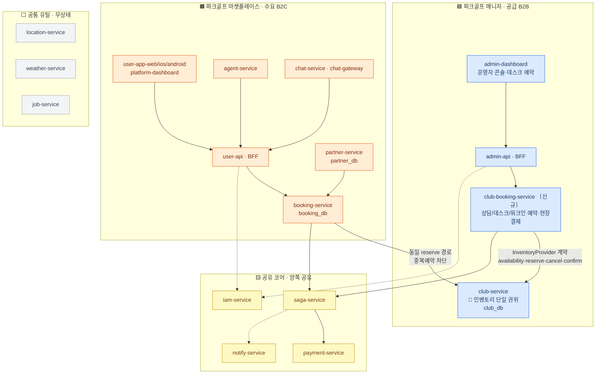
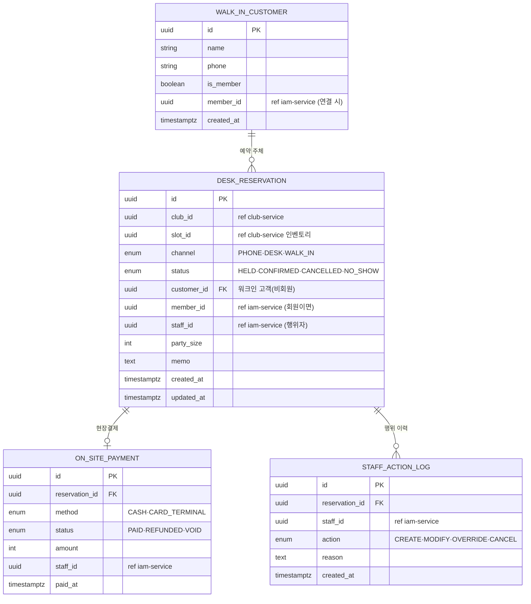
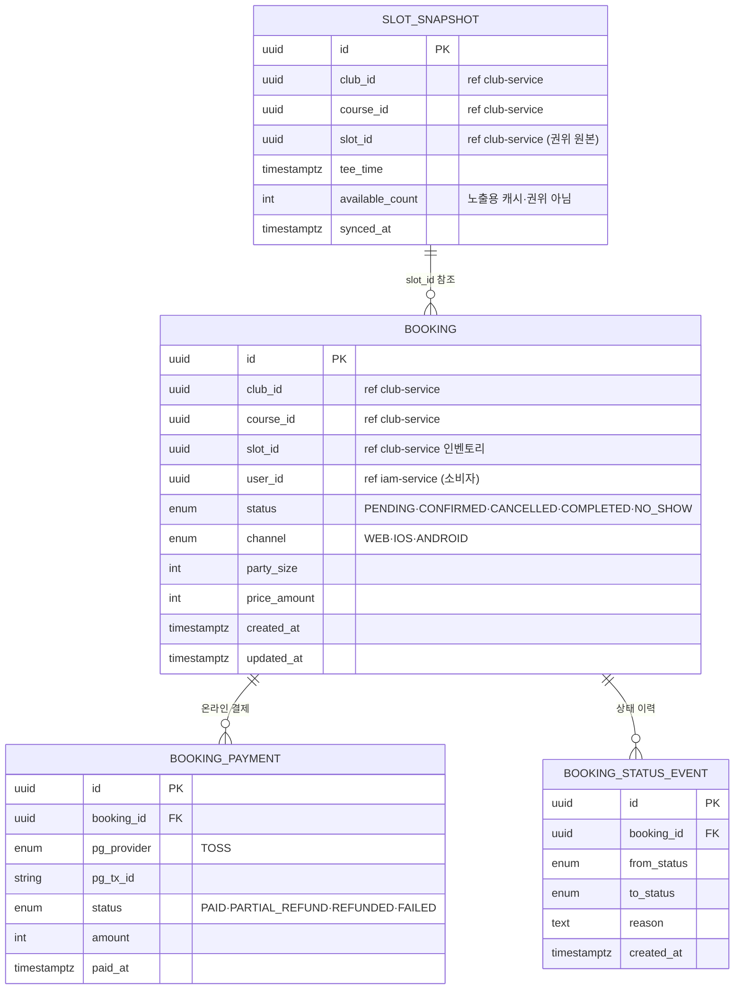

# ERP / 부킹 분리 설계

> Linear: [UNI-91](https://linear.app/uniyous/issue/UNI-91) — ERP(파크골프 매니저)/부킹(파크골프 마켓플레이스)을 **나중에 각각 독립 클라우드로 분리 배포 가능**하도록 서비스·DB 경계와 통신 계약을 확정한다. 후속 구현([UNI-92](https://linear.app/uniyous/issue/UNI-92)·[UNI-94](https://linear.app/uniyous/issue/UNI-94))의 전제.

## 구성도

**범례**
- 🟦 매니저 / 🟧 마켓플레이스 = 미래 각각 독립 클라우드(VPC 격리) 후보. 🟨 공유 코어 = 양쪽 공유. ⬜ 공통 유틸 = 무상태·각 클라우드 직접 호출.
- 실선 = 동기 request/reply, 점선 = 비동기/이벤트. **모든 서비스 간 통신은 NATS** — 크로스-DB 접근 0.
- 🔑 **인벤토리 단일 권위**: 데스크(`club-booking-service`)·마켓(`booking-service`) 어느 채널이든 `club-service` 동일 `reserve` 경로 → 중복예약 구조적 차단. 분리선이 생겨도 이 불변식은 `InventoryProvider` 계약으로 유지.
- DB 파티션: 매니저측 `club_db` / 마켓측 `booking_db`·`partner_db` 별도 인스턴스 가능 구조 → 분리는 `DATABASE_URL` 교체 수준.

---

## 데이터 모델 (ERD)

부킹 엔진 2개는 각자 DB·테이블을 가진다(크로스-DB 0, 타 서비스 데이터는 ID 참조만). 슬롯 인벤토리의 권위는 항상 `club-service` — 양쪽 모두 `slot_id`로 참조하고 물리 FK를 걸지 않는다.

### club-booking-service (매니저 측 · club_db)

운영자 데스크/전화/워크인 예약. 직원이 행위자(대리예약·오버라이드), 비회원·워크인 고객, **현장결제**(현금·카드단말).

### booking-service (마켓플레이스 측 · booking_db)

여러 골프장에 걸친 소비자 온라인 예약 + 노출용 타임슬롯 캐시. **온라인 PG**(Toss)로만 결제.

**두 엔진의 차이 요약**

| 구분 | club-booking-service (매니저) | booking-service (마켓) |
|---|---|---|
| 채널 | 전화·데스크·워크인 | 웹·앱(온라인) |
| 행위자 | 직원(대리·오버라이드) | 소비자 본인 |
| 고객 | 회원 + 비회원/워크인 | 회원(소비자) |
| 결제 | 현장결제(현금·카드단말) | 온라인 PG(Toss) |
| 범위 | 단일 운영자 | 여러 골프장 횡단 |
| 슬롯 | club-service 직접 reserve | club-service reserve + 노출 캐시 |

---

> 상세 설계(InventoryProvider 계약 명세 · 정책 루트 단독/연동 · 3티어 패키징 · 결제/정산 미결정)는 UNI-91 본문 참조. 이 문서는 구성도·ERD부터 채우며 확장한다.
