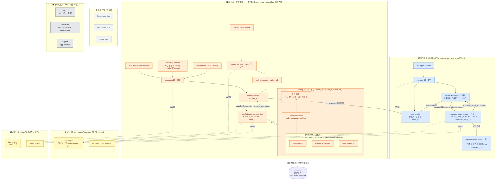
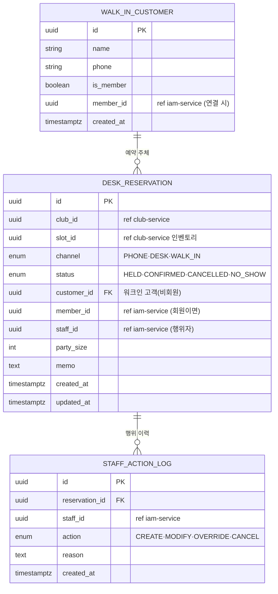
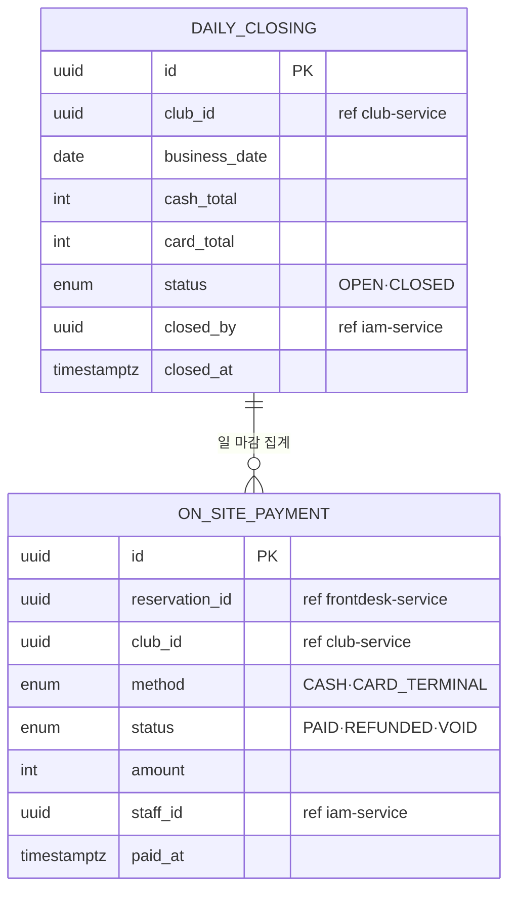
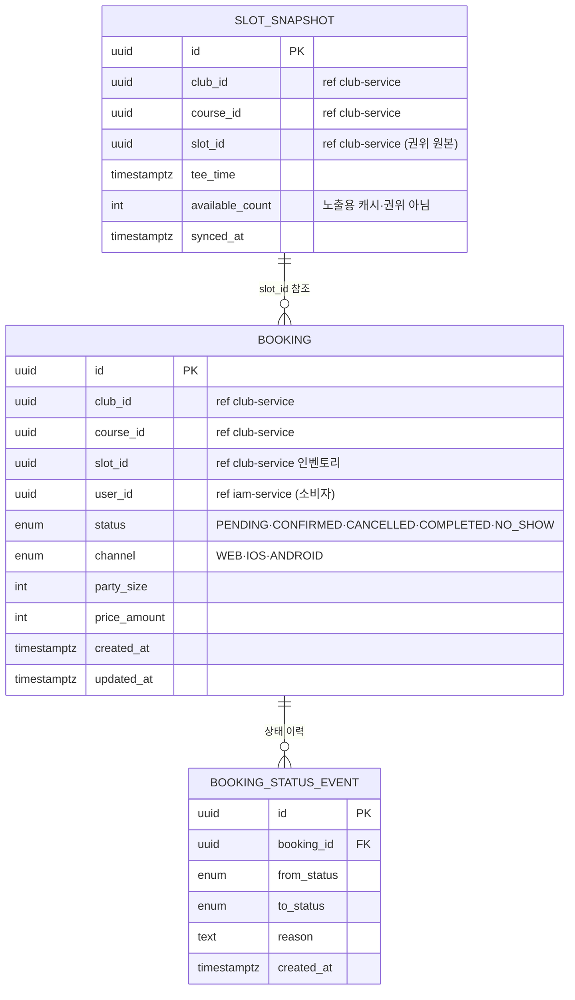
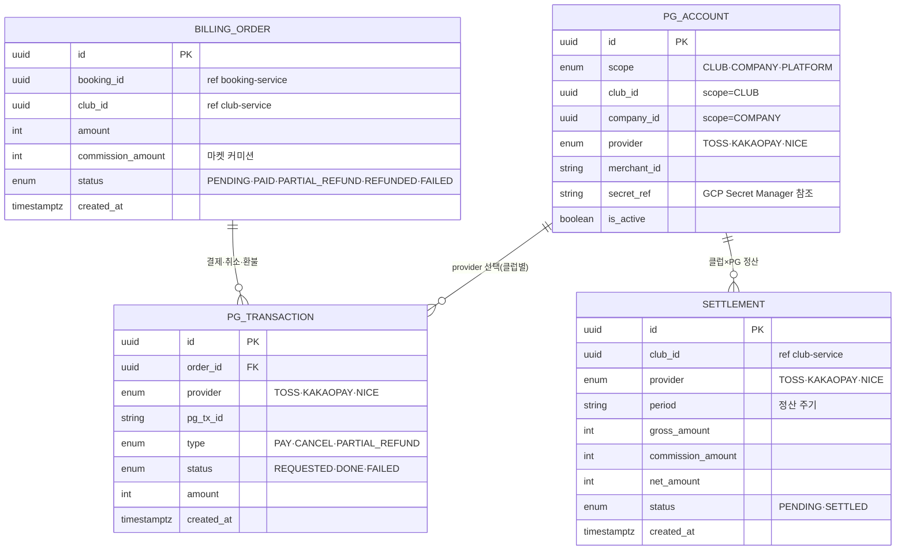
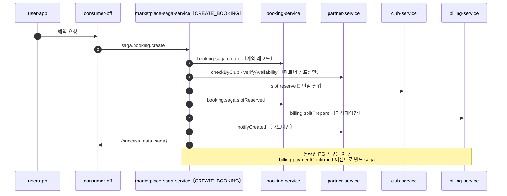
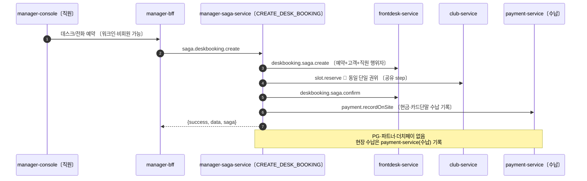
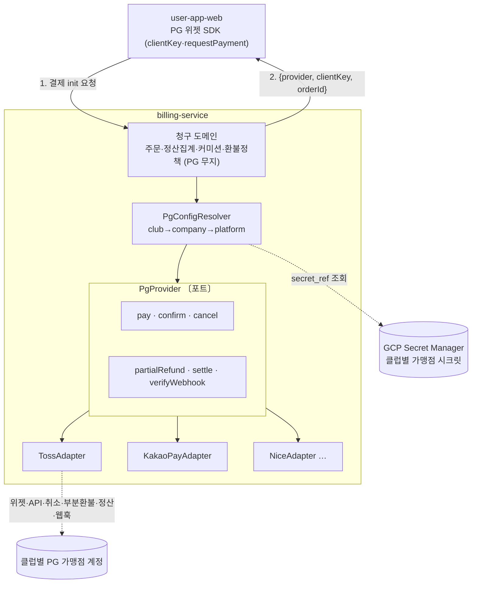
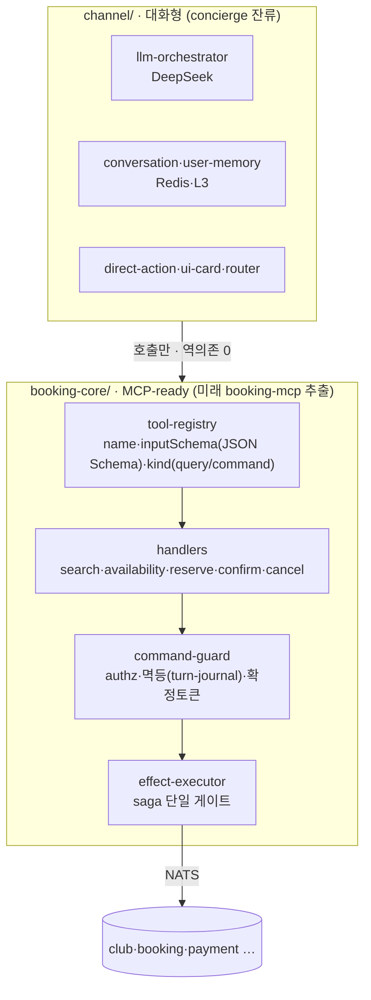
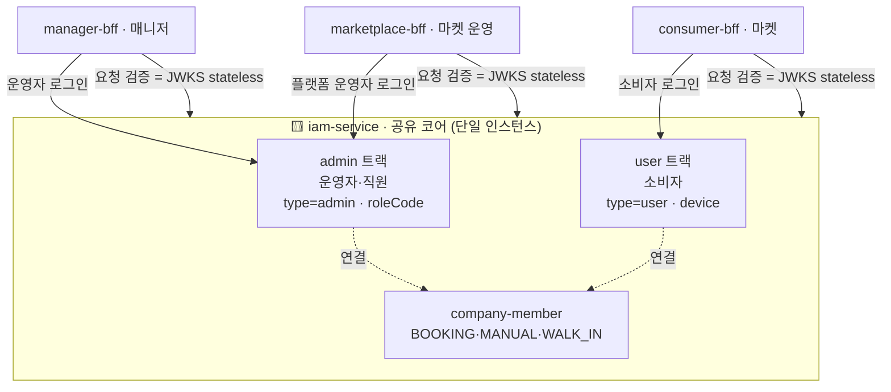

# ERP / 부킹 분리 설계 — 파크골프 매니저 · 마켓플레이스

> Linear: [UNI-91](https://linear.app/uniyous/issue/UNI-91) — ERP(파크골프 매니저)/부킹(파크골프 마켓플레이스)을 **나중에 각각 독립 클라우드로 분리 배포 가능**하도록 서비스·DB 경계와 통신 계약을 확정한다. 후속 구현([UNI-92](https://linear.app/uniyous/issue/UNI-92)·[UNI-94](https://linear.app/uniyous/issue/UNI-94))의 전제.

## 결정 이력

- **2026-06-14** 최초 설계 — 서비스 4분류(매니저/마켓/공유코어/유틸), InventoryProvider 계약, saga 엔진 공유·정의 분리, iam 연합(JWKS), BFF 3분할, 3티어 패키징.
- **2026-06-23** 서비스 리네임 + 결제 도메인 분리 확정:
  - **리네임**: `admin-dashboard→manager-console`, `admin-api→manager-bff`, `desk-booking-service→frontdesk-service`, `platform-dashboard→marketplace-console`, `platform-api→marketplace-bff`, `user-api→consumer-bff`, `agent-service→concierge-service`. `club-service` 유지(UNI-80 리네임 직후).
  - **결제 분리**: `payment-service`를 **수납(매니저)** / **billing-service 청구(마켓)** 두 역할로 분리. 결제는 공유 코어에서 빠져 **제품별 소유**.
  - **PG 전략**: Toss PG는 서비스 분리하지 않고 `billing-service` 내부 **`PgProvider` 어댑터**로 격리. **골프장별 PG 선택** 지원 — `PgConfigResolver`(정책 resolve 재사용) + Secret Manager + FE 서버주도.
  - **배포**: dev = 단일 클러스터 공존(비용), prod = 매니저/마켓 클러스터 분리. 대형·공공은 전용 격리(L2/L3).
  - **concierge 전략**: `concierge-service`(구 agent-service)를 부킹 전문화 + 내부 **booking-core(MCP-ready) 절단면** 도입, 검증 후 `booking-mcp` 서비스로 추출. `agent`의 또 다른 의미(파트너 연동 자동화)는 `partner-sync-service`(async)로 분리.
- **2026-06-25** 폴더/레포 전략 + 매니저 saga 확정:
  - **폴더/레포**: 모노레포 워크스페이스 **폐기**(팀 분리 운영에 부적합) → 단일레포 유지하되 **미래 3레포**(parkgolf-shared·marketplace·manager)를 폴더 경계로 미리 그림. 공유 코어(iam·notify·location·weather·job)는 4번째 묶음 `platform/`.
  - **매니저 saga**: `manager-saga-service` 신규(데스크·키오스크 saga). saga 엔진은 `shared/packages/saga-engine`으로 공유(복제 금지). 마켓 `saga-service`→`marketplace-saga-service` 대칭 리네임 동반(UNI-127).
  - **키오스크**: frontdesk-service에 키오스크 체크인·수납 채널 추가(추후).
- **2026-06-25** 마켓 saga 리네임 실행(UNI-127, 청크 `feat/UNI-127-marketplace-saga-rename`):
  - **리네임**: `saga-service`→`marketplace-saga-service`. **정체성만**(폴더·패키지·k8s·Helm·CI·라벨·로그/메타 태그) 변경. 진입 subject `saga.booking.*`·DB `saga_db`는 **유지**(blast 최소, 호출자 무변경). 보류(나중)→당겨서 매니저 saga 신설과 동일 에픽에서 처리.

---

## 제품 2개

| | 🟦 파크골프 매니저 | 🟧 파크골프 마켓플레이스 |
|---|---|---|
| 성격 | 공급 B2B (골프장 운영자·지자체) | 수요 B2C (소비자, 카카오 골프예약 모델) |
| 부킹 채널 | 전화·데스크·워크인 (직원 행위자) | 웹·앱 온라인 (소비자 본인) |
| 결제 | 현장 **수납**(현금·카드단말 VAN) | 온라인 PG **청구**·정산·커미션 |
| 인벤토리 소스 | 자체 골프장(1st-party) | source-agnostic (1st-party + 외부 ERP 3rd-party) |

## 서비스 분류 (리네임 반영)

```
🟦 매니저       manager-console · manager-bff · club-service · frontdesk-service · manager-saga-service〔신규〕 · payment-service(수납)
🟧 마켓플레이스  user-app-web/ios/android · marketplace-console · consumer-bff · marketplace-bff
               booking-service · marketplace-saga-service · billing-service(청구) · partner-service · concierge-service · chat-service · chat-gateway · partner-sync-service〔신규·async〕
🟨 공유 코어    iam-service · notify-service
🟨 공유 패키지  shared/packages: saga-engine · contracts · nats-common  (배포X·import)
⬜ 공통 유틸    location-service · weather-service · job-service
```

> saga는 **엔진(`shared/packages/saga-engine`)만 공유**, 서비스는 제품별(`marketplace-saga-service`=마켓 / `manager-saga-service`=매니저)로 분리. "공유 코어"에서 saga·payment 빠짐(payment는 수납/청구로 제품별 소유).

### 리네임 매핑 + 영향 축

| 현재(폴더) | 신규 | 소속 | 영향 축 |
|---|---|---|---|
| admin-dashboard | manager-console | 🟦 | 앱·k8s·env·Helm·라벨 |
| admin-api | manager-bff | 🟦 | DI·k8s·env·Helm·라벨 (매니저 전용·호출자 적음) |
| desk-booking-service | frontdesk-service | 🟦 | **신규**(greenfield) — 비용 0 |
| payment-service | payment-service(수납) | 🟦 | **신규 의미**(현장 수납) — greenfield |
| club-service | (유지) | 🟦 | — |
| platform-dashboard | marketplace-console | 🟧 | 앱·k8s·env·Helm·라벨 |
| platform-api | marketplace-bff | 🟧 | **신규** BFF |
| user-api | consumer-bff | 🟧 | DI·k8s·env·Helm·라벨 |
| agent-service | concierge-service | 🟧 | DI·DB(`agent_db`→`concierge_db`)·NATS(`agent.*`→`concierge.*`)·k8s·env·Helm·라벨 · booking-core seam 도입 |
| payment-service(기존 Toss PG) | **billing-service** | 🟧 | ⚠️ **가장 큼** — DB `payment_db→billing_db` · NATS `payment.*→billing.*` · 호출자(saga·booking·정책 refund) 전부 |
| booking-service · partner-service · chat-service · chat-gateway | (유지) | 🟧 | — |
| saga · iam · notify · location · weather · job | (유지) | 🟨⬜ | — |

> **작명 원칙**: 제품 전용 표면(콘솔·BFF·부킹/결제 엔진)은 제품색(`manager-*`/`marketplace-*`/`consumer-*`) 허용 — 충돌 없음. **공유 서비스(saga·iam·notify·payment 도메인)는 중립명** 유지 — prod에서 양 클러스터에 사본으로 떠야 하므로 제품 접두는 거짓이 된다. `platform-*`는 정책 PLATFORM 스코프·③풀플랫폼 티어와 과부하라 콘솔/BFF엔 `marketplace-*` 채택.

---

## 구성도



**범례**
- 🟦 매니저 / 🟧 마켓플레이스 = prod 각각 독립 클러스터. 🟨 공유 코어 = 양 클러스터 사본 · 🟨 공유 패키지 = `shared/packages`(배포X, 양 saga가 `saga-engine` import). ⬜ 공통 유틸 = 무상태. ⬛ 전역 인프라 = `infra/`(NATS·terraform·argocd, 레포 무관).
- 실선 = 동기 NATS request/reply, 점선 = 비동기/이벤트·검증·import. **모든 서비스 간 통신은 NATS** — 크로스-DB 접근 0.
- ⚙️ **saga 엔진 공유·서비스 분리**: `manager-saga-service`(매니저)·`marketplace-saga-service`(마켓)가 같은 `saga-engine`(shared) import, 정의·DB·진입 subject는 분리.
- 🔑 **인벤토리 단일 권위**: `frontdesk-service`(데스크)·`booking-service`(마켓) 어느 채널이든 `club-service` 동일 `slot.reserve` 경로 → 중복예약 구조적 차단. 클러스터가 갈려도 `InventoryProvider` 계약([UNI-92](https://linear.app/uniyous/issue/UNI-92))으로 유지.
- 💰 **결제 제품별 소유**: 매니저 `payment-service(수납)` / 마켓 `billing-service(청구)` 분리 → 공유 stateful 결제 DB 없음 → 클러스터 분리 깔끔.

---

## 데이터 모델 (ERD)

부킹 엔진 2개 + 결제 서비스 2개는 각자 DB·테이블을 가진다(크로스-DB 0, 타 서비스 데이터는 ID 참조만). 슬롯 인벤토리 권위는 항상 `club-service` — 양쪽 모두 `slot_id`로 참조하고 물리 FK를 걸지 않는다.

### frontdesk-service · 매니저 예약 (frontdesk_db)

운영자 데스크/전화/워크인 예약. 직원이 행위자(대리예약·오버라이드), 비회원·워크인 고객.



### payment-service · 수납 (payment_db)

매니저 현장 수납 기록. 현금·카드단말(VAN). 예약은 `reservation_id`로 참조(크로스-DB 0).



### booking-service · 마켓 온라인 예약 (booking_db)

여러 골프장 횡단 소비자 온라인 예약 + 노출용 타임슬롯 캐시. 결제는 `billing-service`가 소유(여기엔 결제 테이블 없음).



### billing-service · 마켓 청구 (billing_db)

온라인 PG 청구·정산·커미션. **골프장별 PG 선택**(`PG_ACCOUNT`) + PG 거래(`PG_TRANSACTION`) + 클럽×PG 정산(`SETTLEMENT`). PG 시크릿키는 DB 평문 금지 → Secret Manager 참조(`secret_ref`)만 저장.



**두 부킹 엔진 / 두 결제 서비스 요약**

| 구분 | frontdesk-service + payment-service(수납) | booking-service + billing-service(청구) |
|---|---|---|
| 소속 | 🟦 매니저 | 🟧 마켓플레이스 |
| 채널 | 전화·데스크·워크인 | 웹·앱(온라인) |
| 행위자 | 직원(대리·오버라이드) | 소비자 본인 |
| 고객 | 회원 + 비회원/워크인 | 회원(소비자) |
| 결제 | 현장 수납(현금·카드단말) | 온라인 PG(클럽별 Toss/KakaoPay/Nice) |
| 슬롯 | club-service 직접 reserve | club-service reserve + 노출 캐시 |

---

## saga 처리 — 엔진 공유 · 서비스 분리

**제네릭 엔진**(`startSaga(name, payload)` → 레지스트리 정의 조회 → step 실행/보상)이 핵심이고, 부킹 흐름은 **이름별 정의**로 등록된다. 엔진은 제품 무관 → 복제 금지하고 **`shared/packages/saga-engine`으로 공유**, saga **서비스는 제품별 2개**로 분리.

| 층 | 처리 | 위치 |
|---|---|---|
| 엔진·레지스트리·보상·step-executor | **공유 패키지** | `shared/packages/saga-engine` (양 서비스 import, 복제 금지) |
| saga 서비스(배포 단위) | **분리** | 🟧 `marketplace-saga-service`(마켓) / 🟦 `manager-saga-service`(매니저·신규) |
| 진입 NATS 패턴 + 정의 | **분리** | `saga.booking.create`/`CREATE_BOOKING`(마켓) vs `saga.deskbooking.create`·`saga.kiosk.*`/`CREATE_DESK_BOOKING`(매니저) |
| saga DB | **분리** | `saga_db`(마켓) / `manager_saga_db`(매니저) |
| 공통 step(`slot.reserve`/`slot.release`) | **step 조각 공유** | 양 정의가 동일 RESERVE_SLOT 재사용 — 인벤토리 단일 권위 |

> **서비스 분리 이유**: 온라인은 파트너 검증·PG 청구·더치페이·외부통보가 붙고, 데스크·키오스크는 그게 없고 현장 수납·워크인·직원 행위자가 붙는다. 정의를 한 서비스에 `condition`으로 합치면 분기 폭발 + 팀 분리(마켓·매니저) 운영도 막힘 → **엔진만 공유, 서비스·정의·DB는 분리**.
>
> **엔진 순수성**: `saga-engine`은 NATS·DB를 직접 들지 않음 — `StepExecutor` 인터페이스(포트)만 정의하고 각 saga 서비스가 NATS 구현을 주입. 그래야 엔진이 특정 서비스에 의존하지 않고 공유된다.
>
> **리네임 완료(UNI-127)**: 마켓 `saga-service` → `marketplace-saga-service` 대칭 리네임 — 정체성(폴더·패키지·k8s·CI·라벨)만 변경, 진입 subject `saga.booking.*`·DB `saga_db`는 유지(blast 최소).

### 온라인 부킹 — CREATE_BOOKING (마켓)



### 데스크 부킹 — CREATE_DESK_BOOKING (매니저)



공통점은 `slot.reserve`(club-service 단일 권위) 하나뿐 — 나머지는 갈린다. 이 단일 공통 step이 양 채널 중복예약을 구조적으로 차단한다.

---

## 결제 · 정산 — 수납/청구 분리 + PgProvider

**결정**: 결제를 제품별 두 역할로 분리한다. 매니저 `payment-service`=현장 **수납**, 마켓 `billing-service`=온라인 **청구**·정산. payment는 공유 코어에서 빠지고 각 제품이 자기 돈 서비스를 소유 → prod 클러스터 분리 시 공유 stateful 결제 DB 문제 소멸.

### Toss PG = 서비스 분리 X, 어댑터로 격리

Toss PG의 넓은 범위(위젯결제·API 결제·취소·부분환불·API 정산)는 **별도 서비스가 아니라 `billing-service` 내부 `PgProvider` 어댑터**로 격리한다. 슬롯의 `InventoryProvider`와 동일 패턴 — 도메인은 PG에 무지, Toss 특이사항은 한 어댑터에 가둔다.



### 골프장별 PG 선택

각 골프장이 다른 PG사를 쓸 수 있다. **정책 resolve 패턴(Club→Company→Platform 3단 fallback)을 PG에 재사용**한다.

| 요구 | 처리 |
|---|---|
| PG 설정 | `PG_ACCOUNT(scope, club_id/company_id, provider, merchant_id, secret_ref)` — 클럽별 1행, resolve 3단 fallback |
| 시크릿 관리 | DB엔 `secret_ref`만, 실제 키는 **GCP Secret Manager** |
| FE 서버주도 | `billing`가 `{provider, clientKey, orderId}` 내려줌 → FE가 해당 PG 위젯 SDK 로드 |
| 웹훅 라우팅 | PG별 포맷·서명 상이 → provider별 ingress + `adapter.verifyWebhook` |
| 정산 | 클럽×provider 단위 가맹점 계정 정산(`SETTLEMENT`) |

> 물리 서비스 분리는 **2번째 PG가 생기거나 결제 트래픽이 독립 스케일을 요구할 때** 한다. 그 전까진 어댑터 격리로 분리 실익(멀티PG·변경격리·테스트)을 모두 얻는다.

상세 결제·정산·마감 모델은 **별도 이슈([UNI-113](https://linear.app/uniyous/issue/UNI-113) / G3)** 에서 확정한다. 이 문서는 결제의 **경계와 PG 추상화**만 고정한다.

---

## concierge-service — 부킹 전문화 · MCP-ready 설계

> 〔구 agent-service〕 채팅방에서 자연어로 예약을 대행하는 대화형 비서. **전략**: 부킹 능력을 추출 가능한 `booking-core`로 분리해 두고, 검증 후 `booking-mcp` 서비스로 분리 — `InventoryProvider`/`PgProvider`와 동일한 "추출 가능하게 설계, 분리는 나중" 철학.

**핵심 reframe**: 부킹 능력(검색·가용성·예약·정산)은 내구 자산, 대화형 LLM 비서는 그 자산을 쓰는 채널 하나. "우리가 agent가 되기"보다 **"agent들이 호출하는 부킹 인프라(MCP)가 되기"** 가 더 방어적 — 모두가 AI 비서를 갖는 세상 대비.

### 내부 절단면 (seam)



### 추출 규칙 (결합 함정 회피 — seam 계약)

1. 도구는 대화/LLM/Redis 컨텍스트를 직접 읽지 않는다 → 파라미터 + `caller-context`로만
2. 도구는 데이터를 반환, 채팅 카드 포맷은 `channel`이 한다 (도구에 UI 의존 금지)
3. 인증은 채팅세션이 아니라 명시 `caller-context`(userId·scope·auth) — 외부 agent는 대화가 없음
4. `command` 가드를 LLM층이 아니라 **도구층**에 둔다 → 외부 agent가 `reserve`를 호출해도 authz·멱등·확정토큰이 transport 무관하게 성립
5. 부수효과는 `effect-executor` 단일 게이트로만 (saga 시작 유일 지점)
6. 도구 정의 = 처음부터 MCP 모양(JSON Schema + query/command) → 현 `tool-policy.ts`의 query/command 분리가 곧 MCP read-tool/action-tool

> 이미 80% 충족: `tool-policy`(query/command), `create_booking` LLM 미노출, `effect-executor`+`turn-journal`(멱등), `tools/`. 남은 건 위 규칙대로 `booking-core`를 `channel`에서 떼는 리팩터.

### 추출 경로

| 단계 | 상태 |
|---|---|
| concierge-service 내부 `booking-core` seam 확립 | 단일 배포 (지금) |
| `booking-core` → `booking-mcp` 추출 + MCP facade(stdio/HTTP) | 검증 후 |
| concierge는 `booking-mcp` 클라이언트 1개로 강등 | 추출 시 |
| `booking-mcp` = 외부 agent(Claude·카카오·파트너)가 호출하는 부킹 인프라 | 미래 자산 |

추출 트리거: 외부 agent 연동 요구 또는 concierge 외 부킹 클라이언트 발생 시. MCP 표준은 아직 어리므로(2026초) **베팅은 계약(availability/reserve/confirm)에, MCP는 그 계약의 노출 어댑터 한 겹**.

### 연결

`booking-core` seam은 [UNI-42](https://linear.app/uniyous/issue/UNI-42)(응답 카드·컨텍스트 일원화 — 결정/비결정 경계)의 **반대쪽 절단면**. UNI-42를 MCP-ready 목표로 재정의하면 channel 정리(카드 SSOT)와 booking-core 추출이 한 방향으로 수렴.

---

## 인증 / 신원 전략 — 연합(federation)

**결정**: 전면 SSO가 아니라 **단일 iam-service · 두 신원 트랙 분리 · company-member로 느슨한 연합**. 운영자(매니저)와 소비자(마켓)는 서로 다른 사용자군·다른 앱이므로 "한 번 로그인으로 양쪽" SSO는 부적합.



**원칙**
- **두 트랙 분리 유지**: `admin`(운영자·직원, roleCode) / `user`(소비자, device). 이미 JWT `type`으로 구분 — 현행 유지.
- **연합 = company-member**: 소비자가 예약·데스크 방문 시 `CompanyMemberSource`(BOOKING/MANUAL/**WALK_IN**)로 클럽에 연결. 워크인 source가 이미 정의돼 `frontdesk-service`가 이 경로 활용.
- **클라우드 분리 대비 — JWKS stateless**: 현재 토큰 검증은 `auth.validateToken` NATS 왕복(iam 경유) → 물리 분리 시 매 요청이 클러스터 경계를 넘음. → **각 BFF에서 stateless JWT 검증**(공유 서명키/JWKS)로 전환, iam 왕복은 로그인·갱신·폐기에만. `slot.reserve`와 함께 "경계 넘는 핫패스"를 제거하는 두 번째 지점([UNI-111](https://linear.app/uniyous/issue/UNI-111) / G2).

---

## BFF 분리 — manager-bff / consumer-bff / marketplace-bff

**결정**: 기존 `admin-api`가 매니저와 마켓 플랫폼 운영을 동시 서빙하던 혼재를 **BFF 3분할**로 정리. BFF 경계를 클라우드 경계와 일치.

| BFF | 소속 | 서빙 앱 | 청중 |
|---|---|---|---|
| `manager-bff` | 🟦 매니저 | manager-console | 운영자·직원 |
| `consumer-bff` | 🟧 마켓 | user-app web/ios/android | 소비자 |
| `marketplace-bff` 〔신규〕 | 🟧 마켓 | marketplace-console | 플랫폼 운영자 |

- 이관: 구 `admin-api`의 마켓 성격 라우트(`partners`, 플랫폼 전역 관리 등) → `marketplace-bff`. 매니저 성격(운영자·회사·정책·데스크 예약)은 `manager-bff` 잔류.
- 세 BFF 모두 단일 iam 연합 사용(JWKS stateless).

---

## 폴더 / 레포 전략

> **결정**: 모노레포 워크스페이스(pnpm/npm) **폐기** — 팀 분리(마켓·매니저 각 2명)를 독립 운영하려면 단일 lock·CI·CODEOWNERS 충돌이 큼. 대신 **단일레포 유지하되 미래 3레포 경계를 폴더로 미리 그린다**. 미래 분리 = 폴더를 `git filter-repo`로 떼면 무손실.

### 미래 3레포 ↔ 현재 폴더

| 폴더 | 미래 레포 | 소속 | 내용 |
|---|---|---|---|
| `shared/packages/` | `parkgolf-shared` | 🟨 공유 | saga-engine · contracts · nats-common (배포 안 됨·라이브러리) |
| `marketplace/` | `parkgolf-marketplace` | 🟧 마켓팀 | apps(marketplace-console·user-app-*) · services(saga·booking·billing·consumer-bff·concierge·chat·partner) · infra/k8s |
| `manager/` | `parkgolf-manager` | 🟦 매니저팀 | apps(manager-console) · services(manager-bff·club·frontdesk·manager-saga·payment수납) · infra/k8s |
| `platform/` | (양 레포 공유 패키지 or 별도) | 🟨 공유 코어 | services(iam·notify·location·weather·job) · infra/k8s |
| `infra/` | (전역) | — | terraform(VPC·GKE·Artifact Registry·WIF) · argocd(app-of-apps 루트) |

```
parkgolf/
├── shared/packages/   saga-engine · contracts · nats-common      → parkgolf-shared
├── marketplace/       apps · services · infra/k8s                → parkgolf-marketplace 🟧
├── manager/           apps · services · infra/k8s                → parkgolf-manager 🟦
├── platform/          services(공유코어) · infra/k8s             공유
├── infra/             terraform · argocd                         전역
└── docs/ scripts/
```

### 공유 코드 방식 (단일레포 → 미래 레포)

| 시점 | 방식 |
|---|---|
| 지금 (단일레포) | `shared/packages/*`를 tsconfig path alias로 참조 — publish 불필요 |
| 미래 (3레포 분리) | `@uniyous/saga-engine` 등 GitHub Packages publish → 각 레포 `npm install` (버전 고정) |

### 핵심 규칙

- `shared/packages/*` = 배포 안 됨(라이브러리), 앱·서비스에 번들. 의존 방향 **services → packages** (역방향 금지).
- saga 엔진은 **순수**해야 공유 가능: NATS·DB 직접 import 금지 → `StepExecutor` 인터페이스(포트)만, 구현은 각 서비스가 주입(InventoryProvider·PgProvider와 동일 포트/어댑터).
- `infra/k8s`는 **제품별 분산**(marketplace/manager/platform), **전역 infra**(terraform·argocd)만 루트.
- 이행 순서: 서비스 리네임(PR #47) 머지 → `shared/` 골격 + saga-engine·contracts 추출 → services를 제품 폴더로 이동(CI·Dockerfile·path 갱신) → k8s 분할. 대형 변경이라 기능변경 0 청크로.

---

## 배포 토폴로지

### dev / prod

| | dev | prod |
|---|---|---|
| 클러스터 | **단일** `parkgolf-dev` 공존 (비용 절감) | 🟦`prod-manager` / 🟧`prod-marketplace` **분리** |
| 공유 코어 | 단일 | 양 클러스터 **사본** (또는 코어 NS) |
| 분리 방식 | — | Helm values 프로파일([UNI-94](https://linear.app/uniyous/issue/UNI-94)·[UNI-100](https://linear.app/uniyous/issue/UNI-100) / G1) |

> dev는 논리 경계(BFF 분할·라벨·Helm 프로파일)만 두고 물리 공존. prod에서만 클러스터를 가른다 — "분리 가능 상태까지, 물리 분리는 prod에서".

### 격리 수준 (대형·공공 전용 배포)

```
L1  공유 멀티테넌트     모든 운영자가 같은 매니저 스택 공유, companyId 데이터 격리    (기본)
L2  전용 네임스페이스    공유 클러스터 내 운영자 전용 NS + 전용 DB (DATABASE_URL 교체)  soft 격리
L3  전용 클러스터/VPC    운영자 전용 GKE 클러스터, own DB·network                    하드 격리(공공 요건)
```

선결: `companyId` 격리 + 정책 단독모드 게이트([UNI-94](https://linear.app/uniyous/issue/UNI-94) / G1) → L2. JWKS stateless([UNI-111](https://linear.app/uniyous/issue/UNI-111) / G2) → L3.

### 3티어 패키징

배포 프로파일 3종. **티어 상승 = 서비스 추가만**, 인벤토리 권위(club-service)는 모든 티어 불변.

| 서비스 / 티어 | ① ERP-Core | ② ERP+부킹 | ③ 풀 플랫폼 |
|---|:---:|:---:|:---:|
| club-service | ● | ● | ● |
| manager-bff | ● | ● | ● |
| iam-service | ● | ● | ● |
| notify-service | ● | ● | ● |
| location·weather·job | ● | ● | ● |
| frontdesk-service | | ● | ● |
| manager-saga-service | | ● | ● |
| payment-service(수납) | | ● | ● |
| booking-service | | | ● |
| marketplace-saga-service | | | ● |
| billing-service(청구) | | | ● |
| partner-service | | | ● |
| consumer-bff · marketplace-bff | | | ● |
| concierge · chat · chat-gateway | | | ● |
| **앱** | manager-console | manager-console | + user-app · marketplace-console |

- **① ERP-Core**: 운영자가 자체 골프장·인벤토리·정책만 관리. 부킹 엔진 없음. 단독모드(정책 루트=COMPANY).
- **② ERP+부킹**: ① + frontdesk-service·saga·payment(수납) → 전화·데스크·워크인 예약 + 현장 수납. 마켓 미연동.
- **③ 풀 플랫폼**: ② + 마켓플레이스 전체(온라인 PG 청구·파트너·AI·채팅·정산). 연동모드(정책 루트=PLATFORM).

---

## 경계 횡단 핫패스 (prod 클러스터 분리 선결)

prod에서 🟦/🟧 클러스터가 갈리면 아래 호출이 네트워크 홉이 된다 → 계약/검증으로 격리.

| 핫패스 | 격리 방법 | 상태 |
|---|---|---|
| `slot.reserve` (인벤토리) | InventoryProvider 계약 | ✅ [UNI-92](https://linear.app/uniyous/issue/UNI-92) 완료 |
| 토큰 검증 | JWKS stateless (iam 왕복 제거) | ⬜ [UNI-111](https://linear.app/uniyous/issue/UNI-111) / G2 |

---

## 범위 밖 / 후속

- **결제·정산·마감 모델 상세**: 수납 일마감 / 청구 정산·커미션·환불 규칙 — 경계·PG 추상화는 이 문서가 고정, 모델 상세는 [UNI-113](https://linear.app/uniyous/issue/UNI-113) / G3.
- **frontdesk-service / payment-service(수납) 실제 구현**: greenfield, G3.
- **공유 트랜잭션 코어 패키지화**: 모노레포 워크스페이스 선결([UNI-112](https://linear.app/uniyous/issue/UNI-112) / G1).
- **실제 별도 클라우드/VPC(L3) 배포**: SaaS 첫 고객 확보 후.
- **concierge `booking-core` → `booking-mcp` 추출**: 외부 agent 연동 요구 또는 부킹 클라이언트 다변화 시. 별도 에픽(UNI-91 하위).
- **partner-sync-service**: 파트너 골프장 부킹 실시간 연동 자동화(async). `agent` 아님 — 별 트랙(`partner-service` 인접).

> `course-service` 부재 — ERP 도메인은 `club-service` 통합. 명칭: 파크골프 매니저/마켓플레이스(제품), 서비스명은 위 리네임 매핑 기준.
```
