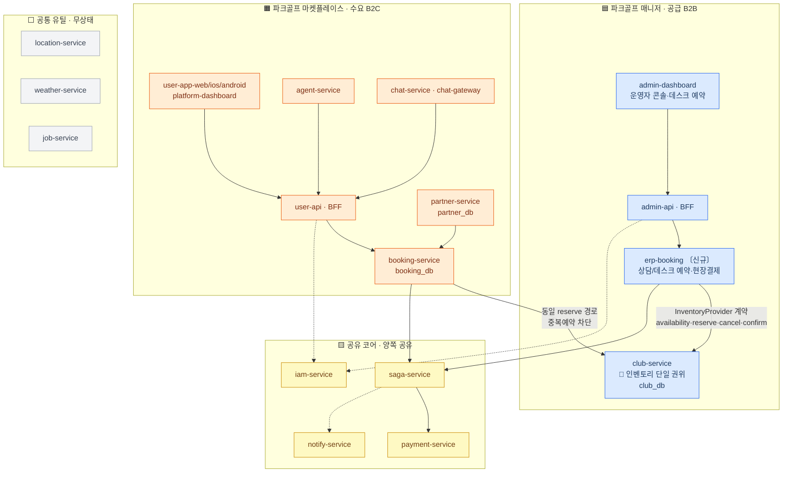

# ERP / 부킹 분리 설계

> Linear: [UNI-91](https://linear.app/uniyous/issue/UNI-91) — ERP(파크골프 매니저)/부킹(파크골프 마켓플레이스)을 **나중에 각각 독립 클라우드로 분리 배포 가능**하도록 서비스·DB 경계와 통신 계약을 확정한다. 후속 구현([UNI-92](https://linear.app/uniyous/issue/UNI-92)·[UNI-94](https://linear.app/uniyous/issue/UNI-94))의 전제.

## 구성도

**범례**
- 🟦 매니저 / 🟧 마켓플레이스 = 미래 각각 독립 클라우드(VPC 격리) 후보. 🟨 공유 코어 = 양쪽 공유. ⬜ 공통 유틸 = 무상태·각 클라우드 직접 호출.
- 실선 = 동기 request/reply, 점선 = 비동기/이벤트. **모든 서비스 간 통신은 NATS** — 크로스-DB 접근 0.
- 🔑 **인벤토리 단일 권위**: 데스크(erp-booking)·마켓(booking-service) 어느 채널이든 `club-service` 동일 `reserve` 경로 → 중복예약 구조적 차단. 분리선이 생겨도 이 불변식은 `InventoryProvider` 계약으로 유지.
- DB 파티션: 매니저측 `club_db` / 마켓측 `booking_db`·`partner_db` 별도 인스턴스 가능 구조 → 분리는 `DATABASE_URL` 교체 수준.

---

> 상세 설계(계약 명세 · DB 파티션 · 정책 루트 단독/연동 · 3티어 패키징 · 미결정 항목)는 UNI-91 본문 참조. 이 문서는 구성도부터 채우며 확장한다.
