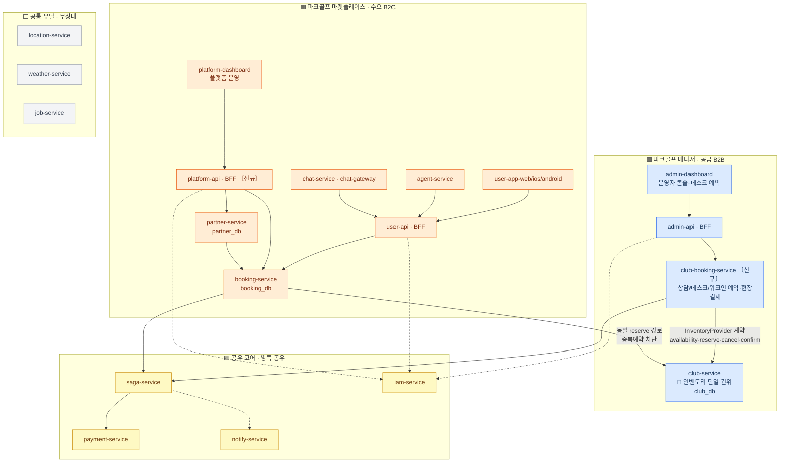
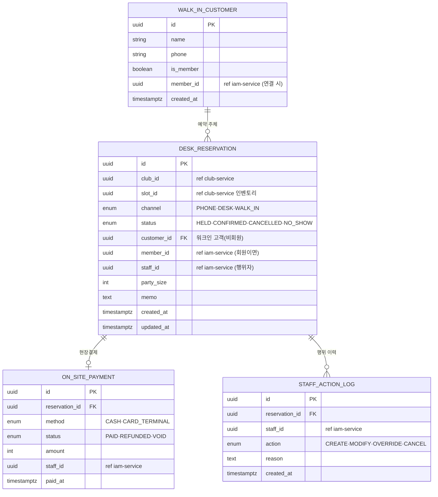
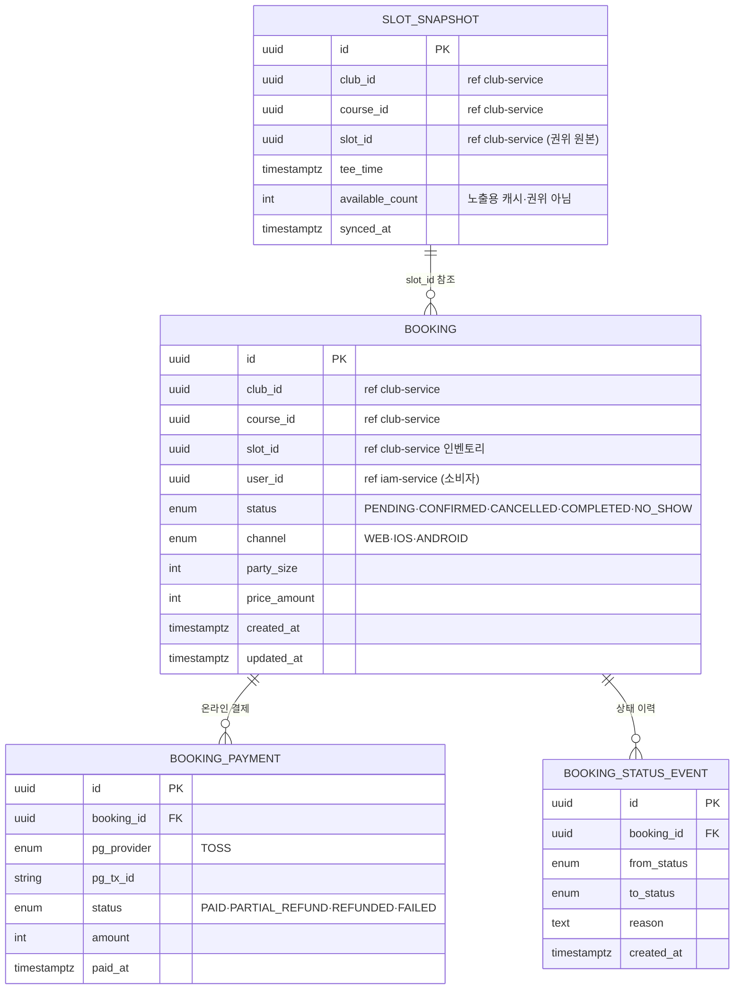
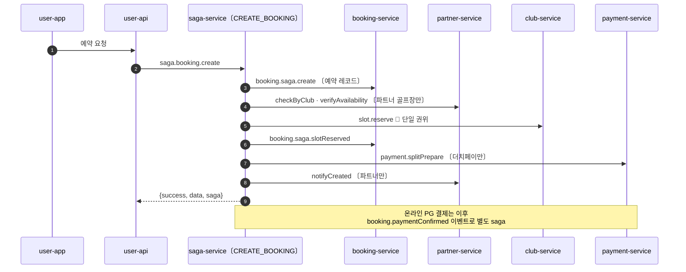
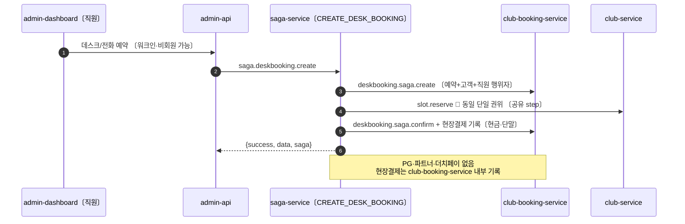
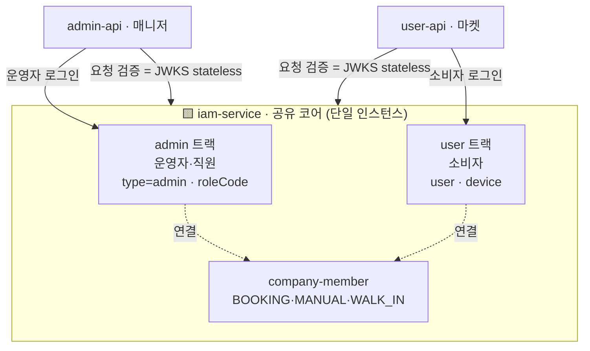

# ERP / 부킹 분리 설계

> Linear: [UNI-91](https://linear.app/uniyous/issue/UNI-91) — ERP(파크골프 매니저)/부킹(파크골프 마켓플레이스)을 **나중에 각각 독립 클라우드로 분리 배포 가능**하도록 서비스·DB 경계와 통신 계약을 확정한다. 후속 구현([UNI-92](https://linear.app/uniyous/issue/UNI-92)·[UNI-94](https://linear.app/uniyous/issue/UNI-94))의 전제.

## 구성도

**범례**
- 🟦 매니저 / 🟧 마켓플레이스 = 미래 각각 독립 클라우드(VPC 격리) 후보. 🟨 공유 코어 = 양쪽 공유. ⬜ 공통 유틸 = 무상태·각 클라우드 직접 호출.
- 실선 = 동기 request/reply, 점선 = 비동기/이벤트. **모든 서비스 간 통신은 NATS** — 크로스-DB 접근 0.
- 🔑 **인벤토리 단일 권위**: 데스크(`club-booking-service`)·마켓(`booking-service`) 어느 채널이든 `club-service` 동일 `reserve` 경로 → 중복예약 구조적 차단. 분리선이 생겨도 이 불변식은 `InventoryProvider` 계약으로 유지.
- DB 파티션: 매니저측 `club_db` / 마켓측 `booking_db`·`partner_db` 별도 인스턴스 가능 구조 → 분리는 `DATABASE_URL` 교체 수준.

---

## 데이터 모델 (ERD)

부킹 엔진 2개는 각자 DB·테이블을 가진다(크로스-DB 0, 타 서비스 데이터는 ID 참조만). 슬롯 인벤토리의 권위는 항상 `club-service` — 양쪽 모두 `slot_id`로 참조하고 물리 FK를 걸지 않는다.

### club-booking-service (매니저 측 · club_db)

운영자 데스크/전화/워크인 예약. 직원이 행위자(대리예약·오버라이드), 비회원·워크인 고객, **현장결제**(현금·카드단말).

### booking-service (마켓플레이스 측 · booking_db)

여러 골프장에 걸친 소비자 온라인 예약 + 노출용 타임슬롯 캐시. **온라인 PG**(Toss)로만 결제.

**두 엔진의 차이 요약**

| 구분 | club-booking-service (매니저) | booking-service (마켓) |
|---|---|---|
| 채널 | 전화·데스크·워크인 | 웹·앱(온라인) |
| 행위자 | 직원(대리·오버라이드) | 소비자 본인 |
| 고객 | 회원 + 비회원/워크인 | 회원(소비자) |
| 결제 | 현장결제(현금·카드단말) | 온라인 PG(Toss) |
| 범위 | 단일 운영자 | 여러 골프장 횡단 |
| 슬롯 | club-service 직접 reserve | club-service reserve + 노출 캐시 |

---

## saga 처리 — 엔진 공유 · 정의 분리

saga-service는 🟨 공유 코어. **제네릭 엔진**(`startSaga(name, payload)` → 레지스트리에서 정의 조회 → step 실행/보상)이 핵심이고, 부킹 흐름은 **이름별 정의**로 등록된다.

**결정**: 데스크/온라인은 **엔진은 단일 공유, 진입 API·정의는 분리**.

| 층 | 처리 | 근거 |
|---|---|---|
| 엔진·레지스트리·보상·step-executor | **단일 공유** | 제네릭. UNI-91 "트랜잭션 코어 공유(복제 금지)"와 일치 |
| 진입 NATS 패턴 + saga 정의 | **분리** | `saga.booking.create`/`CREATE_BOOKING`(마켓) vs `saga.deskbooking.create`/`CREATE_DESK_BOOKING`(매니저) |
| 공통 step(`slot.reserve`/`slot.release`) | **step 조각 공유** | 양 정의가 동일 RESERVE_SLOT 재사용 — 인벤토리 단일 권위 |

> **분리 이유**: 온라인은 파트너 검증·PG·더치페이·외부통보가 붙고, 데스크는 그게 전부 없고 현장결제·워크인·직원 행위자가 붙는다. 한 정의에 `condition`으로 합치면 분기 폭발 → 정의는 나누고 엔진만 공유.
>
> **현재 혼재**: `onsite` 분기가 booking-service `isOnsitePayment`에 박혀(booking-saga-step.service.ts:238·745) `CREATE_BOOKING` 하나가 양 채널 처리 중. 분리 시 이 분기를 `CREATE_DESK_BOOKING` + club-booking-service로 추출.

### 온라인 부킹 — CREATE_BOOKING (현행 · 마켓)

### 데스크 부킹 — CREATE_DESK_BOOKING (신규 · 매니저)

공통점은 `slot.reserve`(club-service 단일 권위) 하나뿐 — 나머지는 갈린다. 이 단일 공통 step이 양 채널 중복예약을 구조적으로 차단한다.

---

## 인증 / 신원 전략 — 연합(federation) 채택

**결정**: 전면 SSO가 아니라 **단일 iam-service · 두 신원 트랙 분리 · company-member로 느슨한 연합**. 운영자(매니저)와 소비자(마켓)는 서로 다른 사용자군·다른 앱이므로 "한 번 로그인으로 양쪽" SSO는 부적합하고, 신원 도메인을 섞을 위험만 크다.

**원칙**
- **두 트랙 분리 유지**: `admin`(운영자·직원, roleCode) / `user`(소비자, device). 이미 JWT `type`으로 구분 — 현행 유지.
- **연합 = company-member**: 소비자가 예약·데스크 방문 시 `CompanyMemberSource`(BOOKING/MANUAL/**WALK_IN**)로 클럽에 연결. 워크인 source가 이미 정의돼 데스크 연결까지 선반영됨 → club-booking-service가 이 경로 활용.
- **완전 분리(iam 물리 2개) 비채택**: 소비자 데스크 방문 시 신원 연결이 복잡해지고, 기존 company-member 연합 장치를 버리게 됨.

**클라우드 분리 대비 — 토큰 검증 경로**
- 현재 토큰 검증은 `auth.validateToken` **NATS 왕복(iam 경유)** → 물리 분리 시 매 요청이 클라우드 경계를 넘음(지연·결합).
- → **각 BFF에서 stateless JWT 검증**(공유 서명키/JWKS)로 전환. iam 왕복은 **로그인·갱신·폐기에만**. `slot.reserve`(InventoryProvider)와 함께 "경계 넘는 핫패스"를 제거하는 두 번째 지점.

---

## BFF 분리 — admin-api / platform-api / user-api

**결정**: 현재 `admin-api`가 매니저(admin-dashboard)와 마켓 플랫폼 운영(platform-dashboard)을 **동시에 서빙**(platform-dashboard가 `/api/admin/*` 호출)하는 혼재 상태를 **BFF 3분할**로 정리한다. BFF 경계를 클라우드 경계와 일치시켜 분리 준비.

| BFF | 소속 | 서빙 앱 | 비고 |
|---|---|---|---|
| `admin-api` | 🟦 매니저 | admin-dashboard (운영자 콘솔·데스크) | 마켓 라우트 제거 |
| `platform-api` 〔신규〕 | 🟧 마켓 | platform-dashboard (플랫폼 운영) | 현 admin-api의 마켓 운영 라우트(partners 등) 이관 |
| `user-api` | 🟧 마켓 | user-app web/ios/android (소비자) | 현행 유지 |

- 이관 대상: 현 `admin-api`의 마켓 성격 라우트(`partners`, 플랫폼 전역 관리 등) → `platform-api`. 매니저 성격(운영자·회사·정책·데스크 예약)은 `admin-api` 잔류.
- 인증: 세 BFF 모두 단일 iam 연합 사용(JWKS stateless 검증) — [인증/신원 전략](#인증--신원-전략--연합federation-채택) 참조.

## 범위 밖 / 후속 (미설계)

- **결제 · 정산 · 마감**: 매니저 현장결제(현금·카드단말) / 마켓 온라인 PG + 중앙정산·커미션 / 일·월 마감 — **현재 설계·구현 전무**. 파급이 가장 크므로 **별도 이슈로 분리**해 추후 설계·구현. 이 문서는 결제·정산 모델을 확정하지 않는다.

---

> 상세 설계(InventoryProvider 계약 명세 · 정책 루트 단독/연동 · 3티어 패키징)는 UNI-91 본문 참조. 이 문서는 구성도·ERD부터 채우며 확장한다.
