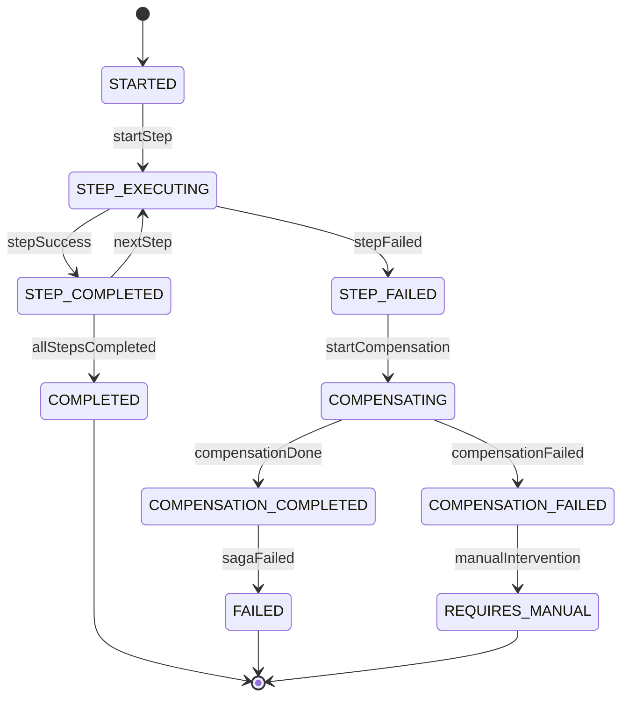

# Saga Orchestrator Service 설계

> 버전: 1.0
> 작성일: 2026-03-06
> 상태: 설계 검토 중

---

## 목차

1. [배경 및 동기](#1-배경-및-동기)
2. [현재 아키텍처 분석](#2-현재-아키텍처-분석)
3. [Saga Orchestrator 아키텍처](#3-saga-orchestrator-아키텍처)
4. [SagaExecution 상태 머신](#4-sagaexecution-상태-머신)
5. [Saga 정의: 예약 생성](#5-saga-정의-예약-생성)
6. [Saga 정의: 예약 취소/환불](#6-saga-정의-예약-취소환불)
7. [Saga 정의: 관리자 환불](#7-saga-정의-관리자-환불)
8. [Saga 정의: 결제 타임아웃](#8-saga-정의-결제-타임아웃)
9. [데이터베이스 스키마](#9-데이터베이스-스키마)
10. [서비스 구조](#10-서비스-구조)
11. [NATS 패턴 설계](#11-nats-패턴-설계)
12. [Outbox 통합 처리](#12-outbox-통합-처리)
13. [모니터링 및 관리자 대시보드](#13-모니터링-및-관리자-대시보드)
14. [마이그레이션 계획](#14-마이그레이션-계획)
15. [장애 대응 및 운영](#15-장애-대응-및-운영)

---

## 1. 배경 및 동기

### 1.1 현재 문제점

현재 시스템은 **Choreography 기반 Saga**로, booking-service 내부의 `OutboxProcessorService`와 `SagaHandlerService`가 Saga 오케스트레이션을 담당합니다.

| 문제 | 설명 |
|------|------|
| **흐름 파악 어려움** | Saga 로직이 `outbox-processor`, `saga-handler`, `booking.service` 3개 파일에 분산 |
| **누락 위험** | 관리자 환불 경로(`payments.refund`)가 Saga를 우회하여 슬롯 미복구, 정책 미검증 발생 |
| **보상 트랜잭션 불완전** | 실패 시 보상 로직이 이벤트 타입별로 개별 구현, 일관성 부족 |
| **상태 추적 한계** | `BookingHistory`로 간접 추적만 가능, "현재 어느 단계에서 멈췄는지" 정확한 파악 불가 |
| **새로운 Saga 추가 비용** | 신규 분산 트랜잭션 추가 시 여러 서비스에 handler 분산 작성 필요 |
| **결합도** | booking-service가 course/payment/notification 클라이언트를 모두 직접 주입 |

### 1.2 목표

- **중앙 집중 오케스트레이션**: 모든 Saga 흐름을 한 서비스에서 관리
- **명시적 상태 머신**: SagaExecution 테이블로 정확한 단계 추적
- **선언적 Saga 정의**: Step 배열로 Saga 흐름 선언, 보상 자동 역순 실행
- **booking-service 단순화**: Saga 오케스트레이션 로직 제거, 순수 도메인 로직만 유지
- **관리자 대시보드 연계**: Saga 진행 상태를 실시간 모니터링

---

## 2. 현재 아키텍처 분석

### 2.1 기존 Choreography 흐름 (예약 생성)

```
user-api → NATS: booking.create
  → booking-service:
      1. Booking 생성 (PENDING)
      2. Outbox: slot.reserve (PENDING)
      → outbox-processor: NATS send slot.reserve
        → course-service: 슬롯 예약
          → 성공 응답
      → outbox-processor: handleSagaSuccess()
        → saga-handler: handleSlotReserved()
          - onsite → CONFIRMED
          - card → SLOT_RESERVED (결제 대기)
```

### 2.2 기존 파일 매핑

| 파일 | 역할 | 마이그레이션 후 |
|------|------|----------------|
| `booking-service/outbox-processor.service.ts` | Outbox 폴링, NATS 발행, Saga 성공/실패 핸들링 | saga-service로 이전 |
| `booking-service/saga-handler.service.ts` | 상태 전이, 보상, 알림 발행 | saga-service로 이전 |
| `booking-service/booking.service.ts` | 예약 CRUD + Outbox 이벤트 생성 | Outbox 생성 → Saga 트리거로 변경 |

### 2.3 기존 이벤트 타입

**Request-Reply (응답 대기):**

| 이벤트 | 대상 서비스 | 용도 |
|--------|-----------|------|
| `slot.reserve` | course-service | 타임슬롯 예약 |
| `slot.release` | course-service | 타임슬롯 해제 |
| `payment.cancelByBookingId` | payment-service | 결제 취소 (Toss API) |

**Fire-and-Forget (알림용):**

| 이벤트 | 대상 서비스 | 용도 |
|--------|-----------|------|
| `booking.confirmed` | notify-service | 예약 확정 알림 |
| `booking.cancelled` | notify-service | 예약 취소 알림 |
| `booking.refundCompleted` | notify-service | 환불 완료 알림 |

---

## 3. Saga Orchestrator 아키텍처

### 3.1 전체 구조

```
┌─────────────┐     ┌─────────────┐     ┌──────────────┐
│  user-api   │     │  admin-api  │     │agent-service │
│   (BFF)     │     │   (BFF)     │     │  (AI Agent)  │
└──────┬──────┘     └──────┬──────┘     └──────┬───────┘
       │                   │                   │
       └───────────┬───────┴───────────────────┘
                   │ NATS
          ┌────────▼────────┐
          │  saga-service   │  ← Saga Orchestrator (신규)
          │                 │
          │  - Saga 정의    │
          │  - 상태 머신    │
          │  - Outbox 처리  │
          │  - 보상 트랜잭션│
          │  - 스케줄러     │
          └───────┬─────────┘
                  │ NATS (각 서비스로 Step 실행)
       ┌──────────┼──────────────┬──────────────┐
       ▼          ▼              ▼              ▼
 ┌──────────┐ ┌──────────┐ ┌──────────┐ ┌──────────┐
 │ booking  │ │ course   │ │ payment  │ │ notify   │
 │ service  │ │ service  │ │ service  │ │ service  │
 └──────────┘ └──────────┘ └──────────┘ └──────────┘
```

### 3.2 핵심 설계 원칙

1. **saga-service는 오케스트레이션만 담당** — 비즈니스 로직은 각 서비스에 위임
2. **각 Step은 NATS Request-Reply** — 성공/실패 응답을 받아 다음 단계 결정
3. **Outbox 패턴 유지** — saga-service 내부에서 Step 실행을 Outbox로 보장
4. **보상은 역순 자동 실행** — Step 정의에 `compensate` 패턴 포함
5. **booking-service는 도메인 전용** — 예약 CRUD, 상태 변경 NATS handler만 유지

---

## 4. SagaExecution 상태 머신

### 4.1 상태 정의

```
STARTED → STEP_EXECUTING → STEP_COMPLETED → ... → COMPLETED
                ↓
          STEP_FAILED → COMPENSATING → COMPENSATION_COMPLETED → FAILED
                                ↓
                        COMPENSATION_FAILED → REQUIRES_MANUAL
```

| 상태 | 설명 |
|------|------|
| `STARTED` | Saga 시작됨, 첫 번째 Step 실행 전 |
| `STEP_EXECUTING` | 현재 Step NATS 호출 중 |
| `STEP_COMPLETED` | 현재 Step 성공, 다음 Step으로 진행 |
| `COMPLETED` | 모든 Step 성공, Saga 완료 |
| `STEP_FAILED` | 현재 Step 실패, 보상 시작 |
| `COMPENSATING` | 보상 트랜잭션 실행 중 |
| `COMPENSATION_COMPLETED` | 보상 완료, Saga 실패 확정 |
| `COMPENSATION_FAILED` | 보상도 실패, 수동 개입 필요 |
| `REQUIRES_MANUAL` | 자동 복구 불가, 관리자 수동 처리 필요 |

### 4.2 상태 전이 다이어그램



---

## 5. Saga 정의: 예약 생성

### 5.1 CreateBookingSaga

```typescript
const CreateBookingSaga: SagaDefinition = {
  name: 'CREATE_BOOKING',
  steps: [
    {
      name: 'CREATE_BOOKING_RECORD',
      action: 'booking.saga.create',        // booking-service: 예약 레코드 생성 (PENDING)
      compensate: 'booking.saga.markFailed', // booking-service: FAILED 처리
      timeout: 10_000,
    },
    {
      name: 'RESERVE_SLOT',
      action: 'slot.reserve',                // course-service: 타임슬롯 예약
      compensate: 'slot.release',            // course-service: 타임슬롯 해제
      timeout: 15_000,
    },
    {
      name: 'UPDATE_BOOKING_STATUS',
      action: 'booking.saga.slotReserved',   // booking-service: 상태 → SLOT_RESERVED 또는 CONFIRMED
      compensate: null,                       // 이전 step 보상으로 충분
      timeout: 10_000,
    },
    {
      name: 'SEND_CONFIRMATION',
      action: 'notification.booking.confirmed', // notify-service: 확정 알림
      compensate: null,                          // 알림 실패는 무시
      timeout: 5_000,
      optional: true,                            // 실패해도 Saga 계속 진행
    },
  ],
};
```

### 5.2 흐름 상세

```
user-api → NATS: saga.booking.create { bookingData }
  → saga-service:
      1. SagaExecution 생성 (STARTED)
      2. Step 1: NATS send → booking.saga.create
         → booking-service: Booking 생성 (PENDING), bookingId 반환
         ← 성공: { bookingId, gameTimeSlotId, playerCount }
      3. Step 2: NATS send → slot.reserve
         → course-service: reservedCount += playerCount
         ← 성공: { reserved: true }
         ← 실패: 보상 → booking.saga.markFailed
      4. Step 3: NATS send → booking.saga.slotReserved
         → booking-service:
           - onsite → status: CONFIRMED
           - card/dutchpay → status: SLOT_RESERVED
         ← 성공: { status: 'CONFIRMED' | 'SLOT_RESERVED' }
      5. Step 4: NATS emit → notification.booking.confirmed (optional)
      6. SagaExecution → COMPLETED
```

### 5.3 카드결제 시 후속 흐름

```
결제 완료 이벤트 수신:
  payment-service → NATS emit: booking.paymentConfirmed
    → saga-service: PaymentConfirmedSaga 트리거
      Step 1: booking.saga.confirmPayment → SLOT_RESERVED → CONFIRMED
      Step 2: notification.booking.confirmed
      Step 3: iam.companyMembers.addByBooking
```

---

## 6. Saga 정의: 예약 취소/환불

### 6.1 CancelBookingSaga (사용자 취소)

```typescript
const CancelBookingSaga: SagaDefinition = {
  name: 'CANCEL_BOOKING',
  steps: [
    {
      name: 'CHECK_CANCELLATION_POLICY',
      action: 'policy.cancellation.resolve',    // booking-service: 취소 가능 여부 검증
      compensate: null,
      timeout: 5_000,
    },
    {
      name: 'CALCULATE_REFUND',
      action: 'policy.refund.resolve',           // booking-service: 환불율 계산
      compensate: null,
      timeout: 5_000,
    },
    {
      name: 'UPDATE_BOOKING_CANCELLED',
      action: 'booking.saga.cancel',             // booking-service: status → CANCELLED
      compensate: 'booking.saga.restoreStatus',  // 원래 상태로 복원
      timeout: 10_000,
    },
    {
      name: 'CANCEL_PAYMENT',
      action: 'payment.cancelByBookingId',       // payment-service: Toss API 환불
      compensate: null,                           // Toss 환불은 되돌릴 수 없음
      timeout: 30_000,
      condition: 'hasCardPayment',                // 카드결제인 경우에만 실행
    },
    {
      name: 'RELEASE_SLOT',
      action: 'slot.release',                    // course-service: 슬롯 복구
      compensate: null,
      timeout: 15_000,
    },
    {
      name: 'SEND_CANCELLATION_NOTICE',
      action: 'notification.booking.cancelled',
      compensate: null,
      timeout: 5_000,
      optional: true,
    },
  ],
};
```

### 6.2 흐름 상세

```
user-api → NATS: saga.booking.cancel { bookingId, cancelReason, userId }
  → saga-service:
      1. SagaExecution 생성 (STARTED)
      2. Step 1: policy.cancellation.resolve
         ← 취소 불가 → Saga 즉시 실패 (보상 불필요)
      3. Step 2: policy.refund.resolve
         ← { refundRate: 80, refundAmount: 32000 }
      4. Step 3: booking.saga.cancel { bookingId, cancelReason }
         → booking-service: status → CANCELLED, BookingHistory 기록
      5. Step 4: payment.cancelByBookingId { bookingId, cancelAmount: 32000 }
         → payment-service: Toss API cancel → Refund 생성
         ← 실패 시: Saga 실패, booking 상태 복원 (Step 3 보상)
      6. Step 5: slot.release { gameTimeSlotId, playerCount }
         → course-service: reservedCount -= playerCount
      7. Step 6: notification.booking.cancelled (optional)
      8. SagaExecution → COMPLETED
```

---

## 7. Saga 정의: 관리자 환불

### 7.1 AdminRefundSaga

기존에 누락되었던 관리자 환불 경로를 Saga로 정의합니다.

```typescript
const AdminRefundSaga: SagaDefinition = {
  name: 'ADMIN_REFUND',
  steps: [
    {
      name: 'CHECK_REFUND_POLICY',
      action: 'policy.refund.resolve',
      compensate: null,
      timeout: 5_000,
      // 관리자가 cancelAmount를 직접 지정하면 정책 계산값 대신 지정값 사용
    },
    {
      name: 'UPDATE_BOOKING_CANCEL_REQUESTED',
      action: 'booking.saga.adminCancel',         // status → CANCEL_REQUESTED
      compensate: 'booking.saga.restoreStatus',
      timeout: 10_000,
    },
    {
      name: 'PROCESS_REFUND',
      action: 'payment.cancelByBookingId',        // Toss API 환불
      compensate: null,
      timeout: 30_000,
    },
    {
      name: 'RELEASE_SLOT',
      action: 'slot.release',
      compensate: null,
      timeout: 15_000,
    },
    {
      name: 'FINALIZE_BOOKING',
      action: 'booking.saga.finalizeCancelled',   // status → CANCELLED
      compensate: null,
      timeout: 10_000,
    },
    {
      name: 'SEND_REFUND_NOTICE',
      action: 'notification.booking.refundCompleted',
      compensate: null,
      timeout: 5_000,
      optional: true,
    },
  ],
};
```

### 7.2 기존 경로 vs 신규 Saga 비교

| 항목 | 기존 (payments.refund) | 신규 (AdminRefundSaga) |
|------|----------------------|----------------------|
| 진입 NATS | `payments.refund` | `saga.booking.adminRefund` |
| 정책 검증 | X | O (policy.refund.resolve) |
| 예약 상태 변경 | X | O (CANCEL_REQUESTED → CANCELLED) |
| Toss 환불 | O (직접 호출) | O (Step으로 실행) |
| 슬롯 복구 | X | O (slot.release) |
| 환불 알림 | X | O (notification) |
| 상태 추적 | X | O (SagaExecution) |
| 보상 트랜잭션 | X | O (자동 역순) |

---

## 8. Saga 정의: 결제 타임아웃

### 8.1 PaymentTimeoutSaga

기존 `saga-handler.cleanupPaymentTimedOutBookings()`를 Saga로 전환합니다.

```typescript
const PaymentTimeoutSaga: SagaDefinition = {
  name: 'PAYMENT_TIMEOUT',
  steps: [
    {
      name: 'MARK_BOOKING_FAILED',
      action: 'booking.saga.paymentTimeout',    // status → FAILED
      compensate: null,
      timeout: 10_000,
    },
    {
      name: 'RELEASE_SLOT',
      action: 'slot.release',
      compensate: null,
      timeout: 15_000,
    },
    {
      name: 'NOTIFY_TIMEOUT',
      action: 'notification.booking.paymentTimeout',
      compensate: null,
      timeout: 5_000,
      optional: true,
    },
  ],
};
```

---

## 9. 데이터베이스 스키마

### 9.1 Prisma Schema (saga-service)

```prisma
generator client {
  provider = "prisma-client-js"
}

datasource db {
  provider = "postgresql"
  url      = env("DATABASE_URL")
}

// =====================================================
// Saga 실행 인스턴스
// =====================================================

model SagaExecution {
  id             Int         @id @default(autoincrement())

  // Saga 정의
  sagaType       String      @map("saga_type")       // CREATE_BOOKING, CANCEL_BOOKING, ADMIN_REFUND 등
  correlationId  String      @unique @map("correlation_id") // 외부 식별자 (예: bookingId, idempotencyKey)

  // 상태
  status         SagaStatus  @default(STARTED)
  currentStep    Int         @default(0) @map("current_step") // 현재 실행 중인 Step 인덱스
  totalSteps     Int         @map("total_steps")

  // 페이로드 (Saga 전체에서 공유하는 컨텍스트)
  payload        Json                                // 초기 입력 + 각 Step 결과 누적
  failReason     String?     @map("fail_reason")

  // 트리거 정보
  triggeredBy    String?     @map("triggered_by")    // USER, ADMIN, SYSTEM, SCHEDULER
  triggeredById  Int?        @map("triggered_by_id") // userId or adminId

  // 타임스탬프
  startedAt      DateTime    @default(now()) @map("started_at")
  completedAt    DateTime?   @map("completed_at")
  failedAt       DateTime?   @map("failed_at")

  // Relations
  steps          SagaStep[]

  @@index([sagaType, status])
  @@index([correlationId])
  @@index([status, startedAt])
  @@map("saga_executions")
}

// =====================================================
// Saga Step 실행 이력
// =====================================================

model SagaStep {
  id               Int            @id @default(autoincrement())
  sagaExecutionId  Int            @map("saga_execution_id")

  // Step 정보
  stepIndex        Int            @map("step_index")   // 0, 1, 2, ...
  stepName         String         @map("step_name")    // RESERVE_SLOT, CANCEL_PAYMENT 등
  actionPattern    String         @map("action_pattern")  // NATS 패턴 (slot.reserve 등)

  // 실행 상태
  status           StepStatus     @default(PENDING)
  retryCount       Int            @default(0) @map("retry_count")

  // 요청/응답
  requestPayload   Json?          @map("request_payload")
  responsePayload  Json?          @map("response_payload")
  errorMessage     String?        @map("error_message")

  // 보상
  isCompensation   Boolean        @default(false) @map("is_compensation")
  compensatePattern String?       @map("compensate_pattern") // 보상 NATS 패턴

  // 타임스탬프
  startedAt        DateTime?      @map("started_at")
  completedAt      DateTime?      @map("completed_at")

  // Relations
  sagaExecution    SagaExecution  @relation(fields: [sagaExecutionId], references: [id], onDelete: Cascade)

  @@index([sagaExecutionId, stepIndex])
  @@index([status])
  @@map("saga_steps")
}

// =====================================================
// Outbox (saga-service 전용)
// =====================================================

model OutboxEvent {
  id            Int          @id @default(autoincrement())
  aggregateType String       @map("aggregate_type")  // "SagaExecution"
  aggregateId   String       @map("aggregate_id")    // sagaExecutionId
  eventType     String       @map("event_type")      // NATS 패턴
  payload       Json
  status        OutboxStatus @default(PENDING)
  retryCount    Int          @default(0) @map("retry_count")
  lastError     String?      @map("last_error")
  createdAt     DateTime     @default(now()) @map("created_at")
  processedAt   DateTime?    @map("processed_at")

  @@index([status, createdAt])
  @@map("outbox_events")
}

// =====================================================
// Enums
// =====================================================

enum SagaStatus {
  STARTED
  STEP_EXECUTING
  STEP_COMPLETED
  COMPLETED
  STEP_FAILED
  COMPENSATING
  COMPENSATION_COMPLETED
  COMPENSATION_FAILED
  FAILED
  REQUIRES_MANUAL
}

enum StepStatus {
  PENDING
  EXECUTING
  COMPLETED
  FAILED
  COMPENSATED
  SKIPPED          // optional step이 실패한 경우
}

enum OutboxStatus {
  PENDING
  PROCESSING
  SENT
  FAILED
}
```

### 9.2 인프라 요구사항

- **PostgreSQL**: saga_db (독립 데이터베이스)
- **레플리카**: 최소 2개 Pod (SPOF 방지)
- **FOR UPDATE SKIP LOCKED**: Outbox 동시성 제어 (기존 패턴 유지)

---

## 10. 서비스 구조

### 10.1 디렉토리 구조

```
services/saga-service/
├── src/
│   ├── main.ts
│   ├── app.module.ts
│   │
│   ├── common/
│   │   ├── constants.ts              # NATS 타임아웃, 재시도 설정
│   │   ├── exceptions/
│   │   │   └── unified-exception.filter.ts
│   │   └── readiness.ts              # Health check
│   │
│   ├── saga/
│   │   ├── saga.module.ts
│   │   ├── saga.controller.ts        # NATS 이벤트 수신 (saga.booking.*)
│   │   │
│   │   ├── engine/
│   │   │   ├── saga-engine.service.ts        # Saga 실행 엔진 (핵심)
│   │   │   ├── saga-registry.ts              # Saga 정의 레지스트리
│   │   │   ├── step-executor.service.ts      # 개별 Step NATS 호출
│   │   │   └── compensation.service.ts       # 보상 트랜잭션 실행
│   │   │
│   │   ├── definitions/
│   │   │   ├── saga-definition.interface.ts  # SagaDefinition, StepDefinition 타입
│   │   │   ├── create-booking.saga.ts        # 예약 생성 Saga
│   │   │   ├── cancel-booking.saga.ts        # 예약 취소 Saga
│   │   │   ├── admin-refund.saga.ts          # 관리자 환불 Saga
│   │   │   ├── payment-confirmed.saga.ts     # 결제 완료 Saga
│   │   │   └── payment-timeout.saga.ts       # 결제 타임아웃 Saga
│   │   │
│   │   ├── outbox/
│   │   │   └── outbox-processor.service.ts   # Outbox 폴링 + NATS 발행
│   │   │
│   │   └── scheduler/
│   │       └── saga-scheduler.service.ts     # 타임아웃 감지, 정리 작업
│   │
│   ├── health/
│   │   ├── health.module.ts
│   │   └── health.controller.ts
│   │
│   └── prisma/
│       ├── prisma.module.ts
│       └── prisma.service.ts
│
├── prisma/
│   └── schema.prisma
├── Dockerfile
├── package.json
└── tsconfig.json
```

### 10.2 핵심 모듈: SagaEngine

```typescript
// saga-engine.service.ts (개념 코드)

interface SagaDefinition {
  name: string;
  steps: StepDefinition[];
}

interface StepDefinition {
  name: string;
  action: string;           // NATS Request 패턴
  compensate?: string;      // NATS 보상 패턴 (null이면 보상 불필요)
  timeout: number;          // ms
  optional?: boolean;       // 실패 시 skip (알림 등)
  condition?: string;       // 조건부 실행 (payload 기반)
}

@Injectable()
export class SagaEngineService {
  /**
   * Saga 시작
   * 1. SagaExecution 레코드 생성
   * 2. 첫 번째 Step의 Outbox 이벤트 생성
   * 3. Outbox 즉시 트리거
   */
  async startSaga(sagaType: string, payload: Record<string, unknown>, triggeredBy?: string): Promise<SagaExecution>;

  /**
   * Step 성공 처리
   * 1. SagaStep 상태 → COMPLETED
   * 2. 응답 payload를 SagaExecution.payload에 누적
   * 3. 다음 Step이 있으면 → Outbox 이벤트 생성
   * 4. 마지막 Step이면 → SagaExecution → COMPLETED
   */
  async handleStepSuccess(sagaExecutionId: number, stepIndex: number, response: unknown): Promise<void>;

  /**
   * Step 실패 처리
   * 1. SagaStep 상태 → FAILED
   * 2. optional Step이면 → SKIPPED 후 다음 Step 진행
   * 3. 필수 Step이면 → 보상 트랜잭션 시작
   */
  async handleStepFailure(sagaExecutionId: number, stepIndex: number, error: string): Promise<void>;

  /**
   * 보상 트랜잭션 실행
   * - 완료된 Step을 역순으로 보상 NATS 호출
   * - 모든 보상 완료 → FAILED
   * - 보상도 실패 → REQUIRES_MANUAL
   */
  async runCompensation(sagaExecutionId: number): Promise<void>;
}
```

### 10.3 NATS 클라이언트 구성

```typescript
// saga.module.ts
@Module({
  imports: [
    ClientsModule.register([
      {
        name: 'BOOKING_SERVICE',
        transport: Transport.NATS,
        options: { servers: [process.env.NATS_URL], queue: 'booking-service' },
      },
      {
        name: 'COURSE_SERVICE',
        transport: Transport.NATS,
        options: { servers: [process.env.NATS_URL], queue: 'course-service' },
      },
      {
        name: 'PAYMENT_SERVICE',
        transport: Transport.NATS,
        options: { servers: [process.env.NATS_URL], queue: 'payment-service' },
      },
      {
        name: 'NOTIFICATION_SERVICE',
        transport: Transport.NATS,
        options: { servers: [process.env.NATS_URL], queue: 'notify-service' },
      },
      {
        name: 'IAM_SERVICE',
        transport: Transport.NATS,
        options: { servers: [process.env.NATS_URL], queue: 'iam-service' },
      },
    ]),
  ],
})
```

---

## 11. NATS 패턴 설계

### 11.1 Saga 트리거 패턴 (BFF → saga-service)

기존 BFF가 직접 booking-service를 호출하던 패턴을 saga-service로 라우팅합니다.

| 기존 패턴 | 신규 패턴 | 설명 |
|-----------|----------|------|
| `booking.create` | `saga.booking.create` | 예약 생성 Saga |
| `bookings.cancel` | `saga.booking.cancel` | 예약 취소 Saga |
| `payments.refund` (deprecated) | `saga.booking.adminRefund` | 관리자 환불 Saga |
| - | `saga.booking.paymentConfirmed` | 결제 완료 후속 Saga |

### 11.2 Step 실행 패턴 (saga-service → 각 서비스)

**booking-service 신규 NATS handler:**

| 패턴 | 용도 |
|------|------|
| `booking.saga.create` | Booking 레코드 생성 (PENDING), bookingId 반환 |
| `booking.saga.slotReserved` | 상태 → SLOT_RESERVED 또는 CONFIRMED |
| `booking.saga.confirmPayment` | SLOT_RESERVED → CONFIRMED |
| `booking.saga.cancel` | 상태 → CANCELLED |
| `booking.saga.adminCancel` | 상태 → CANCEL_REQUESTED |
| `booking.saga.finalizeCancelled` | 상태 → CANCELLED (최종) |
| `booking.saga.markFailed` | 상태 → FAILED |
| `booking.saga.restoreStatus` | 이전 상태로 복원 (보상) |
| `booking.saga.paymentTimeout` | 상태 → FAILED (결제 타임아웃) |

**기존 서비스 패턴 (변경 없음):**

| 패턴 | 서비스 | 용도 |
|------|--------|------|
| `slot.reserve` | course-service | 타임슬롯 예약 |
| `slot.release` | course-service | 타임슬롯 해제 |
| `payment.cancelByBookingId` | payment-service | Toss 환불 |
| `policy.cancellation.resolve` | booking-service | 취소 정책 조회 |
| `policy.refund.resolve` | booking-service | 환불 정책 조회 |
| `iam.companyMembers.addByBooking` | iam-service | CompanyMember 등록 |

### 11.3 이벤트 수신 패턴 (외부 → saga-service)

| 패턴 | 발행자 | 용도 |
|------|--------|------|
| `booking.paymentConfirmed` | payment-service | 결제 완료 → PaymentConfirmedSaga 트리거 |
| `booking.paymentCanceled` | payment-service | 환불 완료 이벤트 → BookingHistory 기록 |

---

## 12. Outbox 통합 처리

### 12.1 기존 Outbox 패턴 유지

saga-service의 Outbox는 booking-service의 기존 구현과 동일한 패턴을 사용합니다.

```
[Saga Step 실행 요청]
  1. SagaExecution 트랜잭션 내에서 OutboxEvent 생성 (PENDING)
  2. triggerImmediate() → 즉시 폴링
  3. outbox-processor: NATS send/emit
  4. 성공 → SENT, SagaEngine.handleStepSuccess()
  5. 실패 → retry (최대 5회), SagaEngine.handleStepFailure()
```

### 12.2 Request-Reply vs Fire-and-Forget 구분

```typescript
// StepDefinition에 따라 자동 결정
const isRequestReply = !step.optional && step.compensate !== undefined;

if (isRequestReply) {
  // NATS send → 응답 대기 → 성공/실패 처리
  const response = await firstValueFrom(client.send(pattern, payload));
} else {
  // NATS emit → Fire-and-forget
  client.emit(pattern, payload);
}
```

### 12.3 설정값

| 설정 | 값 | 설명 |
|------|-----|------|
| `POLL_INTERVAL_MS` | 3,000 | 안전망 폴링 주기 |
| `BATCH_SIZE` | 10 | 한 번에 처리할 이벤트 수 |
| `MAX_RETRY_COUNT` | 5 | 최대 재시도 횟수 |
| `PROCESSING_LOCK_MS` | 30,000 | 처리 중 락 시간 |

---

## 13. 모니터링 및 관리자 대시보드

### 13.1 admin-api 엔드포인트 (신규)

| HTTP | 경로 | NATS 패턴 | 설명 |
|------|------|-----------|------|
| GET | `/admin/sagas` | `saga.list` | Saga 실행 목록 (필터: type, status, dateRange) |
| GET | `/admin/sagas/:id` | `saga.get` | Saga 상세 (steps 포함) |
| POST | `/admin/sagas/:id/retry` | `saga.retry` | 실패한 Saga 재시도 |
| POST | `/admin/sagas/:id/resolve` | `saga.resolve` | REQUIRES_MANUAL → 수동 완료 처리 |
| GET | `/admin/sagas/stats` | `saga.stats` | Saga 통계 (성공률, 평균 소요 시간) |

### 13.2 admin-dashboard 화면 (향후)

**Saga 모니터링 페이지** (`/sagas`):

| 영역 | 내용 |
|------|------|
| 통계 카드 | 활성 Saga 수, 실패율, 평균 소요 시간, REQUIRES_MANUAL 건수 |
| 목록 테이블 | sagaType, status(배지), correlationId, triggeredBy, startedAt, 소요 시간 |
| 상세 모달 | Step별 타임라인 (성공/실패/보상), 요청/응답 payload, 에러 메시지 |
| 액션 | 재시도 버튼 (FAILED), 수동 완료 버튼 (REQUIRES_MANUAL) |

---

## 14. 마이그레이션 계획

### 14.1 Phase 1: saga-service 기반 구축

1. `services/saga-service/` 프로젝트 생성 (NestJS + Prisma)
2. SagaExecution / SagaStep / OutboxEvent 스키마 + 마이그레이션
3. SagaEngine, StepExecutor, Compensation 핵심 모듈 구현
4. Outbox Processor 구현 (booking-service에서 포팅)
5. Health check, Dockerfile, K8s manifest
6. **GKE 배포** (레플리카 2)

### 14.2 Phase 2: Saga 정의 구현 + booking-service 확장

1. booking-service에 `booking.saga.*` NATS handler 추가
   - 기존 로직을 Saga Step용 handler로 분리
   - 기존 `booking.create` 등은 유지 (하위 호환)
2. CreateBookingSaga 정의 + 테스트
3. CancelBookingSaga 정의 + 테스트
4. AdminRefundSaga 정의 + 테스트

### 14.3 Phase 3: BFF 라우팅 전환

1. user-api: `booking.create` → `saga.booking.create` 전환
2. user-api: `bookings.cancel` → `saga.booking.cancel` 전환
3. admin-api: `payments.refund` → `saga.booking.adminRefund` 전환
4. payment-service: `booking.paymentConfirmed` 이벤트 → saga-service 수신 추가
5. **충분한 기간 동안 기존 패턴과 병행 운영** (feature flag)

### 14.4 Phase 4: 기존 Saga 코드 제거

1. booking-service에서 `outbox-processor.service.ts` 제거
2. booking-service에서 `saga-handler.service.ts` 제거
3. booking-service의 COURSE_SERVICE, PAYMENT_SERVICE, NOTIFICATION_SERVICE 클라이언트 주입 제거
4. booking-service Prisma에서 OutboxEvent 모델 제거
5. 기존 `outbox_events` 테이블 데이터 정리
6. 기존 NATS 패턴 (`booking.create`, `bookings.cancel`, `payments.refund`) deprecated 제거

### 14.5 마이그레이션 리스크 관리

| 리스크 | 대응 |
|--------|------|
| saga-service 장애 시 전체 Saga 중단 | 레플리카 2+, Pod disruption budget |
| 전환 중 이중 처리 | correlationId 기반 멱등성 보장 |
| 기존 진행 중 Saga | Phase 3 전환 시 기존 Outbox 완전 소진 확인 후 전환 |
| 롤백 필요 시 | feature flag로 기존 경로 즉시 복원 |

---

## 15. 장애 대응 및 운영

### 15.1 saga-service SPOF 방지

```yaml
# k8s deployment
apiVersion: apps/v1
kind: Deployment
metadata:
  name: saga-service
spec:
  replicas: 2
  strategy:
    rollingUpdate:
      maxUnavailable: 1
      maxSurge: 1
```

- **FOR UPDATE SKIP LOCKED**: 복수 Pod에서 동일 Outbox 이벤트 중복 처리 방지
- **Leader Election**: 스케줄러(타임아웃 감지)는 1개 Pod에서만 실행

### 15.2 Dead Letter Queue

```
MAX_RETRY_COUNT (5회) 초과 시:
  1. OutboxEvent → FAILED
  2. SagaExecution → REQUIRES_MANUAL
  3. 관리자 알림 발송 (notify-service)
  4. admin-dashboard에서 수동 처리
```

### 15.3 운영 커맨드

| 작업 | NATS 패턴 | 설명 |
|------|-----------|------|
| 실패 Saga 재시도 | `saga.retry { sagaExecutionId }` | FAILED → STARTED, Step 재실행 |
| 수동 완료 | `saga.resolve { sagaExecutionId, adminNote }` | REQUIRES_MANUAL → COMPLETED |
| 정리 | `saga.cleanup { retentionDays }` | 완료된 오래된 SagaExecution 삭제 |
| 통계 | `saga.stats { dateRange }` | 성공률, 평균 소요 시간, 실패 유형 |

### 15.4 로깅 표준

```
[SagaEngine] Saga ADMIN_REFUND started: executionId=42, correlationId=booking:123
[StepExecutor] Step 1/6 RESERVE_SLOT executing: executionId=42, pattern=slot.reserve
[StepExecutor] Step 1/6 RESERVE_SLOT completed in 230ms: executionId=42
[SagaEngine] Saga ADMIN_REFUND completed in 1850ms: executionId=42
```
