# 예약 워크플로우 설계 문서

> 작성일: 2026-01-12
> 버전: 1.0 (Draft)

## 목차
1. [개요](#1-개요)
2. [예약 상태 정의](#2-예약-상태-정의)
3. [비즈니스 프로세스 흐름](#3-비즈니스-프로세스-흐름)
4. [Saga Transaction 흐름](#4-saga-transaction-흐름)
5. [취소 유형 분류](#5-취소-유형-분류)
6. [환불 정책 및 프로세스](#6-환불-정책-및-프로세스)
7. [데이터 무결성 및 멱등성](#7-데이터-무결성-및-멱등성)
8. [검토 필요 사항](#8-검토-필요-사항)

---

## 1. 개요

파크골프 예약 시스템의 전체 예약 생명주기를 정의합니다.

### 1.1 주요 액터
- **고객(User)**: 예약 생성, 취소 요청
- **관리자(Admin)**: 예약 확정, 취소 처리, 환불 처리, 노쇼 처리
- **시스템(System)**: Saga 오케스트레이션, 자동 상태 전이

### 1.2 관련 서비스
- `user-api`: 고객 예약 요청 처리
- `admin-api`: 관리자 예약 관리
- `booking-service`: 예약 비즈니스 로직, Saga 오케스트레이터
- `course-service`: 타임슬롯 관리
- `notify-service`: 알림 발송

---

## 2. 예약 상태 정의

### 2.1 BookingStatus (예약 상태)

```
┌─────────────────────────────────────────────────────────────────────────┐
│                         예약 상태 (BookingStatus)                        │
├──────────────┬──────────────────────────────────────────────────────────┤
│ PENDING      │ 예약 생성됨, Saga 진행 중 (슬롯 예약 대기)                 │
│ SLOT_RESERVED│ 슬롯 예약 완료, 결제 대기                                  │
│ CONFIRMED    │ 예약 확정 (결제 완료)                                      │
│ COMPLETED    │ 이용 완료                                                  │
│ CANCELLED    │ 취소됨                                                     │
│ NO_SHOW      │ 노쇼 (미방문)                                              │
│ FAILED       │ Saga 실패 (슬롯 예약 실패 등)                              │
└──────────────┴──────────────────────────────────────────────────────────┘
```

### 2.2 PaymentStatus (결제 상태)

```
┌─────────────────────────────────────────────────────────────────────────┐
│                         결제 상태 (PaymentStatus)                        │
├────────────────────┬────────────────────────────────────────────────────┤
│ PENDING            │ 결제 대기                                           │
│ PAID               │ 결제 완료                                           │
│ FAILED             │ 결제 실패                                           │
│ REFUNDED           │ 전액 환불 완료                                       │
│ PARTIALLY_REFUNDED │ 부분 환불 완료                                       │
└────────────────────┴────────────────────────────────────────────────────┘
```

### 2.3 RefundStatus (환불 상태) - 신규 추가 필요

```
┌─────────────────────────────────────────────────────────────────────────┐
│                         환불 상태 (RefundStatus)                         │
├──────────────┬──────────────────────────────────────────────────────────┤
│ REQUESTED    │ 환불 요청됨                                               │
│ PENDING      │ 환불 처리 대기 (관리자 검토 중)                            │
│ APPROVED     │ 환불 승인됨                                               │
│ PROCESSING   │ 환불 처리 중 (PG사 연동 등)                                │
│ COMPLETED    │ 환불 완료                                                  │
│ REJECTED     │ 환불 거절                                                  │
└──────────────┴──────────────────────────────────────────────────────────┘
```

---

## 3. 비즈니스 프로세스 흐름

### 3.1 전체 예약 생명주기 다이어그램

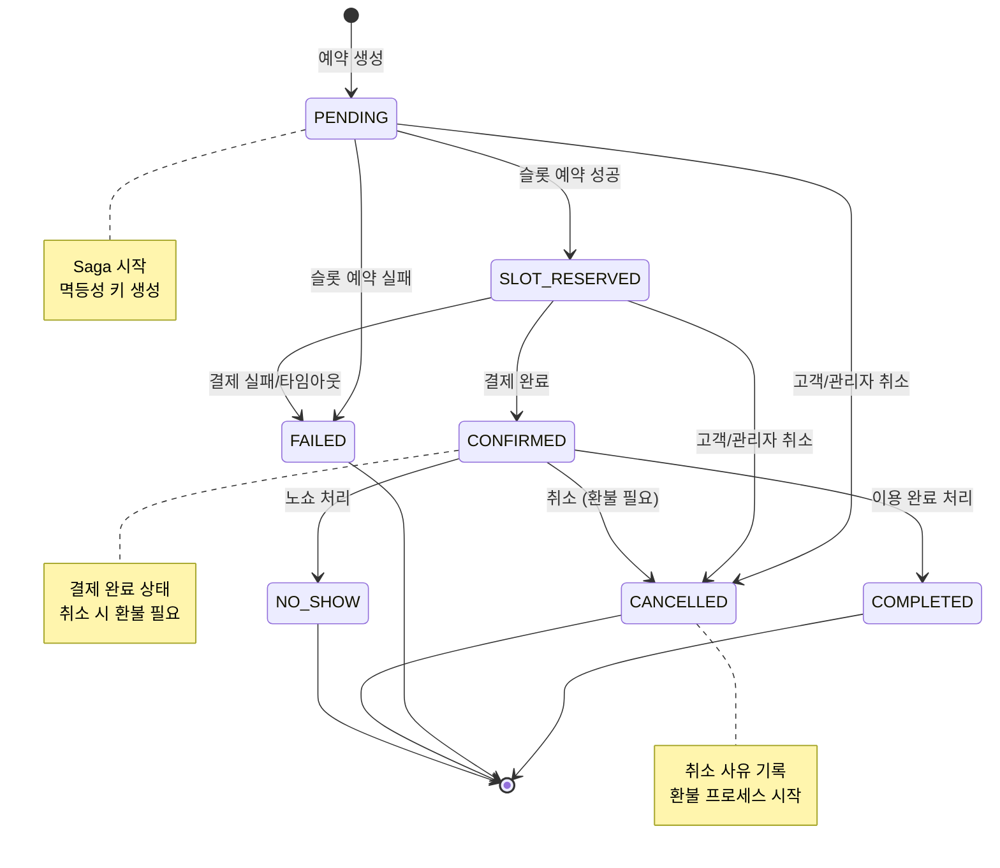

### 3.2 예약 생성 → 확정 프로세스

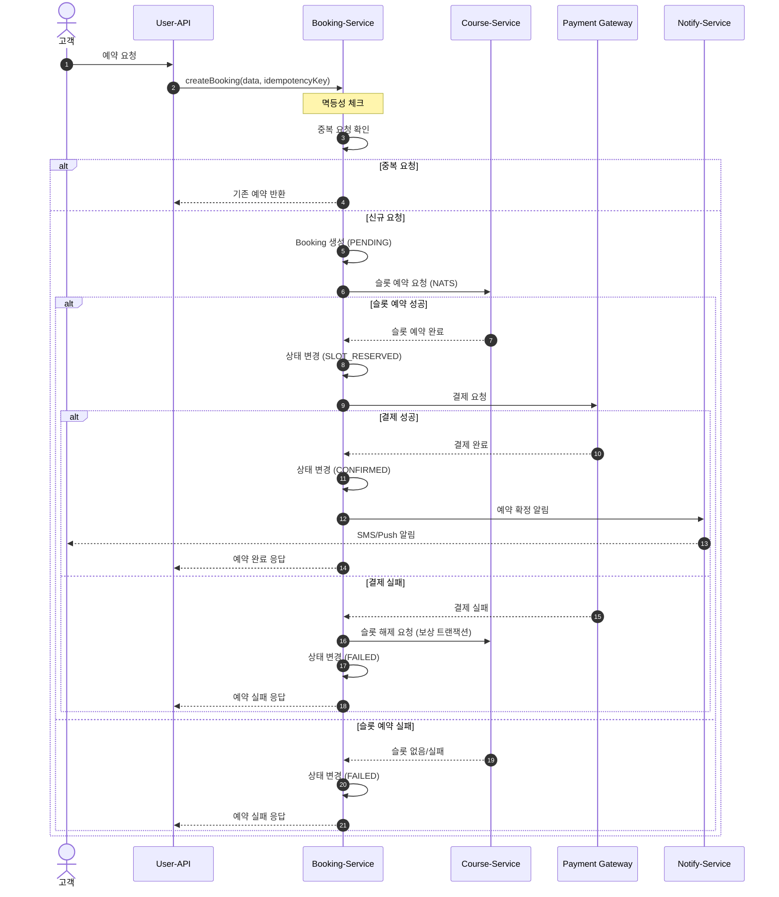

### 3.3 취소 → 환불 프로세스

```mermaid
sequenceDiagram
    autonumber
    actor Actor as 고객/관리자
    participant API as Admin-API/User-API
    participant BS as Booking-Service
    participant CS as Course-Service
    participant PG as Payment Gateway
    participant NS as Notify-Service

    Actor->>API: 취소 요청 (bookingId, reason)
    API->>BS: cancelBooking(id, reason, cancelledBy)

    Note over BS: 취소 가능 여부 확인
    BS->>BS: 상태 검증 (PENDING/SLOT_RESERVED/CONFIRMED)
    BS->>BS: 취소 정책 검증 (3일 전 등)

    alt 취소 불가
        BS-->>API: 취소 불가 응답 (사유)
    else 취소 가능
        BS->>BS: 상태 변경 (CANCELLED)
        BS->>BS: BookingHistory 기록
        BS->>CS: 슬롯 해제 요청 (NATS)
        CS-->>BS: 슬롯 해제 완료

        alt 결제 완료 상태였음 (환불 필요)
            BS->>BS: Refund 레코드 생성 (REQUESTED)
            BS->>NS: 취소 완료 + 환불 안내 알림

            Note over BS: 환불 처리 (별도 프로세스)
            rect rgb(255, 240, 240)
                BS->>PG: 환불 요청
                PG-->>BS: 환불 완료
                BS->>BS: Payment 상태 변경 (REFUNDED)
                BS->>BS: Refund 상태 변경 (COMPLETED)
                BS->>NS: 환불 완료 알림
            end
        else 결제 전 상태
            BS->>NS: 취소 완료 알림
        end

        NS-->>Actor: 알림 발송
        BS-->>API: 취소 완료 응답
    end
```

### 3.4 노쇼 처리 프로세스

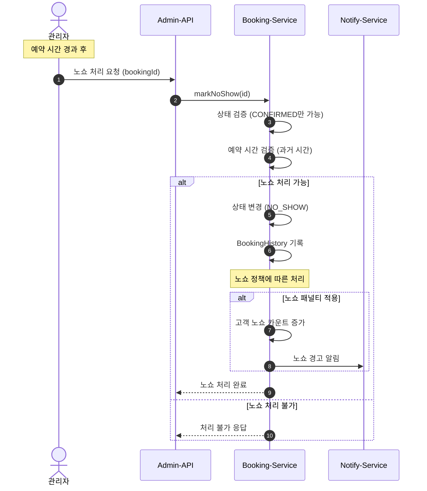

---

## 4. Saga Transaction 흐름

### 4.1 예약 생성 Saga 패턴

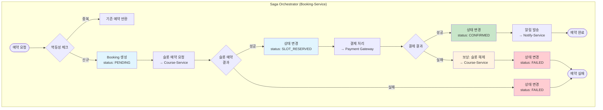

### 4.2 예약 취소 Saga 패턴

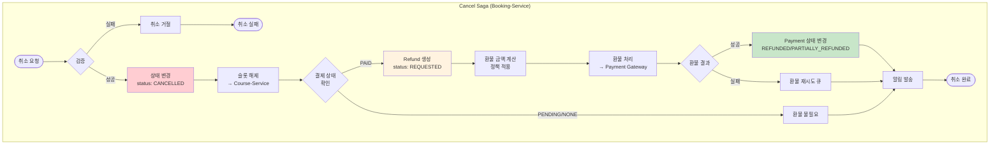

### 4.3 상태 전이 규칙 (State Machine)

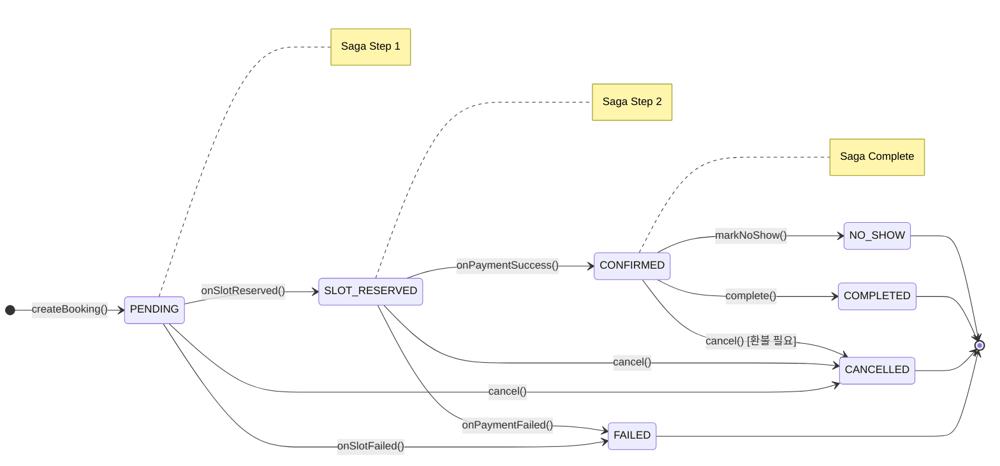

---

## 5. 취소 유형 분류

### 5.1 취소 유형 매트릭스

| 취소 유형 | 요청자 | 시점 제한 | 환불 | 사용 사례 |
|----------|--------|----------|------|----------|
| **고객 자진 취소** | 고객 | 3일 전까지 | 정책에 따름 | 일정 변경, 개인 사정 |
| **고객 당일 취소** | 고객 | 당일~3일 이내 | 부분/불가 | 급한 사정 |
| **관리자 취소** | 관리자 | 제한 없음 | 전액 | 운영상 취소 (기상악화, 시설점검) |
| **시스템 취소** | 시스템 | 자동 | 전액 | Saga 실패, 결제 타임아웃 |
| **노쇼 후 취소** | 관리자 | 이용일 경과 후 | 불가 | 환불 없이 처리 |

### 5.2 취소 유형 결정 플로우

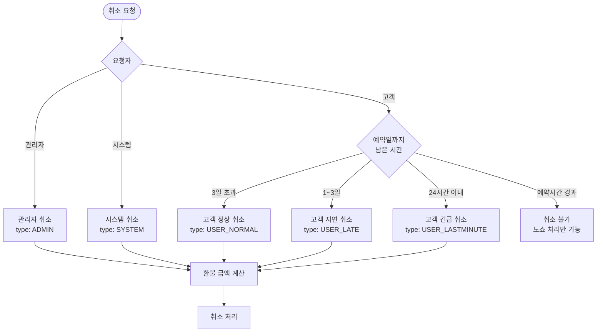

### 5.3 검토 필요: 추가 취소 유형

| 취소 유형 | 필요성 | 구현 우선순위 | 비고 |
|----------|--------|-------------|------|
| **강제 취소** | ⚠️ 검토 필요 | 낮음 | 고객 블랙리스트, 중복 예약 등 |
| **부분 취소** | ⚠️ 검토 필요 | 중간 | 인원 변경 시 일부 취소 |
| **예약 변경** | ✅ 권장 | 중간 | 취소+재예약 vs 변경 트랜잭션 |
| **자동 취소** | ✅ 권장 | 높음 | 결제 미완료 타임아웃 |

---

## 6. 환불 정책 및 프로세스

### 6.1 환불 정책 (기본)

```
┌─────────────────────────────────────────────────────────────────────────┐
│                            환불 정책 (기본)                              │
├──────────────────────┬──────────────────────────────────────────────────┤
│ 예약일 7일 전 취소   │ 100% 환불                                        │
│ 예약일 3~7일 전 취소 │ 80% 환불 (20% 수수료)                            │
│ 예약일 1~3일 전 취소 │ 50% 환불 (50% 수수료)                            │
│ 예약일 24시간 이내   │ 환불 불가 (또는 30%)                             │
│ 노쇼                 │ 환불 불가                                        │
│ 관리자/시스템 취소   │ 100% 환불                                        │
└──────────────────────┴──────────────────────────────────────────────────┘
```

### 6.2 환불 금액 계산 로직

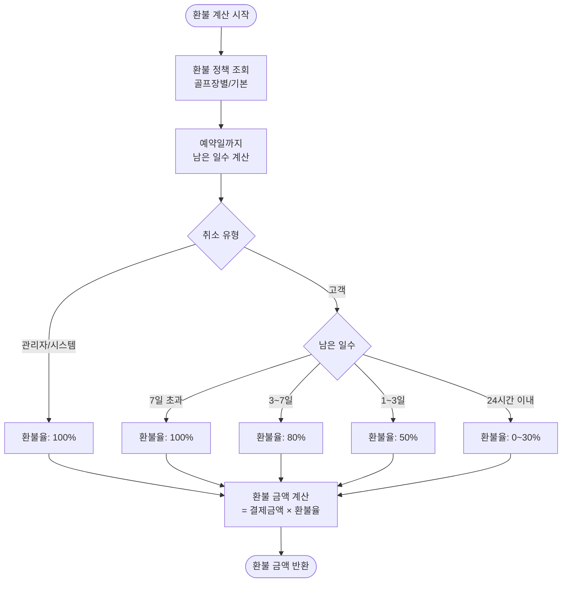

### 6.3 환불 프로세스 상세

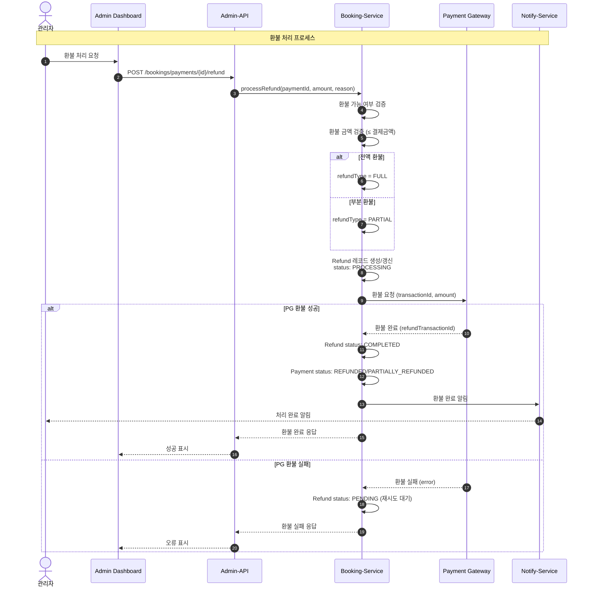

---

## 7. 데이터 무결성 및 멱등성

### 7.1 멱등성 키 (Idempotency Key) 처리

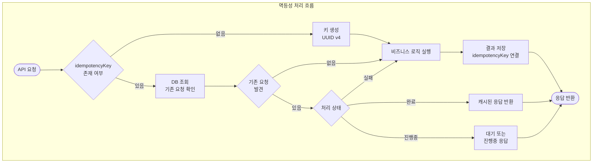

### 7.2 데이터 무결성 보장

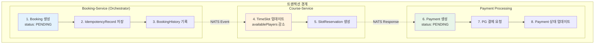

### 7.3 보상 트랜잭션 (Compensation)

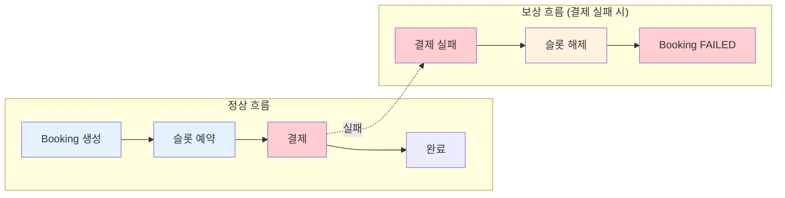

### 7.4 동시성 제어

```typescript
// 낙관적 락 (Optimistic Locking) 예시
interface Booking {
  id: number;
  version: number;  // 버전 필드
  status: BookingStatus;
  // ...
}

// 업데이트 시 버전 체크
async updateBookingStatus(id: number, newStatus: BookingStatus, expectedVersion: number) {
  const result = await prisma.booking.updateMany({
    where: {
      id,
      version: expectedVersion  // 버전 일치 확인
    },
    data: {
      status: newStatus,
      version: { increment: 1 }  // 버전 증가
    }
  });

  if (result.count === 0) {
    throw new OptimisticLockException('Booking was modified by another transaction');
  }
}
```

---

## 8. 검토 필요 사항

### 8.1 비즈니스 결정 필요

| 항목 | 현재 상태 | 검토 필요 내용 |
|------|----------|---------------|
| **취소 기한** | 3일 전 하드코딩 | 골프장별 다른 정책 필요? |
| **환불 정책** | 미구현 | 기본 정책 확정 필요 |
| **노쇼 패널티** | 미구현 | 노쇼 횟수 제한, 블랙리스트 필요? |
| **부분 취소** | 미구현 | 인원 감소 시 부분 취소 허용? |
| **강제 취소** | 미구현 | 관리자 강제 취소 권한 범위? |
| **예약 변경** | 미구현 | 취소+재예약 vs 변경 기능? |

### 8.2 기술적 결정 필요

| 항목 | 현재 상태 | 검토 필요 내용 |
|------|----------|---------------|
| **Refund 테이블** | 없음 | Payment와 별도 관리 vs 통합? |
| **환불 자동화** | 없음 | PG사 연동 범위? 수동 처리? |
| **멱등성 키 TTL** | 미정 | 키 보관 기간? (24시간? 7일?) |
| **동시성 제어** | 미구현 | 낙관적 락 vs 비관적 락? |
| **이벤트 저장** | BookingHistory | Event Sourcing 도입 필요? |

### 8.3 다음 단계

1. **Phase 1**: 비즈니스 정책 확정
   - [ ] 환불 정책 확정
   - [ ] 취소 유형 확정
   - [ ] 노쇼 정책 확정

2. **Phase 2**: 데이터 모델 설계
   - [ ] Refund 모델 설계
   - [ ] RefundPolicy 모델 설계
   - [ ] 스키마 마이그레이션

3. **Phase 3**: API 구현
   - [ ] 환불 처리 API
   - [ ] 환불 정책 관리 API
   - [ ] 취소/환불 조회 API

4. **Phase 4**: UI 구현
   - [ ] 취소/환불 관리 페이지
   - [ ] 환불 처리 모달
   - [ ] 환불 정책 설정 페이지

---

## 변경 이력

| 버전 | 날짜 | 작성자 | 변경 내용 |
|------|------|--------|----------|
| 1.0 | 2026-01-12 | - | 초안 작성 |
