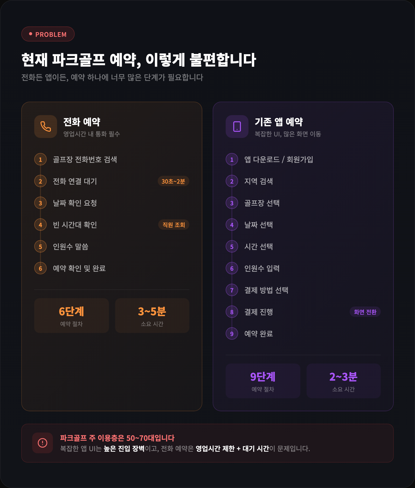
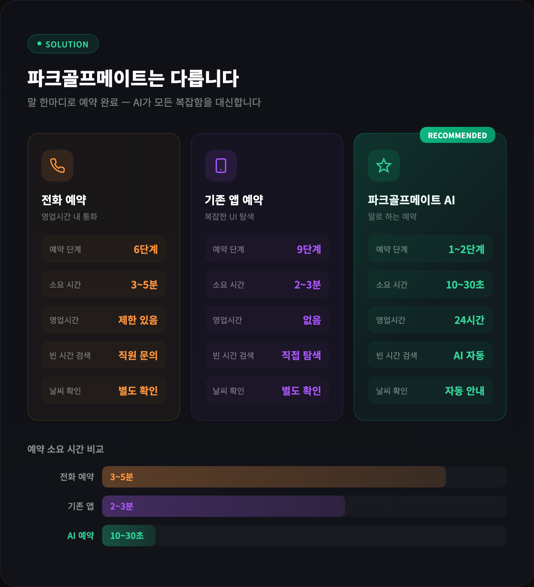
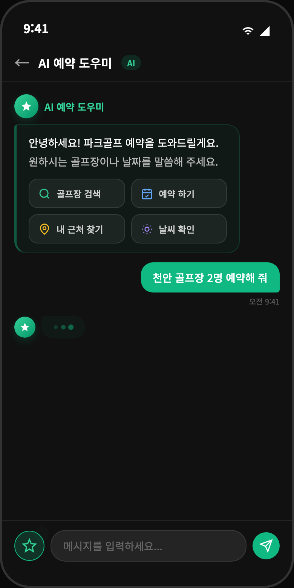
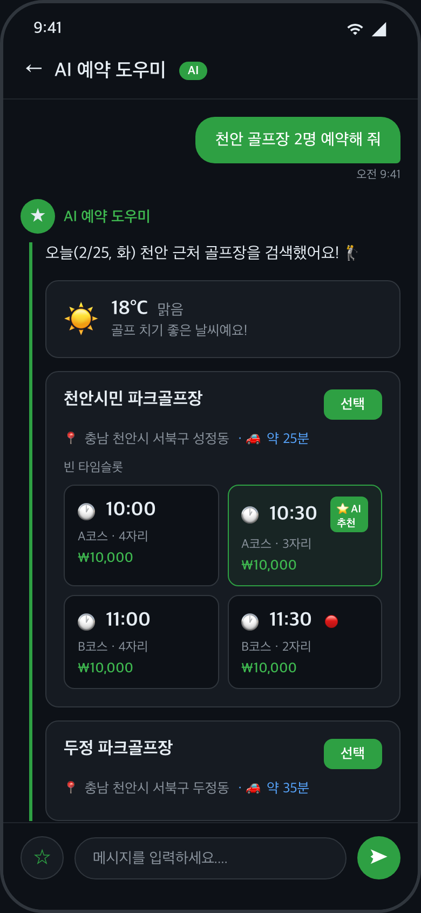
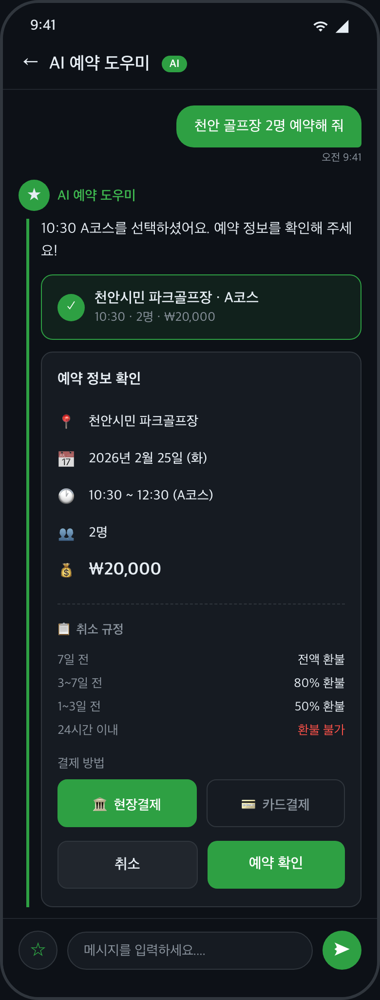
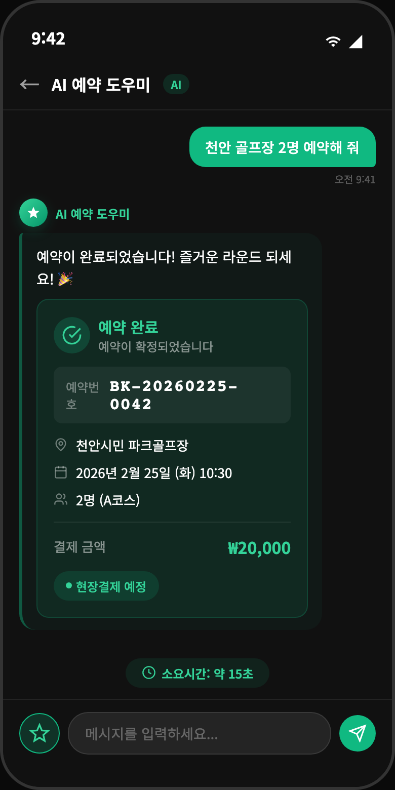
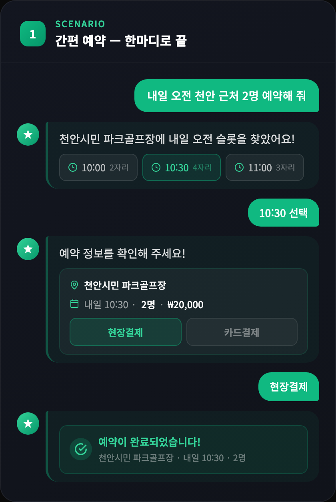
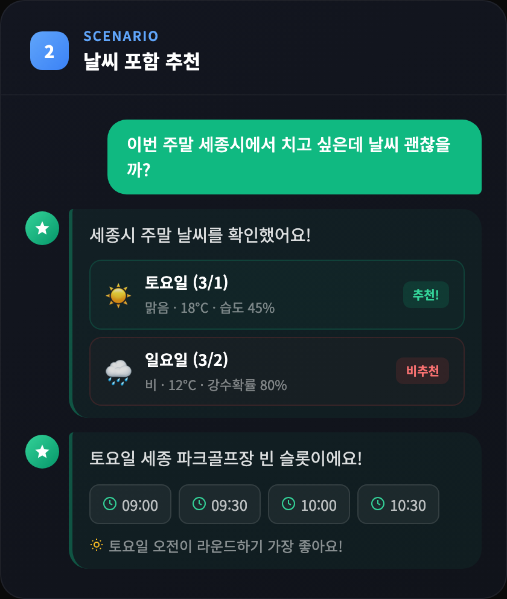
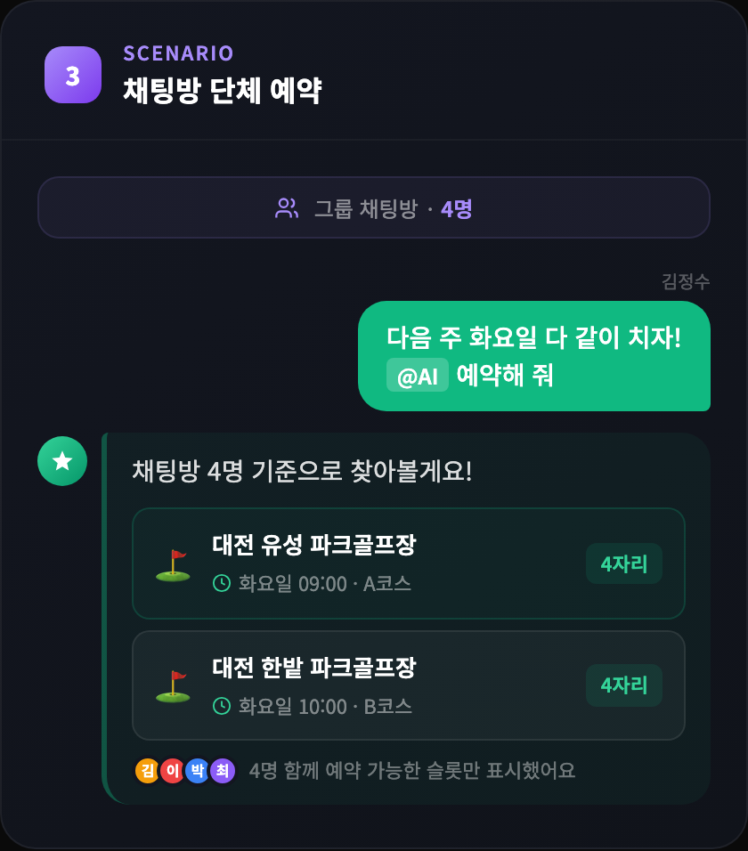

# 파크골프메이트 — AI 기반 파크골프 통합 플랫폼 제안서

> **"말 한마디로 예약 완료"** — 대한민국 최초 AI 파크골프 예약 플랫폼

---

## 1. 파크골프 시장 현황과 기회

### 1.1 시장 성장

파크골프는 대한민국에서 가장 빠르게 성장하는 생활체육 종목입니다.

| 지표 | 수치 |
|------|------|
| 전국 파크골프장 | 600개+ |
| 등록 동호인 | 100만명+ |
| 연간 성장률 | 20%+ |
| 주 이용 연령대 | 50~70대 (전체 70% 이상) |

### 1.2 현재의 문제

<p align="center">
  
</p>

---

## 2. 파크골프메이트의 해법

### 2.1 한눈에 보는 비교

<p align="center">
  
</p>

### 2.2 실제 앱 화면으로 보는 예약 과정

**STEP 1. AI에게 말하기** — 원하는 조건을 자연어로 입력

<p align="center">
  
</p>

> AI 예약 도우미가 인사하고, 사용자가 **"천안 골프장 2명 예약해 줘"** 라고 입력합니다.

**STEP 2. AI가 찾아준 결과** — 골프장 + 빈 타임슬롯 + 날씨 한눈에

<p align="center">
  
</p>

> AI가 천안 근처 골프장과 **빈 타임슬롯**, **날씨 정보**를 한 화면에 보여줍니다.
> 원하는 시간대를 터치하면 바로 다음 단계로 진행됩니다.

**STEP 3. 예약 확인** — 한눈에 보는 예약 정보 + 결제 방법 선택

<p align="center">
  
</p>

> 선택한 골프장, 날짜, 시간, 인원, 금액이 정리되어 표시됩니다.
> **현장결제** 또는 **카드결제**를 선택하고 [예약 확인]을 누르면 끝!

**STEP 4. 예약 완료!** — 예약번호와 상세 내역 즉시 확인

<p align="center">
  
</p>

> 예약번호, 골프장, 일시, 인원, 결제 금액이 확정됩니다.
> **총 소요시간: 약 15초.** 말 한마디에서 예약 완료까지.

---

### 2.3 자연어 예약 시나리오

<table>
<tr>
<td align="center">

**시나리오 1 — 간편 예약**



> 한마디로 검색부터 예약 완료까지

</td>
<td align="center">

**시나리오 2 — 날씨 포함 추천**



> 날씨를 확인하고 최적 일정 추천

</td>
</tr>
</table>

<p align="center">

**시나리오 3 — 채팅방 단체 예약**



> 그룹 채팅방에서 @AI 호출로 단체 예약

</p>

---

## 3. 플랫폼 기능 구성

### 3.1 사용자 앱

| 기능 | 설명 |
|------|------|
| **AI 예약 어시스턴트** | 자연어 대화로 검색 → 예약 → 결제 원스톱 |
| **골프장 검색** | 위치 기반 검색, 지도 연동, 실시간 빈 타임슬롯 |
| **예약 관리** | 예약 조회/수정/취소, 환불 처리 |
| **채팅** | 1:1, 그룹, 예약방 (AI 호출 가능) |
| **친구 관리** | 연락처 기반 친구 추가, 함께 예약 |
| **날씨 확인** | 골프장 위치 기반 실시간 날씨 + 3일 예보 |
| **멀티 플랫폼** | 웹, iOS, Android 동시 지원 |

### 3.2 가맹점(골프장) 관리 시스템

| 기능 | 설명 |
|------|------|
| **예약 대시보드** | 실시간 예약 현황, 일별/주별 뷰 |
| **게임 관리** | 코스별 게임 생성, 타임슬롯 자동 생성 |
| **회원 관리** | 가맹점별 회원 목록, 방문 이력 |
| **정책 설정** | 취소/환불/노쇼/운영 정책 (협회 기본값 상속) |
| **통계** | 이용률, 매출, 시간대별 분석 |

### 3.3 협회 플랫폼 관리

| 기능 | 설명 |
|------|------|
| **가맹점 관리** | 소속 골프장 등록/관리 |
| **기본 정책 설정** | 협회 차원의 표준 정책 (가맹점에 자동 상속) |
| **관리자 관리** | 역할 기반 권한 체계 (40+ 세부 권한) |
| **전체 통계** | 협회 소속 골프장 통합 데이터 |

---

## 4. 계층형 정책 시스템

협회에서 설정한 기본 정책이 가맹점에 자동으로 적용되고, 가맹점은 필요 시 자체 정책으로 재정의할 수 있습니다.

```
    ┌──────────────────────┐
    │   협회 (기본 정책)      │  ← 모든 소속 골프장에 적용
    │                      │
    │  취소: 3시간 전 무료   │
    │  환불: 시간대별 차등   │
    │  노쇼: 3회 시 제한    │
    └──────────┬───────────┘
               │ 상속
    ┌──────────┴───────────┐
    │                      │
┌───┴────────┐     ┌───────┴──────┐
│ A 골프장     │     │ B 골프장      │
│ (협회 정책   │     │ (자체 정책    │
│  그대로 적용) │     │  재정의 가능)  │
└────────────┘     └──────────────┘
```

| 정책 유형 | 설명 | 예시 |
|----------|------|------|
| **취소 정책** | 예약 취소 가능 시간 | 3시간 전 무료 취소 |
| **환불 정책** | 시간대별 환불률 | 24시간 전 100%, 12시간 전 80%, 3시간 전 50% |
| **노쇼 정책** | 무단 불참 시 패널티 | 3회: 경고, 5회: 7일 예약 제한 |
| **운영 정책** | 영업시간, 예약 규칙 | 06:00~18:00, 최소 2명, 최대 5일 전 예약 |

---

## 5. 기술 경쟁력

### 5.1 AI 기술

| 항목 | 내용 |
|------|------|
| AI 모델 | DeepSeek (자연어 이해 + 도구 호출) |
| 응답 속도 | 자연어: 2~3초 / UI 클릭: 0.1초 |
| 지원 언어 | 한국어 자연어 (날짜, 지역명, 구어체 이해) |
| 대화 맥락 | 최근 10턴 기억, 30분 세션 유지 |

**자연어 이해 예시:**

| 사용자 입력 | AI 해석 |
|------------|--------|
| "내일" | 2026-02-25 |
| "이번 주말" | 2026-02-28 (토요일) |
| "다음 주 화요일" | 2026-03-03 |
| "오전에" | 06:00~12:00 슬롯 필터 |
| "강남 근처" | 강남구 중심 반경 검색 |
| "2명" | playerCount=2 |

### 5.2 시스템 아키텍처

```
┌─────────────────────────────────────────────────────┐
│                    사용자 접점                        │
│   웹앱        iOS 앱        Android 앱               │
└──────────────────┬──────────────────────────────────┘
                   │
┌──────────────────┴──────────────────────────────────┐
│              Google Cloud (GKE Autopilot)            │
│                                                      │
│   ┌──────────┐  ┌──────────┐  ┌──────────────────┐  │
│   │ 사용자 API│  │ 관리자 API│  │ 채팅 서버(실시간) │  │
│   └─────┬────┘  └─────┬────┘  └────────┬─────────┘  │
│         │             │                │             │
│   ┌─────┴─────────────┴────────────────┴──────────┐  │
│   │            NATS 메시지 브로커                   │  │
│   └─────┬────┬────┬────┬────┬────┬────┬────┬──────┘  │
│         │    │    │    │    │    │    │    │          │
│   ┌─────┴┐┌─┴──┐┌┴───┐┌┴──┐┌┴──┐┌┴──┐┌┴──┐┌┴────┐  │
│   │인증  ││골프장││예약 ││결제││채팅││알림││날씨││AI   │  │
│   │서비스││서비스││서비스││서비스││서비스││서비스││서비스││에이전트│  │
│   └──────┘└────┘└────┘└───┘└───┘└───┘└───┘└─────┘  │
│                                                      │
│   ┌──────────────────┐  ┌─────────────────────────┐  │
│   │ PostgreSQL (DB)  │  │ 외부 API 연동           │  │
│   │ 서비스별 독립 DB  │  │ 결제: Toss Payments     │  │
│   └──────────────────┘  │ 날씨: 기상청 API        │  │
│                         │ 위치: 카카오 로컬 API    │  │
│                         └─────────────────────────┘  │
└──────────────────────────────────────────────────────┘
```

| 특징 | 설명 |
|------|------|
| **마이크로서비스** | 13개 독립 서비스, 장애 격리, 개별 확장 |
| **클라우드 네이티브** | Google Cloud GKE, 자동 스케일링 |
| **실시간 통신** | WebSocket 기반 실시간 채팅 + 알림 |
| **결제 안전성** | PCI DSS 준수 Toss Payments 연동 |
| **보안** | JWT 인증, RBAC 권한 관리, HTTPS 전 구간 암호화 |

---

## 6. 도입 효과

### 6.1 이용자 (동호인)

| Before | After |
|--------|-------|
| 전화 예약 3~5분, 영업시간만 | **AI 대화 10초, 24시간** |
| 빈 시간대 직접 탐색 | **AI가 자동 추천** |
| 날씨 별도 확인 | **예약 시 자동 안내** |
| 동반자와 각자 예약 | **채팅방에서 함께 예약** |

### 6.2 가맹점 (골프장)

| Before | After |
|--------|-------|
| 전화 응대 인력 필요 | **AI가 24시간 예약 처리** |
| 수기 예약 관리 | **실시간 대시보드** |
| 노쇼 관리 어려움 | **자동 추적 + 패널티** |
| 빈 슬롯 파악 어려움 | **실시간 현황 + 통계** |

### 6.3 협회

| Before | After |
|--------|-------|
| 소속 골프장 현황 파악 어려움 | **통합 대시보드** |
| 정책 전달/관리 비효율 | **계층형 정책 자동 적용** |
| 이용 데이터 부재 | **전체 통계 (이용률, 시간대, 지역별)** |

---

## 7. 도입 로드맵

```
Phase 1 (1개월)              Phase 2 (2개월)              Phase 3 (지속)
┌────────────────┐          ┌────────────────┐          ┌────────────────┐
│ 파일럿 운영      │          │ 정식 오픈        │          │ 확장             │
│                │          │                │          │                │
│ · 시범 골프장    │   ──→   │ · 협회 소속      │   ──→   │ · 전국 확대       │
│   3~5개소       │          │   골프장 확대    │          │ · 멤버십 시스템   │
│ · 피드백 수집    │          │ · 마케팅 시작    │          │ · 대회 관리 연동  │
│ · UI/UX 개선    │          │ · 데이터 분석    │          │ · 부가 서비스     │
└────────────────┘          └────────────────┘          └────────────────┘
```

### Phase 1: 파일럿 운영

- 협회 추천 골프장 3~5개소 시범 운영
- 관리자 교육 및 데이터 입력 지원
- 이용자 피드백 기반 AI 정확도 개선

### Phase 2: 정식 오픈

- 협회 소속 골프장 순차 등록
- 협회 차원 기본 정책 설정
- 공식 앱 출시 (iOS + Android + 웹)

### Phase 3: 확장

- 전국 골프장 확대
- 멤버십 등급 시스템 (우선 예약, 할인)
- 대회/이벤트 관리 기능
- 라운드 기록 및 통계

---

## 8. 요약

```
┌──────────────────────────────────────────────────┐
│                                                  │
│   " 천안 골프장 2명 예약해 줘 "                     │
│                                                  │
│         ↓  AI가 10초 만에 처리                     │
│                                                  │
│   · 주변 골프장 + 빈 타임슬롯 한눈에               │
│   · 날씨 정보 함께 제공                            │
│   · 1~2번 터치로 예약 완료                         │
│   · 채팅방에서 친구들과 함께                        │
│                                                  │
│   ─────────────────────────────────────────────  │
│                                                  │
│   파크골프메이트는                                  │
│   대한민국 100만 파크골프 동호인을 위한              │
│   가장 쉬운 예약 플랫폼입니다.                      │
│                                                  │
└──────────────────────────────────────────────────┘
```

---

**파크골프메이트** | AI 기반 파크골프 통합 플랫폼

**Last Updated**: 2026-02-24
