# 파크골프메이트 — AI 기반 파크골프 통합 플랫폼 제안서

> **"말 한마디로 예약 완료"** — 대한민국 최초 AI 파크골프 예약 플랫폼

---

## 1. 파크골프 시장 현황과 기회

### 1.1 시장 성장

  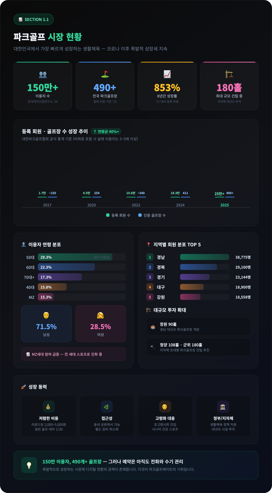

### 1.2 현재의 문제

  

---

## 2. 파크골프메이트의 해법

### 2.1 한눈에 보는 비교

  

### 2.2 실제 앱 화면으로 보는 예약 과정

**STEP 1. AI에게 말하기** — 원하는 조건을 자연어로 입력

  

> AI 예약 도우미가 인사하고, 사용자가 **"천안 골프장 2명 예약해 줘"** 라고 입력합니다.

**STEP 2. AI가 찾아준 결과** — 골프장 + 빈 타임슬롯 + 날씨 한눈에

  

> AI가 천안 근처 골프장과 **빈 타임슬롯**, **날씨 정보**를 한 화면에 보여줍니다.
> 원하는 시간대를 터치하면 바로 다음 단계로 진행됩니다.

**STEP 3. 예약 확인** — 한눈에 보는 예약 정보 + 결제 방법 선택

  

> 선택한 골프장, 날짜, 시간, 인원, 금액이 정리되어 표시됩니다.
> **현장결제** 또는 **카드결제**를 선택하고 [예약 확인]을 누르면 끝!

**STEP 4. 예약 완료!** — 예약번호와 상세 내역 즉시 확인

  

> 예약번호, 골프장, 일시, 인원, 결제 금액이 확정됩니다.
> **총 소요시간: 약 15초.** 말 한마디에서 예약 완료까지.

---

### 2.3 자연어 예약 시나리오

<table>
<tr>
<td align="center">

**시나리오 1 — 간편 예약**

> 한마디로 검색부터 예약 완료까지

</td>
<td align="center">

**시나리오 2 — 날씨 포함 추천**

> 날씨를 확인하고 최적 일정 추천

</td>
</tr>
</table>

**시나리오 3 — 채팅방 단체 예약**

> 그룹 채팅방에서 @AI 호출로 단체 예약

---

## 3. 플랫폼 기능 구성

### 3.1 사용자 앱

  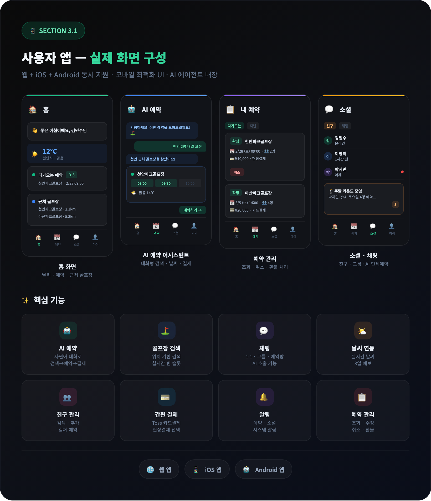

### 3.2 가맹점(골프장) 관리 시스템

  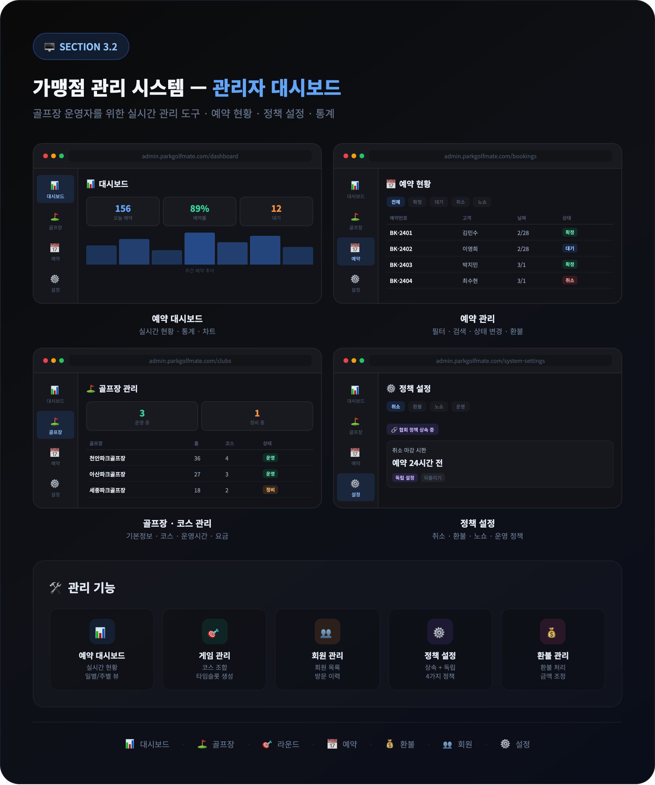

### 3.3 협회 플랫폼 관리

  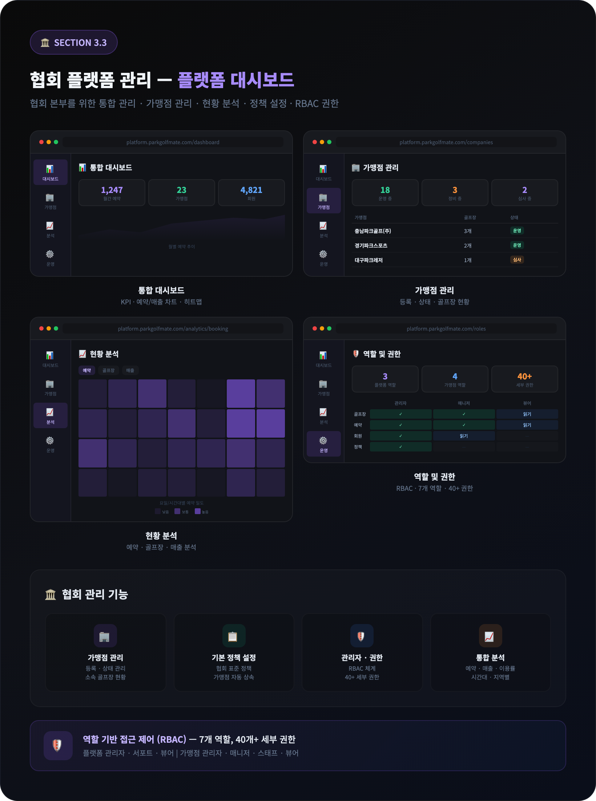

---

## 4. 계층형 정책 시스템

협회에서 설정한 기본 정책이 가맹점에 자동으로 적용되고, 가맹점은 필요 시 자체 정책으로 재정의할 수 있습니다.

### 4.1 3단계 계층 구조와 자동 상속

  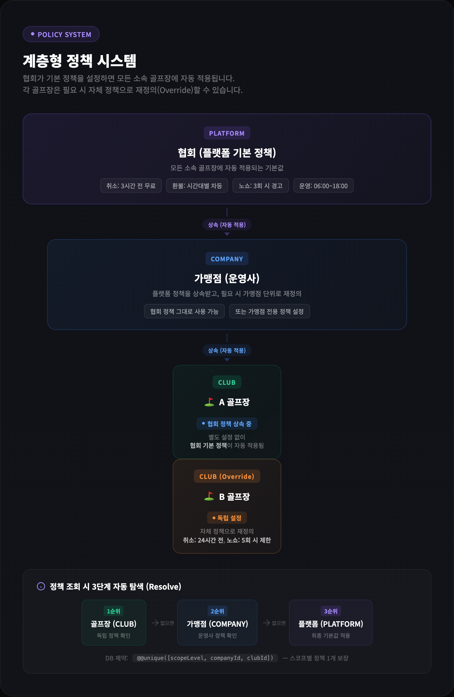

> **PLATFORM**(협회) → **COMPANY**(가맹점) → **CLUB**(골프장) 순으로 정책이 상속됩니다.
> 골프장이 별도 설정하지 않으면 상위 정책이 자동 적용되고, 독립 설정 시 자체 정책으로 재정의됩니다.

### 4.2 4가지 정책 유형과 관리 UI

  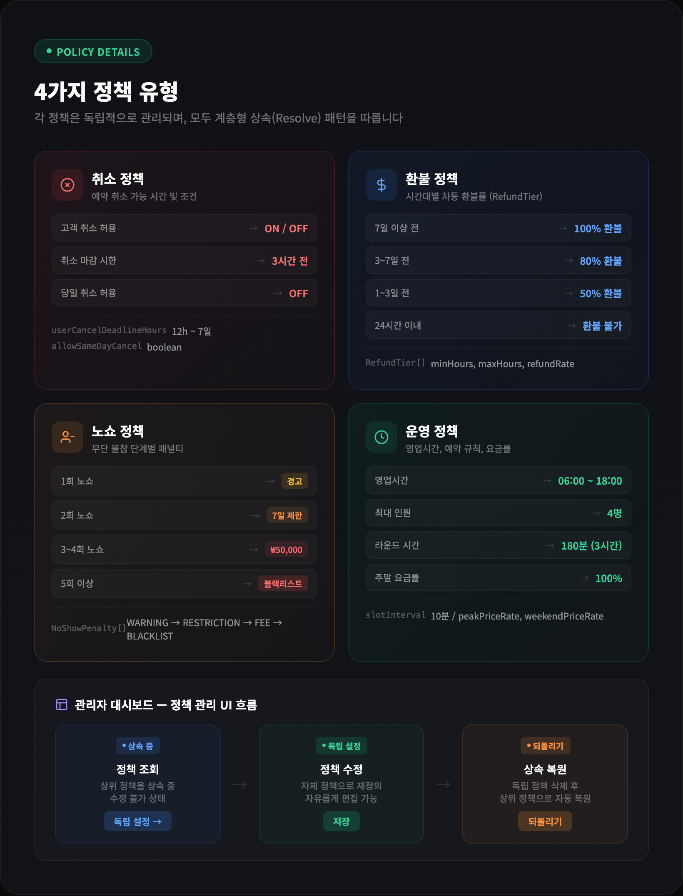

> **취소**(마감 시한), **환불**(시간대별 차등률), **노쇼**(단계별 패널티), **운영**(영업시간·요금률) — 각 정책은 독립적으로 관리되며, 관리자 대시보드에서 **"독립 설정"** / **"되돌리기"** 버튼으로 상속을 제어합니다.

---

## 5. 기술 경쟁력

### 5.1 AI 기술

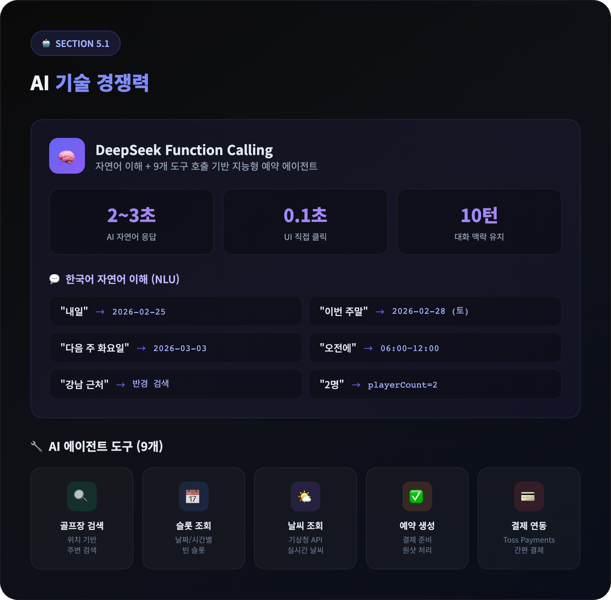

### 5.2 시스템 아키텍처

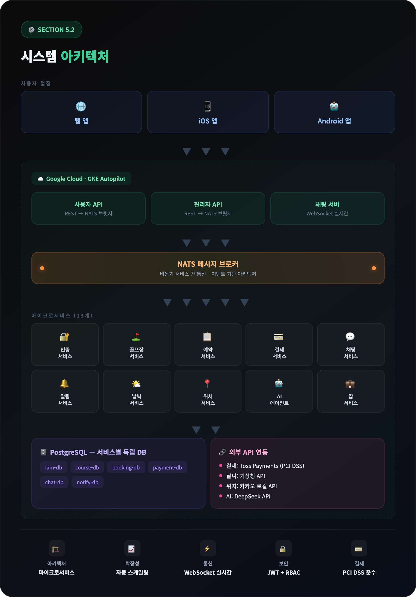

---

## 6. 도입 효과

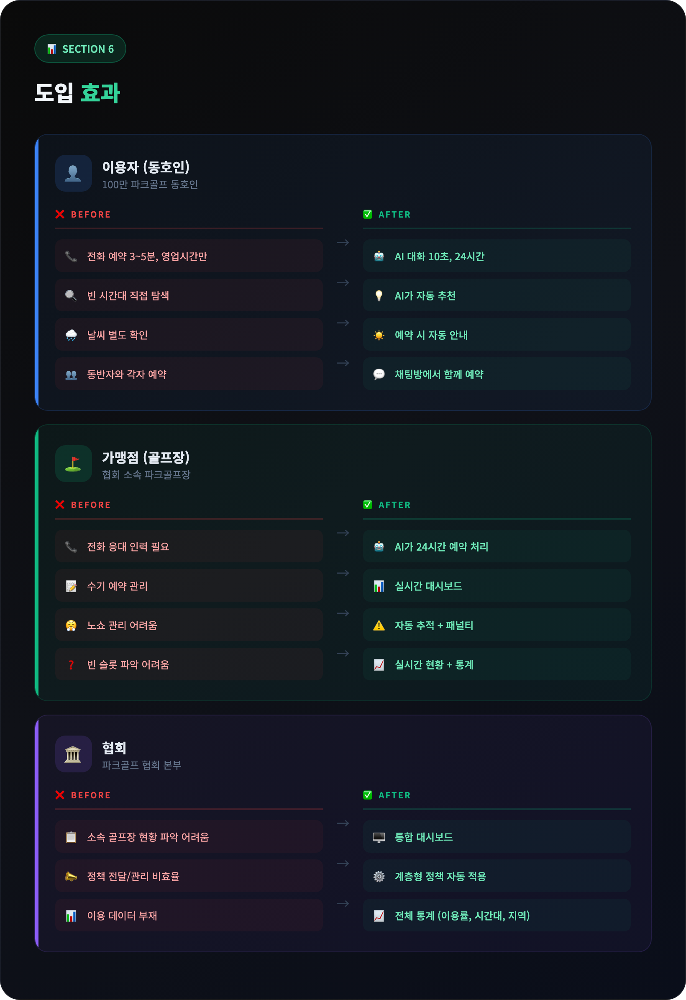

---

## 7. 도입 로드맵

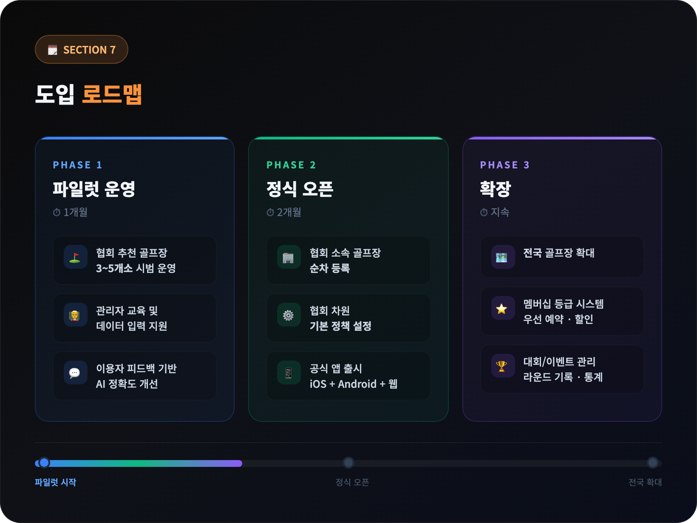

---

## 8. 요약

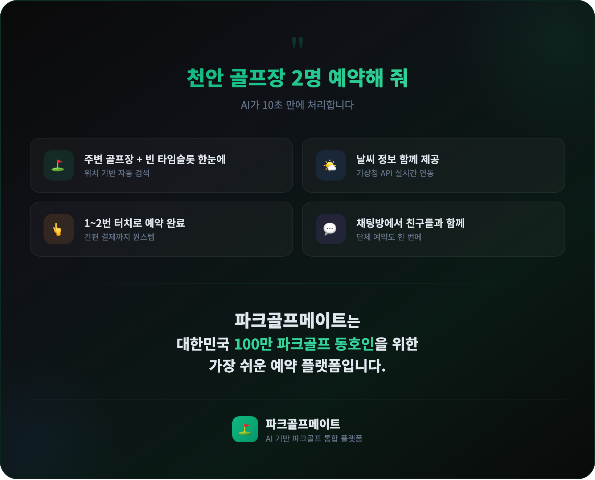

---

**파크골프메이트** | AI 기반 파크골프 통합 플랫폼

**Last Updated**: 2026-02-24
