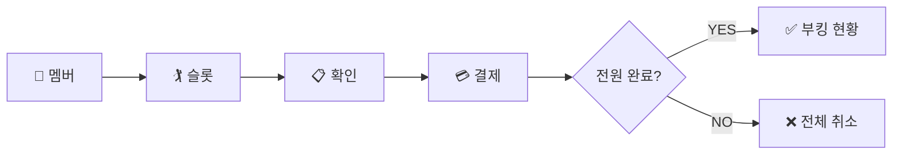
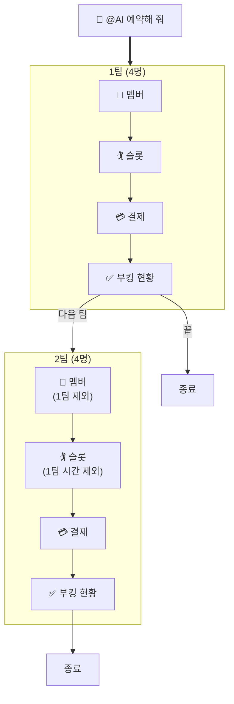

# AI 부킹 워크플로우

> 채팅 대화 기반 AI 예약 — 팀(최대 4명) 단위 처리
> 작성일: 2026-03-21 / 수정일: 2026-03-30

---

## 1. 핵심 원칙

- 자연어 한마디로 시작, 카드로 진행
- **팀(최대 4명) 단위**로 예약+결제 처리 (All or Nothing)
- 더치페이: 전원 결제 → 확정 / 1명이라도 미결제 → 전체 취소
- 이미 예약된 게임 시간은 **자동 제외**

---

## 2. 역할 분리

```
agent-service ─── "시작해!" ──→ saga-service ─── "처리 중..." ──→ 결과
     ↑                              │
     └── 카드 표시 ←────────────────┘
```

| 주체 | 역할 | 관리하는 것 |
|------|------|-----------|
| **agent-service** | 시작만 요청 + 결과를 카드로 표시 | 팀 순서, 멤버, 슬롯 제외 |
| **saga-service** | 예약+결제 라이프사이클 관리 | 시작 → 종료 (성공/실패) |
| **payment-service** | 개별 결제 추적 | BookingParticipant, PaymentSplit |
| **booking-service** | 전원 결제 여부 판단 | allPaid 체크 |

### 더치페이 시작→종료 (saga-service가 관리)

```
[시작] agent → saga.booking.create
         → saga: CREATE_BOOKING Saga → SLOT_RESERVED
         → agent: splitPrepare → 4명 결제 링크

[진행] payment-service가 개별 결제 추적
         → 1명 결제 → BookingParticipant.status = PAID
         → booking-service: allPaid 체크

[종료 - 성공] 전원 결제 완료
         → payment-service → booking.paymentConfirmed 이벤트
         → saga: PAYMENT_CONFIRMED Saga → CONFIRMED

[종료 - 실패] 10분 초과
         → saga-scheduler: PAYMENT_TIMEOUT Saga
         → FAILED + 기결제자 환불 + 슬롯 해제
```

> agent-service는 종료 결과만 받아서 카드로 보여준다.

---

## 3. 팀 단위 처리 흐름

모든 예약은 **1팀(최대 4명)** 단위로 동일한 흐름을 따른다.



---

## 4. 결제 방법별 Saga

| 결제 | Saga 흐름 | 종료 조건 |
|------|----------|----------|
| **현장** | CREATE_BOOKING → 즉시 CONFIRMED | Saga 1개로 완결 |
| **카드** | CREATE_BOOKING → SLOT_RESERVED → PAYMENT_CONFIRMED | 1명 결제 완료 |
| **더치페이** | CREATE_BOOKING → SLOT_RESERVED → 개별 결제 → PAYMENT_CONFIRMED | 전원 결제 (All or Nothing) |

| 타임아웃 | 값 |
|---------|---|
| 결제 위젯 | **9분** (프론트엔드) |
| SLOT_RESERVED | **10분** (saga-scheduler → PAYMENT_TIMEOUT) |

---

## 5. TASK_PREVIEW + LLM 처리 흐름

```
chat() 요청
│
├─ extractContextPreview() [ASYNC, LLM 전 실행]
│  ├─ 예약 의도 감지 (키워드 매칭)
│  ├─ 인원/날짜/위치 추출 (정규식)
│  ├─ 위치 미추출 + GPS 있음 → resolveRegionName() → 캐싱
│  └─ TASK_PREVIEW 데이터 반환
│
├─ processWithLLM() [ASYNC]
│  ├─ regionName 캐시 히트 → resolveRegionName() SKIP
│  ├─ DeepSeek LLM 호출
│  └─ Tool 실행 (search_clubs_with_slots 등)
│
└─ 응답: TASK_PREVIEW + LLM 결과 카드 병합
```

### 5.1 AI 응답 규칙

- 텍스트 응답은 **1~2문장**으로 간결하게
- 상세 정보는 카드 UI가 표시 → 텍스트로 중복 설명하지 않음

### 5.2 개인 예약 예시

```
사용자: "내일 천안 2명 예약해 줘"

[TASK_PREVIEW]   📍 천안 👥 2명 📅 내일
[SHOW_CLUBS]     ☀️ 18°C · 천안시민 PG [10:00] [10:30⭐]
[CONFIRM]        10:30 · 2명 · ₩20,000 [현장] [카드] [더치페이]
[결제]
[BOOKING_STATUS] ✅ 10:30 · 2명 · ₩20,000
```

```
사용자: "내 근처 골프장 예약해 줘" (GPS 전송됨)

[TASK_PREVIEW]   📍 천안시 서북구 📅 오늘    ← GPS → 지역명 변환
[SHOW_CLUBS]     ☀️ 20°C · 유관순 PG [09:00] [09:30]
...
```

---

## 6. 그룹 예약 (다팀)

### 6.1 흐름

```
8명 → 2팀 (4+4), 순차 처리
1팀: 멤버 → 슬롯 → 결제 → 부킹 현황 → [다음 팀] or [끝]
2팀: 멤버(1팀 제외) → 슬롯(1팀 시간 제외) → 결제 → 부킹 현황 → [끝]
```



### 6.2 중복 시간 제외

```
1팀: 09:00 예약 완료
2팀 슬롯: [09:00 ✕] [09:10] [10:00]  ← 09:00 제외
```

### 6.3 더치페이 (1팀 4명)

```
[시작] CREATE_BOOKING Saga → SLOT_RESERVED
       splitPrepare → 4명 결제 링크 (9분)

[진행] SETTLEMENT_STATUS 카드
       ✅ A ₩15,000  ⏳ B ₩15,000  ⏳ C ₩15,000  ⏳ D ₩15,000

[종료 - 성공] 전원 결제 → PAYMENT_CONFIRMED → CONFIRMED
       → BOOKING_STATUS 카드 [다음 팀] [끝]

[종료 - 실패] 10분 초과 → PAYMENT_TIMEOUT → FAILED
       → BOOKING_EXPIRED 카드 (기결제자 자동 환불)
```

---

## 7. UI 카드

> `min-width: 280px`, `max-width: 320px`
> 대화창에 연속 표시 — **한눈에 읽히는 최소 정보만**

| 카드 | 용도 | 표시 |
|------|------|------|
| TASK_PREVIEW | 컨텍스트 확인 | `📍 천안 👥 2명 📅 내일` |
| SHOW_CLUBS | 검색 결과 | 날씨 + 골프장 + 슬롯 칩 |
| CONFIRM_BOOKING | 예약 확인 | 정보 + [현장] [카드] [더치페이] + [예약하기] |
| SETTLEMENT_STATUS | 더치페이 진행 | `✅ A ₩15,000` / `⏳ B ₩15,000` |
| TEAM_COMPLETE | 팀 부킹 완료 | `✅ 1팀 09:00 A코스` + [다음 팀] [끝] |
| BOOKING_FAILED | 예약 실패 | `❌ 마감` + [다른 시간] |
| BOOKING_EXPIRED | 결제 타임아웃 | `⏰ 시간 초과 · 자동 취소` |

### 7.1 TASK_PREVIEW 위치 표시 로직

```
사용자 메시지에서 지역명 추출 가능?
├─ YES → "천안", "아산" 등 메시지 내 지역명 표시
└─ NO
   ├─ GPS 좌표 있음?
   │  ├─ regionName 캐시 있음 → 캐시된 지역명 표시 (API 호출 없음)
   │  └─ 캐시 없음 → location.coord2region 호출 → "천안시 서북구" 표시 + 캐싱
   └─ GPS도 없음 → 위치 태그 미표시
```

- `resolveRegionName()` 결과를 `context.slots.regionName`에 캐싱
- 이후 `processWithLLM()`에서 동일 호출 시 캐시 히트 → **중복 API 호출 방지**

---

## 8. 시나리오: 8명 더치페이 그룹

```
김정수: "@AI 화요일 다 같이 치자!"

AI: 📅 화요일 👥 8명

=== 1팀 ===

AI: 멤버 선택
    ☐ 김정수 ☐ 이영희 ☐ 박지현 ☐ 최수현
    ☐ 한민수 ☐ 윤서연 ☐ 정다은 ☐ 오준혁

김정수: (4명 선택)

AI: ☀️ 15°C · 대전유성 PG
    [09:00] [09:10] [10:00]

김정수: (09:00 → 더치페이 → 예약하기)

AI: ✅ 김정수 ₩15,000
    ⏳ 이영희 ₩15,000
    ⏳ 박지현 ₩15,000
    ⏳ 최수현 ₩15,000

(전원 결제)

AI: ✅ 1팀 09:00 A코스
    A·B·C·D · ₩60,000
    [다음 팀] [끝]

=== 2팀 ===

김정수: [다음 팀]

AI: 멤버 선택
    ☐ 한민수 ☐ 윤서연 ☐ 정다은 ☐ 오준혁

AI: 대전유성 PG [09:10] [10:00]
    (09:00 제외)

김정수: (09:10 → 더치페이)

(전원 결제)

AI: ✅ 2팀 09:10 B코스
    E·F·G·H · ₩60,000
    [끝]

김정수: [끝]
```

---

## 9. 상태

```
예약: PENDING → SLOT_RESERVED → CONFIRMED (or FAILED)
대화: IDLE → ANALYZING → COLLECTING → SELECTING_MEMBERS
       → CONFIRMING → BOOKING → SETTLING → TEAM_COMPLETE → COMPLETED
```

---

## 10. 테스트 체크리스트

### Phase 1: 검색
- [ ] 자연어 위치/날짜/인원 추출
- [ ] TASK_PREVIEW + SHOW_CLUBS 카드

### Phase 2: 현장결제
- [ ] 즉시 CONFIRMED → TEAM_COMPLETE 카드

### Phase 3: 카드결제
- [ ] SLOT_RESERVED → 결제 위젯 (9분) → CONFIRMED
- [ ] 타임아웃 → FAILED → BOOKING_EXPIRED

### Phase 4: 더치페이
- [ ] splitPrepare → 개별 결제 링크
- [ ] SETTLEMENT_STATUS 카드 (팀별)
- [ ] 전원 결제 → TEAM_COMPLETE (결제 내역)
- [ ] 미결제 → 전체 취소 + 기결제자 환불

### Phase 5: 그룹 (다팀)
- [ ] 4명 1팀 멤버 선택
- [ ] 1팀 완료 → [다음 팀] or [끝]
- [ ] 2팀 슬롯에서 1팀 시간 제외
- [ ] [끝] → 종료

### Phase 6: 엣지 케이스
- [ ] 대화 중간 취소
- [ ] 동시 예약 충돌
