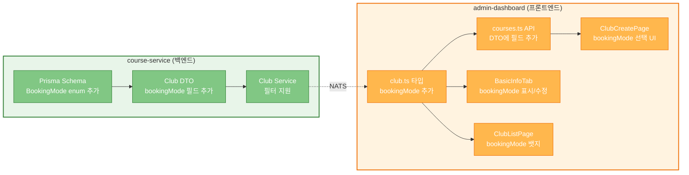
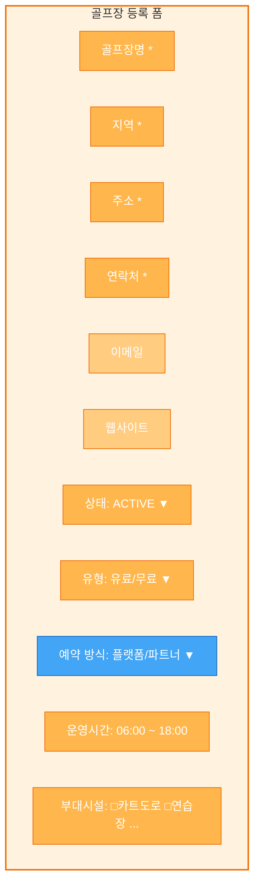
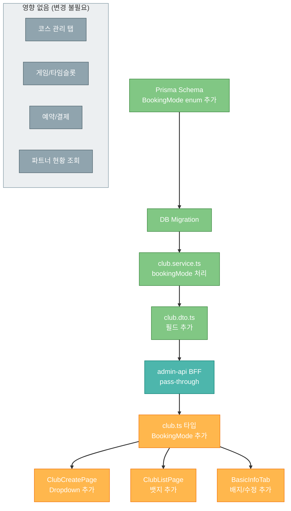

# admin-dashboard 수정사항 (bookingMode 추가)

> 작성일: 2026-03-18

---

## 1. 변경 범위 요약



---

## 2. 백엔드 변경 (course-service)

### 2-1. Prisma Schema

```prisma
// services/course-service/prisma/schema.prisma

// 신규 enum
enum BookingMode {
  PLATFORM    // 파크골프메이트 직접 사용
  PARTNER     // 외부 ERP 파트너 연동
}

model Club {
  // ... 기존 필드 유지
  clubType       ClubType     @default(PAID)
  bookingMode    BookingMode  @default(PLATFORM)  // ← 추가
  // ...
}
```

### 2-2. Club DTO

```typescript
// services/course-service/src/club/dto/create-club.dto.ts

// 추가 필드
bookingMode?: 'PLATFORM' | 'PARTNER';  // 기본값: PLATFORM
```

### 2-3. Migration

```bash
npx prisma migrate dev --name add-club-booking-mode
```

---

## 3. admin-dashboard 프론트엔드 변경

### 3-1. 타입 (club.ts)

```typescript
// 현재
export type ClubType = 'PAID' | 'FREE';

// 추가
export type BookingMode = 'PLATFORM' | 'PARTNER';

// Club 인터페이스에 추가
export interface Club {
  // ... 기존 필드
  clubType: ClubType;
  bookingMode: BookingMode;  // ← 추가
}

// CreateClubDto에 추가
export interface CreateClubDto {
  // ... 기존 필드
  bookingMode?: BookingMode;  // ← 추가
}

// UpdateClubDto에 추가
export interface UpdateClubDto {
  // ... 기존 필드
  bookingMode?: BookingMode;  // ← 추가
}
```

### 3-2. API (courses.ts)

DTO 타입 변경만으로 자동 반영 (API 함수 수정 불필요)

### 3-3. ClubCreatePage — bookingMode 선택 UI 추가

현재 `clubType` 선택 UI와 동일한 패턴으로 추가:



**추가 코드 위치**: `clubType` 선택 바로 아래

```typescript
// bookingMode 옵션
const bookingModeOptions = [
  { value: 'PLATFORM', label: '플랫폼 (파크골프메이트 직접 사용)' },
  { value: 'PARTNER', label: '파트너 연동 (외부 ERP 연동)' },
];
```

### 3-4. BasicInfoTab — bookingMode 표시/수정

**읽기 모드**: 배지로 표시 (clubType과 동일 패턴)

```typescript
const bookingModeMap = {
  PLATFORM: { label: '플랫폼', className: 'bg-blue-500/20 text-blue-400', icon: '🟢' },
  PARTNER:  { label: '파트너 연동', className: 'bg-amber-500/20 text-amber-400', icon: '🔗' },
};
```

**수정 모드**: Dropdown select

**표시 위치**: `clubType` 배지 옆에 나란히 표시

```
┌──────────────────────────────────────┐
│ 기본정보                              │
│                                      │
│ 골프장명: ○○파크골프장                │
│ 상태: ✅ 운영중   유형: 유료          │
│ 예약방식: 🟢 플랫폼                   │  ← 추가
│ 주소: 서울시 강남구 ...               │
│ 연락처: 02-1234-5678                 │
└──────────────────────────────────────┘
```

### 3-5. ClubListPage — 골프장 카드에 bookingMode 뱃지 추가

현재 카드에 `clubType` 배지가 표시됨. 그 옆에 `bookingMode` 배지 추가:

```
┌──────────────────┐
│ ○○파크골프장       │
│ 유료 🟢 플랫폼    │  ← bookingMode 뱃지 추가
│ 36홀 · 4코스      │
│ 06:00 ~ 18:00    │
│ ✅ 운영 중        │
└──────────────────┘

┌──────────────────┐
│ △△파크골프장       │
│ 유료 🔗 파트너    │  ← PARTNER 표시
│ 18홀 · 2코스      │
│ 06:00 ~ 18:00    │
│ 🔄 동기화 중      │
└──────────────────┘
```

---

## 4. 수정 파일 목록

### 백엔드 (course-service)

| 파일 | 변경 | 내용 |
|------|------|------|
| `prisma/schema.prisma` | 수정 | BookingMode enum + Club.bookingMode 필드 추가 |
| `src/club/dto/create-club.dto.ts` | 수정 | bookingMode 필드 추가 |
| `src/club/dto/update-club.dto.ts` | 수정 | bookingMode 필드 추가 |
| `src/club/club.service.ts` | 수정 | bookingMode 필터 지원 (선택) |

### 프론트엔드 (admin-dashboard)

| 파일 | 변경 | 내용 |
|------|------|------|
| `src/types/club.ts` | 수정 | BookingMode 타입, Club/DTO 인터페이스에 필드 추가 |
| `src/lib/api/courses.ts` | 수정 | CreateClubDto, UpdateClubDto에 bookingMode 추가 |
| `src/pages/club/ClubCreatePage.tsx` | 수정 | bookingMode 선택 Dropdown 추가 |
| `src/pages/club/ClubListPage.tsx` | 수정 | 카드에 bookingMode 뱃지 추가 |
| `src/components/features/club/BasicInfoTab.tsx` | 수정 | 읽기/수정 모드에 bookingMode 표시 |

### BFF (admin-api)

| 파일 | 변경 | 내용 |
|------|------|------|
| Club 관련 DTO | 수정 | bookingMode 필드 전달 (있으면 pass-through) |

> **총 수정 파일: ~9개** (신규 파일 없음, 기존 파일에 필드 추가만)

---

## 5. 변경 영향 분석



> **기존 기능에 영향 없음**: 코스 관리, 게임/타임슬롯, 예약/결제, 파트너 현황 조회는 변경 불필요.
> bookingMode는 **선택 필드(기본값 PLATFORM)**이므로 기존 데이터 호환성 보장.
