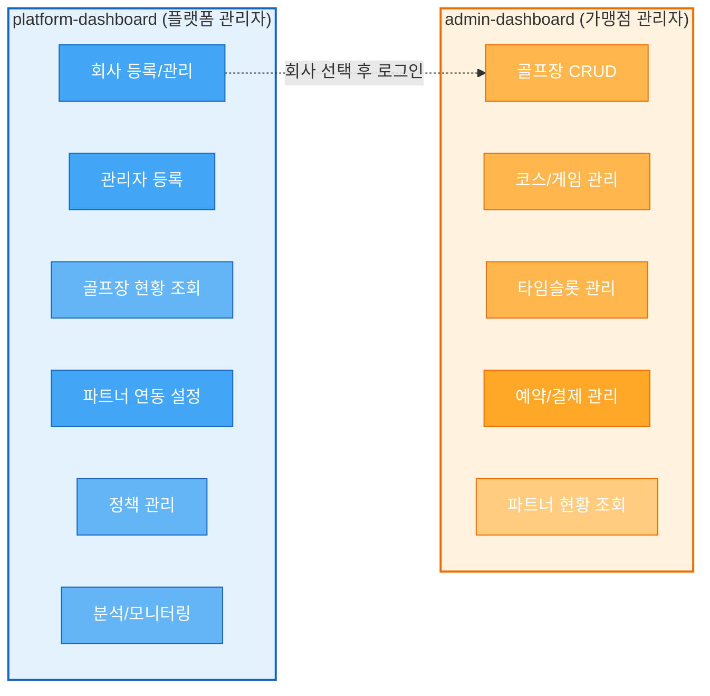
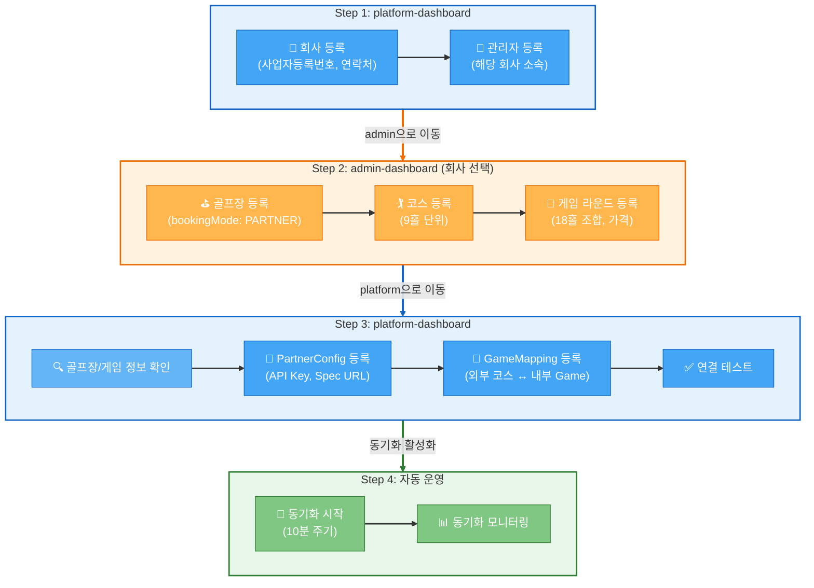
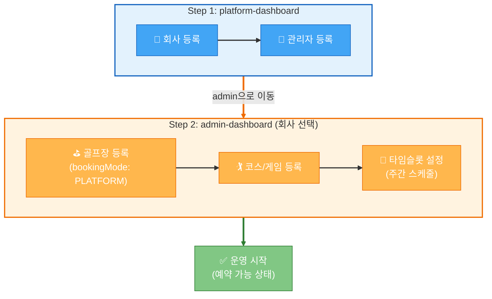
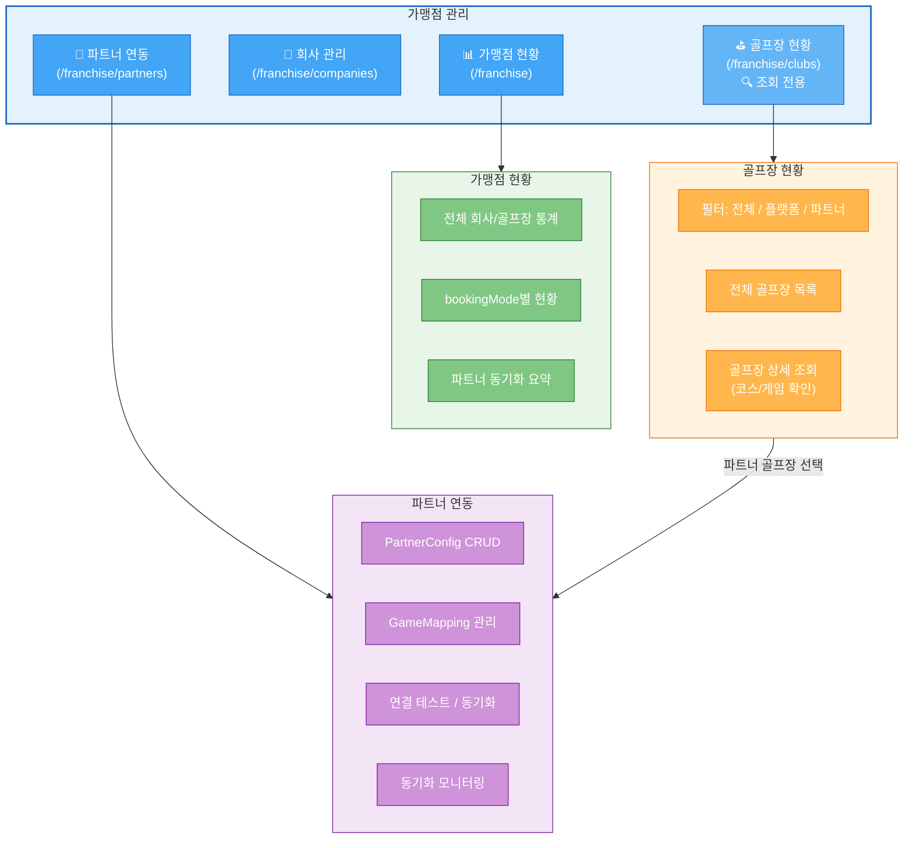
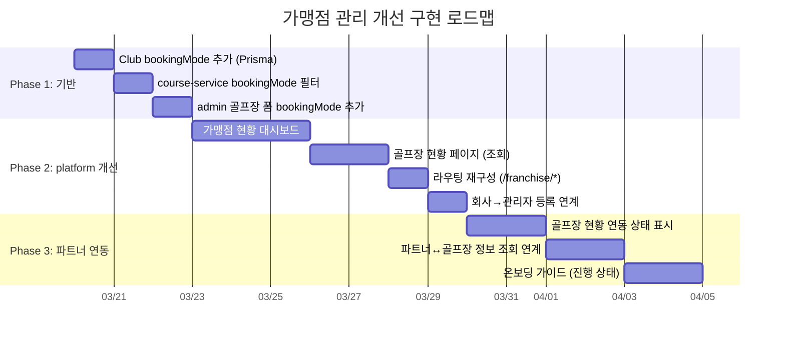

# 가맹점 관리 워크플로우 개선안

> 작성일: 2026-03-18

---

## 1. 대시보드 역할 분담



| 기능 | admin-dashboard | platform-dashboard |
|------|:-:|:-:|
| 골프장 CRUD | ✅ 자기 골프장 | 🔍 조회 (가맹점 현황) |
| 코스/게임/타임슬롯 | ✅ 자기 골프장 | 🔍 조회 |
| 회사 등록/관리 | - | ✅ 전체 |
| 관리자 등록 | - | ✅ 전체 |
| 파트너 연동 설정 | 🔍 조회만 | ✅ 설정/수정 |
| 정책 관리 | - | ✅ 플랫폼 정책 |
| 분석 | - | ✅ 예약/매출 |

> **핵심**: 골프장/코스/게임 등록은 admin-dashboard에서, 파트너 연동 설정은 platform-dashboard에서 처리.
> 플랫폼 관리자는 admin-dashboard에 로그인 후 회사 선택으로 골프장 등록 가능.

---

## 2. 파트너 계약 온보딩 워크플로우



### 단계별 상세

| Step | 대시보드 | 작업 | 상세 |
|------|---------|------|------|
| **1-1** | platform | 회사 등록 | 사업자등록번호, 연락처, 주소 등 |
| **1-2** | platform | 관리자 등록 | 해당 회사 소속 관리자 계정 생성 |
| **2-1** | admin (회사 선택) | 골프장 등록 | 이름, 주소, 좌표, bookingMode: PARTNER |
| **2-2** | admin (회사 선택) | 코스 등록 | 9홀 단위 코스, 홀 정보 |
| **2-3** | admin (회사 선택) | 게임 라운드 등록 | 18홀 조합, 가격, 슬롯 모드 |
| **3-1** | platform | 골프장/게임 정보 확인 | 등록된 데이터 조회로 검증 |
| **3-2** | platform | PartnerConfig 등록 | API Key, Spec URL, 동기화 주기 |
| **3-3** | platform | GameMapping 등록 | 외부 코스명 ↔ 내부 Game ID 매핑 |
| **3-4** | platform | 연결 테스트 | API 연결 확인 |
| **4-1** | 자동 | 동기화 시작 | job-service 10분 주기 슬롯 동기화 |
| **4-2** | platform | 동기화 확인 | SyncLog, 슬롯 매핑 상태 모니터링 |

---

## 3. 플랫폼 직접 사용 온보딩 워크플로우



> 플랫폼 직접 사용은 파트너 연동 Step 3~4가 불필요하여 더 간단함.

---

## 4. 두 트랙 비교

```mermaid
flowchart LR
  CONTRACT["📋 계약"] --> COMPANY["🏢 회사 등록<br/>(platform)"]
  COMPANY --> ADMIN_REG["👤 관리자 등록<br/>(platform)"]
  ADMIN_REG --> CLUB["⛳ 골프장 등록<br/>(admin)"]
  CLUB --> MODE{"bookingMode?"}

  MODE -->|PLATFORM| COURSE_P["🏌️ 코스/게임 설정"]
  COURSE_P --> SLOT["📅 타임슬롯 설정"]
  SLOT --> DONE_P["✅ 운영 시작"]

  MODE -->|PARTNER| COURSE_R["🏌️ 코스/게임 설정"]
  COURSE_R --> CONFIG["🔑 PartnerConfig<br/>(platform)"]
  CONFIG --> MAPPING["🔗 GameMapping"]
  MAPPING --> TEST["🧪 연결 테스트"]
  TEST --> SYNC["✅ 동기화 시작"]

  style CONTRACT fill:#90a4ae,stroke:#455a64,color:#fff
  style COMPANY fill:#42a5f5,stroke:#1565c0,color:#fff
  style ADMIN_REG fill:#42a5f5,stroke:#1565c0,color:#fff
  style CLUB fill:#ffb74d,stroke:#ef6c00,color:#fff
  style MODE fill:#ce93d8,stroke:#7b1fa2,color:#fff

  style COURSE_P fill:#ffb74d,stroke:#ef6c00,color:#fff
  style SLOT fill:#ffb74d,stroke:#ef6c00,color:#fff
  style DONE_P fill:#81c784,stroke:#2e7d32,color:#fff

  style COURSE_R fill:#ffb74d,stroke:#ef6c00,color:#fff
  style CONFIG fill:#42a5f5,stroke:#1565c0,color:#fff
  style MAPPING fill:#42a5f5,stroke:#1565c0,color:#fff
  style TEST fill:#42a5f5,stroke:#1565c0,color:#fff
  style SYNC fill:#81c784,stroke:#2e7d32,color:#fff

  linkStyle 0,1,2,3 stroke:#333,stroke-width:2px
  linkStyle 4,5,6 stroke:#2e7d32,stroke-width:2px
  linkStyle 7,8,9,10,11 stroke:#1565c0,stroke-width:2px
```



---

## 5. platform-dashboard 네비게이션 개선



---

## 6. DB 변경 사항

### Club 모델에 bookingMode 추가

```prisma
// course-service/prisma/schema.prisma

enum BookingMode {
  PLATFORM    // 파크골프메이트 직접 사용
  PARTNER     // 외부 ERP 파트너 연동
}

model Club {
  // ... 기존 필드
  bookingMode  BookingMode  @default(PLATFORM)
}
```

---

## 7. 구현 순서



### Phase 1: 기반 작업
- [ ] Club 모델에 `bookingMode` 필드 추가 (Prisma migration)
- [ ] course-service NATS 패턴에 bookingMode 필터 추가
- [ ] admin-dashboard 골프장 등록 폼에 bookingMode 선택 추가

### Phase 2: platform-dashboard 가맹점 관리 개선
- [ ] 가맹점 현황 대시보드 (`/franchise`)
- [ ] 골프장 현황 페이지 (`/franchise/clubs`) — 조회 전용
- [ ] 라우팅 재구성 (`/companies` → `/franchise/companies`, `/partners` → `/franchise/partners`)
- [ ] 회사 관리에서 관리자 등록 연계 기능

### Phase 3: 파트너 연동 흐름 개선
- [ ] 골프장 현황에서 파트너 연동 상태 표시
- [ ] 파트너 연동 페이지에서 골프장/게임 정보 조회 연계
- [ ] 온보딩 가이드 (단계별 진행 상태 표시)
