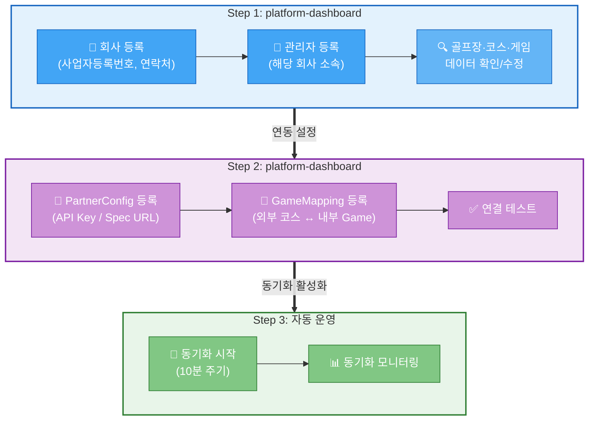
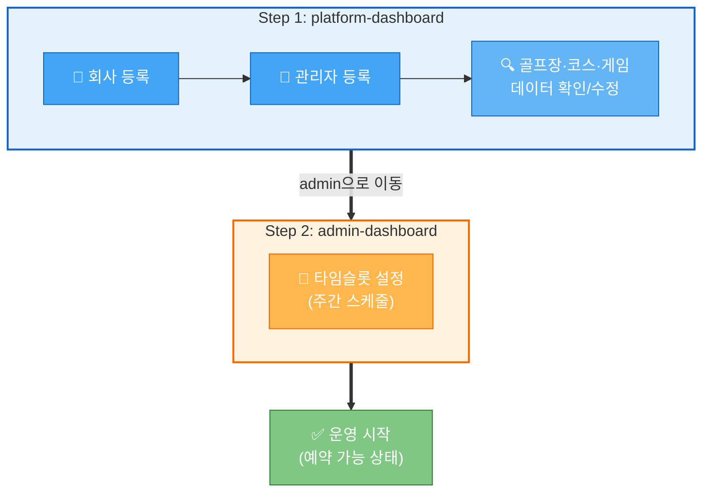

# 가맹점 관리 워크플로우

> 가맹점 온보딩, 파트너 연동, 예약 동기화를 포괄하는 통합 워크플로우
> 작성일: 2026-03-18

---

## 1. 대시보드 역할 분담

| 기능 | admin-dashboard | platform-dashboard |
|------|:-:|:-:|
| 골프장 CRUD | ✅ 자기 골프장 | 🔍 조회 (가맹점 현황) |
| 코스/게임/타임슬롯 | ✅ 자기 골프장 | 🔍 조회 |
| 회사 등록/관리 | - | ✅ 전체 |
| 관리자 등록 | - | ✅ 전체 |
| 파트너 연동 설정 | 🔍 조회만 | ✅ 설정/수정 |
| 정책 관리 | - | ✅ 플랫폼 정책 |
| 분석/모니터링 | - | ✅ 예약/매출 |

> **핵심**: 골프장/코스/게임 등록은 admin-dashboard에서, 파트너 연동 설정은 platform-dashboard에서 처리.
> 플랫폼 관리자는 admin-dashboard에 로그인 후 회사 선택으로 골프장 등록 가능.

---

## 2. 온보딩 워크플로우

### 사전 준비: 자동 크롤링

골프장 기본정보, 코스정보, 게임 라운드 기본정보는 **자동 크롤링으로 사전 등록**된다.
계약 체결 후에는 데이터 확인/수정만 하고 바로 연동 설정으로 진입한다.

### 두 트랙 비교

```mermaid
flowchart LR
  CRAWL["🤖 자동 크롤링<br/>(골프장·코스·게임<br/>사전 등록)"]
  CRAWL -.->|사전 완료| CONTRACT

  CONTRACT["📋 계약"] --> COMPANY["🏢 회사 등록<br/>(platform)"]
  COMPANY --> ADMIN_REG["👤 관리자 등록<br/>(platform)"]
  ADMIN_REG --> REVIEW["🔍 데이터 확인/수정<br/>(platform)"]
  REVIEW --> MODE{"bookingMode?"}

  MODE -->|PLATFORM| SLOT["📅 타임슬롯 설정"]
  SLOT --> DONE_P["✅ 운영 시작"]

  MODE -->|PARTNER| CONFIG["🔑 PartnerConfig"]
  CONFIG --> MAPPING["🔗 GameMapping"]
  MAPPING --> TEST["🧪 연결 테스트"]
  TEST --> SYNC["✅ 동기화 시작"]

  style CRAWL fill:#90a4ae,stroke:#455a64,color:#fff
  style CONTRACT fill:#90a4ae,stroke:#455a64,color:#fff
  style COMPANY fill:#42a5f5,stroke:#1565c0,color:#fff
  style ADMIN_REG fill:#42a5f5,stroke:#1565c0,color:#fff
  style REVIEW fill:#64b5f6,stroke:#1565c0,color:#fff
  style MODE fill:#ce93d8,stroke:#7b1fa2,color:#fff
  style SLOT fill:#ffb74d,stroke:#ef6c00,color:#fff
  style DONE_P fill:#81c784,stroke:#2e7d32,color:#fff
  style CONFIG fill:#42a5f5,stroke:#1565c0,color:#fff
  style MAPPING fill:#42a5f5,stroke:#1565c0,color:#fff
  style TEST fill:#42a5f5,stroke:#1565c0,color:#fff
  style SYNC fill:#81c784,stroke:#2e7d32,color:#fff
```



### 파트너 연동 온보딩 (PARTNER 모드)



### 플랫폼 직접 사용 온보딩 (PLATFORM 모드)



> 플랫폼 직접 사용은 파트너 연동 Step 2가 불필요하여 더 간단함.
> 골프장/코스/게임은 자동 크롤링으로 사전 등록되어 있으므로 확인/수정만 필요.

### 단계별 상세

| Step | 대시보드 | 작업 | 상세 |
|------|---------|------|------|
| 사전 | 자동 | 골프장·코스·게임 크롤링 | 기본정보 자동 수집 및 등록 |
| 1-1 | platform | 회사 등록 | 사업자등록번호, 연락처, 주소 |
| 1-2 | platform | 관리자 등록 | 해당 회사 소속 관리자 계정 생성 |
| 1-3 | platform | 데이터 확인/수정 | 크롤링 데이터 검증, 문제 시 수정 |
| 2-1 | platform | PartnerConfig 등록 | API Key, Spec URL, 동기화 주기 (PARTNER만) |
| 2-2 | platform | GameMapping 등록 | 외부 코스명 ↔ 내부 Game ID 매핑 (PARTNER만) |
| 2-3 | platform | 연결 테스트 | API 연결 확인 (PARTNER만) |

---

## 3. 서비스 아키텍처

### 서비스 위치

```
services/
├── partner-service/      → partner_db   ← 신규 (연동 매핑/설정/이력)
├── course-service/       → course_db    (골프장/코스/게임/슬롯 원본)
├── booking-service/      → booking_db   (예약 원본)
└── job-service/                         (10분 주기 동기화 트리거)
```

### 핵심 원칙

| 원칙 | 설명 |
|------|------|
| 독립 DB | 연동 매핑/설정/이력은 partner_db에만 저장 |
| 원본 미소유 | 슬롯/예약 원본은 course-service, booking-service가 소유 |
| 외부 무관심 | course-service, booking-service는 partner-service 존재를 모름 |
| 멱등성 보장 | 모든 동기화 처리는 중복 실행해도 안전 |

### 연동 방식

| 방식 | 설명 | 용도 |
|------|------|------|
| **API 폴링 (주력)** | partner-service가 10분 주기로 외부 API 호출 | 대부분의 골프장 |
| **웹훅 수신 (보조)** | 외부 시스템이 이벤트 Push | 실시간 보완 |

기술 스택: `swagger-client`(동적 API 호출), `p-retry`(재시도), `opossum`(서킷 브레이커)

---

## 4. DB 스키마

### course-service 변경

```prisma
enum BookingMode {
  PLATFORM    // 파크골프메이트 직접 사용
  PARTNER     // 외부 ERP 파트너 연동
}

model Club {
  // ... 기존 필드
  bookingMode  BookingMode  @default(PLATFORM)
}

model GameTimeSlot {
  // ... 기존 필드
  externalBooked Int  @default(0)  // 외부 예약 인원 (추가)
}
```

가용 인원 계산: `available = maxPlayers - bookedPlayers - externalBooked`

### partner-service 스키마 (partner_db)

```prisma
// ── 연동 설정 (골프장별 1건) ──
model PartnerConfig {
  id                 Int      @id @default(autoincrement())
  clubId             Int      @unique
  companyId          Int
  systemName         String
  externalClubId     String   @unique

  // API 스펙 + 인증
  specUrl            String          // OpenAPI 스펙 URL
  apiKey             String          // AES-256 암호화 저장
  apiSecret          String?
  webhookSecret      String?
  responseMapping    Json            // 응답 필드 매핑 설정

  // 동기화 설정
  syncMode           SyncMode @default(API_POLLING)
  syncIntervalMin    Int      @default(10)
  syncRangeDays      Int      @default(7)
  slotSyncEnabled    Boolean  @default(true)
  bookingSyncEnabled Boolean  @default(true)

  // 상태
  isActive           Boolean  @default(true)
  lastSlotSyncAt     DateTime?
  lastSlotSyncStatus SyncResult?
  lastBookingSyncAt  DateTime?

  gameMappings       GameMapping[]
  syncLogs           SyncLog[]

  createdAt          DateTime @default(now())
  updatedAt          DateTime @updatedAt

  @@index([isActive])
  @@index([companyId])
}

// ── 게임 매핑 ──
model GameMapping {
  id                   Int      @id @default(autoincrement())
  partnerId            Int
  partner              PartnerConfig @relation(fields: [partnerId], references: [id], onDelete: Cascade)
  externalCourseName   String      // 외부 코스명 (예: "A+B코스")
  externalCourseId     String?
  internalGameId       Int         // course-service Game.id
  isActive             Boolean  @default(true)
  slotMappings         SlotMapping[]

  @@unique([partnerId, externalCourseName])
  @@unique([partnerId, internalGameId])
}

// ── 타임슬롯 매핑 ──
model SlotMapping {
  id                   Int      @id @default(autoincrement())
  gameMappingId        Int
  gameMapping          GameMapping @relation(fields: [gameMappingId], references: [id], onDelete: Cascade)
  externalSlotId       String
  date                 DateTime @db.Date
  startTime            String
  endTime              String
  internalSlotId       Int?        // course-service GameTimeSlot.id
  externalMaxPlayers   Int
  externalBooked       Int     @default(0)
  externalStatus       String     // AVAILABLE | FULLY_BOOKED | CLOSED
  externalPrice        Decimal? @db.Decimal(10, 0)
  lastSyncAt           DateTime?
  syncStatus           SlotSyncStatus @default(SYNCED)

  @@unique([gameMappingId, externalSlotId])
  @@unique([gameMappingId, date, startTime])
  @@index([internalSlotId])
  @@index([date])
}

// ── 예약 매핑 (양방향) ──
model BookingMapping {
  id                   Int      @id @default(autoincrement())
  partnerId            Int
  gameMappingId        Int?
  internalBookingId    Int?     @unique
  externalBookingId    String
  syncDirection        SyncDirection
  syncStatus           BookingSyncStatus @default(SYNCED)
  lastSyncAt           DateTime?
  date                 DateTime @db.Date
  startTime            String
  playerCount          Int
  playerName           String?
  status               String     // CONFIRMED | CANCELLED | COMPLETED
  conflictData         Json?

  @@unique([partnerId, externalBookingId])
  @@index([syncStatus])
  @@index([date])
}

// ── 동기화 이력 ──
model SyncLog {
  id                 Int      @id @default(autoincrement())
  partnerId          Int
  partner            PartnerConfig @relation(fields: [partnerId], references: [id], onDelete: Cascade)
  action             SyncAction
  direction          SyncDirection
  status             SyncResult
  recordCount        Int      @default(0)
  createdCount       Int      @default(0)
  updatedCount       Int      @default(0)
  errorCount         Int      @default(0)
  errorMessage       String?
  durationMs         Int?
  createdAt          DateTime @default(now())

  @@index([partnerId, createdAt])
  @@index([action, status])
}

// ── Enums ──
enum SyncMode      { API_POLLING  WEBHOOK  HYBRID  MANUAL }
enum SyncResult    { SUCCESS  PARTIAL  FAILED }
enum SyncDirection { INBOUND  OUTBOUND }
enum SlotSyncStatus    { SYNCED  PENDING  CONFLICT  UNMAPPED  FAILED }
enum BookingSyncStatus { SYNCED  PENDING  CONFLICT  FAILED  CANCELLED }
enum SyncAction {
  SLOT_SYNC  BOOKING_IMPORT  BOOKING_EXPORT  BOOKING_CANCEL  CONNECTION_TEST
}
```

### ERD 관계

```
PartnerConfig (골프장별 1건)
  ├─ 1:N → GameMapping (코스별 매핑)
  │          └─ 1:N → SlotMapping (타임슬롯별 매핑)
  ├─ 1:N → BookingMapping (예약 양방향 매핑)
  └─ 1:N → SyncLog (동기화 이력)
```

---

## 5. 전체 파트너 데이터 연동 워크플로우

온보딩(Phase 0) 완료 후 Inventory 동기화 → Booking Control → 결제/정산 → 모니터링까지의 전체 흐름이다.

```mermaid
flowchart TB

  %% ── Phase 0: 계약 및 초기 설정 ──
  subgraph CONTRACT ["Phase 0: 계약 및 초기 설정"]
    C1{{"📋 파트너 골프장 계약"}}
    C2["🏢 회사 등록<br/>(iam-service)"]
    C3["🔍 골프장·코스·게임<br/>데이터 확인/수정<br/>(자동 크롤링 사전 등록)"]
    C4["🔑 PartnerConfig 등록<br/>(API Key / Spec URL)"]
    C5["🔗 GameMapping 등록<br/>(외부 코스 ↔ 내부 Game)"]
    C6{{"✅ 연결 테스트<br/>(partner.config.test)"}}

    C1 --> C2 --> C3 --> C4 --> C5 --> C6
  end

  %% ── 1단계: Inventory 동기화 ──
  subgraph STAGE1 ["1단계: Inventory 동기화"]
    S1(["⏱ job-service<br/>(10분 주기 트리거)"])
    S2["📡 partner-service<br/>(외부 API 슬롯 조회)"]
    S3["🗂 SlotMapping<br/>(외부↔내부 슬롯 매핑)"]
    S4["💾 course-service<br/>(externalBooked 반영)"]
    S5["🧮 가용 인원 재계산<br/>(max - booked - external)"]

    S1 --> S2 --> S3 --> S4 --> S5
  end

  %% ── 2단계: Booking Control ──
  subgraph STAGE2 ["2단계: Booking Control"]

    subgraph OUTBOUND ["Outbound: 플랫폼 → ERP"]
      O1["👤 사용자 예약 요청"]
      O2{"회원 확인<br/>(JIT Provisioning)"}
      O3["🆕 ERP 회원 생성<br/>(partner.member.create)"]
      O4["⏳ Hold 요청<br/>(3~5분 임시 점유)"]
      O5["✔ 예약 확정 요청"]
      O6["📥 ERP Booking_ID 수신"]
      O7["📝 BookingMapping 기록<br/>(OUTBOUND / SYNCED)"]

      O1 --> O2
      O2 -->|없음| O3
      O2 -->|있음| O4
      O3 --> O4
      O4 --> O5 --> O6 --> O7
    end

    subgraph INBOUND ["Inbound: ERP → 플랫폼"]
      I1["📨 동기화 or 웹훅<br/>(외부 예약 수신)"]
      I2["booking.createExternal"]
      I3["📦 내부 Booking 생성<br/>(status: EXTERNAL)"]
      I4["📝 BookingMapping 기록<br/>(INBOUND / SYNCED)"]
      I5["🔄 externalBooked 갱신"]

      I1 --> I2 --> I3 --> I4 --> I5
    end

    subgraph CANCEL ["취소 동기화 (양방향)"]
      X1["🚫 내부 취소 발생"]
      X2["📤 ERP 취소 API 호출"]
      X3["🚫 외부 취소 감지"]
      X4["📥 내부 Booking 취소<br/>(externalBooked 차감)"]

      X1 --> X2
      X3 --> X4
    end

  end

  %% ── 결제 및 정산 ──
  subgraph PAYMENT ["결제 및 정산"]
    P1{"💳 결제 모델"}
    P2["플랫폼 통합 결제<br/>(Toss Payments)"]
    P3["현장 결제<br/>(정보 공유만)"]
    P4["📊 정산 리포트<br/>(ERP 대조)"]

    P1 -->|모델 A| P2
    P1 -->|모델 B| P3
    P2 --> P4
  end

  %% ── 모니터링 ──
  subgraph MONITOR ["모니터링"]
    MON1["📋 SyncLog 기록"]
    MON2["🛡 서킷 브레이커<br/>(연속 실패 감지)"]
    MON3["🚨 충돌 알림<br/>(CONFLICT 상태)"]
  end

  %% ── 단계 연결 ──
  CONTRACT ==>|초기 설정 완료| STAGE1
  STAGE1 ==>|슬롯 동기화 완료| STAGE2
  STAGE2 ==>|예약 확정| PAYMENT
  STAGE1 -.->|로그| MONITOR
  STAGE2 -.->|로그| MONITOR

  %% ── Phase 0 스타일 ──
  style CONTRACT fill:#fff3e0,stroke:#ef6c00,stroke-width:2px,color:#333
  style C1 fill:#fb8c00,stroke:#e65100,color:#fff
  style C2 fill:#ffb74d,stroke:#ef6c00,color:#fff
  style C3 fill:#ffcc80,stroke:#ef6c00,color:#fff
  style C4 fill:#ffb74d,stroke:#ef6c00,color:#fff
  style C5 fill:#ffb74d,stroke:#ef6c00,color:#fff
  style C6 fill:#fb8c00,stroke:#e65100,color:#fff

  %% ── 1단계 스타일 ──
  style STAGE1 fill:#e8f5e9,stroke:#2e7d32,stroke-width:2px,color:#333
  style S1 fill:#66bb6a,stroke:#2e7d32,color:#fff
  style S2 fill:#81c784,stroke:#2e7d32,color:#fff
  style S3 fill:#81c784,stroke:#2e7d32,color:#fff
  style S4 fill:#81c784,stroke:#2e7d32,color:#fff
  style S5 fill:#81c784,stroke:#2e7d32,color:#fff

  %% ── 2단계 스타일 ──
  style STAGE2 fill:#e3f2fd,stroke:#1565c0,stroke-width:2px,color:#333
  style OUTBOUND fill:#e3f2fd,stroke:#1565c0,color:#333
  style O1 fill:#42a5f5,stroke:#1565c0,color:#fff
  style O2 fill:#64b5f6,stroke:#1565c0,color:#fff
  style O3 fill:#64b5f6,stroke:#1565c0,color:#fff
  style O4 fill:#64b5f6,stroke:#1565c0,color:#fff
  style O5 fill:#64b5f6,stroke:#1565c0,color:#fff
  style O6 fill:#64b5f6,stroke:#1565c0,color:#fff
  style O7 fill:#42a5f5,stroke:#1565c0,color:#fff
  style INBOUND fill:#e1f5fe,stroke:#0277bd,color:#333
  style I1 fill:#29b6f6,stroke:#0277bd,color:#fff
  style I2 fill:#4fc3f7,stroke:#0277bd,color:#fff
  style I3 fill:#4fc3f7,stroke:#0277bd,color:#fff
  style I4 fill:#4fc3f7,stroke:#0277bd,color:#fff
  style I5 fill:#29b6f6,stroke:#0277bd,color:#fff

  %% ── 취소 스타일 ──
  style CANCEL fill:#ffebee,stroke:#c62828,color:#333
  style X1 fill:#ef5350,stroke:#c62828,color:#fff
  style X2 fill:#ef5350,stroke:#c62828,color:#fff
  style X3 fill:#ef5350,stroke:#c62828,color:#fff
  style X4 fill:#ef5350,stroke:#c62828,color:#fff

  %% ── 결제 스타일 ──
  style PAYMENT fill:#f3e5f5,stroke:#7b1fa2,stroke-width:2px,color:#333
  style P1 fill:#ab47bc,stroke:#7b1fa2,color:#fff
  style P2 fill:#ce93d8,stroke:#7b1fa2,color:#fff
  style P3 fill:#ce93d8,stroke:#7b1fa2,color:#fff
  style P4 fill:#ce93d8,stroke:#7b1fa2,color:#fff

  %% ── 모니터링 스타일 ──
  style MONITOR fill:#eceff1,stroke:#455a64,stroke-width:2px,color:#333
  style MON1 fill:#78909c,stroke:#455a64,color:#fff
  style MON2 fill:#78909c,stroke:#455a64,color:#fff
  style MON3 fill:#ef5350,stroke:#c62828,color:#fff
```



---

## 6. 동기화 흐름 상세

### 6-1. 타임슬롯 동기화 (Inventory)

```
job-service (10분 주기) → NATS emit: partner.sync.slots
    ↓
partner-service (SlotSyncService)
  1. 활성 PartnerConfig 목록 조회
  2. 골프장별 병렬 실행 (pLimit(5), Promise.allSettled)
  3. swagger-client로 외부 API 슬롯 조회
  4. GameMapping으로 코스 매핑 ("A+B코스" → internalGameId)
  5. 슬롯별 처리:
     - 신규 → SlotMapping 생성 + 내부 GameTimeSlot 매핑/생성
     - 기존 → externalBooked 변경 시 갱신
     - 삭제 → 내부 슬롯 CLOSED
  6. SyncLog 기록
```

### 6-2. 예약 동기화 (Booking Control)

#### Inbound (외부 → 내부)

```
폴링으로 외부 예약 조회
  → BookingMapping 중복 체크 (멱등성)
  → NATS: booking.createExternal (status: EXTERNAL)
  → BookingMapping 생성 (INBOUND / SYNCED)
```

#### Outbound (내부 → 외부)

```
saga-service: booking.confirmed 이벤트
  → partner-service 수신
  → SlotMapping으로 외부 슬롯 확인
  → swagger-client로 외부 예약 생성
  → BookingMapping 생성 (OUTBOUND / SYNCED)
```

#### 취소 (양방향)

- 내부 취소 → 외부 ERP 취소 API 호출
- 외부 취소 감지 → 내부 EXTERNAL 예약 취소 + externalBooked 감소

### 6-3. 예약 시 실시간 가용 확인 (Re-verify)

10분 폴링 데이터는 지연이 있으므로, 예약 시점에 외부 API로 실시간 확인:

```
예약 요청
  1. 내부 가용 확인 (DB) → 불가 시 즉시 "마감"
  2. NATS: partner.slot.verifyAvailability → 외부 API 실시간 호출
     → DB 불일치 시 즉시 externalBooked 갱신
  3. 가용 확인 결과 → Saga 시작 또는 "마감"
  4. Saga: VERIFY_EXTERNAL → RESERVE_SLOT → CONFIRM_PAYMENT → NOTIFY_EXTERNAL → COMPLETE
```

외부 API 장애 시 → DB 기준으로 판단 (graceful degradation)

---

## 7. 동시성 제어

GameTimeSlot의 `version` 필드로 Optimistic Locking:

- `bookedPlayers` 변경 (내부 부킹) + `externalBooked` 변경 (배치 잡) 모두 같은 version으로 보호
- 충돌 시: **내부 부킹 우선** (사용자 경험), 배치는 version 재읽기 후 최대 3회 재시도
- 재고 초과 감지: `maxPlayers - bookedPlayers - externalBooked < 0` → CONFLICT + 관리자 알림

---

## 8. 회원 데이터 연동

### JIT Provisioning (Just-In-Time)

파트너 골프장 예약 시 ERP에 회원이 없으면 즉시 생성:

```
예약 시도 → ERP 회원 조회 (phone 기준)
  → 없으면 → partner.member.create → externalMemberId 확보
  → 예약 API 호출 (externalMemberId 포함)
```

### 공공시설 특수 요건

- 관내/관외 구분: 본인인증(PASS) 거주지 → REGIONAL 이용권 자동 발급
- 감면 혜택: 자격 증명 업로드 → 관리자 승인 → UserExemption 활성화
- 상세: [멤버십 서비스](./멤버십%20서비스.md) 참조

---

## 9. 결제 및 정산

| 구분 | 플랫폼 예약 (Outbound) | 외부 예약 (Inbound) |
|------|----------------------|-------------------|
| 결제 | Toss Payments | 골프장 자체 |
| 수수료 | 플랫폼 수수료 발생 | 없음 |
| 정산 | 플랫폼 → 골프장 | 골프장 자체 |
| Booking.status | CONFIRMED / COMPLETED | EXTERNAL |

---

## 10. NATS 패턴

### partner-service

| 패턴 | 설명 |
|------|------|
| `partner.config.create/update/get/list/delete` | 연동 설정 CRUD |
| `partner.config.test` | 연결 테스트 |
| `partner.gameMapping.create/update/list/delete` | 게임 매핑 CRUD |
| `partner.bookingMapping.list/resolve` | 예약 매핑 조회/충돌 해결 |
| `partner.sync.slots` | 슬롯 동기화 트리거 (Event) |
| `partner.sync.bookings` | 예약 동기화 트리거 (Event) |
| `partner.sync.manual` | 수동 동기화 |
| `partner.sync.logs` | 동기화 이력 조회 |
| `partner.slot.verifyAvailability` | 예약 전 외부 실시간 가용 확인 |
| `partner.member.check/create` | ERP 회원 확인/생성 |

### course-service 추가

| 패턴 | 설명 |
|------|------|
| `slot.updateExternalBooked` | 외부 예약 인원 갱신 |
| `slot.createFromPartner` | 파트너 슬롯 → 내부 GameTimeSlot 생성 |
| `slot.findByGameDateTime` | gameId + date + startTime 조회 |
| `slot.closeExternal` | 외부 삭제 슬롯 CLOSED 처리 |

### booking-service 추가

| 패턴 | 설명 |
|------|------|
| `booking.createExternal` | 외부 예약 참조 생성 (status: EXTERNAL) |
| `booking.cancelExternal` | 외부 취소 반영 |

### 이벤트 수신 (기존 서비스 발행)

| 패턴 | 발신 | 설명 |
|------|------|------|
| `booking.confirmed` | saga-service | 내부 예약 확정 → 외부 전달 |
| `booking.cancelled` | saga-service | 내부 취소 → 외부 취소 전파 |

---

## 11. partner-service 구조

```
services/partner-service/
├── src/
│   ├── config/         # PartnerConfig CRUD
│   ├── client/         # swagger-client 동적 API + 서킷 브레이커
│   ├── sync/           # 슬롯/예약 동기화 엔진
│   ├── webhook/        # 웹훅 수신 (방식 B)
│   ├── mapping/        # 매핑 조회/관리
│   └── app.module.ts
├── prisma/schema.prisma
└── Dockerfile
```

### swagger-client 기반 동적 연동

- 파트너가 OpenAPI 스펙 제공 → `specUrl`에 URL 저장
- 스펙 미제공 → API 문서 기반 수작업 spec.json 작성 → S3 업로드
- `responseMapping` (JSON)으로 파트너별 응답 필드 매핑
- 새 파트너 추가 시 코드 배포 불필요

---

## 12. BFF 엔드포인트

### admin-api (가맹점 담당자)

```
GET    /api/admin/partners/my                    → 내 골프장 연동 현황
GET    /api/admin/partners/my/sync-logs          → 동기화 이력
POST   /api/admin/partners/my/sync               → 수동 동기화
GET    /api/admin/partners/my/booking-mappings    → 예약 매핑 목록
POST   /api/admin/partners/my/booking-mappings/:bid/resolve → 충돌 해결
```

### platform-api (플랫폼 운영팀)

```
CRUD   /api/platform/partners                    → 파트너 설정 관리
POST   /api/platform/partners/:id/test           → 연결 테스트
CRUD   /api/platform/partners/:id/game-mappings  → 게임 매핑 관리
POST   /api/platform/partners/:id/sync           → 수동 동기화
GET    /api/platform/partners/:id/sync-logs      → 동기화 이력
GET    /api/platform/partners/:id/booking-mappings → 예약 매핑
GET    /api/platform/partners/monitoring/overview → 모니터링 현황
```

---

## 13. platform-dashboard 네비게이션

```
가맹점 관리
├── 📊 가맹점 현황 (/franchise)           → 통계, bookingMode별 현황
├── 🏢 회사 관리 (/franchise/companies)   → 회사 CRUD
├── ⛳ 골프장 현황 (/franchise/clubs)      → 조회 전용
└── 🔗 파트너 연동 (/franchise/partners)  → PartnerConfig, GameMapping, 동기화
```

---

## 14. 보안 / 모니터링

### 보안

| 항목 | 방안 |
|------|------|
| API Key 저장 | AES-256 암호화, 키는 K8s Secret |
| 웹훅 검증 | HMAC SHA-256 서명 + 타임스탬프 (5분 이내) |
| Rate Limiting | 외부 API 분당 60건 |
| 개인정보 | SyncLog에서 전화번호 등 마스킹 |
| 접근 제어 | PLATFORM/COMPANY ADMIN만 허용 |

### 모니터링

| 지표 | 임계값 | 알림 |
|------|--------|------|
| 동기화 연속 실패 | 3회 이상 | 관리자 알림 |
| 동기화 지연 | 30분 초과 | 경고 |
| 재고 충돌 | CONFLICT 발생 | 즉시 알림 |
| 외부 API 응답 | 10초 초과 | 경고 로그 |

