# 외부 부킹 API 연동 설계

> 파크골프메이트 플랫폼과 외부 골프장 시스템(ERP) 간 데이터 연동 표준 모델
> 작성일: 2026-03-16

---

## 1. 개요

### 1-1. 목적

기존 예약 시스템을 운영 중인 파크골프장과 계약 후 **빠르게 연동**하여, 이중 예약 없이 양쪽 시스템의 타임슬롯과 예약을 동기화한다. 핵심 목표는 **데이터 무결성(Integrity)**과 **실시간성(Concurrency)**을 동시에 확보하는 것이다.

- **무결성**: 플랫폼과 외부 ERP 간 예약 데이터가 항상 일치해야 하며, 오버부킹이 발생하지 않아야 한다
- **실시간성**: 한쪽에서 발생한 예약/취소가 최대한 빠르게 다른 쪽에 반영되어야 한다

### 1-2. 서비스 위치

```
services/
├── iam-service/          → iam_db
├── course-service/       → course_db
├── booking-service/      → booking_db
├── payment-service/      → payment_db
├── saga-service/         → saga_db
├── partner-service/      → partner_db     ← 신규
└── ...
```

### 1-3. 핵심 원칙

| 원칙 | 설명 |
|------|------|
| 독립 DB | 연동 매핑/설정/이력은 partner_db에만 저장 |
| 원본 미소유 | 슬롯/예약 원본은 course-service, booking-service가 소유 |
| NATS 통신 | 내부 서비스와는 NATS Request-Reply로만 통신 |
| 외부 무관심 | course-service, booking-service는 partner-service 존재를 모름 |
| 멱등성 보장 | 모든 동기화 처리는 중복 실행해도 안전 |

---

## 전체 워크플로우

```mermaid
flowchart TB

  %% ── Phase 0: 계약 및 초기 설정 ──
  subgraph CONTRACT ["Phase 0: 계약 및 초기 설정"]
    C1{{"📋 파트너 골프장 계약"}}
    C2["🏢 회사 등록<br/>(iam-service)"]
    C3["⛳ 골프장·코스·게임 등록<br/>(course-service)"]
    C4["🔑 PartnerConfig 등록<br/>(API Key / Spec URL)"]
    C5["🔗 GameMapping 등록<br/>(외부 코스 ↔ 내부 Game)"]
    C6{{"✅ 연결 테스트<br/>(partner.config.test)"}}

    C1 --> C2 --> C3 --> C4 --> C5 --> C6
  end

  %% ── 1단계: Inventory 동기화 ──
  subgraph STAGE1 ["1단계: Inventory 동기화"]
    S1(["⏱ job-service<br/>(10분 주기 트리거)"])
    S2["📡 partner-service<br/>(외부 API 슬롯 조회)"]
    S3["🗂 SlotMapping<br/>(외부↔내부 슬롯 매핑)"]
    S4["💾 course-service<br/>(externalBooked 반영)"]
    S5["🧮 가용 인원 재계산<br/>(max - booked - external)"]

    S1 --> S2 --> S3 --> S4 --> S5
  end

  %% ── 2단계: Booking Control ──
  subgraph STAGE2 ["2단계: Booking Control"]

    subgraph OUTBOUND ["Outbound: 플랫폼 → ERP"]
      O1["👤 사용자 예약 요청"]
      O2{"회원 확인<br/>(JIT Provisioning)"}
      O3["🆕 ERP 회원 생성<br/>(partner.member.create)"]
      O4["⏳ Hold 요청<br/>(3~5분 임시 점유)"]
      O5["✔ 예약 확정 요청"]
      O6["📥 ERP Booking_ID 수신"]
      O7["📝 BookingMapping 기록<br/>(OUTBOUND / SYNCED)"]

      O1 --> O2
      O2 -->|없음| O3
      O2 -->|있음| O4
      O3 --> O4
      O4 --> O5 --> O6 --> O7
    end

    subgraph INBOUND ["Inbound: ERP → 플랫폼"]
      I1["📨 동기화 or 웹훅<br/>(외부 예약 수신)"]
      I2["booking.createExternal"]
      I3["📦 내부 Booking 생성<br/>(status: EXTERNAL)"]
      I4["📝 BookingMapping 기록<br/>(INBOUND / SYNCED)"]
      I5["🔄 externalBooked 갱신"]

      I1 --> I2 --> I3 --> I4 --> I5
    end

    subgraph CANCEL ["취소 동기화 (양방향)"]
      X1["🚫 내부 취소 발생"]
      X2["📤 ERP 취소 API 호출"]
      X3["🚫 외부 취소 감지"]
      X4["📥 내부 Booking 취소<br/>(externalBooked 차감)"]

      X1 --> X2
      X3 --> X4
    end

  end

  %% ── 결제 및 정산 ──
  subgraph PAYMENT ["결제 및 정산"]
    P1{"💳 결제 모델"}
    P2["플랫폼 통합 결제<br/>(Toss Payments)"]
    P3["현장 결제<br/>(정보 공유만)"]
    P4["📊 정산 리포트<br/>(ERP 대조)"]

    P1 -->|모델 A| P2
    P1 -->|모델 B| P3
    P2 --> P4
  end

  %% ── 모니터링 ──
  subgraph MONITOR ["모니터링"]
    MON1["📋 SyncLog 기록"]
    MON2["🛡 서킷 브레이커<br/>(연속 실패 감지)"]
    MON3["🚨 충돌 알림<br/>(CONFLICT 상태)"]
  end

  %% ── 단계 연결 ──
  CONTRACT ==>|초기 설정 완료| STAGE1
  STAGE1 ==>|슬롯 동기화 완료| STAGE2
  STAGE2 ==>|예약 확정| PAYMENT
  STAGE1 -.->|로그| MONITOR
  STAGE2 -.->|로그| MONITOR

  %% ── 화살표 스타일 ──
  linkStyle 0,1,2,3,4 stroke:#e65100,stroke-width:2px
  linkStyle 5,6,7,8 stroke:#1b5e20,stroke-width:2px
  linkStyle 9,10,11,12,13,14,15 stroke:#0d47a1,stroke-width:2px
  linkStyle 16,17,18,19 stroke:#01579b,stroke-width:2px
  linkStyle 20,21 stroke:#b71c1c,stroke-width:2px
  linkStyle 22,23,24 stroke:#4a148c,stroke-width:2px
  linkStyle 25,26,27 stroke:#333,stroke-width:3px
  linkStyle 28,29 stroke:#607d8b,stroke-width:2px,stroke-dasharray:5

  %% ── Phase 0 스타일 (계약): subgraph 연한, 노드 진한 ──
  style CONTRACT fill:#fff3e0,stroke:#ef6c00,stroke-width:2px,color:#333
  style C1 fill:#fb8c00,stroke:#e65100,color:#fff
  style C2 fill:#ffb74d,stroke:#ef6c00,color:#fff
  style C3 fill:#ffb74d,stroke:#ef6c00,color:#fff
  style C4 fill:#ffb74d,stroke:#ef6c00,color:#fff
  style C5 fill:#ffb74d,stroke:#ef6c00,color:#fff
  style C6 fill:#fb8c00,stroke:#e65100,color:#fff

  %% ── 1단계 스타일 (동기화): subgraph 연한, 노드 진한 ──
  style STAGE1 fill:#e8f5e9,stroke:#2e7d32,stroke-width:2px,color:#333
  style S1 fill:#66bb6a,stroke:#2e7d32,color:#fff
  style S2 fill:#81c784,stroke:#2e7d32,color:#fff
  style S3 fill:#81c784,stroke:#2e7d32,color:#fff
  style S4 fill:#81c784,stroke:#2e7d32,color:#fff
  style S5 fill:#81c784,stroke:#2e7d32,color:#fff

  %% ── 2단계 스타일 (부킹): subgraph 연한, 노드 진한 ──
  style STAGE2 fill:#e3f2fd,stroke:#1565c0,stroke-width:2px,color:#333
  style OUTBOUND fill:#e3f2fd,stroke:#1565c0,color:#333
  style O1 fill:#42a5f5,stroke:#1565c0,color:#fff
  style O2 fill:#64b5f6,stroke:#1565c0,color:#fff
  style O3 fill:#64b5f6,stroke:#1565c0,color:#fff
  style O4 fill:#64b5f6,stroke:#1565c0,color:#fff
  style O5 fill:#64b5f6,stroke:#1565c0,color:#fff
  style O6 fill:#64b5f6,stroke:#1565c0,color:#fff
  style O7 fill:#42a5f5,stroke:#1565c0,color:#fff
  style INBOUND fill:#e1f5fe,stroke:#0277bd,color:#333
  style I1 fill:#29b6f6,stroke:#0277bd,color:#fff
  style I2 fill:#4fc3f7,stroke:#0277bd,color:#fff
  style I3 fill:#4fc3f7,stroke:#0277bd,color:#fff
  style I4 fill:#4fc3f7,stroke:#0277bd,color:#fff
  style I5 fill:#29b6f6,stroke:#0277bd,color:#fff

  %% ── 취소 스타일: subgraph 연한, 노드 진한 ──
  style CANCEL fill:#ffebee,stroke:#c62828,color:#333
  style X1 fill:#ef5350,stroke:#c62828,color:#fff
  style X2 fill:#ef5350,stroke:#c62828,color:#fff
  style X3 fill:#ef5350,stroke:#c62828,color:#fff
  style X4 fill:#ef5350,stroke:#c62828,color:#fff

  %% ── 결제 스타일: subgraph 연한, 노드 진한 ──
  style PAYMENT fill:#f3e5f5,stroke:#7b1fa2,stroke-width:2px,color:#333
  style P1 fill:#ab47bc,stroke:#7b1fa2,color:#fff
  style P2 fill:#ce93d8,stroke:#7b1fa2,color:#fff
  style P3 fill:#ce93d8,stroke:#7b1fa2,color:#fff
  style P4 fill:#ce93d8,stroke:#7b1fa2,color:#fff

  %% ── 모니터링 스타일: subgraph 연한, 노드 진한 ──
  style MONITOR fill:#eceff1,stroke:#455a64,stroke-width:2px,color:#333
  style MON1 fill:#78909c,stroke:#455a64,color:#fff
  style MON2 fill:#78909c,stroke:#455a64,color:#fff
  style MON3 fill:#ef5350,stroke:#c62828,color:#fff
```



---

## 2. 데이터 연동 아키텍처

### 2-1. 연동 방식

외부 골프장 시스템과의 연동은 두 가지 방식을 지원하며, 골프장 환경에 따라 조합하여 사용한다.

#### 방식 A: API 폴링 (주력)

```
partner-service → 주기적으로 외부 API 호출
  ├─ 타임슬롯 조회 (10분 주기)
  ├─ 예약 변경 조회 (10분 주기)
  └─ 예약 생성/취소 전달 (이벤트 발생 시)
```

- 외부 시스템 변경 불필요
- 표준 REST API면 바로 연동 가능
- 대부분의 골프장 시스템에 적용 가능

#### 방식 B: 웹훅 수신 (보조)

```
외부 시스템 → partner-service 웹훅 엔드포인트로 이벤트 전송
  ├─ booking.created
  ├─ booking.cancelled
  └─ slot.updated
```

- 외부 시스템이 웹훅을 지원하는 경우 실시간 동기화 가능
- 방식 A와 병행하여 폴링 사이 지연 보완

#### 권장 조합

| 골프장 유형 | 권장 방식 | 이유 |
|------------|----------|------|
| 자체 예약 시스템 + API 제공 | A+B 혼합 | 슬롯 폴링 + 예약 웹훅 |
| 자체 예약 시스템 + API만 제공 | A (폴링) | 웹훅 미지원 시 |
| 자체 시스템 없음 | 연동 불필요 | 파크골프메이트 직접 사용 |

### 2-2. 기술 스택

파트너 골프장마다 API 스펙이 다르므로, **OpenAPI(Swagger) 스펙 기반 동적 클라이언트**로 연동한다.

```
파트너 골프장 API 연동 흐름:

1. 파트너가 OpenAPI 스펙 제공  →  그대로 사용
2. 파트너가 스펙 미제공         →  API 문서 기반으로 수작업 spec.json 작성

어느 경우든 swagger-client가 스펙을 런타임에 로딩하여 동적 호출
→ 새 파트너 추가 시 코드 배포 불필요
```

| 패키지 | 용도 |
|--------|------|
| `swagger-client` | OpenAPI 스펙 런타임 파싱 + 동적 API 호출 |
| `p-retry` | 실패 시 재시도 (지수 백오프) |
| `opossum` | 서킷 브레이커 (연속 실패 차단) |

---

## 3. [Phase 0] 계약 및 초기 설정

계약 체결 후 1회 수행하는 초기 설정 단계다. 회사 → 골프장/코스/게임 → PartnerConfig → GameMapping → 연결 테스트 순서로 진행하며, 모든 기초 데이터가 준비된 뒤 동기화를 시작한다.

### 3-1. 연동 설정 (PartnerConfig)

골프장별 1건의 연동 설정을 관리한다. 외부 시스템 접속 정보, API 인증, 동기화 주기 등 계약 시 합의된 설정을 저장한다.

```prisma
// partner-service/prisma/schema.prisma

generator client {
  provider = "prisma-client-js"
}

datasource db {
  provider = "postgresql"
  url      = env("DATABASE_URL")
}

// ──────────────────────────────────────────────
// 연동 설정 (골프장별 1건)
// ──────────────────────────────────────────────

model PartnerConfig {
  id                 Int      @id @default(autoincrement())
  clubId             Int      @unique          // course-service Club.id
  companyId          Int                       // iam-service Company.id

  // 외부 시스템 정보
  systemName         String                    // 표시명 (예: "○○파크골프 예약시스템")
  externalClubId     String                    // 외부 시스템의 골프장 ID

  // API 스펙 + 인증
  specUrl            String                    // OpenAPI 스펙 URL (S3 또는 파트너 제공 URL)
  apiKey             String                    // API 인증 키 (AES-256 암호화 저장)
  apiSecret          String?                   // API 시크릿 (AES-256 암호화 저장)
  webhookSecret      String?                   // 수신 웹훅 서명 검증용
  responseMapping    Json                      // 응답 필드 매핑 설정 (slots/bookings 필드 변환)

  // 동기화 설정
  syncMode           SyncMode @default(API_POLLING)
  syncIntervalMin    Int      @default(10)     // 폴링 주기 (분)
  syncRangeDays      Int      @default(7)      // 동기화 범위 (오늘 ~ +N일)
  slotSyncEnabled    Boolean  @default(true)
  bookingSyncEnabled Boolean  @default(true)

  // 상태
  isActive           Boolean  @default(true)
  lastSlotSyncAt     DateTime?
  lastSlotSyncStatus SyncResult?
  lastSlotSyncError  String?
  lastBookingSyncAt  DateTime?

  createdAt          DateTime @default(now())
  updatedAt          DateTime @updatedAt

  gameMappings       GameMapping[]
  syncLogs           SyncLog[]

  @@unique([externalClubId])
  @@index([isActive])
  @@index([companyId])
}

enum SyncMode {
  API_POLLING
  WEBHOOK
  HYBRID           // 폴링 + 웹훅 병행
  MANUAL
}

enum SyncResult {
  SUCCESS
  PARTIAL
  FAILED
}
```

### 3-2. 게임 매핑 (GameMapping)

파크골프 특성상 A+B, C+D 등의 코스 조합이 중요하다. 외부 ERP의 Course_Group을 내부 Game에 매핑하여, 사용자가 'A+B코스'를 선택하면 시스템 내부적으로는 `internalGameId`로 매핑한다.

```prisma
// ──────────────────────────────────────────────
// 게임(Game) 매핑
// ──────────────────────────────────────────────

model GameMapping {
  id                   Int      @id @default(autoincrement())
  partnerId            Int
  partner              PartnerConfig @relation(fields: [partnerId], references: [id], onDelete: Cascade)

  externalCourseName   String                  // 외부 코스명 (예: "A+B코스")
  externalCourseId     String?                 // 외부 코스 ID (있는 경우)
  internalGameId       Int                     // course-service Game.id

  isActive             Boolean  @default(true)
  createdAt            DateTime @default(now())
  updatedAt            DateTime @updatedAt

  slotMappings         SlotMapping[]

  @@unique([partnerId, externalCourseName])
  @@unique([partnerId, internalGameId])
  @@index([internalGameId])
}
```

### 3-3. ERD 관계도

```
PartnerConfig (골프장별 1건)
  │
  ├─ 1:N ─→ GameMapping (코스별 매핑)
  │            │
  │            └─ 1:N ─→ SlotMapping (타임슬롯별 매핑)
  │
  ├─ 1:N ─→ BookingMapping (예약 양방향 매핑)
  │
  └─ 1:N ─→ SyncLog (동기화 이력)
```

---

## 4. [1단계] 타임슬롯 및 잔여석 동기화 (Inventory)

타임슬롯 동기화는 날짜별/코스별/시간대별 예약 가능 여부 및 잔여 인원을 외부 ERP와 플랫폼 간에 일치시키는 과정이다. 플랫폼은 SlotMapping으로 캐시하되, 실제 예약 시점에 외부 API 실시간 Re-verify를 수행하여 오버부킹을 방지한다.

### 4-1. 동기화 전략

- **방식**: 실시간 Pull (10분 폴링)
- **데이터**: 날짜별/코스별/시간대별 예약 가능 여부 및 잔여 인원
- **핵심**: 플랫폼은 SlotMapping으로 캐시하되, 실제 예약 시점에 외부 API 실시간 Re-verify 수행하여 오버부킹 방지

### 4-2. SlotMapping 스키마

```prisma
// ──────────────────────────────────────────────
// 타임슬롯 매핑
// ──────────────────────────────────────────────

model SlotMapping {
  id                   Int      @id @default(autoincrement())
  gameMappingId        Int
  gameMapping          GameMapping @relation(fields: [gameMappingId], references: [id], onDelete: Cascade)

  // 외부 슬롯 식별
  externalSlotId       String                  // 외부 시스템 슬롯 ID
  date                 DateTime @db.Date
  startTime            String                  // HH:mm
  endTime              String                  // HH:mm

  // 내부 매핑
  internalSlotId       Int?                    // course-service GameTimeSlot.id

  // 외부 재고 스냅샷
  externalMaxPlayers   Int
  externalBooked       Int     @default(0)     // 외부 예약 인원
  externalStatus       String                  // AVAILABLE | FULLY_BOOKED | CLOSED
  externalPrice        Decimal? @db.Decimal(10, 0)

  // 동기화 상태
  lastSyncAt           DateTime?
  syncStatus           SlotSyncStatus @default(SYNCED)
  syncError            String?

  createdAt            DateTime @default(now())
  updatedAt            DateTime @updatedAt

  @@unique([gameMappingId, externalSlotId])
  @@unique([gameMappingId, date, startTime])
  @@index([internalSlotId])
  @@index([date])
  @@index([syncStatus])
}

enum SlotSyncStatus {
  SYNCED             // 정상 동기화됨
  PENDING            // 내부 반영 대기
  CONFLICT           // 재고 충돌
  UNMAPPED           // 내부 슬롯 미매핑
  FAILED             // 동기화 실패
}
```

### 4-3. 전체 동기화 흐름

```
job-service (매 10분, cron: */10 * * * *)
    |
    | NATS emit: partner.sync.slots
    ↓
partner-service (SlotSyncService)
    |
    |- 1. 활성 PartnerConfig 목록 조회
    |     WHERE isActive=true AND slotSyncEnabled=true
    |     AND (syncMode=API_POLLING OR syncMode=HYBRID)
    |
    |- 2. 골프장별 병렬 실행 (Promise.allSettled)
    |     → 동시 실행 제한: pLimit(5) — 최대 5개 골프장 동시 처리
    |     → 1곳 실패해도 나머지 골프장은 정상 진행
    |
    |  +--- 골프장별 (병렬) -----------------------------------+
    |  |                                                        |
    |  |- 3. PartnerClientService.getClient(partnerId)          |
    |  |     → swagger-client 인스턴스 (캐싱)                    |
    |  |                                                        |
    |  |- 4. clientService.fetchSlots(partnerId, today, +N일)   |
    |  |     → ExternalSlotData[] 수신                           |
    |  |                                                        |
    |  |- 5. GameMapping으로 코스 매핑                            |
    |  |     "A+B코스" → internalGameId=12                      |
    |  |     "C+D코스" → internalGameId=13                      |
    |  |     매핑 없는 코스 → SKIP + 로그                        |
    |  |                                                        |
    |  |- 6. 슬롯별 동기화 (processSlot)                         |
    |  |     |                                                  |
    |  |     |- SlotMapping 조회 (externalSlotId)                |
    |  |     |                                                  |
    |  |     |- [신규] SlotMapping 없음                          |
    |  |     |   |- 내부 GameTimeSlot 존재?                      |
    |  |     |   |   NATS: slot.findByGameDateTime               |
    |  |     |   |   { gameId, date, startTime }                |
    |  |     |   |- 있음 → internalSlotId 매핑                   |
    |  |     |   +- 없음 → NATS: slot.createFromPartner         |
    |  |     |       → 신규 GameTimeSlot 생성                    |
    |  |     |       → internalSlotId 매핑                       |
    |  |     |   +- SlotMapping 생성                             |
    |  |     |                                                  |
    |  |     |- [기존] externalBooked 변경 확인                   |
    |  |     |   |- 변경 없음 → SKIP                             |
    |  |     |   +- 변경 있음 →                                  |
    |  |     |       SlotMapping.externalBooked 갱신              |
    |  |     |       NATS: slot.updateExternalBooked              |
    |  |     |       { gameTimeSlotId, externalBooked }          |
    |  |     |                                                  |
    |  |     +- [삭제] 외부 응답에 없는 기존 SlotMapping          |
    |  |         +- NATS: slot.closeExternal                     |
    |  |             { gameTimeSlotId }                          |
    |  |                                                        |
    |  |- 7. PartnerConfig.lastSlotSyncAt 갱신                   |
    |  |                                                        |
    |  +- 8. SyncLog 기록                                       |
    |        { SLOT_SYNC, recordCount, createdCount,            |
    |          updatedCount, errorCount, durationMs }            |
    |                                                           |
    +-----------------------------------------------------------+
    |
    |- 9. 전체 결과 집계
    |     fulfilled: 성공 골프장 수
    |     rejected: 실패 골프장 수 + 에러 로그
    |
    +- 10. 연속 실패 감지 → 알림 발송
```

### 4-4. 병렬 실행 제어

```typescript
import pLimit from 'p-limit';

@Injectable()
export class SlotSyncService {
  private readonly concurrencyLimit = pLimit(5); // 최대 5개 동시 실행

  async syncAllPartners(): Promise<void> {
    const partners = await this.prisma.partnerConfig.findMany({
      where: {
        isActive: true,
        slotSyncEnabled: true,
        syncMode: { in: ['API_POLLING', 'HYBRID'] },
      },
    });

    const results = await Promise.allSettled(
      partners.map((partner) =>
        this.concurrencyLimit(() => this.syncPartner(partner)),
      ),
    );

    // 결과 집계
    const succeeded = results.filter((r) => r.status === 'fulfilled').length;
    const failed = results.filter((r) => r.status === 'rejected');

    this.logger.log(`슬롯 동기화 완료: 성공 ${succeeded}건, 실패 ${failed.length}건`);

    // 실패 건 로깅
    failed.forEach((r) => {
      if (r.status === 'rejected') {
        this.logger.error(`동기화 실패: ${r.reason.message}`);
      }
    });
  }

  private async syncPartner(partner: PartnerConfig): Promise<void> {
    const startTime = Date.now();
    // ... 개별 골프장 동기화 로직 (기존 3~8 단계)
  }
}
```

**병렬 실행 설계 포인트:**

| 항목 | 설정 | 이유 |
|------|------|------|
| 동시 실행 수 | `pLimit(5)` | 외부 API 부하 분산 + NATS 메시지 폭주 방지 |
| 에러 격리 | `Promise.allSettled` | 1곳 실패해도 나머지 정상 진행 |
| 타임아웃 | 서킷 브레이커 15초 | 느린 파트너 API가 전체를 블로킹하지 않음 |
| 스케일링 | 동시 실행 수 환경변수화 | 파트너 수 증가 시 조정 가능 |

### 4-5. 슬롯 처리 상세

```
외부 슬롯 1건:
{
  externalSlotId: "S20260313-0800-AB",
  courseName: "A+B코스",
  date: "2026-03-13",
  startTime: "08:00",
  endTime: "11:00",
  maxPlayers: 4,
  bookedPlayers: 2,
  status: "AVAILABLE",
  price: 15000
}

         |
         ↓

    GameMapping 조회
    externalCourseName="A+B코스" → internalGameId=12

         |
         ↓

    SlotMapping 조회 (externalSlotId="S20260313-0800-AB")

    +- 없음 (신규) -----------------------------------------+
    |                                                    |
    |  NATS → course-service: slot.findByGameDateTime    |
    |    { gameId: 12, date: "2026-03-13",               |
    |      startTime: "08:00" }                          |
    |                                                    |
    |  |- 응답 있음 (GameTimeSlot #456)                   |
    |  |   → SlotMapping 생성 (internalSlotId: 456)      |
    |  |   → NATS: slot.updateExternalBooked             |
    |  |     { gameTimeSlotId: 456, externalBooked: 2 }  |
    |  |                                                 |
    |  +- 응답 없음 (내부에 해당 슬롯 없음)                |
    |      → NATS: slot.createFromPartner                |
    |        { gameId: 12, date: "2026-03-13",           |
    |          startTime: "08:00", endTime: "11:00",     |
    |          maxPlayers: 4, price: 15000,              |
    |          externalBooked: 2 }                       |
    |      → 응답: { gameTimeSlotId: 789 }               |
    |      → SlotMapping 생성 (internalSlotId: 789)      |
    |                                                    |
    +----------------------------------------------------+

    +- 있음 (기존) -----------------------------------------+
    |                                                    |
    |  이전 externalBooked: 1                             |
    |  현재 externalBooked: 2  → 차이 있음!              |
    |                                                    |
    |  SlotMapping 갱신:                                  |
    |    externalBooked = 2                               |
    |    lastSyncAt = now()                               |
    |    syncStatus = SYNCED                              |
    |                                                    |
    |  NATS → course-service: slot.updateExternalBooked  |
    |    { gameTimeSlotId: 456, externalBooked: 2 }      |
    |                                                    |
    +----------------------------------------------------+
```

### 4-6. course-service 변경사항

GameTimeSlot 모델에 `externalBooked` 필드 추가:

```prisma
// course-service/prisma/schema.prisma

model GameTimeSlot {
  id             Int            @id @default(autoincrement())
  gameId         Int
  date           DateTime       @db.Date
  startTime      String
  endTime        String
  maxPlayers     Int            @default(4)
  bookedPlayers  Int            @default(0)      // 내부 예약 인원
  externalBooked Int            @default(0)      // 외부 예약 인원 (추가)
  price          Decimal
  isPremium      Boolean        @default(false)
  status         TimeSlotStatus @default(AVAILABLE)
  isActive       Boolean        @default(true)
  version        Int            @default(1)
  createdAt      DateTime       @default(now())
  updatedAt      DateTime       @updatedAt

  game           Game           @relation(fields: [gameId], references: [id])

  @@unique([gameId, date, startTime])
}
```

가용 인원 계산 변경:

```typescript
// course-service: game-time-slot.service.ts

// 변경 전
const available = slot.maxPlayers - slot.bookedPlayers;

// 변경 후
const available = slot.maxPlayers - slot.bookedPlayers - slot.externalBooked;
```

course-service에 추가할 NATS 핸들러:

```typescript
// course-service: game-saga.controller.ts (추가)

@MessagePattern('slot.updateExternalBooked')
async updateExternalBooked(
  @Payload() data: { gameTimeSlotId: number; externalBooked: number },
) {
  return this.gameTimeSlotService.updateExternalBooked(data);
}

@MessagePattern('slot.createFromPartner')
async createFromPartner(
  @Payload() data: CreateFromPartnerDto,
) {
  return this.gameTimeSlotService.createFromPartner(data);
}

@MessagePattern('slot.findByGameDateTime')
async findByGameDateTime(
  @Payload() data: { gameId: number; date: string; startTime: string },
) {
  return this.gameTimeSlotService.findByGameDateTime(data);
}

@MessagePattern('slot.closeExternal')
async closeExternal(
  @Payload() data: { gameTimeSlotId: number },
) {
  return this.gameTimeSlotService.closeExternal(data);
}
```

### 4-7. job-service 동기화 스케줄

```typescript
// job-service/src/job/service/job-scheduler.service.ts

// 매 10분 - 타임슬롯 동기화
@Cron('*/10 * * * *')
async syncPartnerSlots() {
  await this.natsClient.emit('partner.sync.slots', {
    triggeredBy: 'SCHEDULER',
  });
}

// 매 10분 (슬롯 동기화 30초 후) - 예약 동기화
@Cron('30 */10 * * * *')
async syncPartnerBookings() {
  await this.natsClient.emit('partner.sync.bookings', {
    triggeredBy: 'SCHEDULER',
  });
}
```

---

## 5. [2단계] 부킹 프로세스 (Booking Control)

예약 동기화는 가장 민감한 단계로, **2-Phase Commit과 유사한 절차**를 따른다.

### 5-1. 2-Phase Commit 모델

외부 ERP와의 예약 프로세스는 다음 3단계로 진행된다:

1. **Hold (가예약)**: 사용자가 타임 선택 시 ERP에 해당 슬롯을 3~5분간 Hold 상태로 마킹
2. **Request (예약 요청)**: 최종 예약 버튼 → 플랫폼에서 ERP로 예약 확정 요청
3. **Confirm (확정)**: ERP로부터 Booking_ID 수신 → 플랫폼 DB에 최종 저장

이 절차를 통해 양쪽 시스템 간의 예약 정합성을 보장한다.

### 5-2. BookingMapping 스키마

```prisma
// ──────────────────────────────────────────────
// 예약 매핑 (양방향)
// ──────────────────────────────────────────────

model BookingMapping {
  id                   Int      @id @default(autoincrement())
  partnerId            Int                     // PartnerConfig.id (직접 FK 안 걸고 논리 참조)
  gameMappingId        Int?                    // GameMapping.id

  // 양방향 ID 매핑
  internalBookingId    Int?     @unique        // booking-service Booking.id
  externalBookingId    String                  // 외부 시스템 예약 ID

  // 동기화 정보
  syncDirection        SyncDirection
  syncStatus           BookingSyncStatus @default(SYNCED)
  lastSyncAt           DateTime?

  // 예약 요약 (조회 편의용)
  date                 DateTime @db.Date
  startTime            String
  playerCount          Int
  playerName           String?
  status               String                  // CONFIRMED | CANCELLED | COMPLETED

  // 충돌 시 양쪽 데이터 스냅샷
  conflictData         Json?

  createdAt            DateTime @default(now())
  updatedAt            DateTime @updatedAt

  @@unique([partnerId, externalBookingId])
  @@index([internalBookingId])
  @@index([syncStatus])
  @@index([date])
}

enum SyncDirection {
  INBOUND              // 외부 → 파크골프메이트
  OUTBOUND             // 파크골프메이트 → 외부
}

enum BookingSyncStatus {
  SYNCED
  PENDING
  CONFLICT
  FAILED
  CANCELLED
}
```

### 5-3. Inbound 예약 동기화 (외부 → 내부)

외부 시스템에서 발생한 예약을 가져와 내부에 참조용으로 기록한다.

```
partner-service (10분 폴링)
    |
    |- clientService.fetchBookings(partnerId, since=lastBookingSyncAt)
    |
    |  외부 응답:
    |  { externalBookingId: "EXT-789", courseName: "A+B코스",
    |    slotId: "S20260313-0800-AB", date: "2026-03-13",
    |    startTime: "08:00", playerCount: 3,
    |    playerName: "박지민", status: "CONFIRMED" }
    |
    |- BookingMapping 중복 체크
    |   WHERE partnerId AND externalBookingId = "EXT-789"
    |   → 있으면 SKIP (멱등성)
    |
    |- GameMapping → SlotMapping 매핑
    |
    |- NATS → booking-service: booking.createExternal
    |   {
    |     gameTimeSlotId: 456,
    |     gameId: 12,
    |     clubId: 5,
    |     date: "2026-03-13",
    |     startTime: "08:00",
    |     playerCount: 3,
    |     playerName: "박지민",
    |     status: "EXTERNAL",
    |     paymentMethod: "EXTERNAL",
    |     source: "PARTNER"
    |   }
    |   → 응답: { bookingId: 124 }
    |
    |- BookingMapping 생성
    |   { internalBookingId: 124, externalBookingId: "EXT-789",
    |     syncDirection: INBOUND, syncStatus: SYNCED }
    |
    +- SyncLog 기록
        { BOOKING_IMPORT, INBOUND, SUCCESS, recordCount: 1 }
```

### 5-4. Outbound 예약 동기화 (내부 → 외부)

파크골프메이트에서 예약이 확정되면 외부 시스템에도 전달한다.

```
saga-service: CREATE_BOOKING 완료
    |
    | NATS emit: booking.confirmed
    | { bookingId: 123, clubId: 5, gameId: 12,
    |   gameTimeSlotId: 456, playerCount: 2,
    |   playerName: "김영수", phone: "010-1234-5678" }
    ↓
partner-service (이벤트 수신)
    |
    |- 1. PartnerConfig 조회 (clubId=5)
    |     → 연동 설정 없으면 SKIP (연동 안 된 골프장)
    |
    |- 2. SlotMapping 조회 (internalSlotId=456)
    |     → externalSlotId = "S20260313-0800-AB"
    |
    |- 3. clientService.createBooking(partnerId, {
    |       slotId: "S20260313-0800-AB",
    |       playerCount: 2,
    |       playerName: "김영수",
    |       playerPhone: "010-****-5678",
    |       source: "PARKGOLF_MATE",
    |       referenceId: "PGM-123"
    |     })
    |     → 응답: { externalBookingId: "EXT-999" }
    |
    |- 4. BookingMapping 생성
    |     { internalBookingId: 123, externalBookingId: "EXT-999",
    |       syncDirection: OUTBOUND, syncStatus: SYNCED }
    |
    |- 5. 실패 시
    |     BookingMapping.syncStatus = FAILED
    |     SyncLog { BOOKING_EXPORT, FAILED, errorMessage }
    |     → 다음 폴링 사이클에서 재시도
    |
    +- 6. SyncLog 기록
```

### 5-5. 취소 동기화 (양방향)

```
[내부 취소 → 외부 전파]

saga-service: CANCEL_BOOKING 완료
    | NATS emit: booking.cancelled { bookingId: 123 }
    ↓
partner-service
    |- BookingMapping 조회 (internalBookingId=123)
    |- clientService.cancelBooking(partnerId, "EXT-999", cancelReason)
    +- BookingMapping.status = CANCELLED

---------------------------------------------

[외부 취소 → 내부 반영]

폴링 시 외부 예약 status="CANCELLED" 감지
    |- BookingMapping 조회 (externalBookingId)
    |- NATS → booking-service: booking.cancelExternal
    |   { bookingId: 124 }
    |- 슬롯 동기화에서 externalBooked 자동 감소
    +- BookingMapping.status = CANCELLED
```

### 5-6. 예약 시 외부 실시간 가용 확인

10분 폴링 데이터는 최대 10분 지연이 있으므로, **실제 예약 시점에 반드시 외부 API를 통해 실시간 가용 인원을 확인**한다(Re-verify).

```
사용자가 파크골프메이트에서 예약 요청 (Saga 시작 전)
    |
    |- 1. 내부 가용 인원 사전 확인 (DB)
    |     available = maxPlayers - bookedPlayers - externalBooked
    |     → 불가하면 즉시 "마감" 안내 (외부 호출 불필요)
    |
    |- 2. 외부 API 실시간 가용 확인 (파트너 연동 골프장인 경우)
    |     |
    |     |  NATS → partner-service: partner.slot.verifyAvailability
    |     |    { gameTimeSlotId: 456, requestedPlayers: 2 }
    |     |
    |     ↓
    |     partner-service
    |     |
    |     |- SlotMapping 조회 → externalSlotId 확인
    |     |
    |     |- swagger-client로 외부 API 실시간 호출
    |     |   operationId: "getSlots" (해당 슬롯 1건 조회)
    |     |
    |     |- 외부 응답의 가용 인원 계산
    |     |   externalAvailable = maxPlayers - bookedPlayers (외부 기준)
    |     |
    |     |- DB의 externalBooked와 불일치 시 → 즉시 갱신
    |     |   NATS → course-service: slot.updateExternalBooked
    |     |   (version 잠금 적용)
    |     |
    |     +- 응답: { available: true/false, externalAvailable: N }
    |
    |- 3. 외부 가용 확인 결과
    |     |- available: true  → Saga 시작 (슬롯 예약 진행)
    |     |- available: false → "마감" 안내 (Saga 시작 안 함)
    |     +- 외부 API 호출 실패 → DB 기준으로 판단 (폴링 데이터 사용)
    |
    +- 4. Saga 시작: RESERVE_SLOT → CONFIRM → ...
          (이 단계에서 Optimistic Lock으로 최종 보호)
```

#### 외부 가용 확인 서비스

```typescript
// partner-service: slot-verify.service.ts

@Injectable()
export class SlotVerifyService {
  constructor(
    private readonly prisma: PrismaService,
    private readonly clientService: PartnerClientService,
    private readonly resilienceService: PartnerResilienceService,
  ) {}

  /**
   * 실시간 외부 슬롯 가용 확인
   * booking-service Saga 시작 전에 호출됨
   */
  async verifyAvailability(data: {
    gameTimeSlotId: number;
    requestedPlayers: number;
  }): Promise<{ available: boolean; externalAvailable: number }> {

    // 1. SlotMapping에서 외부 슬롯 정보 확인
    const slotMapping = await this.prisma.slotMapping.findFirst({
      where: { internalSlotId: data.gameTimeSlotId },
      include: { partnerConfig: true },
    });

    // 파트너 연동 아닌 경우 → 외부 확인 불필요
    if (!slotMapping) {
      return { available: true, externalAvailable: 0 };
    }

    // 2. 외부 API 실시간 호출 (서킷 브레이커 적용)
    try {
      const externalSlot = await this.resilienceService.call(
        slotMapping.partnerConfigId,
        () => this.clientService.execute(
          slotMapping.partnerConfigId,
          'getSlots',
          {
            club_id: slotMapping.partnerConfig.externalClubId,
            start_date: slotMapping.date,
            end_date: slotMapping.date,
          },
        ),
      );

      // 3. 해당 슬롯 찾기 + 가용 인원 계산
      const mapping = slotMapping.partnerConfig.responseMapping as any;
      const slots = this.extractSlots(externalSlot, mapping);
      const targetSlot = slots.find(
        (s) => s.externalSlotId === slotMapping.externalSlotId,
      );

      if (!targetSlot) {
        // 외부에서 슬롯이 사라짐 → 마감 처리
        return { available: false, externalAvailable: 0 };
      }

      const externalAvailable = targetSlot.maxPlayers - targetSlot.bookedPlayers;

      // 4. DB의 externalBooked와 불일치 시 즉시 갱신
      if (targetSlot.bookedPlayers !== slotMapping.externalBooked) {
        // NATS → course-service로 externalBooked 갱신 요청
        await this.natsClient.send('slot.updateExternalBooked', {
          gameTimeSlotId: data.gameTimeSlotId,
          externalBooked: targetSlot.bookedPlayers,
        }).toPromise();

        // SlotMapping도 갱신
        await this.prisma.slotMapping.update({
          where: { id: slotMapping.id },
          data: { externalBooked: targetSlot.bookedPlayers },
        });
      }

      return {
        available: externalAvailable >= data.requestedPlayers,
        externalAvailable,
      };

    } catch (error) {
      // 5. 외부 API 장애 시 → DB 기준으로 판단 (graceful degradation)
      this.logger.warn(
        `외부 가용 확인 실패, DB 기준 판단: ${error.message}`,
      );
      const dbAvailable =
        slotMapping.externalMaxPlayers - slotMapping.externalBooked;
      return {
        available: dbAvailable >= data.requestedPlayers,
        externalAvailable: dbAvailable,
      };
    }
  }
}
```

#### NATS 패턴

```typescript
// partner-service: slot-verify.controller.ts

@MessagePattern('partner.slot.verifyAvailability')
async verifyAvailability(
  @Payload() data: { gameTimeSlotId: number; requestedPlayers: number },
) {
  return this.slotVerifyService.verifyAvailability(data);
}
```

### 5-7. Saga 통합

기존 Saga에 외부 검증 및 통지 단계를 추가한다:

```
기존 Saga 단계:
  RESERVE_SLOT → CONFIRM_PAYMENT → COMPLETE

변경 후 (파트너 연동 골프장):
  VERIFY_EXTERNAL → RESERVE_SLOT → CONFIRM_PAYMENT → NOTIFY_EXTERNAL → COMPLETE
  |                                                    |
  | 외부 가용 확인                                      | 외부 시스템에 예약 전달
  | (Saga 시작 전 게이트)                               | (확정 후 비동기)
```

| 단계 | 서비스 | 설명 |
|------|--------|------|
| **VERIFY_EXTERNAL** (신규) | partner-service | 외부 API로 실시간 가용 확인 + externalBooked 최신화 |
| RESERVE_SLOT | course-service | 내부 슬롯 예약 (Optimistic Lock) |
| CONFIRM_PAYMENT | payment-service | 결제 확인 |
| **NOTIFY_EXTERNAL** (신규) | partner-service | 외부 시스템에 예약 전달 (실패해도 예약은 유지) |
| COMPLETE | booking-service | 예약 확정 |

---

## 6. 회원 데이터 연동 (Member Provisioning)

사용자가 파크골프메이트 플랫폼 계정만 보유하고 개별 골프장 ERP에는 계정이 없는 경우, 예약 성공을 위해 플랫폼의 회원 정보가 ERP 측으로 전달되어 **임시회원 또는 연동회원으로 생성**되어야 한다.

### 6-1. Just-In-Time Provisioning (실시간 회원 생성)

사용자가 예약을 시도하는 순간, 플랫폼이 ERP의 회원 유무를 체크하고 없으면 즉시 생성하는 방식이다.

```
사용자가 파트너 연동 골프장 예약 시도
    |
    |- 1. ERP 회원 조회
    |     partner-service → 외부 API: checkMember
    |     { phone: "010-1234-5678" }
    |     (또는 CI/DI 본인인증값으로 조회)
    |
    |- 2. 회원 존재 여부 분기
    |     |- 있음 → externalMemberId 확보 → 3단계로
    |     +- 없음 → 회원 생성 API 호출
    |           partner-service → 외부 API: createMember
    |           { name, phone, birthDate? }
    |           → externalMemberId 수신
    |
    |- 3. 예약 API 호출 (externalMemberId 포함)
    |     partner-service → 외부 API: createBooking
    |     { slotId, externalMemberId, playerCount, ... }
    |
    +- 4. BookingMapping 기록
```

#### 전달 항목

| 필드 | 필수 | 설명 |
|------|------|------|
| `name` | 필수 | 예약자 성함 |
| `phone` | 필수 | 휴대폰 번호 (회원 식별 키) |
| `birthDate` | 선택 | 생년월일 (ERP 요구 시) |
| `region` | 선택 | 거주 지역 (관내/관외 할인 적용) |

#### NATS 패턴

| 패턴 | 설명 |
|------|------|
| `partner.member.check` | 외부 ERP 회원 존재 여부 확인 |
| `partner.member.create` | 외부 ERP에 연동회원 생성 |

#### MemberMapping (향후)

파트너별 회원 매핑을 저장하여 매 예약마다 회원 생성을 반복하지 않도록 한다.

```
MemberMapping
  partnerId       → PartnerConfig.id
  internalUserId   → iam-service User.id
  externalMemberId → ERP 측 회원 ID
  createdAt
```

### 6-2. 공공시설 특수 요건 (멤버십 처리)

지자체 운영 공공 파크골프장(예: 천안 유관순 파크골프장)은 **관내/관외 할인** 및 **감면 혜택**(국가유공자, 장애인 등)이 적용된다. 이 요건은 **멤버십 시스템**으로 처리한다.

#### 처리 방식

| 항목 | 처리 |
|------|------|
| 관내/관외 구분 | 플랫폼 본인인증(PASS) 결과에서 거주지 정보 확인 → REGIONAL 이용권 자동 발급 |
| 감면 혜택 | 자격 증명 서류 업로드 → 관리자 승인 → UserExemption 활성화 |
| ERP 전달 | 예약 시 멤버십 등급/할인 자격/감면 자격을 ERP에 함께 전송 → 할인 금액 자동 적용 |
| 현장 검증 | 플랫폼에서 '시민 인증 완료', '감면 대상 확인' 등 상태를 전달하여 현장 분쟁 방지 |

> 멤버십 상세 설계는 [멤버십 서비스](./멤버십%20서비스.md) 문서를 참조한다.

---

## 7. 결제 및 정산 연동 (Payment & Settlement)

### 7-1. 결제 주체 구분

외부 연동 시 결제는 두 가지 모델 중 하나를 선택한다:

- **모델 A: 플랫폼 통합 결제 (권장)** - 사용자가 플랫폼에서 결제하고, 플랫폼이 수수료를 제외한 후 골프장에 정산
- **모델 B: 정보 공유형 (현장 결제)** - 플랫폼은 예약만 담당하고, 결제는 골프장 현장에서 처리

### 7-2. 연동 데이터

| 구분 | 파크골프메이트 예약 (Outbound) | 외부 시스템 예약 (Inbound) |
|------|-------------------------------|---------------------------|
| 결제 | Toss Payments | 골프장 자체 |
| 수수료 | 플랫폼 수수료 발생 | 없음 |
| 정산 | 플랫폼 → 골프장 | 골프장 자체 처리 |
| 환불 | Saga 기반 처리 | 골프장 자체 처리 |
| Booking.status | CONFIRMED / COMPLETED | EXTERNAL |
| Booking.paymentMethod | card / onsite | EXTERNAL |

**admin-dashboard 통합 조회:**
- "출처" 컬럼 (파크골프메이트 / 파트너)
- 매출 통계: 파크골프메이트 결제 건만 집계
- 이용률 통계: 양쪽 예약 모두 합산

### 7-3. 정산 처리

플랫폼이 주기적으로 정산 리포트를 ERP에 전송하여 대조(Reconciliation)한다. 이를 통해 양쪽 시스템 간의 거래 내역이 일치하는지 확인하고, 불일치 건은 수동 확인 후 처리한다.

---

## 8. 동시성 제어 및 충돌 처리

### 8-1. 동시성 충돌 시나리오

배치 잡(10분 폴링)과 실시간 부킹이 동시에 같은 GameTimeSlot을 수정할 수 있다:

```
시나리오: 배치 잡과 내부 부킹이 동시에 같은 슬롯 접근

GameTimeSlot (슬롯 ID: 456)
  maxPlayers: 4, bookedPlayers: 1, externalBooked: 1, version: 5

    배치 잡 (슬롯 동기화)              사용자 부킹 (Saga)
    --------------------              --------------------
    외부 API 조회                      예약 요청
    → externalBooked: 2               |
    |                                  |- DB 읽기: version=5
    |- DB 읽기: version=5              |  available = 4-1-1 = 2
    |                                  |
    |                                  |- UPDATE bookedPlayers=2
    |                                  |  WHERE version=5 → 성공, version=6
    |                                  |
    |- UPDATE externalBooked=2         |
    |  WHERE version=5 → 실패!         |
    |  (version이 이미 6)               |
```

### 8-2. Optimistic Locking으로 보호

GameTimeSlot의 기존 `version` 필드를 활용하여 **모든 수정이 낙관적 잠금을 거치도록** 한다:

```typescript
// course-service: game-time-slot.service.ts

/**
 * 내부 부킹: bookedPlayers 증가 (기존 Saga 로직)
 */
async reserveSlot(gameTimeSlotId: number, playerCount: number) {
  return this.prisma.$transaction(async (tx) => {
    const slot = await tx.gameTimeSlot.findUniqueOrThrow({
      where: { id: gameTimeSlotId },
    });

    const available = slot.maxPlayers - slot.bookedPlayers - slot.externalBooked;
    if (available < playerCount) {
      throw new Error('SLOT_NOT_AVAILABLE');
    }

    const updated = await tx.gameTimeSlot.updateMany({
      where: { id: gameTimeSlotId, version: slot.version },  // ← 낙관적 잠금
      data: {
        bookedPlayers: slot.bookedPlayers + playerCount,
        version: slot.version + 1,
      },
    });

    if (updated.count === 0) {
      throw new Error('OPTIMISTIC_LOCK_CONFLICT');  // → Saga 재시도
    }

    return slot;
  });
}

/**
 * 배치 잡: externalBooked 갱신
 */
async updateExternalBooked(data: { gameTimeSlotId: number; externalBooked: number }) {
  // 재시도 루프 (최대 3회)
  for (let attempt = 1; attempt <= 3; attempt++) {
    const slot = await this.prisma.gameTimeSlot.findUniqueOrThrow({
      where: { id: data.gameTimeSlotId },
    });

    // 변경 없으면 스킵
    if (slot.externalBooked === data.externalBooked) return slot;

    const updated = await this.prisma.gameTimeSlot.updateMany({
      where: { id: data.gameTimeSlotId, version: slot.version },  // ← 낙관적 잠금
      data: {
        externalBooked: data.externalBooked,
        version: slot.version + 1,
      },
    });

    if (updated.count > 0) return slot; // 성공

    // 실패 시 재시도 (부킹이 version을 올렸으므로 다시 읽고 시도)
    this.logger.warn(
      `externalBooked 갱신 재시도 (${attempt}/3): slotId=${data.gameTimeSlotId}`,
    );
  }

  throw new Error(`externalBooked 갱신 실패: slotId=${data.gameTimeSlotId}`);
}
```

**핵심 원칙:**
- `bookedPlayers` 변경 (내부 부킹)과 `externalBooked` 변경 (배치 잡) 모두 **같은 `version` 필드로 보호**
- 충돌 시 배치 잡이 재시도 (부킹이 우선) — 배치는 3회까지 재시도, 부킹은 Saga 재시도

### 8-3. 충돌 발생 시 우선순위

| 경합 | 승자 | 패자 처리 |
|------|------|----------|
| 내부 부킹 vs 배치 externalBooked 갱신 | **내부 부킹** (사용자 경험 우선) | 배치가 version 재읽기 후 재시도 |
| 내부 부킹 vs 내부 부킹 | 먼저 커밋한 쪽 | Saga OPTIMISTIC_LOCK → 재시도 또는 "마감" 안내 |
| 배치 갱신 vs 배치 갱신 | 발생 안 함 (pLimit 직렬) | — |

### 8-4. 재고 초과 충돌 감지

```
가용 인원 = maxPlayers - bookedPlayers - externalBooked

가용 인원 < 0 → CONFLICT 발생
```

| 시나리오 | 감지 시점 | 처리 |
|---------|----------|------|
| 내부+외부 동시 예약으로 초과 | 슬롯 동기화 시 | 관리자 알림, 후순위 예약 조정 |
| 외부에서 슬롯 삭제 | 슬롯 동기화 시 매핑 미발견 | 내부 슬롯 CLOSED + 해당 예약 안내 |
| 외부에서 예약 취소 | 예약 동기화 시 감지 | 내부 EXTERNAL 예약 취소 |
| 네트워크 장애 | SyncLog FAILED 기록 | 다음 폴링에서 자동 복구 |

### 8-5. 동시성 제어 요약

```
GameTimeSlot (version 기반 낙관적 잠금)

  bookedPlayers  ← 내부 부킹 (Saga reserveSlot)
  externalBooked ← 배치 잡 (updateExternalBooked)

  두 필드 모두 version 체크 후 갱신
  충돌 시: 배치 재시도 (3회) / Saga 재시도

  실시간 검증 (부킹 직전):
  → 외부 API 호출로 externalBooked 최신화
  → version 잠금 적용하여 갱신

  초과 감지 (동기화 시):
  → maxPlayers - bookedPlayers - externalBooked < 0
  → CONFLICT 상태 + 관리자 알림
```

---

## 9. 단계별 최적 연동 방법 요약

| 단계 | 연동 항목 | 최적 기술 방식 | 비고 |
|------|----------|--------------|------|
| 정보 조회 | 코스코드, 타임슬롯 | REST API (GET) | 플랫폼 캐싱 권장 (Traffic 절감) |
| 예약 실행 | 예약신청, 취소 | REST API (POST/DELETE) | Idempotency Key 필수 (중복 방지) |
| 결제 완료 | 결제 승인 정보 | Webhook (Push) | 골프장 시스템에 즉시 상태 반영 |
| 정산/대조 | 거래 내역 비교 | Batch/Bulk API | 익일 새벽 자동 대조 작업 (Sync check) |

---

## 10. partner-service 구현 상세

### 10-1. 서비스 구조

```
services/partner-service/
├── src/
│   ├── common/
│   │   ├── nats/
│   │   │   └── nats.config.ts
│   │   ├── exceptions/
│   │   │   └── unified-exception.filter.ts
│   │   └── constants/
│   │       └── nats.constants.ts
│   │
│   ├── config/                              # 연동 설정 관리
│   │   ├── controller/
│   │   │   └── config-nats.controller.ts        # NATS 핸들러
│   │   ├── service/
│   │   │   └── partner-config.service.ts        # 설정 CRUD
│   │   └── dto/
│   │       ├── create-config.dto.ts
│   │       └── update-config.dto.ts
│   │
│   ├── client/                              # swagger-client 동적 API 호출
│   │   ├── partner-client.service.ts            # 스펙 로딩 + 캐싱 + 동적 호출
│   │   └── partner-resilience.service.ts        # 서킷 브레이커 + 재시도
│   │
│   ├── sync/                                # 동기화 엔진
│   │   ├── controller/
│   │   │   └── sync-nats.controller.ts          # 동기화 NATS 핸들러
│   │   ├── service/
│   │   │   ├── slot-sync.service.ts             # 타임슬롯 동기화
│   │   │   ├── booking-sync.service.ts          # 예약 동기화
│   │   │   └── sync-scheduler.service.ts        # 폴링 스케줄 관리
│   │   └── dto/
│   │       └── sync.dto.ts
│   │
│   ├── webhook/                             # 웹훅 수신 (방식 B)
│   │   ├── controller/
│   │   │   └── webhook.controller.ts            # HTTP 웹훅 엔드포인트
│   │   └── service/
│   │       └── webhook-handler.service.ts       # 이벤트 처리
│   │
│   ├── mapping/                             # 매핑 조회/관리
│   │   ├── controller/
│   │   │   └── mapping-nats.controller.ts
│   │   └── service/
│   │       └── mapping.service.ts
│   │
│   └── app.module.ts
│
├── prisma/
│   └── schema.prisma                        # partner_db
├── Dockerfile
└── package.json
```

### 10-2. swagger-client 기반 동적 API 연동

#### OpenAPI 스펙 관리

```
storage/partner-specs/           # 스펙 파일 저장소 (S3 또는 로컬)
├── partner-1-club-name.json     # 수작업 작성 스펙
├── partner-2-club-name.json
└── ...
```

**스펙 제공 여부에 따른 처리:**

| 상황 | 처리 |
|------|------|
| 파트너가 OpenAPI 스펙 URL 제공 | `PartnerConfig.specUrl`에 URL 저장, 런타임 로딩 |
| 파트너가 API 문서만 제공 (PDF/엑셀 등) | 운영팀이 **spec.json 수작업 작성** → S3 업로드 → `specUrl`에 경로 저장 |

#### 수작업 스펙 작성 예시

파트너 API 문서를 참고하여 다음과 같이 OpenAPI 3.0 스펙을 작성:

```json
{
  "openapi": "3.0.0",
  "info": {
    "title": "○○파크골프 예약 API",
    "version": "1.0.0"
  },
  "servers": [
    { "url": "https://api.partner-golf.com/v1" }
  ],
  "security": [
    { "apiKey": [] }
  ],
  "components": {
    "securitySchemes": {
      "apiKey": {
        "type": "apiKey",
        "in": "header",
        "name": "X-API-Key"
      }
    }
  },
  "paths": {
    "/timeslots": {
      "get": {
        "operationId": "getSlots",
        "summary": "타임슬롯 조회",
        "parameters": [
          { "name": "club_id", "in": "query", "required": true, "schema": { "type": "string" } },
          { "name": "start_date", "in": "query", "required": true, "schema": { "type": "string", "format": "date" } },
          { "name": "end_date", "in": "query", "required": true, "schema": { "type": "string", "format": "date" } }
        ],
        "responses": {
          "200": {
            "description": "슬롯 목록",
            "content": {
              "application/json": {
                "schema": {
                  "type": "object",
                  "properties": {
                    "slots": {
                      "type": "array",
                      "items": {
                        "type": "object",
                        "properties": {
                          "slot_id": { "type": "string" },
                          "course_name": { "type": "string" },
                          "date": { "type": "string" },
                          "start_time": { "type": "string" },
                          "end_time": { "type": "string" },
                          "max_players": { "type": "integer" },
                          "booked_count": { "type": "integer" },
                          "status": { "type": "string" }
                        }
                      }
                    }
                  }
                }
              }
            }
          }
        }
      }
    },
    "/bookings": {
      "get": {
        "operationId": "getBookings",
        "summary": "예약 목록 조회",
        "parameters": [
          { "name": "club_id", "in": "query", "required": true, "schema": { "type": "string" } },
          { "name": "since", "in": "query", "schema": { "type": "string", "format": "date-time" } }
        ],
        "responses": { "200": { "description": "예약 목록" } }
      },
      "post": {
        "operationId": "createBooking",
        "summary": "예약 생성",
        "requestBody": {
          "required": true,
          "content": {
            "application/json": {
              "schema": {
                "type": "object",
                "properties": {
                  "slot_id": { "type": "string" },
                  "player_count": { "type": "integer" },
                  "player_name": { "type": "string" },
                  "phone": { "type": "string" },
                  "source": { "type": "string" },
                  "reference_id": { "type": "string" }
                }
              }
            }
          }
        },
        "responses": { "200": { "description": "예약 결과" } }
      }
    },
    "/bookings/{bookingId}": {
      "delete": {
        "operationId": "cancelBooking",
        "summary": "예약 취소",
        "parameters": [
          { "name": "bookingId", "in": "path", "required": true, "schema": { "type": "string" } }
        ],
        "responses": { "200": { "description": "취소 완료" } }
      }
    }
  }
}
```

#### 내부 데이터 인터페이스

파트너 API 응답을 내부 모델로 변환하기 위한 공통 인터페이스:

```typescript
// partner/interface/external-data.interface.ts

export interface ExternalSlotData {
  externalSlotId: string;
  courseName: string;           // "A+B코스"
  courseId?: string;
  date: string;                 // YYYY-MM-DD
  startTime: string;            // HH:mm
  endTime: string;              // HH:mm
  maxPlayers: number;
  bookedPlayers: number;
  status: 'AVAILABLE' | 'FULLY_BOOKED' | 'CLOSED';
  price?: number;
}

export interface ExternalBookingData {
  externalBookingId: string;
  courseName: string;
  courseId?: string;
  slotId: string;
  date: string;
  startTime: string;
  playerCount: number;
  playerName: string;
  playerPhone?: string;
  status: 'CONFIRMED' | 'CANCELLED' | 'COMPLETED';
  paidAmount?: number;
}
```

#### 응답 필드 매핑 설정

파트너마다 API 응답의 필드명이 다르므로, **DB에 필드 매핑 설정을 저장**:

```typescript
// PartnerConfig.responseMapping (JSON 필드)
{
  "slots": {
    "dataPath": "slots",              // 응답 JSON에서 배열 위치 (예: "result.data.items")
    "fields": {
      "externalSlotId": "slot_id",    // 내부 필드명: 외부 필드명
      "courseName": "course_name",
      "date": "date",
      "startTime": "start_time",
      "endTime": "end_time",
      "maxPlayers": "max_players",
      "bookedPlayers": "booked_count",
      "status": "status",
      "price": "price"
    },
    "statusMapping": {                // 상태값 매핑
      "OPEN": "AVAILABLE",
      "AVAILABLE": "AVAILABLE",
      "FULL": "FULLY_BOOKED",
      "CLOSED": "CLOSED"
    }
  },
  "bookings": {
    "dataPath": "bookings",
    "fields": {
      "externalBookingId": "booking_id",
      "courseName": "course_name",
      "slotId": "slot_id",
      "date": "date",
      "startTime": "start_time",
      "playerCount": "player_count",
      "playerName": "player_name",
      "playerPhone": "phone",
      "status": "status",
      "paidAmount": "paid_amount"
    }
  }
}
```

#### PartnerClientService (swagger-client 통합)

```typescript
// partner/service/partner-client.service.ts

import SwaggerClient from 'swagger-client';

@Injectable()
export class PartnerClientService {
  // 파트너별 클라이언트 캐싱
  private clientCache = new Map<number, {
    client: SwaggerClient;
    resolvedAt: Date;
  }>();

  private readonly CACHE_TTL_MS = 60 * 60 * 1000; // 1시간

  constructor(
    private readonly prisma: PrismaService,
    private readonly cryptoService: CryptoService,
  ) {}

  /**
   * 파트너 클라이언트 가져오기 (캐싱)
   */
  async getClient(partnerId: number): Promise<SwaggerClient> {
    const cached = this.clientCache.get(partnerId);
    if (cached && Date.now() - cached.resolvedAt.getTime() < this.CACHE_TTL_MS) {
      return cached.client;
    }

    const config = await this.prisma.partnerConfig.findUniqueOrThrow({
      where: { id: partnerId },
    });

    const client = await SwaggerClient({
      url: config.specUrl,                     // OpenAPI 스펙 URL 또는 S3 경로
      authorizations: this.buildAuth(config),
    });

    this.clientCache.set(partnerId, {
      client,
      resolvedAt: new Date(),
    });

    return client;
  }

  /**
   * operationId로 API 호출
   */
  async execute(
    partnerId: number,
    operationId: string,
    params: Record<string, unknown> = {},
    body?: Record<string, unknown>,
  ): Promise<unknown> {
    const client = await this.getClient(partnerId);

    const result = await client.execute({
      operationId,
      parameters: params,
      requestBody: body,
    });

    return result.body;
  }

  /**
   * 타임슬롯 조회 → 내부 모델로 변환
   */
  async fetchSlots(
    partnerId: number,
    startDate: string,
    endDate: string,
  ): Promise<ExternalSlotData[]> {
    const config = await this.prisma.partnerConfig.findUniqueOrThrow({
      where: { id: partnerId },
    });

    const rawResponse = await this.execute(partnerId, 'getSlots', {
      club_id: config.externalClubId,
      start_date: startDate,
      end_date: endDate,
    });

    return this.mapResponse(rawResponse, config.responseMapping, 'slots');
  }

  /**
   * 예약 목록 조회 → 내부 모델로 변환
   */
  async fetchBookings(
    partnerId: number,
    since: Date,
  ): Promise<ExternalBookingData[]> {
    const config = await this.prisma.partnerConfig.findUniqueOrThrow({
      where: { id: partnerId },
    });

    const rawResponse = await this.execute(partnerId, 'getBookings', {
      club_id: config.externalClubId,
      since: since.toISOString(),
    });

    return this.mapResponse(rawResponse, config.responseMapping, 'bookings');
  }

  /**
   * 예약 생성 (Outbound)
   */
  async createBooking(
    partnerId: number,
    request: { slotId: string; playerCount: number; playerName: string; playerPhone?: string; referenceId: string },
  ): Promise<{ externalBookingId: string; status: string }> {
    const config = await this.prisma.partnerConfig.findUniqueOrThrow({
      where: { id: partnerId },
    });

    const result = await this.execute(partnerId, 'createBooking', {}, {
      slot_id: request.slotId,
      player_count: request.playerCount,
      player_name: request.playerName,
      phone: request.playerPhone,
      source: 'PARKGOLF_MATE',
      reference_id: request.referenceId,
    });

    return {
      externalBookingId: (result as any).booking_id,
      status: (result as any).status,
    };
  }

  /**
   * 예약 취소 (Outbound)
   */
  async cancelBooking(partnerId: number, externalBookingId: string, reason: string): Promise<void> {
    await this.execute(partnerId, 'cancelBooking', {
      bookingId: externalBookingId,
    });
  }

  /**
   * 연결 테스트
   */
  async testConnection(partnerId: number): Promise<{
    success: boolean;
    message: string;
    slotsCount?: number;
  }> {
    try {
      const today = new Date().toISOString().split('T')[0];
      const slots = await this.fetchSlots(partnerId, today, today);
      return {
        success: true,
        message: `연결 성공. 오늘 슬롯 ${slots.length}건 조회됨`,
        slotsCount: slots.length,
      };
    } catch (error) {
      return {
        success: false,
        message: `연결 실패: ${error.message}`,
      };
    }
  }

  /**
   * 캐시 무효화 (스펙 변경 시)
   */
  invalidateCache(partnerId: number): void {
    this.clientCache.delete(partnerId);
  }

  // ── Private ──

  private buildAuth(config: PartnerConfig) {
    const apiKey = this.cryptoService.decrypt(config.apiKey);

    // OpenAPI 스펙의 securitySchemes 이름에 맞춰 인증 주입
    return {
      apiKey: { value: apiKey },
      bearerAuth: { value: apiKey },
    };
  }

  /**
   * 응답 필드 매핑: 파트너 응답 → 내부 ExternalSlotData/ExternalBookingData
   */
  private mapResponse(
    rawResponse: unknown,
    responseMapping: Record<string, any>,
    type: 'slots' | 'bookings',
  ): any[] {
    const mapping = responseMapping[type];
    if (!mapping) throw new Error(`Missing responseMapping for "${type}"`);

    // dataPath로 배열 추출 (예: "result.data.items" → response.result.data.items)
    const items = this.getNestedValue(rawResponse, mapping.dataPath);
    if (!Array.isArray(items)) return [];

    return items.map((item) => {
      const mapped: Record<string, unknown> = {};
      for (const [internalField, externalField] of Object.entries(mapping.fields)) {
        mapped[internalField] = this.getNestedValue(item, externalField as string);
      }

      // 상태값 매핑
      if (mapping.statusMapping && mapped['status']) {
        mapped['status'] = mapping.statusMapping[mapped['status'] as string] || 'CLOSED';
      }

      return mapped;
    });
  }

  private getNestedValue(obj: unknown, path: string): unknown {
    return path.split('.').reduce((acc, key) => (acc as any)?.[key], obj);
  }
}
```

#### 서킷 브레이커 + 재시도

```typescript
// partner/service/partner-resilience.service.ts

import CircuitBreaker from 'opossum';
import pRetry from 'p-retry';

@Injectable()
export class PartnerResilienceService {
  private breakers = new Map<number, CircuitBreaker>();

  constructor(private readonly clientService: PartnerClientService) {}

  /**
   * 서킷 브레이커 + 재시도가 적용된 API 호출
   */
  async call<T>(
    partnerId: number,
    fn: () => Promise<T>,
  ): Promise<T> {
    const breaker = this.getBreaker(partnerId);

    return breaker.fire(async () => {
      return pRetry(fn, {
        retries: 2,
        minTimeout: 1000,       // 1초 후 재시도
        maxTimeout: 5000,       // 최대 5초 대기
        onFailedAttempt: (error) => {
          console.warn(
            `Partner ${partnerId} API 재시도 ${error.attemptNumber}/${error.retriesLeft + error.attemptNumber}: ${error.message}`,
          );
        },
      });
    }) as Promise<T>;
  }

  private getBreaker(partnerId: number): CircuitBreaker {
    if (!this.breakers.has(partnerId)) {
      const breaker = new CircuitBreaker(async (fn: () => Promise<unknown>) => fn(), {
        timeout: 15_000,        // 15초 타임아웃
        errorThresholdPercentage: 50,
        resetTimeout: 60_000,   // 1분 후 반열림
        volumeThreshold: 5,     // 최소 5회 호출 후 판단
      });

      breaker.on('open', () => {
        console.error(`🔴 Partner ${partnerId} 서킷 OPEN — API 호출 차단`);
      });
      breaker.on('halfOpen', () => {
        console.warn(`🟡 Partner ${partnerId} 서킷 HALF-OPEN — 테스트 호출 허용`);
      });
      breaker.on('close', () => {
        console.log(`🟢 Partner ${partnerId} 서킷 CLOSE — 정상 복구`);
      });

      this.breakers.set(partnerId, breaker);
    }

    return this.breakers.get(partnerId)!;
  }
}
```

### 10-3. SyncLog 스키마

```prisma
// ──────────────────────────────────────────────
// 동기화 이력
// ──────────────────────────────────────────────

model SyncLog {
  id                 Int      @id @default(autoincrement())
  partnerId          Int
  partner            PartnerConfig @relation(fields: [partnerId], references: [id], onDelete: Cascade)

  action             SyncAction
  direction          SyncDirection
  status             SyncResult
  recordCount        Int      @default(0)      // 처리 건수
  createdCount       Int      @default(0)      // 신규 건수
  updatedCount       Int      @default(0)      // 갱신 건수
  errorCount         Int      @default(0)      // 실패 건수
  errorMessage       String?
  durationMs         Int?                      // 소요 시간 (ms)
  payload            Json?                     // 요청/응답 요약 (디버깅용)

  createdAt          DateTime @default(now())

  @@index([partnerId, createdAt])
  @@index([action, status])
  @@index([createdAt])
}

enum SyncAction {
  SLOT_SYNC            // 타임슬롯 동기화
  BOOKING_IMPORT       // 외부 예약 가져오기
  BOOKING_EXPORT       // 내부 예약 내보내기
  BOOKING_CANCEL       // 예약 취소 전파
  CONNECTION_TEST      // 연결 테스트
}
```

### 10-4. 웹훅 수신

외부 시스템이 웹훅을 지원하는 경우, 폴링 사이 지연을 보완한다.

#### 엔드포인트

```
POST /webhook/partner/{systemType}
Headers:
  X-Webhook-Signature: {HMAC-SHA256}
  X-Webhook-Timestamp: {unix-timestamp}
Body:
  {
    "event": "booking.created",
    "data": { ... }
  }
```

#### 지원 이벤트

| 이벤트 | 처리 |
|--------|------|
| `booking.created` | BookingMapping 생성 + 슬롯 재고 갱신 |
| `booking.cancelled` | BookingMapping 취소 + 슬롯 재고 복구 |
| `slot.updated` | SlotMapping 갱신 + 내부 externalBooked 갱신 |
| `slot.closed` | 내부 슬롯 CLOSED 처리 |

#### 서명 검증

```typescript
// webhook/controller/webhook.controller.ts

@Post('partner/:partnerId')
async handleWebhook(
  @Param('partnerId') partnerId: number,
  @Headers('x-webhook-signature') signature: string,
  @Headers('x-webhook-timestamp') timestamp: string,
  @Body() body: unknown,
) {
  // 1. PartnerConfig 조회
  const config = await this.configService.findById(partnerId);

  // 2. HMAC SHA-256 서명 검증
  const payload = `${timestamp}.${JSON.stringify(body)}`;
  const expected = crypto
    .createHmac('sha256', config.webhookSecret)
    .update(payload)
    .digest('hex');

  if (signature !== expected) {
    throw new UnauthorizedException('Invalid webhook signature');
  }

  // 3. 이벤트 라우팅
  await this.webhookHandler.process(config, body);

  return { received: true };
}
```

---

## 11. NATS 패턴 설계

### 11-1. partner-service NATS 패턴

#### 설정 관리

| 패턴 | 방향 | 설명 |
|------|------|------|
| `partner.config.create` | Request | 연동 설정 생성 |
| `partner.config.update` | Request | 연동 설정 수정 |
| `partner.config.get` | Request | 연동 설정 조회 |
| `partner.config.list` | Request | 연동 설정 목록 |
| `partner.config.delete` | Request | 연동 설정 삭제 |
| `partner.config.test` | Request | 연결 테스트 (외부 API 호출) |

#### 매핑 관리

| 패턴 | 방향 | 설명 |
|------|------|------|
| `partner.gameMapping.create` | Request | 게임 매핑 등록 |
| `partner.gameMapping.update` | Request | 게임 매핑 수정 |
| `partner.gameMapping.list` | Request | 게임 매핑 목록 |
| `partner.gameMapping.delete` | Request | 게임 매핑 삭제 |
| `partner.bookingMapping.list` | Request | 예약 매핑 목록 |
| `partner.bookingMapping.resolve` | Request | 충돌 수동 해결 |

#### 동기화

| 패턴 | 방향 | 설명 |
|------|------|------|
| `partner.sync.slots` | Event | 타임슬롯 동기화 트리거 (job-service → partner) |
| `partner.sync.bookings` | Event | 예약 동기화 트리거 |
| `partner.sync.manual` | Request | 특정 골프장 수동 동기화 |
| `partner.sync.logs` | Request | 동기화 이력 조회 |
| `partner.slot.verifyAvailability` | Request | 예약 전 외부 실시간 가용 확인 (Saga 연동) |

#### 이벤트 수신 (기존 서비스에서 발행)

| 패턴 | 발신 | 설명 |
|------|------|------|
| `booking.confirmed` | saga-service | 내부 예약 확정 → 외부 전달 |
| `booking.cancelled` | saga-service | 내부 취소 → 외부 취소 전파 |

### 11-2. course-service 추가 NATS 패턴

| 패턴 | 설명 |
|------|------|
| `slot.updateExternalBooked` | 외부 예약 인원 갱신 |
| `slot.createFromPartner` | 파트너 슬롯 → 내부 GameTimeSlot 생성 |
| `slot.findByGameDateTime` | gameId + date + startTime으로 슬롯 조회 |
| `slot.closeExternal` | 외부 삭제된 슬롯 CLOSED 처리 |

### 11-3. booking-service 추가 NATS 패턴

| 패턴 | 설명 |
|------|------|
| `booking.createExternal` | 외부 예약 참조 기록 생성 (status: EXTERNAL) |
| `booking.cancelExternal` | 외부 취소 반영 |

---

## 12. BFF 엔드포인트

### 12-1. admin-api (골프장 담당자용)

```typescript
// admin-api/src/partner/partner.controller.ts

@Controller('api/admin/partners')
export class PartnerController {

  // 내 골프장 연동 현황 (clubId 기반 필터링)
  @Get('my')                    getMyPartner()       // → partner.config.getByClub
  @Get('my/sync-logs')          getMySyncLogs()      // → partner.sync.logs
  @Post('my/sync')              manualSync()         // → partner.sync.manual
  @Get('my/booking-mappings')   listBookingMappings()// → partner.bookingMapping.list
  @Post('my/booking-mappings/:bid/resolve') resolveConflict() // → partner.bookingMapping.resolve
}
```

### 12-2. platform-api (플랫폼 운영팀용)

```typescript
// admin-api/src/partner/partner-platform.controller.ts
// (또는 별도 platform-api 서비스에서 제공)

@Controller('api/platform/partners')
export class PartnerPlatformController {

  // 파트너 계약/설정 관리
  @Get()              list()              // → partner.config.list
  @Get(':id')         get()              // → partner.config.get
  @Post()             create()           // → partner.config.create
  @Patch(':id')       update()           // → partner.config.update
  @Delete(':id')      delete()           // → partner.config.delete
  @Post(':id/test')   testConnection()   // → partner.config.test
  @Patch(':id/activate')   activate()    // → partner.config.activate
  @Patch(':id/deactivate') deactivate()  // → partner.config.deactivate

  // 게임 매핑
  @Get(':id/game-mappings')                  listGameMappings()
  @Post(':id/game-mappings')                 createGameMapping()
  @Patch(':id/game-mappings/:mid')           updateGameMapping()
  @Delete(':id/game-mappings/:mid')          deleteGameMapping()

  // 동기화
  @Post(':id/sync')                          manualSync()
  @Get(':id/sync-logs')                      getSyncLogs()

  // 예약 매핑
  @Get(':id/booking-mappings')               listBookingMappings()
  @Post(':id/booking-mappings/:bid/resolve') resolveConflict()

  // 모니터링
  @Get('monitoring/overview')                getMonitoringOverview()
  @Get('monitoring/alerts')                  getAlerts()
}
```

### 12-3. 역할별 권한

| 기능 | platform-dashboard | admin-dashboard |
|------|-------------------|-----------------|
| 파트너 등록/계약 | ✅ 생성/수정/해지 | ❌ |
| API 인증 설정 | ✅ 설정/변경 | ❌ (보안) |
| 코스 매핑 설정 | ✅ 등록/수정 | 👁️ 조회만 |
| 동기화 ON/OFF | ✅ 제어 | ❌ |
| 연동 상태 확인 | ✅ 전체 파트너 | ✅ 내 골프장만 |
| 동기화 이력 | ✅ 전체 | ✅ 내 골프장만 |
| 수동 동기화 실행 | ✅ | ✅ 내 골프장만 |
| 예약 매핑 조회 | ✅ 전체 | ✅ 내 골프장만 |
| 충돌 해결 | ✅ | ✅ 내 골프장만 |
| 모니터링 알림 설정 | ✅ | ❌ |
| 수수료 설정 | ✅ | ❌ |

---

## 13. 보안

| 항목 | 방안 |
|------|------|
| API Key 저장 | AES-256 암호화 후 DB 저장, 암호화 키는 K8s Secret |
| 웹훅 검증 | HMAC SHA-256 서명 + 타임스탬프 검증 (5분 이내) |
| 외부 API 호출 | Bearer Token 또는 API Key Header |
| Rate Limiting | 외부 API 호출 시 Rate Limiter (분당 60건 기본) |
| 개인정보 마스킹 | SyncLog payload에서 전화번호 등 마스킹 |
| 접근 제어 | 파트너 관리는 PLATFORM/COMPANY ADMIN만 허용 |
| 네트워크 | 외부 API 호출 시 mTLS 지원 (선택) |

---

## 14. 모니터링/알림

| 지표 | 임계값 | 알림 |
|------|--------|------|
| 동기화 연속 실패 | 3회 이상 | 관리자 알림 (notify-service) |
| 동기화 지연 | lastSyncAt > 30분 전 | 경고 알림 |
| 재고 충돌 | CONFLICT 발생 | 즉시 관리자 알림 |
| 외부 API 응답시간 | > 10초 | 경고 로그 |
| 외부 API 4xx/5xx | 발생 시 | SyncLog FAILED 기록 |

---

## 15. UI 설계

### 15-1. platform-dashboard

#### 파트너 계약 관리 (`/partners`)

**파트너 연동 관리** `[+ 신규 계약]`

| 골프장 | 시스템명 | 동기화 | 마지막동기 | 상태 |
|--------|----------|--------|------------|------|
| 하남PG | 하남PG예약시스템 | 10분폴링 | 2분 전 | 정상 |
| 성남PG | 성남PG예약시스템 | 10분폴링 | 8분 전 | 정상 |
| 수원PG | 수원PG예약시스템 | 10분폴링 | 35분 전 | 오류 |

#### 연동 설정 모달

**파트너 연동 설정 (모달)**

- **기본 정보**
  - 골프장 선택: `[하남 파크골프장 ▼]`
  - 시스템명: 하남PG 예약시스템
- **외부 시스템**
  - API URL: `https://api.hanam-pg.kr`
  - 외부 골프장 ID: `HANAM-001`
- **인증**
  - API Key: `********************************`
  - API Secret: `********************************`
- **동기화 설정**
  - 방식: `[API 폴링 ▼]`
  - 폴링 주기: `[10분 ▼]`
  - 동기화 범위: `[7일 ▼]`
  - ☑ 슬롯 동기화 ☑ 예약 동기화
- **코스 매핑**

  | 외부 코스명 | 내부 Game |
  |------------|-----------|
  | A+B코스 | `[A+B코스 (18홀) ▼]` |
  | C+D코스 | `[C+D코스 (18홀) ▼]` |
  | | `[+ 매핑 추가]` |

- **연결 테스트** 결과: 성공. 오늘 슬롯 42건
- `[취소]` `[저장]`

#### 모니터링 대시보드 (`/partners/monitoring`)

**파트너 연동 모니터링**

**전체 현황:**

| 총 파트너 | 정상 연동 | 동기화 지연 | 오류 발생 |
|-----------|-----------|-------------|-----------|
| 12 | 10 (정상) | 1 (주의) | 1 (오류) |

**파트너별 상세:**

| 골프장 | 마지막동기 | 슬롯수 | 충돌 | 오류율 | 상태 |
|--------|------------|--------|------|--------|------|
| 하남PG | 2분 전 | 84건 | 0건 | 0% | 정상 |
| 성남PG | 8분 전 | 56건 | 1건 | 1.2% | 주의 |
| 수원PG | 35분 전 | - | - | 100% | 오류 |

**동기화 로그 (실시간 스트림):**
- 13:40 하남PG 슬롯동기화 84건 처리 0건 오류 - 성공
- 13:40 하남PG 예약가져오기 2건 처리 0건 오류 - 성공
- 13:40 성남PG 슬롯동기화 56건 처리 1건 충돌 - 주의
- 13:30 수원PG 슬롯동기화 실패: Connection timeout - 오류

**알림 설정:**
- ☑ 동기화 3회 연속 실패 시 알림
- ☑ 동기화 30분 이상 지연 시 알림
- ☑ 재고 충돌 발생 시 즉시 알림

#### 동기화 이력 (`/partners/:id/sync-logs`)

**동기화 이력 - 하남 파크골프장**

| 일시 | 유형 | 방향 | 처리 | 오류 | 결과 |
|------|------|------|------|------|------|
| 13:40 | 슬롯동기화 | IN | 84건 | 0건 | 성공 |
| 13:40 | 예약수신 | IN | 2건 | 0건 | 성공 |
| 13:35 | 예약전달 | OUT | 1건 | 0건 | 성공 |
| 13:30 | 슬롯동기화 | IN | 84건 | 0건 | 성공 |
| 13:20 | 슬롯동기화 | IN | 84건 | 3건 | 부분성공 |

### 15-2. admin-dashboard

골프장 담당자가 자기 골프장의 연동 상태를 **확인하고 문제를 직접 해결**할 수 있는 기능을 제공한다.

#### 연동 현황 탭 (클럽 상세 페이지에 추가)

클럽 상세 페이지(`/clubs/:clubId`)의 탭으로 추가:
`[기본정보] [코스관리] [게임관리] [운영설정] [연동현황]`

**하남 파크골프장** - 탭: `[기본정보] [코스관리] [게임관리] [운영설정] [연동현황]`

**연동 상태:**
- 상태: 정상 연동 중
- 시스템: 하남PG 예약시스템
- 마지막 동기화: 2분 전 (13:40)
- 폴링 주기: 10분
- 동기화 범위: 오늘 ~ +7일
- `[수동 동기화]`

**오늘 동기화 요약:**

| 동기화 횟수 | 슬롯 갱신 | 예약 수신 | 예약 전달 |
|-------------|-----------|-----------|-----------|
| 82회 | 84건 | 5건 | 3건 |

**코스 매핑 (조회만):**

| 외부 코스명 | 내부 게임 | 상태 |
|-------------|-----------|------|
| A+B코스 | A+B코스 (18홀) | 활성 |
| C+D코스 | C+D코스 (18홀) | 활성 |

#### 예약 매핑 현황

**예약 매핑** `[충돌만 보기]`

| 날짜 | 시간 | 인원 | 방향 | 외부예약ID | 상태 |
|------|------|------|------|------------|------|
| 03/13 | 08:00 | 3명 | ← IN | EXT-789 | 동기화 |
| 03/13 | 09:20 | 2명 | → OUT | EXT-801 | 동기화 |
| 03/14 | 08:30 | 4명 | ← IN | EXT-812 | 충돌 |

**충돌 상세 - 03/14 08:30:**
- 문제: 내부 2명 + 외부 4명 = 6명 > 최대 4명
- 내부 예약: PGM-123 (김영수 외 1명)
- 외부 예약: EXT-812 (박지민 외 3명)
- `[내부 예약 유지 + 외부에 취소 요청]`
- `[외부 예약 수용 + 내부 예약 시간 변경 안내]`

#### 동기화 이력

**최근 동기화 이력:**

| 일시 | 유형 | 방향 | 처리 | 오류 | 결과 |
|------|------|------|------|------|------|
| 13:40 | 슬롯 | IN | 84건 | 0건 | 성공 |
| 13:40 | 예약 | IN | 2건 | 0건 | 성공 |
| 13:35 | 예약 | OUT | 1건 | 0건 | 성공 |
| 13:30 | 슬롯 | IN | 84건 | 0건 | 성공 |

---

## 16. 구현 로드맵

### Phase 1: 기반 구축 (2주)

| # | 작업 | 상세 |
|---|------|------|
| 1 | partner-service 프로젝트 생성 | NestJS + Prisma + NATS 기본 구조 |
| 2 | partner_db 스키마 작성 및 마이그레이션 | PartnerConfig, GameMapping, SlotMapping, BookingMapping, SyncLog |
| 3 | PartnerConfig CRUD | NATS 핸들러 + 암호화 저장 |
| 4 | GameMapping CRUD | 게임 매핑 등록/수정/삭제 |
| 5 | swagger-client 기반 PartnerClientService | 스펙 로딩 + 캐싱 + 동적 API 호출 + 응답 매핑 |
| 6 | admin-api 파트너 관리 엔드포인트 | BFF 레이어 추가 |

### Phase 2: 슬롯 동기화 (2주)

| # | 작업 | 상세 |
|---|------|------|
| 7 | course-service GameTimeSlot에 externalBooked 추가 | Prisma 마이그레이션 + 가용성 로직 변경 |
| 8 | course-service NATS 핸들러 추가 | slot.updateExternalBooked, createFromPartner, findByGameDateTime |
| 9 | SlotSyncService 구현 | 10분 폴링 동기화 엔진 |
| 10 | job-service 스케줄 추가 | partner.sync.slots 10분 주기 |
| 11 | SyncLog 기록 | 동기화 이력 저장 |
| 12 | 연결 테스트 기능 | partner.config.test 구현 |

### Phase 3: 예약 동기화 (2주)

| # | 작업 | 상세 |
|---|------|------|
| 13 | booking-service NATS 핸들러 추가 | booking.createExternal, cancelExternal |
| 14 | BookingSyncService 구현 (Inbound) | 외부 예약 가져오기 |
| 15 | Outbound 예약 전달 | booking.confirmed 이벤트 수신 → 외부 전달 |
| 16 | 취소 동기화 (양방향) | 내부↔외부 취소 전파 |
| 17 | 충돌 감지/알림 | CONFLICT 상태 관리 + 관리자 알림 |

### Phase 4: 관리 UI + 웹훅 (2주)

| # | 작업 | 상세 |
|---|------|------|
| 18 | platform-dashboard 파트너 관리 | 계약 등록/설정, 연동 모니터링, 동기화 로그 UI |
| 19 | admin-dashboard 연동 현황 | 클럽 상세 연동 탭, 예약 매핑 조회, 충돌 처리 UI |
| 20 | 웹훅 수신 컨트롤러 (방식 B) | 서명 검증, 이벤트 라우팅 |
| 21 | 모니터링/알림 연동 | 연속 실패, 지연, 충돌 알림 |

### Phase 5: 첫 번째 파트너 연동 (1~2주)

| # | 작업 | 상세 |
|---|------|------|
| 22 | 파트너 API 스펙 분석 | 엔드포인트, 인증, 데이터 포맷 |
| 23 | OpenAPI 스펙 작성 + 매핑 설정 | 파트너 API 문서 기반 spec.json + responseMapping 구성 |
| 24 | 통합 테스트 | 실 환경 연동 검증 |
| 25 | 운영 모니터링 | SyncLog 기반 안정성 확인 |
