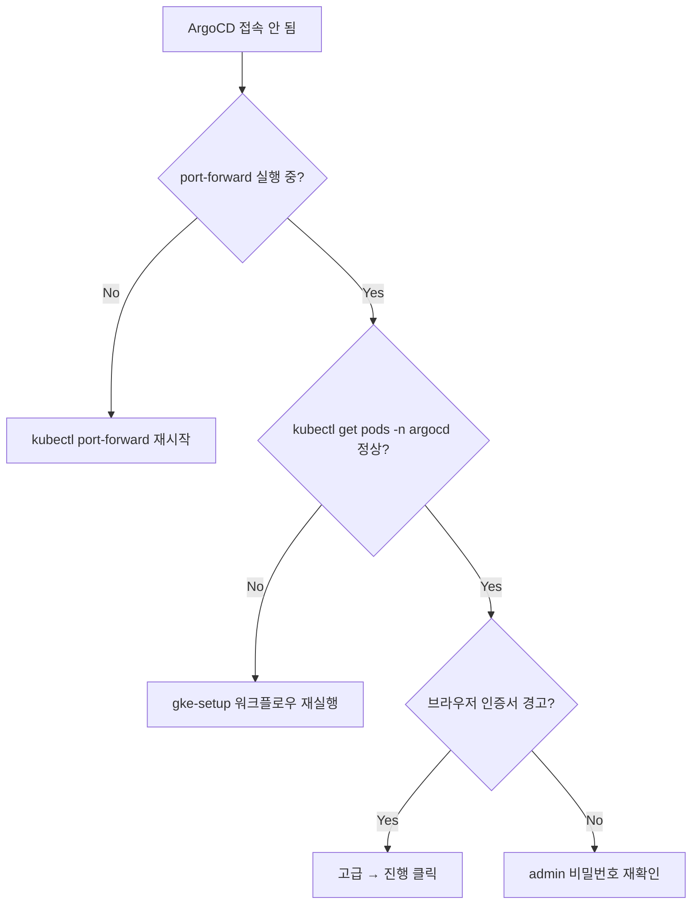

# ArgoCD 접속 가이드

> dev: `parkgolf-dev-cluster` (asia-northeast3-a) / namespace `argocd`
> prod: 추후 `parkgolf-prod-cluster`

## 1. 사전 요구사항

| 항목 | 확인 |
|---|---|
| `gcloud` CLI 인증 | `gcloud auth list`에 활성 계정 있어야 함 |
| `kubectl` 설치 | `kubectl version --client` |
| `gke-gcloud-auth-plugin` | gcloud components install gke-gcloud-auth-plugin |
| GKE 클러스터 권한 | `roles/container.developer` 이상 |

## 2. kubectl 컨텍스트 연결

```bash
gcloud container clusters get-credentials parkgolf-dev-cluster \
  --zone=asia-northeast3-a \
  --project=parkgolf-uniyous

kubectl config current-context     # 현재 컨텍스트 확인
kubectl get pods -n argocd         # ArgoCD pod 정상 여부 확인
```

## 3. 접속 방법

### 3.1 port-forward (권장 — dev)

가장 단순. 로컬 8080 포트로 ArgoCD UI 노출.

```bash
kubectl port-forward svc/argocd-server -n argocd 8080:443
```

브라우저: <https://localhost:8080>

> self-signed 인증서 경고 → "고급 → 안전하지 않음으로 이동" 진행 (dev 환경 한정)

백그라운드 실행:
```bash
nohup kubectl port-forward svc/argocd-server -n argocd 8080:443 > /tmp/argocd-pf.log 2>&1 &
echo $! > /tmp/argocd-pf.pid

# 종료
kill $(cat /tmp/argocd-pf.pid)
```

### 3.2 LoadBalancer (옵션)

외부 노출이 필요하면 (CI/CD에서 직접 접근 등):

```bash
kubectl patch svc argocd-server -n argocd \
  -p '{"spec": {"type": "LoadBalancer"}}'

# 외부 IP 확인
kubectl get svc argocd-server -n argocd -w
```

> ⚠️ Public 노출 시 dev라도 접근 제한 고려 (방화벽/Identity-Aware Proxy 권장)

## 4. 인증

### 4.1 초기 admin 비밀번호

설치 직후 자동 생성된 임시 비밀번호:

```bash
kubectl -n argocd get secret argocd-initial-admin-secret \
  -o jsonpath='{.data.password}' | base64 -d; echo
```

| Username | `admin` |
| Password | 위 명령 출력값 |

### 4.2 비밀번호 변경

UI에서: 좌측 하단 User Info → Update Password

CLI에서:
```bash
# argocd CLI 설치
brew install argocd

# 로그인 (port-forward 가동 중)
argocd login localhost:8080 --username admin --password <초기비밀번호> --insecure

# 변경
argocd account update-password
```

비밀번호 변경 후 `argocd-initial-admin-secret`은 삭제해도 무방:
```bash
kubectl -n argocd delete secret argocd-initial-admin-secret
```

## 5. 일상 사용

### 5.1 UI에서 확인할 핵심 정보

```
APPLICATIONS 화면
  └─ parkgolf 카드 클릭
       ├─ SYNC STATUS:    Synced / OutOfSync
       ├─ HEALTH STATUS:  Healthy / Progressing / Degraded / Missing
       ├─ APP DETAILS:    Source repo, target revision, helm values
       └─ Tree view:      모든 K8s 리소스의 상태/이벤트
```

### 5.2 자주 쓰는 작업

| 작업 | UI | CLI |
|---|---|---|
| 강제 sync | Application → SYNC | `argocd app sync parkgolf` |
| Hard refresh (git pull) | Application → REFRESH (drop-down → Hard Refresh) | `argocd app get parkgolf --hard-refresh` |
| 특정 리소스 sync | Tree에서 리소스 우클릭 → Sync | `argocd app sync parkgolf --resource <kind>:<name>` |
| Rollback | History → 이전 commit 선택 → Rollback | `argocd app rollback parkgolf <id>` |
| 로그 확인 | Tree → Pod 클릭 → LOGS | `kubectl logs -n parkgolf-dev <pod>` |

### 5.3 sync 충돌 시

```
"another operation is already in progress"
  → 정상. 진행 중인 sync가 끝나면 자동 재시도. 무시 가능.

"unable to recognize ... no matches for kind"
  → CRD 미설치 또는 API 버전 mismatch (ESO v1beta1 → v1 같은 케이스)
  → Hard Refresh로 해결되지 않으면 매니페스트 수정 필요.
```

## 6. 트러블슈팅



### 자주 보는 에러

| 증상 | 원인 | 해결 |
|---|---|---|
| `connection refused` localhost:8080 | port-forward 안 됨 | `lsof -i :8080`로 확인 후 재실행 |
| 로그인 후 Application 안 보임 | RBAC 미설정 | UI에서 admin 로그인 확인, `argocd-cm` ConfigMap의 `policy.csv` 점검 |
| OutOfSync 영구 지속 | 자동 sync 비활성 | Application의 `syncPolicy.automated` 활성화 또는 수동 SYNC 실행 |
| Application Missing health | CRD/리소스 sync 실패 | Tree view에서 빨간색 리소스 클릭 → Events 확인 |
| Hard refresh 후에도 옛 manifest | repo cache | argocd-repo-server pod 재시작 (`kubectl rollout restart deploy/argocd-repo-server -n argocd`) |

## 7. 주요 리소스 위치

| 리소스 | 위치 |
|---|---|
| ArgoCD 설치 매니페스트 | `https://raw.githubusercontent.com/argoproj/argo-cd/stable/manifests/install.yaml` |
| Application 정의 | `k8s/argocd/application.yaml` |
| 동기화 대상 Helm chart | `k8s/charts/parkgolf/` |
| 로컬 명령 가이드 (설치/복원) | `k8s/argocd/install.md` |

## 8. 참고

- ArgoCD 공식 문서: <https://argo-cd.readthedocs.io>
- 대상 chart 설계: SAGA.md / 워크로드 분리 정책
- 배포 흐름:
  ```
  CD Services (GHA) → values.yaml의 image tag commit → ArgoCD 자동 감지 → sync
  ```
