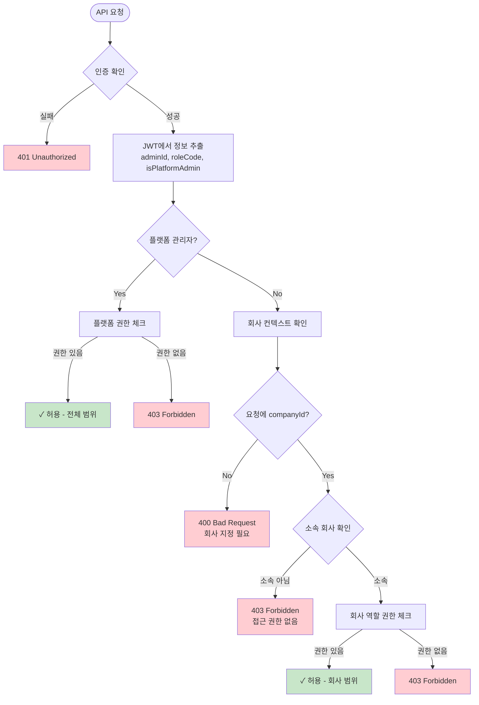
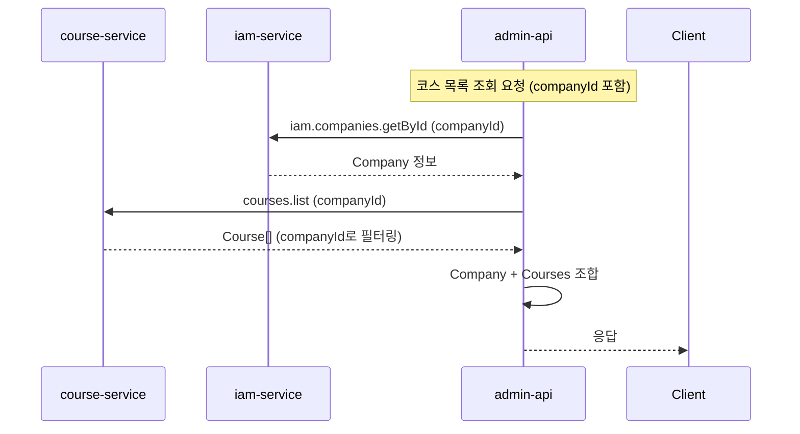

# IAM Service 마이그레이션 설계

> 작성일: 2026-01-12
> 버전: 1.0 (Draft)

## 목차
1. [개요](#1-개요)
2. [변경 범위](#2-변경-범위)
3. [새로운 스키마 설계](#3-새로운-스키마-설계)
4. [역할 및 권한 구조](#4-역할-및-권한-구조)
5. [서비스 간 연동](#5-서비스-간-연동)
6. [마이그레이션 계획](#6-마이그레이션-계획)
7. [NATS 패턴 변경](#7-nats-패턴-변경)

---

## 1. 개요

### 1.1 변경 목적
- 회사(Company) 기반 관리자 권한 체계 구현
- 본사(플랫폼) 관리자와 가맹점(회사) 관리자 분리
- 서비스명을 역할에 맞게 변경 (`auth-service` → `iam-service`)

### 1.2 명명 규칙

| 구분 | 변경 전 | 변경 후 |
|------|--------|--------|
| 서비스 디렉토리 | `services/auth-service` | `services/iam-service` |
| 패키지명 | `@parkgolf/auth-service` | `@parkgolf/iam-service` |
| 데이터베이스 | `auth_db` | `iam_db` |
| Docker 이미지 | `auth-service` | `iam-service` |
| Cloud Run 서비스 | `auth-service-dev/prod` | `iam-service-dev/prod` |
| NATS 패턴 | `auth.*`, `users.*`, `admins.*` | `iam.auth.*`, `iam.users.*`, `iam.admins.*`, `iam.companies.*` |

---

## 2. 변경 범위

### 2.1 파일 변경 목록

```
services/
├── auth-service/           → iam-service/ (디렉토리 이름 변경)
│   ├── package.json        (패키지명 변경)
│   ├── Dockerfile          (서비스명 변경)
│   ├── prisma/
│   │   └── schema.prisma   (DB명 변경 + Company 추가)
│   └── src/
│       ├── main.ts         (서비스명 로그)
│       ├── app.module.ts   (모듈 구조)
│       ├── auth/           (NATS 패턴 변경)
│       ├── admin/          (NATS 패턴 변경)
│       ├── user/           (NATS 패턴 변경)
│       └── company/        (신규 모듈)
│
├── admin-api/
│   └── src/
│       ├── auth/           (NATS 패턴 변경)
│       ├── admins/         (NATS 패턴 변경)
│       ├── users/          (NATS 패턴 변경)
│       └── companies/      (NATS 패턴 변경 - iam-service로)
│
├── user-api/
│   └── src/
│       ├── auth/           (NATS 패턴 변경)
│       └── users/          (NATS 패턴 변경)
│
├── course-service/
│   └── prisma/schema.prisma (Company 참조 방식 변경)
│
└── booking-service/         (변경 없음)

.github/workflows/
├── cd-services.yml          (서비스 목록 변경)
└── ci.yml                   (서비스 목록 변경)

apps/admin-dashboard/
└── src/
    └── lib/api/             (회사 API 추가)
```

### 2.2 데이터베이스 변경

| DB | 변경 내용 |
|----|----------|
| `auth_db` → `iam_db` | Company 테이블 추가, AdminCompany 추가, Admin 수정 |
| `course_db` | Company 테이블 제거, companyId만 보관 (FK 제거) |

---

## 3. 새로운 스키마 설계

### 3.1 iam_db 스키마 (Prisma)

```prisma
// ==============================================
// iam-service / iam_db - Schema v4
// Identity & Access Management
// ==============================================

generator client {
  provider = "prisma-client-js"
}

datasource db {
  provider = "postgresql"
  url      = env("DATABASE_URL")
}

// ==============================================
// Company (회사/가맹점)
// ==============================================
model Company {
  id              Int             @id @default(autoincrement())
  name            String
  code            String          @unique  // 회사 코드 (예: "GANGNAM-GC")
  description     String?
  businessNumber  String?         @unique @map("business_number")

  // 연락처 정보
  address         String?
  phoneNumber     String?         @map("phone_number")
  email           String?         @unique
  website         String?
  logoUrl         String?         @map("logo_url")

  // 상태
  status          CompanyStatus   @default(ACTIVE)
  isActive        Boolean         @default(true) @map("is_active")

  // 메타데이터
  metadata        Json?           // 추가 설정 (운영시간, 정책 등)

  createdAt       DateTime        @default(now()) @map("created_at")
  updatedAt       DateTime        @updatedAt @map("updated_at")

  // 관계
  adminCompanies  AdminCompany[]

  @@index([code])
  @@index([status])
  @@index([isActive])
  @@map("companies")
}

enum CompanyStatus {
  ACTIVE      // 정상 운영
  INACTIVE    // 비활성
  SUSPENDED   // 정지
  PENDING     // 승인 대기
}

// ==============================================
// AdminCompany (관리자-회사 연결)
// ==============================================
model AdminCompany {
  id              Int         @id @default(autoincrement())
  adminId         Int         @map("admin_id")
  companyId       Int         @map("company_id")
  companyRoleCode String      @map("company_role_code")  // 회사 내 역할

  isPrimary       Boolean     @default(false) @map("is_primary")  // 주 소속 회사
  isActive        Boolean     @default(true) @map("is_active")

  createdAt       DateTime    @default(now()) @map("created_at")
  updatedAt       DateTime    @updatedAt @map("updated_at")

  // 관계
  admin           Admin       @relation(fields: [adminId], references: [id], onDelete: Cascade)
  company         Company     @relation(fields: [companyId], references: [id], onDelete: Cascade)
  companyRole     RoleMaster  @relation("CompanyRole", fields: [companyRoleCode], references: [code])

  @@unique([adminId, companyId])
  @@index([adminId])
  @@index([companyId])
  @@index([companyRoleCode])
  @@map("admin_companies")
}

// ==============================================
// Admin (관리자)
// ==============================================
model Admin {
  id              Int                 @id @default(autoincrement())
  email           String              @unique
  password        String
  name            String

  // 플랫폼 역할 (본사 관리자용)
  roleCode        String              @default("VIEWER") @map("role_code")
  isPlatformAdmin Boolean             @default(false) @map("is_platform_admin")

  // 프로필
  phone           String?
  department      String?
  description     String?
  avatarUrl       String?             @map("avatar_url")

  // 상태
  isActive        Boolean             @default(true) @map("is_active")
  lastLoginAt     DateTime?           @map("last_login_at")

  createdAt       DateTime            @default(now()) @map("created_at")
  updatedAt       DateTime            @updatedAt @map("updated_at")

  // 관계
  role            RoleMaster          @relation("PlatformRole", fields: [roleCode], references: [code])
  companies       AdminCompany[]      // 소속 회사들
  activityLogs    AdminActivityLog[]
  refreshTokens   AdminRefreshToken[]

  @@index([roleCode])
  @@index([isActive])
  @@index([isPlatformAdmin])
  @@index([createdAt])
  @@map("admins")
}

// ==============================================
// User (일반 사용자)
// ==============================================
model User {
  id            Int              @id @default(autoincrement())
  email         String           @unique
  password      String
  name          String?
  phone         String?

  roleCode      String           @default("USER") @map("role_code")
  isActive      Boolean          @default(true) @map("is_active")

  createdAt     DateTime         @default(now()) @map("created_at")
  updatedAt     DateTime         @updatedAt @map("updated_at")

  // 관계
  role          RoleMaster       @relation(fields: [roleCode], references: [code])
  refreshTokens RefreshToken[]

  @@index([roleCode])
  @@index([isActive])
  @@map("users")
}

// ==============================================
// Role & Permission Masters
// ==============================================
model RoleMaster {
  code        String   @id
  name        String
  description String?

  // 역할 분류
  userType    String   @map("user_type")  // 'ADMIN' | 'USER'
  scope       String   @default("PLATFORM")  // 'PLATFORM' | 'COMPANY'
  level       Int      @default(1)

  isActive    Boolean  @default(true) @map("is_active")
  createdAt   DateTime @default(now()) @map("created_at")
  updatedAt   DateTime @updatedAt @map("updated_at")

  // 관계
  users               User[]
  platformAdmins      Admin[]         @relation("PlatformRole")
  companyAdmins       AdminCompany[]  @relation("CompanyRole")
  rolePermissions     RolePermission[]

  @@index([userType])
  @@index([scope])
  @@index([isActive])
  @@map("role_masters")
}

model PermissionMaster {
  code        String   @id
  name        String
  description String?
  category    String   // 'COMPANY', 'BOOKING', 'COURSE', 'USER', 'ADMIN', 'ANALYTICS'
  level       String   @default("low")  // 'low', 'medium', 'high'
  isActive    Boolean  @default(true) @map("is_active")
  createdAt   DateTime @default(now()) @map("created_at")
  updatedAt   DateTime @updatedAt @map("updated_at")

  rolePermissions RolePermission[]

  @@index([category])
  @@index([isActive])
  @@map("permission_masters")
}

model RolePermission {
  roleCode       String   @map("role_code")
  permissionCode String   @map("permission_code")
  createdAt      DateTime @default(now()) @map("created_at")

  role           RoleMaster       @relation(fields: [roleCode], references: [code], onDelete: Cascade)
  permission     PermissionMaster @relation(fields: [permissionCode], references: [code], onDelete: Cascade)

  @@id([roleCode, permissionCode])
  @@index([roleCode])
  @@index([permissionCode])
  @@map("role_permissions")
}

// ==============================================
// Tokens & Logs
// ==============================================
model RefreshToken {
  id        Int      @id @default(autoincrement())
  token     String   @unique
  userId    Int      @map("user_id")
  expiresAt DateTime @map("expires_at")
  createdAt DateTime @default(now()) @map("created_at")
  user      User     @relation(fields: [userId], references: [id], onDelete: Cascade)

  @@map("refresh_tokens")
}

model AdminRefreshToken {
  id        Int      @id @default(autoincrement())
  token     String   @unique
  adminId   Int      @map("admin_id")
  expiresAt DateTime @map("expires_at")
  createdAt DateTime @default(now()) @map("created_at")
  admin     Admin    @relation(fields: [adminId], references: [id], onDelete: Cascade)

  @@map("admin_refresh_tokens")
}

model AdminActivityLog {
  id        Int      @id @default(autoincrement())
  adminId   Int      @map("admin_id")
  companyId Int?     @map("company_id")  // 회사 컨텍스트 (있는 경우)
  action    String
  resource  String?
  details   Json?
  ipAddress String?  @map("ip_address")
  userAgent String?  @map("user_agent")
  createdAt DateTime @default(now()) @map("created_at")
  admin     Admin    @relation(fields: [adminId], references: [id], onDelete: Cascade)

  @@index([adminId])
  @@index([companyId])
  @@index([createdAt])
  @@map("admin_activity_logs")
}
```

### 3.2 course_db 스키마 변경

```prisma
// course_db - Company 제거 후

// Company 테이블 삭제
// - Company 모델 제거
// - CompanyStatus enum 제거

// Club 수정
model Club {
  id             Int        @id @default(autoincrement())
  name           String
  companyId      Int        @map("company_id")  // FK 제거, 단순 참조 ID만 보관
  // ... 나머지 동일
  // company 관계 제거

  @@index([companyId])  // 인덱스는 유지
  @@map("clubs")
}

// Course 수정
model Course {
  id          Int      @id @default(autoincrement())
  companyId   Int      @map("company_id")  // FK 제거, 단순 참조 ID만 보관
  // ... 나머지 동일
  // company 관계 제거

  @@index([companyId])  // 인덱스는 유지
  @@map("courses")
}
```

---

## 4. 역할 및 권한 구조

### 4.1 역할 마스터 데이터

```sql
-- 플랫폼 역할 (본사)
INSERT INTO role_masters (code, name, description, user_type, scope, level) VALUES
('PLATFORM_ADMIN', '플랫폼 관리자', '시스템 전체 관리', 'ADMIN', 'PLATFORM', 100),
('PLATFORM_SUPPORT', '플랫폼 고객지원', '전체 고객지원 담당', 'ADMIN', 'PLATFORM', 80),
('PLATFORM_VIEWER', '플랫폼 뷰어', '전체 조회 권한', 'ADMIN', 'PLATFORM', 20);

-- 회사 역할 (가맹점)
INSERT INTO role_masters (code, name, description, user_type, scope, level) VALUES
('COMPANY_ADMIN', '회사 관리자', '회사 전체 관리', 'ADMIN', 'COMPANY', 60),
('COMPANY_MANAGER', '회사 매니저', '회사 운영 관리', 'ADMIN', 'COMPANY', 40),
('COMPANY_STAFF', '회사 스태프', '현장 운영', 'ADMIN', 'COMPANY', 20);

-- 사용자 역할
INSERT INTO role_masters (code, name, description, user_type, scope, level) VALUES
('USER', '일반 사용자', '일반 회원', 'USER', 'PLATFORM', 10),
('VIP', 'VIP 사용자', 'VIP 회원', 'USER', 'PLATFORM', 20),
('GUEST', '게스트', '비회원', 'USER', 'PLATFORM', 1);
```

### 4.2 권한 매트릭스

```
┌──────────────────┬────────┬────────┬────────┬────────┬────────┬────────┐
│     권한         │PLATFORM│PLATFORM│PLATFORM│COMPANY │COMPANY │COMPANY │
│                  │ ADMIN  │SUPPORT │ VIEWER │ ADMIN  │MANAGER │ STAFF  │
├──────────────────┼────────┼────────┼────────┼────────┼────────┼────────┤
│ COMPANIES        │   ✓    │   -    │   R    │   -    │   -    │   -    │
│ COURSES          │   ✓    │   R    │   R    │   ✓    │   ✓    │   R    │
│ TIMESLOTS        │   ✓    │   R    │   R    │   ✓    │   ✓    │   ✓    │
│ BOOKINGS         │   ✓    │   ✓    │   R    │   ✓    │   ✓    │   ✓    │
│ USERS            │   ✓    │   ✓    │   R    │   R    │   R    │   -    │
│ ADMINS           │   ✓    │   -    │   -    │   ✓*   │   -    │   -    │
│ ANALYTICS        │   ✓    │   ✓    │   ✓    │   ✓    │   ✓    │   R    │
│ SUPPORT          │   ✓    │   ✓    │   -    │   ✓    │   ✓    │   ✓    │
│ SETTINGS         │   ✓    │   -    │   -    │   ✓    │   -    │   -    │
└──────────────────┴────────┴────────┴────────┴────────┴────────┴────────┘

✓ = 전체 권한 (CRUD)
R = 읽기 권한만
- = 권한 없음
* = 자사 관리자만 관리 가능
```

### 4.3 권한 체크 다이어그램



---

## 5. 서비스 간 연동

### 5.1 아키텍처

```
┌─────────────────────────────────────────────────────────────────────────┐
│                              클라이언트                                   │
│                    (admin-dashboard, user-webapp)                        │
└─────────────────────────────┬───────────────────────────────────────────┘
                              │
                              ▼
┌─────────────────────────────────────────────────────────────────────────┐
│                           API Gateway                                    │
│                      (admin-api, user-api)                               │
└───────┬─────────────────────┬─────────────────────┬─────────────────────┘
        │                     │                     │
        ▼                     ▼                     ▼
┌───────────────┐    ┌───────────────┐    ┌───────────────┐
│  iam-service  │    │course-service │    │booking-service│
│    (iam_db)   │    │  (course_db)  │    │ (booking_db)  │
└───────────────┘    └───────────────┘    └───────────────┘
        │                     │                     │
        └─────────────────────┴─────────────────────┘
                              │
                              ▼
                    ┌───────────────┐
                    │ notify-service│
                    │  (notify_db)  │
                    └───────────────┘
```

### 5.2 회사 정보 조회 흐름



### 5.3 companyId 참조 방식

```typescript
// course-service에서 Company 정보가 필요한 경우
// NATS를 통해 iam-service에 요청

// 예: 클럽 생성 시 회사 검증
async createClub(data: CreateClubDto) {
  // iam-service에 회사 존재 여부 확인
  const company = await this.natsClient.send('iam.companies.getById', {
    companyId: data.companyId
  });

  if (!company) {
    throw new NotFoundException('Company not found');
  }

  // 클럽 생성 (companyId만 저장)
  return this.clubRepository.create({
    ...data,
    companyId: data.companyId  // FK 없이 ID만 저장
  });
}
```

---

## 6. 마이그레이션 계획

### 6.1 Phase 1: 준비 (코드 변경 없음)

```
[ ] 1.1 새 데이터베이스 생성 (iam_db)
[ ] 1.2 기존 auth_db 백업
[ ] 1.3 course_db.companies 데이터 백업
```

### 6.2 Phase 2: 스키마 마이그레이션

```
[ ] 2.1 iam_db에 새 스키마 적용
    - Company 테이블 생성
    - AdminCompany 테이블 생성
    - Admin 테이블 수정 (isPlatformAdmin 추가)
    - RoleMaster에 scope 컬럼 추가

[ ] 2.2 데이터 마이그레이션
    - auth_db.users → iam_db.users
    - auth_db.admins → iam_db.admins
    - auth_db.role_masters → iam_db.role_masters
    - auth_db.permission_masters → iam_db.permission_masters
    - course_db.companies → iam_db.companies

[ ] 2.3 새 역할 마스터 데이터 추가
    - PLATFORM_ADMIN, PLATFORM_SUPPORT, PLATFORM_VIEWER
    - COMPANY_ADMIN, COMPANY_MANAGER, COMPANY_STAFF
```

### 6.3 Phase 3: 서비스 코드 변경

```
[ ] 3.1 auth-service → iam-service 이름 변경
    - 디렉토리 이름 변경
    - package.json 수정
    - Dockerfile 수정

[ ] 3.2 iam-service 코드 수정
    - prisma/schema.prisma 업데이트
    - Company 모듈 추가
    - AdminCompany 로직 추가
    - NATS 패턴 변경

[ ] 3.3 course-service 수정
    - Company 모델/관계 제거
    - companyId 참조 방식 변경

[ ] 3.4 admin-api 수정
    - NATS 패턴 변경
    - 권한 체크 로직 추가
    - 회사 컨텍스트 처리

[ ] 3.5 user-api 수정
    - NATS 패턴 변경
```

### 6.4 Phase 4: 인프라 변경

```
[ ] 4.1 GitHub Workflows 수정
    - cd-services.yml: auth-service → iam-service
    - ci.yml: 서비스 목록 업데이트

[ ] 4.2 Cloud Run 배포
    - 새 서비스(iam-service) 배포
    - 기존 서비스(auth-service) 유지 (전환 기간)

[ ] 4.3 환경변수 업데이트
    - DATABASE_URL 변경
    - 서비스 URL 업데이트
```

### 6.5 Phase 5: 검증 및 정리

```
[ ] 5.1 기능 테스트
    - 로그인/로그아웃
    - 권한 체크
    - 회사별 데이터 접근

[ ] 5.2 E2E 테스트 업데이트

[ ] 5.3 기존 리소스 정리
    - auth_db 삭제 (백업 후)
    - auth-service Cloud Run 서비스 삭제
    - course_db.companies 테이블 삭제
```

---

## 7. NATS 패턴 변경

### 7.1 패턴 매핑

| 기존 패턴 | 새 패턴 | 서비스 |
|----------|--------|--------|
| `auth.login` | `iam.auth.login` | iam-service |
| `auth.register` | `iam.auth.register` | iam-service |
| `auth.validateToken` | `iam.auth.validateToken` | iam-service |
| `auth.refreshToken` | `iam.auth.refreshToken` | iam-service |
| `users.list` | `iam.users.list` | iam-service |
| `users.getById` | `iam.users.getById` | iam-service |
| `admins.list` | `iam.admins.list` | iam-service |
| `admins.getById` | `iam.admins.getById` | iam-service |
| `admins.create` | `iam.admins.create` | iam-service |
| `roles.list` | `iam.roles.list` | iam-service |
| `permissions.list` | `iam.permissions.list` | iam-service |
| - | `iam.companies.list` | iam-service (신규) |
| - | `iam.companies.getById` | iam-service (신규) |
| - | `iam.companies.create` | iam-service (신규) |
| - | `iam.admins.companies` | iam-service (신규) |
| `company.*` (course-service) | 제거 | - |

### 7.2 새 NATS 패턴 상세

```typescript
// iam-service NATS Patterns

// Auth
'iam.auth.login'
'iam.auth.adminLogin'
'iam.auth.register'
'iam.auth.validateToken'
'iam.auth.refreshToken'
'iam.auth.logout'

// Users
'iam.users.list'
'iam.users.getById'
'iam.users.create'
'iam.users.update'
'iam.users.delete'
'iam.users.updateStatus'

// Admins
'iam.admins.list'
'iam.admins.getById'
'iam.admins.create'
'iam.admins.update'
'iam.admins.delete'
'iam.admins.updateStatus'
'iam.admins.companies'        // 관리자의 소속 회사 목록
'iam.admins.assignCompany'    // 관리자에게 회사 할당
'iam.admins.removeCompany'    // 관리자에서 회사 제거

// Companies
'iam.companies.list'
'iam.companies.getById'
'iam.companies.getByCode'
'iam.companies.create'
'iam.companies.update'
'iam.companies.delete'
'iam.companies.updateStatus'
'iam.companies.admins'        // 회사의 관리자 목록

// Roles & Permissions
'iam.roles.list'
'iam.roles.getByCode'
'iam.roles.permissions'
'iam.permissions.list'
'iam.permissions.getByCode'
```

---

## 변경 이력

| 버전 | 날짜 | 작성자 | 변경 내용 |
|------|------|--------|----------|
| 1.0 | 2026-01-12 | - | 초안 작성 |
