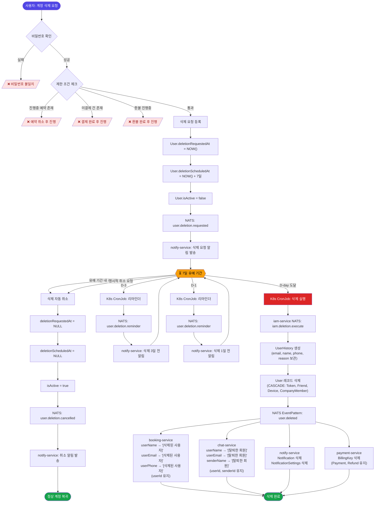

# 계정 삭제 정책 (Account Deletion Policy)

> 최종 수정일: 2026-02-16 (v2.1)

## 1. 개요

Park Golf Platform의 사용자 계정 삭제 정책을 정의합니다. 이 정책은 개인정보보호법 및 세법상 요건을 준수하면서 사용자의 탈퇴 권리를 보장합니다.

---

## 2. 데이터 분포 현황

### 2.1 서비스별 사용자 데이터

| 서비스 | 테이블 | 사용자 참조 필드 | 삭제 시 처리 |
|--------|--------|-----------------|-------------|
| **iam-service** | User | 원본 데이터 | 삭제 (UserHistory에 이력 보관) |
| **iam-service** | RefreshToken | userId (CASCADE) | 자동 삭제 |
| **iam-service** | FriendRequest | fromUserId, toUserId (CASCADE) | 자동 삭제 |
| **iam-service** | Friendship | userId, friendId (CASCADE) | 자동 삭제 |
| **iam-service** | UserNotificationSetting | userId (CASCADE) | 자동 삭제 |
| **iam-service** | UserDevice | userId (CASCADE) | 자동 삭제 |
| **iam-service** | CompanyMember | userId (CASCADE) | 자동 삭제 |
| **iam-service** | UserHistory | 신규 테이블 | 영구 보관 |
| **booking-service** | Booking | userId, userName, userEmail, userPhone | userId 유지, 나머지 플레이스홀더 처리 |
| **booking-service** | UserNoShowRecord | userId | userId 유지 (감사) |
| **booking-service** | Payment (booking) | booking 참조 | 유지 (세무) |
| **booking-service** | BookingHistory | userId | 유지 (감사) |
| **booking-service** | Refund | - | 유지 (세무) |
| **payment-service** | Payment | userId, bookingId | 유지 (세무) |
| **payment-service** | Refund | - | 유지 (세무) |
| **payment-service** | BillingKey | userId | 삭제 |
| **chat-service** | ChatRoomMember | userId, userName, userEmail | userId 유지, 나머지 플레이스홀더 처리 |
| **chat-service** | ChatMessage | senderId, senderName | senderId 유지, senderName 플레이스홀더 처리 |
| **notify-service** | Notification | userId | 완전 삭제 |
| **notify-service** | NotificationSettings | userId | 완전 삭제 |
| **course-service** | - | 사용자 데이터 없음 | 처리 불필요 |

### 2.2 CASCADE 자동 삭제 관계 (iam-service)

```
User 삭제 시 (Prisma CASCADE):
├─ RefreshToken       → 자동 삭제
├─ FriendRequest      → 자동 삭제 (fromUserId, toUserId 양방향)
├─ Friendship         → 자동 삭제 (userId, friendId 양방향)
├─ UserNotificationSetting → 자동 삭제
├─ UserDevice         → 자동 삭제 (푸시 토큰)
└─ CompanyMember      → 자동 삭제 (가맹점 회원 연결)
```

---

## 3. 데이터베이스 스키마

### 3.1 UserHistory 테이블 (신규 - 미구현)

삭제된 사용자의 기본 정보를 보관하여 결제/예약 이력 확인 시 참조합니다.

```prisma
// iam-service/prisma/schema.prisma

model UserHistory {
  id              Int       @id @default(autoincrement())
  originalUserId  Int       @unique @map("original_user_id")  // 원래 User.id
  email           String                                       // 삭제 시점 이메일
  name            String?                                      // 삭제 시점 이름
  phone           String?                                      // 삭제 시점 전화번호

  deletionReason  String?   @map("deletion_reason")            // 탈퇴 사유
  deletedAt       DateTime  @default(now()) @map("deleted_at") // 삭제 시점

  createdAt       DateTime  @default(now()) @map("created_at")

  @@index([originalUserId])
  @@index([email])
  @@map("user_histories")
}
```

### 3.2 User 모델 확장 (미구현)

```prisma
model User {
  // 기존 필드 (현재 상태)
  id              Int       @id @default(autoincrement())
  email           String    @unique
  password        String
  passwordChangedAt DateTime? @map("password_changed_at")
  name            String?
  phone           String?
  profileImageUrl String?   @map("profile_image_url")
  roleCode        String    @default("USER") @map("role_code")
  isActive        Boolean   @default(true) @map("is_active")
  createdAt       DateTime  @default(now()) @map("created_at")
  updatedAt       DateTime  @updatedAt @map("updated_at")

  // 삭제 관련 필드 (추가 예정)
  deletionRequestedAt  DateTime?  @map("deletion_requested_at")
  deletionScheduledAt  DateTime?  @map("deletion_scheduled_at")

  @@map("users")
}
```

---

## 4. 삭제 프로세스

### 4.1 전체 워크플로우



### 4.2 삭제 제한 조건

다음 조건에 해당하면 계정 삭제를 진행할 수 없습니다:

| 조건 | 상태 | 해결 방법 |
|------|------|----------|
| 진행 중인 예약 | PENDING, SLOT_RESERVED, CONFIRMED | 예약 취소 후 진행 |
| 미결제 건 | Payment.status != COMPLETED | 결제 완료 후 진행 |
| 환불 진행 중 | Refund.status = PENDING / PROCESSING | 환불 완료 후 진행 |

### 4.3 유예 기간

- **기간**: 7일
- **취소 방법**: 유예 기간 내 로그인 시 자동 취소 또는 명시적 취소 요청
- **알림**: 삭제 요청 시, 삭제 3일 전, 삭제 1일 전 알림 발송

---

## 5. 스케줄러 (Kubernetes CronJob)

### 5.1 개요

7일 유예 기간 관리 및 최종 삭제 실행을 **Kubernetes CronJob**으로 처리합니다. 서비스 Pod 내부 Cron과 달리 Pod 다중 인스턴스에서의 중복 실행 문제가 없고, 운영 환경(prod)에서 안정적으로 동작합니다.

### 5.2 CronJob 정의

| CronJob | 스케줄 | 역할 |
|---------|--------|------|
| `deletion-reminder` | `0 9 * * *` (매일 09:00) | D-3, D-1 사용자 조회 → 리마인더 알림 발송 |
| `deletion-executor` | `0 3 * * *` (매일 03:00) | `deletionScheduledAt <= NOW()` 사용자 조회 → 최종 삭제 실행 |

### 5.3 동작 방식

CronJob은 iam-service에 NATS 메시지를 보내 처리를 위임합니다.

```
K8s CronJob Pod (경량 Node.js 스크립트)
    │
    ├─ NATS send: iam.deletion.processReminders
    │     → iam-service: D-3, D-1 사용자 조회 → user.deletion.reminder 발행
    │
    └─ NATS send: iam.deletion.execute
          → iam-service: 만료 사용자 조회 → UserHistory 생성 → User 삭제 → user.deleted 발행
```

### 5.4 K8s 매니페스트 (예시)

```yaml
apiVersion: batch/v1
kind: CronJob
metadata:
  name: deletion-executor
  namespace: parkgolf-prod
spec:
  schedule: "0 3 * * *"
  concurrencyPolicy: Forbid
  successfulJobsHistoryLimit: 3
  failedJobsHistoryLimit: 3
  jobTemplate:
    spec:
      backoffLimit: 2
      activeDeadlineSeconds: 300
      template:
        spec:
          restartPolicy: OnFailure
          containers:
            - name: deletion-executor
              image: node:20-alpine
              command: ["node", "/app/scripts/deletion-executor.js"]
              env:
                - name: NATS_URL
                  value: "nats://nats:4222"
```

---

## 6. NATS 이벤트

### 6.1 이벤트 정의

| 이벤트 | 발행 서비스 | 발행 시점 | 구독 서비스 |
|--------|-----------|----------|------------|
| `user.deletion.requested` | iam-service | 삭제 요청 시 | notify-service |
| `user.deletion.cancelled` | iam-service | 삭제 취소 시 | notify-service |
| `user.deletion.reminder` | iam-service | 삭제 3일/1일 전 | notify-service |
| `user.deleted` | iam-service | 최종 삭제 시 | booking, chat, notify, payment |

### 6.2 이벤트 페이로드

```typescript
// user.deletion.requested
{
  userId: number;
  email: string;
  deletionScheduledAt: string; // ISO8601
}

// user.deleted
{
  userId: number;
  originalEmail: string;
  deletedAt: string; // ISO8601
}
```

### 6.3 처리 순서

```
[Scheduler: 삭제 예정일 도달]
        │
        ▼
[iam-service: UserHistory 생성]
        │
        ▼
[iam-service: User 삭제] ──► NATS EventPattern: user.deleted
        │
        ├──► [booking-service] 예약 익명화
        │      userName → '[삭제된 사용자]'
        │      userEmail → '[삭제된 사용자]'
        │      userPhone → '[삭제된 사용자]'
        │      (userId 유지 — UserHistory JOIN용)
        ├──► [chat-service] 채팅 익명화
        │      ChatRoomMember: userName → '[탈퇴한 회원]', userEmail → '[탈퇴한 회원]'
        │      ChatMessage: senderName → '[탈퇴한 회원]'
        │      (userId, senderId 유지)
        ├──► [notify-service] 알림/설정 완전 삭제
        └──► [payment-service] BillingKey 삭제
```

---

## 7. API 명세

### 7.1 엔드포인트 (user-api)

| Method | Endpoint | 설명 |
|--------|----------|------|
| POST | `/api/user/account/delete-request` | 계정 삭제 요청 |
| POST | `/api/user/account/delete-cancel` | 삭제 요청 취소 |
| GET | `/api/user/account/delete-status` | 삭제 상태 조회 |

### 7.2 관리자 엔드포인트 (admin-api)

| Method | Endpoint | 설명 | 현재 상태 |
|--------|----------|------|----------|
| DELETE | `/api/admin/users/:userId` | 사용자 삭제 (관리자) | 구현됨 (즉시 삭제) |

> **참고:** 관리자 삭제는 유예 기간 없이 즉시 삭제됩니다. NATS 패턴 `iam.users.delete` 사용.

### 7.3 삭제 요청 API

**Request:**
```json
POST /api/user/account/delete-request
{
  "password": "현재비밀번호",
  "reason": "서비스 불만족",
  "confirmation": true
}
```

**Response (성공):**
```json
{
  "success": true,
  "data": {
    "message": "계정 삭제가 요청되었습니다.",
    "deletionScheduledAt": "2026-02-23T10:00:00Z",
    "canCancelUntil": "2026-02-23T09:59:59Z"
  }
}
```

**Response (실패 - 진행 중 예약 존재):**
```json
{
  "success": false,
  "error": {
    "code": "ACTIVE_BOOKING_EXISTS",
    "message": "진행 중인 예약이 있어 계정을 삭제할 수 없습니다.",
    "details": {
      "activeBookings": 2
    }
  }
}
```

### 7.4 삭제 취소 API

**Request:**
```json
POST /api/user/account/delete-cancel
```

**Response:**
```json
{
  "success": true,
  "data": {
    "message": "계정 삭제 요청이 취소되었습니다."
  }
}
```

### 7.5 삭제 상태 조회 API

**Response (삭제 예정):**
```json
{
  "success": true,
  "data": {
    "status": "SCHEDULED",
    "deletionRequestedAt": "2026-02-16T10:00:00Z",
    "deletionScheduledAt": "2026-02-23T10:00:00Z",
    "daysRemaining": 5
  }
}
```

**Response (정상):**
```json
{
  "success": true,
  "data": {
    "status": "ACTIVE",
    "deletionRequestedAt": null,
    "deletionScheduledAt": null
  }
}
```

---

## 8. 데이터 보관 정책

### 8.1 보관 기간

| 데이터 유형 | 보관 기간 | 근거 |
|------------|----------|------|
| UserHistory (기본 정보) | 영구 | 결제/예약 이력 참조용 |
| 예약/결제 기록 | 7년 | 세법 제121조 (거래 증빙 보관) |
| 환불 기록 | 7년 | 세법 제121조 |
| 채팅 기록 | 1년 | 서비스 운영 목적 |
| 알림 기록 | 즉시 삭제 | 보관 필요 없음 |

### 8.2 UserHistory 활용

```sql
-- 결제 내역 조회 시 삭제된 사용자 정보 JOIN
SELECT
  b.booking_number,
  b.total_price,
  COALESCE(u.name, uh.name, '[알 수 없음]') as user_name,
  COALESCE(u.email, uh.email, '[알 수 없음]') as user_email
FROM bookings b
LEFT JOIN users u ON b.user_id = u.id
LEFT JOIN user_histories uh ON b.user_id = uh.original_user_id
WHERE b.id = ?;
```

---

## 9. 클라이언트 UI

### 9.1 공통 UX 흐름

```
[프로필/설정] → [계정 삭제 메뉴] → [삭제 안내 화면] → [비밀번호 확인] → [7일 유예 요청]
                                                                              │
                                                                              ▼
                                                            [삭제 예정 상태 표시 (D-day)]
                                                                              │
                                                              ┌───────────────┼───────────────┐
                                                              ▼                               ▼
                                                    [유예 기간 내 로그인]              [7일 경과]
                                                    → 삭제 자동 취소                → 계정 영구 삭제
```

### 9.2 플랫폼별 구현 현황

| 플랫폼 | 진입점 | 삭제 화면 | API 연동 | 상태 |
|--------|--------|----------|---------|------|
| **user-app-web** | ProfilePage → "계정 삭제" 메뉴 | 미구현 (라우트만 존재) | 미구현 | ⚠️ 라우트만 준비 |
| **user-app-ios** | ProfileView → SettingsView | DeleteAccountView (placeholder) | 미구현 | ⚠️ 준비중 표시 |
| **user-app-android** | ProfileScreen → SettingsScreen | DeleteAccountScreen (placeholder) | `DELETE /api/users/me` 정의됨 | ⚠️ 준비중 표시 |
| **admin-dashboard** | 회원 관리 → 삭제 버튼 | 즉시 삭제 확인 모달 | `iam.users.delete` NATS | ✅ 동작 (유예 없음) |

---

## 10. 구현 상태

### 10.1 Backend

| 항목 | 상태 | 비고 |
|------|------|------|
| iam-service: UserHistory 모델 추가 | ❌ 미구현 | Prisma 스키마에 없음 |
| iam-service: User 모델에 삭제 필드 추가 | ❌ 미구현 | deletionRequestedAt, deletionScheduledAt |
| iam-service: 삭제 요청/취소/상태 NATS 핸들러 | ❌ 미구현 | |
| K8s CronJob: deletion-executor / deletion-reminder | ❌ 미구현 | 7일 유예 후 삭제 실행 (Section 5 참조) |
| iam-service: `user.deleted` 이벤트 발행 | ❌ 미구현 | EventPattern 사용 |
| user-api: 계정 삭제 엔드포인트 | ❌ 미구현 | delete-request, delete-cancel, delete-status |
| admin-api: 사용자 삭제 | ✅ 구현됨 | `DELETE /api/admin/users/:userId` → `iam.users.delete` |
| iam-service: `iam.users.delete` 핸들러 | ✅ 구현됨 | 즉시 Hard Delete (유예 없음) |
| booking-service: `user.deleted` 구독 | ❌ 미구현 | 예약 익명화 처리 필요 |
| chat-service: `user.deleted` 구독 | ❌ 미구현 | 채팅 익명화 처리 필요 |
| notify-service: `user.deleted` 구독 | ❌ 미구현 | 알림 삭제 처리 필요 |
| payment-service: `user.deleted` 구독 | ❌ 미구현 | BillingKey 삭제 필요 |
| notify-service: 삭제 알림 템플릿 | ❌ 미구현 | 요청/3일전/1일전 알림 |

### 10.2 Frontend

| 항목 | 상태 | 비고 |
|------|------|------|
| Web: DeleteAccountPage 구현 | ❌ 미구현 | ProfilePage에 네비게이션만 존재 |
| Web: 삭제 요청 API 연동 | ❌ 미구현 | authApi에 메서드 없음 |
| iOS: DeleteAccountView | ⚠️ Placeholder | "준비중입니다" 표시 |
| iOS: AccountService 삭제 API | ❌ 미구현 | Endpoints에 없음 |
| Android: DeleteAccountScreen | ⚠️ Placeholder | "기능 준비 중" 표시 |
| Android: UserApi.deleteAccount() | ⚠️ 부분 구현 | `DELETE /api/users/me` 정의됨 (정책과 불일치) |
| 삭제 예정 상태 표시 (D-day) | ❌ 미구현 | 전 플랫폼 |
| 삭제 취소 기능 | ❌ 미구현 | 전 플랫폼 |

### 10.3 테스트

| 항목 | 상태 |
|------|------|
| 삭제 요청/취소 플로우 테스트 | ❌ 미구현 |
| 7일 유예 후 삭제 테스트 | ❌ 미구현 |
| 각 서비스 데이터 처리 검증 | ❌ 미구현 |
| CASCADE 자동 삭제 검증 | ❌ 미구현 |
| UserHistory 참조 테스트 | ❌ 미구현 |

---

## 11. 변경 이력

| 버전 | 날짜 | 변경 내용 | 작성자 |
|------|------|----------|--------|
| 1.0 | 2025-01-22 | 최초 작성 | - |
| 2.0 | 2026-02-16 | 현재 코드베이스 기준 전체 업데이트: 데이터 분포 현황 갱신 (UserDevice, CompanyMember, payment-service 추가), 서비스별 익명화 상세 제거, 클라이언트 UI 현황 추가 (Web/iOS/Android), 구현 상태 체크리스트 갱신 | - |
| 2.1 | 2026-02-16 | 전체 삭제 워크플로우 Mermaid 다이어그램 추가, 익명화 플레이스홀더 방식 확정, K8s CronJob 스케줄러 섹션 추가 (deletion-executor / deletion-reminder) | - |
