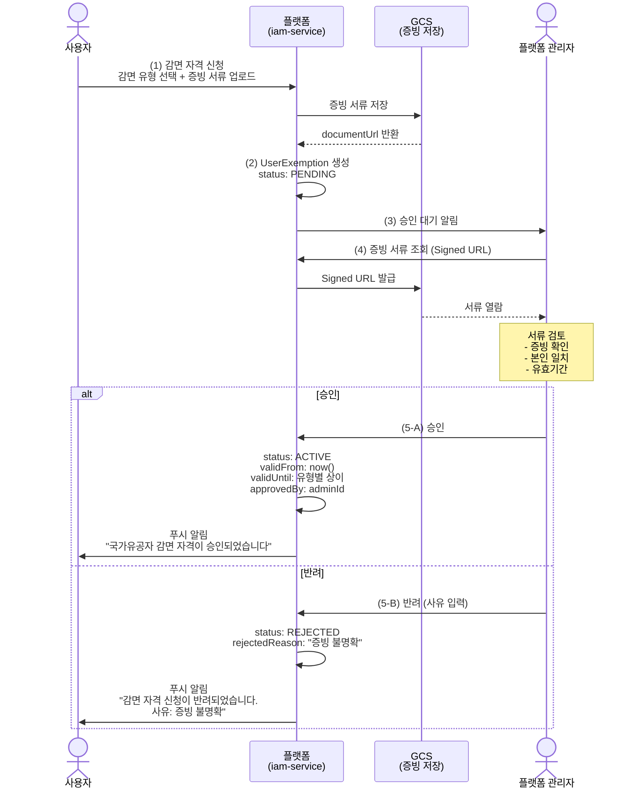

# 감면 정책 (Exemption Policy)

---

## 1. 개요

### 1-1. 목적

지자체 운영 공공 파크골프장은 법령 및 조례에 따라 **감면 대상자**에게 이용료를 할인 또는 면제해야 한다.
감면은 **"사용자가 법적으로 누구인가"** 에 기반한 자격이다. 상품(구독/이용권)이 아닌 **법적 의무**이므로 독립 도메인으로 관리한다.

### 1-2. 적용 범위

- **공공 파크골프장** (지자체 운영): 조례에 따라 감면 의무
- **민간 파크골프장** (유료): 자율 적용 (골프장 관리자가 감면 정책을 설정하지 않으면 미적용)

### 1-3. 서비스 구조

```
+-------------------+     +-------------------+
|   iam-service     |     |  course-service   |
|                   |     |                   |
| UserExemption     |     | CompanyExemption  |
| (사용자 감면 자격)  |     | Policy            |
|                   |     | (골프장별 감면율)   |
| - 자격 신청/승인   |     | - 감면 유형별      |
| - 증빙 서류 관리   |     |   할인율 설정      |
| - 유효기간 관리    |     | - priority 설정    |
+--------+----------+     +--------+----------+
         |                         |
         | iam.exemption.check     | course.exemptionPolicies.list
         |                         |
         +--- 예약 시 조회 ---------+
```

---

## 2. 감면 대상 유형

### 2-1. 법정 감면 대상

| 감면 유형 | 코드 | 근거 법령 | 비고 |
|----------|------|----------|------|
| 국가유공자 | `VETERAN` | 국가유공자 등 예우 및 지원에 관한 법률 | 본인 + 유족 |
| 장애인 | `DISABLED` | 장애인복지법 | 장애 등급 무관 |
| 기초생활수급자 | `BASIC_LIVELIHOOD` | 국민기초생활보장법 | 수급자 증명 |
| 경로 우대 | `SENIOR` | 노인복지법 | 만 65세 이상 |
| 다자녀 가정 | `MULTI_CHILD` | 지자체 조례 | 3자녀 이상 (지자체별 상이) |
| 유공 체육인 | `SPORTS_MERIT` | 국민체육진흥법 | 체육 유공자 |

### 2-2. 지자체별 추가 감면

| 감면 유형 | 코드 | 예시 |
|----------|------|------|
| 지자체 특별 감면 | `LOCAL_SPECIAL` | 지역 봉사자, 관내 체육회 회원 등 |

> `LOCAL_SPECIAL`은 각 지자체 조례에 따라 골프장 관리자가 자유롭게 정의할 수 있는 확장 유형이다.

### 2-3. 실제 지자체 사례

```
천안 시민 파크골프장 (조례 기반):

+----------------------------------------------------+
| 감면 유형       | 할인율 | 비고                      |
+----------------------------------------------------+
| 국가유공자       | 100%  | 전액 면제                 |
| 장애인           | 100%  | 전액 면제                 |
| 기초생활수급자    | 100%  | 전액 면제                 |
| 경로 우대        |  50%  | 만 65세 이상              |
| 다자녀 가정      |  30%  | 3자녀 이상                |
+----------------------------------------------------+

세종 파크골프장 (조례 기반):

+----------------------------------------------------+
| 감면 유형       | 할인율 | 비고                      |
+----------------------------------------------------+
| 국가유공자       |  50%  |                           |
| 장애인           |  50%  |                           |
| 기초생활수급자    | 100%  | 전액 면제                 |
| 경로 우대        |  30%  | 만 65세 이상              |
+----------------------------------------------------+
```

> **같은 감면 유형이라도 골프장(지자체)마다 할인율이 다르다.** 따라서 감면 정책은 **골프장 단위(CompanyExemptionPolicy)** 로 설정한다.

---

## 3. 감면 자격 등록

### 3-1. 등록 방식

| 방식 | 코드 | 대상 | 설명 |
|------|------|------|------|
| 서류 제출 | `DOCUMENT` | 국가유공자, 장애인, 기초생활수급자, 다자녀, 유공체육인, 지자체특별 | 증빙 업로드 -> 관리자 승인 |
| 자동 판별 | `AUTO_AGE` | 경로 우대 | 본인인증 생년월일에서 만 65세 이상 자동 생성 |
| 정부 API | `GOVERNMENT_API` | (향후) | 정부24 API 연동으로 실시간 자격 확인 |

### 3-2. 서류 제출 프로세스



### 3-3. 경로 우대 자동 처리

만 65세 이상은 본인인증 시점에 **서류 없이 자동 생성**한다.

```
본인인증 완료 (PASS/카카오)
  |
  +-- 생년월일 추출
  +-- 만 나이 계산
  +-- 만 65세 이상?
      |
      +-- YES:
      |   UserExemption 자동 생성
      |     exemptionType: SENIOR
      |     status: ACTIVE
      |     verificationMethod: AUTO_AGE
      |     validFrom: now()
      |     validUntil: null (영구)
      |
      +-- NO: 해당 없음
```

> 매년 생일이 지나면서 만 65세가 되는 사용자를 위해 **Cron (매일 01:00)** 으로 기존 사용자 중 만 65세 도달자를 일괄 생성한다.

### 3-4. 증빙 서류 가이드

| 감면 유형 | 필요 서류 | 비고 |
|----------|----------|------|
| 국가유공자 | 국가유공자증 (앞면) | 본인 또는 유족 확인 |
| 장애인 | 장애인등록증 또는 복지카드 | 장애 등급 표기 |
| 기초생활수급자 | 수급자 증명서 | 주민센터 발급, 3개월 이내 |
| 다자녀 가정 | 다자녀 확인서 또는 가족관계증명서 | 3자녀 이상 확인 |
| 유공 체육인 | 체육유공자 증명서 | 대한체육회 발급 |
| 지자체 특별 | 골프장별 안내 | 관리자 재량 |

> 서류 이미지는 **GCS**에 암호화 저장하며, 개인정보 보호법에 따라 **목적 달성 후 즉시 삭제**(승인/반려 후 90일)한다.

---

## 4. 감면 정책 설정 (골프장별)

### 4-1. 설정 주체

**골프장 관리자 (admin-dashboard)** 가 자기 골프장에 적용할 감면 유형과 할인율을 설정한다.

- 공공 골프장: 지자체 조례에 따라 **필수** 설정
- 민간 골프장: **선택** 설정 (설정하지 않으면 감면 미적용)

### 4-2. CompanyExemptionPolicy 설정

| 필드 | 설명 | 예시 |
|------|------|------|
| exemptionType | 감면 유형 코드 | `VETERAN` |
| name | 표시명 | "국가유공자 전액 면제" |
| discountType | 할인 방식 | `FREE` / `DISCOUNT_RATE` / `DISCOUNT_AMOUNT` |
| discountRate | 비율 할인 (%) | 50 |
| discountAmount | 금액 할인 (원) | 3000 |
| priority | 우선순위 (높을수록 우선) | 10 |
| isActive | 활성 여부 | true |

**할인 방식:**

| discountType | 산출 | 예시 (기본가 10,000원) |
|-------------|------|---------------------|
| `FREE` | 0원 | 전액 면제 -> 0원 |
| `DISCOUNT_RATE` | 기본가 x (100 - rate)% | 50% 할인 -> 5,000원 |
| `DISCOUNT_AMOUNT` | 기본가 - 금액 | 3,000원 할인 -> 7,000원 |

### 4-3. 복수 감면 자격 처리

한 사용자가 여러 감면 자격을 보유할 수 있다 (예: 만 65세 + 국가유공자).
이 경우 **가장 유리한 것 하나만** 적용한다.

```
예시: 만 68세 국가유공자 김철수
골프장: 천안 시민 파크골프장 (기본가 5,000원)

보유 감면 자격:
  +-- SENIOR (경로 우대): ACTIVE
  +-- VETERAN (국가유공자): ACTIVE

골프장 감면 정책:
  +-- SENIOR: 50% 할인 (priority: 5) -> 2,500원
  +-- VETERAN: 전액 면제 (priority: 10) -> 0원

-> 최저가 적용: VETERAN 전액 면제 (0원)
```

---

## 5. 감면 적용 흐름

### 5-1. 예약 시 감면 확인

```
예약 요청 (userId, companyId, slotPrice)
  |
  | iam.exemption.check (userId)
  |   -> 활성 감면 자격 목록 반환
  |      예: [{ type: VETERAN, status: ACTIVE },
  |           { type: SENIOR, status: ACTIVE }]
  |
  | course.exemptionPolicies.list (companyId)
  |   -> 해당 골프장의 감면 정책 목록 반환
  |      예: [{ type: VETERAN, discountType: FREE, priority: 10 },
  |           { type: SENIOR, discountType: DISCOUNT_RATE, rate: 50, priority: 5 }]
  |
  | 매칭: 사용자 자격 x 골프장 정책
  |   +-- VETERAN x FREE -> 0원
  |   +-- SENIOR x 50% -> 2,500원
  |
  | 최저가 선택: VETERAN 전액 면제 (0원)
  |
  | 결과:
  |   discountType: EXEMPTION
  |   discountName: "국가유공자 전액 면제"
  |   finalPrice: 0
```

### 5-2. 감면 적용 예시

```
Case 1: 국가유공자 (전액 면제 골프장)
  기본가: 5,000원
  감면: VETERAN 100% -> 0원
  최종: 0원

Case 2: 장애인 (50% 할인 골프장)
  기본가: 10,000원
  감면: DISABLED 50% -> 5,000원
  최종: 5,000원

Case 3: 만 65세 + 국가유공자 (복수 자격)
  기본가: 5,000원
  감면: SENIOR 50% -> 2,500원, VETERAN 100% -> 0원
  최종: 0원 (최저가 선택)

Case 4: 감면 자격 있으나 골프장 정책 없음
  기본가: 10,000원
  감면: VETERAN 자격 있음, 골프장 정책 없음
  최종: 10,000원 (감면 미적용)
```

### 5-3. Booking 저장 필드

감면이 적용된 예약은 다음 필드에 기록한다.

| 필드 | 설명 | 예시 |
|------|------|------|
| originalPrice | 기본가 | 5,000 |
| finalPrice | 최종 결제가 | 0 |
| appliedDiscountType | 적용된 할인 유형 | `EXEMPTION` |
| appliedDiscountName | 적용된 할인명 | "국가유공자 전액 면제" |

---

## 6. 유효기간 관리

### 6-1. 유형별 유효기간

| 감면 유형 | 유효기간 | 갱신 방식 | validUntil |
|----------|---------|----------|------------|
| 국가유공자 | 영구 | 1회 승인 후 영구 | `null` |
| 장애인 | 영구 | 1회 승인 후 영구 | `null` |
| 기초생활수급자 | 1년 | 매년 증빙 재제출 | 승인일 + 1년 |
| 경로 우대 | 영구 | 자동 판별 (서류 불필요) | `null` |
| 다자녀 가정 | 1년 | 매년 증빙 재제출 | 승인일 + 1년 |
| 유공 체육인 | 영구 | 1회 승인 후 영구 | `null` |
| 지자체 특별 | 가변 | 지자체 정책에 따름 | 관리자 설정 |

### 6-2. 만료 처리 Cron

```typescript
// iam-service @Cron('0 1 * * *') — 매일 01:00

async function processExemptionExpiry() {
  // 1. 유효기간 만료 처리
  const expired = await prisma.userExemption.updateMany({
    where: {
      status: 'ACTIVE',
      validUntil: { not: null, lt: new Date() },
    },
    data: { status: 'EXPIRED' },
  });

  // 2. 만료 대상자에게 재신청 알림
  if (expired.count > 0) {
    const expiredUsers = await prisma.userExemption.findMany({
      where: { status: 'EXPIRED', updatedAt: { gte: startOfToday() } },
      include: { user: true },
    });

    for (const exemption of expiredUsers) {
      await natsClient.emit('notify.push', {
        userId: exemption.userId,
        title: '감면 자격 만료 안내',
        body: `${getExemptionName(exemption.exemptionType)} 감면 자격이 만료되었습니다. 재신청해 주세요.`,
        type: 'EXEMPTION_EXPIRED',
      });
    }
  }

  // 3. 만 65세 도달자 자동 생성
  const newSeniors = await prisma.user.findMany({
    where: {
      birthDate: { lte: subYears(new Date(), 65) },
      isVerified: true,
      exemptions: { none: { exemptionType: 'SENIOR' } },
    },
  });

  for (const user of newSeniors) {
    await prisma.userExemption.create({
      data: {
        userId: user.id,
        exemptionType: 'SENIOR',
        status: 'ACTIVE',
        verificationMethod: 'AUTO_AGE',
        validFrom: new Date(),
      },
    });
  }
}
```

### 6-3. 만료 예정 알림

| 시점 | 알림 내용 |
|------|----------|
| D-30 | "감면 자격이 30일 후 만료됩니다. 미리 재신청해 주세요." |
| D-7 | "감면 자격이 7일 후 만료됩니다." |
| D-Day | "감면 자격이 만료되었습니다. 재신청해 주세요." |

---

## 7. 데이터 모델

### 7-1. iam-service — UserExemption

```prisma
enum ExemptionType {
  VETERAN            // 국가유공자
  DISABLED           // 장애인
  BASIC_LIVELIHOOD   // 기초생활수급자
  SENIOR             // 경로 우대 (만 65세 이상)
  MULTI_CHILD        // 다자녀 가정
  SPORTS_MERIT       // 유공 체육인
  LOCAL_SPECIAL      // 지자체 특별 감면
}

enum ExemptionStatus {
  PENDING            // 심사 대기
  ACTIVE             // 승인됨 (할인 적용 가능)
  REJECTED           // 반려
  EXPIRED            // 유효기간 만료
  REVOKED            // 관리자 취소
}

enum VerificationMethod {
  DOCUMENT           // 서류 제출 + 관리자 승인
  AUTO_AGE           // 본인인증 생년월일 자동 판별 (경로 우대)
  GOVERNMENT_API     // 정부24 API 연동 (향후)
}

model UserExemption {
  id                   Int                @id @default(autoincrement())
  userId               Int                @map("user_id")
  exemptionType        ExemptionType      @map("exemption_type")
  status               ExemptionStatus    @default(PENDING)
  verificationMethod   VerificationMethod @map("verification_method")

  // 증빙
  documentUrl          String?            @map("document_url")
  documentNote         String?            @map("document_note")

  // 유효기간
  validFrom            DateTime?          @map("valid_from")
  validUntil           DateTime?          @map("valid_until")     // null = 영구

  // 승인/반려
  approvedBy           Int?               @map("approved_by")     // Admin.id
  approvedAt           DateTime?          @map("approved_at")
  rejectedReason       String?            @map("rejected_reason")

  createdAt            DateTime           @default(now()) @map("created_at")
  updatedAt            DateTime           @updatedAt @map("updated_at")

  user                 User               @relation(fields: [userId], references: [id], onDelete: Cascade)

  @@unique([userId, exemptionType])
  @@index([status])
  @@index([exemptionType, status])
  @@map("user_exemptions")
}
```

### 7-2. course-service — CompanyExemptionPolicy

```prisma
enum ExemptionDiscountType {
  FREE               // 전액 면제
  DISCOUNT_RATE      // 비율 할인
  DISCOUNT_AMOUNT    // 금액 할인
}

model CompanyExemptionPolicy {
  id                   Int                    @id @default(autoincrement())
  companyId            Int                    @map("company_id")
  exemptionType        String                 @map("exemption_type")  // ExemptionType enum 값
  name                 String                                         // "국가유공자 50% 감면"
  discountType         ExemptionDiscountType  @map("discount_type")
  discountRate         Int?                   @map("discount_rate")   // 비율 (%)
  discountAmount       Decimal?               @db.Decimal(10, 0) @map("discount_amount")
  priority             Int                    @default(0)
  isActive             Boolean                @default(true) @map("is_active")
  createdAt            DateTime               @default(now()) @map("created_at")
  updatedAt            DateTime               @updatedAt @map("updated_at")

  @@unique([companyId, exemptionType])
  @@index([companyId, isActive])
  @@map("company_exemption_policies")
}
```

---

## 8. NATS 패턴

### 8-1. iam-service — 감면 자격 관리

```
iam.exemption.request              감면 자격 신청
  Input:  { userId, exemptionType, documentUrl?, documentNote? }
  Output: { id, status: PENDING }

iam.exemption.list                 사용자별 감면 자격 목록
  Input:  { userId }
  Output: { exemptions: UserExemption[] }

iam.exemption.check                감면 자격 확인 (예약 시 호출)
  Input:  { userId, exemptionType? }
  Output: { exemptions: { type, status }[] }

iam.exemption.approve              감면 자격 승인 (관리자)
  Input:  { exemptionId, approvedBy, validUntil? }
  Output: { id, status: ACTIVE }

iam.exemption.reject               감면 자격 반려 (관리자)
  Input:  { exemptionId, rejectedReason }
  Output: { id, status: REJECTED }

iam.exemption.revoke               감면 자격 취소 (관리자)
  Input:  { exemptionId, reason }
  Output: { id, status: REVOKED }

iam.exemption.pendingList          승인 대기 목록 (관리자)
  Input:  { page, limit }
  Output: { items: UserExemption[], total }
```

### 8-2. course-service — 감면 정책 설정

```
course.exemptionPolicies.list      가맹점별 감면 정책 목록
  Input:  { companyId }
  Output: { policies: CompanyExemptionPolicy[] }

course.exemptionPolicies.create    감면 정책 생성
  Input:  { companyId, exemptionType, name, discountType, discountRate?, discountAmount?, priority }
  Output: { id }

course.exemptionPolicies.update    감면 정책 수정
  Input:  { id, name?, discountType?, discountRate?, discountAmount?, priority?, isActive? }
  Output: { id }

course.exemptionPolicies.delete    감면 정책 삭제
  Input:  { id }
  Output: { deleted: true }
```

---

## 9. BFF 엔드포인트

### 9-1. user-api (사용자용)

```
GET    /exemptions/my                내 감면 자격 목록
POST   /exemptions/request           감면 자격 신청
GET    /exemptions/types             지원 감면 유형 목록 + 필요 서류 안내
```

### 9-2. admin-api (골프장 관리자용)

```
GET    /companies/:companyId/exemption-policies          감면 정책 목록
POST   /companies/:companyId/exemption-policies          감면 정책 생성
PUT    /companies/:companyId/exemption-policies/:id      감면 정책 수정
DELETE /companies/:companyId/exemption-policies/:id      감면 정책 삭제
```

### 9-3. platform-api (플랫폼 관리자용)

```
GET    /exemptions/pending           승인 대기 목록 (전체)
POST   /exemptions/:id/approve       감면 자격 승인
POST   /exemptions/:id/reject        감면 자격 반려
POST   /exemptions/:id/revoke        감면 자격 취소
GET    /exemptions/stats             감면 통계
```

---

## 10. UI 설계

### 10-1. 사용자 앱 — 감면 자격 관리

```
+------------------------------------------+
|  마이페이지 > 감면 자격                    |
|                                          |
|  +------------------------------------+  |
|  | 경로 우대 (만 65세 이상)             |  |
|  | 자동 인증  |  상태: 활성              |  |
|  +------------------------------------+  |
|  +------------------------------------+  |
|  | 국가유공자                           |  |
|  | 서류 인증  |  상태: 활성              |  |
|  | 승인일: 2026.02.15                  |  |
|  +------------------------------------+  |
|  +------------------------------------+  |
|  | 기초생활수급자                        |  |
|  | 서류 인증  |  상태: 활성              |  |
|  | 유효기간: ~2027.01.15               |  |
|  +------------------------------------+  |
|                                          |
|  [+ 감면 자격 신청]                       |
|                                          |
+------------------------------------------+
```

### 10-2. 사용자 앱 — 감면 자격 신청

```
+------------------------------------------+
|  감면 자격 신청                            |
|                                          |
|  감면 유형 선택:                           |
|  +------------------------------------+  |
|  | (O) 국가유공자                       |  |
|  | ( ) 장애인                           |  |
|  | ( ) 기초생활수급자                     |  |
|  | ( ) 다자녀 가정                       |  |
|  | ( ) 유공 체육인                       |  |
|  +------------------------------------+  |
|                                          |
|  필요 서류: 국가유공자증 (앞면)             |
|                                          |
|  +------------------------------------+  |
|  |                                    |  |
|  |      [카메라] [갤러리에서 선택]       |  |
|  |                                    |  |
|  +------------------------------------+  |
|                                          |
|  메모 (선택):                             |
|  +------------------------------------+  |
|  |                                    |  |
|  +------------------------------------+  |
|                                          |
|  (i) 서류 심사는 영업일 기준 1~3일         |
|      소요됩니다.                          |
|                                          |
|           [ 신청하기 ]                    |
+------------------------------------------+
```

### 10-3. 사용자 앱 — 예약 시 감면 적용

```
+------------------------------------------+
|  예약 확인                                |
|                                          |
|  세종 파크골프장                          |
|  2026.03.15 (토) 08:00 오전 세션          |
|                                          |
|  ------------------------------------     |
|  기본가                     10,000원      |
|  국가유공자 50% 감면        -5,000원      |
|  ------------------------------------     |
|  최종 결제금액                5,000원      |
|                                          |
|  (i) 감면 자격 인증 완료                   |
|                                          |
|          [ 예약 확정 ]                    |
+------------------------------------------+
```

### 10-4. admin-dashboard — 감면 정책 관리

```
+-- 기본 정보 -- 코스 -- 라운드 -- 감면 정책 ---------------+
|                                                        |
|  [+ 감면 정책 추가]                                     |
|                                                        |
|  +----------------------------------------------+     |
|  | 국가유공자 전액 면제       [VETERAN]             |     |
|  | 전액 면제  |  우선순위 10                       |     |
|  | 적용 건수: 이번 달 42건                         |     |
|  |                              [수정] [OFF]     |     |
|  +----------------------------------------------+     |
|  +----------------------------------------------+     |
|  | 장애인 전액 면제           [DISABLED]            |     |
|  | 전액 면제  |  우선순위 10                       |     |
|  | 적용 건수: 이번 달 28건                         |     |
|  |                              [수정] [OFF]     |     |
|  +----------------------------------------------+     |
|  +----------------------------------------------+     |
|  | 경로 우대 50% 할인         [SENIOR]              |     |
|  | 비율 할인 50%  |  우선순위 5                    |     |
|  | 적용 건수: 이번 달 156건                        |     |
|  |                              [수정] [OFF]     |     |
|  +----------------------------------------------+     |
|                                                        |
|  -- 이번 달 감면 현황 --------------------------------  |
|                                                        |
|  +----------------------------------------------+     |
|  | 총 감면 건수: 226건                             |     |
|  | 총 감면 금액: 1,130,000원                       |     |
|  +----------------------------------------------+     |
+--------------------------------------------------------+
```

### 10-5. platform-dashboard — 감면 승인/통계

```
+-- 감면 관리 -----------------------------------------------+
|                                                            |
|  -- 승인 대기 (3건) ------------------------------------    |
|                                                            |
|  +----------------------------------------------------+   |
|  | 이름    유형          신청일    증빙      상태         |   |
|  | 이영수  국가유공자     03.14   [보기]   [승인] [반려]   |   |
|  | 박미선  기초생활수급   03.13   [보기]   [승인] [반려]    |   |
|  | 최동건  장애인         03.12   [보기]   [승인] [반려]   |   |
|  +----------------------------------------------------+   |
|                                                            |
|  -- 전체 통계 ------------------------------------------    |
|                                                            |
|  +----------------------------------------------------+   |
|  | 유형           활성    이번 달 적용    감면 총액       |   |
|  | 국가유공자       156     342건       1,710,000원      |   |
|  | 장애인           89     198건       1,980,000원      |   |
|  | 경로 우대        423   1,024건       3,072,000원      |   |
|  | 기초생활수급      34      78건         780,000원      |   |
|  | 다자녀           12      36건         180,000원      |   |
|  +----------------------------------------------------+   |
|  | 합계            714   1,678건       7,722,000원      |   |
|  +----------------------------------------------------+   |
+------------------------------------------------------------+
```

---

## 11. 외부 파트너 연동

외부 ERP/예약 시스템과 연동된 골프장(PARTNER 모드)에서는 감면 정보를 **ERP에 전달**한다.

### 11-1. ERP 전달 항목

| 항목 | 설명 | 예시 |
|------|------|------|
| exemptions | 사용자 활성 감면 자격 목록 | `["VETERAN", "SENIOR"]` |
| verifiedExemptions | 플랫폼 승인 완료 여부 | `true` |
| exemptionDetails | 감면 상세 정보 | `[{ type: "VETERAN", method: "DOCUMENT", approvedAt: "..." }]` |

### 11-2. 할인 주체

```
Case A: 플랫폼 통합 결제 (권장)
  -> 플랫폼이 감면가를 산출하고 결제
  -> ERP에는 "감면 적용된 예약" 정보 전달

Case B: 정보 공유형 (현장 결제)
  -> 플랫폼은 감면 자격 정보만 전달
  -> ERP가 자체 정책으로 할인 적용
  -> 할인 금액 최종 권한은 ERP에 있음
```

> 자세한 내용은 [외부 부킹 API 연동](../business/외부%20부킹%20API%20연동.md) 참조.

---

## 12. 보안 및 개인정보

### 12-1. 증빙 서류 관리

| 항목 | 정책 |
|------|------|
| 저장소 | GCS (Google Cloud Storage), 버킷 비공개 |
| 암호화 | GCS 서버 측 암호화 (SSE) |
| 접근 제한 | Signed URL (15분 유효), 관리자만 조회 가능 |
| 보존 기간 | 승인/반려 후 **90일** 보관 후 자동 삭제 |
| 로깅 | 서류 조회 시 감사 로그 기록 |

### 12-2. 개인정보 보호

| 항목 | 정책 |
|------|------|
| 감면 자격 정보 | 사용자 본인 + 관리자만 조회 |
| 증빙 서류 | 관리자 승인 목적으로만 열람, 다운로드 금지 |
| 계정 삭제 시 | UserExemption 삭제, 증빙 서류 즉시 삭제 |
| API 응답 | documentUrl은 관리자 API에서만 반환 (사용자 API에서는 미포함) |

---

## 13. 구현 로드맵

### Phase 1 — iam-service 기반

```
UserExemption 모델 + ExemptionType/Status/VerificationMethod enum
경로 우대 자동 생성 (본인인증 시 + 매일 Cron)
NATS: exemption.request, list, check, approve, reject, revoke, pendingList
GCS 증빙 서류 업로드 + Signed URL 조회
유효기간 만료 Cron + 알림
```

### Phase 2 — course-service 감면 정책

```
CompanyExemptionPolicy 모델
NATS: exemptionPolicies CRUD
복수 감면 자격 최저가 비교 로직
```

### Phase 3 — booking-service 연동

```
Booking 스키마 확장 (appliedDiscountType에 EXEMPTION 추가)
예약 시 iam.exemption.check 호출 -> 감면 적용
```

### Phase 4 — 프론트엔드

```
user-app: 감면 자격 신청/조회, 예약 시 감면 적용 표시
admin-dashboard: 감면 정책 CRUD, 감면 현황 조회
platform-dashboard: 감면 승인/반려, 통계 대시보드
```

### Phase 5 — 고도화

```
정부24 API 연동 (자동 자격 확인)
증빙 서류 OCR 사전 검증
감면 이력 리포트 (지자체 보고용)
```

---

## 14. 관련 문서

| 문서 | 관계 |
|------|------|
| [멤버십 서비스](../business/멤버십%20서비스.md) | 구독 + 이용권 + 가격 산출 통합 |
| [멤버십 상세 설계](./MEMBERSHIP_TIER.md) | 데이터 모델, NATS, Seed 상세 |
| [외부 부킹 API 연동](../business/외부%20부킹%20API%20연동.md) | 파트너 연동 시 감면 정보 전달 |
| [계정 삭제 정책](./ACCOUNT_DELETION.md) | 탈퇴 시 감면 자격/증빙 삭제 |
