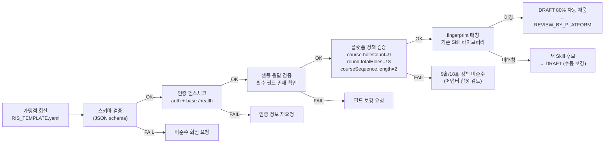

# 파트너 연동 표준 명세 (PARTNER_RIS — Required Integration Specification)

> 최종 수정일: 2026-05-16 (v0.1)
>
> **목적**: 가맹점 계약 시점에 가맹점 측 부킹 시스템(외부 ERP)이 우리 플랫폼과 연동하기 위해 **제공해야 할 데이터·인터페이스 표준**을 명시한다. 자동 발견(probe·OpenAPI 파싱)과 LLM 매핑 추천은 RIS 미준수 가맹점에만 적용되는 fallback으로 격하한다.

---

## 1. 위치 / 적용 범위

- **위치**: `docs/policy/PARTNER_RIS.md` (본 문서) + `docs/partner/RIS_TEMPLATE.yaml` (가맹점 회신 양식)
- **적용 시점**: 가맹점 계약 체결 직후 `RIS_HANDOFF` 단계 (PARTNER_INTEGRATION.md §3 참조)
- **적용 대상**: `bookingMode = PARTNER` 인 가맹점 클럽 전체
- **준수 의무**: 필수(MUST) 카테고리 미제공 시 계약 보류. 선택(MAY) 카테고리는 1차 릴리즈 이후 추가 가능.

---

## 2. 카테고리 9종 — 한눈에

| # | 카테고리 | 의무 | 갱신 방식 | 주요 사용처 |
|---|---------|:----:|----------|------------|
| 1 | 골프장 정보 | MUST | 1회 + 변경 시 | club master |
| 2 | 코스 / 홀 정보 (**9홀 단위**) | MUST | 1회 + 변경 시 | course/hole master |
| 2-2 | 게임 라운드 (**18홀 = 9홀 코스 2개 조합**) | MUST | 1회 + 변경 시 | 예약 단위 |
| 3 | 타임슬롯 | MUST | 실시간 또는 5분 polling | 예약 가능 슬롯 (게임 라운드 단위) |
| 4 | 결제 데이터 | MUST (Push 또는 Pull 택 1) | webhook 또는 on-demand | 결제 상태/금액 |
| 5 | 예약 데이터 | MUST | 실시간 또는 5분 polling | 외부 발생 예약 동기화 |
| 6 | 취소 / 환불 | MUST | 실시간 또는 5분 polling | 환불 정책 트리거 |
| 7 | 회원 식별 | MAY | on-demand | 중복 예약 방지 |
| 8 | 인증 방식 | MUST | — | 전체 API 호출 |
| 9 | 데이터 갱신 방식 | MUST | — | webhook / polling 정의 |

---

## 3. 공통 형식 표준

| 항목 | 표준 |
|------|------|
| 데이터 포맷 | `application/json` (UTF-8) |
| 시간 | **ISO 8601** with timezone (`2026-05-16T14:30:00+09:00`) |
| 통화 | KRW 정수형 (소수점 없음) |
| 식별자 | 가맹점 측 unique string (max 64 chars) — 우리 측 `externalId` 로 매핑 |
| 페이지네이션 | `?page=1&size=50` 또는 cursor 방식 (택 1, 명시 필수) |
| 응답 | `{ data: [...], meta: { total, page, size } }` 권장 |
| 에러 | HTTP status code + `{ error: { code, message } }` |
| Timezone | 모든 시간은 timezone 명시 (`Asia/Seoul` 기본 가정 금지) |

---

## 4. 카테고리별 필드 정의

### 4.1 골프장 정보 (Club) — MUST

| 필드 | 타입 | 필수 | 설명 |
|------|------|:---:|------|
| `clubId` | string | ✓ | 가맹점 측 고유 식별자 |
| `name` | string | ✓ | 골프장 명칭 |
| `address` | string | ✓ | 도로명 주소 |
| `latitude` | number | ✓ | 위도 |
| `longitude` | number | ✓ | 경도 |
| `phone` | string | ✓ | 대표 연락처 |
| `operatingHours` | object | ✓ | `{ open: "06:00", close: "20:00" }` 요일별 다르면 array |
| `closedDays` | string[] | | 휴장일 (ISO date) 또는 정기 휴무 (e.g. `["MON"]`) |
| `facilities` | string[] | | 카트/락커/식당 등 코드 enum |

### 4.2 코스 / 홀 정보 (Course / Hole) — MUST

**플랫폼 정책**: 코스는 **9홀 단위**로만 정의한다 (현재 1차 릴리즈 기준 파크골프 표준). 18홀 코스는 9홀 코스 2개의 **게임 라운드 조합** (§4.2.2)으로 표현한다.

| 필드 | 타입 | 필수 | 설명 |
|------|------|:---:|------|
| `courseId` | string | ✓ | 코스 고유 식별자 |
| `clubId` | string | ✓ | 소속 골프장 |
| `name` | string | ✓ | 코스명 (예: "A코스") |
| `holeCount` | number | ✓ | **9 고정** (1차 릴리즈) |
| `holes` | object[] | ✓ | 각 홀별 정보 (길이 = 9) |
| `holes[].no` | number | ✓ | 홀 번호 (1~9) |
| `holes[].par` | number | ✓ | 파 (3/4/5) |
| `holes[].distanceMeters` | number | | 홀 거리 (m) |

> **참고**: 향후 9홀로만 운영되는 파크골프장 등장 시 §4.2.2에 **9홀 게임 라운드** 옵션을 추가할 예정. 본 카테고리(§4.2) 스키마는 9홀 단위 그대로 유지된다.

### 4.2.2 게임 라운드 (GameRound) — MUST

플레이어가 실제 예약·플레이하는 단위. **18홀 = 9홀 코스 2개 조합** (예: A코스 → B코스).

| 필드 | 타입 | 필수 | 설명 |
|------|------|:---:|------|
| `roundId` | string | ✓ | 게임 라운드 고유 식별자 |
| `clubId` | string | ✓ | 소속 골프장 |
| `name` | string | ✓ | 라운드명 (예: "A→B 18홀") |
| `totalHoles` | number | ✓ | **18 고정** (1차 릴리즈) |
| `courseSequence` | string[] | ✓ | 코스 순서 배열 (예: `["courseA", "courseB"]`) — **길이 = 2 고정** |
| `playDurationMin` | number | | 예상 플레이 시간(분), 슬롯 간격 산정용 |

**검증 규칙**:
- `courseSequence.length == 2` (1차 릴리즈)
- 각 `courseSequence[i]` → §4.2 `courseId` 와 일치
- 두 코스의 `clubId` 동일

**예시**:
```json
{
  "roundId": "RD-AB-18",
  "clubId": "CLUB-001",
  "name": "A → B 18홀",
  "totalHoles": 18,
  "courseSequence": ["COURSE-A", "COURSE-B"],
  "playDurationMin": 180
}
```

> **향후 확장**: 9홀 단독 운영 가맹점이 등장하면 `totalHoles: 9` + `courseSequence: ["courseA"]` (길이 1) 허용 추가. 1차 릴리즈 검증 코드는 이 경우 거부.

### 4.3 타임슬롯 (TimeSlot) — MUST

**플랫폼 정책**: 슬롯은 **게임 라운드 단위** (§4.2.2)로 발급한다. 즉, 1개 슬롯 = 1개 게임 라운드 = 18홀 플레이.

| 필드 | 타입 | 필수 | 설명 |
|------|------|:---:|------|
| `slotId` | string | ✓ | 슬롯 고유 식별자 |
| `roundId` | string | ✓ | **게임 라운드 ID** (§4.2.2) — 어떤 18홀 라운드인지 |
| `clubId` | string | ✓ | 소속 골프장 (검색 효율용) |
| `startTime` | ISO 8601 | ✓ | 티오프 시각 (timezone 포함, 첫 코스 시작 기준) |
| `endTime` | ISO 8601 | | 종료 예상 시각 (`startTime + roundId.playDurationMin`) |
| `maxPlayers` | number | ✓ | 최대 인원 (1~4) |
| `availablePlayers` | number | ✓ | 잔여 인원 |
| `price` | number | ✓ | KRW 정수 (1인 기준, 18홀 라운드 전체) |
| `cartIncluded` | boolean | | 카트 포함 여부 |
| `status` | enum | ✓ | `OPEN` / `FULL` / `CLOSED` |

**조회 API 권장 형태**: `GET /slots?clubId={id}&date={YYYY-MM-DD}` (응답에 `roundId` 포함 필수)

> **가맹점 ERP가 9홀 단위 슬롯만 제공하는 경우**: 어댑터(Skill)에서 9홀 슬롯 2개를 게임 라운드 1개 슬롯으로 **합성**한다. 이 합성 규칙은 vendor별 Skill의 `transforms`에 정의한다 (PARTNER_INTEGRATION.md §16.1 참조).

### 4.4 결제 데이터 (Payment) — MUST (PUSH 또는 PULL 택 1)

#### 4.4.1 PUSH 방식 (webhook, 권장)

가맹점 → 우리: `POST {ourWebhookUrl}/{partnerId}/payment`

```json
{
  "event": "payment.completed",
  "externalBookingId": "BK-2026-12345",
  "amount": 50000,
  "currency": "KRW",
  "method": "CARD",
  "status": "PAID",
  "paidAt": "2026-05-16T14:35:00+09:00",
  "txId": "TX-9876543",
  "raw": { /* 가맹점 원본 payload */ }
}
```

이벤트 종류: `payment.completed`, `payment.failed`, `payment.refunded`

#### 4.4.2 PULL 방식 (on-demand 조회)

우리 → 가맹점: `GET {baseUrl}/payments/{externalBookingId}`

응답 필드는 PUSH body와 동일.

> **두 방식 모두 지원 시**: PUSH 우선, PULL은 webhook 누락 시 fallback. 우리 측 cache TTL은 30s (결제) / 10s (실시간 상태).

### 4.5 예약 데이터 (Booking) — MUST

가맹점 측에서 발생한 예약(전화 예약 / 방문 예약 / 자체 앱 예약)을 우리와 동기화. **슬롯 가용성 충돌 방지**가 핵심.

| 필드 | 타입 | 필수 | 설명 |
|------|------|:---:|------|
| `externalBookingId` | string | ✓ | 가맹점 측 예약 고유 ID |
| `slotId` | string | ✓ | 예약된 슬롯 |
| `roundId` | string | ✓ | 게임 라운드 ID (§4.2.2) — 18홀 라운드 식별 |
| `playerCount` | number | ✓ | 예약 인원 |
| `status` | enum | ✓ | `CONFIRMED` / `CANCELED` / `NO_SHOW` / `COMPLETED` |
| `createdAt` | ISO 8601 | ✓ | 예약 생성 시각 |
| `playerName` | string | | (있으면) 예약자명 |
| `playerPhone` | string | | (있으면) 예약자 연락처 |
| `source` | enum | | `PHONE` / `WALK_IN` / `PARTNER_APP` / `OUR_PLATFORM` |

**갱신 방식**: 신규/변경 발생 시 webhook 우선, 미지원 시 5분 polling (`GET /bookings?since={ISO8601}`).

### 4.6 취소 / 환불 (Cancellation / Refund) — MUST

| 필드 | 타입 | 필수 | 설명 |
|------|------|:---:|------|
| `externalBookingId` | string | ✓ | 대상 예약 |
| `canceledAt` | ISO 8601 | ✓ | 취소 시각 |
| `reason` | string | | 사용자/가맹점 입력 사유 |
| `refundAmount` | number | | KRW 정수, 가맹점이 환불 처리한 경우 |
| `refundedAt` | ISO 8601 | | 환불 완료 시각 |

**갱신 방식**: webhook 우선 (`event: booking.canceled`, `refund.completed`). 우리 측은 `policy.cancellation.resolve` 정책에 따라 환불율 재계산 가능.

### 4.7 회원 식별 (Member Mapping) — MAY

1차 릴리즈에서는 선택. 도입 시:

| 필드 | 타입 | 설명 |
|------|------|------|
| `externalMemberId` | string | 가맹점 측 회원 ID |
| `phoneE164` | string | `+821012345678` 형식 |
| `nameMasked` | string | 마스킹된 이름 (개인정보 최소 수집) |

**용도**: 우리 측 사용자가 가맹점 회원이기도 한 경우 중복 예약/할인 적용 / 동일인 식별.

### 4.8 인증 방식 (Authentication) — MUST

다음 중 1개 선택:

| 방식 | 설명 | 권장도 |
|------|------|:------:|
| `API_KEY` | HTTP header (e.g. `X-API-KEY: ...`) | ★★★ |
| `OAUTH2` | client_credentials grant | ★★ |
| `BASIC` | `Authorization: Basic ...` | ★ |
| `JWT` | Bearer token, 만료/갱신 정책 명시 | ★★ |

**키 관리**: 가맹점이 발급, 우리 측 `partner-service`의 `crypto.service.ts`로 암호화 저장. 키 회전 주기 명시 권장 (분기 1회 이상).

### 4.9 데이터 갱신 방식 (Data Delivery) — MUST

| 방식 | 적용 카테고리 | 가맹점 부담 | 우리 부담 |
|------|---------------|------------|----------|
| **WEBHOOK** (push) | 결제, 예약, 취소 | webhook 발신 인프라 | endpoint 제공 + 멱등 처리 |
| **POLLING** (pull) | 슬롯, 예약, 취소 | 조회 API 제공 | cron 주기 호출 |

**기본 원칙**:
- 결제/취소 = WEBHOOK 강력 권장 (지연 = 사용자 불만)
- 슬롯 = POLLING 허용 (5분 간격, 단 webhook 지원 시 더 좋음)
- 클럽/코스 = 1회 + 변경 시 webhook (변경 빈도 매우 낮음)

---

## 5. 가맹점 회신 양식 (`RIS_TEMPLATE.yaml`)

가맹점이 채워서 회신하는 양식. 자세한 예시는 `docs/partner/RIS_TEMPLATE.yaml` 참조.

```yaml
partner:
  name: "○○ 파크골프장"
  contact: "담당자명 / 이메일 / 전화"
  vendor: "GolfZone-v3"          # 알면 표기, 모르면 빈칸 (자체구축이면 "Custom")

baseUrl: "https://erp.example.com/api/v1"

auth:
  type: API_KEY                  # API_KEY | OAUTH2 | BASIC | JWT
  header: X-API-KEY              # 또는 oauth2 endpoints

dataDelivery:
  mode: HYBRID                   # WEBHOOK | POLLING | HYBRID
  webhookFrom: "203.0.113.10"   # 가맹점 발신 IP (allowlist 용)
  pollingInterval: 5m

endpoints:
  club:         { method: GET, path: /clubs }
  course:       { method: GET, path: /clubs/{clubId}/courses }      # 9홀 단위
  round:        { method: GET, path: /clubs/{clubId}/rounds }       # 18홀 게임 라운드 조합
  slot:         { method: GET, path: /slots?clubId={id}&date={YYYY-MM-DD} }   # 라운드 단위
  booking:      { method: GET, path: /bookings?since={ISO8601} }
  payment:      { method: GET, path: /payments/{externalBookingId} }  # PULL 시
  cancellation: { method: GET, path: /cancellations?since={ISO8601} }

fields:                          # 응답 필드 ↔ 우리 표준 필드 매핑
  course:
    courseId: course_id
    holeCount: hole_count        # 9 고정 검증 대상
  round:
    roundId: round_id
    courseSequence: course_ids   # 길이 2 검증 대상 (1차 릴리즈)
    totalHoles: total_holes      # 18 고정 검증 대상
  slot:
    slotId: slot_id
    roundId: round_id            # 게임 라운드 식별
    startTime: tee_time          # ISO 8601 with tz
    maxPlayers: player_count
    availablePlayers: remain
    price: green_fee
  payment:
    amount: paid_amount          # 분 단위면 transforms 사용
    paidAt: paid_at
    status: pay_status

transforms:                      # 필요한 변환 함수
  - field: payment.amount
    fn: divide
    args: [100]                  # 분 → 원
  - field: slot.startTime
    fn: tzAttach
    args: ["+09:00"]             # tz 누락 시 부착

sample:                          # 검증용 샘플 응답
  slot: { ... }
  booking: { ... }
  payment: { ... }
```

---

## 6. RIS 검증 절차 (자동)

회신받은 `RIS_TEMPLATE.yaml` + 샘플 데이터로 자동 검증:



---

## 7. 미준수 가맹점 처리 (Fallback)

RIS 회신 거부 / 일부만 제공 / 자체구축 ERP 미문서화 등의 경우:

1. **PartnerDiscovery probe** (PARTNER_INTEGRATION.md §5.1) 적용
2. **LLM 매핑 추천** (PARTNER_INTEGRATION.md §8) 적용
3. **운영자/개발자 수동 매핑** 비중 증가
4. **TestRun 임계값 강화** (mismatch < 0.5%, 통상 1% 대비)

---

## 8. 관련 문서

| 문서 | 관계 |
|------|------|
| `docs/workflow/PARTNER_INTEGRATION.md` | RIS_HANDOFF 단계 + 전체 통합 워크플로 |
| `docs/policy/EXEMPTION.md` | 회원/결제 관련 면책 정책 |
| `docs/workflow/SAGA.md` §6 | 결제 데이터 흐름 (RIS 결제 데이터의 소비처) |
| `services/partner-service/prisma/schema.prisma` | `PartnerConfig` / `PartnerSpec` |

---

## 9. 변경 이력

| 날짜 | 버전 | 변경 |
|------|------|------|
| 2026-05-16 | 0.1 | 최초 작성. 카테고리 9종 + 공통 형식 + 회신 양식 정의 |
| 2026-05-17 | 0.2 | 코스 = 9홀 고정 / 게임 라운드(§4.2.2) = 18홀(9홀 코스 2개 조합) 정책 반영. 슬롯 단위를 게임 라운드로 변경. 9홀 게임 라운드는 향후 확장 예정 명시 |
