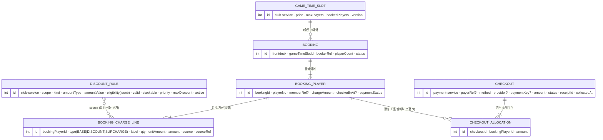

# UNI-114 — 요금 계산·할인·예약 원장·체크아웃 수납

> Linear: UNI-114(frontdesk) 산하 — UNI-132(계산·원장) · UNI-133(수납 checkout) · UNI-134(체크아웃 플로우)
> 선행: UNI-113(수납 모델) · UNI-130(PG) · UNI-129(PricingSnapshot)

프론트데스크 부킹의 **요금 계산 → 예약 원장(항목별) → 체크아웃 수납(유연 결제)** 도메인.

## 핵심 도메인 규칙

1. **단가는 club-service**(권위) — 슬롯 단가·주말/피크. 계산·원장 영속은 **부킹 시점에 frontdesk**.
2. **티슬롯 1 — N booking**: 한 티슬롯(capacity=maxPlayers)을 여러 독립 booking이 채움(예: 2명+1명+1명). 인벤토리(`bookedPlayers`/`version`)는 club-service.
3. **청구 단위 = 플레이어**: booking 내 각 플레이어가 자기 `chargeAmount`(본인 base+할인)·할인자격을 가짐.
4. **수납 단위 = checkout(이벤트)**: 1 payer가 1+ 플레이어를 한 번에 결제. 모두/개별/N명분 1인 **자유**. 시점 자유(선입장-후결제).
5. **원장 동결**: 부킹 시 계산 결과를 행으로 고정 → 규칙 변경 소급 X(정산 대사 근거).

## 모델 (ERD)



## 서비스 경계

| 영역 | 위치 | 테이블 |
|---|---|---|
| 단가·할인규칙 | **club-service** | (기존 슬롯 단가) · `discount_rule`(신규) |
| 예약·플레이어별 원장 | **frontdesk-service** | `booking` · `booking_player` · `booking_charge_line` |
| 수납(checkout)·귀속 | **payment-service** | `checkout` · `checkout_allocation` (← `payments` 진화) |

## 계산 파이프라인 (부킹 시 · frontdesk)

```
1. BASE     : 슬롯단가 × playerCount(해당 booking)          → line[BASE] (+)
2. 후보할인  : club.discount_rule.resolve(clubId, asOf, channel)   (유효기간·scope·active)
3. 자격필터  : matchEligibility(rule.eligibility, memberCtx)   ← 회원할인 훅(memberCtx 비면 미적용)
4. 적용     : priority 정렬 → stackable 누적 / 비중첩 최우선 1개, maxDiscount 상한
              FIXED|RATE 계산 → line[DISCOUNT] (−), sourceRef=rule.id
5. 합계     : total = subtotal − discountTotal (0 floor) → booking_player.chargeAmount
6. 영속     : booking_player + booking_charge_line 동결 ; PricingSnapshot(UNI-129) → 수납 시 전달
```

## 수납(checkout) — 유연 결제

`checkout` 1건이 `checkout_allocation`으로 1+ 플레이어를 커버. **플레이어는 활성(=비환불 COLLECTED) allocation 1개만** → 이중수납 방지(환불 이력 행은 공존하므로 **partial-unique(active) 또는 앱레벨**로 강제 — 구현은 UNI-133). `booking_player.paymentStatus`는 활성 allocation 유무로 PAID.

| 시나리오 | checkout | allocation |
|---|---|---|
| 각자 결제 | N건 | 각 1명 |
| 2명분 1인 | 1건 | 2명 |
| 4명분 1인 | 1건 | 4명 |
| 나중에 각각 | 시점 다른 N건 | 각 1명 |

- 현장 현금/카드단말 → `payment.collect`, 온라인 PG → `payment.pg.confirm`(UNI-130). checkout이 이 수납 호출을 감싸 allocation 기록.
- 환불: checkout 단위 취소 → 커버 플레이어 UNPAID/REFUNDED, 정산(UNI-131) 집계 반영.

## payments → checkout 진화 (UNI-133)

미출시 단계 → **흔적 없이 교체**(deprecated 없음, 풀스택 한 세트):
- `payments.bookingId` unique 제거 → `checkout`(수납 이벤트) + `checkout_allocation`(플레이어 귀속)
- 멱등: bookingId → **checkout receiptId/idempotencyKey + allocation player 활성유일**
- saga `COLLECT_PAYMENT`(예약시 전액결제) = **전원 커버 checkout 1건** 으로 흡수(기존 흐름 유지)

## 체크인 ≠ 수납 (UNI-134)

`booking_player.checkedInAt`(입장) · `paymentStatus`(수납) **독립** → 선입장-후결제 허용. 체크아웃 플로우가 둘을 오케스트레이션(입장만 / 입장+수납 / 후결제).

## 하위 이슈

| | 내용 |
|---|---|
| **UNI-132** [1] | 계산엔진 + `discount_rule`(club) + 원장(`booking_player`·`charge_line`, frontdesk) |
| **UNI-133** [2] | `checkout` + `checkout_allocation`(payment-service), `payments` 진화 |
| **UNI-134** [3] | 체크아웃 플로우(수납 모두/개별·체크인 분리, frontdesk) |

## 기본값 (확정 2026-06-28)

- checkout 범위 = **한 booking 내** 플레이어(allocation 일반화 → 슬롯-교차 1인결제는 후속 확장)
- 체크인/수납 독립 플래그(선입장-후결제 OK)
- 할인 = 단일 data-driven `discount_rule`(kind+jsonb eligibility) — 신규 할인은 데이터로 추가

## 미해결 / 추후

- **할인 구체 규칙**(프로모션·이벤트 캠페인) — 데이터로 추가
- **회원 자격모델·증빙**(지역주민·국가유공자) — `member_eligibility`(iam/member) + 증빙 검증 플로우. 엔진은 `matchEligibility` 훅만 선제공
- 슬롯-교차 checkout(여러 booking 1인 결제) 필요 시 allocation은 이미 일반화
- frontdesk-service는 greenfield → 본 spec은 contract-first 설계
