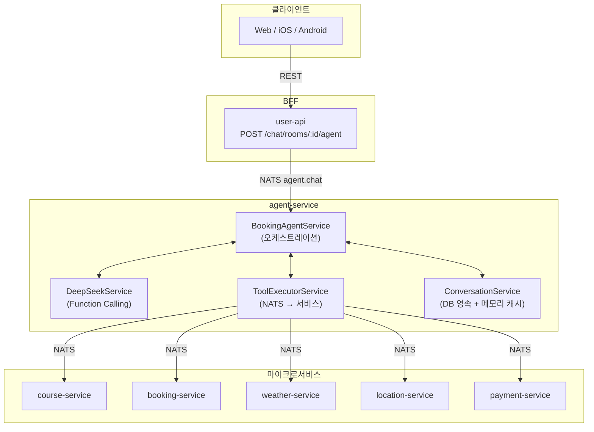
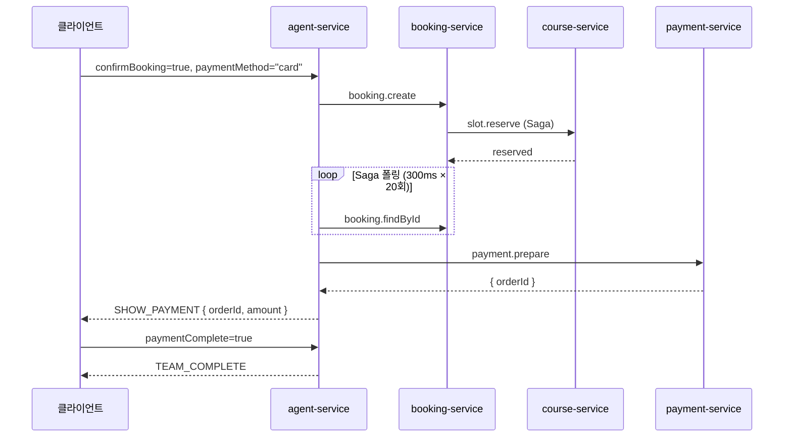
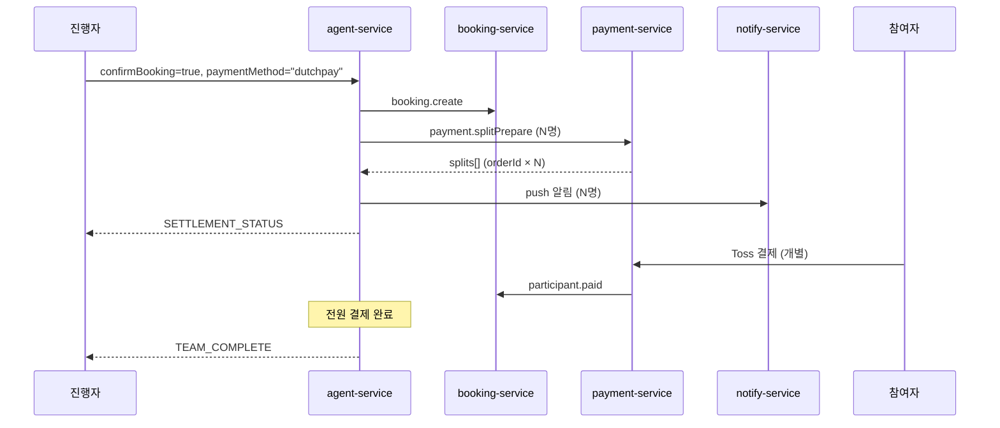

# AI 예약 에이전트 워크플로우

## 1. 개요

사용자가 자연어로 골프장 검색 → 멤버 선택 → 슬롯 선택 → 예약 → 결제까지 진행할 수 있는 AI 어시스턴트.

모든 예약은 **팀 단위 순차 처리**로 통일. 1인 예약도, 10인 그룹 예약도 동일한 플로우를 따른다.

| 경로 | 설명 | 지연시간 |
|------|------|---------|
| **Direct** | UI 카드 클릭 → LLM 없이 즉시 처리 | ~100ms |
| **LLM** | 자연어 입력 → DeepSeek Function Calling | 2~5s |

```
사용자 입력
  ├─ UI 카드 클릭? → Direct Handler → 즉시 응답
  └─ 자연어 텍스트? → DeepSeek → Tool 실행 → 응답
```

---

## 2. 아키텍처



---

## 3. 대화 컨텍스트

### 3.1 영속화

대화 컨텍스트를 DB에 저장하여 페이지 이탈/재진입, 서버 재배포 시에도 대화를 이어간다.

```prisma
model AgentConversation {
  id          String   @id @default(uuid())
  userId      Int
  chatRoomId  String
  state       String   // ConversationState
  context     Json     // slots, completedTeams, messages 등
  createdAt   DateTime @default(now())
  updatedAt   DateTime @updatedAt

  @@unique([userId, chatRoomId])
  @@index([chatRoomId])
}
```

- **키**: `userId + chatRoomId` → 채팅방 진입만으로 자동 복원, 프론트엔드가 conversationId를 관리할 필요 없음
- **저장소**: DB(영속) + NodeCache(읽기 캐시, TTL 5분)
- **정리**: state = COMPLETED/CANCELLED이고 24시간 경과 시 삭제

### 3.2 ConversationContext

```typescript
{
  userId: number
  chatRoomId: string
  state: ConversationState
  messages: { role, content, timestamp }[]
  slots: {
    location?, clubName?, clubId?, date?, time?,
    slotId?, playerCount?, confirmed?,
    latitude?, longitude?, bookingId?,
    // 팀 예약 (모든 예약에 적용)
    groupMode: boolean           // 멤버 선택 후 true
    currentTeamNumber: number    // 기본값 1
    completedTeams?: Array<{
      teamNumber: number; bookingId: number;
      slotId: string; slotTime: string; courseName: string;
      members: Array<{ userId: number; userName: string }>
    }>
    currentTeamMembers?: Array<{ userId: number; userName: string; userEmail: string }>
    chatRoomId?: string
    bookerId?: number
    paymentMethod?: string
  }
}
```

### 3.3 대화 복원 (페이지 재진입)

```
채팅방 진입 → 메시지 로드
  → 최근 AI_ASSISTANT 메시지의 metadata.state 확인
  ├─ IDLE / COMPLETED → 복원 불필요
  └─ 그 외 → AI 모드 자동 ON → agent-service가 DB에서 컨텍스트 복원
```

| 역할 | 복원 방식 |
|------|---------|
| 진행자 | `userId + chatRoomId`로 DB에서 컨텍스트 복원 → 마지막 상태 카드 재표시 |
| 참여자 | push 알림 딥링크로 결제 페이지 직접 접근 (대화 복원 불필요) |

---

## 4. 대화 상태 머신

모든 예약은 동일한 상태 머신을 따른다. 1인 예약도 멤버 선택 단계를 거친다.

```
IDLE → COLLECTING → SELECTING_MEMBERS → CONFIRMING → BOOKING → COMPLETED
                                                        ↓
                                                  (더치페이 시)
                                                     SETTLING → TEAM_COMPLETE
                                                                     ↓
                                                          "다음 팀" → SELECTING_MEMBERS
                                                          "종료"   → COMPLETED
```

| 상태 | 의미 | 전이 |
|------|------|------|
| IDLE | 초기 상태 | 첫 메시지 → COLLECTING |
| COLLECTING | 정보 수집 (클럽 검색, 카드 표시) | 클럽 선택 → SELECTING_MEMBERS |
| SELECTING_MEMBERS | 팀 멤버 선택 중 | 멤버 확정 → COLLECTING (슬롯 검색) |
| CONFIRMING | 예약 확인 대기 (슬롯 선택 후) | 확인 → BOOKING |
| BOOKING | 예약 처리 중 (Saga) | 성공 → COMPLETED / SETTLING |
| SETTLING | 더치페이 정산 중 | 전원 결제 → TEAM_COMPLETE |
| TEAM_COMPLETE | 1팀 예약 완료 | 다음 팀 → SELECTING_MEMBERS / 종료 → COMPLETED |
| COMPLETED | 예약 완료 | 종료 |
| CANCELLED | 사용자 취소 | → COLLECTING |

---

## 5. Direct Handlers

UI 카드 클릭 시 LLM 없이 즉시 처리. `BookingAgentService.chat()` 진입 시 최우선 검사.

```typescript
// 우선순위 순서
if (request.sendReminder)         → handleSendReminder()
if (request.finishGroup)          → handleFinishGroup()
if (request.nextTeam)             → handleNextTeam()
if (request.teamMembers)          → handleTeamMemberSelect()
if (request.splitPaymentComplete) → handleSplitPaymentComplete()
if (request.paymentComplete)      → handlePaymentComplete()
if (request.confirmBooking)       → handleDirectBooking()
if (request.cancelBooking)        → handleCancelBooking()
if (request.selectedSlotId)       → handleDirectSlotSelect()
if (request.selectedClubId)       → handleDirectClubSelect()
// 위 모두 해당 없으면
→ processWithLLM()
```

| Handler | 트리거 | 동작 |
|---------|--------|------|
| `handleDirectClubSelect` | 골프장 카드 클릭 | slots에 clubId 저장 → 채팅방 멤버 조회 → **SELECT_MEMBERS 카드** |
| `handleTeamMemberSelect` | 멤버 확정 클릭 | groupMode=true, 멤버 저장 → 슬롯 조회 → **SHOW_SLOTS 카드** |
| `handleDirectSlotSelect` | 슬롯 칩 클릭 | slots에 slotId 저장 → **CONFIRM_BOOKING 카드** (결제방법 3가지) |
| `handleDirectBooking` | 예약 확인 클릭 | booking.create → Saga 폴링 → 결제방법에 따라 분기 |
| `handlePaymentComplete` | 카드결제 완료 | **TEAM_COMPLETE** 또는 **BOOKING_COMPLETE** 카드 |
| `handleCancelBooking` | 취소 클릭 | slots 초기화 → COLLECTING |
| `handleNextTeam` | "다음 팀" 클릭 | teamNumber++ → **SELECT_MEMBERS** (이전 팀 멤버 제외) |
| `handleFinishGroup` | "종료" 클릭 | **BOOKING_COMPLETE** (전체 요약) + 채팅방 SYSTEM 메시지 |
| `handleSplitPaymentComplete` | 참여자 결제 완료 | 정산 갱신 → 전원 완료 시 **TEAM_COMPLETE** |
| `handleSendReminder` | 리마인더 버튼 | 미결제 참여자에게 push 알림 |

---

## 6. LLM 처리 (processWithLLM)

자연어 메시지가 Direct Handler에 해당하지 않을 때 실행.

1. DeepSeek에 메시지 + 대화 히스토리 전송
2. `tool_calls` 반환 시 → `ToolExecutorService.executeAll()` (병렬 실행)
3. 도구 결과로 UI 카드(actions) 생성 + slots 업데이트
4. 도구 결과를 DeepSeek에 전달하여 다음 응답 요청
5. 텍스트 응답이 나올 때까지 반복 (최대 5회)

### Function Calling Tools

| 도구 | NATS 패턴 | 대상 |
|------|-----------|------|
| `search_clubs` | `club.search` | course |
| `search_clubs_with_slots` | `games.search` | course |
| `get_club_info` | `clubs.get` | course |
| `get_available_slots` | `games.search` | course |
| `get_nearby_clubs` | `club.findNearby` | course |
| `get_weather` / `get_weather_by_location` | `weather.forecast` | weather |
| `create_booking` | `booking.create` | booking |
| `get_booking_policy` | `policy.*.resolve` | booking |
| `search_address` | `location.search.address` | location |

---

## 7. UI 카드

### 응답 형식

```typescript
{
  message: string
  state: ConversationState
  actions?: Array<{ type: ActionType, data: unknown }>
}
```

### 카드 목록

| ActionType | 용도 | 트리거 |
|------------|------|--------|
| `SHOW_CLUBS` | 골프장 목록 | 클릭 → handleDirectClubSelect |
| `SELECT_MEMBERS` | 팀 멤버 선택 | 클릭 → handleTeamMemberSelect |
| `SHOW_SLOTS` | 타임슬롯 목록 | 클릭 → handleDirectSlotSelect |
| `SHOW_WEATHER` | 날씨 정보 | 정보 표시만 |
| `CONFIRM_BOOKING` | 예약 확인 + 결제방법 선택 | 확인 → handleDirectBooking |
| `SHOW_PAYMENT` | 카드결제 (Toss SDK) | 10분 타이머 |
| `SETTLEMENT_STATUS` | 더치페이 정산 현황 | 리마인더/새로고침 버튼 |
| `SPLIT_PAYMENT` | 참여자 개별 결제 | push 알림으로 전달 |
| `TEAM_COMPLETE` | 팀 예약 완료 | 다음 팀/종료 버튼 |
| `BOOKING_COMPLETE` | 예약 완료 (전체 요약) | 종료 시 표시 |

### 카드 데이터

**SHOW_CLUBS**: `{ found, clubs: [{ id, name, address, region }] }`

**SELECT_MEMBERS**:
```json
{
  "teamNumber": 1, "clubName": "한밭파크골프장", "date": "2026-02-28",
  "maxPlayers": 4,
  "assignedTeams": [],
  "availableMembers": [
    { "userId": 1, "userName": "김민수", "userEmail": "kim@email.com" },
    { "userId": 2, "userName": "박지영", "userEmail": "park@email.com" }
  ]
}
```
- 1팀: `assignedTeams` 비어있음
- 2팀 이후: 이전 팀 배정 정보 포함

**SHOW_SLOTS**:
```json
{
  "clubName": "한밭파크골프장", "clubAddress": "...", "date": "2026-02-28",
  "rounds": [{ "gameId": 1, "name": "A코스 오전", "price": 15000,
    "slots": [{ "id": 1, "time": "09:00", "availableSpots": 4, "price": 15000 }]
  }]
}
```

**CONFIRM_BOOKING**:
```json
{
  "clubName": "한밭파크골프장", "date": "2026-02-28", "time": "09:00",
  "playerCount": 4, "price": 60000, "courseName": "A코스 오전",
  "groupMode": true, "teamNumber": 1,
  "members": [
    { "userId": 1, "userName": "김민수" },
    { "userId": 2, "userName": "박지영" }
  ],
  "pricePerPerson": 15000
}
```
- 결제방법: 현장결제 / 카드결제 / 더치페이 (2명 이상일 때만 더치페이 표시)

**SHOW_PAYMENT**: `{ bookingId, orderId, amount, orderName, clubName, date, time, playerCount }`

**SETTLEMENT_STATUS**: `{ teamNumber, clubName, date, slotTime, totalPrice, pricePerPerson, expiredAt, participants: [{ userId, userName, amount, status }] }`

**TEAM_COMPLETE**: `{ teamNumber, bookingId, bookingNumber, clubName, date, slotTime, courseName, participants, totalPrice, paymentMethod, hasMoreTeams }`

**BOOKING_COMPLETE**: `{ success, bookingId, bookingNumber, details: { date, time, playerCount, totalPrice } }`

### 카드 인터랙션

| 사용자 액션 | 구조화 요청 필드 |
|-------------|----------------|
| 골프장 선택 | `selectedClubId`, `selectedClubName` |
| 멤버 확정 | `teamMembers: [{ userId, userName, userEmail }]` |
| 슬롯 선택 | `selectedSlotId`, `selectedSlotTime`, `selectedSlotPrice` |
| 예약 확인 | `confirmBooking=true`, `paymentMethod` |
| 예약 취소 | `cancelBooking=true` |
| 결제 완료 | `paymentComplete=true`, `paymentSuccess` |
| 더치페이 결제 완료 | `splitPaymentComplete=true`, `splitOrderId` |
| 다음 팀 | `nextTeam=true` |
| 종료 | `finishGroup=true` |
| 리마인더 | `sendReminder=true` |

---

## 8. 결제

### 8.1 결제방법 분기

| 결제방법 | 조건 | 동작 |
|---------|------|------|
| 현장결제 (`onsite`) | 항상 가능 | 예약 생성 → 즉시 TEAM_COMPLETE |
| 카드결제 (`card`) | 항상 가능 | 예약 생성 → SHOW_PAYMENT → Toss 결제 → TEAM_COMPLETE |
| 더치페이 (`dutchpay`) | 멤버 2명 이상 | 예약 생성 → SETTLEMENT_STATUS → 전원 결제 → TEAM_COMPLETE |

### 8.2 카드결제 플로우



### 8.3 더치페이 플로우



| 시점 | 동작 |
|------|------|
| 슬롯 확보 시 | `expiredAt` = 현재 + 30분 |
| 만료 10분 전 | 미결제 참여자에게 리마인더 (job-service) |
| 만료 시 | PaymentSplit → EXPIRED, slot.release |

---

## 9. NATS 패턴

### Inbound

| 패턴 | 설명 |
|------|------|
| `agent.chat` | 메인 대화 처리 |
| `agent.reset` | 대화 초기화 |
| `agent.status` | 대화 상태 조회 |

### Outbound

| 패턴 | 대상 | 용도 |
|------|------|------|
| `club.search` | course | 골프장 검색 |
| `games.search` | course | 슬롯 검색 |
| `clubs.get` | course | 골프장 상세 |
| `club.findNearby` | course | 근처 골프장 |
| `booking.create` | booking | 예약 생성 (Saga) |
| `booking.findById` | booking | Saga 폴링 |
| `policy.*.resolve` | booking | 예약 정책 조회 |
| `payment.prepare` | payment | 카드결제 준비 |
| `payment.splitPrepare` | payment | 더치페이 준비 |
| `payment.splitConfirm` | payment | 더치페이 결제 확인 |
| `booking.participant.paid` | booking | 참여자 결제 완료 |
| `weather.forecast` | weather | 날씨 조회 |
| `location.search.address` | location | 주소 검색 |
| `chat.room.getMembers` | chat | 채팅방 멤버 조회 |
| `chat.messages.save` | chat | SYSTEM 메시지 저장 |
| `notify.sendBatch` | notify | push 알림 |

---

## 10. 메시지 타입과 가시성

| DB 타입 | 용도 | 누가 보는가 |
|---------|------|-----------|
| TEXT | 일반 채팅 | 채팅방 전체 |
| IMAGE | 이미지 | 채팅방 전체 |
| SYSTEM | 입장/퇴장/예약완료 안내 | 채팅방 전체 |
| AI_USER | AI 모드 사용자 메시지 | **본인만** (senderId 필터) |
| AI_ASSISTANT | AI 응답 + metadata(actions) | **본인만** (senderId 필터) |

> AI 메시지의 `metadata`에 `{ state, actions }` JSON을 저장하여 새로고침 후에도 카드를 복원.

---

## 11. 예약 플로우

모든 예약(1인~다수)이 동일한 플로우를 따른다. 팀 단위로 순차 처리하며, 1팀 완료 후 다음 팀을 진행한다.

### 11.1 플로우 요약

```
① 클럽 검색    → SHOW_CLUBS          (LLM)
② 멤버 선택    → SELECT_MEMBERS      (Direct: handleDirectClubSelect)
③ 슬롯 선택    → SHOW_SLOTS          (Direct: handleTeamMemberSelect)
④ 예약 확인    → CONFIRM_BOOKING     (Direct: handleDirectSlotSelect)
⑤ 결제 처리    → 결제방법에 따라 분기  (Direct: handleDirectBooking)
⑥ 팀 완료      → TEAM_COMPLETE       (다음 팀 / 종료)
⑦ 종료         → BOOKING_COMPLETE    (전체 요약 + SYSTEM 메시지)
```

### 11.2 상세 플로우

```
① "내일 강남 근처 골프장 알려줘"
   → LLM: search_clubs_with_slots → SHOW_CLUBS 카드

② [골프장 카드 클릭]
   → Direct: handleDirectClubSelect
   → 채팅방 멤버 조회 (chat.room.getMembers)
   → SELECT_MEMBERS 카드 (1팀 멤버 선택)

③ [멤버 확정 클릭]
   → Direct: handleTeamMemberSelect
   → groupMode=true, 멤버 저장
   → 슬롯 조회 → SHOW_SLOTS 카드

④ [슬롯 칩 클릭]
   → Direct: handleDirectSlotSelect
   → CONFIRM_BOOKING 카드 (결제방법 선택)
   → 2명 이상: 현장결제 / 카드결제 / 더치페이
   → 1명: 현장결제 / 카드결제

⑤ [예약 확인 + 결제방법]
   → Direct: handleDirectBooking → booking.create (Saga)
   ├─ 현장결제  → 즉시 TEAM_COMPLETE
   ├─ 카드결제  → SHOW_PAYMENT → Toss 결제 → TEAM_COMPLETE
   └─ 더치페이  → splitPrepare → push 알림 → SETTLEMENT_STATUS
                → 전원 결제 완료 → TEAM_COMPLETE

⑥ TEAM_COMPLETE 카드
   ├─ "다음 팀 예약" → handleNextTeam → SELECT_MEMBERS (②로 복귀)
   └─ "종료"        → handleFinishGroup → BOOKING_COMPLETE + SYSTEM 메시지
```

### 11.3 UI 카드 흐름

```
진행자 채팅 화면 (AI 모드)
─────────────────────────────────────────

① SHOW_CLUBS 카드
┌──────────────────────────────────────┐
│ 검색 결과 3개의 골프장을 찾았어요      │
│                                      │
│ ┌─────────────────────────────────┐  │
│ │ ⛳ 한밭파크골프장                │  │
│ │ 📍 천안시 동남구...             │  │
│ └─────────────────────────────────┘  │
│ ┌─────────────────────────────────┐  │
│ │ ⛳ 대전파크골프장                │  │
│ │ 📍 대전시 유성구...             │  │
│ └─────────────────────────────────┘  │
└──────────────────────────────────────┘
         ↓ 골프장 카드 클릭

② SELECT_MEMBERS 카드
┌──────────────────────────────────────┐
│ 👥 1팀 멤버 선택 (최대 4명)           │
│                                      │
│ ☑ 김민수 (나) 🔒                     │
│ ☑ 박지영                            │
│ ☑ 이준호                            │
│ ☑ 최서연                            │
│ ☐ 정우진                            │
│ ☐ 한소희  ...                       │
│                                      │
│ 선택: 4/4명                          │
│ [취소] [멤버 확정]                    │
└──────────────────────────────────────┘
         ↓ 멤버 확정 클릭

③ SHOW_SLOTS 카드
┌──────────────────────────────────────┐
│ ⛳ 한밭파크골프장                     │
│ 📍 천안시 ... | 📅 2026-02-28       │
│ 🏌️ 1팀 시간대를 선택해 주세요        │
│──────────────────────────────────────│
│ A코스 오전               ₩15,000    │
│ [09:00 4명] [09:30 4명] [10:00 4명] │
│──────────────────────────────────────│
│ B코스 오후               ₩15,000    │
│ [14:00 4명] [14:30 4명]             │
└──────────────────────────────────────┘
         ↓ 슬롯 선택

④ CONFIRM_BOOKING 카드
┌──────────────────────────────────────┐
│ 1팀 예약 확인                        │
│ 📍 한밭파크골프장                     │
│ 📅 2026-02-28 (금) 09:00            │
│ 👥 4명: 김민수, 박지영, 이준호, 최서연 │
│ 💳 ₩60,000 (1인당 ₩15,000)         │
│                                      │
│ 결제방법                              │
│ [🏪 현장결제] [💳 카드결제] [💰 더치페이] │
│                                      │
│ [취소] [예약 확인]                    │
└──────────────────────────────────────┘
         ↓ 더치페이 + 예약 확인

⑤ SETTLEMENT_STATUS 카드 (진행자에게 표시)
┌──────────────────────────────────────┐
│ 💰 1팀 더치페이 현황                  │
│ 📍 한밭파크골프장 | 📅 02-28 09:00   │
│ 💳 ₩60,000 (1인당 ₩15,000)         │
│                                      │
│ ✅ 김민수 (나)   ₩15,000  결제완료   │
│ ✅ 박지영        ₩15,000  결제완료   │
│ ⏳ 이준호        ₩15,000  대기중     │
│ ⏳ 최서연        ₩15,000  대기중     │
│                                      │
│ 결제 완료: 2/4명  |  ⏱ 25분 남음    │
│ [리마인더 보내기] [현황 새로고침]      │
└──────────────────────────────────────┘

⑤-1 SPLIT_PAYMENT 카드 (참여자에게 push 알림)
┌──────────────────────────────────────┐
│ 💳 결제 요청                          │
│ 김민수님이 더치페이를 요청했어요       │
│                                      │
│ 📍 한밭파크골프장                     │
│ 📅 2026-02-28 (금) 09:00            │
│ 👥 4명 (1팀)                         │
│ 💰 ₩15,000                          │
│ ⏱ 결제 기한: 25분 남음               │
│                                      │
│ [결제하기]                            │
└──────────────────────────────────────┘
         ↓ 전원 결제 완료

⑥ TEAM_COMPLETE 카드
┌──────────────────────────────────────┐
│ ✅ 1팀 예약 완료!                     │
│ 📍 한밭파크골프장                     │
│ 📅 2026-02-28 (금) 09:00            │
│ 👥 김민수, 박지영, 이준호, 최서연      │
│ 💳 ₩60,000 (더치페이 완료)           │
│ 🏷️ 예약번호 PG-20260228-001        │
│                                      │
│ [🏌️ 다음 팀 예약] [종료]             │
└──────────────────────────────────────┘
         ↓ "다음 팀" 클릭

② SELECT_MEMBERS 카드 (2팀 — 이전 팀 배정 표시)
┌──────────────────────────────────────┐
│ 👥 2팀 멤버 선택 (최대 4명)           │
│                                      │
│ ── 1팀 배정완료 ──────────────────── │
│ ✅ 김민수 (09:00 A코스)       1팀   │
│ ✅ 박지영 (09:00 A코스)       1팀   │
│ ✅ 이준호 (09:00 A코스)       1팀   │
│ ✅ 최서연 (09:00 A코스)       1팀   │
│ ── 미배정 ──────────────────────── │
│ ☑ 정우진                            │
│ ☑ 한소희                            │
│ ☑ 강태우                            │
│ ☑ 윤지민                            │
│ ☐ 오서준                            │
│ ☐ 류현아                            │
│                                      │
│ 선택: 4/4명                          │
│ [취소] [멤버 확정]                    │
└──────────────────────────────────────┘
         ↓ (③ ~ ⑥ 반복)

⑦ 종료 → 채팅방 전체 SYSTEM 메시지
┌──────────────────────────────────────┐
│ 🎉 그룹 예약이 완료되었습니다!         │
│ 📍 한밭파크골프장 | 📅 2026-02-28    │
│                                      │
│ 🏌️ 1팀 09:00 A코스 (4명)            │
│    김민수, 박지영, 이준호, 최서연      │
│ 🏌️ 2팀 09:30 A코스 (4명)            │
│    정우진, 한소희, 강태우, 윤지민      │
│                                      │
│ 💳 총 ₩120,000 | 🏷️ 2팀 8명        │
└──────────────────────────────────────┘
```

### 11.4 멤버 선택 규칙

| 규칙 | 내용 |
|------|------|
| 진행자 고정 | 1팀에 자동 선택 (🔒), 2팀 이후는 선택 가능 |
| 이전 팀 표시 | ✅ + 팀번호/슬롯 정보와 함께 비활성 (중복 방지) |
| 섹션 구분 | "N팀 배정완료" / "미배정" 섹션으로 분리 |
| 인원 | 최소 1명, 최대 4명 (availableSpots) |
| 더치페이 조건 | 선택된 멤버가 2명 이상일 때만 더치페이 옵션 표시 |
| 1인 채팅방 | SELECT_MEMBERS에 본인만 표시, 확인 후 진행 |

### 11.5 카드 컴포넌트

| 카드 | 컴포넌트 | 비고 |
|------|---------|------|
| SELECT_MEMBERS | `SelectMembersCard` | 이전 팀 배정 현황 + 미배정 체크박스 |
| SHOW_SLOTS | `SlotCard` | 기존 재사용, 이전 팀 슬롯 비활성 |
| CONFIRM_BOOKING | `ConfirmBookingCard` | 결제방법 3가지 (1인이면 2가지) |
| SHOW_PAYMENT | `PaymentCard` | Toss SDK, 10분 타이머 |
| SETTLEMENT_STATUS | `SettlementStatusCard` | 진행자: 대시보드 / 참여자: 결제 |
| SPLIT_PAYMENT | `SplitPaymentCard` | 참여자용 (push 알림 딥링크) |
| TEAM_COMPLETE | `TeamCompleteCard` | 다음 팀/종료 버튼 |

#### SelectMembersCard

```typescript
interface SelectMembersCardProps {
  data: {
    teamNumber: number;
    clubName: string;
    date: string;
    maxPlayers: number;
    assignedTeams: Array<{
      teamNumber: number;
      slotTime: string;
      courseName: string;
      members: Array<{ userId: number; userName: string }>;
    }>;
    availableMembers: Array<{
      userId: number;
      userName: string;
      userEmail: string;
    }>;
  };
  onConfirm: (members: Array<{ userId: number; userName: string; userEmail: string }>) => void;
  onCancel: () => void;
}
```

#### SettlementStatusCard

```typescript
interface SettlementStatusCardProps {
  data: {
    teamNumber: number;
    clubName: string;
    date: string;
    slotTime: string;
    totalPrice: number;
    pricePerPerson: number;
    expiredAt: string;
    participants: Array<{
      userId: number;
      userName: string;
      amount: number;
      status: 'PENDING' | 'PAID' | 'CANCELLED';
    }>;
  };
  onRefresh: () => void;
  onSendReminder: () -> void;
}
```

#### SplitPaymentCard

```typescript
interface SplitPaymentCardProps {
  data: {
    orderId: string;
    bookerName: string;
    clubName: string;
    date: string;
    slotTime: string;
    teamNumber: number;
    amount: number;
    expiredAt: string;
  };
  onPay: (orderId: string) => void;
}
```

#### TeamCompleteCard

```typescript
interface TeamCompleteCardProps {
  data: {
    teamNumber: number;
    bookingId: number;
    bookingNumber: string;
    clubName: string;
    date: string;
    slotTime: string;
    courseName: string;
    participants: Array<{ userId: number; userName: string }>;
    totalPrice: number;
    paymentMethod: string;
    hasMoreTeams: boolean;
  };
  onNextTeam: () => void;
  onFinish: () => void;
}
```

### 11.6 DB 스키마

**booking-service**:
```prisma
model Booking {
  // ... 기존 필드
  teamLabel       String?              // "1팀", "2팀"
  chatRoomId      String?              // 채팅방 ID (팀 추적용)
  participants    BookingParticipant[]
}

model BookingParticipant {
  id          Int               @id @default(autoincrement())
  bookingId   Int
  userId      Int
  userName    String
  userEmail   String
  role        ParticipantRole   @default(MEMBER)  // BOOKER | MEMBER
  status      ParticipantStatus @default(PENDING) // PENDING | PAID | CANCELLED | REFUNDED
  amount      Int
  paidAt      DateTime?
  createdAt   DateTime          @default(now())
  updatedAt   DateTime          @updatedAt

  booking     Booking           @relation(fields: [bookingId], references: [id])
  @@unique([bookingId, userId])
}
```

**payment-service**:
```prisma
model PaymentSplit {
  id          Int         @id @default(autoincrement())
  bookingId   Int
  userId      Int
  userName    String
  userEmail   String
  amount      Int
  status      SplitStatus @default(PENDING) // PENDING | PAID | EXPIRED | CANCELLED | REFUNDED
  orderId     String      @unique
  paidAt      DateTime?
  expiredAt   DateTime?
  createdAt   DateTime    @default(now())
  updatedAt   DateTime    @updatedAt

  @@index([bookingId, status])
}
```

---

## 12. 컴포넌트 파일 위치

| 플랫폼 | 경로 |
|--------|------|
| Web 카드 | `apps/user-app-web/src/components/features/chat/cards/*.tsx` |
| Web 버블 | `apps/user-app-web/src/components/features/chat/AiMessageBubble.tsx` |
| Web 페이지 | `apps/user-app-web/src/pages/ChatRoomPage.tsx` |
| Web 훅 | `apps/user-app-web/src/hooks/useAiChat.ts` |
| Android 카드 | `apps/user-app-android/.../chat/components/cards/*.kt` |
| Android VM | `apps/user-app-android/.../chat/ChatViewModel.kt` |
| iOS 카드 | `apps/user-app-ios/Sources/Features/Chat/Components/Cards/*.swift` |
| iOS VM | `apps/user-app-ios/Sources/Features/Chat/AiChatViewModel.swift` |

---

**Last Updated**: 2026-02-28
