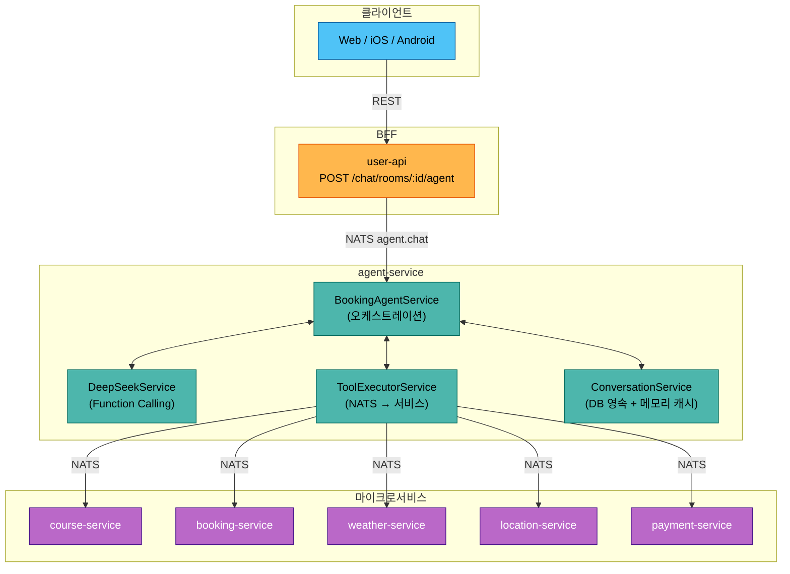
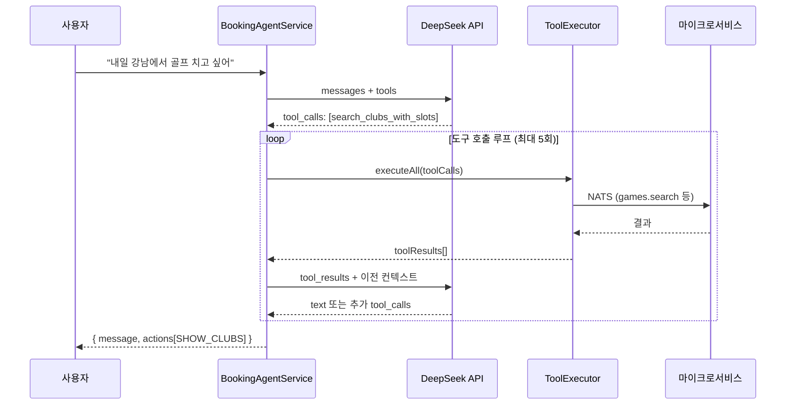
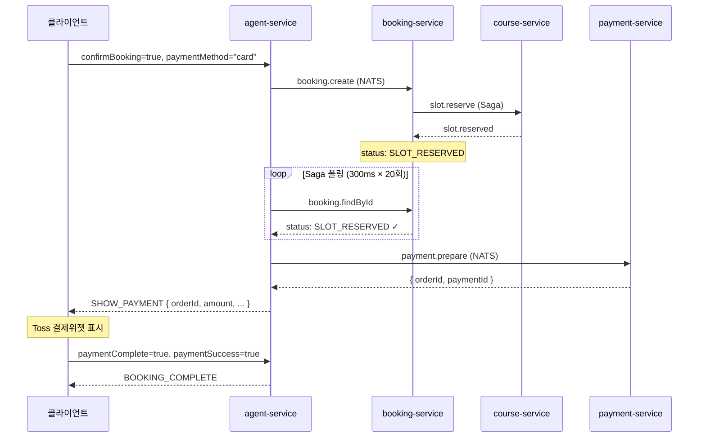
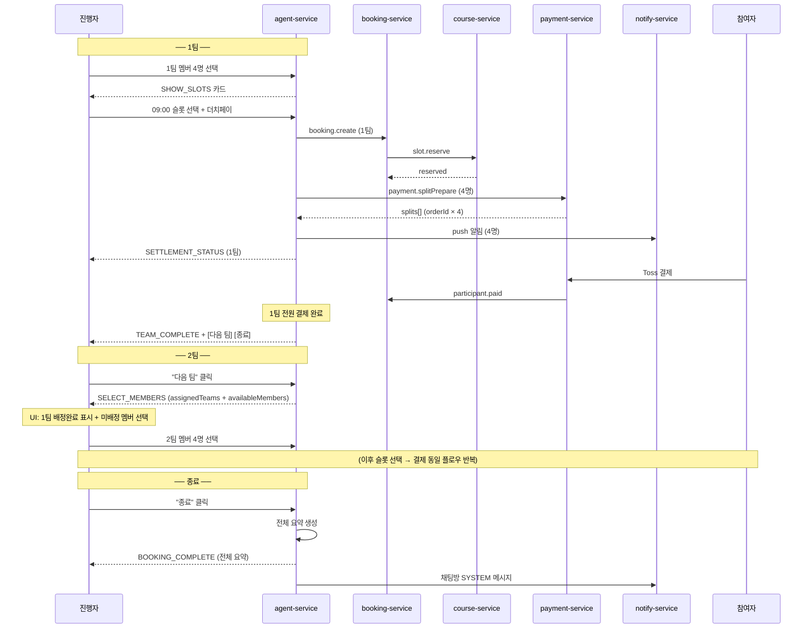

# AI 예약 에이전트 워크플로우

## 1. 개요

사용자가 자연어로 골프장 검색 → 슬롯 선택 → 예약 → 결제까지 진행할 수 있는 AI 어시스턴트.

**핵심 설계**: Direct Handling + LLM 하이브리드

| 경로 | 설명 | 지연시간 |
|------|------|---------|
| **Direct** | UI 카드 클릭 → LLM 없이 즉시 처리 | ~100ms |
| **LLM** | 자연어 입력 → DeepSeek Function Calling | 2~5s |

```
사용자 입력
  ├─ UI 카드 클릭? → Direct Handler (5종) → 즉시 응답
  └─ 자연어 텍스트? → DeepSeek → Tool 실행 → 응답
```

---

## 2. 아키텍처



### 2.1 대화 컨텍스트 영속화

대화 컨텍스트를 DB에 저장하여 **페이지 이탈/재진입, 서버 재배포** 시에도 대화를 이어갈 수 있다.

#### 왜 필요한가

| 시나리오 | 메모리 캐시만 사용 시 |
|---------|------------------|
| 더치페이 진행 중 앱 종료 후 재진입 | 결제 현황 유실, 리마인더 전송 불가 |
| 2팀 진행 중 페이지 새로고침 | completedTeams 유실, 1팀 정보 사라짐 |
| agent-service Pod 재시작/배포 | 진행 중인 모든 대화 유실 |
| 30분 이상 결제 대기 | TTL 만료로 컨텍스트 삭제 |

#### DB 스키마 (agent-service Prisma)

```prisma
model AgentConversation {
  id          String   @id @default(uuid())
  userId      Int
  chatRoomId  String
  state       String   // ConversationState
  context     Json     // slots, completedTeams, messages 등 전체 컨텍스트
  createdAt   DateTime @default(now())
  updatedAt   DateTime @updatedAt

  @@unique([userId, chatRoomId])  // 채팅방당 사용자 1개 활성 대화
  @@index([chatRoomId])
  @@index([updatedAt])            // 오래된 대화 정리용
}
```

#### 키 설계: `userId + chatRoomId`

```
기존:  conv:{userId}:{conversationId}  → 프론트가 conversationId를 기억해야 함
변경:  userId + chatRoomId (유니크)     → 채팅방 진입만으로 자동 조회
```

- `conversationId`(UUID)를 프론트엔드가 관리할 필요 없음
- 채팅방에 들어오면 `userId + chatRoomId`로 진행 중인 대화를 자동 복원
- 진행자든 참여자든 동일한 방식

#### ConversationService 변경

```
기존: NodeCache (메모리, TTL 30분)
변경: DB (영속) + NodeCache (읽기 캐시, TTL 5분)
```

```typescript
// 조회: 캐시 우선 → DB 폴백
getOrCreate(userId, chatRoomId):
  1. NodeCache 조회 → 있으면 반환
  2. DB 조회 (userId + chatRoomId) → 있으면 캐시에 적재 후 반환
  3. 없으면 DB에 새로 생성 + 캐시 적재

// 업데이트: DB + 캐시 동시 갱신
update(context):
  1. DB upsert (context → JSON 직렬화)
  2. NodeCache 갱신

// 정리: 완료된 대화 삭제
cleanup():
  - state = COMPLETED / CANCELLED 이고 updatedAt < 24시간 전 → 삭제
  - 스케줄러 (job-service 또는 @Cron)
```

#### 프론트엔드 변경 (useAiChat 훅)

```typescript
// 기존: conversationId를 React state로 관리
const [conversationId, setConversationId] = useState<string | undefined>();

// 변경: conversationId 제거, roomId만으로 대화 식별
// 요청 시 conversationId 대신 chatRoomId를 전달
// 응답의 state로 AI 모드 자동 ON/OFF 결정
```

| 시점 | 동작 |
|------|------|
| 채팅방 진입 | 메시지 로드 → 최근 AI_ASSISTANT metadata에서 state 확인 |
| state가 진행 중 | AI 모드 자동 ON + 마지막 액션 카드 복원 |
| state가 COMPLETED/IDLE | AI 모드 OFF 유지 |
| AI 모드 ON 클릭 | 첫 메시지 → agent-service가 DB에서 기존 대화 조회 또는 신규 생성 |
| AI 모드 OFF 클릭 | 대화 중단 (DB에는 유지, 재진입 시 이어가기 가능) |

#### API 변경

```
기존: POST /chat/rooms/:id/agent  { message, conversationId, ... }
변경: POST /chat/rooms/:id/agent  { message, ... }
      → conversationId 파라미터 제거
      → agent-service가 userId + chatRoomId로 대화 자동 조회
```

---

## 3. 대화 상태 머신

```
IDLE → COLLECTING → CONFIRMING → BOOKING → COMPLETED
                        ↓                      ↑
                    CANCELLED ─────────→ COLLECTING
```

| 상태 | 의미 | 전이 조건 |
|------|------|----------|
| IDLE | 초기 상태 | 첫 메시지 수신 → COLLECTING |
| COLLECTING | 정보 수집 중 (골프장 검색, 카드 표시) | 슬롯 표시 → CONFIRMING |
| CONFIRMING | 예약 확인 대기 (슬롯 선택, 확인 카드) | 확인 클릭 → BOOKING |
| BOOKING | 예약 처리 중 (Saga 진행) | 성공 → COMPLETED |
| COMPLETED | 예약 완료 | 종료 |
| CANCELLED | 사용자 취소 | 자동 → COLLECTING |

---

## 4. Direct Handlers (LLM 우회)

UI 카드 클릭 시 LLM을 거치지 않고 즉시 처리. `BookingAgentService.chat()` 진입 시 최우선 검사.

```typescript
if (request.paymentComplete) → handlePaymentComplete()
if (request.confirmBooking)  → handleDirectBooking()
if (request.cancelBooking)   → handleCancelBooking()
if (request.selectedSlotId)  → handleDirectSlotSelect()
if (request.selectedClubId)  → handleDirectClubSelect()
// 위 모두 해당 없으면 → processWithLLM()
```

### 4.1 handleDirectClubSelect

```
골프장 카드 클릭 → slots에 clubId 저장
  → get_available_slots (NATS: games.search)
  → 슬롯 있으면: SHOW_SLOTS 카드 + state=CONFIRMING
  → 슬롯 없으면: 안내 메시지 + state=COLLECTING
```

### 4.2 handleDirectSlotSelect

```
슬롯 카드 클릭 → slots에 slotId/time 저장
  → 가격 계산 (slotPrice × playerCount)
  → CONFIRM_BOOKING 카드 + state=CONFIRMING
  (NATS 호출 없음, 동기 처리)
```

### 4.3 handleDirectBooking

```
확인 버튼 클릭 → state=BOOKING
  → create_booking (NATS: booking.create)
  → Saga 폴링 (300ms × 20회, 최대 6초)
  ┌─ CONFIRMED (현장결제): BOOKING_COMPLETE 카드 + state=COMPLETED
  ├─ SLOT_RESERVED (카드결제): payment.prepare → SHOW_PAYMENT 카드 (orderId 포함)
  └─ PENDING (타임아웃): BOOKING_COMPLETE 카드 + "처리 중" 메시지
```

### 4.4 handlePaymentComplete

```
결제 완료 콜백 (paymentSuccess: true/false)
  → 성공: BOOKING_COMPLETE 카드 + state=COMPLETED
  → 실패: 재시도 안내 + state=CONFIRMING
  (NATS 호출 없음, 동기 처리)
```

### 4.5 handleCancelBooking

```
취소 버튼 클릭 → slots 초기화
  → state=COLLECTING, 안내 메시지
  (NATS 호출 없음, 동기 처리)
```

---

## 5. LLM 처리 (processWithLLM)

자연어 메시지가 Direct Handler에 해당하지 않을 때 실행.



### 도구 호출 루프

1. DeepSeek에 메시지 + 대화 히스토리 전송
2. `tool_calls` 반환 시 → `ToolExecutorService.executeAll()` (병렬 실행)
3. 도구 결과로 UI 카드(actions) 생성 + slots 업데이트
4. 도구 결과를 DeepSeek에 전달하여 다음 응답 요청
5. 텍스트 응답이 나올 때까지 반복 (최대 5회)

---

## 6. Function Calling Tools

| 도구 | 매개변수 | NATS 패턴 | 대상 서비스 |
|------|---------|-----------|-----------|
| `search_clubs` | location, name? | `club.search` | course |
| `search_clubs_with_slots` | location, date, name?, timePreference?, playerCount? | `games.search` | course |
| `get_club_info` | clubId | `clubs.get` | course |
| `get_weather` | clubId, date | `weather.forecast` | weather |
| `get_weather_by_location` | location, date, latitude?, longitude? | `weather.forecast` | weather |
| `get_available_slots` | clubId, date, timePreference? | `games.search` | course |
| `create_booking` | gameTimeSlotId, playerCount | `booking.create` | booking |
| `get_booking_policy` | clubId, policyType? | `policy.*.resolve` | booking |
| `search_address` | address | `location.search.address` | location |
| `get_nearby_clubs` | latitude, longitude, radius? | `club.findNearby` | course |

---

## 7. UI 카드 시스템

### 응답 형식

```typescript
{
  conversationId: string
  message: string                // AI 텍스트 메시지
  state: ConversationState       // 현재 상태
  actions?: ChatAction[]         // UI 카드 배열 (없으면 텍스트만)
}

interface ChatAction {
  type: ActionType
  data: unknown                  // 카드 타입별 페이로드
}
```

### 카드 타입

| ActionType | 용도 | 트리거 |
|------------|------|--------|
| `SHOW_CLUBS` | 골프장 목록 카드 | search_clubs, search_clubs_with_slots |
| `SHOW_SLOTS` | 타임슬롯 목록 카드 | get_available_slots, handleDirectClubSelect |
| `SHOW_WEATHER` | 날씨 정보 카드 | get_weather |
| `CONFIRM_BOOKING` | 예약 확인 카드 (확인/취소 버튼) | handleDirectSlotSelect |
| `SHOW_PAYMENT` | 결제 모달 트리거 (orderId 포함) | handleDirectBooking (카드결제) |
| `BOOKING_COMPLETE` | 예약 완료 카드 | handleDirectBooking, handlePaymentComplete |

### 카드 데이터 예시

**SHOW_CLUBS**:
```json
{ "found": 3, "clubs": [{ "id": 1, "name": "한밭파크골프장", "address": "대전시...", "region": "대전" }] }
```

**SHOW_SLOTS** (라운드 그룹핑 + 골프장 정보):
```json
{
  "clubName": "한밭파크골프장",
  "clubAddress": "대전광역시 유성구...",
  "date": "2026-02-26",
  "availableCount": 8,
  "rounds": [
    {
      "gameId": 1,
      "name": "A코스 오전",
      "price": 15000,
      "slots": [
        { "id": 1, "time": "09:00", "endTime": "10:30", "availableSpots": 4, "price": 15000 },
        { "id": 2, "time": "09:30", "endTime": "11:00", "availableSpots": 3, "price": 15000 }
      ]
    },
    {
      "gameId": 2,
      "name": "B코스 오후",
      "price": 20000,
      "slots": [
        { "id": 5, "time": "14:00", "endTime": "15:30", "availableSpots": 4, "price": 20000 }
      ]
    }
  ],
  "slots": [...]
}
```
> `rounds`: 게임 라운드별 그룹핑 (프론트엔드 카드 렌더링용)
> `slots`: 하위 호환용 flat 목록 (LLM 컨텍스트 / 레거시 클라이언트)

**CONFIRM_BOOKING**: `{ clubName, date, time, playerCount, price }`

**SHOW_PAYMENT**: `{ bookingId, orderId, amount, orderName, clubName, date, time, playerCount }`

**BOOKING_COMPLETE**: `{ success, bookingId, bookingNumber, status, message, details: { date, time, playerCount, totalPrice } }`

---

## 8. 프론트엔드 UI 카드 렌더링

agent-service가 반환한 `actions[]`를 프론트엔드가 채팅 버블 안에 카드로 렌더링.

### 8.1 렌더링 흐름

```
agent-service 응답
  → { message, actions: [{ type, data }] }
  → 채팅 메시지 목록에 AI 메시지 추가
  → actions[]을 messageId에 매핑하여 저장
  → AiMessageBubble 렌더링 시 action.type별 카드 컴포넌트 분기
```

```
AiMessageBubble
  ├─ 텍스트 메시지 (message)
  └─ actions.forEach { action →
       when (action.type)
         SHOW_CLUBS      → ClubCard
         SHOW_SLOTS      → SlotCard
         SHOW_WEATHER    → WeatherCard
         CONFIRM_BOOKING → ConfirmBookingCard
         SHOW_PAYMENT    → PaymentCard
         BOOKING_COMPLETE → BookingCompleteCard
     }
```

### 8.2 카드별 UI 구조

#### ClubCard (SHOW_CLUBS)

골프장 목록을 수직 스택으로 표시. 각 카드에 "선택" 버튼.

```
┌──────────────────────────────────────┐
│ 한밭파크골프장                [선택] │
│ 📍 대전광역시 유성구 한밭로 123      │
├──────────────────────────────────────┤
│ 강남파크골프                 [선택] │
│ 📍 서울특별시 강남구 ...            │
└──────────────────────────────────────┘
```

- 선택 시: 선택된 카드에 체크 아이콘, 나머지 비활성화 (alpha=0.5)
- 클릭 → 구조화 요청: `{ selectedClubId, selectedClubName }` (Direct Handler)

#### SlotCard (SHOW_SLOTS)

골프장 정보 헤더 + 게임 라운드별 그룹 + 타임슬롯 칩.

```
┌──────────────────────────────────────┐
│ ⛳ 한밭파크골프장                     │
│ 📍 대전광역시 유성구 한밭로 123       │
│ 📅 2026년 2월 26일 (목)              │
├──────────────────────────────────────┤
│ A코스 오전                  ₩15,000 │
│ ┌──────────┐ ┌──────────┐           │
│ │ 09:00 4명│ │ 09:30 3명│           │
│ └──────────┘ └──────────┘           │
├╌╌╌╌╌╌╌╌╌╌╌╌╌╌╌╌╌╌╌╌╌╌╌╌╌╌╌╌╌╌╌╌╌╌╌╌┤
│ B코스 오후                  ₩20,000 │
│ ┌──────────┐ ┌──────────┐           │
│ │ 14:00 4명│ │ 14:30 4명│           │
│ └──────────┘ └──────────┘           │
└──────────────────────────────────────┘
```

- 라운드 헤더: 라운드명 (좌) + 이용금액 (우)
- 타임슬롯 칩: 시간 + 예약가능 인원 (FlowRow 배치)
- 선택 시: 체크 아이콘 + 하이라이트, 나머지 비활성화
- 클릭 → 구조화 요청: `{ selectedSlotId, selectedSlotTime, selectedSlotPrice }` (Direct Handler)
- `rounds` 없으면 하위 호환 flat `slots` 2열 그리드로 폴백

#### WeatherCard (SHOW_WEATHER)

```
┌──────────────────────────────────────┐
│ ☀️ 18°C 맑음                         │
│ 골프 치기 좋은 날씨예요!              │
└──────────────────────────────────────┘
```

- 날씨 아이콘 (비/맑음/흐림) + 기온 + 추천 메시지

#### ConfirmBookingCard (CONFIRM_BOOKING)

예약 정보 확인 + 결제방법 선택 + 확인/취소 버튼.

```
┌──────────────────────────────────────┐
│ 예약 정보 확인                        │
│ 📍 한밭파크골프장                     │
│ 📅 2026-02-26 (목)                   │
│ 🕐 09:00                             │
│ 👥 2명                               │
│ 💳 ₩30,000                           │
│                                      │
│ 결제방법                              │
│ ┌──────────┐ ┌──────────┐           │
│ │ 🏪 현장결제│ │ 💳 카드결제│           │
│ └──────────┘ └──────────┘           │
│                                      │
│ ┌──────┐ ┌──────────┐               │
│ │ 취소  │ │ 예약 확인  │               │
│ └──────┘ └──────────┘               │
└──────────────────────────────────────┘
```

- 무료(price=0)일 때 결제방법 UI 숨김, 자동으로 `onsite` 전달
- 확인 클릭 → `onConfirm(paymentMethod)` → 구조화 요청: `{ confirmBooking: true, paymentMethod }`
- 취소 클릭 → `onCancel()` → 구조화 요청: `{ cancelBooking: true }`

#### PaymentCard (SHOW_PAYMENT)

카드결제 시 표시되는 결제 카드. 10분 타이머 포함.

```
┌──────────────────────────────────────┐
│ 💳 카드결제                           │
│ 📍 한밭파크골프장                     │
│ 📅 2026-02-26 (목) 09:00             │
│ 👥 2명                               │
│ 💰 ₩30,000                           │
│                                      │
│ ┌────────────────────────────┐      │
│ │ ⏱ 결제 제한시간: 09:45 남음 │      │
│ └────────────────────────────┘      │
│                                      │
│ ┌──────┐ ┌──────────┐               │
│ │예약취소│ │ 결제하기  │               │
│ └──────┘ └──────────┘               │
└──────────────────────────────────────┘
```

- 10분 카운트다운 (1분 미만 시 노란색, 만료 시 빨간색)
- 만료 시 → `onPaymentComplete(false)` 자동 호출
- 결제하기 클릭 → Toss Payments SDK 호출 → `onPaymentComplete(true/false)`
- 예약취소 클릭 → `onPaymentComplete(false)`

#### BookingCompleteCard (BOOKING_COMPLETE)

```
┌──────────────────────────────────────┐
│ ✅ 예약 완료                          │
│ 🏷️ 예약번호  PG-20260226-001         │
│ 📅 2026.02.26  09:00                 │
│ 👥 4명                               │
│ 💳 ₩60,000                           │
└──────────────────────────────────────┘
```

- 예약 확인 정보 (번호, 날짜, 시간, 인원, 금액)

### 8.3 카드 인터랙션 → 백엔드 연동

| 사용자 액션 | 구조화 요청 필드 | 백엔드 경로 |
|-------------|----------------|------------|
| ClubCard 클릭 | `selectedClubId`, `selectedClubName` | Direct: handleDirectClubSelect |
| SlotCard 칩 클릭 | `selectedSlotId`, `selectedSlotTime`, `selectedSlotPrice` | Direct: handleDirectSlotSelect |
| 예약 확인 버튼 | `confirmBooking=true`, `paymentMethod` | Direct: handleDirectBooking |
| 예약 취소 버튼 | `cancelBooking=true` | Direct: handleCancelBooking |
| 결제 완료 콜백 | `paymentComplete=true`, `paymentSuccess` | Direct: handlePaymentComplete |

> 모든 카드 인터랙션은 구조화 필드를 포함하여 **Direct Handler**로 즉시 처리 (~100ms).
> LLM 경로는 자연어 텍스트 입력에만 사용.

### 8.4 컴포넌트 파일 위치

| 플랫폼 | 경로 |
|--------|------|
| Web | `apps/user-app-web/src/components/features/chat/cards/{ClubCard,SlotCard,WeatherCard,ConfirmBookingCard,PaymentCard,BookingCompleteCard}.tsx` |
| Web | `apps/user-app-web/src/components/features/chat/AiMessageBubble.tsx` (카드 분기) |
| Web | `apps/user-app-web/src/pages/ChatRoomPage.tsx` (콜백 연결) |
| Web | `apps/user-app-web/src/hooks/useAiChat.ts` (구조화 요청 전송) |
| Android | `apps/user-app-android/.../chat/components/cards/{ClubCard,SlotCard,WeatherCard,ConfirmBookingCard,PaymentCard,BookingCompleteCard}.kt` |
| Android | `apps/user-app-android/.../chat/components/AiMessageBubble.kt` (카드 분기) |
| Android | `apps/user-app-android/.../chat/ChatViewModel.kt` (상태 관리 + sendAiFollowUp) |
| Android | `apps/user-app-android/.../chat/ChatRoomScreen.kt` (콜백 연결) |

---

## 9. 결제 원샷 플로우

카드결제 시 Agent가 `booking.create` → Saga 폴링 → `payment.prepare`를 한 번에 처리하여, 프론트엔드는 orderId가 포함된 SHOW_PAYMENT 카드만 받으면 바로 Toss 결제위젯을 띄울 수 있음.



`payment.prepare` 실패 시 `orderId: null`로 graceful degradation (프론트엔드 fallback).

---

## 10. NATS 메시지 패턴

### Inbound (agent-service가 수신)

| 패턴 | 설명 |
|------|------|
| `agent.chat` | 메인 대화 처리 (Direct + LLM) |
| `agent.reset` | 대화 초기화, 환영 메시지 반환 |
| `agent.status` | 대화 상태 조회 (state, slots, messageCount) |
| `agent.stats` | 캐시 통계 (keys, hits, misses) |

### Outbound (agent-service가 발신)

| 패턴 | 대상 서비스 | 도구 |
|------|-----------|------|
| `club.search` | course-service | search_clubs |
| `games.search` | course-service | search_clubs_with_slots, get_available_slots |
| `clubs.get` | course-service | get_club_info |
| `club.findNearby` | course-service | get_nearby_clubs |
| `booking.create` | booking-service | create_booking |
| `booking.findById` | booking-service | Saga 폴링 |
| `policy.*.resolve` | booking-service | get_booking_policy |
| `payment.prepare` | payment-service | 원샷 결제 준비 |
| `weather.forecast` | weather-service | get_weather |
| `location.search.address` | location-service | search_address |

---

## 11. 세션 관리

| 항목 | 값 |
|------|-----|
| 저장소 | node-cache (인메모리) |
| TTL | 30분 (CONVERSATION_TTL 환경변수) |
| 히스토리 | 최근 10턴 (MAX_HISTORY_TURNS 환경변수) |
| 캐시 키 | `conv:{userId}:{conversationId}` |

### ConversationContext

```typescript
{
  conversationId: string       // UUID v4
  userId: number
  state: ConversationState
  messages: { role, content, timestamp }[]
  slots: {
    location?, clubName?, clubId?, date?, time?,
    slotId?, playerCount?, confirmed?,
    latitude?, longitude?, bookingId?
  }
  createdAt: Date
  updatedAt: Date
}
```

---

## 12. 전체 예약 플로우 (요약)

```
① 사용자: "내일 강남 근처 골프장 알려줘"
   → LLM: search_clubs_with_slots → SHOW_CLUBS 카드

② 사용자: [골프장 카드 클릭]
   → Direct: handleDirectClubSelect → SHOW_SLOTS 카드

③ 사용자: [슬롯 카드 클릭]
   → Direct: handleDirectSlotSelect → CONFIRM_BOOKING 카드

④ 사용자: [확인 버튼 클릭 + paymentMethod=card]
   → Direct: handleDirectBooking → Saga → payment.prepare → SHOW_PAYMENT 카드

⑤ 사용자: [Toss 결제 완료]
   → Direct: handlePaymentComplete → BOOKING_COMPLETE 카드
```

> 대부분의 인터랙션은 **Direct Handler**(②~⑤)로 처리되어 LLM 지연 없이 즉시 응답.
> LLM은 자연어 해석이 필요한 **최초 검색**(①)과 **추가 질문**에만 사용.

---

## 13. 그룹 예약 + 더치페이

### 13.1 개요

동호회 채팅방에서 AI 예약 모드로 **팀 단위 예약**을 진행하는 워크플로우.
진행자가 팀별로 멤버 배정 → 슬롯 선택 → 더치페이 결제를 **한 팀씩 순차 진행**한다.

**핵심 원칙: 1팀 = 1카드 = 1예약 플로우**
- 기존 싱글 예약 플로우(섹션 12)에 **멤버 선택** 단계만 추가
- 팀별로 완전히 독립된 예약 → 한 팀 실패가 다른 팀에 영향 없음
- 진행자가 "다음 팀" 버튼으로 원하는 만큼 반복

**진입 경로**:

| 사용자 입력 | AI 동작 |
|-----------|---------|
| "내일 천안 예약해줘" | 싱글 예약 (기존 플로우, 섹션 12) |
| "내일 천안 3팀 예약해줘" | 그룹 예약 → 1팀부터 순차 진행 |
| "내일 천안 동호회 예약" | 그룹 예약 → 1팀부터 순차 진행 |
| 싱글 예약 완료 후 "한 팀 더" | 다음 팀 진행 |

**설계 원칙**:
- 팀당 1개 `Booking` + 1개 `GameTimeSlot` (최대 4명)
- 각 팀은 싱글 예약 플로우를 그대로 재사용
- 더치페이 시 팀 멤버 전원에게 개별 결제 요청
- 현장결제 시 더치페이 없이 즉시 예약 확정
- 전 팀 완료 시 채팅방 전체에 예약완료 안내

### 13.2 워크플로우 요약

```
┌──────────────────────────────────────────────────────┐
│ 🔄 팀별 반복 (진행자가 "다음 팀"으로 반복)              │
│                                                      │
│  ① 멤버 선택 (4명)  ← 채팅방 멤버에서 선택             │
│         ↓                                            │
│  ② 슬롯 선택        ← 기존 SHOW_SLOTS 카드            │
│         ↓                                            │
│  ③ 예약 확인 + 결제방법 선택                            │
│         ↓                                            │
│  ④ 더치페이 결제 요청 → 개별 결제                       │
│         ↓                                            │
│  ⑤ 팀 예약 완료                                       │
│         ↓                                            │
│  "다음 팀 예약할까요?" → [다음 팀] [종료]               │
│                                                      │
└──────────────────────────────────────────────────────┘
         ↓ 종료 시
┌──────────────────────────────────────────────────────┐
│ 📢 채팅방 전체에 예약완료 SYSTEM 메시지 브로드캐스트     │
└──────────────────────────────────────────────────────┘
```

### 13.3 상태 머신

```
팀별 플로우 (싱글 예약 확장):
IDLE → COLLECTING → SELECTING_MEMBERS → CONFIRMING → BOOKING → SETTLING → TEAM_COMPLETE
                                                                              ↓
                                                                   "다음 팀" → SELECTING_MEMBERS
                                                                   "종료"   → COMPLETED (전체 요약)
```

| 상태 | 의미 | 전이 조건 |
|------|------|----------|
| SELECTING_MEMBERS | 팀 멤버 선택 중 | 4명 선택 완료 → COLLECTING |
| COLLECTING | 슬롯 검색/선택 | 슬롯 선택 → CONFIRMING |
| CONFIRMING | 예약 확인 + 결제방법 | 확인 → BOOKING |
| BOOKING | 예약 + 슬롯 확보 | 성공 → SETTLING (더치페이) / TEAM_COMPLETE (현장결제) |
| SETTLING | 더치페이 정산 중 | 전원 결제 → TEAM_COMPLETE |
| TEAM_COMPLETE | 1팀 예약 완료 | 다음 팀 → SELECTING_MEMBERS / 종료 → COMPLETED |
| COMPLETED | 전 팀 완료 | SYSTEM 메시지 브로드캐스트 |

### 13.4 DB 스키마

#### booking-service

```prisma
// ── Booking 모델 확장 (기존 모델에 필드 추가) ──
model Booking {
  // ... 기존 필드
  teamLabel       String?           // "1팀", "2팀" 등 (그룹 예약 시)
  chatRoomId      String?           // 채팅방 ID (그룹 예약 추적용)

  participants    BookingParticipant[]
  // ... 기존 관계 (payments, histories)
}

// ── 예약 참여자 (더치페이 시) ──
model BookingParticipant {
  id          Int               @id @default(autoincrement())
  bookingId   Int
  userId      Int
  userName    String
  userEmail   String
  role        ParticipantRole   @default(MEMBER)
  status      ParticipantStatus @default(PENDING)
  amount      Int                              // 1인 부담 금액 (원)
  paidAt      DateTime?
  createdAt   DateTime          @default(now())
  updatedAt   DateTime          @updatedAt

  booking     Booking           @relation(fields: [bookingId], references: [id])

  @@unique([bookingId, userId])
  @@index([userId, status])
}

enum ParticipantRole {
  BOOKER    // 예약 진행자
  MEMBER    // 일반 참여자
}

enum ParticipantStatus {
  PENDING    // 결제 대기
  PAID       // 결제 완료
  CANCELLED  // 참여 취소
  REFUNDED   // 환불 완료
}
```

> `BookingGroup` 모델 제거 — 각 팀이 독립 `Booking`이므로 그룹 묶음 불필요.
> 채팅방 기준 그룹 조회가 필요하면 `chatRoomId + teamLabel`로 조회.

#### payment-service

```prisma
model PaymentSplit {
  id              Int          @id @default(autoincrement())
  paymentId       Int?         // Toss 결제 완료 시 생성되는 Payment ID
  bookingId       Int          // 소속 Booking
  userId          Int
  userName        String
  userEmail       String
  amount          Int          // 분담 금액 (원)
  status          SplitStatus  @default(PENDING)
  orderId         String       @unique  // Toss 주문 ID (개별)
  paidAt          DateTime?
  expiredAt       DateTime?    // 결제 기한
  createdAt       DateTime     @default(now())
  updatedAt       DateTime     @updatedAt

  payment         Payment?     @relation(fields: [paymentId], references: [id])

  @@index([bookingId, status])
  @@index([userId, status])
}

enum SplitStatus {
  PENDING     // 결제 대기
  PAID        // 결제 완료
  EXPIRED     // 기한 만료
  CANCELLED   // 취소
  REFUNDED    // 환불
}
```

### 13.5 팀별 예약 플로우 상세

20명 동호회 채팅방에서 3팀 예약하는 시나리오 기준.

#### Step 1: 멤버 선택 (SELECT_MEMBERS 카드)

진행자가 채팅방 멤버 중 이번 팀에 참여할 멤버를 선택한다. (최대 4명)

**1팀 (최초):**
```
┌──────────────────────────────────────────┐
│ 👥 1팀 멤버 선택 (최대 4명)               │
│                                          │
│ ☑ 김민수 (나) 🔒                         │
│ ☑ 박지영                                │
│ ☑ 이준호                                │
│ ☑ 최서연                                │
│ ☐ 정우진                                │
│ ☐ 한소희                                │
│ ... (채팅방 멤버 10명)                    │
│                                          │
│ 선택: 4/4명                              │
│                                          │
│ ┌────────┐ ┌──────────┐                │
│ │  취소   │ │  멤버 확정  │                │
│ └────────┘ └──────────┘                │
└──────────────────────────────────────────┘
```

**2팀 (이전 팀 배정 표시):**
```
┌──────────────────────────────────────────┐
│ 👥 2팀 멤버 선택 (최대 4명)               │
│                                          │
│ ── 1팀 배정완료 ──────────────────────── │
│ ✅ 김민수 (09:00 A코스)        1팀       │
│ ✅ 박지영 (09:00 A코스)        1팀       │
│ ✅ 이준호 (09:00 A코스)        1팀       │
│ ✅ 최서연 (09:00 A코스)        1팀       │
│ ── 미배정 ────────────────────────────── │
│ ☑ 정우진                                │
│ ☑ 한소희                                │
│ ☑ 강태우                                │
│ ☑ 윤지민                                │
│ ☐ 오서준                                │
│ ☐ 류현아                                │
│                                          │
│ 선택: 4/4명                              │
│                                          │
│ ┌────────┐ ┌──────────┐                │
│ │  취소   │ │  멤버 확정  │                │
│ └────────┘ └──────────┘                │
└──────────────────────────────────────────┘
```

| 규칙 | 내용 |
|------|------|
| 진행자 고정 | 진행자(나)는 1팀에 자동 선택, 해제 불가 (🔒) |
| 2팀 이후 | 진행자는 자동 선택 안 됨, 원하면 선택 가능 |
| 이전 팀 표시 | 배정된 멤버는 ✅ + 팀번호/슬롯 정보와 함께 비활성 표시 (중복 방지) |
| 섹션 구분 | "N팀 배정완료" / "미배정" 섹션으로 구분하여 현황 한눈에 파악 |
| 최대 인원 | 슬롯의 `availableSpots` (보통 4명) |
| 최소 인원 | 1명 이상 |

**구조화 요청** (멤버 확정 클릭 시):
```typescript
{
  message: "1팀 멤버 확정",
  teamMembers: [
    { userId: 1, userName: "김민수", userEmail: "kim@email.com" },
    { userId: 2, userName: "박지영", userEmail: "park@email.com" },
    { userId: 3, userName: "이준호", userEmail: "lee@email.com" },
    { userId: 4, userName: "최서연", userEmail: "choi@email.com" },
  ],
}
```

---

#### Step 2: 슬롯 선택 (기존 SHOW_SLOTS 카드 재사용)

기존 싱글 예약과 동일한 슬롯 카드. 1개 슬롯만 선택.

```
┌──────────────────────────────────────────┐
│ ⛳ 한밭파크골프장                          │
│ 📍 천안시 서북구 ... | 📅 2026-02-28     │
│ 🏌️ 1팀 시간대를 선택해 주세요             │
├──────────────────────────────────────────┤
│ A코스 오전                     ₩15,000  │
│ ┌──────────┐ ┌──────────┐ ┌──────────┐ │
│ │ 09:00 4명 │ │ 09:30 4명 │ │ 10:00 4명│ │
│ └──────────┘ └──────────┘ └──────────┘ │
├╌╌╌╌╌╌╌╌╌╌╌╌╌╌╌╌╌╌╌╌╌╌╌╌╌╌╌╌╌╌╌╌╌╌╌╌╌╌╌╌┤
│ B코스 오후                     ₩15,000  │
│ ┌──────────┐ ┌──────────┐              │
│ │ 14:00 4명 │ │ 14:30 4명 │              │
│ └──────────┘ └──────────┘              │
└──────────────────────────────────────────┘
```

> 이전 팀이 선택한 슬롯은 비활성 표시 (중복 방지)
> 슬롯 클릭 → 기존 `selectedSlotId` 구조화 요청 (싱글 예약과 동일)

---

#### Step 3: 예약 확인 + 결제방법 (기존 CONFIRM_BOOKING 카드 확장)

기존 예약 확인 카드에 **더치페이** 결제방법 추가.

```
┌──────────────────────────────────────────┐
│ 1팀 예약 확인                             │
│ 📍 한밭파크골프장                         │
│ 📅 2026-02-28 (금) 09:00                │
│ 👥 4명: 김민수, 박지영, 이준호, 최서연     │
│ 💳 ₩60,000 (1인당 ₩15,000)             │
│                                          │
│ 결제방법                                  │
│ ┌──────────┐ ┌──────────┐              │
│ │ 🏪 현장결제 │ │ 💰 더치페이 │              │
│ └──────────┘ └──────────┘              │
│                                          │
│ ┌────────┐ ┌──────────┐                │
│ │  취소   │ │  예약 확인  │                │
│ └────────┘ └──────────┘                │
└──────────────────────────────────────────┘
```

| 결제방법 | 동작 |
|---------|------|
| 현장결제 | 기존 싱글 플로우 (슬롯 확보 → 즉시 예약 완료) |
| 더치페이 | 슬롯 확보 → `payment.splitPrepare` → 팀 멤버에게 push 알림 → Step 4 |

---

#### Step 4: 더치페이 결제 (팀 단위 SETTLEMENT_STATUS)

팀 멤버에게 개별 결제 요청이 push 알림으로 전송된다.
진행자는 해당 팀의 결제 현황 카드를 본다.

```
┌──────────────────────────────────────────┐
│ 💰 1팀 더치페이 현황                      │
│ 📍 한밭파크골프장 | 📅 2026-02-28 09:00  │
│ 💳 ₩60,000 (1인당 ₩15,000)             │
│                                          │
│ ✅ 김민수 (나)      ₩15,000  결제완료    │
│ ✅ 박지영           ₩15,000  결제완료    │
│ ⏳ 이준호           ₩15,000  대기중      │
│ ⏳ 최서연           ₩15,000  대기중      │
│                                          │
│ 결제 완료: 2/4명  |  ⏱ 25분 남음         │
│                                          │
│ ┌──────────────┐ ┌──────────────┐      │
│ │ 리마인더 보내기 │ │ 현황 새로고침  │      │
│ └──────────────┘ └──────────────┘      │
└──────────────────────────────────────────┘
```

각 참여자가 받는 결제 화면 (push 알림 → SPLIT_PAYMENT):

```
┌──────────────────────────────────────┐
│ 💳 결제 요청                          │
│ 김민수님이 더치페이를 요청했어요       │
│                                      │
│ 📍 한밭파크골프장                     │
│ 📅 2026-02-28 (금) 09:00            │
│ 👥 4명 (1팀)                         │
│ 💰 ₩15,000                          │
│                                      │
│ ⏱ 결제 기한: 25분 남음               │
│                                      │
│ ┌──────────────────────┐            │
│ │       결제하기         │            │
│ └──────────────────────┘            │
└──────────────────────────────────────┘
```

---

#### Step 5: 팀 예약 완료 + 다음 팀

팀 전원 결제 완료 시:

```
┌──────────────────────────────────────────┐
│ ✅ 1팀 예약 완료!                         │
│ 📍 한밭파크골프장                         │
│ 📅 2026-02-28 (금) 09:00                │
│ 👥 김민수, 박지영, 이준호, 최서연          │
│ 💳 ₩60,000 (더치페이 완료)               │
│ 🏷️ 예약번호 PG-20260228-001             │
│                                          │
│ ┌──────────────┐ ┌──────────┐          │
│ │ 🏌️ 다음 팀 예약 │ │  종료    │          │
│ └──────────────┘ └──────────┘          │
└──────────────────────────────────────────┘
```

| 선택 | 동작 |
|------|------|
| **다음 팀 예약** | state → SELECTING_MEMBERS, 이전 팀 멤버 제외한 멤버 목록 표시 |
| **종료** | 전체 예약 요약 + 채팅방 SYSTEM 메시지 브로드캐스트 |

---

#### 전체 종료: 채팅방 예약완료 안내

진행자가 "종료" 선택 시 (또는 예정된 팀 수 완료 시), 채팅방 전체에 SYSTEM 메시지 브로드캐스트.

```
┌──────────────────────────────────────────┐
│ 🎉 그룹 예약이 완료되었습니다!             │
│                                          │
│ 📍 한밭파크골프장                         │
│ 📅 2026-02-28 (금)                       │
│                                          │
│ 🏌️ 1팀 09:00 A코스 (4명)                │
│    김민수, 박지영, 이준호, 최서연          │
│ 🏌️ 2팀 09:30 A코스 (4명)                │
│    정우진, 한소희, 류진우, 강다영          │
│ 🏌️ 3팀 14:00 B코스 (4명)                │
│    윤재호, 송미라, 임태현, 배수진          │
│                                          │
│ 💳 총 ₩180,000 | 🏷️ 3팀 12명            │
└──────────────────────────────────────────┘
```

> 이 메시지는 SYSTEM 타입 → 채팅방 전체 참여자에게 노출
> 진행자의 AI 채팅에는 별도로 전체 요약 BOOKING_COMPLETE 카드 표시

### 13.6 시퀀스 다이어그램



### 13.7 대화 복원 (페이지 재진입)

더치페이 진행 중 앱 종료/새로고침 후 재진입 시 대화를 이어간다.
섹션 2.1의 `AgentConversation` DB를 활용.

#### 복원 흐름

```
채팅방 진입
  ↓
메시지 목록 로드 (기존)
  ↓
최근 AI_ASSISTANT 메시지의 metadata.state 확인
  ├─ IDLE / COMPLETED → AI 모드 OFF (복원 불필요)
  └─ 그 외 (COLLECTING, SETTLING 등) → 진행 중인 대화 있음
       ↓
   AI 모드 자동 ON
       ↓
   첫 요청 시 agent-service가 DB에서 컨텍스트 복원
   (userId + chatRoomId → AgentConversation)
       ↓
   마지막 상태에 맞는 카드 재표시
   (예: SETTLING → SETTLEMENT_STATUS 카드)
```

#### 복원 시나리오별 동작

| 시나리오 | 복원 시 카드 | 데이터 출처 |
|---------|------------|-----------|
| 1팀 더치페이 결제 대기 중 | SETTLEMENT_STATUS (결제 현황) | DB context.completedTeams + payment-service 실시간 조회 |
| 2팀 멤버 선택 중 | SELECT_MEMBERS (이전 팀 표시) | DB context.completedTeams → assignedTeams 생성 |
| 슬롯 선택 중 | SHOW_SLOTS | DB context.slots (clubId, date) → course-service 재조회 |
| 예약 확인 대기 | CONFIRM_BOOKING | DB context.slots 전체 |

#### 진행자 vs 참여자

| 역할 | 복원 대상 | 키 |
|------|---------|-----|
| 진행자 | AI 대화 전체 (팀 편성, 결제 현황 등) | userId(진행자) + chatRoomId |
| 참여자 | 결제 요청 화면 (SPLIT_PAYMENT) | push 알림 딥링크로 결제 페이지 직접 접근 (대화 복원 불필요) |

> 참여자는 AI 대화에 참여하지 않으므로 대화 복원이 아닌 **결제 딥링크**로 처리.

### 13.8 메시지 가시성

| 메시지 타입 | 누가 보는가 | DB 타입 | 채널 |
|------------|-----------|--------|------|
| AI 대화 (멤버 선택, 슬롯 선택 등) | 진행자 본인만 | AI_USER / AI_ASSISTANT | senderId 필터 |
| SETTLEMENT_STATUS 카드 | 진행자 본인만 | AI_ASSISTANT metadata | senderId 필터 |
| TEAM_COMPLETE / BOOKING_COMPLETE | 진행자 본인만 | AI_ASSISTANT metadata | senderId 필터 |
| 분할결제 요청 | 해당 참여자 개별 | - | push 알림 (notify-service) |
| 예약완료 안내 | **채팅방 전체** | SYSTEM | 채팅방 브로드캐스트 |
| 일반 채팅 | **채팅방 전체** | TEXT / IMAGE | 채팅방 히스토리 |

### 13.9 Direct Handlers

```typescript
// 기존 체인에 추가 (그룹 예약용)
if (request.splitPaymentComplete) → handleSplitPaymentComplete()
if (request.teamMembers)          → handleTeamMemberSelect()
if (request.nextTeam)             → handleNextTeam()
if (request.finishGroup)          → handleFinishGroup()
if (request.sendReminder)         → handleSendReminder()
```

| Handler | 트리거 | 동작 |
|---------|--------|------|
| `handleTeamMemberSelect` | 멤버 확정 클릭 | 멤버 저장 → SHOW_SLOTS 카드 (이전 팀 슬롯 제외) |
| `handleNextTeam` | "다음 팀" 클릭 | teamNumber++ → SELECT_MEMBERS 카드 (이전 팀 멤버 제외) |
| `handleFinishGroup` | "종료" 클릭 | 전체 요약 BOOKING_COMPLETE + 채팅방 SYSTEM 메시지 |
| `handleSplitPaymentComplete` | 참여자 결제 완료 | 팀 정산 갱신 → 전원 완료 시 TEAM_COMPLETE 카드 |
| `handleSendReminder` | 리마인더 버튼 | 해당 팀 미결제 참여자에게 push 알림 |

> 슬롯 선택, 예약 확인, 결제 완료는 **기존 싱글 플로우 핸들러를 그대로 재사용**
> (handleDirectSlotSelect, handleDirectBooking, handlePaymentComplete)

### 13.10 UI 카드

| ActionType | 용도 | 신규/기존 |
|------------|------|----------|
| `SELECT_MEMBERS` | 채팅방 멤버에서 팀 멤버 선택 | **신규** |
| `SHOW_SLOTS` | 슬롯 선택 | 기존 재사용 (이전 팀 슬롯 비활성) |
| `CONFIRM_BOOKING` | 예약 확인 + 결제방법 | 기존 확장 (더치페이 옵션 추가) |
| `SETTLEMENT_STATUS` | 팀 단위 더치페이 현황 | 기존 (1팀 단위로 단순화) |
| `SPLIT_PAYMENT` | 참여자 개별 결제 | 기존 |
| `TEAM_COMPLETE` | 팀 예약 완료 + 다음 팀/종료 버튼 | **신규** |
| `BOOKING_COMPLETE` | 전체 예약 요약 | 기존 확장 (멀티팀 요약) |

#### SELECT_MEMBERS 데이터

```json
{
  "teamNumber": 2,
  "clubName": "한밭파크골프장",
  "date": "2026-02-28",
  "maxPlayers": 4,
  "assignedTeams": [
    {
      "teamNumber": 1,
      "slotTime": "09:00",
      "courseName": "A코스",
      "members": [
        { "userId": 1, "userName": "김민수" },
        { "userId": 2, "userName": "박지영" },
        { "userId": 3, "userName": "이준호" },
        { "userId": 4, "userName": "최서연" }
      ]
    }
  ],
  "availableMembers": [
    { "userId": 5, "userName": "정우진", "userEmail": "jung@email.com" },
    { "userId": 6, "userName": "한소희", "userEmail": "han@email.com" },
    { "userId": 7, "userName": "강태우", "userEmail": "kang@email.com" },
    { "userId": 8, "userName": "윤지민", "userEmail": "yoon@email.com" },
    { "userId": 9, "userName": "오서준", "userEmail": "oh@email.com" },
    { "userId": 10, "userName": "류현아", "userEmail": "ryu@email.com" }
  ]
}
```

> `assignedTeams[]` = 이전 팀 배정 현황 (팀번호, 슬롯, 멤버) → UI에서 "N팀 배정완료" 섹션 렌더링
> `availableMembers[]` = 미배정 멤버 목록 → UI에서 "미배정" 섹션 렌더링 (선택 가능)

#### TEAM_COMPLETE 데이터

```json
{
  "teamNumber": 1,
  "bookingId": 101,
  "bookingNumber": "PG-20260228-001",
  "clubName": "한밭파크골프장",
  "date": "2026-02-28",
  "slotTime": "09:00",
  "courseName": "A코스",
  "participants": [
    { "userId": 1, "userName": "김민수" },
    { "userId": 2, "userName": "박지영" },
    { "userId": 3, "userName": "이준호" },
    { "userId": 4, "userName": "최서연" }
  ],
  "totalPrice": 60000,
  "paymentMethod": "dutchpay",
  "completedTeams": 1,
  "plannedTeams": 3,
  "hasMoreTeams": true
}
```

### 13.10 ConversationContext 확장

```typescript
// 기존 slots에 그룹 예약 상태 추가
slots: {
  // 기존 필드...
  groupMode?: boolean;             // 그룹 예약 모드
  plannedTeams?: number;           // 예정 팀 수 (3팀 예약해줘 → 3)
  currentTeamNumber?: number;      // 현재 진행 중인 팀 번호
  completedTeams?: Array<{         // 완료된 팀 목록
    teamNumber: number;
    bookingId: number;
    slotId: string;
    members: Array<{ userId: number; userName: string }>;
  }>;
  currentTeamMembers?: Array<{     // 현재 팀 선택된 멤버
    userId: number;
    userName: string;
    userEmail: string;
  }>;
}
```

### 13.11 NATS 패턴

기존 싱글 예약 NATS 패턴을 **그대로 재사용**. 추가 패턴 최소화.

| 패턴 | 방향 | 설명 | 신규/기존 |
|------|------|------|----------|
| `booking.create` | agent → booking | 팀별 Booking 생성 + slot.reserve Saga | 기존 |
| `payment.splitPrepare` | agent → payment | 팀 멤버별 orderId 발급 | 기존 |
| `payment.splitConfirm` | client → payment | Toss 결제 완료 처리 | 기존 |
| `booking.participant.paid` | payment → booking | 결제 완료 → 참여자 상태 갱신 | 기존 |
| `chat.room.getMembers` | agent → chat | 채팅방 멤버 목록 조회 | 기존 |
| `chat.messages.save` | agent → chat | 예약완료 SYSTEM 메시지 저장 | 기존 |
| `notify.sendBatch` | agent → notify | 팀 멤버 push 알림 | 기존 |

> **신규 NATS 패턴 없음** — 모든 통신은 기존 패턴 재사용

### 13.12 결제 기한 + 만료 처리

각 팀이 독립적이므로 팀별로 결제 기한을 관리한다.

| 시점 | 동작 |
|------|------|
| 팀 슬롯 확보 시 | `expiredAt` = 현재 + 30분 |
| 만료 10분 전 | 해당 팀 미결제 멤버에게 리마인더 발송 (job-service) |
| 만료 시 | 미결제 PaymentSplit → `EXPIRED`, 참여자 → `CANCELLED` |
| 팀 만료 후 | 해당 팀 slot.release (다른 팀에 영향 없음) |

> 만료 처리는 `job-service`에서 팀별 delayed job으로 실행

### 13.13 구현 우선순위

| 순서 | 작업 | 영향 범위 | 복잡도 |
|------|------|----------|--------|
| 1 | DB 스키마: AgentConversation (대화 영속화) | agent-service | 낮음 |
| 2 | ConversationService: NodeCache → DB + 캐시 | agent-service | 중간 |
| 3 | DB 스키마: BookingParticipant, PaymentSplit | booking/payment-service | 낮음 |
| 4 | `payment.splitPrepare` / `splitConfirm` | payment-service | 중간 |
| 5 | agent-service: SELECT_MEMBERS 핸들러 + 팀 반복 로직 | agent-service | 중간 |
| 6 | agent-service: TEAM_COMPLETE + 다음 팀/종료 핸들러 | agent-service | 낮음 |
| 7 | agent-service: 종료 시 SYSTEM 메시지 브로드캐스트 | agent-service, chat-service | 낮음 |
| 8 | Web: conversationId 제거 + chatRoomId 기반 대화 복원 | user-app-web | 낮음 |
| 9 | Web: SELECT_MEMBERS, TEAM_COMPLETE 카드 | user-app-web | 중간 |
| 10 | Web: CONFIRM_BOOKING 더치페이 옵션 추가 | user-app-web | 낮음 |
| 11 | Web: SETTLEMENT_STATUS 카드 (1팀 단위) | user-app-web | 낮음 (기존 간소화) |
| 12 | push 알림 + 참여자 결제 딥링크 | notify-service | 중간 |
| 13 | Android: 동일 카드 구현 | user-app-android | 중간 |
| 14 | job-service: 팀별 결제 만료 스케줄러 + 대화 정리 | job-service | 낮음 |
| 15 | iOS: 동일 카드 구현 | user-app-ios | 중간 |

### 13.14 기존 대비 변경 요약

| 항목 | 이전 설계 | 변경 후 |
|------|----------|---------|
| 팀 편성 | 전체 멤버 일괄 배정 + 드래그 앤 드롭 | **팀별 체크박스 선택** (4명씩) |
| 슬롯 선택 | 복수 슬롯 한 번에 선택 | **팀별 1개씩 선택** |
| 결제 | 전체 팀 동시 결제 요청 | **팀별 순차 결제** |
| Saga | N팀 동시 보상 트랜잭션 | **싱글 예약 Saga 반복** |
| 신규 NATS | bookingGroup.create 등 | **없음** (기존 재사용) |
| 신규 카드 | CONFIRM_GROUP, SELECT_PARTICIPANTS | **SELECT_MEMBERS, TEAM_COMPLETE** (2개) |
| 삭제 카드 | CONFIRM_GROUP, SELECT_PARTICIPANTS (드래그) | 삭제 |
| DB 모델 | BookingGroup + BookingParticipant + PaymentSplit | **BookingParticipant + PaymentSplit** (BookingGroup 삭제) |
| 대화 저장 | 메모리 캐시 (NodeCache, TTL 30분) | **DB 영속 (AgentConversation)** + 메모리 캐시 |
| 대화 키 | `conv:{userId}:{conversationId}` | **`userId + chatRoomId`** (conversationId 제거) |
| 페이지 재진입 | 대화 유실 | **자동 복원** (DB에서 컨텍스트 조회) |

---

**Last Updated**: 2026-02-27
