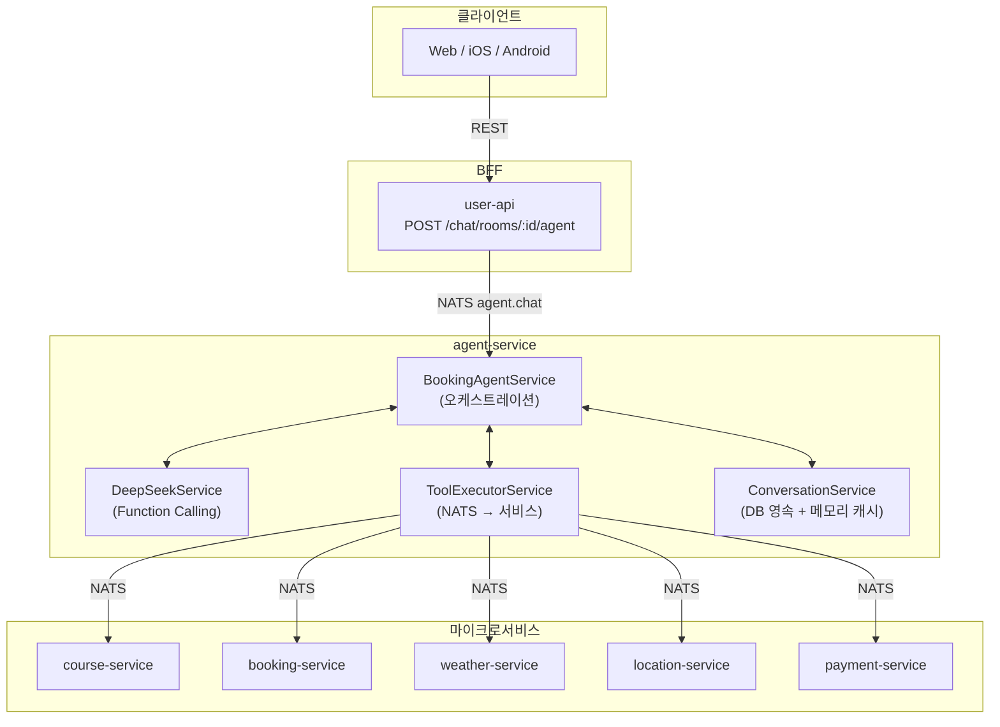
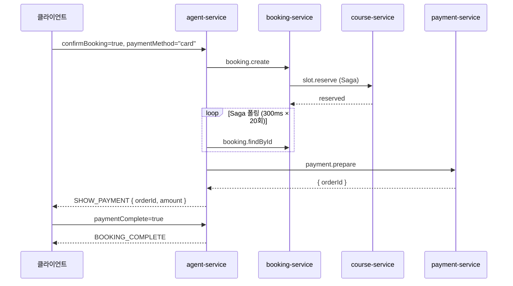
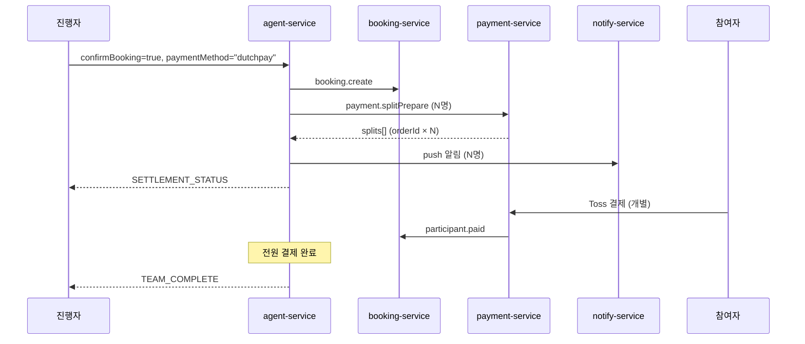
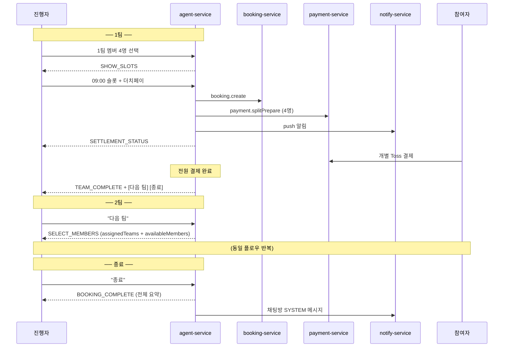

# AI 예약 에이전트 워크플로우

## 1. 개요

사용자가 자연어로 골프장 검색 → 슬롯 선택 → 예약 → 결제까지 진행할 수 있는 AI 어시스턴트.

| 경로 | 설명 | 지연시간 |
|------|------|---------|
| **Direct** | UI 카드 클릭 → LLM 없이 즉시 처리 | ~100ms |
| **LLM** | 자연어 입력 → DeepSeek Function Calling | 2~5s |

```
사용자 입력
  ├─ UI 카드 클릭? → Direct Handler → 즉시 응답
  └─ 자연어 텍스트? → DeepSeek → Tool 실행 → 응답
```

---

## 2. 아키텍처



---

## 3. 대화 컨텍스트

### 3.1 영속화

대화 컨텍스트를 DB에 저장하여 페이지 이탈/재진입, 서버 재배포 시에도 대화를 이어간다.

```prisma
model AgentConversation {
  id          String   @id @default(uuid())
  userId      Int
  chatRoomId  String
  state       String   // ConversationState
  context     Json     // slots, completedTeams, messages 등
  createdAt   DateTime @default(now())
  updatedAt   DateTime @updatedAt

  @@unique([userId, chatRoomId])
  @@index([chatRoomId])
}
```

- **키**: `userId + chatRoomId` → 채팅방 진입만으로 자동 복원, 프론트엔드가 conversationId를 관리할 필요 없음
- **저장소**: DB(영속) + NodeCache(읽기 캐시, TTL 5분)
- **정리**: state = COMPLETED/CANCELLED이고 24시간 경과 시 삭제

### 3.2 ConversationContext

```typescript
{
  userId: number
  chatRoomId: string
  state: ConversationState
  messages: { role, content, timestamp }[]
  slots: {
    location?, clubName?, clubId?, date?, time?,
    slotId?, playerCount?, confirmed?,
    latitude?, longitude?, bookingId?,
    // 그룹 예약
    groupMode?: boolean
    currentTeamNumber?: number
    completedTeams?: Array<{
      teamNumber: number; bookingId: number;
      slotId: string; slotTime: string; courseName: string;
      members: Array<{ userId: number; userName: string }>
    }>
    currentTeamMembers?: Array<{ userId: number; userName: string; userEmail: string }>
  }
}
```

### 3.3 대화 복원 (페이지 재진입)

```
채팅방 진입 → 메시지 로드
  → 최근 AI_ASSISTANT 메시지의 metadata.state 확인
  ├─ IDLE / COMPLETED → 복원 불필요
  └─ 그 외 → AI 모드 자동 ON → agent-service가 DB에서 컨텍스트 복원
```

| 역할 | 복원 방식 |
|------|---------|
| 진행자 | `userId + chatRoomId`로 DB에서 컨텍스트 복원 → 마지막 상태 카드 재표시 |
| 참여자 | push 알림 딥링크로 결제 페이지 직접 접근 (대화 복원 불필요) |

---

## 4. 대화 상태 머신

### 싱글 예약

```
IDLE → COLLECTING → CONFIRMING → BOOKING → COMPLETED
                        ↓                      ↑
                    CANCELLED ─────────→ COLLECTING
```

### 그룹 예약 (싱글 확장)

```
IDLE → COLLECTING → SELECTING_MEMBERS → CONFIRMING → BOOKING → SETTLING → TEAM_COMPLETE
                                                                               ↓
                                                                    "다음 팀" → SELECTING_MEMBERS
                                                                    "종료"   → COMPLETED
```

| 상태 | 의미 | 전이 |
|------|------|------|
| IDLE | 초기 상태 | 첫 메시지 → COLLECTING |
| COLLECTING | 정보 수집 (검색, 카드 표시) | 슬롯 표시 → CONFIRMING |
| SELECTING_MEMBERS | 팀 멤버 선택 중 (그룹) | 확정 → COLLECTING |
| CONFIRMING | 예약 확인 대기 | 확인 → BOOKING |
| BOOKING | 예약 처리 중 (Saga) | 성공 → COMPLETED / SETTLING |
| SETTLING | 더치페이 정산 중 | 전원 결제 → TEAM_COMPLETE |
| TEAM_COMPLETE | 1팀 예약 완료 | 다음 팀 / 종료 |
| COMPLETED | 예약 완료 | 종료 |
| CANCELLED | 사용자 취소 | → COLLECTING |

---

## 5. Direct Handlers

UI 카드 클릭 시 LLM 없이 즉시 처리. `BookingAgentService.chat()` 진입 시 최우선 검사.

```typescript
// 싱글 예약
if (request.paymentComplete) → handlePaymentComplete()
if (request.confirmBooking)  → handleDirectBooking()
if (request.cancelBooking)   → handleCancelBooking()
if (request.selectedSlotId)  → handleDirectSlotSelect()
if (request.selectedClubId)  → handleDirectClubSelect()
// 그룹 예약
if (request.splitPaymentComplete) → handleSplitPaymentComplete()
if (request.teamMembers)          → handleTeamMemberSelect()
if (request.nextTeam)             → handleNextTeam()
if (request.finishGroup)          → handleFinishGroup()
if (request.sendReminder)         → handleSendReminder()
// 위 모두 해당 없으면
→ processWithLLM()
```

| Handler | 트리거 | 동작 |
|---------|--------|------|
| `handleDirectClubSelect` | 골프장 카드 클릭 | slots에 clubId 저장 → SHOW_SLOTS 카드 |
| `handleDirectSlotSelect` | 슬롯 칩 클릭 | slots에 slotId 저장 → CONFIRM_BOOKING 카드 |
| `handleDirectBooking` | 예약 확인 클릭 | booking.create → Saga 폴링 → 결제 카드 또는 완료 |
| `handlePaymentComplete` | 결제 완료 콜백 | BOOKING_COMPLETE 카드 |
| `handleCancelBooking` | 취소 클릭 | slots 초기화 → COLLECTING |
| `handleTeamMemberSelect` | 멤버 확정 클릭 | 멤버 저장 → SHOW_SLOTS (이전 팀 슬롯 제외) |
| `handleNextTeam` | "다음 팀" 클릭 | teamNumber++ → SELECT_MEMBERS (이전 팀 멤버 제외) |
| `handleFinishGroup` | "종료" 클릭 | BOOKING_COMPLETE + 채팅방 SYSTEM 메시지 |
| `handleSplitPaymentComplete` | 참여자 결제 완료 | 팀 정산 갱신 → 전원 완료 시 TEAM_COMPLETE |
| `handleSendReminder` | 리마인더 버튼 | 미결제 참여자에게 push 알림 |

---

## 6. LLM 처리 (processWithLLM)

자연어 메시지가 Direct Handler에 해당하지 않을 때 실행.

1. DeepSeek에 메시지 + 대화 히스토리 전송
2. `tool_calls` 반환 시 → `ToolExecutorService.executeAll()` (병렬 실행)
3. 도구 결과로 UI 카드(actions) 생성 + slots 업데이트
4. 도구 결과를 DeepSeek에 전달하여 다음 응답 요청
5. 텍스트 응답이 나올 때까지 반복 (최대 5회)

### Function Calling Tools

| 도구 | NATS 패턴 | 대상 |
|------|-----------|------|
| `search_clubs` | `club.search` | course |
| `search_clubs_with_slots` | `games.search` | course |
| `get_club_info` | `clubs.get` | course |
| `get_available_slots` | `games.search` | course |
| `get_nearby_clubs` | `club.findNearby` | course |
| `get_weather` / `get_weather_by_location` | `weather.forecast` | weather |
| `create_booking` | `booking.create` | booking |
| `get_booking_policy` | `policy.*.resolve` | booking |
| `search_address` | `location.search.address` | location |

---

## 7. UI 카드

### 응답 형식

```typescript
{
  message: string
  state: ConversationState
  actions?: Array<{ type: ActionType, data: unknown }>
}
```

### 카드 목록

| ActionType | 용도 | 비고 |
|------------|------|------|
| `SHOW_CLUBS` | 골프장 목록 | 클릭 → handleDirectClubSelect |
| `SHOW_SLOTS` | 타임슬롯 목록 | 클릭 → handleDirectSlotSelect |
| `SHOW_WEATHER` | 날씨 정보 | 정보 표시만 |
| `CONFIRM_BOOKING` | 예약 확인 + 결제방법 | 현장결제 / 카드결제 / 더치페이 |
| `SHOW_PAYMENT` | 카드결제 (Toss SDK) | 10분 타이머 |
| `BOOKING_COMPLETE` | 예약 완료 | 싱글: 단건 / 그룹: 전체 요약 |
| `SELECT_MEMBERS` | 팀 멤버 선택 (그룹) | 이전 팀 배정 현황 표시 |
| `SETTLEMENT_STATUS` | 더치페이 현황 (그룹) | 리마인더/새로고침 버튼 |
| `SPLIT_PAYMENT` | 참여자 개별 결제 (그룹) | push 알림으로 전달 |
| `TEAM_COMPLETE` | 팀 예약 완료 (그룹) | 다음 팀/종료 버튼 |

### 카드 데이터

**SHOW_CLUBS**: `{ found, clubs: [{ id, name, address, region }] }`

**SHOW_SLOTS**:
```json
{
  "clubName": "한밭파크골프장", "clubAddress": "...", "date": "2026-02-28",
  "rounds": [{ "gameId": 1, "name": "A코스 오전", "price": 15000,
    "slots": [{ "id": 1, "time": "09:00", "availableSpots": 4, "price": 15000 }]
  }]
}
```

**CONFIRM_BOOKING**: `{ clubName, date, time, playerCount, price, courseName? }`

**SHOW_PAYMENT**: `{ bookingId, orderId, amount, orderName, clubName, date, time, playerCount }`

**BOOKING_COMPLETE**: `{ success, bookingId, bookingNumber, details: { date, time, playerCount, totalPrice } }`

**SELECT_MEMBERS**:
```json
{
  "teamNumber": 2, "clubName": "...", "date": "2026-02-28", "maxPlayers": 4,
  "assignedTeams": [{ "teamNumber": 1, "slotTime": "09:00", "courseName": "A코스",
    "members": [{ "userId": 1, "userName": "김민수" }]
  }],
  "availableMembers": [{ "userId": 5, "userName": "정우진", "userEmail": "..." }]
}
```

**SETTLEMENT_STATUS**: `{ teamNumber, clubName, date, slotTime, totalPrice, pricePerPerson, participants: [{ userId, userName, amount, status }] }`

**TEAM_COMPLETE**: `{ teamNumber, bookingId, bookingNumber, clubName, date, slotTime, courseName, participants, totalPrice, paymentMethod, hasMoreTeams }`

### 카드 인터랙션

| 사용자 액션 | 구조화 요청 필드 |
|-------------|----------------|
| 골프장 선택 | `selectedClubId`, `selectedClubName` |
| 슬롯 선택 | `selectedSlotId`, `selectedSlotTime`, `selectedSlotPrice` |
| 예약 확인 | `confirmBooking=true`, `paymentMethod` |
| 예약 취소 | `cancelBooking=true` |
| 결제 완료 | `paymentComplete=true`, `paymentSuccess` |
| 멤버 확정 (그룹) | `teamMembers: [{ userId, userName, userEmail }]` |
| 다음 팀 (그룹) | `nextTeam=true` |
| 종료 (그룹) | `finishGroup=true` |
| 더치페이 결제 완료 | `splitPaymentComplete=true`, `splitOrderId` |
| 리마인더 (그룹) | `sendReminder=true` |

---

## 8. 결제

### 8.1 카드결제 원샷 플로우



### 8.2 더치페이 플로우



| 시점 | 동작 |
|------|------|
| 슬롯 확보 시 | `expiredAt` = 현재 + 30분 |
| 만료 10분 전 | 미결제 참여자에게 리마인더 (job-service) |
| 만료 시 | PaymentSplit → EXPIRED, slot.release |

---

## 9. NATS 패턴

### Inbound

| 패턴 | 설명 |
|------|------|
| `agent.chat` | 메인 대화 처리 |
| `agent.reset` | 대화 초기화 |
| `agent.status` | 대화 상태 조회 |

### Outbound

| 패턴 | 대상 | 용도 |
|------|------|------|
| `club.search` | course | 골프장 검색 |
| `games.search` | course | 슬롯 검색 |
| `clubs.get` | course | 골프장 상세 |
| `club.findNearby` | course | 근처 골프장 |
| `booking.create` | booking | 예약 생성 (Saga) |
| `booking.findById` | booking | Saga 폴링 |
| `policy.*.resolve` | booking | 예약 정책 조회 |
| `payment.prepare` | payment | 카드결제 준비 |
| `payment.splitPrepare` | payment | 더치페이 준비 |
| `payment.splitConfirm` | payment | 더치페이 결제 확인 |
| `booking.participant.paid` | booking | 참여자 결제 완료 |
| `weather.forecast` | weather | 날씨 조회 |
| `location.search.address` | location | 주소 검색 |
| `chat.room.getMembers` | chat | 채팅방 멤버 조회 |
| `chat.messages.save` | chat | SYSTEM 메시지 저장 |
| `notify.sendBatch` | notify | push 알림 |

---

## 10. 메시지 타입과 가시성

| DB 타입 | 용도 | 누가 보는가 |
|---------|------|-----------|
| TEXT | 일반 채팅 | 채팅방 전체 |
| IMAGE | 이미지 | 채팅방 전체 |
| SYSTEM | 입장/퇴장/예약완료 안내 | 채팅방 전체 |
| AI_USER | AI 모드 사용자 메시지 | **본인만** (senderId 필터) |
| AI_ASSISTANT | AI 응답 + metadata(actions) | **본인만** (senderId 필터) |

> AI 메시지의 `metadata`에 `{ state, actions }` JSON을 저장하여 새로고침 후에도 카드를 복원.

---

## 11. 싱글 예약 플로우 요약

```
① "내일 강남 근처 골프장 알려줘"
   → LLM: search_clubs_with_slots → SHOW_CLUBS 카드

② [골프장 카드 클릭]
   → Direct: handleDirectClubSelect → SHOW_SLOTS 카드

③ [슬롯 칩 클릭]
   → Direct: handleDirectSlotSelect → CONFIRM_BOOKING 카드

④ [확인 + 카드결제]
   → Direct: handleDirectBooking → Saga → SHOW_PAYMENT 카드

⑤ [Toss 결제 완료]
   → Direct: handlePaymentComplete → BOOKING_COMPLETE 카드
```

---

## 12. 그룹 예약 + 더치페이

### 12.1 개요

동호회 채팅방에서 **팀 단위 예약**을 순차 진행. 1팀 = 1카드 = 1예약 플로우.

| 사용자 입력 | AI 동작 |
|-----------|---------|
| "내일 천안 예약해줘" | 싱글 예약 (섹션 11) |
| "내일 천안 3팀 예약해줘" | 그룹 예약 → 1팀부터 순차 |
| 싱글 완료 후 "한 팀 더" | 다음 팀 진행 |

### 12.2 플로우

```
┌─────────────────────────────────────────┐
│ 🔄 팀별 반복                              │
│  ① SELECT_MEMBERS → 멤버 4명 선택        │
│  ② SHOW_SLOTS     → 슬롯 선택            │
│  ③ CONFIRM_BOOKING → 결제방법 선택        │
│  ④ SETTLEMENT_STATUS → 더치페이 결제      │
│  ⑤ TEAM_COMPLETE  → [다음 팀] [종료]      │
└─────────────────────────────────────────┘
         ↓ 종료 시
SYSTEM 메시지로 채팅방 전체에 예약완료 안내
```

### 12.3 멤버 선택 규칙

| 규칙 | 내용 |
|------|------|
| 진행자 고정 | 1팀에 자동 선택 (🔒), 2팀 이후는 선택 가능 |
| 이전 팀 표시 | ✅ + 팀번호/슬롯 정보와 함께 비활성 (중복 방지) |
| 섹션 구분 | "N팀 배정완료" / "미배정" 섹션으로 분리 |
| 인원 | 최소 1명, 최대 4명 (availableSpots) |

### 12.4 DB 스키마

**booking-service**:
```prisma
model Booking {
  // ... 기존 필드
  teamLabel       String?              // "1팀", "2팀" (그룹 예약 시)
  chatRoomId      String?              // 채팅방 ID (그룹 추적용)
  participants    BookingParticipant[]
}

model BookingParticipant {
  id          Int               @id @default(autoincrement())
  bookingId   Int
  userId      Int
  userName    String
  userEmail   String
  role        ParticipantRole   @default(MEMBER)  // BOOKER | MEMBER
  status      ParticipantStatus @default(PENDING) // PENDING | PAID | CANCELLED | REFUNDED
  amount      Int
  paidAt      DateTime?
  createdAt   DateTime          @default(now())
  updatedAt   DateTime          @updatedAt

  booking     Booking           @relation(fields: [bookingId], references: [id])
  @@unique([bookingId, userId])
}
```

**payment-service**:
```prisma
model PaymentSplit {
  id          Int         @id @default(autoincrement())
  bookingId   Int
  userId      Int
  userName    String
  userEmail   String
  amount      Int
  status      SplitStatus @default(PENDING) // PENDING | PAID | EXPIRED | CANCELLED | REFUNDED
  orderId     String      @unique
  paidAt      DateTime?
  expiredAt   DateTime?
  createdAt   DateTime    @default(now())
  updatedAt   DateTime    @updatedAt

  @@index([bookingId, status])
}
```

### 12.5 시퀀스 다이어그램



---

## 13. 컴포넌트 파일 위치

| 플랫폼 | 경로 |
|--------|------|
| Web 카드 | `apps/user-app-web/src/components/features/chat/cards/*.tsx` |
| Web 버블 | `apps/user-app-web/src/components/features/chat/AiMessageBubble.tsx` |
| Web 페이지 | `apps/user-app-web/src/pages/ChatRoomPage.tsx` |
| Web 훅 | `apps/user-app-web/src/hooks/useAiChat.ts` |
| Android 카드 | `apps/user-app-android/.../chat/components/cards/*.kt` |
| Android VM | `apps/user-app-android/.../chat/ChatViewModel.kt` |

---

**Last Updated**: 2026-02-28
