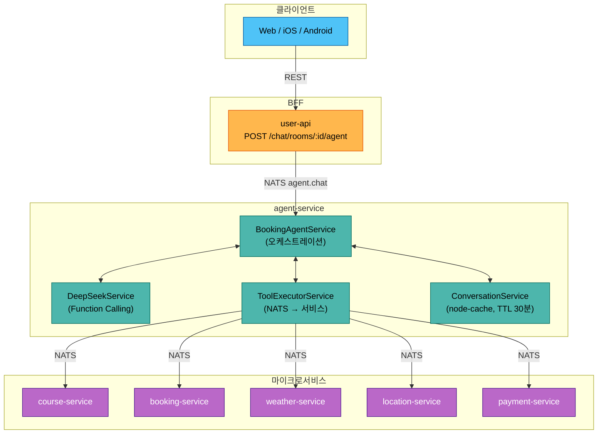
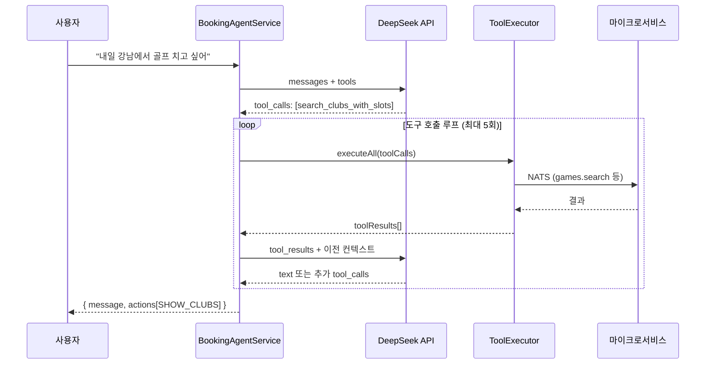
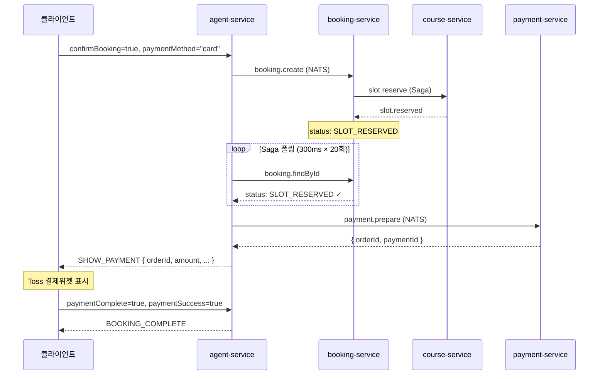

# AI 예약 에이전트 워크플로우

## 1. 개요

사용자가 자연어로 골프장 검색 → 슬롯 선택 → 예약 → 결제까지 진행할 수 있는 AI 어시스턴트.

**핵심 설계**: Direct Handling + LLM 하이브리드

| 경로 | 설명 | 지연시간 |
|------|------|---------|
| **Direct** | UI 카드 클릭 → LLM 없이 즉시 처리 | ~100ms |
| **LLM** | 자연어 입력 → DeepSeek Function Calling | 2~5s |

```
사용자 입력
  ├─ UI 카드 클릭? → Direct Handler (5종) → 즉시 응답
  └─ 자연어 텍스트? → DeepSeek → Tool 실행 → 응답
```

---

## 2. 아키텍처



---

## 3. 대화 상태 머신

```
IDLE → COLLECTING → CONFIRMING → BOOKING → COMPLETED
                        ↓                      ↑
                    CANCELLED ─────────→ COLLECTING
```

| 상태 | 의미 | 전이 조건 |
|------|------|----------|
| IDLE | 초기 상태 | 첫 메시지 수신 → COLLECTING |
| COLLECTING | 정보 수집 중 (골프장 검색, 카드 표시) | 슬롯 표시 → CONFIRMING |
| CONFIRMING | 예약 확인 대기 (슬롯 선택, 확인 카드) | 확인 클릭 → BOOKING |
| BOOKING | 예약 처리 중 (Saga 진행) | 성공 → COMPLETED |
| COMPLETED | 예약 완료 | 종료 |
| CANCELLED | 사용자 취소 | 자동 → COLLECTING |

---

## 4. Direct Handlers (LLM 우회)

UI 카드 클릭 시 LLM을 거치지 않고 즉시 처리. `BookingAgentService.chat()` 진입 시 최우선 검사.

```typescript
if (request.paymentComplete) → handlePaymentComplete()
if (request.confirmBooking)  → handleDirectBooking()
if (request.cancelBooking)   → handleCancelBooking()
if (request.selectedSlotId)  → handleDirectSlotSelect()
if (request.selectedClubId)  → handleDirectClubSelect()
// 위 모두 해당 없으면 → processWithLLM()
```

### 4.1 handleDirectClubSelect

```
골프장 카드 클릭 → slots에 clubId 저장
  → get_available_slots (NATS: games.search)
  → 슬롯 있으면: SHOW_SLOTS 카드 + state=CONFIRMING
  → 슬롯 없으면: 안내 메시지 + state=COLLECTING
```

### 4.2 handleDirectSlotSelect

```
슬롯 카드 클릭 → slots에 slotId/time 저장
  → 가격 계산 (slotPrice × playerCount)
  → CONFIRM_BOOKING 카드 + state=CONFIRMING
  (NATS 호출 없음, 동기 처리)
```

### 4.3 handleDirectBooking

```
확인 버튼 클릭 → state=BOOKING
  → create_booking (NATS: booking.create)
  → Saga 폴링 (300ms × 20회, 최대 6초)
  ┌─ CONFIRMED (현장결제): BOOKING_COMPLETE 카드 + state=COMPLETED
  ├─ SLOT_RESERVED (카드결제): payment.prepare → SHOW_PAYMENT 카드 (orderId 포함)
  └─ PENDING (타임아웃): BOOKING_COMPLETE 카드 + "처리 중" 메시지
```

### 4.4 handlePaymentComplete

```
결제 완료 콜백 (paymentSuccess: true/false)
  → 성공: BOOKING_COMPLETE 카드 + state=COMPLETED
  → 실패: 재시도 안내 + state=CONFIRMING
  (NATS 호출 없음, 동기 처리)
```

### 4.5 handleCancelBooking

```
취소 버튼 클릭 → slots 초기화
  → state=COLLECTING, 안내 메시지
  (NATS 호출 없음, 동기 처리)
```

---

## 5. LLM 처리 (processWithLLM)

자연어 메시지가 Direct Handler에 해당하지 않을 때 실행.



### 도구 호출 루프

1. DeepSeek에 메시지 + 대화 히스토리 전송
2. `tool_calls` 반환 시 → `ToolExecutorService.executeAll()` (병렬 실행)
3. 도구 결과로 UI 카드(actions) 생성 + slots 업데이트
4. 도구 결과를 DeepSeek에 전달하여 다음 응답 요청
5. 텍스트 응답이 나올 때까지 반복 (최대 5회)

---

## 6. Function Calling Tools

| 도구 | 매개변수 | NATS 패턴 | 대상 서비스 |
|------|---------|-----------|-----------|
| `search_clubs` | location, name? | `club.search` | course |
| `search_clubs_with_slots` | location, date, name?, timePreference?, playerCount? | `games.search` | course |
| `get_club_info` | clubId | `clubs.get` | course |
| `get_weather` | clubId, date | `weather.forecast` | weather |
| `get_available_slots` | clubId, date, timePreference? | `games.search` | course |
| `create_booking` | clubId, slotId, playerCount | `booking.create` | booking |
| `get_booking_policy` | clubId, policyType? | `policy.*.resolve` | booking |
| `search_address` | address | `location.search.address` | location |
| `get_nearby_clubs` | latitude, longitude, radius? | `club.findNearby` | course |

---

## 7. UI 카드 시스템

### 응답 형식

```typescript
{
  conversationId: string
  message: string                // AI 텍스트 메시지
  state: ConversationState       // 현재 상태
  actions?: ChatAction[]         // UI 카드 배열 (없으면 텍스트만)
}

interface ChatAction {
  type: ActionType
  data: unknown                  // 카드 타입별 페이로드
}
```

### 카드 타입

| ActionType | 용도 | 트리거 |
|------------|------|--------|
| `SHOW_CLUBS` | 골프장 목록 카드 | search_clubs, search_clubs_with_slots |
| `SHOW_SLOTS` | 타임슬롯 목록 카드 | get_available_slots, handleDirectClubSelect |
| `SHOW_WEATHER` | 날씨 정보 카드 | get_weather |
| `CONFIRM_BOOKING` | 예약 확인 카드 (확인/취소 버튼) | handleDirectSlotSelect |
| `SHOW_PAYMENT` | 결제 모달 트리거 (orderId 포함) | handleDirectBooking (카드결제) |
| `BOOKING_COMPLETE` | 예약 완료 카드 | handleDirectBooking, handlePaymentComplete |

### 카드 데이터 예시

**SHOW_CLUBS**: `{ found, clubs: [{ id, name, address, region }] }`

**SHOW_SLOTS**: `{ date, availableCount, slots: [{ id, time, endTime, availableSpots, price, courseName }] }`

**CONFIRM_BOOKING**: `{ clubName, date, time, playerCount, price }`

**SHOW_PAYMENT**: `{ bookingId, orderId, amount, orderName, clubName, date, time, playerCount }`

**BOOKING_COMPLETE**: `{ success, bookingId, bookingNumber, status, message, details: { date, time, playerCount, totalPrice } }`

---

## 8. 결제 원샷 플로우

카드결제 시 Agent가 `booking.create` → Saga 폴링 → `payment.prepare`를 한 번에 처리하여, 프론트엔드는 orderId가 포함된 SHOW_PAYMENT 카드만 받으면 바로 Toss 결제위젯을 띄울 수 있음.



`payment.prepare` 실패 시 `orderId: null`로 graceful degradation (프론트엔드 fallback).

---

## 9. NATS 메시지 패턴

### Inbound (agent-service가 수신)

| 패턴 | 설명 |
|------|------|
| `agent.chat` | 메인 대화 처리 (Direct + LLM) |
| `agent.reset` | 대화 초기화, 환영 메시지 반환 |
| `agent.status` | 대화 상태 조회 (state, slots, messageCount) |
| `agent.stats` | 캐시 통계 (keys, hits, misses) |

### Outbound (agent-service가 발신)

| 패턴 | 대상 서비스 | 도구 |
|------|-----------|------|
| `club.search` | course-service | search_clubs |
| `games.search` | course-service | search_clubs_with_slots, get_available_slots |
| `clubs.get` | course-service | get_club_info |
| `club.findNearby` | course-service | get_nearby_clubs |
| `booking.create` | booking-service | create_booking |
| `booking.findById` | booking-service | Saga 폴링 |
| `policy.*.resolve` | booking-service | get_booking_policy |
| `payment.prepare` | payment-service | 원샷 결제 준비 |
| `weather.forecast` | weather-service | get_weather |
| `location.search.address` | location-service | search_address |

---

## 10. 세션 관리

| 항목 | 값 |
|------|-----|
| 저장소 | node-cache (인메모리) |
| TTL | 30분 (CONVERSATION_TTL 환경변수) |
| 히스토리 | 최근 10턴 (MAX_HISTORY_TURNS 환경변수) |
| 캐시 키 | `conv:{userId}:{conversationId}` |

### ConversationContext

```typescript
{
  conversationId: string       // UUID v4
  userId: number
  state: ConversationState
  messages: { role, content, timestamp }[]
  slots: {
    location?, clubName?, clubId?, date?, time?,
    slotId?, playerCount?, confirmed?,
    latitude?, longitude?, bookingId?
  }
  createdAt: Date
  updatedAt: Date
}
```

---

## 11. 전체 예약 플로우 (요약)

```
① 사용자: "내일 강남 근처 골프장 알려줘"
   → LLM: search_clubs_with_slots → SHOW_CLUBS 카드

② 사용자: [골프장 카드 클릭]
   → Direct: handleDirectClubSelect → SHOW_SLOTS 카드

③ 사용자: [슬롯 카드 클릭]
   → Direct: handleDirectSlotSelect → CONFIRM_BOOKING 카드

④ 사용자: [확인 버튼 클릭 + paymentMethod=card]
   → Direct: handleDirectBooking → Saga → payment.prepare → SHOW_PAYMENT 카드

⑤ 사용자: [Toss 결제 완료]
   → Direct: handlePaymentComplete → BOOKING_COMPLETE 카드
```

> 대부분의 인터랙션은 **Direct Handler**(②~⑤)로 처리되어 LLM 지연 없이 즉시 응답.
> LLM은 자연어 해석이 필요한 **최초 검색**(①)과 **추가 질문**에만 사용.

---

**Last Updated**: 2026-02-24
